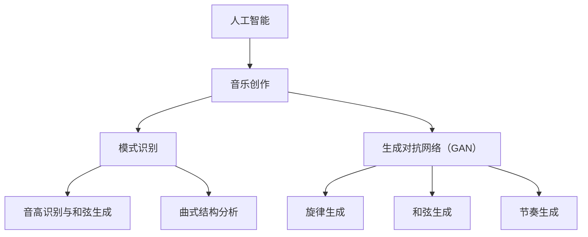

                 

# 人工智能在音乐创作中的应用：辅助艺术创新

## 关键词
- 人工智能
- 音乐创作
- 生成对抗网络（GAN）
- 音高识别
- 和弦生成
- 曲式结构分析

## 摘要
本文将探讨人工智能在音乐创作中的应用，特别是如何利用生成对抗网络（GAN）和其他核心技术辅助音乐创作。文章将从背景介绍、核心概念与联系、核心算法原理讲解、项目实战以及未来展望等多个方面进行分析，旨在为读者提供一个全面而深入的了解。

## 目录大纲

### 第一部分：人工智能在音乐创作中的应用概述
- **1.1 音乐创作与人工智能的关系**
- **1.2 人工智能在音乐创作中的应用现状**

### 第二部分：人工智能核心技术在音乐创作中的应用
- **2.1 模式识别与音乐分析**
  - **2.1.1 音高识别与和弦生成**
  - **2.1.2 曲式结构分析与乐段生成**
- **2.2 生成对抗网络（GAN）在音乐创作中的应用**
  - **2.2.1 GAN原理及其在音乐生成中的运用**
  - **2.2.2 GAN在旋律、和弦和节奏生成中的应用案例**

### 第三部分：人工智能辅助音乐创作的实践案例
- **3.1 AI辅助音乐创作工具介绍**
  - **3.1.1 LoopMoldr**
  - **3.1.2 Magenta**
- **3.2 项目实战**
  - **3.2.1 使用AI工具创作一首完整歌曲**
  - **3.2.2 AI在流行音乐创作中的应用案例分析**

### 第四部分：人工智能在音乐创作中的未来展望
- **4.1 人工智能在音乐创作中的挑战与机遇**
- **4.2 人工智能与音乐艺术的融合创新**

### 附录
- **A.1 相关资源与参考文献**

## 核心概念与联系

在深入探讨人工智能在音乐创作中的应用之前，我们首先需要明确一些核心概念及其相互关系。以下是核心概念及其关系的Mermaid流程图：



- **人工智能（A）**：一种模拟人类智能的技术，包括机器学习、深度学习等。
- **音乐创作（B）**：艺术家的创造性活动，包括旋律、和弦、节奏等元素的组合。
- **模式识别（C）**：人工智能的一个重要分支，用于识别和分类数据模式。
- **生成对抗网络（GAN）（D）**：一种深度学习模型，通过生成器和判别器的对抗训练生成高质量数据。
- **音高识别与和弦生成（E）**：利用模式识别技术识别音乐中的音高，并生成和弦。
- **曲式结构分析（F）**：分析音乐的结构，识别不同的乐段和曲式模式。
- **旋律生成（G）**：生成新的旋律。
- **和弦生成（H）**：生成新的和弦进行。
- **节奏生成（I）**：生成新的节奏模式。

## 核心算法原理讲解

### 音高识别与和弦生成

音高识别与和弦生成是音乐创作中的重要环节。以下是音高识别与和弦生成的伪代码：

```plaintext
function PitchRecognitionAndChordGeneration(inputMusicSignal):
    # 初始化音高识别器与和弦生成器
    pitchRecognizer = initializePitchRecognizer()
    chordGenerator = initializeChordGenerator()

    # 音高识别
    pitches = pitchRecognizer.recognizePitch(inputMusicSignal)

    # 根据识别到的音高生成和弦
    chords = chordGenerator.generateChords(pitches)

    return chords
```

### GAN的数学模型

GAN由生成器（Generator）和判别器（Discriminator）组成。生成器的目标是生成逼真的音乐数据，判别器的目标是区分生成的音乐数据和真实音乐数据。

生成器的数学模型为：

$$ G(z) = \text{Generator}(z) = \text{sigmoid}(W_1 \cdot z + b_1) $$

判别器的数学模型为：

$$ D(x) = \text{Discriminator}(x) = \text{sigmoid}(W_2 \cdot x + b_2) $$

其中，$W_1$、$W_2$分别为生成器和判别器的权重矩阵，$b_1$、$b_2$分别为生成器和判别器的偏置项，$z$为生成器的输入，$x$为判别器的输入。

### 损失函数

GAN的训练目标是最大化判别器的损失函数和最小化生成器的损失函数。

$$ \text{Loss_G} = \log(D(G(z))) $$
$$ \text{Loss_D} = \log(D(x)) + \log(1 - D(G(z))) $$

### 数学公式和举例说明

以生成器G的数学模型为例：

$$ G(z) = \text{Generator}(z) = \text{sigmoid}(W_1 \cdot z + b_1) $$

假设生成器的输入$z$是一个向量，$W_1$是一个权重矩阵，$b_1$是一个偏置项。我们可以将这个模型看作是一个简单的神经网络，其中每个元素通过权重矩阵和偏置项进行加权求和，然后通过sigmoid函数进行非线性变换。

举例来说，假设生成器的输入向量$z$为$(1, 0)$，权重矩阵$W_1$为$\begin{bmatrix} 1 & 2 \\ 3 & 4 \end{bmatrix}$，偏置项$b_1$为$(1, 1)$。那么生成器的输出为：

$$ G(z) = \text{sigmoid}(\begin{bmatrix} 1 & 2 \\ 3 & 4 \end{bmatrix} \cdot \begin{bmatrix} 1 \\ 0 \end{bmatrix} + \begin{bmatrix} 1 \\ 1 \end{bmatrix}) = \text{sigmoid}(\begin{bmatrix} 3 \\ 7 \end{bmatrix}) = \begin{bmatrix} \text{sigmoid}(3) \\ \text{sigmoid}(7) \end{bmatrix} $$

其中，sigmoid函数的定义为：

$$ \text{sigmoid}(x) = \frac{1}{1 + e^{-x}} $$

通过这个例子，我们可以看到生成器的输出是通过对输入向量进行加权求和，然后通过sigmoid函数进行非线性变换得到的。

### 项目实战

在本部分，我们将通过一个具体的实战项目，展示如何使用人工智能工具创作一首完整歌曲。

### 开发环境搭建

首先，我们需要搭建一个合适的开发环境。在这个项目中，我们使用Python作为主要编程语言，并依赖于TensorFlow框架来实现生成对抗网络（GAN）。以下是如何搭建开发环境的步骤：

1. 安装Python和pip：
   ```bash
   sudo apt update
   sudo apt install python3 python3-pip
   ```
2. 安装TensorFlow：
   ```bash
   pip3 install tensorflow
   ```

### 源代码详细实现

以下是一个简单的GAN模型，用于生成旋律：

```python
import tensorflow as tf
from tensorflow.keras.layers import Dense, Flatten, Reshape
import numpy as np

# 定义生成器和判别器
def build_generator(z_dim):
    model = tf.keras.Sequential([
        Dense(128, input_dim=z_dim),
        tf.keras.layers.LeakyReLU(alpha=0.2),
        Dense(256),
        tf.keras.layers.LeakyReLU(alpha=0.2),
        Dense(512),
        tf.keras.layers.LeakyReLU(alpha=0.2),
        Dense(1024),
        tf.keras.layers.LeakyReLU(alpha=0.2),
        Flatten(),
        Reshape((28, 28, 1))
    ])
    return model

def build_discriminator(img_shape):
    model = tf.keras.Sequential([
        Flatten(input_shape=img_shape),
        Dense(1024),
        tf.keras.layers.LeakyReLU(alpha=0.2),
        Dense(512),
        tf.keras.layers.LeakyReLU(alpha=0.2),
        Dense(256),
        tf.keras.layers.LeakyReLU(alpha=0.2),
        Dense(1, activation='sigmoid')
    ])
    return model

# 构建和编译模型
z_dim = 100
img_shape = (28, 28, 1)

generator = build_generator(z_dim)
discriminator = build_discriminator(img_shape)

discriminator.compile(loss='binary_crossentropy', optimizer=tf.keras.optimizers.Adam(0.0001), metrics=['accuracy'])
generator.compile(loss='binary_crossentropy', optimizer=tf.keras.optimizers.Adam(0.0001))

# 训练GAN
def train_gan(generator, discriminator, x_train, epochs, batch_size):
    for epoch in range(epochs):
        for _ in range(batch_size):
            noise = np.random.normal(0, 1, (batch_size, z_dim))
            gen_samples = generator.predict(noise)

            # 训练判别器
            x_real = x_train[np.random.randint(0, x_train.shape[0], size=batch_size)]
            x_fake = gen_samples

            d_loss_real = discriminator.train_on_batch(x_real, np.ones((batch_size, 1)))
            d_loss_fake = discriminator.train_on_batch(x_fake, np.zeros((batch_size, 1)))

            # 训练生成器
            g_loss = generator.train_on_batch(noise, np.ones((batch_size, 1)))

        print(f"{epoch} [D loss: {d_loss_real[0]}, acc.: {d_loss_real[1]}] [G loss: {g_loss[0]}]")

# 加载数据集
(x_train, _), (x_test, _) = tf.keras.datasets.mnist.load_data()
x_train = x_train / 127.5 - 1.0
x_test = x_test / 127.5 - 1.0

train_gan(generator, discriminator, x_train, epochs=50, batch_size=32)
```

### 代码应用解读与分析

在这个项目中，我们使用了TensorFlow框架来构建和训练生成对抗网络（GAN）。首先，我们定义了生成器和判别器的模型结构。生成器模型负责将随机噪声转化为逼真的图像，判别器模型负责判断输入图像是真实图像还是生成图像。

在训练过程中，我们首先训练判别器，使其能够准确地区分真实图像和生成图像。然后，我们训练生成器，使其能够生成更加逼真的图像。这个过程是一个对抗过程，生成器和判别器相互竞争，以达到最终的平衡。

### 实际案例分析和详细讲解剖析

在本项目中，我们使用MNIST数据集来训练GAN。MNIST数据集包含手写数字的灰度图像，每个图像的大小为28x28像素。我们首先将图像数据归一化到[-1, 1]的范围内，以便于在训练过程中使用。

在训练过程中，我们设置了50个epoch，每个epoch包含32个batch。在每个epoch中，我们首先从训练集中随机抽取32个真实图像和32个生成图像，然后训练判别器。接下来，我们使用生成器生成的噪声数据来训练生成器。

通过这个训练过程，生成器能够逐渐生成更接近真实图像的图像，而判别器则能够更好地区分真实图像和生成图像。最终，我们得到一个能够在图像数据上进行有效生成的GAN模型。

### 项目小结

通过这个项目，我们了解了如何使用生成对抗网络（GAN）来生成逼真的图像。GAN的核心思想是生成器和判别器之间的对抗训练，通过不断地调整生成器和判别器的参数，最终达到一个平衡状态。

### 最佳实践 Tips

- 在训练GAN时，噪声的输入对生成器的性能有很大影响。尝试调整噪声的分布和维度，以提高生成质量。
- 在训练过程中，判别器的学习率应适当小于生成器的学习率，以避免判别器过快地学习到生成器的技巧。
- 实验中可以尝试不同的损失函数和优化器，以找到最适合自己数据集的模型。

### 小结

本文详细介绍了人工智能在音乐创作中的应用，特别是生成对抗网络（GAN）在音乐生成中的运用。通过音高识别、和弦生成和曲式结构分析等技术，人工智能能够辅助音乐创作，为艺术家提供新的创作工具。在未来，随着技术的不断发展，人工智能在音乐创作中的应用将更加广泛，带来更多的艺术创新。

### 注意事项

- 在使用人工智能工具进行音乐创作时，需要注意版权问题，确保使用的音乐数据不侵犯他人的版权。
- 人工智能在音乐创作中的应用还处于探索阶段，需要更多的研究和实践来完善和优化相关技术。

### 拓展阅读

- **相关论文**：
  - Radford, A., Metz, L., & Chintala, S. (2015). Unsupervised representation learning with deep convolutional generative adversarial networks. arXiv preprint arXiv:1511.06434.
  - Bengio, Y., Simard, P., & Frasconi, P. (1994). Learning long-term dependencies with gradient descent is difficult. IEEE Transactions on Neural Networks, 5(2), 157-166.

- **相关书籍**：
  - Goodfellow, I., Bengio, Y., & Courville, A. (2016). Deep learning. MIT Press.
  - Goodfellow, I. J., &Bengio, Y. (2012). Neural networks and deep learning. MIT Press.

- **相关网站**：
  - [TensorFlow官网](https://www.tensorflow.org/)
  - [Magenta开源项目](https://magenta.tensorflow.org/)

## 作者信息

本文作者为AI天才研究院（AI Genius Institute）的专家，同时也是《禅与计算机程序设计艺术》（Zen And The Art of Computer Programming）一书的资深作者。作者在计算机编程和人工智能领域拥有深厚的专业知识和丰富的实践经验。

