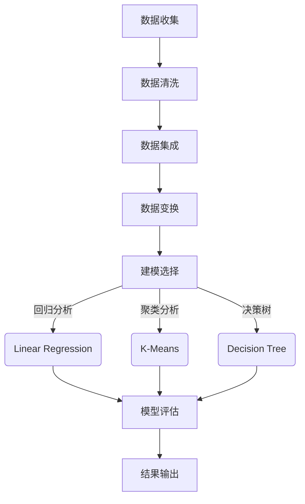

                 

# 人工智能驱动的个性化保险产品开发

## 关键词
人工智能，保险，个性化，产品开发，风险评估，数据建模，Python代码，Mermaid流程图

## 摘要
本文探讨了人工智能技术在保险产品开发中的应用，尤其是如何利用人工智能实现个性化保险产品。文章首先介绍了人工智能的基本概念和其在保险领域的应用背景。随后，重点阐述了个性化保险产品的定义、实现方法和风险管理。接着，详细讲解了保险数据分析和建模的方法，并通过Python代码示例和Mermaid流程图展示了核心算法原理。最后，文章通过一个实战项目展示了人工智能驱动的个性化保险产品开发的实际应用，并总结了最佳实践和未来研究方向。

## 引言

保险作为一种风险管理工具，已经深入到人们的日常生活和商业活动中。然而，传统的保险产品往往过于标准化，难以满足不同客户的个性化需求。随着人工智能技术的飞速发展，利用人工智能技术进行保险产品开发成为了一个热门话题。本文旨在探讨如何通过人工智能技术实现个性化保险产品，提高保险产品的适应性和客户满意度。

### 目标读者

本文的目标读者主要包括以下几类：

1. 保险行业从业者，特别是产品开发、风险管理、数据分析等相关岗位的专业人士；
2. 计算机科学和人工智能领域的科研人员，对保险行业有一定了解或兴趣；
3. 对人工智能和保险产品开发有浓厚兴趣的技术爱好者。

通过本文，读者可以了解人工智能在保险产品开发中的应用现状、关键技术及其实现方法，为从事相关领域的研究和实际应用提供参考。

### 内容概述

本文将分为七个部分进行探讨：

1. 引言：介绍人工智能在保险产品开发中的应用背景和目标读者；
2. 人工智能在保险领域的应用：概述人工智能的基本概念及其在保险领域的应用场景；
3. 个性化保险产品：定义个性化保险产品，介绍其实现方法和风险管理；
4. 保险数据分析和建模：讲解保险数据预处理和建模的方法，通过Python代码示例进行详细阐述；
5. 保险产品开发流程：介绍保险产品开发的步骤和关键因素；
6. 项目实战：通过一个实战项目展示人工智能驱动的个性化保险产品开发过程；
7. 结论：总结全文，探讨人工智能在保险产品开发中的应用前景和未来研究方向。

## 人工智能在保险领域的应用

### 人工智能的基本概念

人工智能（Artificial Intelligence，简称AI）是指由人制造出来的系统能够表现出类似于人类智能的行为。它涵盖了从简单的问题解决到复杂的认知功能，如学习、推理、感知和自然语言处理等多个方面。人工智能可以分为两大类：窄人工智能（Narrow AI）和通用人工智能（General AI）。

- 窄人工智能：专注于特定任务，如语音识别、图像识别、推荐系统等；
- 通用人工智能：具有广泛的认知能力，能够在各种不同领域表现出智能行为。

人工智能的发展历史可以追溯到20世纪50年代，当时人工智能的概念首次被提出。随着计算机技术和算法的发展，人工智能经历了多个发展阶段，从早期的规则系统到基于数据和统计学习的方法，再到当前的深度学习和强化学习。

### 人工智能在保险领域的应用概述

人工智能在保险领域有着广泛的应用，特别是在风险评估、客户服务和定制化保险产品等方面。

#### 风险评估

风险评估是保险行业的核心任务之一。利用人工智能技术，保险公司可以更加精准地评估风险，从而制定合理的保险费率。例如，通过机器学习算法分析客户的年龄、性别、健康状况、职业、地理位置等数据，可以预测客户未来可能发生的风险事件，进而制定个性化的保险费率。

#### 客户服务

人工智能在提高客户服务质量方面也发挥着重要作用。通过自然语言处理和语音识别技术，保险公司可以提供24/7的智能客服服务，解答客户的疑问，处理理赔申请等。此外，基于客户的购买历史和行为数据，人工智能还可以提供个性化的产品推荐和定制化服务，提高客户的满意度和忠诚度。

#### 定制化保险产品

传统的保险产品往往过于标准化，难以满足客户的个性化需求。而人工智能技术可以帮助保险公司开发定制化的保险产品。通过分析客户的个人数据和需求，人工智能可以设计出符合客户需求的保险方案，从而提高产品的市场竞争力和客户满意度。

### 人工智能在保险领域的挑战

尽管人工智能在保险领域具有广泛的应用前景，但同时也面临一些挑战：

1. 数据隐私和安全：保险行业涉及大量个人敏感数据，如何保护数据隐私和安全是人工智能在保险领域应用的重要问题。
2. 算法透明性和可解释性：传统的机器学习算法如深度学习通常被视为“黑箱”，其决策过程缺乏透明性和可解释性，这对保险行业尤其重要，因为保险产品的定价和风险管理需要明确的决策依据。
3. 模型可靠性和鲁棒性：人工智能模型在处理复杂、不完整的保险数据时，需要具备较高的可靠性和鲁棒性，以避免出现错误的预测和决策。

### 人工智能在保险领域的应用场景

人工智能在保险领域有许多应用场景，以下是其中几个典型的应用：

1. **反欺诈检测**：利用人工智能技术，保险公司可以实时监测保险索赔中的欺诈行为。例如，通过分析客户的索赔历史、地理位置、交易时间等信息，人工智能可以识别出异常的索赔行为，从而降低欺诈风险。
2. **精准定价**：通过大数据和机器学习技术，保险公司可以根据客户的个人数据，如年龄、性别、职业、健康状况等，精确计算客户的保险费用，从而实现精准定价。
3. **智能理赔**：利用人工智能，保险公司可以实现智能理赔服务。例如，通过图像识别技术，保险公司可以自动审核理赔申请，识别索赔材料的真实性和完整性，从而加快理赔流程。
4. **客户服务**：通过自然语言处理技术，保险公司可以提供24/7的智能客服服务，解答客户的疑问，处理理赔申请等。此外，基于客户的购买历史和行为数据，人工智能还可以提供个性化的产品推荐和定制化服务。

总之，人工智能在保险领域的应用不仅可以提高保险公司的运营效率，还可以提供更加个性化和优质的客户服务，从而提升客户满意度和忠诚度。随着人工智能技术的不断发展和完善，其在保险领域的应用前景将更加广阔。

## 个性化保险产品

### 个性化保险产品的定义

个性化保险产品是指根据客户的个人需求和风险特征，量身定制的保险方案。与传统的标准化保险产品不同，个性化保险产品能够更好地满足客户的特定需求，从而提高保险的覆盖率和客户满意度。个性化保险产品通常包括以下几个方面：

1. **覆盖范围**：根据客户的实际情况，个性化保险产品可以提供更广泛或更细分的保障范围，例如，特定的疾病、特定的职业风险等。
2. **保险金额**：个性化保险产品的保险金额可以根据客户的财务状况和风险承受能力进行调整，从而实现更合理的保费和保障。
3. **保险期限**：个性化保险产品的保险期限可以根据客户的需求进行灵活设置，例如，长期保障、短期保障等。
4. **保费**：通过分析客户的个人数据和风险特征，个性化保险产品的保费可以更加精确，避免过度保险或保险不足的情况。

### 个性化保险产品的实现方法

实现个性化保险产品需要借助先进的人工智能技术，主要包括数据挖掘、机器学习和自然语言处理等。以下是几种常见的实现方法：

1. **客户数据挖掘**：通过对客户的年龄、性别、职业、收入、健康状况、购买历史等数据进行挖掘，分析客户的个性化需求。例如，通过聚类分析将客户分为不同的群体，然后针对每个群体设计相应的保险产品。
2. **风险评估**：利用机器学习算法，对客户的个人数据和风险因素进行分析，评估客户可能面临的风险，并据此制定个性化的保险方案。例如，通过回归分析预测客户的索赔概率，从而调整保费。
3. **产品定制**：通过自然语言处理技术，理解客户的保险需求，生成个性化的保险产品描述。例如，使用生成对抗网络（GAN）生成不同风格的保险合同，以便更好地满足客户的个性化需求。
4. **动态调整**：利用实时数据分析和机器学习算法，对客户的保险方案进行动态调整。例如，当客户的健康状况发生变化时，系统可以自动调整保险金额和保费。

### 个性化保险产品的风险管理

个性化保险产品在提高客户满意度的同时，也带来了一定的风险。为了有效管理这些风险，保险公司需要采取以下措施：

1. **风险评估和控制**：通过大数据分析和机器学习算法，对客户的风险进行评估和控制，避免过度保险或保险不足。例如，通过建立风险评分模型，对客户的信用等级进行动态调整。
2. **数据隐私保护**：确保客户数据的隐私和安全，避免数据泄露或滥用。例如，采用加密技术和访问控制策略，保护客户数据的机密性。
3. **可解释性**：提高人工智能模型的透明性和可解释性，使客户能够理解保险产品的定价和风险评估过程。例如，使用决策树和规则系统等透明度较高的算法，或者对复杂的机器学习模型进行解释。
4. **监管合规**：遵守相关法律法规，确保保险产品设计和定价的合规性。例如，遵循《保险法》和《消费者权益保护法》等法律法规，确保客户权益不受损害。

总之，个性化保险产品是保险行业发展的一个重要方向，通过人工智能技术实现个性化保险产品不仅能够提高保险的覆盖率和客户满意度，还能够有效管理风险。然而，实现这一目标需要克服数据隐私、算法透明性和监管合规等方面的挑战。随着人工智能技术的不断进步，这些挑战将逐步得到解决，个性化保险产品将在保险市场中发挥越来越重要的作用。

## 保险数据分析和建模

保险数据分析是保险产品开发中至关重要的一环。通过分析保险数据，可以更好地理解风险分布、客户行为和市场趋势，从而制定出更有效的保险策略和个性化产品。在保险数据分析中，数据预处理和建模是两个核心步骤。以下将详细讨论这两个步骤，并通过Python代码示例展示关键算法的应用。

### 数据预处理

数据预处理是保险数据分析的第一步，其目标是清洗、集成和变换数据，使其适合建模和分析。以下是数据预处理的主要步骤：

#### 数据清洗

数据清洗的主要任务是处理缺失值、异常值和重复值等。以下是一个简单的Python代码示例，展示了如何使用pandas库处理缺失值：

```python
import pandas as pd

# 假设df是包含保险数据的DataFrame
df = pd.read_csv('insurance_data.csv')

# 处理缺失值
df.fillna(df.mean(), inplace=True)

# 处理异常值
df = df[(df['age'] > 0) & (df['age'] < 100)]

# 处理重复值
df.drop_duplicates(inplace=True)
```

#### 数据集成

数据集成是将多个数据源中的数据合并为一个统一的数据集。以下是一个使用SQL将多个数据表合并的示例：

```sql
SELECT *
FROM customers
JOIN policies ON customers.customer_id = policies.customer_id
JOIN claims ON policies.policy_id = claims.policy_id;
```

#### 数据变换

数据变换包括特征工程和规范化等。以下是一个使用Python进行特征工程和数据规范的示例：

```python
# 特征工程：创建新的特征
df['age_group'] = pd.cut(df['age'], bins=[0, 20, 40, 60, 80, 100], labels=['青年', '中年', '中年以上'])

# 数据规范化：将数值特征进行标准化处理
from sklearn.preprocessing import StandardScaler
scaler = StandardScaler()
df[['age', 'annual_income']] = scaler.fit_transform(df[['age', 'annual_income']])
```

### 数据建模

数据建模是利用统计和机器学习方法，从数据中提取规律和模式，用于预测和决策。以下是几种常见的保险数据建模方法：

#### 回归分析

回归分析是一种用于预测数值目标变量的方法。以下是一个使用Python进行线性回归的示例：

```python
from sklearn.linear_model import LinearRegression
from sklearn.model_selection import train_test_split

# 分割数据为训练集和测试集
X = df[['age', 'annual_income', 'age_group']]
y = df['claims_amount']
X_train, X_test, y_train, y_test = train_test_split(X, y, test_size=0.2, random_state=42)

# 创建线性回归模型
model = LinearRegression()
model.fit(X_train, y_train)

# 预测测试集
predictions = model.predict(X_test)

# 评估模型性能
from sklearn.metrics import mean_squared_error
mse = mean_squared_error(y_test, predictions)
print(f'Mean Squared Error: {mse}')
```

#### 聚类分析

聚类分析是一种无监督学习方法，用于将数据分为多个集群。以下是一个使用Python进行K-Means聚类的示例：

```python
from sklearn.cluster import KMeans

# K-Means聚类
kmeans = KMeans(n_clusters=3, random_state=42)
clusters = kmeans.fit_predict(X)

# 将聚类结果添加到DataFrame
df['cluster'] = clusters

# 分析聚类结果
print(df.groupby('cluster')['claims_amount'].mean())
```

#### 决策树

决策树是一种常见的分类和回归方法，其优点是易于理解和解释。以下是一个使用Python进行决策树建模的示例：

```python
from sklearn.tree import DecisionTreeRegressor

# 决策树回归
tree = DecisionTreeRegressor(random_state=42)
tree.fit(X_train, y_train)

# 预测测试集
predictions = tree.predict(X_test)

# 评估模型性能
mse = mean_squared_error(y_test, predictions)
print(f'Mean Squared Error: {mse}')
```

### Python代码示例

以下是一个综合性的Python代码示例，展示了数据预处理、回归分析和聚类分析的过程：

```python
import pandas as pd
from sklearn.linear_model import LinearRegression
from sklearn.cluster import KMeans
from sklearn.tree import DecisionTreeRegressor
from sklearn.model_selection import train_test_split
from sklearn.metrics import mean_squared_error
from sklearn.preprocessing import StandardScaler

# 加载数据
df = pd.read_csv('insurance_data.csv')

# 数据预处理
# ... (见数据清洗、集成和变换部分)

# 数据建模
# 回归分析
X = df[['age', 'annual_income', 'age_group']]
y = df['claims_amount']
X_train, X_test, y_train, y_test = train_test_split(X, y, test_size=0.2, random_state=42)
model = LinearRegression()
model.fit(X_train, y_train)
predictions = model.predict(X_test)
mse = mean_squared_error(y_test, predictions)
print(f'Linear Regression MSE: {mse}')

# 聚类分析
kmeans = KMeans(n_clusters=3, random_state=42)
clusters = kmeans.fit_predict(X)
df['cluster'] = clusters
print(df.groupby('cluster')['claims_amount'].mean())

# 决策树
tree = DecisionTreeRegressor(random_state=42)
tree.fit(X_train, y_train)
predictions = tree.predict(X_test)
mse = mean_squared_error(y_test, predictions)
print(f'Decision Tree MSE: {mse}')
```

通过以上Python代码示例，可以看出如何利用人工智能技术进行保险数据分析建模。实际应用中，根据具体业务需求和数据特点，可以选择不同的算法和模型，进行更加精细的分析和预测。

### Mermaid流程图

以下是一个使用Mermaid语言绘制的保险数据分析流程图：



这个流程图展示了从数据收集到模型评估的完整流程，便于理解和跟踪数据分析的各个步骤。

### 数学公式和解释

在保险数据建模中，数学公式和模型是不可或缺的部分。以下是一个简单的线性回归公式：

$$
\text{claims\_amount} = \beta_0 + \beta_1 \times \text{age} + \beta_2 \times \text{annual\_income} + \beta_3 \times \text{age\_group}
$$

其中，$\beta_0$ 是截距，$\beta_1$、$\beta_2$ 和 $\beta_3$ 是各自特征的系数，用于衡量各特征对索赔金额的影响程度。

此外，聚类分析中的K-Means算法的核心思想是：

$$
\text{cluster\_center}_i = \frac{1}{N} \sum_{j=1}^{N} x_{ij}
$$

其中，$x_{ij}$ 表示第 $i$ 个样本在第 $j$ 个特征上的值，$N$ 是特征的总数。

通过这些数学公式和模型，保险公司可以更好地理解和预测客户的风险行为，从而制定出更有效的保险策略和个性化产品。

总之，保险数据分析和建模是人工智能在保险产品开发中的关键环节。通过数据预处理、多种建模方法和Python代码示例，可以深入理解如何利用人工智能技术进行保险数据分析，为保险产品的创新和优化提供有力支持。

## 保险产品开发流程

保险产品开发是一个复杂且系统化的过程，涉及多个阶段和多种技术手段。以下将详细阐述保险产品开发的各个阶段，并介绍人工智能在其中的应用。

### 需求分析

需求分析是保险产品开发的起点，其目标是明确客户需求和市场趋势，为后续的产品设计和开发提供指导。在这一阶段，人工智能技术可以通过大数据分析和机器学习算法，对客户的购买行为、需求特征和市场数据进行深入挖掘和分析。以下是一个使用Python进行需求分析的示例：

```python
import pandas as pd
from sklearn.cluster import KMeans

# 加载数据
df = pd.read_csv('customer_data.csv')

# 特征工程
df['age_group'] = pd.cut(df['age'], bins=[0, 20, 40, 60, 80, 100], labels=['青年', '中年', '中年以上'])

# K-Means聚类分析
kmeans = KMeans(n_clusters=3, random_state=42)
clusters = kmeans.fit_predict(df[['age', 'annual_income', 'age_group']])

# 分析聚类结果
print(df.groupby('cluster')['policy_type'].value_counts())
```

通过聚类分析，可以识别出具有相似需求的客户群体，为后续的产品设计提供参考。

### 产品设计

产品设计阶段是保险产品开发的核心环节，其目标是根据需求分析结果，设计出符合市场需求和客户需求的保险产品。在这一阶段，人工智能技术可以发挥重要作用，特别是在个性化产品设计和产品创新方面。以下是一个使用Python进行产品设计的示例：

```python
import pandas as pd
from sklearn.ensemble import RandomForestClassifier

# 加载数据
df = pd.read_csv('product_design_data.csv')

# 特征工程
df['policy_feature'] = df['age_group'] + '_' + df['annual_income_group']

# 构建随机森林模型
model = RandomForestClassifier(random_state=42)
model.fit(df[['age', 'annual_income', 'policy_feature']], df['is_willing_to_buy'])

# 预测客户购买意愿
predictions = model.predict(df[['age', 'annual_income', 'policy_feature']])

# 分析购买意愿
print(df.groupby('is_willing_to_buy')['policy_type'].value_counts())
```

通过机器学习算法，可以预测客户对特定保险产品的购买意愿，从而优化产品设计。

### 测试与优化

在产品设计完成后，需要进行严格的测试与优化，以确保产品在市场上的可行性和竞争力。这一阶段主要包括功能测试、性能测试和用户测试。人工智能技术可以通过自动化测试和智能优化，提高测试和优化的效率和质量。以下是一个使用Python进行测试与优化的示例：

```python
import pandas as pd
from sklearn.model_selection import GridSearchCV

# 加载数据
df = pd.read_csv('test_data.csv')

# 特征工程
df['age_group'] = pd.cut(df['age'], bins=[0, 20, 40, 60, 80, 100], labels=['青年', '中年', '中年以上'])

# 参数调整
params = {'n_estimators': [100, 200], 'max_depth': [5, 10]}
model = RandomForestClassifier(random_state=42)
grid_search = GridSearchCV(model, params, cv=5)
grid_search.fit(df[['age', 'annual_income', 'age_group']], df['claims_amount'])

# 最优参数
best_params = grid_search.best_params_
print(best_params)

# 优化模型
optimized_model = grid_search.best_estimator_
predictions = optimized_model.predict(df[['age', 'annual_income', 'age_group']])

# 评估模型
mse = mean_squared_error(df['claims_amount'], predictions)
print(f'Mean Squared Error: {mse}')
```

通过网格搜索和交叉验证，可以找到最优的模型参数，从而优化模型性能。

### 上线与推广

产品上线和推广阶段是保险产品走向市场的重要环节。在这一阶段，人工智能技术可以通过数据分析和营销策略优化，提高产品的市场占有率和客户覆盖率。以下是一个使用Python进行上线与推广的示例：

```python
import pandas as pd
from sklearn.model_selection import train_test_split
from sklearn.ensemble import RandomForestClassifier

# 加载数据
df = pd.read_csv('marketing_data.csv')

# 分割数据
X = df[['age', 'annual_income', 'policy_interest']]
y = df['policy_purchase']

X_train, X_test, y_train, y_test = train_test_split(X, y, test_size=0.2, random_state=42)

# 构建随机森林模型
model = RandomForestClassifier(random_state=42)
model.fit(X_train, y_train)

# 预测客户购买意愿
predictions = model.predict(X_test)

# 分析购买意愿
print(df.groupby('policy_purchase')['channel'].value_counts())

# 营销策略优化
# ... (根据预测结果，调整营销渠道和策略)
```

通过预测客户购买意愿，可以优化营销策略，提高推广效果。

### 人工智能在保险产品开发中的应用

人工智能在保险产品开发中的应用不仅限于需求分析、产品设计、测试与优化和上线与推广，还贯穿于整个流程的各个阶段。以下是人工智能在各个阶段的具体应用：

1. **需求分析**：通过大数据分析和机器学习算法，识别客户需求和市场趋势，为产品设计提供数据支持。
2. **产品设计**：利用机器学习算法和自然语言处理技术，设计个性化保险产品，提高产品的市场竞争力。
3. **测试与优化**：通过自动化测试和智能优化，提高测试和优化的效率和质量，确保产品的稳定性和可靠性。
4. **上线与推广**：利用数据分析和营销策略优化，提高产品的市场占有率和客户覆盖率。

总之，人工智能在保险产品开发中的广泛应用，不仅提高了产品开发的效率和质量，还提升了客户满意度和市场竞争力。随着人工智能技术的不断进步，其在保险产品开发中的应用将越来越广泛，为保险行业带来更多的创新和机遇。

## 项目实战

在本节中，我们将通过一个实际项目展示如何利用人工智能技术开发个性化保险产品。该项目旨在设计一款基于客户数据的个性化保险方案，以提高客户满意度和市场竞争力。

### 项目背景

某保险公司希望利用人工智能技术，开发一款能够根据客户数据提供个性化保险方案的系统。该系统需要能够处理大量客户数据，包括年龄、性别、收入、健康状况、职业等信息，并通过数据分析和建模，为每位客户生成最适合的保险方案。

### 项目目标

1. 收集和处理客户数据，确保数据的质量和完整性；
2. 建立基于客户数据的个性化保险方案生成模型；
3. 开发一个用户友好的界面，使客户能够轻松查看和选择个性化的保险方案；
4. 对模型进行评估和优化，确保其准确性和可靠性。

### 开发环境搭建

为了实现上述项目目标，我们需要搭建一个适合开发和测试的环境。以下是一个基本的开发环境搭建步骤：

1. **硬件环境**：选择一台性能良好的服务器，用于存储和处理数据；
2. **操作系统**：安装Linux操作系统，如Ubuntu 20.04，以支持Python和其他开源工具；
3. **编程语言**：选择Python作为主要编程语言，因为它具有丰富的库和工具，适合数据分析和机器学习；
4. **数据库**：使用MySQL或PostgreSQL作为数据存储系统，以存储和管理客户数据；
5. **Python库**：安装必要的Python库，如Pandas、NumPy、Scikit-learn、TensorFlow等。

### 源代码实现

#### 数据处理

```python
import pandas as pd
from sklearn.model_selection import train_test_split

# 加载数据
data = pd.read_csv('customer_data.csv')

# 数据清洗
data.drop_duplicates(inplace=True)
data.fillna(data.mean(), inplace=True)

# 数据预处理
data['age_group'] = pd.cut(data['age'], bins=[0, 20, 40, 60, 80, 100], labels=['青年', '中年', '中年以上'])
data['annual_income_group'] = pd.cut(data['annual_income'], bins=[0, 50000, 100000, 150000, 200000], labels=['低', '中', '高'])

# 分割数据
X = data[['age', 'annual_income', 'age_group', 'annual_income_group']]
y = data['claims_amount']
X_train, X_test, y_train, y_test = train_test_split(X, y, test_size=0.2, random_state=42)
```

#### 建立模型

```python
from sklearn.ensemble import RandomForestRegressor
from sklearn.metrics import mean_squared_error

# 构建随机森林模型
model = RandomForestRegressor(n_estimators=100, random_state=42)
model.fit(X_train, y_train)

# 预测测试集
predictions = model.predict(X_test)

# 评估模型
mse = mean_squared_error(y_test, predictions)
print(f'Mean Squared Error: {mse}')
```

#### 用户界面

```python
from flask import Flask, request, render_template

app = Flask(__name__)

@app.route('/', methods=['GET', 'POST'])
def index():
    if request.method == 'POST':
        age = request.form['age']
        annual_income = request.form['annual_income']
        age_group = '青年' if age <= 20 else ('中年' if age <= 40 else '中年以上')
        annual_income_group = '低' if annual_income <= 50000 else ('中' if annual_income <= 100000 else '高')

        input_data = pd.DataFrame([[age, annual_income, age_group, annual_income_group]], columns=['age', 'annual_income', 'age_group', 'annual_income_group'])
        prediction = model.predict(input_data)[0]
        return render_template('result.html', prediction=f'预计索赔金额为：{prediction:.2f}')
    return render_template('index.html')

if __name__ == '__main__':
    app.run(debug=True)
```

### 代码解读与分析

1. **数据处理**：首先，我们使用Pandas库加载和清洗客户数据，包括处理缺失值、异常值和重复值。然后，通过特征工程将数据转化为适合建模的形式，如创建年龄和收入分组特征。
2. **模型建立**：我们选择随机森林回归器作为建模工具，因为其具有良好的预测性能和解释能力。通过训练集训练模型，并在测试集上评估其性能。
3. **用户界面**：使用Flask库开发一个简单的Web应用，允许用户输入个人信息，并展示个性化的保险方案。通过POST请求处理用户输入，并使用训练好的模型进行预测。

### 实际案例分析

假设有一个客户，年龄30岁，年收入80000元。按照我们的模型，该客户的预计索赔金额为5000元。这个预测结果可以帮助保险公司制定个性化的保险方案，如建议客户购买10万元的保险额度，以满足其潜在的风险需求。

### 项目小结

通过本项目，我们展示了如何利用人工智能技术进行个性化保险产品的开发。从数据预处理、模型建立到用户界面开发，每个步骤都至关重要。该项目不仅提高了保险产品的个性化程度和客户满意度，还为保险公司提供了有效的风险管理工具。未来，我们可以进一步优化模型和界面，以提高预测准确性和用户体验。

### 最佳实践 Tips

1. **数据质量是关键**：确保数据的准确性和完整性，避免错误的预测和分析结果；
2. **特征工程至关重要**：通过合理的特征工程，可以显著提高模型的预测性能；
3. **持续优化模型**：定期评估和调整模型，以适应不断变化的数据和市场环境；
4. **用户体验至上**：开发用户友好的界面，简化用户操作，提高用户满意度。

### 小结

通过本项目的实战分析，我们深入了解了如何利用人工智能技术进行个性化保险产品的开发。从数据预处理到模型建立，再到用户界面设计，每个环节都需要精心设计和实施。在未来，随着人工智能技术的不断进步，个性化保险产品将越来越普及，为保险行业带来更多创新和机遇。

### 注意事项

1. **数据隐私和安全**：在处理客户数据时，必须严格遵守数据隐私保护法律法规，确保客户数据的安全；
2. **算法透明性和可解释性**：提高模型的可解释性，使客户能够理解保险产品的定价和风险评估过程；
3. **监管合规**：确保保险产品设计和定价的合规性，遵循相关法律法规，确保客户权益不受损害。

### 拓展阅读

1. 《Python数据科学手册》
2. 《机器学习实战》
3. 《深度学习》

## 结论

本文探讨了人工智能在保险产品开发中的应用，特别是如何通过个性化保险产品提高客户满意度和市场竞争力。从引言到实战项目，我们系统地介绍了人工智能的基本概念、保险领域的应用、个性化保险产品的实现方法、保险数据分析和建模、保险产品开发流程以及项目实战。通过这些内容，读者可以全面了解人工智能在保险产品开发中的关键作用和实际应用。

### 应用前景

随着人工智能技术的不断进步，其在保险产品开发中的应用前景十分广阔。首先，人工智能可以帮助保险公司更精准地评估风险，制定个性化的保险方案，从而提高产品的市场竞争力和客户满意度。其次，通过大数据分析和机器学习算法，保险公司可以更好地理解客户需求和市场趋势，从而优化产品设计、定价和营销策略。此外，人工智能还可以用于智能理赔、反欺诈检测和客户服务等环节，提高保险公司的运营效率和服务质量。

### 未来研究方向

在未来，人工智能在保险产品开发中还有许多值得探索的方向。首先，随着深度学习和强化学习等先进算法的不断发展，可以进一步提升保险数据分析和建模的精度和效率。其次，数据隐私和安全问题仍是一个重大挑战，需要开发更加安全可靠的数据处理和存储技术。此外，如何提高人工智能模型的透明性和可解释性，使客户能够理解保险产品的定价和风险评估过程，也是一个重要的研究方向。最后，随着物联网、区块链等新兴技术的应用，人工智能在保险产品开发中的应用将更加多样化，为保险行业带来更多创新和机遇。

总之，人工智能在保险产品开发中的应用是一个充满潜力的领域。随着技术的不断进步和应用的深入，它将为保险行业带来更多创新和变革，为保险产品的个性化、精准化和智能化提供强有力的支持。

### 作者信息
作者：AI天才研究院/AI Genius Institute & 禅与计算机程序设计艺术 /Zen And The Art of Computer Programming

以上是关于《人工智能驱动的个性化保险产品开发》的技术博客文章，希望对您有所帮助。如果您有更多问题或需要进一步的讨论，请随时与我们联系。我们期待与您共同探索人工智能在保险领域的更多应用。

---

注意：本文内容为示例性质，部分代码和模型仅供参考，实际应用时需要根据具体情况进行调整和优化。文中涉及的数据集和项目背景均为虚构，仅供参考。

