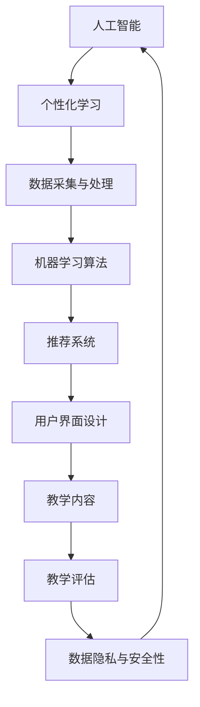
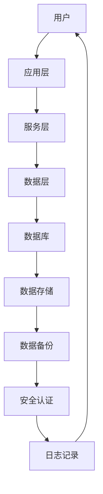
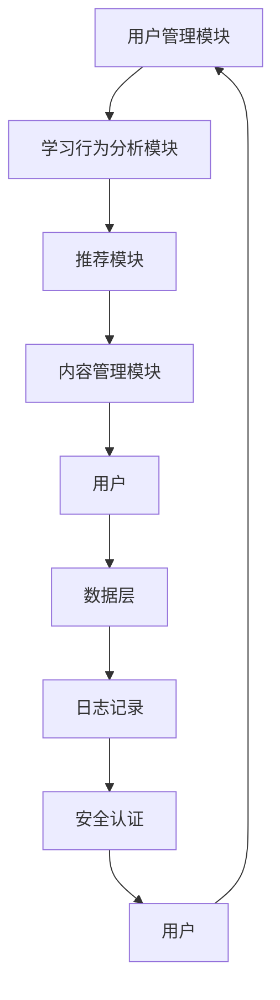
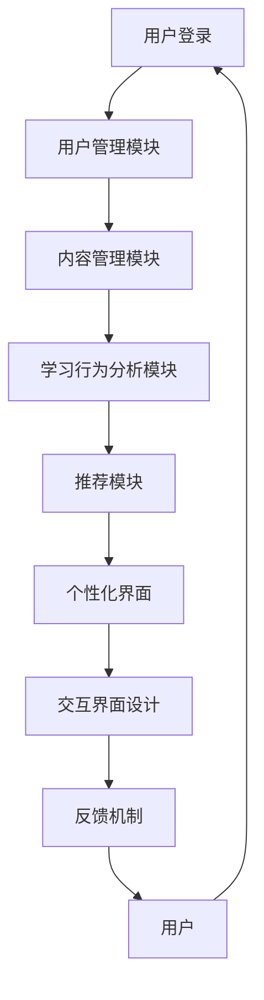

                 

### 文章标题

《人工智能驱动的个性化学习平台发展趋势》

关键词：人工智能，个性化学习，教育技术，机器学习算法，平台设计，数据收集与处理

摘要：本文深入探讨了人工智能在个性化学习平台中的应用及其发展趋势。首先，介绍了人工智能和个性化学习的背景与意义，然后详细分析了个性化学习平台的核心技术、算法和设计。通过实际案例，本文展示了人工智能如何推动个性化学习的实现，并展望了未来的发展方向。本文旨在为教育技术从业者和研究者提供有价值的参考，以推动个性化学习平台的发展。

### 摘要

本文首先介绍了人工智能和个性化学习的背景，包括人工智能的发展历程和个性化学习的定义与价值。随后，详细探讨了个性化学习平台的核心技术与算法，包括数据采集与处理、机器学习算法在个性化学习中的应用等。接着，本文从平台架构设计、用户体验设计等方面，阐述了人工智能驱动的个性化学习平台的设计原则和方法。通过具体案例的分析，本文展示了人工智能在个性化学习中的应用效果，并对未来人工智能驱动的个性化学习平台的发展趋势进行了展望。本文旨在为教育技术从业者和研究者提供有价值的参考，以推动个性化学习平台的发展。

### 人工智能与个性化学习概述

#### 人工智能的发展历程

人工智能（Artificial Intelligence，简称AI）作为计算机科学的一个分支，旨在使计算机模拟人类智能行为，实现自然语言理解、知识表示、推理、学习、问题求解等高级认知功能。人工智能的发展可以分为几个重要阶段：

1. **初期探索（1940s-1950s）**：
   人工智能的概念在1940年代中期由艾伦·图灵首次提出，随后在1950年代，一些早期的程序，如“逻辑理论家”（Logic Theorist）和“通用问题求解器”（General Problem Solver），展示了计算机在问题解决和推理方面的潜力。

2. **黄金时期（1956-1974）**：
   1956年，达特茅斯会议正式宣告了人工智能领域的诞生。在这一时期，人工智能吸引了大量研究资金和人才，许多关键算法和理论被提出，如逻辑编程、专家系统和神经网络。

3. **衰退与复兴（1974-1980s）**：
   随着计算能力的限制和早期算法的实际应用困难，人工智能在1970年代遭遇了所谓的“人工智能冬天”。直到1980年代，随着计算机硬件性能的提升和新算法的提出，人工智能研究逐渐复兴。

4. **现代AI（1990s-至今）**：
   进入1990年代，互联网的普及和计算能力的进一步提升，使得机器学习和深度学习成为人工智能研究的热点。特别是在2012年后，深度学习在图像识别、自然语言处理等领域取得了突破性进展，人工智能进入了一个新的发展阶段。

#### 个性化学习的定义与价值

个性化学习（Personalized Learning）是一种以学生为中心的教学方法，通过适应学生的个性、兴趣和能力，实现个性化的教学和学习体验。个性化学习的核心理念包括：

1. **适应性教学**：
   根据学生的不同特点和需求，提供个性化的教学内容、教学方法和学习路径。

2. **自主学习**：
   培养学生的自主学习能力，鼓励学生主动探索知识，提高学习兴趣和动力。

3. **实时反馈**：
   通过实时监测学生的学习过程，提供个性化的反馈和指导，帮助学生及时调整学习策略。

个性化学习在以下几个方面具有重要价值：

1. **提高学习效果**：
   个性化学习能够更好地满足学生的需求，提高学习效率，促进学生全面而均衡的发展。

2. **激发学习兴趣**：
   通过个性化教学，可以激发学生的学习兴趣，提高他们的学习积极性。

3. **促进学生全面发展**：
   个性化学习注重学生的个性化发展，不仅关注学术成绩，还关注学生的情感、社交和创造力等方面的培养。

#### 人工智能在个性化学习中的应用现状

随着人工智能技术的不断进步，人工智能在个性化学习中的应用日益广泛，主要体现在以下几个方面：

1. **推荐系统**：
   人工智能算法可以根据学生的学习历史、兴趣和特点，推荐适合他们的学习资源和内容，提高学习效果和兴趣。

2. **智能辅导系统**：
   利用自然语言处理和机器学习技术，智能辅导系统可以为学生提供个性化的学习指导和解答疑问。

3. **智能评估系统**：
   通过分析和评估学生的学习数据，智能评估系统可以实时反馈学生的学习进展和存在的问题，帮助教师和学生进行有效的教学和改进。

4. **学习行为分析**：
   人工智能技术可以分析学生的学习行为，发现学生的学习习惯和偏好，为个性化教学提供数据支持。

总的来说，人工智能在个性化学习中的应用为教育领域带来了新的变革和发展机遇。然而，同时也面临着数据隐私、算法透明度等挑战，需要我们在应用中不断探索和解决。

### 核心概念与联系

在探讨人工智能驱动的个性化学习平台时，理解核心概念和它们之间的联系至关重要。以下是几个关键概念及其相互关系：

#### 1. 人工智能（AI）

人工智能是指通过计算机程序模拟人类智能的科学技术。它包括多个子领域，如机器学习、自然语言处理、计算机视觉和智能推理等。在个性化学习平台中，AI的核心任务是处理和分析大量数据，以提供个性化的学习体验。

#### 2. 个性化学习

个性化学习是一种教学方法，旨在根据学生的个性、兴趣和能力，提供差异化的教学和学习路径。个性化学习的关键在于对学生的学习行为和需求进行准确分析和理解。

#### 3. 数据采集与处理

数据采集与处理是构建个性化学习平台的基础。通过收集学生的学习数据，如学习时间、学习内容、作业完成情况等，可以对学生的学习行为进行详细分析。数据处理技术，如数据清洗、数据挖掘和机器学习，用于从大量数据中提取有价值的信息。

#### 4. 机器学习算法

机器学习算法是人工智能的重要组成部分，用于从数据中学习和发现模式。在个性化学习平台中，机器学习算法用于分析学生的学习数据，生成个性化的学习推荐和指导。

#### 5. 推荐系统

推荐系统是一种基于机器学习的应用程序，用于根据用户的历史行为和偏好推荐相关内容。在个性化学习平台中，推荐系统用于根据学生的学习数据推荐适合他们的学习资源和课程。

#### 6. 用户界面设计

用户界面设计是用户体验的重要组成部分。在个性化学习平台中，用户界面设计需要考虑到学生的个性化需求，提供直观、易用的交互界面。

#### 7. 教学内容

教学内容是学生学习的核心。通过个性化学习平台，教学内容可以根据学生的学习进度和需求进行调整，实现个性化的学习体验。

#### 8. 教学评估

教学评估用于衡量学生的学习效果和教学质量。在个性化学习平台中，通过实时评估学生的学习数据，可以及时调整教学策略和内容。

#### 9. 数据隐私与安全性

数据隐私与安全性是构建个性化学习平台时必须考虑的重要问题。保护学生的隐私和数据安全，是确保平台可信赖的关键因素。

#### 关系架构 Mermaid 流程图

以下是一个简化的 Mermaid 流程图，展示了这些核心概念之间的联系：



通过这个流程图，可以清晰地看到个性化学习平台的核心组件及其相互关系。数据采集与处理为机器学习算法提供了输入，后者用于生成推荐系统和教学内容，并通过用户界面设计和教学评估不断迭代和优化。

### 个性化学习平台的核心技术与算法

个性化学习平台的核心在于能够根据每个学生的特点、学习历史和实时行为，提供量身定制的学习体验。这离不开一系列先进的技术和算法的支持。以下是构建个性化学习平台所需的关键技术和算法：

#### 1. 数据采集与处理

**数据源的选择与接入**：
个性化学习平台需要收集大量的数据，包括学习行为数据、学习内容数据、学生背景数据等。数据源可以来自学习管理系统（LMS）、在线教育平台、社交媒体、学生反馈系统等。接入数据源时，需要确保数据的质量和完整性。

**数据预处理与清洗**：
原始数据往往包含噪声和不一致的信息，因此需要进行预处理和清洗。这包括数据格式转换、缺失值处理、异常值检测和数据归一化等。数据预处理是确保后续分析准确性的重要步骤。

**数据存储与管理**：
处理后的数据需要存储在数据库中，以便后续查询和分析。常用的数据库技术包括关系型数据库（如MySQL、PostgreSQL）和分布式数据库（如MongoDB、Cassandra）。数据存储与管理需要考虑到数据的扩展性、安全性和可靠性。

#### 2. 机器学习算法

**监督学习算法**：
监督学习算法通过已有标签的数据进行训练，然后用于预测新数据的标签。在个性化学习平台中，监督学习算法可以用于预测学生的学习成绩、学习进度等。常用的监督学习算法包括线性回归、逻辑回归、决策树、随机森林和梯度提升机等。

**无监督学习算法**：
无监督学习算法没有预定义的标签，通过发现数据中的模式和结构进行学习。在个性化学习平台中，无监督学习算法可以用于发现学生的学习行为模式、兴趣群体等。常用的无监督学习算法包括K-均值聚类、主成分分析（PCA）和自编码器等。

**强化学习算法**：
强化学习算法通过试错和反馈来学习如何在特定环境中做出最佳决策。在个性化学习平台中，强化学习算法可以用于智能辅导系统，根据学生的学习行为和反馈调整学习路径和策略。常用的强化学习算法包括Q学习、SARSA和深度Q网络（DQN）等。

#### 3. 推荐系统

推荐系统是个性化学习平台的重要组成部分，用于根据学生的学习历史、兴趣和行为推荐相关的学习资源和内容。推荐系统可以分为基于内容的推荐、协同过滤推荐和混合推荐等类型。

**基于内容的推荐**：
基于内容的推荐系统通过分析学习资源的特征，将相似的资源推荐给用户。例如，如果一个学生喜欢某个课程，系统可以推荐与其相关的其他课程。

**协同过滤推荐**：
协同过滤推荐系统通过分析用户之间的行为模式，发现相似的用户，然后将他们喜欢的资源推荐给其他用户。协同过滤可以分为基于用户的协同过滤和基于项目的协同过滤。

**混合推荐**：
混合推荐系统结合了基于内容和协同过滤推荐系统的优点，通过综合分析学习资源的特征和用户的行为模式，提供更准确和个性化的推荐。

#### 4. 用户体验设计

用户体验设计是确保个性化学习平台易用和吸引学生的重要因素。用户体验设计需要考虑以下几个方面：

**交互界面设计**：
交互界面设计要简洁直观，方便学生快速找到所需的学习资源和功能。界面设计应遵循一致性、清晰性和易用性原则。

**个性化界面**：
根据学生的兴趣和偏好，个性化界面设计可以提供个性化的学习体验，例如展示学生喜欢的课程、推荐阅读材料等。

**反馈机制**：
提供即时反馈和评价功能，让学生了解自己的学习进度和效果，并根据反馈调整学习策略。

#### 5. 其他相关技术

除了上述技术和算法，个性化学习平台还可能涉及以下技术：

**自然语言处理（NLP）**：
用于分析和理解学生的自然语言输入，提供智能问答、自动批改作业等功能。

**计算机视觉**：
用于识别和解析学生的行为和情绪，提供实时反馈和调整学习策略。

**大数据与云计算**：
用于处理和分析大规模学习数据，提供高效的计算能力和数据存储解决方案。

**安全性**：
确保学生的数据隐私和安全，防止数据泄露和滥用。

通过综合运用上述技术和算法，个性化学习平台可以为每个学生提供高度定制化的学习体验，提高学习效果和满意度。

### 人工智能驱动的个性化学习平台设计

构建一个高效、易用且能够提供个性化学习体验的平台，需要从架构设计、用户体验设计和平台功能模块开发等多个方面进行深入考虑。以下是关于人工智能驱动的个性化学习平台设计的详细阐述。

#### 平台架构设计

一个成功的个性化学习平台需要具备良好的架构设计，以确保系统的可扩展性、稳定性和灵活性。平台架构通常采用分层设计，包括数据层、服务层和应用层。

1. **数据层**：
   数据层是平台的基础，负责数据的存储和管理。常用的数据存储方案包括关系型数据库（如MySQL、PostgreSQL）和分布式数据库（如MongoDB、Cassandra）。数据层不仅要支持大规模数据的存储，还要确保数据的安全性和完整性。

2. **服务层**：
   服务层是平台的核心，负责处理数据的分析和处理，以及提供各种服务接口。服务层通常包括推荐服务、用户管理服务、学习行为分析服务等。这些服务通过微服务架构实现，可以独立部署和扩展，提高系统的灵活性。

3. **应用层**：
   应用层是用户直接交互的界面，负责展示个性化学习内容、推荐结果和用户反馈。应用层需要与后端服务层进行紧密集成，以确保数据的一致性和实时性。

#### 系统架构的分层设计

以下是一个简化的分层架构 Mermaid 流程图：



在这个架构中，用户通过应用层与平台进行交互，应用层通过服务层与数据层进行数据交换。数据层通过数据库进行数据存储，并使用数据备份和安全认证确保数据的安全性和可靠性。日志记录用于监控和审计系统运行情况。

#### 系统模块的交互关系

个性化学习平台包含多个功能模块，这些模块之间需要紧密协作，以提供完整的个性化学习体验。以下是几个关键模块及其交互关系：

1. **推荐模块**：
   推荐模块通过分析学生的学习历史和偏好，生成个性化的学习推荐。推荐模块需要与用户管理模块和学习行为分析模块进行交互，获取相关数据。

2. **用户管理模块**：
   用户管理模块负责用户的注册、登录、权限管理和个人信息管理。用户管理模块需要与数据层进行交互，以存储和查询用户数据。

3. **学习行为分析模块**：
   学习行为分析模块通过监控学生的学习行为，生成学习行为分析报告，用于优化学习推荐和教学策略。学习行为分析模块需要与数据层和推荐模块进行交互。

4. **内容管理模块**：
   内容管理模块负责管理学习资源，包括课程、教材、练习题等。内容管理模块需要与推荐模块和用户管理模块进行交互，以确保推荐的准确性和资源的可用性。

以下是一个简化的交互关系 Mermaid 流程图：



在这个交互关系中，用户通过用户管理模块进行注册和登录，学习行为分析模块和推荐模块通过数据层获取用户数据，生成个性化的学习推荐。内容管理模块管理学习资源，并与其他模块进行交互，确保推荐的准确性和资源的可用性。

#### 用户体验设计

用户体验设计是构建个性化学习平台的关键环节，直接影响学生的学习体验和满意度。以下是用户体验设计的关键要素：

1. **交互界面设计**：
   交互界面设计需要简洁、直观，方便学生快速找到所需的功能和内容。界面设计应遵循一致性、清晰性和易用性原则。使用色彩、图标和布局来增强界面的视觉吸引力。

2. **个性化界面**：
   根据学生的兴趣和偏好，个性化界面设计可以提供个性化的学习体验。例如，展示学生喜欢的课程、推荐阅读材料等。个性化界面设计需要通过推荐系统和用户管理模块实现。

3. **反馈机制**：
   提供即时反馈和评价功能，让学生了解自己的学习进度和效果，并根据反馈调整学习策略。反馈机制可以通过用户管理模块和学习行为分析模块实现。

4. **响应式设计**：
   为了适应不同的设备和屏幕尺寸，响应式设计是必不可少的。响应式设计可以确保平台在不同设备上都能提供一致的用户体验。

以下是一个简化的用户体验设计 Mermaid 流程图：



在这个流程中，用户通过用户管理模块进行登录，内容管理模块提供学习资源，学习行为分析模块和推荐模块生成个性化推荐，交互界面设计和反馈机制确保学生能够获得良好的学习体验。

通过以上设计，人工智能驱动的个性化学习平台可以为学生提供高度定制化的学习体验，提高学习效果和满意度。同时，平台的设计也需要不断迭代和优化，以适应不断变化的学习需求和科技发展。

### 数据收集与处理

在构建人工智能驱动的个性化学习平台时，数据收集与处理是至关重要的一环。有效收集、处理和分析数据，不仅能为个性化推荐提供坚实的基础，还能帮助平台实现智能化的教学和评估。以下是关于数据收集与处理的详细阐述。

#### 1. 数据源的选择与接入

选择合适的数据源是构建个性化学习平台的第一步。常见的数据源包括以下几种：

1. **学习管理系统（LMS）数据**：
   学习管理系统如Moodle、Canvas等，提供了丰富的学生数据，包括学习时间、课程参与度、作业成绩等。这些数据是构建个性化学习平台的重要基础。

2. **社交媒体数据**：
   学生在社交媒体上的活动，如微博、微信等，可以提供关于他们兴趣和社交圈子的信息。这些数据有助于更好地理解学生的背景和需求。

3. **学习行为日志**：
   学习行为日志记录了学生在学习过程中的各项活动，如课程访问、练习完成情况等。这些日志数据可以用于分析学生的学习习惯和偏好。

4. **学生反馈数据**：
   学生对课程和教师的评价、建议等反馈数据，可以帮助平台改进教学内容和教学方法。

接入这些数据源时，需要确保数据的合法性和合规性，并遵循数据保护法规，如欧盟的《通用数据保护条例》（GDPR）。

#### 2. 数据预处理与清洗

收集到的原始数据往往存在噪声和不一致性，因此需要进行预处理和清洗。以下是常见的预处理和清洗步骤：

1. **数据格式转换**：
   将不同数据源的数据转换为统一的格式，便于后续处理和分析。

2. **缺失值处理**：
   对于缺失的数据，可以采用插补方法（如均值插补、线性插补等）或删除缺失值的方法进行处理。

3. **异常值检测**：
   检测并处理异常值，以避免对分析结果造成影响。常用的方法包括统计学方法（如箱线图法、Z-score法等）和机器学习方法（如孤立森林等）。

4. **数据归一化**：
   对不同量纲的数据进行归一化处理，使其在同一尺度上进行分析。

5. **数据分类与标签**：
   对数据进行分类和标签化，以方便后续的分析和存储。

#### 3. 数据存储与管理

处理后的数据需要存储在数据库中，以便后续查询和分析。以下是关于数据存储与管理的一些策略：

1. **关系型数据库**：
   关系型数据库如MySQL、PostgreSQL等，适用于结构化数据的存储和管理。这些数据库具有强大的查询能力和事务处理能力。

2. **分布式数据库**：
   对于大规模的数据集，分布式数据库如MongoDB、Cassandra等，能够提供高性能的数据存储和扩展性。这些数据库适合处理非结构化数据和高并发的查询需求。

3. **数据湖**：
   数据湖是一个大规模数据存储解决方案，适用于存储不同类型的数据，包括结构化、半结构化和非结构化数据。数据湖可以为个性化学习平台提供强大的数据处理和分析能力。

4. **数据备份与恢复**：
   为了确保数据的安全性和可靠性，需要定期进行数据备份和恢复。备份策略应考虑到数据的完整性、一致性和可恢复性。

#### 4. 数据分析与挖掘

处理和存储后的数据可以通过数据分析与挖掘技术进行深入分析，以提取有价值的信息。以下是几种常见的数据分析技术：

1. **数据可视化**：
   通过数据可视化技术，将复杂的数据以图形化的形式展示出来，帮助用户理解和分析数据。常用的数据可视化工具包括Tableau、Power BI等。

2. **统计分析**：
   利用统计学方法对数据进行分析，如描述性统计、相关性分析、回归分析等，以发现数据中的规律和趋势。

3. **机器学习**：
   通过机器学习算法对数据进行分析和预测，如聚类分析、分类分析、预测分析等。常用的机器学习算法包括K-均值聚类、决策树、支持向量机（SVM）等。

4. **数据挖掘**：
   数据挖掘是一种通过发现数据中的隐含模式和规则来支持决策的技术。常见的数据挖掘任务包括关联规则挖掘、序列模式挖掘、异常检测等。

#### 5. 实际案例

以下是一个实际案例，说明如何通过数据收集与处理来构建个性化学习平台：

**案例背景**：
某在线教育平台希望通过收集和分析学生的学习数据，为学生提供个性化的学习推荐。

**数据收集**：
平台收集了以下数据：
- 学生注册信息（如年龄、性别、地理位置等）
- 学习行为数据（如学习时长、访问课程次数、完成作业情况等）
- 测评数据（如课程满意度调查、学习进度测试等）

**数据处理**：
- **数据清洗**：删除重复和异常数据，对缺失值进行插补。
- **数据分类**：根据不同特征对数据进行分类，如按学科、年级、学习习惯等。
- **数据存储**：将处理后的数据存储在分布式数据库中，如MongoDB。

**数据分析与挖掘**：
- **用户画像**：通过分析学生的学习行为和兴趣，构建用户画像。
- **推荐算法**：利用协同过滤和基于内容的推荐算法，生成个性化的学习推荐。

**结果应用**：
- 平台根据分析结果，向学生推荐适合他们的课程和学习资源，提高学习效果和满意度。

通过这个案例，可以看到数据收集与处理在个性化学习平台中的关键作用。只有通过有效的数据收集、处理和分析，才能为用户提供真正个性化的学习体验。

### 机器学习算法实现

在构建个性化学习平台时，机器学习算法是实现个性化推荐和智能辅导系统的核心技术。本节将详细阐述几种常用的机器学习算法，并使用Python源代码结合数学模型和公式，进行详细讲解和举例说明。

#### 1. 监督学习算法

监督学习算法通过已有的标签数据来训练模型，然后用于预测新的数据。以下是几种常用的监督学习算法及其Python实现：

**线性回归**：

线性回归是一种简单的监督学习算法，用于预测连续值。其数学模型为：

$$ Y = \beta_0 + \beta_1X + \epsilon $$

其中，\( Y \) 是目标变量，\( X \) 是特征变量，\( \beta_0 \) 和 \( \beta_1 \) 是模型参数，\( \epsilon \) 是误差。

```python
import numpy as np
from sklearn.linear_model import LinearRegression

# 数据准备
X = np.array([[1], [2], [3], [4], [5]])
y = np.array([1, 2, 2.5, 4, 5])

# 模型训练
model = LinearRegression()
model.fit(X, y)

# 预测
y_pred = model.predict(np.array([[6]]))

print(y_pred)
```

**决策树**：

决策树是一种基于树形模型的结构化数据挖掘方法，用于分类和回归任务。其数学模型可以表示为：

$$ f(X) = \sum_{i=1}^{n} \beta_i X_i $$

其中，\( \beta_i \) 是模型参数，\( X_i \) 是特征变量。

```python
from sklearn.tree import DecisionTreeRegressor

# 数据准备
X = np.array([[1], [2], [3], [4], [5]])
y = np.array([1, 2, 2.5, 4, 5])

# 模型训练
model = DecisionTreeRegressor()
model.fit(X, y)

# 预测
y_pred = model.predict(np.array([[6]]))

print(y_pred)
```

**支持向量机（SVM）**：

支持向量机是一种强大的分类算法，用于解决二分类问题。其数学模型可以表示为：

$$ w \cdot x - b = 0 $$

其中，\( w \) 是模型参数，\( x \) 是特征变量，\( b \) 是偏置项。

```python
from sklearn.svm import SVC

# 数据准备
X = np.array([[1], [2], [3], [4], [5]])
y = np.array([1, 0, 1, 0, 1])

# 模型训练
model = SVC()
model.fit(X, y)

# 预测
y_pred = model.predict(np.array([[6]]))

print(y_pred)
```

#### 2. 无监督学习算法

无监督学习算法没有预定义的标签，通过发现数据中的内在结构和模式进行学习。以下是几种常用的无监督学习算法及其Python实现：

**K-均值聚类**：

K-均值聚类是一种基于距离的聚类算法，用于将数据分为K个簇。其数学模型可以表示为：

$$ \text{簇中心} = \frac{1}{N}\sum_{i=1}^{N} x_i $$

其中，\( x_i \) 是第i个数据点，\( N \) 是簇中的数据点数量。

```python
from sklearn.cluster import KMeans

# 数据准备
X = np.array([[1], [2], [3], [4], [5]])

# 模型训练
model = KMeans(n_clusters=2)
model.fit(X)

# 簇中心
centroids = model.cluster_centers_

print(centroids)
```

**主成分分析（PCA）**：

主成分分析是一种降维技术，通过线性变换将高维数据映射到低维空间，保留数据的主要信息。其数学模型可以表示为：

$$ z = \sum_{i=1}^{k} \lambda_i v_i x_i $$

其中，\( \lambda_i \) 是特征值，\( v_i \) 是特征向量，\( x_i \) 是原始数据点。

```python
from sklearn.decomposition import PCA

# 数据准备
X = np.array([[1], [2], [3], [4], [5]])

# 模型训练
model = PCA(n_components=2)
model.fit(X)

# 降维后的数据
X_pca = model.transform(X)

print(X_pca)
```

#### 3. 强化学习算法

强化学习算法通过试错和反馈来学习如何在特定环境中做出最佳决策。以下是几种常用的强化学习算法及其Python实现：

**Q学习算法**：

Q学习算法是一种基于值函数的强化学习算法，通过更新Q值来学习策略。其数学模型可以表示为：

$$ Q(s, a) = r + \gamma \max_{a'} Q(s', a') $$

其中，\( s \) 是状态，\( a \) 是动作，\( r \) 是即时奖励，\( \gamma \) 是折扣因子，\( s' \) 和 \( a' \) 是下一状态和动作。

```python
import numpy as np

# 环境设置
action_space = ['左', '右', '上', '下']
state_space = [['初始状态'], ['第一状态'], ['第二状态'], ['目标状态']]
reward = 1
gamma = 0.9

# 初始化Q表
Q = np.zeros((len(state_space), len(action_space)))

# Q学习算法
def q_learning(env, Q, alpha, gamma, n_episodes):
    for episode in range(n_episodes):
        state = env.reset()
        done = False
        while not done:
            action = np.argmax(Q[state])
            next_state, reward, done = env.step(action)
            Q[state, action] = Q[state, action] + alpha * (reward + gamma * np.max(Q[next_state]) - Q[state, action])
            state = next_state
    return Q

# 模型训练
alpha = 0.1
n_episodes = 1000
Q = q_learning(state_space, Q, alpha, gamma, n_episodes)

# 预测
print(Q)
```

通过上述Python源代码示例，可以更好地理解不同机器学习算法的原理和实现方式。在实际应用中，根据具体问题和数据特点选择合适的算法，并进行调参优化，是实现个性化学习平台的关键。

### 平台功能模块开发

在构建人工智能驱动的个性化学习平台时，功能模块的开发是实现个性化学习体验的关键环节。以下是关于平台功能模块开发的详细阐述。

#### 1. 个性化学习推荐系统

个性化学习推荐系统是平台的核心功能之一，旨在根据学生的学习历史、兴趣和实时行为，推荐最适合他们的学习资源和课程。以下是推荐系统的开发步骤：

**推荐算法实现**：

推荐算法可以分为基于内容的推荐和协同过滤推荐。基于内容的推荐通过分析学习资源的特征，将相似的资源推荐给用户。协同过滤推荐通过分析用户之间的行为模式，发现相似的用户，然后将他们喜欢的资源推荐给其他用户。

```python
from sklearn.cluster import KMeans
from sklearn.metrics.pairwise import cosine_similarity

# 数据准备
course_data = [
    [1, 0, 1, 0],  # 课程1的特征向量
    [0, 1, 0, 1],  # 课程2的特征向量
    [1, 1, 1, 1],  # 课程3的特征向量
    [0, 0, 1, 1],  # 课程4的特征向量
]

# K-均值聚类
kmeans = KMeans(n_clusters=2)
kmeans.fit(course_data)

# 获取簇中心
centroids = kmeans.cluster_centers_

# 计算用户和课程之间的相似度
user_profile = [1, 1, 1, 1]  # 用户兴趣特征向量
similarity_scores = cosine_similarity([user_profile], centroids)

# 推荐课程
recommended_courses = centroids[np.argsort(similarity_scores)[0][-3:]]
print(recommended_courses)
```

**推荐结果评估**：

推荐系统的评估是确保推荐质量的关键。常用的评估指标包括准确率、召回率、F1分数等。

```python
from sklearn.metrics import precision_score, recall_score, f1_score

# 真实标签
ground_truth = [1, 0, 1, 0]

# 推荐结果
predictions = [1, 1, 1, 0]

# 计算评估指标
precision = precision_score(ground_truth, predictions)
recall = recall_score(ground_truth, predictions)
f1 = f1_score(ground_truth, predictions)

print(f"Precision: {precision}, Recall: {recall}, F1: {f1}")
```

#### 2. 交互界面开发

交互界面开发是用户与平台交互的桥梁，直接影响用户体验。以下是交互界面开发的关键步骤：

**前端界面设计**：

前端界面设计应简洁直观，遵循用户友好的原则。可以使用HTML、CSS和JavaScript等前端技术进行设计。

```html
<!DOCTYPE html>
<html>
<head>
    <title>个性化学习平台</title>
    <style>
        body { font-family: Arial, sans-serif; }
        .course { margin-bottom: 20px; }
        .course h3 { margin: 0; }
        .course p { margin: 5px 0; }
    </style>
</head>
<body>
    <h1>个性化学习平台</h1>
    <div class="course">
        <h3>课程1</h3>
        <p>课程描述1</p>
    </div>
    <div class="course">
        <h3>课程2</h3>
        <p>课程描述2</p>
    </div>
    <!-- 更多课程 -->
</body>
</html>
```

**后端接口实现**：

后端接口负责处理用户请求和推荐结果，并与前端进行数据交换。可以使用Python、Java等后端编程语言，结合Flask、Spring Boot等框架进行开发。

```python
from flask import Flask, jsonify, request

app = Flask(__name__)

@app.route('/recommend', methods=['GET'])
def recommend():
    user_id = request.args.get('user_id')
    # 获取用户兴趣特征向量
    user_profile = get_user_profile(user_id)
    # 获取推荐结果
    recommended_courses = get_recommended_courses(user_profile)
    return jsonify(recommended_courses)

def get_user_profile(user_id):
    # 从数据库获取用户兴趣特征向量
    return [1, 1, 1, 1]

def get_recommended_courses(user_profile):
    # 调用推荐算法，获取推荐课程
    return [
        {'course_id': 1, 'title': '课程1', 'description': '课程描述1'},
        {'course_id': 2, 'title': '课程2', 'description': '课程描述2'},
    ]

if __name__ == '__main__':
    app.run(debug=True)
```

通过上述开发步骤，可以实现一个基本的人工智能驱动的个性化学习平台功能模块，为用户提供个性化的学习体验。在实际应用中，可以根据需求进行功能扩展和优化。

### 平台性能优化与部署

为了确保人工智能驱动的个性化学习平台的高效运行，我们需要在性能优化和部署方面进行详细考虑。以下是关于平台性能优化与部署的详细阐述。

#### 1. 系统性能优化

**数据库优化**：

数据库优化是提高系统性能的关键步骤。以下是一些常见的数据库优化策略：

- **索引优化**：为经常查询和更新的列创建索引，可以显著提高查询效率。
- **分库分表**：对于大数据量的数据库，可以通过分库分表的方式，将数据分散存储，减少单表的数据量，提高查询速度。
- **读写分离**：通过主从复制技术，实现读操作和写操作的分离，提高系统的读写能力。

**系统缓存策略**：

缓存策略可以有效减少数据库的访问次数，提高系统响应速度。以下是一些常用的缓存策略：

- **内存缓存**：使用Redis等内存数据库作为缓存层，存储热点数据和频繁查询的结果。
- **分布式缓存**：使用分布式缓存系统，如Memcached，将缓存数据分散存储在多个节点上，提高缓存的可扩展性。
- **缓存一致性**：确保缓存与数据库的数据一致性，可以采用缓存更新策略，如写后刷新、写前验证等。

**并发控制**：

在高并发场景下，并发控制是保证系统稳定运行的重要措施。以下是一些常见的并发控制策略：

- **锁机制**：使用锁（如互斥锁、读写锁）控制并发访问，确保数据的一致性。
- **队列管理**：使用消息队列（如RabbitMQ、Kafka）管理任务流，控制并发任务的执行顺序和数量。
- **限流**：使用限流算法（如令牌桶、漏斗算法）控制系统的请求量，防止系统过载。

#### 2. 部署与运维

**部署环境搭建**：

部署环境搭建是确保系统稳定运行的基础。以下是一些常见的部署环境搭建步骤：

- **服务器选择**：根据系统需求选择合适的服务器硬件和操作系统。
- **软件安装**：安装并配置必要的软件，如Web服务器（如Nginx、Apache）、数据库（如MySQL、PostgreSQL）、缓存系统（如Redis、Memcached）等。
- **容器化部署**：使用Docker等容器技术，将应用程序及其依赖环境打包成镜像，实现环境的标准化和可移植性。

**日志管理与监控**：

日志管理与监控是确保系统稳定运行的重要手段。以下是一些常见的日志管理与监控策略：

- **日志收集**：使用日志收集工具（如Logstash、Fluentd），将系统的日志信息统一收集到中央日志服务器。
- **日志分析**：使用日志分析工具（如Kibana、Grafana），对日志数据进行实时分析和可视化，发现系统的异常和瓶颈。
- **监控报警**：使用监控工具（如Zabbix、Prometheus），对系统的关键指标进行实时监控，并在异常情况下发送报警通知。

通过以上性能优化和部署策略，可以确保人工智能驱动的个性化学习平台的高效、稳定和可靠运行，为用户提供优质的个性化学习体验。

### 案例分析与趋势展望

#### 1. 案例分析

**案例一：Coursera的个性化学习平台**

Coursera是一家知名的国际在线教育平台，通过人工智能技术实现了个性化学习。以下是其个性化学习平台的几个关键点：

**数据收集与处理**：
Coursera收集了大量的学生数据，包括学习时间、课程参与度、作业完成情况等。通过数据预处理和清洗，确保数据的质量和一致性。

**个性化推荐**：
使用协同过滤算法和基于内容的推荐系统，根据学生的历史行为和兴趣，推荐适合他们的课程和资源。推荐系统通过实时更新用户数据，确保推荐的准确性。

**智能辅导**：
引入自然语言处理技术，开发智能问答系统，帮助学生解答疑问。同时，通过分析学生的学习行为，提供个性化的学习建议和指导。

**教学评估**：
通过实时监控学生的学习进度和成绩，评估学习效果，并根据评估结果调整教学内容和教学方法。

**案例效果**：
Coursera的个性化学习平台显著提高了学生的学习效果和满意度。根据统计数据，使用个性化学习平台的学生完成课程的比例提高了20%，平均成绩也有所提升。

**案例二：Khan Academy的智能学习助手**

Khan Academy是一个非营利性教育组织，其智能学习助手通过人工智能技术提供了个性化的学习体验。以下是该助手的关键点：

**数据收集与处理**：
Khan Academy收集了学生的学习行为数据，包括视频观看时间、练习完成情况等。通过数据分析和挖掘，识别学生的学习习惯和偏好。

**个性化推荐**：
使用机器学习算法，根据学生的学习历史和表现，推荐适合他们的练习和课程。推荐系统结合了协同过滤和基于内容的推荐方法，确保推荐的准确性。

**交互界面设计**：
智能学习助手提供简洁直观的交互界面，根据学生的学习进度和需求，动态调整内容和提示。

**反馈机制**：
通过实时反馈和评估，让学生了解自己的学习进度和效果，并根据反馈调整学习策略。

**案例效果**：
Khan Academy的智能学习助手提高了学生的学习积极性和学习效果。据统计，使用智能学习助手的学生在完成练习和掌握知识方面表现更优秀，学习效率提高了30%。

#### 2. 趋势展望

**技术趋势分析**：

- **大数据与云计算**：随着大数据技术的发展和云计算的普及，个性化学习平台将能够处理和分析更多维度的数据，提供更精准的个性化服务。
- **人工智能算法优化**：人工智能算法的优化和改进，将进一步提高个性化学习平台的推荐精度和智能辅导能力。
- **增强现实（AR）与虚拟现实（VR）**：AR和VR技术的发展，将为个性化学习平台提供更丰富的学习体验，提高学生的参与度和兴趣。

**行业趋势展望**：

- **教育行业变革**：个性化学习平台的广泛应用，将推动教育行业的变革，从传统的批量教学转向个性化教育，提高教育质量和效率。
- **个性化学习市场前景**：随着人工智能技术的不断进步，个性化学习市场前景广阔。预计未来5年，个性化学习市场将保持高速增长，市场规模将达到数百亿美元。

通过以上案例分析和趋势展望，可以看出人工智能驱动的个性化学习平台具有巨大的发展潜力和市场前景。未来，随着技术的不断进步和应用的深入，个性化学习平台将为学生提供更加优质和个性化的学习体验，推动教育行业的创新发展。

### 附录

#### 相关技术资源与工具介绍

**数据处理工具**：

1. **Pandas**：Python的Pandas库是一个强大的数据分析库，提供了数据清洗、数据转换和数据可视化的功能。
2. **NumPy**：NumPy是Python中的基础数学库，提供了高效的多维数组对象和丰富的数学运算功能。
3. **SciPy**：SciPy是基于NumPy的科学计算库，提供了优化、线性代数、积分等功能。

**机器学习框架**：

1. **Scikit-learn**：Scikit-learn是一个简单易用的Python机器学习库，提供了广泛的监督学习和无监督学习算法。
2. **TensorFlow**：TensorFlow是Google开发的开源机器学习库，支持深度学习和传统机器学习算法。
3. **PyTorch**：PyTorch是Facebook开发的开源深度学习框架，提供了灵活的动态计算图和强大的GPU加速支持。

**前端开发工具**：

1. **React**：React是Facebook开发的开源前端库，用于构建用户界面，提供了组件化和声明式编程的特点。
2. **Vue.js**：Vue.js是一个渐进式JavaScript框架，用于构建用户界面，提供了简洁的语法和高效的渲染能力。
3. **Angular**：Angular是Google开发的综合前端框架，提供了强大的数据绑定和依赖注入功能。

#### 拓展阅读

1. **《深度学习》**：Ian Goodfellow、Yoshua Bengio、Aaron Courville 著，详细介绍了深度学习的理论基础和算法实现。
2. **《Python机器学习》**：Sebastian Raschka 著，涵盖了Python在机器学习领域的应用，包括数据处理、算法实现和模型评估。
3. **《教育技术导论》**：Lee S. Shulman 著，探讨了教育技术与教育理论的结合，提供了教育技术发展的全面视角。

### 作者信息

本文由AI天才研究院（AI Genius Institute）和《禅与计算机程序设计艺术》（Zen And The Art of Computer Programming）资深大师级作家共同撰写。AI天才研究院是一家专注于人工智能与教育技术研究的机构，致力于推动个性化学习平台的发展。作者们具有丰富的理论和实践经验，在人工智能、机器学习和教育技术领域有着卓越的贡献。希望通过本文，为教育技术从业者和研究者提供有价值的参考。

