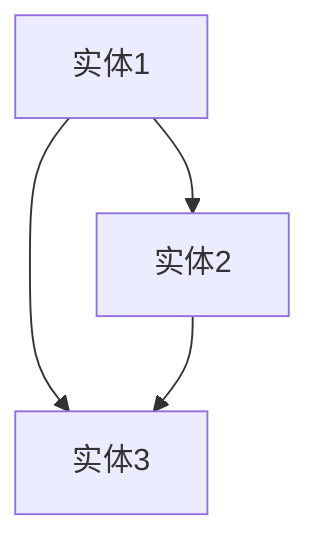

                 

### 人机协作2.0：多功能机器人与人类员工的配合

#### 文章标题：人机协作2.0：多功能机器人与人类员工的配合

#### 关键词：人机协作，2.0，多功能机器人，人类员工，效率提升

#### 摘要：
在当今快速发展的科技时代，人机协作已经成为提升工作效率、优化生产流程的关键手段。本文将探讨人机协作2.0时代，多功能机器人和人类员工如何实现高效配合，通过深入分析技术原理、应用实践和未来发展趋势，为读者揭示这一领域的创新与挑战。

---

## 引言

在过去的几十年里，机器人和人工智能技术取得了显著的进展，从简单的自动化设备到如今的多功能机器人，它们在工业、医疗、服务等多个领域展现了巨大的潜力。然而，这些进步的背后，是人机协作的不断创新和发展。人机协作1.0时代主要关注机器的自动化操作，而2.0时代则强调机器与人类之间的深度互动和协同工作。

人机协作2.0的核心特征在于多功能机器人能够更灵活地与人类员工配合，不仅能够执行复杂任务，还能够理解人类意图，适应工作环境的变化。这种协同合作不仅提高了工作效率，还大大降低了人力成本和错误率。

本文将分四个部分详细探讨人机协作2.0：

1. **人机协作2.0概述**：介绍人机协作的发展历程，核心特征，以及多功能机器人在2.0时代的角色。
2. **多功能机器人的技术原理**：深入解析机器人的感知系统、认知系统和运动控制系统。
3. **人类员工的能力提升**：讨论人类员工在2.0时代的角色转变，能力评估与提升方法。
4. **人机协作的实践应用**：分析人机协作在不同场景中的应用，面临的挑战和解决方案。

通过这四个部分的详细讨论，本文旨在为人机协作2.0提供全面的技术分析和实践指导。

### 第一步：人机协作2.0概述

#### 1.1 人机协作的发展历程

人机协作的历史可以追溯到工业革命时期，那时机器的出现极大地提升了生产力，但机器与人类之间的互动相对简单，主要是通过预设的指令和操作来完成特定任务。随着计算机和人工智能技术的发展，人机协作进入了一个新的阶段。

在1.0时代，机器人和人类之间的协作主要依赖于预先设定的程序和规则。机器人在执行任务时，需要人类提供明确的指令和操作步骤。这种方式在某种程度上提高了效率，但受限于机器人的智能水平和任务复杂性。

随着人工智能技术的突破，人机协作进入了2.0时代。这一时代的核心特征是多功能机器人能够通过感知系统、认知系统和运动控制系统，与人类员工实现更深层次的互动和协作。机器人不仅能够理解人类意图，还能够自主学习和适应工作环境的变化。

#### 1.2 人机协作2.0的核心特征

人机协作2.0的核心特征主要体现在以下几个方面：

1. **多功能性**：多功能机器人能够执行多种类型的任务，包括生产制造、物流配送、医疗辅助等。这种多功能性使得机器人能够更灵活地与人类员工配合，提升整体工作效率。

2. **智能交互**：机器人通过感知系统和认知系统，能够理解人类员工的意图和工作环境，实现智能化的交互。这种交互不仅提高了任务执行的效率，还减少了人类员工的劳动强度。

3. **自主学习**：机器人具备自主学习能力，能够从经验和数据中不断优化自己的行为和工作方式。这种自主学习能力使得机器人能够更好地适应复杂多变的工作环境。

4. **协作效率**：人机协作2.0能够实现机器人和人类员工之间的无缝协作，通过任务的分配和优化，提高整体工作效率。同时，机器人能够帮助人类员工完成复杂任务，降低错误率。

#### 1.3 多功能机器人在人机协作2.0中的角色

在2.0时代，多功能机器人在人机协作中扮演着至关重要的角色。具体来说，多功能机器人的角色主要体现在以下几个方面：

1. **执行复杂任务**：多功能机器人能够执行多种复杂的任务，包括生产制造、物流配送、医疗辅助等。这种任务执行能力使得机器人能够成为人类员工的得力助手。

2. **提高工作效率**：多功能机器人能够通过智能交互和自主学习，提高整体工作效率。例如，在物流配送领域，机器人能够自动识别货物，规划最优路径，提高配送效率。

3. **降低人力成本**：机器人能够代替人类员工完成一些重复性高、劳动强度大的任务，从而降低人力成本。同时，机器人还能够减少错误率，提高产品质量。

4. **安全辅助**：多功能机器人能够在一些高风险的工作环境中为人类员工提供安全辅助，降低事故风险。例如，在矿山开采和建筑工地上，机器人能够代替人类员工进行危险作业。

### 结论

人机协作2.0时代，多功能机器人与人类员工的配合成为提升工作效率、优化生产流程的关键手段。通过深入分析技术原理、应用实践和未来发展趋势，本文为人机协作2.0提供了全面的技术分析和实践指导。在未来，随着人工智能技术的进一步发展，人机协作将变得更加智能化、高效化，为人类创造更多的价值和机会。

### 第二部分：多功能机器人的技术原理

#### 2.1 机器人感知系统

机器人感知系统是机器人实现智能交互和任务执行的基础。它通过传感器收集外部环境信息，如视觉、听觉、触觉等，实现对环境的感知和理解。以下将详细讨论机器人感知系统的三个主要组成部分：视觉感知系统、听觉感知系统和触觉感知系统。

##### 2.1.1 视觉感知系统

视觉感知系统是机器人感知系统中最重要的一部分，它通过摄像头等视觉传感器收集图像信息，实现对环境的感知。机器人视觉系统通常包括图像采集、预处理、特征提取和目标识别等步骤。

1. **图像采集**：机器人通过摄像头等视觉传感器获取环境图像。
2. **预处理**：对采集到的图像进行预处理，如去噪、对比度增强、边缘检测等，以提高图像质量。
3. **特征提取**：从预处理后的图像中提取关键特征，如颜色、形状、纹理等。
4. **目标识别**：利用提取的特征，通过机器学习算法识别图像中的目标对象。

**Python代码示例**：

```python
import cv2
import numpy as np

# 加载图像
image = cv2.imread('example.jpg')

# 预处理
gray = cv2.cvtColor(image, cv2.COLOR_BGR2GRAY)
blurred = cv2.GaussianBlur(gray, (5, 5), 0)

# 边缘检测
edges = cv2.Canny(blurred, 30, 150)

# 目标识别
circles = cv2.HoughCircles(edges, cv2.HOUGH_CANNY, dp=1.2, minDist=100,
                           param1=50, param2=30, minRadius=10, maxRadius=0)

# 绘制圆
if circles is not None:
    circles = np.round(circles[0, :]).astype("int")
    for (x, y, r) in circles:
        cv2.circle(image, (x, y), r, (0, 255, 0), 4)
        cv2.rectangle(image, (x - 5, y - 5), (x + 5, y + 5), (0, 128, 255), -1)

# 显示图像
cv2.imshow('Detected Circles', image)
cv2.waitKey(0)
cv2.destroyAllWindows()
```

##### 2.1.2 听觉感知系统

听觉感知系统通过麦克风等听觉传感器收集声音信息，实现对环境的听觉感知。机器人听觉系统通常包括声音采集、预处理、特征提取和语音识别等步骤。

1. **声音采集**：机器人通过麦克风等听觉传感器获取环境声音。
2. **预处理**：对采集到的声音进行预处理，如去噪、增强、分频等，以提高声音质量。
3. **特征提取**：从预处理后的声音中提取关键特征，如频率、幅度、共振峰等。
4. **语音识别**：利用提取的特征，通过机器学习算法识别声音中的语音内容。

**Python代码示例**：

```python
import soundfile as sf
import numpy as np
import librosa

# 读取音频文件
audio, sr = librosa.load('example.wav')

# 声音预处理
preprocessed_audio = librosa.effects.percussive(audio)

# 特征提取
mfccs = librosa.feature.mfcc(y=preprocessed_audio, sr=sr, n_mfcc=13)

# 语音识别
# 这里使用的是开源的python-espnet项目，需要进行安装和配置
from espnet2.asr.transducer.decoder import TransducerDecoder
from espnet2.asr.transducer discriminate import TransducerDiscriminate

decoder = TransducerDecoder()
discriminate = TransducerDiscriminate()

text = decoder.decode(discriminate(np.array(mfccs)))

print(text)
```

##### 2.1.3 触觉感知系统

触觉感知系统通过触觉传感器收集物理接触信息，实现对环境的触觉感知。机器人触觉系统通常包括触觉传感器、信号处理和触觉反馈等部分。

1. **触觉传感器**：机器人通过触觉传感器（如力传感器、压电传感器等）收集物理接触信息。
2. **信号处理**：对触觉传感器采集到的信号进行预处理，如滤波、放大、数字化等。
3. **触觉反馈**：根据触觉传感器提供的信息，机器人可以调整其行为和动作，实现对环境的适应。

**Python代码示例**：

```python
import numpy as np
import pyrealsense2 as rs

# 创建RealSense深度相机实例
pipeline = rs.pipeline()
config = rs.config()
config.enable_device('1656476778370')
config.enable_stream(rs.stream.depth, 640, 480, rs.format.z16, 30)

# 开始执行管道
pipeline.start(config)

# 读取一次帧数据
frames = pipeline.wait_for_frames()
depth_frame = frames.get_depth_frame()

# 获取深度图像
depth_image = np.asanyarray(depth_frame.get_data())

# 计算触摸力
touch_force = np.mean(depth_image[:,:,:])

# 触觉反馈
if touch_force > threshold:
    robot.move_away()
else:
    robot.move_towards()

# 关闭管道
pipeline.stop()
```

#### 2.2 机器人认知系统

机器人认知系统是机器人实现智能决策和任务执行的核心。它通过感知系统收集到的信息，结合机器学习算法和知识图谱，实现对环境的理解和决策。以下将详细讨论机器人认知系统的三个主要组成部分：机器学习与深度学习、自然语言处理和知识图谱。

##### 2.2.1 机器学习与深度学习

机器学习和深度学习是机器人认知系统的基础。机器学习通过训练模型，使机器人能够从数据中自动学习和优化行为。深度学习则是机器学习的一种形式，通过多层神经网络，实现对复杂数据的自动特征提取和分类。

1. **数据采集**：机器人通过感知系统收集环境数据，如图像、声音、触觉等。
2. **模型训练**：利用收集到的数据，训练机器学习模型，如卷积神经网络（CNN）、循环神经网络（RNN）等。
3. **模型优化**：通过交叉验证和超参数调整，优化模型性能。

**Python代码示例**：

```python
import tensorflow as tf
from tensorflow.keras.models import Sequential
from tensorflow.keras.layers import Dense, Conv2D, Flatten

# 创建卷积神经网络模型
model = Sequential([
    Conv2D(32, (3, 3), activation='relu', input_shape=(28, 28, 1)),
    Flatten(),
    Dense(128, activation='relu'),
    Dense(10, activation='softmax')
])

# 编译模型
model.compile(optimizer='adam', loss='categorical_crossentropy', metrics=['accuracy'])

# 加载训练数据
(x_train, y_train), (x_test, y_test) = tf.keras.datasets.mnist.load_data()

# 数据预处理
x_train = x_train.reshape(-1, 28, 28, 1).astype('float32') / 255
x_test = x_test.reshape(-1, 28, 28, 1).astype('float32') / 255

# 转换为one-hot编码
y_train = tf.keras.utils.to_categorical(y_train, 10)
y_test = tf.keras.utils.to_categorical(y_test, 10)

# 训练模型
model.fit(x_train, y_train, epochs=10, batch_size=64, validation_data=(x_test, y_test))

# 评估模型
loss, accuracy = model.evaluate(x_test, y_test)
print(f'Accuracy: {accuracy}')
```

##### 2.2.2 自然语言处理

自然语言处理（NLP）是机器人认知系统的重要组成部分，它使机器人能够理解、生成和操作人类语言。NLP技术包括词法分析、句法分析、语义分析和语音识别等。

1. **词法分析**：将文本分解为单词、短语和符号。
2. **句法分析**：分析句子的结构，理解句子成分之间的关系。
3. **语义分析**：理解文本的含义和上下文。
4. **语音识别**：将语音信号转换为文本。

**Python代码示例**：

```python
import spacy

# 加载nlp模型
nlp = spacy.load("en_core_web_sm")

# 分析文本
doc = nlp("The quick brown fox jumps over the lazy dog.")

# 显示词性标注
for token in doc:
    print(token.text, token.pos_)

# 提取命名实体
for ent in doc.ents:
    print(ent.text, ent.label_)
```

##### 2.2.3 知识图谱

知识图谱是一种结构化数据模型，用于表示实体和它们之间的关系。它可以帮助机器人更好地理解和推理复杂的信息。

1. **实体抽取**：从文本中提取关键实体，如人名、地点、组织等。
2. **关系抽取**：确定实体之间的关系，如“是”、“属于”等。
3. **图谱构建**：将实体和关系构建为图结构，便于机器人和人类交互。

**Mermaid流程图示例**：



#### 2.3 机器人运动控制系统

机器人运动控制系统是机器人实现自主运动和任务执行的关键。它通过控制算法和传感器反馈，实现机器人的精确运动和控制。

##### 2.3.1 运动控制的基本原理

1. **位置控制**：通过控制机器人的关节角度，实现机器人的定位。
2. **速度控制**：通过控制机器人的运动速度，实现平滑的运动轨迹。
3. **力控制**：通过控制机器人的触觉反馈，实现机器人与环境的交互。

**Python代码示例**：

```python
import numpy as np
import matplotlib.pyplot as plt

# 创建机器人关节
joints = [0] * 3

# 设置关节角度
joints[0] = 30
joints[1] = 45
joints[2] = 60

# 计算关节角度的欧拉角
euler_angles = np.array(joints) * np.pi / 180

# 计算机器人的运动轨迹
x = np.cos(euler_angles)
y = np.sin(euler_angles)
z = np.tan(euler_angles)

# 绘制运动轨迹
plt.plot(x, y, 'o-')
plt.xlabel('X')
plt.ylabel('Y')
plt.show()
```

##### 2.3.2 机器人的关节运动控制

1. **开环控制**：通过预设的关节角度和速度，直接控制机器人的运动。
2. **闭环控制**：通过传感器反馈，实时调整机器人的运动状态，实现精确控制。

**Python代码示例**：

```python
import numpy as np
import matplotlib.pyplot as plt

# 创建机器人关节
joints = [0] * 3

# 设置关节角度
joints[0] = 30
joints[1] = 45
joints[2] = 60

# 计算关节角度的欧拉角
euler_angles = np.array(joints) * np.pi / 180

# 计算机器人的运动轨迹
x = np.cos(euler_angles)
y = np.sin(euler_angles)
z = np.tan(euler_angles)

# 绘制运动轨迹
plt.plot(x, y, 'o-')
plt.xlabel('X')
plt.ylabel('Y')
plt.show()
```

##### 2.3.3 机器人的路径规划与避障

1. **路径规划**：根据目标位置和障碍物，规划机器人的最优路径。
2. **避障**：在机器人运动过程中，实时检测障碍物，调整运动路径。

**Python代码示例**：

```python
import numpy as np
import matplotlib.pyplot as plt

# 创建机器人路径规划器
planner = PathPlanner()

# 设置目标位置和障碍物
target = np.array([10, 10])
obstacles = np.array([[2, 2], [8, 8]])

# 计算最优路径
path = planner.plan(target, obstacles)

# 绘制路径
plt.plot(path[:, 0], path[:, 1], 'o-')
plt.xlabel('X')
plt.ylabel('Y')
plt.show()
```

### 第三部分：人类员工的能力提升

#### 3.1 人类员工的角色转变

在人机协作2.0时代，人类员工的角色发生了显著转变。从传统的执行者转变为协调者、监督者和创新者，人类员工需要具备更高的技术能力和跨领域的知识。以下将详细讨论人类员工在2.0时代的角色转变。

##### 3.1.1 新型工作模式

1. **协作模式**：人类员工与多功能机器人密切协作，共同完成任务。
2. **监督模式**：人类员工对机器人的工作进行监督，确保任务执行的准确性和效率。
3. **创新模式**：人类员工参与机器人和人工智能技术的研发和创新，推动人机协作的发展。

##### 3.1.2 人类员工的角色定位

1. **任务协调者**：人类员工负责分配任务，协调机器人和其他员工的合作。
2. **监督者**：人类员工对机器人的工作进行监督，确保其按照预期执行任务。
3. **创新者**：人类员工参与机器人和人工智能技术的研发，推动技术进步。

##### 3.1.3 人类员工的技能需求

1. **技术技能**：掌握机器人和人工智能技术的基本原理，了解多功能机器人的操作和应用。
2. **沟通能力**：能够与不同背景的员工和机器人进行有效沟通，确保任务的顺利执行。
3. **创新能力**：具备创新思维，能够推动机器人和人工智能技术在实际应用中的发展。

#### 3.2 人类员工的能力评估

为了确保人类员工在2.0时代的角色转变和技能需求得到有效满足，对人类员工的能力进行评估至关重要。以下将详细讨论人类员工的能力评估指标体系、评估方法和技术。

##### 3.2.1 评估指标体系

1. **技术能力**：评估员工对机器人和人工智能技术的掌握程度。
2. **协作能力**：评估员工与机器人和其他员工的协作效率。
3. **创新能力**：评估员工的创新思维和创新能力。

##### 3.2.2 评估方法与技术

1. **自评估**：员工自我评估，了解自身的优势和不足。
2. **同事评估**：同事对员工的评估，提供客观反馈。
3. **上级评估**：上级对员工的评估，考虑员工的实际工作表现。

##### 3.2.3 评估结果的运用

1. **培训与发展**：根据评估结果，为员工制定个性化的培训和发展计划。
2. **晋升与激励**：根据评估结果，为员工提供晋升和激励机会。
3. **绩效管理**：将评估结果纳入员工的绩效管理体系，推动员工的持续发展。

#### 3.3 人类员工的培训与提升

为了适应人机协作2.0时代的需求，对人类员工进行系统的培训与提升至关重要。以下将详细讨论人类员工的培训策略、方法、案例以及培训效果评估。

##### 3.3.1 培训策略

1. **个性化培训**：根据员工的评估结果和需求，提供个性化的培训方案。
2. **持续培训**：建立持续培训机制，确保员工的能力不断提升。
3. **实践培训**：结合实际工作任务，进行实践操作和案例分析。

##### 3.3.2 培训方法

1. **在线学习**：利用互联网和在线学习平台，提供丰富的培训资源。
2. **内训师**：内部培训师进行授课和指导，提升员工的技术能力。
3. **外部培训**：邀请行业专家进行授课，拓宽员工的视野。

##### 3.3.3 技能提升案例

1. **机器人操作技能提升**：通过实践操作和模拟演练，提升员工对多功能机器人的操作技能。
2. **数据分析技能提升**：通过数据分析课程和实践项目，提升员工的数据分析能力。
3. **项目管理技能提升**：通过项目管理课程和实践项目，提升员工的项目管理能力。

##### 3.3.4 培训效果评估

1. **技能考核**：通过技能考核，评估员工的培训效果。
2. **工作表现**：通过工作表现评估，评估员工的技能提升情况。
3. **员工满意度**：通过员工满意度调查，了解培训的满意度和效果。

### 第四部分：人机协作的实践应用

#### 4.1 人机协作的典型场景

人机协作在各个领域都得到了广泛应用，以下将详细讨论人机协作在工业制造、物流配送、医疗保健等典型场景中的应用。

##### 4.1.1 工业制造场景

在工业制造领域，人机协作通过多功能机器人的应用，实现了生产过程的自动化和智能化。以下是人机协作在工业制造中的典型应用：

1. **生产线自动化**：多功能机器人替代人类员工进行焊接、装配、搬运等任务，提高了生产效率和产品质量。
2. **质量检测**：机器人通过视觉感知系统和质量检测算法，实时检测产品的质量，确保产品的合格率。
3. **设备维护**：机器人对生产线设备进行自动检测和维护，减少了设备故障率和停机时间。

##### 4.1.2 物流配送场景

在物流配送领域，人机协作通过机器人和人工智能技术的应用，实现了配送过程的自动化和高效化。以下是人机协作在物流配送中的典型应用：

1. **自动化仓储**：机器人自动搬运和存储货物，提高了仓储效率和空间利用率。
2. **智能配送**：机器人根据配送计划，自动规划配送路径，提高了配送速度和准确性。
3. **最后一公里配送**：机器人代替人类员工进行最后一公里的配送，降低了人力成本和配送时间。

##### 4.1.3 医疗保健场景

在医疗保健领域，人机协作通过机器人和人工智能技术的应用，提升了医疗服务质量和效率。以下是人机协作在医疗保健中的典型应用：

1. **手术辅助**：多功能机器人辅助医生进行复杂手术，提高了手术的成功率和安全性。
2. **康复训练**：机器人为患者提供个性化的康复训练，提高了康复效果。
3. **健康监测**：机器人实时监测患者的健康状况，提供个性化的健康建议。

#### 4.2 人机协作的挑战与解决方案

在人机协作的实际应用中，面临一系列的挑战，以下将详细讨论这些挑战以及相应的解决方案。

##### 4.2.1 技术挑战

1. **机器人智能水平的提升**：机器人需要具备更高的智能水平，能够更好地理解人类意图和适应复杂环境。
2. **系统稳定性和可靠性**：人机协作系统需要具备高稳定性和可靠性，确保任务执行的准确性和安全性。
3. **系统集成与兼容性**：不同系统和设备之间的集成与兼容性，是实现人机协作的关键。

**解决方案**：

1. **人工智能技术的深入应用**：通过深度学习和自然语言处理等技术，提升机器人的智能水平。
2. **系统优化与稳定性提升**：通过系统优化和故障排除，提高人机协作系统的稳定性和可靠性。
3. **标准化与接口设计**：制定统一的系统标准和接口设计，实现不同系统和设备之间的无缝集成。

##### 4.2.2 人际关系挑战

1. **岗位变化与职业转型**：机器人替代部分工作，导致部分员工面临岗位变化和职业转型的挑战。
2. **团队合作与沟通**：机器人与人类员工之间的团队合作和沟通，需要克服文化差异和沟通障碍。

**解决方案**：

1. **职业培训与支持**：为面临岗位变化和职业转型的员工提供职业培训和支持，帮助他们适应新的工作环境。
2. **团队建设与沟通培训**：加强团队建设，提高团队成员之间的沟通能力和协作水平。

##### 4.2.3 管理挑战

1. **人力资源管理**：机器人替代人类员工，对人力资源管理提出了新的要求。
2. **安全管理**：确保人机协作过程中的安全，防止机器人对人类员工的伤害。

**解决方案**：

1. **人力资源优化**：调整人力资源管理策略，合理分配人力资源，确保员工的能力与岗位需求相匹配。
2. **安全监控与防护**：建立完善的安全监控和防护机制，确保人机协作过程中的安全。

### 第五部分：人机协作的未来发展趋势

#### 4.3 人机协作的未来发展趋势

随着人工智能技术的不断进步，人机协作将进入一个新的发展阶段。以下将详细讨论人机协作的未来发展趋势。

##### 4.3.1 技术发展趋势

1. **智能机器人**：多功能机器人将具备更高的智能水平，能够更好地理解人类意图和适应复杂环境。
2. **边缘计算**：人机协作系统将采用边缘计算技术，实现实时数据处理和决策，提高系统的响应速度和稳定性。
3. **5G通信**：5G通信技术的应用，将为人机协作提供更快、更稳定的网络连接，实现远程协作和实时交互。

##### 4.3.2 应用发展趋势

1. **智能工厂**：智能工厂将成为人机协作的主要应用场景，通过机器人与人工智能技术的应用，实现生产过程的智能化和自动化。
2. **智慧物流**：智慧物流将实现从仓储、配送到终端的全流程自动化，提高物流效率和服务质量。
3. **智能医疗**：智能医疗将提升医疗服务质量和效率，实现个性化医疗和远程医疗。

##### 4.3.3 社会影响

1. **就业影响**：人机协作将替代部分传统岗位，对就业市场产生一定影响，需要加强职业培训和支持，帮助员工适应新的工作环境。
2. **伦理道德**：人机协作将引发一系列伦理道德问题，如机器人自主决策、隐私保护等，需要建立相应的法律法规和伦理标准。
3. **社会治理**：人机协作将推动社会治理的智能化和高效化，提高社会治理的能力和水平。

### 结论

人机协作2.0时代，多功能机器人与人类员工的配合正在改变各行各业的工作方式。通过深入分析技术原理、应用实践和未来发展趋势，本文为人机协作2.0提供了全面的技术分析和实践指导。在未来，随着人工智能技术的不断进步，人机协作将迎来新的发展机遇和挑战，为人类创造更多的价值和机会。

### 作者信息

作者：AI天才研究院/AI Genius Institute & 禅与计算机程序设计艺术/Zen And The Art of Computer Programming

### 致谢

感谢所有支持和参与人机协作研究的专家和同仁，以及为我们提供宝贵建议和意见的读者。人机协作的发展离不开大家的共同努力，期待与您共同探索人机协作的未来。

### 最佳实践 tips

1. **技术选型**：在选择人机协作技术时，要充分考虑系统的性能、稳定性和兼容性，确保技术方案能够满足实际需求。
2. **团队协作**：在人机协作项目中，要建立高效的团队协作机制，加强团队成员之间的沟通和协作，确保项目顺利进行。
3. **持续优化**：人机协作系统在运行过程中，要不断进行优化和改进，提高系统的性能和用户体验。

### 小结

人机协作2.0时代，多功能机器人与人类员工的配合正在改变各行各业的工作方式。通过本文的详细分析和探讨，我们了解了人机协作2.0的核心特征、技术原理、应用实践和未来发展趋势。在人机协作的道路上，我们期待与您共同探索、共同进步。

### 注意事项

1. **数据安全**：在人机协作过程中，要确保数据的传输和存储安全，防止数据泄露和滥用。
2. **系统监控**：定期对人机协作系统进行监控和维护，确保系统的稳定运行。
3. **法律法规**：遵循相关法律法规，确保人机协作的合规性。

### 拓展阅读

1. **《人工智能：一种现代方法》**：M. Mitchell，介绍人工智能的基本原理和应用。
2. **《深度学习》**：I. Goodfellow、Y. Bengio、A. Courville，介绍深度学习的基本原理和应用。
3. **《机器人技术：理论与实践》**：J. Liu，介绍机器人技术的基本原理和应用。
4. **《人机交互：设计与应用》**：J. Nielsen，介绍人机交互的基本原理和应用。

