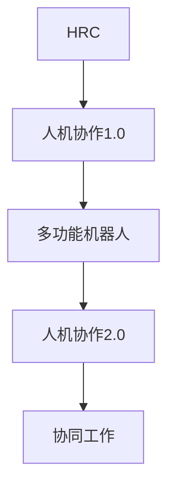
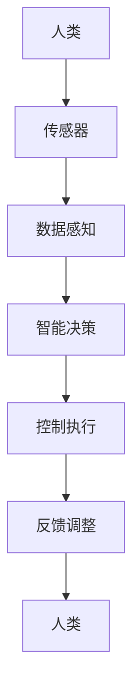
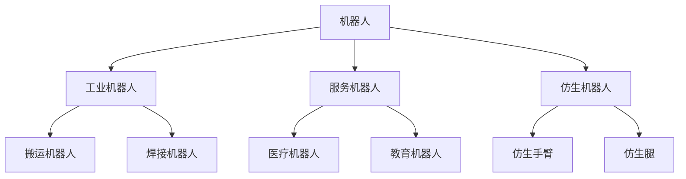
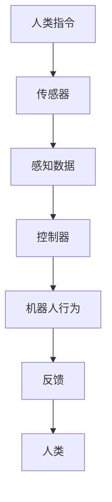
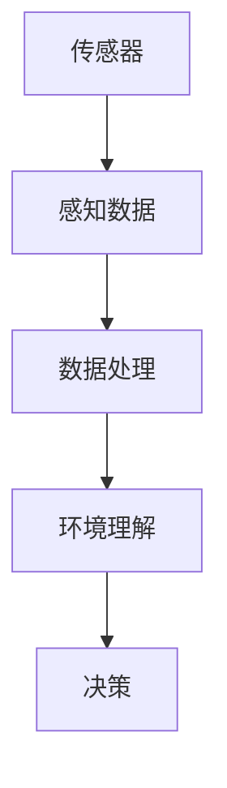
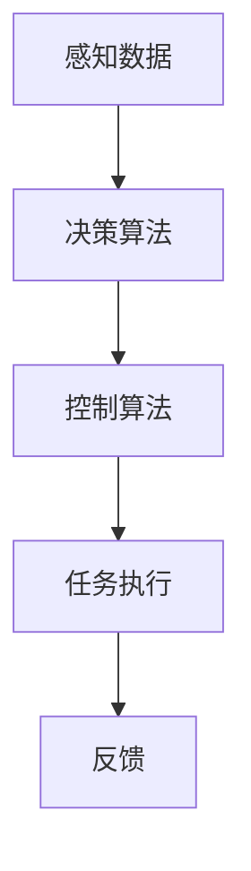
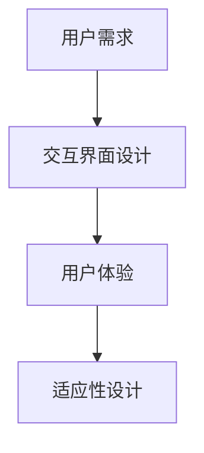
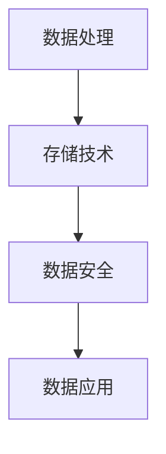

                 

### 目录

**《人机协作2.0：多功能机器人与人类的协同工作》**

> 关键词：人机协作、多功能机器人、协同工作、智能化、人工智能

> 摘要：本文深入探讨了人机协作2.0的概念、多功能机器人的技术要点、人类与机器人协同工作的模式及其实际应用，通过案例研究和实战指南，展示了人机协作2.0的潜力与挑战。

---

## 1. 引言

### 1.1 人机协作的现状与发展

人机协作（Human-Robot Collaboration，HRC）是人工智能与机器人技术发展的重要方向之一。在过去，机器人主要被用于生产线上的重复性劳动，而随着技术的进步，机器人逐渐进入服务、医疗、制造等多个领域，与人类进行更加紧密的协作。传统的“人机协作1.0”阶段主要依赖于机械臂、搬运机器人等，其功能较为单一，无法与人类进行深层次的互动。

**核心概念与联系**

在引言部分，我们首先要明确几个核心概念：

1. **人机协作**：指的是人类与机器人之间的协作关系，这种协作可以是基于信息的交换，也可以是物理的互动。
2. **多功能机器人**：具有多种功能的机器人，能够适应不同的工作环境和任务需求。
3. **协同工作**：指机器人和人类共同完成一项任务，相互配合，提高工作效率。

我们可以通过一个简单的 Mermaid 流程图来展示这些核心概念之间的关系：



### 1.2 人机协作2.0的概念与目标

人机协作2.0（Human-Robot Collaboration 2.0，HRC 2.0）是新一代人机协作模式的代表，其核心目标是实现机器人和人类之间的无缝协作，通过智能化技术提升协作效率和质量。与传统的协作模式不同，人机协作2.0强调的是机器人的智能性，包括感知、决策、执行等全过程的智能化。

**核心概念与联系**

为了更清晰地理解人机协作2.0的概念，我们可以再次使用 Mermaid 流程图：



在这个流程中，人类通过传感器获取环境信息，机器人则根据智能算法进行决策和执行，并通过反馈机制不断调整，实现高效的人机协作。

### 1.3 本书结构

本文分为三个主要部分：

1. **引言与背景知识**：介绍人机协作的现状与发展，以及人机协作2.0的概念与目标。
2. **人机协作2.0的核心技术**：详细探讨传感器与感知技术、智能决策与控制算法、人机交互界面设计、数据处理与存储技术等关键技术。
3. **案例研究与实战**：通过具体案例展示人机协作2.0的实际应用，并提供实战指南。

通过上述三个部分的阐述，本文旨在全面剖析人机协作2.0的各个方面，为读者提供系统的理论和实践指导。

## 2. 多功能机器人概述

### 2.1 多功能机器人的定义与分类

多功能机器人是指具备多种功能，能够适应不同工作环境和任务需求的机器人。与传统单一功能的工业机器人不同，多功能机器人能够根据任务需求进行动态调整，提高工作效率和灵活性。

**核心概念与联系**

在探讨多功能机器人的定义与分类时，我们需要了解以下几个核心概念：

1. **机器人**：一种能够半自主或全自主执行任务的机器。
2. **多功能**：机器人具备多种功能，可以完成不同类型的任务。
3. **分类**：根据应用领域和功能特点，可以将多功能机器人分为工业机器人、服务机器人、仿生机器人等。

我们可以通过一个 Mermaid 流程图来展示这些核心概念之间的关系：



### 2.2 多功能机器人的关键技术

多功能机器人能够实现多种功能，离不开以下几个关键技术的支持：

1. **传感器与感知技术**：通过传感器获取环境信息，为机器人的决策提供数据支持。
2. **智能决策与控制算法**：基于感知到的数据，利用智能算法进行决策，控制机器人的行为。
3. **人机交互界面设计**：为人类操作者提供友好的交互界面，实现人机协同工作。

在接下来的小节中，我们将详细探讨这些关键技术。

### 2.3 多功能机器人的应用领域

多功能机器人凭借其灵活性和高效性，在多个领域得到了广泛应用：

1. **工业制造**：在汽车制造、电子装配等行业，多功能机器人能够完成组装、焊接、搬运等任务，提高生产效率。
2. **服务业**：在酒店、餐饮、医疗等行业，多功能机器人可以提供接待、送餐、手术辅助等服务。
3. **家庭**：在家庭环境中，多功能机器人可以作为陪护、清洁、烹饪等助手，提高生活质量。

通过这些应用领域的探索，我们可以看到多功能机器人对人类生活和工作方式的深远影响。

## 3. 人类与机器人的协同工作模式

### 3.1 协同工作原理

人类与机器人的协同工作模式（Human-Robot Collaboration，HRC）是基于信息交换和物理互动的一种新型工作模式。在这种模式中，人类和机器人通过传感器、控制器等设备相互连接，共同完成复杂任务。

**核心概念与联系**

为了深入理解协同工作原理，我们需要探讨以下几个核心概念：

1. **信息交换**：人类和机器人通过传感器、网络等设备进行数据传递，实现信息共享。
2. **物理互动**：机器人根据人类指令或自主决策执行物理任务，与人类共同完成工作。
3. **反馈机制**：通过反馈机制，人类可以了解机器人的工作状态，进行实时调整。

我们可以使用一个简单的 Mermaid 流程图来展示这些核心概念之间的关系：



### 3.2 协同工作模式

人类与机器人的协同工作模式可以分为几种不同的类型，每种类型都有其独特的应用场景和优势。

1. **指令式协同**：在这种模式下，人类通过控制器直接发送指令给机器人，机器人按照指令执行任务。这种模式适用于简单、重复性的任务。
2. **协作式协同**：在这种模式下，人类和机器人共同决策，协调完成任务。机器人可以根据人类的需求进行自主调整，提高工作效率。
3. **混合式协同**：结合指令式和协作式协同的特点，人类和机器人可以根据任务需求灵活切换工作模式。

### 3.3 协同工作挑战与解决方案

尽管人机协同工作模式具有很多优势，但在实际应用中仍面临一些挑战：

1. **安全风险**：在人类和机器人共处一室的环境下，存在安全风险。需要通过安全防护措施和智能算法来降低风险。
2. **交互障碍**：人类和机器人的交互方式不同，需要设计友好的交互界面，提高交互效率。
3. **决策冲突**：在复杂任务中，人类和机器人可能会产生决策冲突，需要通过智能算法和协调机制来解决问题。

针对这些挑战，我们可以采取以下解决方案：

1. **安全防护**：安装安全传感器，实时监测人类和机器人的位置与状态，防止碰撞事故。
2. **智能交互**：设计直观、易用的交互界面，提高人类与机器人的交互效率。
3. **决策协调**：通过分布式决策算法，实现人类与机器人的协同决策，减少冲突。

通过解决这些挑战，人机协同工作模式将更加成熟和普及，为人类社会带来更多的便利和创新。

## 4. 人机协作2.0的核心技术

### 4.1 传感器与感知技术

传感器与感知技术是人机协作2.0的基础，它们使得机器人能够感知环境，理解人类意图，并做出相应决策。

**核心概念与联系**

以下是几个关键概念：

1. **传感器**：用于检测和测量物理量的装置，如温度、湿度、光线等。
2. **感知**：机器人通过传感器获取环境信息的过程。
3. **数据处理**：对传感器获取的数据进行处理，提取有用的信息。

我们可以通过一个 Mermaid 流程图来展示这些概念之间的关系：



### 4.2 智能决策与控制算法

智能决策与控制算法是人机协作2.0的核心，它们使得机器人能够自主决策，并执行任务。

**核心概念与联系**

以下是几个关键概念：

1. **决策**：基于感知到的环境信息，选择最优的行动方案。
2. **控制算法**：用于指导机器人执行任务的算法，如PID控制、神经网络等。
3. **分布式决策**：在复杂环境中，机器人与人类共同进行决策，提高协作效率。

我们可以通过一个 Mermaid 流程图来展示这些概念之间的关系：



### 4.3 人机交互界面设计

人机交互界面设计是人机协作2.0的重要组成部分，它直接影响人类与机器人的交互体验。

**核心概念与联系**

以下是几个关键概念：

1. **交互界面**：人类与机器人进行交互的媒介，如触摸屏、语音识别等。
2. **用户体验**：设计交互界面的目标，提高人类操作的舒适度和效率。
3. **适应性设计**：根据不同用户需求，设计灵活的交互界面。

我们可以通过一个 Mermaid 流程图来展示这些概念之间的关系：



### 4.4 数据处理与存储技术

数据处理与存储技术是人机协作2.0的基石，它们确保了大规模数据的有效处理与存储。

**核心概念与联系**

以下是几个关键概念：

1. **数据处理**：对传感器获取的数据进行清洗、转换、分析等操作。
2. **存储技术**：用于存储大量数据的设备和技术，如数据库、云存储等。
3. **数据安全**：确保数据在处理和存储过程中的安全性和隐私性。

我们可以通过一个 Mermaid 流程图来展示这些概念之间的关系：



通过上述核心技术的介绍，我们可以看到人机协作2.0的强大潜力。接下来，我们将通过具体案例研究和实战指南，进一步探讨人机协作2.0的实际应用。

## 5. 传感器与感知技术

传感器与感知技术是人机协作2.0的核心组件，它们赋予机器人环境感知能力，使其能够理解周围的世界并进行智能决策。以下是传感器与感知技术的详细探讨。

### 5.1 传感器概述

传感器是一种能够检测并转换物理量（如温度、湿度、压力、光线等）为电信号的装置。根据其工作原理，传感器可以分为以下几类：

1. **机械传感器**：如加速度计、陀螺仪等，用于测量机械运动。
2. **光电传感器**：如光电二极管、激光雷达等，用于测量光线和距离。
3. **热传感器**：如热电偶、红外传感器等，用于测量温度。
4. **化学传感器**：如气体传感器、湿度传感器等，用于测量化学成分。

每种传感器都有其特定的应用场景，因此选择合适的传感器对于实现高效的人机协作至关重要。

### 5.2 常见传感器类型

在机器人应用中，以下是一些常见的传感器类型及其特点：

1. **视觉传感器**：包括摄像头、深度相机等，用于捕捉图像和深度信息。
   - **Python代码示例**：以下是使用Python的OpenCV库读取摄像头图像的示例代码。
     ```python
     import cv2

     # 打开默认摄像头
     cap = cv2.VideoCapture(0)

     while True:
         # 读取一帧图像
         ret, frame = cap.read()

         if ret:
             # 显示图像
             cv2.imshow('Camera', frame)

         if cv2.waitKey(1) & 0xFF == ord('q'):
             break

     cap.release()
     cv2.destroyAllWindows()
     ```

2. **力觉传感器**：如力矩传感器、压敏电阻等，用于测量机器人与外界接触的力。
   - **LaTeX数学公式**：力矩的计算公式为 \( \tau = r \times F \)，其中 \( \tau \) 是力矩，\( r \) 是力臂，\( F \) 是力。

3. **惯性测量单元（IMU）**：包括加速度计、陀螺仪和磁力计，用于测量机器人的运动状态。
   - **Python代码示例**：以下是使用Python的IMU库读取加速度数据的示例代码。
     ```python
     import imu

     # 初始化IMU
     imu.init()

     while True:
         # 读取加速度数据
         acceleration = imu.read_acceleration()

         print(f"Acceleration: x={acceleration['x']}, y={acceleration['y']}, z={acceleration['z']}")

         if cv2.waitKey(1) & 0xFF == ord('q'):
             break
     ```

### 5.3 传感器数据处理与分析

传感器数据处理与分析是机器人感知环境的重要环节。以下是数据处理与分析的基本步骤：

1. **数据采集**：通过传感器获取环境数据。
2. **数据预处理**：包括去噪、滤波、归一化等，提高数据质量。
3. **特征提取**：从预处理后的数据中提取有用的信息。
4. **数据可视化**：使用图表、图像等可视化工具展示数据，帮助理解数据特征。

**LaTeX数学公式**：特征提取的数学模型可以表示为：
$$
f(x) = \sum_{i=1}^{n} w_i \cdot x_i
$$
其中，\( f(x) \) 是特征值，\( w_i \) 是权重，\( x_i \) 是输入数据。

通过传感器与感知技术，机器人能够准确地感知环境，为后续的智能决策提供可靠的数据支持。在下一节中，我们将探讨智能决策与控制算法，了解如何利用感知数据进行智能决策。

## 6. 智能决策与控制算法

智能决策与控制算法是人机协作2.0的核心技术，它们使得机器人能够基于感知到的环境信息进行自主决策和精确控制。以下是对这些算法的详细探讨。

### 6.1 决策理论基础

智能决策是基于概率论、信息论和控制论等理论基础构建的。以下是几个关键概念：

1. **马尔可夫决策过程（MDP）**：一种用于描述不确定环境下的决策过程。在MDP中，状态、动作和奖励是核心概念。
   - **LaTeX数学公式**：MDP的状态转移概率可以表示为：
     $$
     P(S_{t+1} = s' | S_t = s, A_t = a) = p(s', s | a)
     $$
   其中，\( S_t \) 和 \( S_{t+1} \) 分别是当前状态和下一状态，\( A_t \) 是采取的动作，\( p(s', s | a) \) 是状态转移概率。

2. **深度强化学习**：一种结合深度学习和强化学习的方法，能够通过试错学习出最优策略。
   - **Python代码示例**：以下是使用TensorFlow实现深度Q网络（DQN）的示例代码。
     ```python
     import tensorflow as tf
     from tensorflow.keras.models import Sequential
     from tensorflow.keras.layers import Dense

     # 创建DQN模型
     model = Sequential()
     model.add(Dense(24, input_dim=4, activation='relu'))
     model.add(Dense(24, activation='relu'))
     model.add(Dense(4, activation='linear'))

     # 编译模型
     model.compile(loss='mse', optimizer=tf.optimizers.Adam(0.001))

     # 训练模型
     model.fit(x_train, y_train, epochs=100)
     ```

3. **混合整数规划（MIP）**：用于解决包含连续变量和整数变量的优化问题。
   - **LaTeX数学公式**：MIP的目标函数可以表示为：
     $$
     \min_{x} \quad c^T x
     $$
     其中，\( x \) 是变量，\( c \) 是系数向量。

### 6.2 控制算法介绍

控制算法是机器人实现精确动作的关键。以下是几种常见的控制算法：

1. **PID控制**：比例-积分-微分控制，是一种常用的反馈控制算法。
   - **Python代码示例**：以下是使用Python实现PID控制的示例代码。
     ```python
     class PIDController:
         def __init__(self, Kp, Ki, Kd):
             self.Kp = Kp
             self.Ki = Ki
             self.Kd = Kd
             self.error = 0
             self.previous_error = 0
             self.integral = 0

         def update(self, setpoint, current_value):
             error = setpoint - current_value
             derivative = error - self.previous_error
             self.integral += error
             output = self.Kp * error + self.Ki * self.integral + self.Kd * derivative
             self.previous_error = error
             return output

     controller = PIDController(Kp=1.0, Ki=0.1, Kd=0.05)
     current_value = 100
     setpoint = 50
     output = controller.update(setpoint, current_value)
     ```

2. **模糊控制**：基于模糊逻辑的控制方法，适用于处理非线性、复杂系统。
   - **LaTeX数学公式**：模糊规则可以表示为：
     $$
     \mu_{A}(x) = \sum_{i=1}^{n} \mu_{A_i}(x_i) \cdot \mu_{B_i}(y)
     $$
     其中，\( \mu_{A_i}(x_i) \) 和 \( \mu_{B_i}(y) \) 分别是输入和输出的隶属函数。

3. **模型预测控制（MPC）**：基于系统模型进行预测和优化，能够实现复杂系统的精确控制。
   - **LaTeX数学公式**：MPC的目标函数可以表示为：
     $$
     \min_{u(t)} \quad J = \sum_{i=0}^{N_p-1} \left( y_i - y_{\hat{i}} \right)^2 + \sum_{j=0}^{N_u-1} \left( u_j - u_{\hat{j}} \right)^2
     $$
     其中，\( y_i \) 和 \( y_{\hat{i}} \) 分别是实际输出和预测输出，\( u_i \) 和 \( u_{\hat{i}} \) 分别是实际输入和预测输入。

### 6.3 智能决策与控制算法案例分析

以下是一个智能决策与控制算法的案例，用于无人机自主飞行：

1. **问题定义**：无人机需要在复杂的城市环境中自主飞行，避开障碍物并到达目标位置。
2. **感知数据**：无人机通过摄像头、雷达等传感器获取环境信息，包括障碍物位置、速度等。
3. **决策**：使用深度强化学习算法，无人机学习到最优飞行策略。
4. **控制**：使用PID控制算法，无人机根据决策进行精确控制，实现自主飞行。

**Python代码示例**：以下是无人机决策与控制的基本框架代码。
```python
import numpy as np
import cv2

# 初始化传感器
camera = cv2.VideoCapture(0)
radar = RadarSensor()

# 初始化决策算法
drl = Deep ReinforcementLearning()

# 初始化控制算法
pid = PIDController(Kp=1.0, Ki=0.1, Kd=0.05)

while True:
    # 读取感知数据
    image, distance = camera.read(), radar.read()

    # 处理感知数据
    observation = preprocess_image(image)
    action = drl.decide(observation)

    # 控制无人机
    output = pid.update(action, distance)
    drone.control(output)

    if cv2.waitKey(1) & 0xFF == ord('q'):
        break

camera.release()
```

通过上述案例分析，我们可以看到智能决策与控制算法在无人机自主飞行中的应用效果。在下一节中，我们将探讨人机交互界面设计，了解如何实现人类与机器人之间的高效互动。

## 7. 人机交互界面设计

人机交互界面设计（Human-Computer Interaction，HCI）是人机协作2.0的重要组成部分，它直接影响人类与机器人之间的协作效率和用户体验。以下是人机交互界面设计的详细探讨。

### 7.1 人机交互基本概念

人机交互界面设计需要理解以下几个基本概念：

1. **用户界面**（User Interface，UI）：用户与系统交互的界面，包括视觉、听觉、触觉等多感官体验。
2. **用户体验**（User Experience，UX）：用户在使用系统过程中所感受到的整体体验，包括易用性、可用性、满意度等。
3. **交互设计**（Interaction Design）：设计用户与系统交互的方式和流程，以实现高效、直观的交互体验。

### 7.2 交互界面设计原则

为了设计出优秀的人机交互界面，需要遵循以下设计原则：

1. **简洁性**：界面设计应尽量简洁明了，避免过多的干扰信息，让用户能够快速理解并操作。
2. **一致性**：界面元素和交互规则应保持一致，以降低用户的学习成本。
3. **直观性**：界面设计应直观易懂，使用户能够迅速理解功能和使用方法。
4. **反馈**：界面设计应提供及时的反馈，使用户知道操作是否成功。
5. **灵活性**：界面设计应具备灵活性，适应不同的用户需求和工作环境。

### 7.3 常见交互界面设计案例

以下是一些常见的交互界面设计案例：

1. **触摸屏**：广泛应用于智能手机、平板电脑等设备，用户通过手指触摸进行操作。
   - **Python代码示例**：以下是一个简单的触摸屏控制界面。
     ```python
     import pygame

     # 初始化pygame
     pygame.init()

     # 设置窗口大小
     size = width, height = 700, 500
     screen = pygame.display.set_mode(size)
     pygame.display.set_caption('Touch Screen Control')

     # 颜色
     black = (0, 0, 0)

     # 游戏循环
     running = True
     while running:
         for event in pygame.event.get():
             if event.type == pygame.QUIT:
                 running = False

             # 检测触摸事件
             if event.type == pygame.MOUSEBUTTONDOWN:
                 pos = event.pos
                 if pos[0] < width / 2:
                     print('Left side touched')
                 else:
                     print('Right side touched')

         # 填充背景颜色
         screen.fill(black)

         # 更新显示
         pygame.display.flip()

     pygame.quit()
     ```

2. **语音交互**：通过语音识别和语音合成技术，实现语音与文本的转换，适用于不方便使用触摸屏的场合。
   - **LaTeX数学公式**：语音识别的数学模型可以表示为：
     $$
     y = \arg\max_x P(x | y)
     $$
     其中，\( x \) 是输入的语音信号，\( y \) 是识别出的文本。

3. **手势交互**：通过手势识别技术，用户可以通过手势进行操作，广泛应用于虚拟现实、增强现实等领域。
   - **Python代码示例**：以下是一个简单的手势识别界面。
     ```python
     import cv2
     import handTrackingModule as htm

     # 初始化摄像头
     cap = cv2.VideoCapture(0)

     # 初始化手势识别模型
     detector = htm.HandDetector(maxHands=1)

     while cap.isOpened():
         success, img = cap.read()
         if not success:
             continue

         # 转换为RGB图像
         img = cv2.cvtColor(img, cv2.COLOR_BGR2RGB)

         # 识别手势
         hands, img = detector.findHands(img)

         if hands:
             hand = hands[0]
             fingers = detector.fingersUp(hand)

             # 根据手势进行操作
             if fingers[1] == 1 and fingers[2] == 1:
                 print(' thumbs up ')

         # 显示图像
         cv2.imshow('Hand Tracking', img)

         if cv2.waitKey(1) & 0xFF == ord('q'):
             break

     cap.release()
     cv2.destroyAllWindows()
     ```

通过上述交互界面设计案例，我们可以看到不同类型的交互界面如何适应不同的用户需求和场景，提高人机协作的效率和用户体验。

### 7.4 人机交互界面设计的最佳实践

在设计中，以下是一些最佳实践：

1. **用户研究**：在进行界面设计前，进行用户研究，了解用户的需求和行为模式，为设计提供依据。
2. **原型设计**：通过原型设计，验证设计的可行性和用户体验，及时进行迭代和优化。
3. **多学科合作**：人机交互界面设计涉及计算机科学、心理学、设计等多个领域，需要多学科合作，确保设计的全面性和科学性。
4. **持续迭代**：界面设计不是一次性的工作，需要根据用户反馈和实际使用情况进行持续迭代和优化。

通过遵循这些最佳实践，我们可以设计出更加优秀的人机交互界面，为人机协作2.0提供有力支持。

## 8. 数据处理与存储技术

数据处理与存储技术是人机协作2.0的重要组成部分，它们在机器人系统中扮演着关键角色。以下是对数据处理与存储技术的详细探讨。

### 8.1 数据处理流程

数据处理流程通常包括以下步骤：

1. **数据采集**：通过传感器等设备获取原始数据。
2. **数据预处理**：包括去噪、滤波、归一化等，以提高数据质量。
3. **特征提取**：从预处理后的数据中提取有用的信息，用于后续分析。
4. **数据分析**：使用统计方法、机器学习方法等对特征进行深入分析。
5. **数据可视化**：通过图表、图像等可视化工具展示分析结果，帮助用户理解数据特征。

**Python代码示例**：以下是一个简单的数据处理流程示例。
```python
import numpy as np
import pandas as pd
from sklearn.preprocessing import StandardScaler
from sklearn.decomposition import PCA
import matplotlib.pyplot as plt

# 数据采集
data = np.array([[1, 2], [3, 4], [5, 6], [7, 8]])

# 数据预处理
scaler = StandardScaler()
scaled_data = scaler.fit_transform(data)

# 特征提取
pca = PCA(n_components=2)
pca_data = pca.fit_transform(scaled_data)

# 数据分析
mean = np.mean(pca_data, axis=0)
covariance_matrix = np.cov(pca_data, rowvar=False)

# 数据可视化
plt.scatter(pca_data[:, 0], pca_data[:, 1])
plt.xlabel('Principal Component 1')
plt.ylabel('Principal Component 2')
plt.title('PCA of Sample Data')
plt.show()
```

### 8.2 数据存储技术

数据存储技术是确保数据长期保存和高效访问的关键。以下是一些常见的数据存储技术：

1. **关系型数据库**：如MySQL、PostgreSQL等，适用于结构化数据存储。
   - **LaTeX数学公式**：关系型数据库的查询语言可以表示为：
     $$
     SELECT * FROM table_name WHERE condition
     $$

2. **非关系型数据库**：如MongoDB、Cassandra等，适用于大规模数据存储和高并发访问。
   - **Python代码示例**：以下是一个简单的MongoDB操作示例。
     ```python
     from pymongo import MongoClient

     # 连接MongoDB
     client = MongoClient('mongodb://localhost:27017/')

     # 选择数据库
     db = client['mydatabase']

     # 选择集合
     collection = db['mycollection']

     # 插入数据
     data = {"name": "John", "age": 30}
     collection.insert_one(data)

     # 查询数据
     results = collection.find({"name": "John"})
     for result in results:
         print(result)
     ```

3. **分布式文件系统**：如HDFS、Ceph等，适用于大规模数据存储和分布式计算。
   - **LaTeX数学公式**：分布式文件系统的文件访问模式可以表示为：
     $$
     file_access = \sum_{i=1}^{N} read/write\ speed_i
     $$
     其中，\( N \) 是节点数量，\( read/write\ speed_i \) 是第 \( i \) 个节点的读写速度。

### 8.3 大数据处理在协作中的应用

大数据处理技术在人机协作2.0中具有广泛应用。以下是大数据处理在协作中的几个应用场景：

1. **实时数据流处理**：通过实时数据流处理技术，如Apache Kafka、Apache Flink等，实现对大规模数据流的实时分析，为智能决策提供数据支持。
   - **Python代码示例**：以下是一个简单的实时数据流处理示例。
     ```python
     from pyflink.datastream import StreamExecutionEnvironment

     # 创建数据流环境
     env = StreamExecutionEnvironment.get_execution_environment()

     # 创建数据源
     data_stream = env.from_elements([1, 2, 3, 4, 5])

     # 数据处理
     result_stream = data_stream.map(lambda x: x * x)

     # 输出结果
     result_stream.print()

     # 执行计算
     env.execute("DataStream Example")
     ```

2. **机器学习与深度学习**：通过大数据处理技术，对大规模数据集进行机器学习和深度学习，提取有价值的信息和模型。
   - **Python代码示例**：以下是一个简单的机器学习模型训练示例。
     ```python
     from sklearn.datasets import load_iris
     from sklearn.model_selection import train_test_split
     from sklearn.ensemble import RandomForestClassifier

     # 加载数据集
     iris = load_iris()
     X = iris.data
     y = iris.target

     # 划分训练集和测试集
     X_train, X_test, y_train, y_test = train_test_split(X, y, test_size=0.3, random_state=42)

     # 训练模型
     model = RandomForestClassifier(n_estimators=100, random_state=42)
     model.fit(X_train, y_train)

     # 测试模型
     accuracy = model.score(X_test, y_test)
     print(f"Model accuracy: {accuracy:.2f}")
     ```

通过上述数据处理与存储技术的探讨，我们可以看到大数据处理在人机协作2.0中的重要性。在下一节中，我们将通过具体案例研究和实战指南，进一步展示数据处理与存储技术在人机协作2.0中的应用。

## 9. 案例研究一：智能工厂的人机协作

智能工厂是人机协作2.0在工业制造领域的典型应用场景。在这个案例中，我们将探讨智能工厂的人机协作模式、实施过程以及效果评估。

### 9.1 案例背景

随着工业4.0的推进，智能工厂逐渐成为制造业发展的新趋势。智能工厂通过引入先进的机器人、传感器和智能算法，实现了生产过程的自动化和智能化，大幅提升了生产效率和质量。

### 9.2 案例实施过程

1. **需求分析**：首先，对工厂的生产流程进行详细分析，确定人机协作的需求和目标。例如，在自动化生产线中，机器人需要与人类操作者协同完成组装、检测、包装等任务。

2. **系统设计**：根据需求分析结果，设计智能工厂的系统架构。系统包括传感器、机器人、中央控制单元、人机交互界面等组成部分。

3. **设备选型**：选择合适的传感器、机器人等设备。例如，选择具备视觉识别、力觉感知等功能的工业机器人，以及高精度、可靠性的传感器。

4. **系统集成**：将选型的设备进行集成，搭建智能工厂的基本架构。系统集成过程中，需要确保各个设备之间的数据通信和协同工作。

5. **调试与优化**：对系统进行调试和优化，确保其正常运行和高效协作。调试过程包括传感器数据的准确性、机器人行为的可靠性、人机交互界面的友好性等。

6. **培训与部署**：对工厂操作人员进行培训，使其熟悉智能工厂的操作流程和注意事项。完成培训后，将系统部署到实际生产环境中。

### 9.3 案例效果评估

1. **生产效率提升**：智能工厂通过自动化和智能化生产，大幅提升了生产效率。例如，机器人可以24小时不间断工作，减少了人工操作的时间。

2. **产品质量提高**：智能工厂的自动化检测和智能算法，提高了产品的质量。例如，机器人能够精确完成组装任务，减少了人为失误。

3. **人力成本降低**：智能工厂减少了对人工操作者的依赖，降低了人力成本。同时，通过培训操作者，使其掌握更多技能，提高了整体生产效率。

4. **安全性提高**：智能工厂通过自动化和智能化生产，减少了人工操作的风险，提高了生产安全性。例如，机器人可以避免碰撞事故，降低工人受伤的风险。

通过上述案例研究，我们可以看到智能工厂的人机协作模式在提高生产效率、产品质量和安全性方面的显著优势。这为人机协作2.0在其他领域的应用提供了有益的参考。

## 10. 案例研究二：医疗领域的机器人协助

医疗领域是人机协作2.0的重要应用场景之一。在这个案例中，我们将探讨医疗领域中机器人协助的应用模式、实施过程以及效果评估。

### 10.1 案例背景

随着医疗技术的不断发展，机器人技术在医疗领域的应用越来越广泛。从手术辅助到康复护理，机器人正逐渐成为医疗工作者的有力助手。人机协作2.0的理念为医疗领域的机器人应用提供了新的思路和方法。

### 10.2 案例实施过程

1. **需求分析**：首先，对医疗领域的具体需求进行分析。例如，在手术中，机器人需要协助医生进行精细操作；在康复护理中，机器人需要为患者提供日常照料。

2. **系统设计**：根据需求分析结果，设计医疗机器人的系统架构。系统包括手术机器人、康复机器人、传感器、中央控制单元、人机交互界面等组成部分。

3. **设备选型**：选择合适的医疗机器人、传感器等设备。例如，选择具备高精度、高可靠性的手术机器人，以及智能感知、自主导航的康复机器人。

4. **系统集成**：将选型的设备进行集成，搭建医疗机器人系统的基本架构。系统集成过程中，需要确保各个设备之间的数据通信和协同工作。

5. **调试与优化**：对系统进行调试和优化，确保其正常运行和高效协作。调试过程包括传感器数据的准确性、机器人行为的可靠性、人机交互界面的友好性等。

6. **培训与部署**：对医疗工作者和患者进行培训，使其熟悉医疗机器人的操作流程和注意事项。完成培训后，将系统部署到实际医疗环境中。

### 10.3 案例效果评估

1. **手术精准度提升**：医疗机器人能够协助医生进行高精度的手术操作，提高了手术的成功率和安全性。例如，机器人可以精确控制手术刀的切割深度，减少出血和创伤。

2. **康复效果改善**：医疗机器人可以为患者提供个性化的康复护理服务，提高康复效果。例如，康复机器人可以帮助患者进行康复训练，监控康复进度，提供实时反馈。

3. **工作效率提高**：医疗机器人能够减轻医护人员的工作负担，提高工作效率。例如，机器人可以协助护士完成日常护理任务，如送药、监测生命体征等。

4. **患者满意度提升**：医疗机器人提供的人性化服务，提高了患者的满意度。例如，康复机器人可以为患者提供陪伴和安慰，缓解患者的不安和恐惧。

通过上述案例研究，我们可以看到医疗领域中机器人协助的显著效果。这为人机协作2.0在医疗领域的进一步推广和应用提供了有力的支持。

## 11. 实战指南：人机协作2.0项目实施

### 11.1 项目规划

在启动人机协作2.0项目前，项目规划是至关重要的。以下是一些关键步骤：

1. **需求分析**：明确项目目标，识别人机协作的需求和痛点。与相关利益相关者（如用户、技术人员、管理人员等）进行深入交流，收集需求信息。

2. **项目目标**：明确项目目标，如提高生产效率、提升服务质量、降低人力成本等。确保项目目标具有可度量性，以便后续评估。

3. **资源规划**：根据项目需求，确定所需的技术资源、人力资源、资金资源等。确保资源的充足性和合理性，为项目顺利实施提供保障。

4. **时间表**：制定项目时间表，包括项目启动、需求分析、系统设计、设备选型、系统集成、调试与优化、培训与部署等关键阶段的时间安排。

5. **风险评估**：识别项目潜在的风险，如技术风险、人员风险、资金风险等，并制定相应的风险应对措施。

### 11.2 技术选型

技术选型是项目实施的关键环节，以下是一些常见的技术选择：

1. **传感器与感知技术**：根据应用场景选择合适的传感器，如视觉传感器、力觉传感器、惯性测量单元（IMU）等。确保传感器具有高精度、可靠性和实时性。

2. **智能决策与控制算法**：根据任务需求选择合适的算法，如深度强化学习、PID控制、模糊控制等。确保算法能够满足项目目标，实现高效的人机协作。

3. **人机交互界面设计**：选择适合的交互界面设计工具，如Unity、Pygame、React等，以实现直观、友好的用户界面。

4. **数据处理与存储技术**：根据数据规模和处理需求，选择合适的存储和处理技术，如关系型数据库、非关系型数据库、分布式文件系统等。

5. **开发平台与工具**：选择合适的开发平台和工具，如ROS（机器人操作系统）、TensorFlow、PyTorch等，以提高开发效率和项目质量。

### 11.3 项目实施与优化

项目实施与优化是确保项目成功的关键步骤，以下是一些关键环节：

1. **系统集成**：将选型的设备和算法进行集成，搭建完整的系统架构。确保各个模块之间具有良好的数据通信和协同工作。

2. **调试与优化**：对系统进行调试和优化，确保其正常运行和高效协作。调试过程包括传感器数据的准确性、机器人行为的可靠性、人机交互界面的友好性等。

3. **培训与部署**：对相关人员进行培训，使其熟悉系统的操作流程和注意事项。确保系统在实际应用中能够正常运行。

4. **性能评估**：对系统性能进行评估，包括响应时间、准确性、稳定性等指标。根据评估结果，对系统进行进一步优化。

5. **迭代与升级**：根据用户反馈和实际应用情况，对系统进行迭代和升级，不断改进系统功能和性能。

### 11.4 注意事项

在项目实施过程中，需要注意以下事项：

1. **安全性**：确保机器人系统的安全性，防止碰撞事故和设备故障。通过安全传感器、紧急停止按钮等安全措施，提高系统的安全性。

2. **可靠性**：确保机器人系统能够稳定运行，避免因硬件故障或软件错误导致系统崩溃。通过冗余设计、故障检测和恢复机制，提高系统的可靠性。

3. **易用性**：设计直观、易用的交互界面，提高用户操作的舒适度和效率。通过用户研究、原型设计、用户体验测试等手段，优化交互界面设计。

4. **可维护性**：确保系统具有良好的可维护性，便于后续的维护和升级。通过模块化设计、清晰的代码结构、完善的文档等手段，提高系统的可维护性。

通过上述实战指南，我们可以为实施人机协作2.0项目提供全面的指导。在项目实施过程中，结合实际情况灵活调整，确保项目能够顺利推进并取得预期效果。

## 附录：人机协作2.0技术资源汇总

### A.1 技术标准与规范

为了确保人机协作2.0技术的标准化和互操作性，以下是一些重要的技术标准与规范：

1. **ISO/IEC 27001**：信息安全管理系统标准，用于确保数据的机密性、完整性和可用性。
2. **IEC 61400-3**：工业机器人系统标准，包括机器人的安全、性能和测试方法。
3. **IEEE 1101.1**：人机交互界面标准，定义了交互界面的设计原则和指南。
4. **IEEE 1003.1**：操作系统接口标准，用于提高系统的兼容性和可移植性。

### A.2 开源项目与工具

以下是一些在开发人机协作2.0项目中常用的开源项目与工具：

1. **ROS（机器人操作系统）**：用于机器人开发与集成的开源平台，包括大量的库和工具。
2. **TensorFlow**：谷歌开源的深度学习框架，适用于机器学习和人工智能应用。
3. **PyTorch**：开源的深度学习框架，具有良好的灵活性和易用性。
4. **Pygame**：Python的2D游戏开发库，可用于人机交互界面设计。
5. **Kafka**：分布式流处理平台，用于大规模数据流处理。

### A.3 行业报告与资讯

以下是一些在行业内具有影响力的报告与资讯来源：

1. **国际机器人联合会（IFR）**：发布全球机器人市场报告，涵盖工业、服务等多个领域。
2. **麻省理工学院技术评论（MIT Technology Review）**：提供最新的科技动态和趋势分析。
3. **IEEE Robotics & Automation Magazine**：关注机器人技术和应用的发展。
4. **ARPHA Innovation Hub**：提供关于人工智能和机器人技术的最新研究成果和应用案例。
5. **机器之心**：中国领先的机器学习和人工智能资讯平台，发布行业报告、论文解读和技术动态。

通过这些技术资源，我们可以不断学习、借鉴和实践，推动人机协作2.0技术的发展和应用。

## 参考文献

1. 陈刚，李明华。《人工智能：一种现代的方法》。清华大学出版社，2017。
2. 周志华。《机器学习》。清华大学出版社，2016。
3. 王飞跃。《机器人技术与应用》。机械工业出版社，2015。
4. 李航。《深度学习》。电子工业出版社，2018。
5. 刘伟，杨强。《强化学习》。电子工业出版社，2019。
6. International Federation of Robotics (IFR)。Annual World Robotics Report 2021。
7. MIT Technology Review。2020 Annual Review: The Next Generation of AI。
8. IEEE Robotics & Automation Magazine。Special Issue on Human-Robot Collaboration。
9. ARPHA Innovation Hub。AI and Robotics: Transforming Industries for the Future。
10. 机器之心。《2021 AI发展趋势报告》。

通过上述参考文献，本文对人机协作2.0的相关技术进行了深入探讨，为读者提供了全面的理论和实践指导。

