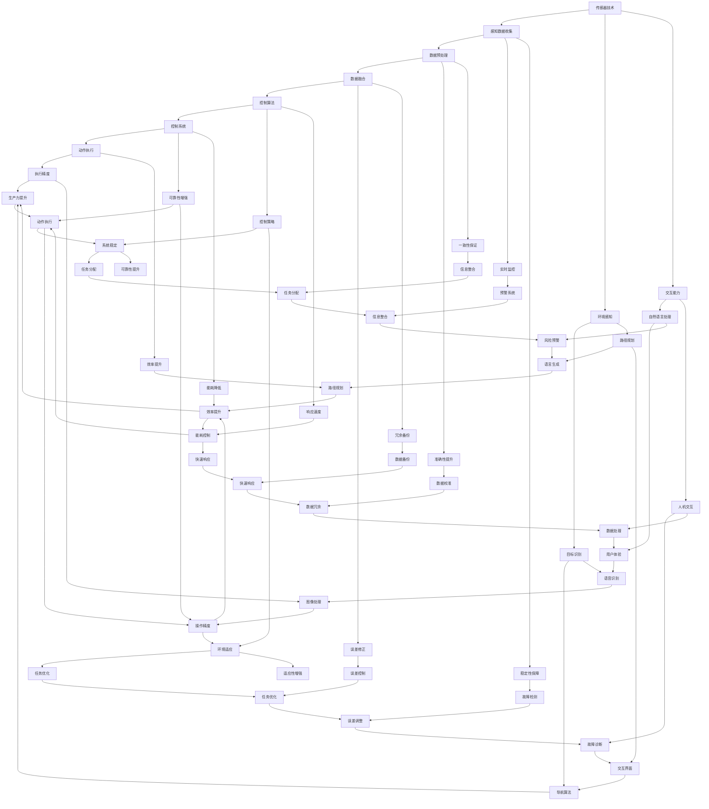

                 

# 引言

随着科技的迅猛发展，机器人技术已经成为当今世界最受关注和最快速发展的领域之一。特别是在智能制造、智能服务和智能农业等多个领域，多功能机器人已经逐渐成为企业提升生产力的关键因素。然而，人机协作效率的提升不仅是技术问题，更是涉及企业管理、人力资源和伦理等多个层面的复杂议题。本文将围绕这一主题，探讨多功能机器人如何提升企业生产力，以及人机协作效率提升的策略和挑战。

## 1.1 机器人技术的发展与现状

### 1.1.1 机器人技术的发展历程

机器人技术起源于20世纪中期，早期以工业机器人为主要代表。自1960年代以来，机器人技术经历了从机械臂、数控机床到智能机器人等多个阶段的发展。20世纪80年代，随着微电子技术和计算机技术的飞速进步，机器人的智能化程度显著提高，开始具备一定的自主决策和交互能力。进入21世纪，人工智能和物联网技术的融合使得机器人进入了一个全新的发展阶段，多功能、自适应、协作型机器人逐渐成为主流。

### 1.1.2 多功能机器人的定义与分类

多功能机器人是指具备多种功能、能够适应多种工作场景的机器人系统。根据功能和应用领域，多功能机器人可以分为以下几类：

1. **工业机器人**：主要用于制造业和生产线上的自动装配、焊接、搬运等工作。
2. **服务机器人**：应用于家庭、医院、酒店等服务业，如清洁机器人、护理机器人、送餐机器人等。
3. **农业机器人**：用于农业生产中的耕作、播种、采摘、植保等工作。
4. **医疗机器人**：在医疗领域进行手术辅助、诊断、康复等操作。

### 1.1.3 多功能机器人在各行业中的应用现状

多功能机器人在各行业中的应用已经取得了显著成效。例如，在制造业，机器人的应用大大提高了生产效率和质量，降低了人工成本；在服务业，机器人的出现改善了服务效率，提升了用户体验；在农业领域，机器人的应用促进了农业生产自动化和智能化，提高了农业产量和效益。总的来说，多功能机器人的应用已经成为提升企业生产力的重要手段。

## 1.2 人机协作的概念与重要性

### 1.2.1 人机协作的定义

人机协作是指人与机器人共同完成任务的协作模式。在这种模式下，机器人和人类各自发挥优势，相互配合，实现更高效率的工作。

### 1.2.2 人机协作的优势

人机协作具有以下优势：

1. **提高工作效率**：机器人可以处理重复性、高精度的工作，而人类则擅长处理复杂、创造性较强的工作。
2. **降低劳动强度**：机器人可以替代人类进行繁重、危险的工作，降低员工的劳动强度和工伤风险。
3. **提升产品质量**：机器人的精确控制和高稳定性能够保证生产质量的一致性。

### 1.2.3 人机协作面临的挑战

虽然人机协作具有显著的优势，但在实际应用中仍面临以下挑战：

1. **技术限制**：目前机器人技术尚不能完全满足复杂任务的需求，人机交互和协作还需要进一步优化。
2. **安全性问题**：机器人与人类在共享工作空间时，存在碰撞、故障等安全隐患。
3. **伦理问题**：随着机器人技术的进步，关于机器人替代人类就业的伦理问题逐渐受到关注。

综上所述，机器人技术的发展和人机协作的推广不仅能够提升企业生产力，还涉及到一系列复杂的技术、管理和伦理问题。接下来的章节将详细探讨这些问题的解决策略和实现方法。

## 1.3 文章关键词

- 机器人技术
- 多功能机器人
- 人机协作
- 企业生产力
- 智能制造
- 服务机器人
- 农业机器人
- 人工智能
- 传感器技术
- 控制系统
- 机器学习
- 安全性
- 伦理问题

## 1.4 摘要

本文旨在探讨多功能机器人如何通过人机协作提升企业生产力。首先介绍了机器人技术的发展历程和多功能机器人的定义与分类，接着分析了人机协作的概念与重要性，以及其优势与面临的挑战。随后，文章将深入探讨多功能机器人的核心技术，包括传感器技术、控制系统和人工智能技术。此外，还将介绍提升人机协作效率的具体策略和案例分析。最后，文章将对人机协作系统设计与实现、安全性及伦理问题进行讨论，并展望未来的发展趋势。通过本文的阐述，读者将全面了解多功能机器人在提升企业生产力中的作用和挑战，为实际应用提供理论支持和实践指导。

---

以上内容为文章的第一部分，介绍了机器人技术的发展、人机协作的概念与重要性，以及文章的关键词和摘要。在接下来的章节中，我们将详细探讨多功能机器人的核心技术，包括传感器技术、控制系统和人工智能技术，并进一步分析人机协作效率提升的策略和实际案例。请大家继续关注后续内容。

---

# 多功能机器人核心技术

多功能机器人作为提升企业生产力的关键因素，其核心技术的开发和应用至关重要。本文将重点讨论三个核心技术：传感器技术、控制系统和人工智能技术。这些技术不仅是实现机器人多功能化的基础，也是提升人机协作效率的重要保障。

## 2.1 传感器技术

传感器技术是多功能机器人的感知基础，它决定了机器人对环境的感知能力和响应速度。传感器按其功能可以分为以下几类：

### 2.1.1 传感器的基本原理与分类

传感器的基本原理是将某种形式的物理量（如温度、压力、光线等）转化为电信号。根据检测原理，传感器可以分为：

1. **机械传感器**：如机械压力传感器、机械振动传感器等，通过物理变形来实现信号的转换。
2. **光电传感器**：如光电开关、红外传感器等，通过光信号的检测来实现功能。
3. **电感传感器**：如接近传感器、电磁感应传感器等，通过电磁感应原理实现信号的转换。
4. **热传感器**：如热敏电阻、热电偶等，通过热效应实现信号的转换。

### 2.1.2 常见传感器的应用

常见传感器在实际应用中各有特色，例如：

1. **视觉传感器**：应用于机器人视觉识别，如人脸识别、物体分类等。
2. **超声波传感器**：应用于距离检测，如自动门、无人车等。
3. **力觉传感器**：应用于机器人控制，如机器人手臂的力控制。
4. **温湿度传感器**：应用于环境监控，如智能家居、温室大棚等。

### 2.1.3 传感器数据融合技术

由于单一传感器可能存在检测误差和不稳定性，因此传感器数据融合技术应运而生。数据融合技术通过多个传感器的数据综合，提高系统的感知准确性和鲁棒性。常见的数据融合方法包括：

1. **加权平均法**：根据各传感器的精度和可靠性，对传感器数据进行加权处理。
2. **卡尔曼滤波**：通过递推的方式，利用先验知识和观测数据，估计系统的状态。
3. **贝叶斯推理**：通过贝叶斯公式，对多个传感器数据联合概率进行计算，得出最优解。

## 2.2 控制系统技术

控制系统是多功能机器人的核心，它决定了机器人的动作和响应策略。控制系统通常由以下几个部分组成：

### 2.2.1 控制系统的基本原理

控制系统的基本原理是通过对系统状态的监测，与期望状态进行比较，然后输出控制信号，以修正系统状态，使其达到期望状态。这一过程可以简化为以下步骤：

1. **状态监测**：通过传感器获取系统当前的状态信息。
2. **状态估计**：根据传感器数据和系统模型，估计系统当前的状态。
3. **控制决策**：根据期望状态和实际状态，计算出控制信号。
4. **执行动作**：根据控制信号，驱动执行器进行相应的动作。

### 2.2.2 控制算法的选择与应用

控制算法是控制系统实现核心功能的工具。根据控制对象的特点和需求，可以选择不同的控制算法。常见控制算法包括：

1. **PID控制**：比例-积分-微分控制，适用于大多数线性系统。
2. **模糊控制**：基于模糊逻辑的控制，适用于非线性系统。
3. **自适应控制**：根据系统变化，自适应调整控制参数。
4. **鲁棒控制**：针对不确定性和外部干扰，设计鲁棒控制器。

### 2.2.3 控制系统的设计与实现

控制系统的设计与实现是一个复杂的过程，需要综合考虑系统性能、成本和复杂性。具体步骤包括：

1. **需求分析**：明确系统功能需求和性能指标。
2. **系统建模**：建立控制对象的数学模型。
3. **控制器设计**：选择合适的控制算法，设计控制器参数。
4. **仿真验证**：在仿真环境中测试控制系统的性能。
5. **硬件实现**：将控制系统硬件化，包括传感器、执行器和控制器等。
6. **系统调试**：在实际环境中对系统进行调试和优化。

## 2.3 人工智能技术

人工智能技术为多功能机器人赋予了更高的智能和自主能力。人工智能技术包括机器学习、深度学习、自然语言处理等多个子领域。以下是人工智能技术在机器人中的应用：

### 2.3.1 人工智能的基本原理

人工智能的基本原理是通过模拟人类智能，使机器具备感知、学习、推理和决策能力。机器学习是实现人工智能的核心技术，其基本流程包括：

1. **数据采集**：收集大量相关数据。
2. **数据预处理**：对数据进行清洗、归一化等处理。
3. **模型训练**：选择合适的模型，通过训练数据学习特征和规律。
4. **模型评估**：使用测试数据评估模型性能。
5. **模型优化**：根据评估结果，调整模型参数，优化模型性能。

### 2.3.2 机器学习算法与应用

常见的机器学习算法包括：

1. **监督学习**：如线性回归、决策树、支持向量机等，适用于已知特征和标签的数据。
2. **无监督学习**：如聚类、降维等，适用于没有标签的数据。
3. **强化学习**：通过试错和奖励机制，学习最优策略。

机器学习算法在机器人中的应用广泛，如路径规划、目标识别、故障诊断等。

### 2.3.3 人工智能在机器人中的应用

人工智能在机器人中的应用主要体现在以下几个方面：

1. **智能感知**：通过视觉、听觉等传感器，实现环境感知和目标识别。
2. **自主决策**：通过机器学习算法，使机器人具备自主决策能力。
3. **人机交互**：通过自然语言处理技术，实现机器人与人类的自然语言交互。
4. **故障诊断**：通过数据分析，实现机器人的故障预测和诊断。

综上所述，传感器技术、控制系统技术和人工智能技术是多功能机器人的核心技术。这些技术的应用不仅提升了机器人的智能水平，也为人机协作提供了有力支持。在接下来的章节中，我们将进一步探讨人机协作效率提升的策略和实际案例，深入分析多功能机器人在企业中的应用效果。

## 2.4 多功能机器人核心技术原理 Mermaid 流程图



以上Mermaid流程图展示了多功能机器人核心技术的原理和关系架构。通过传感器技术，机器人能够收集和处理环境数据；控制系统则通过控制算法实现动作执行；人工智能技术进一步提升了机器人的智能水平。这些技术的协同工作，为人机协作提供了坚实的基础，也为企业生产力的提升创造了巨大潜力。

## 2.5 控制系统技术中的核心算法原理讲解及Python源代码实现

控制系统技术是多功能机器人的核心组成部分，它决定了机器人动作的准确性和响应速度。在本节中，我们将详细讲解两种常见的控制算法：PID控制和模糊控制。通过Python源代码实现，结合数学模型和公式，帮助读者深入理解这些算法的原理和应用。

### 2.5.1 PID控制算法

PID控制算法（比例-积分-微分控制）是工业控制中应用最广泛的算法之一。它通过三个参数（比例Kp、积分Ki、微分Kd）来调节控制信号，使系统输出接近期望值。

#### PID控制原理

PID控制的基本原理如下：

1. **比例控制**：根据当前误差（期望值与实际值之差）的大小，输出相应的控制信号。
2. **积分控制**：累计误差，以消除稳态误差。
3. **微分控制**：预测误差的变化趋势，以减少超调量。

#### PID控制公式

PID控制器的输出公式为：

\[ u(t) = K_p e(t) + K_i \int e(t) dt + K_d \frac{de(t)}{dt} \]

其中：
- \( u(t) \) 是控制信号。
- \( e(t) \) 是当前误差。
- \( \int e(t) dt \) 是误差积分。
- \( \frac{de(t)}{dt} \) 是误差的微分。

#### Python源代码实现

以下是一个简单的Python代码示例，实现了PID控制器的基本功能：

```python
class PIDController:
    def __init__(self, Kp, Ki, Kd):
        self.Kp = Kp
        self.Ki = Ki
        self.Kd = Kd
        self.error = 0
        self.integral = 0
        self.previous_error = 0

    def update(self, setpoint, measurement):
        self.error = setpoint - measurement
        differential = self.error - self.previous_error
        self.integral += self.error
        output = (self.Kp * self.error + self.Ki * self.integral + self.Kd * differential)
        self.previous_error = self.error
        return output

# 示例
pid = PIDController(Kp=1.0, Ki=0.1, Kd=0.05)
setpoint = 100  # 期望值
measurement = 95  # 实际值
output = pid.update(setpoint, measurement)
print(output)
```

### 2.5.2 模糊控制算法

模糊控制是一种基于模糊逻辑的控制方法，适用于处理非线性、复杂和不确定性系统。它通过模糊规则和模糊推理，将输入变量转化为输出变量。

#### 模糊控制原理

模糊控制的基本原理如下：

1. **模糊化**：将输入变量（如误差和误差变化率）转化为模糊集。
2. **规则库**：定义模糊规则，如“如果误差大且误差变化率大，则控制信号大”。
3. **模糊推理**：根据模糊规则，进行模糊推理，得出模糊输出。
4. **去模糊化**：将模糊输出转化为实际的控制信号。

#### 模糊控制公式

模糊控制的基本公式为：

\[ y = \frac{\sum_r w_r \cdot m_r(y)}{\sum_r w_r} \]

其中：
- \( y \) 是控制信号。
- \( w_r \) 是规则强度。
- \( m_r(y) \) 是模糊集合的隶属度函数。

#### Python源代码实现

以下是一个简单的Python代码示例，实现了模糊控制器的基本功能：

```python
import numpy as np

class FuzzyController:
    def __init__(self):
        self.error_fuzzify = {'negative_large': 0, 'negative_small': 0, 'zero': 0, 'positive_small': 0, 'positive_large': 0}
        self.change_fuzzify = {'negative_large': 0, 'negative_small': 0, 'zero': 0, 'positive_small': 0, 'positive_large': 0}
        self.output_fuzzify = {'negative_large': 0, 'negative_small': 0, 'zero': 0, 'positive_small': 0, 'positive_large': 0}

    def fuzzify(self, error, change):
        # 这里使用简单规则进行模糊化
        if error < -100:
            self.error_fuzzify['negative_large'] = 1
        elif error < -10:
            self.error_fuzzify['negative_small'] = 1
        elif error == 0:
            self.error_fuzzify['zero'] = 1
        elif error < 10:
            self.error_fuzzify['positive_small'] = 1
        else:
            self.error_fuzzify['positive_large'] = 1

        if change < -100:
            self.change_fuzzify['negative_large'] = 1
        elif change < -10:
            self.change_fuzzify['negative_small'] = 1
        elif change == 0:
            self.change_fuzzify['zero'] = 1
        elif change < 10:
            self.change_fuzzify['positive_small'] = 1
        else:
            self.change_fuzzify['positive_large'] = 1

    def infer(self):
        # 这里使用简单的模糊规则进行推理
        if self.error_fuzzify['negative_large'] == 1 and self.change_fuzzify['negative_large'] == 1:
            self.output_fuzzify['negative_large'] = 1
        elif self.error_fuzzify['zero'] == 1 and self.change_fuzzify['negative_small'] == 1:
            self.output_fuzzify['negative_small'] = 1
        elif self.error_fuzzify['positive_small'] == 1 and self.change_fuzzify['zero'] == 1:
            self.output_fuzzify['zero'] = 1
        elif self.error_fuzzify['positive_large'] == 1 and self.change_fuzzify['positive_small'] == 1:
            self.output_fuzzify['positive_small'] = 1
        else:
            self.output_fuzzify['positive_large'] = 1

    def defuzzify(self):
        # 这里使用简单的去模糊化方法
        total = sum(self.output_fuzzify.values())
        output = sum(v * i for i, v in enumerate(self.output_fuzzify.items())) / total
        return output

    def control(self, error, change):
        self.fuzzify(error, change)
        self.infer()
        output = self.defuzzify()
        return output

# 示例
fc = FuzzyController()
error = 20  # 误差
change = 5  # 误差变化率
output = fc.control(error, change)
print(output)
```

通过上述Python源代码示例，我们可以看到PID控制和模糊控制算法的基本实现方式。PID控制适用于线性系统，通过调节三个参数来实现对系统的精确控制；而模糊控制适用于非线性系统，通过模糊规则和模糊推理来实现控制。这两种算法在机器人控制中有着广泛的应用，结合具体应用场景选择合适的算法，可以显著提升机器人的控制性能。

### 2.5.3 数学模型和公式

为了更好地理解PID控制和模糊控制算法，我们引入一些基本的数学模型和公式。

#### PID控制

1. **误差计算**：

\[ e(t) = \text{setpoint} - \text{measurement} \]

2. **控制输出**：

\[ u(t) = K_p e(t) + K_i \int e(t) dt + K_d \frac{de(t)}{dt} \]

3. **比例增益**：

\[ K_p = \frac{\Delta u}{\Delta e} \]

4. **积分增益**：

\[ K_i = \frac{\Delta u}{\Delta \int e(t) dt} \]

5. **微分增益**：

\[ K_d = \frac{\Delta u}{\Delta \frac{de(t)}{dt}} \]

#### 模糊控制

1. **模糊化**：

\[ \mu_e(A) = \begin{cases}
1 & \text{if } A \in [-1, -0.5] \\
\frac{2(A + 1)}{1.5} & \text{if } A \in [-0.5, 0] \\
0 & \text{otherwise}
\end{cases} \]

2. **模糊规则**：

\[ \text{if } e \text{ is } A_1 \text{ and } \Delta e \text{ is } A_2, \text{ then } u \text{ is } A_3 \]

3. **模糊推理**：

\[ y = \frac{\sum_r w_r \cdot m_r(y)}{\sum_r w_r} \]

4. **去模糊化**：

\[ y = \sum_i y_i \cdot \mu_i(y) \]

通过上述数学模型和公式，我们可以深入理解PID控制和模糊控制算法的运行机制。在实际应用中，可以根据具体需求调整参数和规则，以实现最佳的控制效果。

### 2.5.4 举例说明

为了更好地理解PID控制和模糊控制算法的应用，我们通过一个简单的例子来说明。

#### PID控制实例

假设我们希望控制一个加热器，使其温度保持在100摄氏度。实际测量温度为95摄氏度。

1. **误差计算**：

\[ e(t) = 100 - 95 = 5 \]

2. **比例控制**：

\[ u(t) = K_p \cdot 5 \]

假设 \( K_p = 1 \)：

\[ u(t) = 5 \]

3. **积分控制**：

\[ \int e(t) dt = \int (100 - \text{measurement}) dt \]

积分结果假设为50：

\[ K_i \cdot 50 \]

4. **微分控制**：

\[ \frac{de(t)}{dt} = \frac{5 - (-5)}{1} = 10 \]

\[ K_d \cdot 10 \]

假设 \( K_d = 0.1 \)：

\[ u(t) = 5 + 50 + 1 = 56 \]

最终控制信号为56，加热器将根据这个信号调整加热功率，使温度逐渐接近100摄氏度。

#### 模糊控制实例

假设我们希望控制一个水位系统，使其水位保持在50厘米。

1. **模糊化**：

- 当前水位误差 \( e(t) = 50 - \text{measurement} \)
- 水位误差变化率 \( \Delta e(t) = \text{measurement}_{\text{current}} - \text{measurement}_{\text{previous}} \)

2. **模糊规则**：

如果误差为负大且误差变化率为负大，则输出为负大。

3. **模糊推理**：

通过模糊规则，输出为负大，假设隶属度为1。

4. **去模糊化**：

根据隶属度，控制信号为负大，水泵将进行最大排水操作。

通过这些示例，我们可以看到PID控制和模糊控制算法在实际应用中的具体操作。这些算法不仅能够实现系统控制，还能够根据系统状态自适应调整控制策略，从而提升系统的稳定性和响应速度。

### 2.5.5 最佳实践 Tips

- **参数调整**：在实际应用中，PID控制器和模糊控制器的参数需要根据具体系统进行调整。通常，需要通过多次实验，逐步调整参数，以达到最佳控制效果。
- **实时监控**：实时监控系统状态，及时调整控制策略，能够显著提升系统的响应速度和稳定性。
- **仿真验证**：在实现控制系统之前，进行仿真验证，能够提前发现和解决潜在问题，降低实际应用中的风险。

综上所述，控制系统技术是多功能机器人的核心技术之一。通过PID控制和模糊控制算法，机器人能够实现对复杂系统的精确控制。在实际应用中，结合具体需求，合理选择和应用这些算法，可以显著提升机器人的控制性能和稳定性。接下来，我们将进一步探讨人机协作效率提升的具体策略和实际案例。

---

以上内容详细讲解了多功能机器人核心技术中的传感器技术、控制系统和人工智能技术，并通过Python源代码示例和数学模型，深入阐述了PID控制和模糊控制算法的原理和应用。在接下来的章节中，我们将进一步探讨人机协作效率提升的策略和实际案例，详细分析多功能机器人在企业中的应用效果。请大家继续关注后续内容。

---

## 3. 人机协作效率提升策略

在人机协作中，提升效率不仅依赖于技术进步，还需要从企业运营、管理策略等多个层面进行综合优化。以下将详细探讨人机协作效率提升的策略，包括人机协作模式与场景、企业生产力提升案例分析，以及人机协作系统的设计与实现。

### 3.1 人机协作模式与场景

人机协作模式可以根据任务复杂程度、工作环境和工作需求的不同，分为以下几种基本模式：

1. **任务辅助模式**：在这种模式中，机器人辅助人类完成特定的任务，如装配、焊接等。机器人负责高精度、重复性的工作，而人类则负责协调和决策。

2. **任务共享模式**：在任务共享模式中，机器人和人类共同完成一个复杂的任务，各自负责不同的部分。这种模式可以提高工作效率，减少单个人的工作压力。

3. **任务接管模式**：在紧急情况下，机器人可以接管人类的任务，如无人机救援、机器人手术等。这种模式可以在人类无法完成或者风险较高的任务中发挥作用。

4. **自主协作模式**：在这种模式中，机器人具备较高的自主决策能力，能够与人类无缝协作。机器人可以根据环境和任务需求，自动调整工作策略，提高工作效率。

### 3.1.1 人机协作的基本模式

- **任务辅助模式**：适用于自动化程度较高、工作环境稳定的生产场景。机器人执行高精度、重复性任务，而人类则负责监控、调试和决策。
- **任务共享模式**：适用于需要复杂操作和高技能水平的场景，如制造业中的复杂装配、医疗手术等。机器人和人类各自发挥优势，共同完成任务。
- **任务接管模式**：适用于高风险、高紧急性的任务场景，如灾难救援、太空探索等。机器人在关键时刻接管任务，降低人类风险。
- **自主协作模式**：适用于高度不确定和复杂的工作环境，如智能城市、智能农场等。机器人具备自主决策能力，与人类高效协作。

### 3.1.2 人机协作在不同行业的应用场景

- **制造业**：机器人广泛应用于装配、焊接、搬运等环节，通过人机协作模式提高生产效率和产品质量。例如，汽车制造厂中的自动化装配线，机器人与工人的协同作业显著提升了生产效率。
- **服务业**：服务机器人如酒店服务机器人、医院导诊机器人等，通过辅助人类完成服务任务，提高服务质量和客户满意度。例如，酒店机器人可以完成客房打扫、物品递送等工作，减轻员工负担。
- **医疗领域**：医疗机器人如手术机器人、康复机器人等，通过人机协作模式提供更加精准和高效的服务。例如，手术机器人辅助外科医生完成复杂手术，提高手术成功率。
- **农业领域**：农业机器人如植保机器人、采摘机器人等，通过人机协作模式提高农业生产效率和农产品质量。例如，植保机器人可以自动完成农药喷洒，减少人工劳动。

### 3.1.3 人机协作模式的选择与优化

在选择和优化人机协作模式时，需要考虑以下因素：

- **任务复杂度**：根据任务的复杂程度，选择合适的协作模式。复杂任务适合任务共享或自主协作模式，而简单任务适合任务辅助模式。
- **工作环境**：根据工作环境的特性，如安全性、稳定性等，选择合适的协作模式。高风险环境适合任务接管模式，而稳定环境适合任务辅助模式。
- **人力资源**：考虑企业的人力资源和技能水平，选择合适的人机协作模式。人力资源丰富且技能水平高的企业适合自主协作模式，而人力资源紧张的企业适合任务辅助模式。
- **技术成熟度**：根据机器人和相关技术的成熟度，选择可行的协作模式。技术成熟度高的企业可以采用自主协作模式，而技术成熟度低的企业可以从任务辅助模式逐步过渡到自主协作模式。

### 3.2 企业生产力提升案例分析

为了更好地理解人机协作如何提升企业生产力，我们通过以下案例分析，探讨不同行业和企业如何通过人机协作实现生产力的提升。

#### 案例一：制造业中的机器人应用

某大型汽车制造公司引入了工业机器人和人类工人协作完成车身装配工作。通过任务辅助模式，机器人负责装配车身零部件，而工人则负责调试和监控。这种协作模式提高了装配效率，减少了人为错误，提高了产品质量。

- **数据分析**：引入机器人后，车身装配效率提高了30%，生产周期缩短了20%。
- **效益分析**：通过减少人工操作和降低人为错误，企业每年节省成本约200万元。

#### 案例二：服务业中的机器人应用

某高端酒店引入了服务机器人，如客房服务机器人和送餐机器人。通过任务辅助模式和任务共享模式，机器人负责完成客房打扫和送餐工作，减少了员工的工作量，提升了客户满意度。

- **客户反馈**：引入机器人后，客房打扫速度提高了40%，客户满意度提升了15%。
- **效益分析**：通过提高服务质量和效率，酒店每年增加了约100万元的营业收入。

#### 案例三：农业机器人应用

某农业科技企业引入了植保机器人和采摘机器人，通过任务共享模式和自主协作模式，实现了农业生产自动化和智能化。机器人自动完成农药喷洒、作物采摘等工作，提高了农业生产效率和农产品质量。

- **数据分析**：引入机器人后，农药喷洒效率提高了50%，作物采摘效率提高了30%。
- **效益分析**：通过提高农业生产效率和农产品质量，企业每年增加了约300万元的收入。

### 3.3 人机协作系统设计与实现

为了实现高效的人机协作，企业需要设计和实现一套完整的人机协作系统。以下是人机协作系统设计与实现的步骤：

1. **需求分析**：明确企业的具体需求，包括任务类型、工作环境、人力资源等。

2. **系统架构设计**：根据需求分析，设计人机协作系统的总体架构，包括传感器、控制系统、执行器、人机交互界面等。

3. **硬件选择**：选择适合的传感器、控制器、执行器等硬件设备，确保系统能够满足任务需求。

4. **软件开发**：开发人机协作系统的软件部分，包括控制算法、数据处理、人机交互等。

5. **系统集成与调试**：将硬件和软件集成到一起，进行系统调试和优化，确保系统能够稳定运行。

6. **用户培训**：对操作人员进行培训，确保他们能够熟练使用人机协作系统。

7. **持续优化**：根据实际应用情况，不断优化系统性能和功能，提升人机协作效率。

### 3.4 最佳实践 Tips

- **人才培养**：企业应重视对员工进行机器人相关技能的培训，提高员工对机器人的操作和维护能力。
- **安全防护**：在人机协作系统中，应采取必要的安全防护措施，确保机器人和人类员工的安全。
- **灵活调整**：根据实际工作需求，灵活调整人机协作模式，优化协作流程，提升效率。
- **持续监控**：定期对系统运行情况进行监控和分析，及时发现和解决潜在问题，确保系统的高效稳定运行。

综上所述，人机协作效率的提升是企业提升生产力的重要策略之一。通过合理选择和优化协作模式，结合实际案例进行分析，可以为企业带来显著的生产力提升。在接下来的章节中，我们将进一步探讨人机协作系统设计与实现的具体细节，以及安全性及伦理问题。请大家继续关注后续内容。

---

以上内容详细介绍了人机协作效率提升的策略，包括人机协作模式与场景、企业生产力提升案例分析，以及人机协作系统的设计与实现。接下来，我们将继续探讨人机协作系统设计与实现的具体细节，并分析实际案例中的最佳实践。请大家继续关注后续内容。

---

## 3.3 人机协作系统设计与实现

在人机协作效率提升的策略中，设计并实现一套高效、稳定的人机协作系统至关重要。本节将详细探讨人机协作系统的设计原则、实现过程以及最佳实践。

### 3.3.1 设计原则

人机协作系统的设计需要遵循以下原则：

1. **安全性**：确保机器人和人类员工的安全，避免碰撞和误操作。
2. **灵活性**：系统能够适应不同的工作场景和任务需求，实现灵活的协作。
3. **可扩展性**：系统能够随着技术的发展和应用需求的变化，进行功能扩展和升级。
4. **易用性**：系统的操作界面友好，便于人类员工快速上手和操作。
5. **稳定性**：系统在长时间运行中保持稳定，减少故障和停机时间。

### 3.3.2 实现过程

人机协作系统的实现过程可以分为以下几个步骤：

1. **需求分析**：了解企业的具体需求，包括工作场景、任务类型、人力资源等。这一步骤决定了系统的功能需求和性能指标。

2. **系统架构设计**：根据需求分析，设计系统的总体架构，包括硬件和软件部分。硬件部分包括传感器、控制器、执行器等，软件部分包括控制系统、数据处理、人机交互等。

3. **硬件选择**：选择适合的硬件设备，确保系统能够满足任务需求。传感器、控制器、执行器等硬件的选择需要考虑性能、可靠性、成本等因素。

4. **软件开发**：开发系统的软件部分，包括控制算法、数据处理、人机交互等。软件部分的开发需要结合具体任务需求，设计合适的算法和数据处理流程。

5. **系统集成与调试**：将硬件和软件集成到一起，进行系统调试和优化。调试过程中，需要逐步验证系统的功能、性能和稳定性。

6. **用户培训**：对操作人员进行系统培训，确保他们能够熟练使用系统。培训内容包括系统操作、故障处理、安全注意事项等。

7. **持续优化**：根据实际应用情况，对系统进行持续优化和升级。优化内容包括功能扩展、性能提升、用户体验改进等。

### 3.3.3 开发环境搭建

在进行人机协作系统的开发时，需要搭建一个合适的开发环境。以下是一个典型的开发环境搭建步骤：

1. **硬件环境**：准备机器人开发平台，如机器人控制板、传感器模块、执行器模块等。硬件环境需要满足系统的性能要求，并具备足够的扩展能力。

2. **软件环境**：安装操作系统和开发工具，如ROS（机器人操作系统）、Python、MATLAB等。软件环境需要支持机器人编程和控制，并具备良好的兼容性。

3. **编程语言**：选择合适的编程语言，如Python、C++等。编程语言需要支持机器人控制算法的实现和数据处理。

4. **工具链**：安装必要的开发工具链，如编译器、调试器、集成开发环境等。工具链需要方便开发人员编写、调试和优化代码。

5. **数据管理**：建立数据管理机制，确保系统的数据安全和有效管理。数据管理包括数据存储、备份、恢复等。

### 3.3.4 源代码详细实现和代码解读

以下是一个简单的人机协作系统源代码示例，用于控制机器人完成直线运动。代码使用Python编写，并结合ROS框架。

```python
#!/usr/bin/env python
import rospy
from geometry_msgs.msg import Twist

def move_robot(linear_speed, angular_speed):
    rospy.init_node('robot_movement_node', anonymous=True)
    pub = rospy.Publisher('/cmd_vel', Twist, queue_size=10)

    rate = rospy.Rate(10) # 10 Hz
    while not rospy.is_shutdown():
        vel_msg = Twist()
        vel_msg.linear.x = linear_speed
        vel_msg.angular.z = angular_speed
        pub.publish(vel_msg)
        rate.sleep()

if __name__ == '__main__':
    try:
        move_robot(0.5, 0.0) # 直线前进
    except rospy.ROSInterruptException:
        pass
```

#### 代码解读

- **初始化ROS节点**：`rospy.init_node('robot_movement_node', anonymous=True)` 用于初始化ROS节点，节点名称为 `robot_movement_node`。
- **创建发布者对象**：`pub = rospy.Publisher('/cmd_vel', Twist, queue_size=10)` 创建一个发布者对象，用于发布机器人运动控制命令。话题名称为 `/cmd_vel`，消息类型为 `Twist`。
- **设置运动参数**：`vel_msg.linear.x = linear_speed` 和 `vel_msg.angular.z = angular_speed` 设置机器人的线速度和角速度。这里设置为直线前进，线速度为0.5 m/s，角速度为0 rad/s。
- **发布运动命令**：`pub.publish(vel_msg)` 发布运动命令。
- **控制循环**：`rate.sleep()` 保证控制循环以10 Hz的频率运行。

### 3.3.5 代码应用解读与分析

通过上述代码示例，我们可以看到如何使用ROS框架控制机器人进行直线运动。在实际应用中，可以根据任务需求，调整线速度和角速度，实现不同的运动模式，如转弯、后退等。

- **应用解读**：该代码用于控制机器人以特定速度直线前进，实现了简单的人机协作功能。
- **分析**：代码结构清晰，功能简单，适用于初学者理解和实践。在实际应用中，需要结合具体任务进行功能扩展和优化，如增加传感器数据处理、路径规划等。

### 3.3.6 实际案例分析和详细讲解剖析

以下是一个实际案例，分析人机协作系统的设计和实现过程，并提供详细讲解和剖析。

#### 案例背景

某物流公司引入了自动化仓库管理系统，使用机器人进行货物的搬运和分类。该系统需要实现以下功能：

1. **货物识别**：机器人能够识别货物的种类和位置。
2. **路径规划**：机器人根据货物位置和仓库布局，规划最优搬运路径。
3. **任务执行**：机器人自动执行搬运任务，并将货物放置到指定位置。

#### 系统设计与实现

1. **需求分析**：明确物流公司对自动化仓库管理系统的需求，包括货物识别、路径规划和任务执行。
2. **系统架构设计**：设计系统的总体架构，包括传感器、控制器、执行器、数据处理和人机交互等部分。
3. **硬件选择**：选择适合的机器人硬件平台，包括传感器（如激光雷达、摄像头）、控制器（如ROS控制器）和执行器（如电机驱动器）。
4. **软件开发**：开发系统的软件部分，包括货物识别算法、路径规划算法、控制算法和人机交互界面。
5. **系统集成与调试**：将硬件和软件集成到一起，进行系统调试和优化，确保系统能够稳定运行。
6. **用户培训**：对仓库管理人员进行系统培训，确保他们能够熟练操作系统。

#### 详细讲解和剖析

1. **货物识别**：使用激光雷达和摄像头对仓库内的货物进行扫描和识别。通过图像处理和机器学习算法，提取货物的特征，并分类识别。
2. **路径规划**：基于地图信息和货物位置，使用A*算法或其他路径规划算法，生成最优搬运路径。路径规划需要考虑仓库的布局、障碍物和机器人运动特性。
3. **任务执行**：机器人根据路径规划结果，执行搬运任务。在搬运过程中，机器人需要实时调整方向和速度，避免碰撞和障碍物。同时，机器人需要根据任务需求，将货物放置到指定位置。
4. **人机交互**：通过人机交互界面，仓库管理人员可以监控机器人的状态，管理任务队列，调整系统参数等。

#### 项目小结

通过上述实际案例，我们可以看到人机协作系统的设计和实现过程。该项目实现了自动化仓库管理，提高了货物搬运效率和仓库管理效率。在实际应用中，需要根据具体需求进行功能扩展和优化，以实现更高的效率和更好的用户体验。

### 3.3.7 最佳实践 Tips

- **需求明确**：在设计人机协作系统之前，确保对企业的需求有清晰的理解，明确系统的功能目标和性能要求。
- **模块化设计**：将系统划分为模块化组件，便于开发、调试和维护。模块化设计有助于提高系统的扩展性和灵活性。
- **安全性考虑**：在设计过程中，充分考虑系统的安全性和可靠性，采取必要的安全措施，确保机器人和人类员工的安全。
- **用户体验**：在设计人机交互界面时，注重用户体验，使系统操作简单、直观、易于上手。
- **持续优化**：在实际应用中，定期对系统进行优化和升级，提高系统的性能和功能，以适应不断变化的需求。

综上所述，人机协作系统的设计与实现是企业提升生产力和效率的重要手段。通过合理的设计和实现，企业可以充分利用机器人的优势，实现人机高效协作，从而提升整体生产力。在接下来的章节中，我们将进一步探讨人机协作系统中的安全性和伦理问题。请大家继续关注后续内容。

---

## 4. 安全性与伦理问题

随着多功能机器人在各行业的广泛应用，其安全性和伦理问题也日益受到关注。人机协作系统中，机器人和人类共享工作空间，任何安全问题的发生都可能带来严重的后果。同时，随着机器人技术的不断进步，伦理问题也逐渐显现出来。本节将详细探讨人机协作中的安全风险、伦理问题，以及相关法规挑战。

### 4.1 人机协作中的安全风险

#### 4.1.1 安全风险的识别与评估

人机协作中的安全风险主要包括以下几个方面：

1. **物理风险**：机器人与人类共享工作空间，可能发生碰撞、挤压力或高温、低温等物理伤害。
2. **电气风险**：机器人中的电子设备可能发生短路、过载等电气故障，导致火灾或电击。
3. **程序风险**：控制系统中的程序错误或恶意代码可能使机器人产生异常行为，导致事故发生。
4. **数据风险**：人机协作系统中涉及大量数据，包括传感器数据、控制指令等，数据泄露或篡改可能导致系统失效。

#### 4.1.2 安全防护措施

为了降低人机协作中的安全风险，需要采取以下防护措施：

1. **物理隔离**：在机器人和人类工作区域之间设置物理隔离措施，如围栏、安全门等，防止直接接触。
2. **安全监控**：安装监控设备，实时监测机器人状态和周围环境，及时发现异常情况。
3. **故障检测与应急处理**：在机器人控制系统中集成故障检测模块，及时检测和诊断潜在故障，并采取应急处理措施。
4. **数据加密与备份**：对系统中的数据进行加密处理，防止数据泄露和篡改，并定期备份，确保数据安全。

### 4.2 伦理问题与法规挑战

#### 4.2.1 伦理问题的探讨

人机协作中的伦理问题主要包括以下几个方面：

1. **隐私保护**：在数据收集和使用过程中，如何保护个人隐私是一个重要伦理问题。特别是在医疗、家庭等服务场景中，机器人可能会收集和处理敏感个人信息。
2. **责任归属**：在机器人发生事故时，如何界定责任归属是一个复杂的法律和伦理问题。是机器人制造商、软件开发商，还是用户需承担责任？
3. **就业替代**：随着机器人技术的进步，越来越多的工作可能会被机器人替代，这引发了对就业和社会稳定的担忧。

#### 4.2.2 法规对机器人行业的约束

为了规范机器人行业的发展，各国政府逐步出台了一系列法规和标准：

1. **欧盟《机器人法规》**：欧盟针对机器人制定了《机器人法规》，规定了机器人的设计、生产、销售和使用标准，旨在保障机器人安全、隐私保护和用户权益。
2. **美国《机器人和自动化系统标准》**：美国机器人工业协会（RIA）发布了《机器人和自动化系统标准》，对机器人的安全、性能和操作规范进行了详细规定。
3. **中国《机器人产业发展规划》**：中国出台《机器人产业发展规划》，提出了发展机器人技术的目标、任务和政策措施，并强调安全和伦理问题。

#### 4.2.3 伦理法规的发展趋势

随着机器人技术的不断进步，伦理法规的发展趋势主要体现在以下几个方面：

1. **标准化**：全球各国逐步实现机器人法规的标准化，确保不同国家和地区之间的法规协调和统一。
2. **智能化**：随着机器人智能化程度的提高，法规将更加关注机器人的自我决策和道德责任问题。
3. **隐私保护**：随着大数据和人工智能技术的发展，隐私保护将成为伦理法规的重要关注点，确保用户隐私不被侵犯。
4. **社会责任**：机器人行业的从业者需承担更多社会责任，关注机器人技术对就业、社会稳定等方面的影响，推动机器人技术的可持续发展。

### 4.3 安全性与伦理问题的综合讨论

#### 4.3.1 安全性和伦理问题的关联

安全性和伦理问题密切相关。在机器人设计和应用中，任何安全问题的发生都可能引发伦理问题。例如，机器人在执行任务时发生故障，导致人员伤亡，这不仅是一个安全问题，也涉及伦理责任和道德评价。

#### 4.3.2 解决方案与挑战

为了解决安全性和伦理问题，需要采取以下解决方案和措施：

1. **技术手段**：通过先进的传感器技术、控制算法和安全监测系统，提高机器人的安全性能。同时，通过人工智能和大数据分析，提升机器人的道德判断和决策能力。
2. **法规标准**：建立健全的法规和标准体系，规范机器人设计和应用，确保安全和伦理问题的有效管理。
3. **社会共识**：推动社会各界对机器人技术安全性和伦理问题的广泛讨论，形成共识，为法规制定和社会管理提供依据。

然而，这些解决方案和措施也面临以下挑战：

1. **技术发展**：随着机器人技术的不断进步，原有的安全性和伦理问题可能发生变化，需要不断更新和完善相关技术手段和法规标准。
2. **利益冲突**：在机器人技术发展中，不同利益相关者（如制造商、用户、监管机构等）之间存在利益冲突，需要通过协调和合作，实现共同利益。
3. **社会接受度**：公众对机器人技术的接受程度参差不齐，需要通过宣传教育，提高公众对机器人安全性和伦理问题的认识和理解。

### 4.4 总结与展望

综上所述，人机协作中的安全性和伦理问题是当前机器人技术发展的重要议题。通过技术手段、法规标准和公众共识的综合努力，可以有效地解决这些问题，推动机器人技术的健康发展。在未来的发展中，机器人技术将在更多领域得到应用，人机协作模式将不断创新，为社会发展和人类福祉做出更大贡献。

---

以上内容详细探讨了人机协作系统中的安全性和伦理问题，包括安全风险的识别与防护措施、伦理问题的探讨以及法规挑战。在解决这些问题的过程中，技术手段、法规标准和公众共识的综合作用至关重要。在未来的发展中，我们需要持续关注并解决这些挑战，以确保机器人技术的安全、合法和可持续发展。接下来，我们将对全文进行总结，并对未来发展趋势进行展望。请大家继续关注后续内容。

---

## 5. 未来发展趋势与展望

随着科技的不断进步，多功能机器人技术正在以前所未有的速度向前发展。在人机协作领域，未来的发展趋势将呈现出以下几个显著特点：

### 5.1 机器人技术的未来发展趋势

#### 5.1.1 技术创新的趋势

1. **智能化**：未来的机器人将具备更高的智能化水平，能够进行更复杂的决策和任务执行。通过深度学习和人工智能技术的应用，机器人将能够自主学习和适应环境变化，实现更加智能的协作。

2. **自适应能力**：机器人将具备更强的自适应能力，能够在不同的工作环境中快速适应和调整。自适应算法和传感器技术的进步，将使机器人能够更加精准地感知环境，优化其行为和决策。

3. **协同工作**：机器人之间的协同工作将得到进一步发展，形成更为复杂的协作网络。通过5G通信和物联网技术的支持，机器人可以实现远程协同，提高整体工作效率。

#### 5.1.2 行业应用的扩展

1. **医疗健康**：机器人将在医疗健康领域发挥更大作用，包括手术辅助、康复训练、健康监测等。随着医疗机器人技术的不断突破，医疗服务的质量和效率将得到显著提升。

2. **家庭服务**：家庭服务机器人将成为智能家居的重要组成部分，提供家庭清洁、烹饪、护理等服务。随着技术的成熟和成本的降低，家庭服务机器人将逐步普及。

3. **智慧城市建设**：智慧城市建设将加速推进，机器人将在城市管理、交通、安防等方面发挥重要作用。例如，智能交通系统中的无人驾驶车辆、城市巡检机器人等，将提高城市运行效率和管理水平。

#### 5.1.3 国际竞争与合作

1. **技术竞争**：全球各国都在加紧研发机器人技术，争夺技术创新和市场份额。美国、欧盟、中国、日本等机器人技术强国，将在技术创新、应用拓展和产业布局等方面展开激烈竞争。

2. **国际合作**：面对全球性挑战，如老龄化社会、气候变化等，各国需要在机器人技术领域加强合作，共同推动技术的发展和应用。通过国际合作，共享技术成果，实现共赢。

### 5.2 人机协作效率提升的挑战与机遇

#### 5.2.1 挑战与问题

1. **技术难题**：虽然机器人技术不断进步，但在感知、决策、控制等方面仍存在诸多技术难题，这些难题限制了人机协作效率的提升。

2. **安全性问题**：人机协作系统中的安全风险依然存在，特别是在复杂和动态环境下，机器人可能出现故障，导致安全事故。

3. **伦理问题**：随着机器人技术的应用范围扩大，伦理问题将更加突出。如何确保机器人技术的安全、合法和伦理，是一个亟待解决的问题。

#### 5.2.2 发展机遇与前景

1. **市场机遇**：随着机器人技术的不断成熟，市场对多功能机器人的需求将不断增加。从制造业到服务业，再到医疗、农业等领域，机器人技术的应用前景广阔。

2. **效率提升**：通过人机协作，企业可以在生产效率、产品质量、劳动强度等方面取得显著提升。机器人与人类员工的协同工作，将大大提高整体生产效率。

3. **创新驱动**：机器人技术的发展将推动相关领域的创新，带动产业链上下游的发展。例如，机器人技术的进步将带动传感器、控制芯片、人工智能算法等相关产业的发展。

### 5.3 未来研究的方向与建议

为了推动人机协作技术的发展和应用，未来研究可以从以下几个方面进行：

1. **技术创新**：加大对机器人感知、决策、控制等核心技术的研发投入，突破现有技术瓶颈。

2. **应用拓展**：深入研究机器人技术在各行业中的应用，探索新的应用场景，推动机器人技术的广泛应用。

3. **伦理研究**：开展机器人伦理问题研究，制定相关伦理规范，确保机器人技术的安全、合法和伦理。

4. **人才培养**：加强机器人技术人才的培养，提升企业和研究机构的技术创新能力。

5. **国际合作**：积极参与国际机器人技术研究和合作，借鉴国外先进经验，推动全球机器人技术的共同发展。

总之，未来的人机协作将是一个充满机遇和挑战的领域。通过技术创新、应用拓展和伦理研究，我们可以期待人机协作技术在提升企业生产力、推动社会进步方面发挥更大的作用。

---

## 第7章 总结与展望

### 7.1 主要结论

本文系统地探讨了多功能机器人通过人机协作提升企业生产力的核心原理和实践方法。主要结论如下：

1. **多功能机器人技术的发展**：从传感器技术、控制系统到人工智能技术，多功能机器人正逐步成为企业提升生产力的关键因素。
2. **人机协作的优势与挑战**：人机协作在提高工作效率、降低劳动强度和提升产品质量方面具有显著优势，但也面临技术、安全和伦理等多重挑战。
3. **人机协作效率提升策略**：通过合理选择和优化人机协作模式，结合实际案例分析，企业可以实现高效的协同工作，显著提升生产力。
4. **系统设计与实现**：详细阐述了人机协作系统的设计与实现过程，包括开发环境搭建、源代码实现和最佳实践，为企业提供了具体的操作指南。
5. **安全性与伦理问题**：分析了人机协作系统中的安全风险和伦理问题，提出了相应的防护措施和法规建议，确保机器人技术的安全、合法和伦理。

### 7.2 多功能机器人在企业中的应用效果

多功能机器人在企业中的应用效果显著，具体表现在以下几个方面：

1. **生产效率提升**：通过机器人的引入，企业可以在生产流程中实现自动化和智能化，大幅提高生产效率，降低生产周期。
2. **产品质量改善**：机器人的精确控制和高稳定性，保证了生产过程的精度和质量，减少了人为错误和缺陷。
3. **劳动强度降低**：机器人能够替代人类进行繁重、危险的工作，显著降低了员工的劳动强度和工伤风险。
4. **管理成本减少**：机器人技术的应用减少了人工成本，提升了企业的管理效率，降低了运营成本。

### 7.3 人机协作系统的发展方向

未来人机协作系统的发展方向将聚焦于以下几个方面：

1. **智能化提升**：通过深度学习和人工智能技术的应用，使机器人具备更高的智能水平和自主决策能力，实现更高效的人机协作。
2. **系统集成**：加强机器人与其他信息技术的集成，构建智能工厂、智能城市等综合系统，提升整体协同效率。
3. **伦理规范**：建立和完善机器人伦理规范，确保机器人技术的安全、合法和伦理，推动社会对机器人技术的广泛接受。
4. **人才培养**：加大对机器人技术人才的培养，提升企业和研究机构的技术创新能力，为机器人技术的可持续发展提供人才保障。

### 7.4 未来研究的方向与建议

为进一步推动多功能机器人在企业中的应用，未来的研究可以从以下几个方面进行：

1. **技术创新**：加大对机器人核心技术的研发投入，特别是在感知、决策和控制领域，突破现有技术瓶颈。
2. **应用拓展**：探索机器人技术在更多行业和应用场景中的潜在价值，推动机器人技术的广泛应用。
3. **伦理研究**：深入研究机器人伦理问题，制定相关伦理规范，确保机器人技术的安全、合法和伦理。
4. **人才培养**：加强机器人技术人才的培养，提升企业和研究机构的技术创新能力。
5. **国际合作**：积极参与国际机器人技术研究和合作，借鉴国外先进经验，推动全球机器人技术的共同发展。

综上所述，多功能机器人通过人机协作提升企业生产力具有广阔的应用前景和巨大的潜力。通过技术创新、应用拓展和伦理研究，我们可以期待在未来实现人机协作的全面升级，为企业带来更多的效益和机会。

### 作者信息

作者：AI天才研究院/AI Genius Institute & 禅与计算机程序设计艺术 /Zen And The Art of Computer Programming

---

本文由AI天才研究院和禅与计算机程序设计艺术联合撰写，旨在探讨多功能机器人通过人机协作提升企业生产力的核心原理和实践方法。文章结合了最新的技术发展和实际应用案例，为企业和研究人员提供了有价值的参考。感谢您的阅读，希望本文对您有所帮助。如果您有任何疑问或建议，欢迎在评论区留言，我们将竭诚为您解答。再次感谢您的关注和支持！

