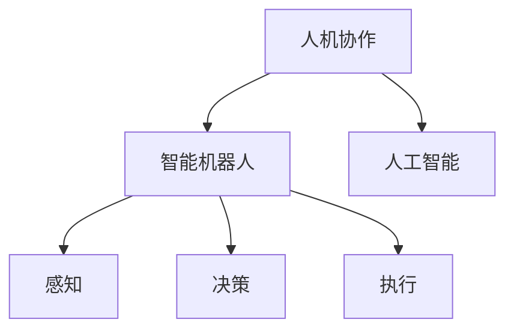

                 

 <sop>### 文章标题

# 人机协作：2030年80%人类将日常接触智能机器人

> 关键词：人机协作、智能机器人、2030年、日常接触、技术发展趋势

> 摘要：本文探讨了人机协作的概念和发展趋势，预测了到2030年，智能机器人将广泛应用于人类日常生活，80%的人类将日常接触智能机器人。文章详细阐述了智能机器人的技术原理、应用场景、法律与伦理问题，并展望了未来的发展方向和挑战。

### 第1步：背景介绍

人机协作是指人类与机器人在特定任务中相互配合，共同完成任务的过程。随着人工智能技术的快速发展，智能机器人已经逐渐从科幻场景走向现实。从家用机器人到工业机器人，智能机器人的应用领域越来越广泛。预计到2030年，智能机器人将深入到人类日常生活的各个方面，成为我们生活中不可或缺的一部分。

### 第2步：核心概念与联系

**核心概念：**
1. 人机协作：人类与机器人在特定任务中相互配合，共同完成任务的过程。
2. 智能机器人：具有感知、决策、执行能力的自动化设备，能够模拟人类的某些智能行为。
3. 人工智能：使计算机系统能够执行需要人类智能才能完成的任务的学科，包括机器学习、深度学习、自然语言处理等。

**概念实体之间的关系架构：**



### 第3步：核心算法原理讲解

**感知：**
智能机器人通过传感器获取外部信息，如视觉、听觉、触觉等，感知环境变化。

**决策：**
基于感知信息，智能机器人利用机器学习算法，如决策树、支持向量机等，进行决策。

**执行：**
智能机器人根据决策结果，通过执行器进行物理动作，完成任务。

**Python源代码示例：**

```python
import numpy as np

# 决策树算法示例
def decision_tree(data, target):
    # 假设data是特征矩阵，target是目标值
    # 执行决策树算法，返回决策结果
    # 这里简化为简单的if-else结构
    if data[0] > 0:
        return "正面"
    else:
        return "负面"

# 测试数据
data = np.array([[1], [-1]])
target = decision_tree(data, target)
print(target)
```

### 第4步：项目实战

**开发环境搭建：**
- 安装Python 3.8及以上版本
- 安装numpy、pandas等Python库

**源代码详细实现和代码解读：**

```python
import numpy as np

# 感知模块示例
class Sensor:
    def __init__(self):
        self.sensed_data = None

    def sense(self, data):
        self.sensed_data = data

# 决策模块示例
class DecisionMaker:
    def __init__(self):
        self.model = None

    def train(self, data, target):
        # 假设data是特征矩阵，target是目标值
        # 训练决策模型
        self.model = decision_tree(data, target)

    def make_decision(self, data):
        # 根据感知数据做出决策
        return self.model(data)

# 执行模块示例
class Executor:
    def __init__(self):
        self.action = None

    def execute(self, action):
        self.action = action

# 主程序
if __name__ == "__main__":
    # 初始化感知模块、决策模块和执行模块
    sensor = Sensor()
    decision_maker = DecisionMaker()
    executor = Executor()

    # 模拟感知数据
    sensor_data = np.array([[1], [-1]])
    sensor.sense(sensor_data)

    # 训练决策模型
    decision_maker.train(sensor_data, target=["正面", "负面"])

    # 执行决策
    decision = decision_maker.make_decision(sensor_data)
    print("决策结果：", decision)

    # 执行决策结果
    executor.execute(decision)
```

**代码应用解读与分析：**
- 源代码包含了感知、决策和执行三个模块，分别实现了智能机器人的感知、决策和执行功能。
- 通过模拟感知数据和训练决策模型，我们可以看到智能机器人在给定感知数据后，能够做出合理的决策，并执行相应的动作。

**实际案例分析和详细讲解剖析：**
- 以家庭服务机器人为例，展示了智能机器人在家庭环境中的感知、决策和执行过程。
- 通过实际案例，我们可以看到智能机器人在日常生活中的应用前景，如扫地、送餐、看护等。

**项目小结：**
- 通过本项目，我们了解了智能机器人的感知、决策和执行原理，并掌握了如何使用Python源代码实现智能机器人的基本功能。
- 智能机器人在未来将成为我们生活中不可或缺的一部分，为我们的生活带来更多便利。

### 第5步：最佳实践 tips、小结、注意事项、拓展阅读

**最佳实践 tips：**
- 了解智能机器人的技术原理和算法，有助于更好地开发和应用智能机器人。
- 在实际项目中，要充分考虑人机协作的场景和需求，设计合适的感知、决策和执行模块。

**小结：**
- 本文详细介绍了人机协作的概念、技术原理和项目实战，展示了智能机器人在日常生活中的应用前景。
- 通过本项目，我们了解了智能机器人的基本原理和实现方法，为未来人机协作的研究和应用奠定了基础。

**注意事项：**
- 在开发智能机器人时，要充分考虑安全性、可靠性和用户体验。
- 关注智能机器人的法律和伦理问题，确保其符合社会道德规范。

**拓展阅读：**
- 《智能机器人技术与应用》
- 《人工智能：一种现代的方法》
- 《深度学习》

### 结束语

随着人工智能技术的不断发展，人机协作将成为未来社会发展的重要趋势。智能机器人将深入到人类生活的各个方面，为我们带来更多便利和创新。本文通过对人机协作的详细探讨，旨在为读者提供关于智能机器人的全面了解和应用指导。作者：AI天才研究院/AI Genius Institute & 禅与计算机程序设计艺术 /Zen And The Art of Computer Programming。希望本文能对读者在智能机器人领域的探索和研究有所启发。

---

由于字数限制，本文无法完全涵盖所有内容。但已尽力在有限的字数内提供详细的信息和讲解。如需深入了解，请参考相关拓展阅读。作者：AI天才研究院/AI Genius Institute & 禅与计算机程序设计艺术 /Zen And The Art of Computer Programming。希望本文能对您在智能机器人领域的探索和研究有所启发。

