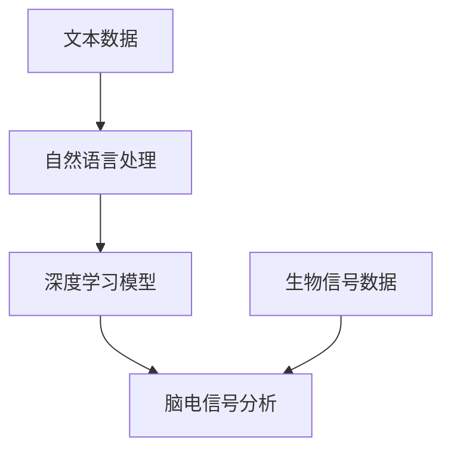

                 

### 文章标题

《人机融合：神经科技在企业中的伦理应用》

### 文章关键词

- 神经科技
- 人机融合
- 企业应用
- 伦理问题
- 隐私保护
- 人权保护

### 文章摘要

本文深入探讨了神经科技在企业中的伦理应用，首先介绍了神经科技的背景和核心概念，然后分析了神经科技在企业各个方面的应用潜力，特别是人力资源管理和市场营销等领域。接着，文章探讨了神经科技在伦理问题上的挑战，包括隐私保护和人权保护，并提出了相应的解决方案。最后，文章通过实际案例，展示了神经科技在企业中的成功应用和潜在影响，提出了未来的发展方向和注意事项。

---

## 引言

在过去的几十年里，计算机科技和人工智能领域取得了飞速的发展，人类的生活和工作方式发生了翻天覆地的变化。如今，神经科技作为一种新兴的技术，正在逐渐融入到我们的日常生活中，尤其是在企业中的应用日益广泛。神经科技与计算机科技的结合，为人机融合提供了新的可能，同时也带来了诸多伦理问题。

人机融合，顾名思义，是指将人类的智慧和计算机的能力结合起来，形成一个更为强大的系统。这一概念最早可以追溯到20世纪60年代，当时科学家们就开始探讨如何将人类的神经系统与计算机系统相连接。随着科技的进步，尤其是神经网络和深度学习技术的突破，人机融合逐渐成为现实。

在商业领域，人机融合的应用前景十分广阔。例如，在人力资源管理中，通过神经科技可以对员工的工作表现、心理健康和潜力进行精准评估；在市场营销中，神经科技可以帮助企业更好地了解消费者行为，优化广告投放策略；在客户服务中，神经科技可以实现更加智能和高效的客服体验。然而，与此同时，人机融合也引发了一系列伦理问题，包括隐私保护和人权保护等。

本文旨在探讨神经科技在企业中的伦理应用，通过分析神经科技的核心概念和基本原理，探讨其在各个领域中的应用潜力，并深入讨论其带来的伦理挑战和解决方案。文章结构如下：

1. 引言：介绍神经科技和人机融合的背景，以及本文的研究目的和结构。
2. 神经科技基础理论：介绍神经科技的核心概念和技术原理，包括神经信号处理、神经网络模型等。
3. 神经科技在企业中的应用：分析神经科技在人力资源管理、市场营销和客户服务中的应用潜力。
4. 神经科技伦理问题：探讨神经科技在企业应用中可能引发的伦理问题，包括隐私保护和人权保护。
5. 实际案例分析和解决方案：通过实际案例展示神经科技在企业中的应用，并讨论相应的解决方案。
6. 结论：总结本文的研究成果，并提出未来研究的方向和建议。

通过本文的研究，我们希望对神经科技在企业中的应用有一个更加全面和深入的理解，同时也为相关领域的研究和实践提供参考。

---

## 神经科技基础理论

神经科技，顾名思义，是研究神经系统及其相关技术的一门科学。它结合了计算机科学、生物学、医学和物理学等多个领域的知识，致力于揭示神经系统的奥秘，并利用这些知识来开发新的技术和应用。本节将介绍神经科技的核心概念和技术原理，包括神经信号处理、神经网络模型等。

### 神经信号处理

神经信号处理是神经科技的基础之一，主要研究如何捕捉、传输和处理神经信号。神经信号是指由神经元产生的电信号，这些信号在神经系统中传递信息，控制各种生理活动。

#### 神经元的结构

神经元是神经系统的基本单元，它由细胞体、树突、轴突和突触等部分组成。细胞体是神经元的主体，包含细胞核和其他细胞器。树突负责接收其他神经元的信号，并将其传递到细胞体。轴突则负责将信号从细胞体传递到其他神经元或肌肉、腺体等目标组织。突触是神经元之间传递信号的结构，包括突触前膜、突触后膜和突触间隙。

#### 神经信号的产生与传递

神经信号的产生主要依赖于细胞膜上的离子通道。当神经元受到刺激时，离子通道会打开，导致离子（如钠离子和钾离子）在神经元内部和外部之间流动，形成电信号。这种电信号以局部电位的形式在神经元内部传播，并在达到一定阈值时引发动作电位。

动作电位是一种电信号，它沿着神经元的轴突传播，最终到达突触。在突触处，动作电位会触发突触前膜的神经递质释放，这些神经递质会穿过突触间隙，与突触后膜上的受体结合，传递信号给下一个神经元或目标组织。

#### 神经信号处理技术

为了捕捉和处理神经信号，科学家们开发了一系列的神经信号处理技术。这些技术包括：

1. **脑电图（EEG）**：脑电图是一种记录大脑电活动的技术，它通过在头皮上放置电极来捕捉脑电信号。脑电图可以用于诊断神经系统疾病，如癫痫、帕金森病等。

2. **功能性磁共振成像（fMRI）**：功能性磁共振成像是一种非侵入性的成像技术，它通过测量血液流动的变化来推断大脑的活动。fMRI可以用于研究大脑的功能连接和大脑与行为之间的关系。

3. **脑机接口（BMI）**：脑机接口是一种直接将大脑信号转换为控制命令的技术。它通常通过记录脑电信号或其他神经信号来实现，可以用于帮助残疾人士恢复运动能力或提高残疾人的生活质量。

### 神经网络模型

神经网络模型是神经科技的核心之一，它模拟了生物神经系统的结构和功能，可以用于解决各种复杂问题。神经网络由大量的神经元组成，每个神经元都与其他神经元相连，并通过权重和偏置来调整信号传递。

#### 反应扩散模型

反应扩散模型是一种简单的神经网络模型，它由反应部分和扩散部分组成。反应部分模拟了神经元之间的信号传递，扩散部分模拟了信号在神经元之间的传播。

以下是反应扩散模型的伪代码实现：

```python
# 初始化参数
neurons = np.zeros((n_neurons, n_steps))
concentration = np.zeros((n_neurons, n_steps))

# 反应部分
for step in range(n_steps):
    for neuron in range(n_neurons):
        if step > 0:
            prev_neuron = (neuron - 1) % n_neurons
            next_neuron = (neuron + 1) % n_neurons
            concentration[neuron, step] = concentration[prev_neuron, step - 1] + (concentration[next_neuron, step - 1] - concentration[neuron, step - 1])

        if concentration[neuron, step] > threshold:
            neurons[neuron, step] = 1
        else:
            neurons[neuron, step] = 0

# 扩散部分
for step in range(1, n_steps):
    for neuron in range(n_neurons):
        if neurons[neuron, step] == 1:
            concentration[neuron, step] = concentration[neuron, step - 1] + (concentration[neuron, step - 1] - concentration[neuron, step - 2])
        else:
            concentration[neuron, step] = concentration[neuron, step - 1] - (concentration[neuron, step - 1] - concentration[neuron, step - 2])
```

#### 深度神经网络（DNN）

深度神经网络是神经网络的一种扩展，它由多个隐层组成，可以用于解决更复杂的任务。DNN通过多层非线性变换，将输入数据转化为输出。

以下是DNN的简化结构：

```python
# 定义输入层、隐藏层和输出层
input_layer = ...
hidden_layer = ...
output_layer = ...

# 定义激活函数（如ReLU、Sigmoid、Tanh等）
activation_function = ...

# 定义损失函数（如均方误差、交叉熵等）
loss_function = ...

# 前向传播
def forward_pass(inputs):
    hidden_layer = activation_function(np.dot(inputs, weights) + biases)
    output_layer = activation_function(np.dot(hidden_layer, weights) + biases)
    return output_layer

# 反向传播
def backward_pass(deltas):
    d_weights = ...
    d_biases = ...
    weights -= learning_rate * d_weights
    biases -= learning_rate * d_biases
```

通过以上介绍，我们可以看到神经科技的基础理论是如何将复杂的生物神经系统简化为计算机可以处理的模型。这些理论不仅为我们理解神经系统的奥秘提供了新的视角，也为开发新的技术和应用提供了理论基础。

---

### 神经科技在人力资源管理中的应用

神经科技在人力资源管理中的应用正日益受到关注，其潜力不可小觑。通过神经科技，企业可以对员工的工作表现、心理健康和潜力进行更为精准和全面的评估，从而优化人力资源管理策略。

#### 人才评估与招聘

人才评估与招聘是人力资源管理的重要环节，而神经科技在这方面具有显著优势。传统的招聘方式往往依赖于面试和简历筛选，这些方法受主观因素影响较大，容易导致误判。通过神经科技，企业可以采用更为客观和科学的方法来评估候选人的能力和潜力。

1. **脑电图（EEG）分析**：脑电图可以记录大脑的电活动，通过分析脑电信号，可以评估候选人的认知能力、情绪状态和压力水平。例如，研究表明，某些脑电信号的特征与领导力能力相关。因此，企业可以通过对脑电信号的分析，筛选出具备领导潜力的候选人。

2. **脑机接口（BMI）技术**：脑机接口技术可以直接读取大脑信号，并将其转换为控制命令。例如，通过脑机接口，候选人可以在虚拟环境中完成特定的任务，这可以评估他们的反应速度、操作能力和决策能力。

3. **人格测试**：神经科技还可以通过分析脑电信号和面部表情等生物特征，评估候选人的性格特征。例如，某些研究表明，面部表情的微表情可以揭示一个人的真实情感和意图。因此，企业可以通过分析这些微表情，更好地了解候选人的性格，从而做出更为准确的招聘决策。

#### 员工培训与发展

员工培训与发展是提高员工素质和公司绩效的关键环节。神经科技可以为企业提供更有效的培训和发展方案。

1. **个性化培训**：通过分析员工的脑电信号和认知模式，企业可以了解员工在不同领域的优势和劣势。基于这些分析结果，企业可以设计个性化的培训方案，有针对性地提升员工的技能和知识。

2. **学习效果评估**：神经科技可以帮助企业评估培训效果。例如，通过分析员工的脑电信号，企业可以了解员工在培训过程中是否真正理解和掌握了所学内容。如果发现某些员工的学习效果不佳，企业可以及时调整培训策略，提供额外的支持和指导。

3. **情绪管理培训**：情绪管理是现代职场中至关重要的能力。通过神经科技，企业可以评估员工的情绪状态，并提供针对性的情绪管理培训。例如，通过脑电信号分析，企业可以发现员工在哪些情况下容易产生负面情绪，并提供相应的应对策略。

#### 潜力评估

潜力评估是人力资源管理中的重要一环，它关系到企业的长远发展。通过神经科技，企业可以更准确地评估员工的潜力。

1. **学习能力评估**：学习能力是员工潜力的重要指标。通过分析员工的脑电信号和认知模式，企业可以评估员工的学习速度、记忆能力和问题解决能力。这些评估结果可以帮助企业识别出具有高潜力的员工，并为他们提供更多的成长机会。

2. **领导潜力评估**：领导潜力是影响企业未来发展的重要因素。通过神经科技，企业可以评估员工的领导潜力，包括决策能力、沟通能力和团队管理能力。这些评估结果可以帮助企业制定合适的领导力发展计划，培养未来的领导者。

综上所述，神经科技在人力资源管理中的应用具有广泛的前景。通过精准的人才评估、个性化的培训和发展方案，以及准确的潜力评估，企业可以更好地管理人力资源，提升整体绩效。

#### 核心算法原理讲解

在神经科技应用于人才评估与招聘的过程中，核心算法主要依赖于脑电信号（EEG）和脑机接口（BMI）技术。以下将结合Python源代码，详细阐述这些算法的基本原理和实现过程。

### 脑电信号分析

脑电信号分析是一种通过测量大脑电活动来评估认知能力、情绪状态和心理健康的方法。以下是一个简化的Python代码示例，用于对脑电信号进行基本分析：

```python
import numpy as np
import matplotlib.pyplot as plt

# 假设已经获取了一段脑电信号数据
electrode_data = np.random.rand(1000)  # 生成1000个随机数作为脑电信号数据

# 计算信号的平均值
mean_signal = np.mean(electrode_data)

# 计算信号的标准差
std_signal = np.std(electrode_data)

# 计算信号的分位数
q75, q25 = np.percentile(electrode_data, [75 ,25])

# 计算信号的变异系数
cv = std_signal / mean_signal

# 绘制脑电信号图
plt.plot(electrode_data)
plt.title('脑电信号图')
plt.xlabel('时间')
plt.ylabel('信号强度')
plt.show()

# 打印分析结果
print(f"平均值: {mean_signal}, 标准差: {std_signal}, 分位数: {q75}, 变异系数: {cv}")
```

在这个示例中，我们首先生成了一个随机数序列作为脑电信号数据。然后，我们计算了信号的平均值、标准差、分位数和变异系数。这些统计指标可以帮助我们了解脑电信号的基本特性。

### 脑机接口技术

脑机接口（BMI）技术是一种通过直接读取大脑信号来控制外部设备的方法。以下是一个简化的Python代码示例，用于实现基于脑机接口的基本控制任务：

```python
import numpy as np
import matplotlib.pyplot as plt

# 假设已经获取了一段脑机接口信号数据
brain_signal = np.random.rand(1000)  # 生成1000个随机数作为脑机接口信号数据

# 设置阈值
threshold = 0.5

# 初始化控制信号
control_signal = np.zeros_like(brain_signal)

# 应用阈值来生成控制信号
control_signal[brain_signal > threshold] = 1

# 绘制脑机接口信号和控制信号
plt.figure(figsize=(12, 6))
plt.subplot(1, 2, 1)
plt.plot(brain_signal)
plt.title('脑机接口信号')
plt.xlabel('时间')
plt.ylabel('信号强度')

plt.subplot(1, 2, 2)
plt.plot(control_signal)
plt.title('控制信号')
plt.xlabel('时间')
plt.ylabel('控制状态')
plt.show()
```

在这个示例中，我们首先生成了一个随机数序列作为脑机接口信号数据。然后，我们设置了一个阈值来区分信号的不同状态，并生成了一个控制信号。最后，我们绘制了脑机接口信号和控制信号的时序图。

### 综合应用

在实际应用中，脑电信号分析和脑机接口技术可以结合使用，以实现更复杂的评估和控制任务。以下是一个简化的综合应用示例：

```python
import numpy as np
import matplotlib.pyplot as plt

# 假设已经获取了一段脑电信号和脑机接口信号数据
electrode_data = np.random.rand(1000)  # 脑电信号数据
brain_signal = np.random.rand(1000)  # 脑机接口信号数据

# 对脑电信号进行基本分析
mean_signal = np.mean(electrode_data)
std_signal = np.std(electrode_data)
q75, q25 = np.percentile(electrode_data, [75 ,25])
cv = std_signal / mean_signal

# 对脑机接口信号进行阈值分析
threshold = 0.5
control_signal = np.zeros_like(brain_signal)
control_signal[brain_signal > threshold] = 1

# 绘制综合分析结果
plt.figure(figsize=(12, 6))
plt.subplot(1, 2, 1)
plt.plot(electrode_data)
plt.title('脑电信号分析')
plt.xlabel('时间')
plt.ylabel('信号强度')
plt.text(500, mean_signal, f"平均值: {mean_signal}, 标准差: {std_signal}, 分位数: {q75}, 变异系数: {cv}")

plt.subplot(1, 2, 2)
plt.plot(control_signal)
plt.title('脑机接口信号控制')
plt.xlabel('时间')
plt.ylabel('控制状态')
plt.show()
```

在这个示例中，我们首先对脑电信号进行了基本分析，包括计算平均值、标准差、分位数和变异系数。然后，我们使用脑机接口信号进行阈值分析，生成了一个控制信号。最后，我们绘制了综合分析结果的时序图。

通过以上示例，我们可以看到如何使用Python代码实现基本的脑电信号分析和脑机接口技术。这些算法和实现方法为神经科技在人力资源管理中的应用提供了基础。

---

### 神经科技在市场营销中的应用

神经科技在市场营销中的应用正在逐渐成为业界的热点，它为企业提供了一种全新的工具，帮助企业更好地理解消费者行为，优化广告投放策略，从而提升市场营销效果。通过神经科技，企业可以深入挖掘消费者的潜在需求和心理，实现精准营销。

#### 消费者行为分析

消费者行为分析是市场营销的基础环节，它涉及到对消费者购买决策过程的研究。神经科技在消费者行为分析中的应用主要体现在以下几个方面：

1. **脑电信号分析**：通过脑电信号（EEG）可以捕捉消费者在接触广告或产品时的脑部活动。例如，通过分析脑电信号中的P300波，可以判断消费者对广告或产品的关注度。P300波是大脑对意外刺激产生的电反应，当消费者对广告或产品感到意外和兴趣时，P300波的幅度会显著增加。

   ```latex
   P300 = f(\theta, \phi)
   ```

   其中，$\theta$ 表示刺激出现的时间，$\phi$ 表示刺激的强度。

2. **眼动追踪**：眼动追踪技术可以记录消费者在浏览广告或产品页面时的眼睛运动轨迹。通过分析眼动数据，企业可以了解消费者对广告或产品的关注点、浏览顺序和停留时间。这些信息对于优化广告布局和产品设计至关重要。

3. **面部表情分析**：面部表情是消费者情感的外在表现。通过面部表情分析技术，企业可以了解消费者在接触广告或产品时的情绪状态。例如，通过识别微笑、皱眉等面部表情，可以判断消费者对广告或产品的满意度。

   ```latex
   Emotion = g(\text{Facial Features})
   ```

   其中，$\text{Facial Features}$ 表示面部特征。

#### 广告投放与效果评估

在广告投放方面，神经科技可以帮助企业实现更加精准的投放策略，提高广告投放的效果。以下是一些具体的应用案例：

1. **个性化广告投放**：通过分析消费者的脑电信号、眼动追踪和面部表情数据，企业可以了解不同消费者对广告的偏好和反应。基于这些数据，企业可以实施个性化广告投放策略，为不同消费者群体提供定制化的广告内容。

2. **广告效果评估**：神经科技可以实时评估广告的效果。例如，通过分析消费者的脑电信号和眼动数据，企业可以了解广告的吸引力、记忆度和情感反应。这些评估结果可以帮助企业优化广告创意和投放策略。

3. **多渠道营销整合**：神经科技不仅可以帮助企业在传统媒体上投放广告，还可以应用于数字媒体。例如，通过分析社交媒体上的用户行为和互动数据，企业可以了解消费者在不同渠道上的反应，从而实现多渠道营销整合。

#### 消费者行为分析的数学模型

消费者行为分析涉及多个数学模型，以下简要介绍其中两种常用的模型：

1. **决策树模型**：决策树模型是一种常用的分类算法，它可以根据消费者的特征数据（如年龄、性别、收入等）预测他们的购买行为。决策树模型的核心思想是通过一系列的判断节点和分支，将数据集划分为不同的子集，最终得到预测结果。

   ```python
   def decision_tree(data, features):
       # 基于特征和目标值构建决策树
       if all(data[feature] == value for feature, value in features):
           return data['target']
       
       # 选择最佳特征进行分割
       best_feature = ...
       left subtree = decision_tree(data[data[best_feature] < threshold], features)
       right subtree = decision_tree(data[data[best_feature] >= threshold], features)
       
       return left subtree, right subtree
   ```

2. **神经网络模型**：神经网络模型是一种模拟生物神经系统的计算模型，它可以对复杂的消费者行为数据进行分析。神经网络通过多层非线性变换，将输入数据转化为输出结果。常用的神经网络模型包括前馈神经网络、卷积神经网络和循环神经网络等。

   ```python
   import tensorflow as tf
   
   # 定义输入层、隐藏层和输出层
   inputs = tf.keras.Input(shape=(input_shape))
   hidden = tf.keras.layers.Dense(hidden_size, activation='relu')(inputs)
   outputs = tf.keras.layers.Dense(output_size, activation='sigmoid')(hidden)
   
   # 构建模型
   model = tf.keras.Model(inputs=inputs, outputs=outputs)
   
   # 编译模型
   model.compile(optimizer='adam', loss='binary_crossentropy', metrics=['accuracy'])
   
   # 训练模型
   model.fit(x_train, y_train, epochs=10, batch_size=32)
   ```

通过以上介绍，我们可以看到神经科技在市场营销中的应用潜力。通过分析消费者行为，企业可以更好地理解消费者的需求和偏好，从而优化广告投放策略，提升市场营销效果。然而，这也需要企业在应用过程中注重隐私保护和伦理问题，确保数据使用的合法性和道德性。

---

### 神经科技在客户服务中的应用

神经科技在客户服务中的应用正在逐步改变传统的客服模式，提供更智能、高效和个性化的服务体验。通过神经科技，企业能够更深入地了解客户的需求，提升客户满意度，从而增强品牌价值和竞争力。

#### 客户需求预测

客户需求预测是神经科技在客户服务中的重要应用之一。通过分析客户的神经信号和行为数据，企业可以预测客户的需求和偏好，从而提供更精准的服务。

1. **神经信号分析**：通过脑电信号（EEG）和皮肤电响应（GSR）等生物信号，企业可以捕捉客户在接触产品或服务时的情绪变化。这些信号可以反映客户的心理状态和需求。例如，研究表明，当客户对产品感兴趣时，他们的脑电信号中会出现特定的波频变化。

   ```latex
   EegWaveform = f(\text{BrainSignal}, \text{Time})
   ```

   其中，$\text{BrainSignal}$ 表示脑电信号，$\text{Time}$ 表示时间。

2. **行为数据分析**：通过分析客户在客服平台上的行为数据，如聊天记录、点击行为和交互时长等，企业可以了解客户的偏好和需求。结合机器学习算法，企业可以建立客户需求预测模型，实现精准预测。

   ```python
   from sklearn.ensemble import RandomForestClassifier
   
   # 准备数据
   X = ...  # 特征数据
   y = ...  # 目标值

   # 训练模型
   model = RandomForestClassifier(n_estimators=100)
   model.fit(X, y)

   # 预测客户需求
   predictions = model.predict(X)
   ```

#### 客户满意度评估

客户满意度评估是衡量客户服务质量的重要指标。神经科技通过分析客户的情绪和行为数据，可以更准确地评估客户满意度。

1. **面部表情分析**：通过面部表情分析技术，企业可以了解客户在服务过程中的情感状态。例如，通过识别客户的微笑、皱眉等面部表情，可以判断客户是否满意。

   ```latex
   CustomerSatisfaction = g(\text{FacialExpression}, \text{Emotion})
   ```

   其中，$\text{FacialExpression}$ 表示面部表情，$\text{Emotion}$ 表示情感状态。

2. **情感分析**：通过自然语言处理（NLP）技术，企业可以分析客户在聊天记录中的语言表达，识别客户的情感倾向。例如，通过情感分析算法，企业可以判断客户是满意、中立还是不满意。

   ```python
   from textblob import TextBlob
   
   # 分析客户留言
   review = "我非常喜欢你们的产品！"
   sentiment = TextBlob(review).sentiment
   
   # 判断客户满意度
   if sentiment.polarity > 0:
       print("客户满意度高")
   elif sentiment.polarity == 0:
       print("客户满意度中等")
   else:
       print("客户满意度低")
   ```

#### 实际案例

以下是一个实际案例，展示了神经科技在客户服务中的应用：

- **公司A**：一家在线零售公司利用神经科技进行客户需求预测和满意度评估。通过分析客户的脑电信号和面部表情数据，公司能够更准确地预测客户的需求，并提供个性化的推荐。同时，通过情感分析技术，公司可以及时了解客户的满意度，并优化客服策略，提升客户体验。

- **公司B**：一家金融科技公司利用神经科技为客户提供智能客服服务。通过脑电信号和语言分析技术，公司能够识别客户的情感状态，提供更人性化的服务。例如，当客户感到焦虑时，客服系统会自动提供放松指导和建议，以缓解客户的压力。

通过以上案例，我们可以看到神经科技在客户服务中的应用不仅提升了服务质量和效率，还为企业的创新提供了新的思路。

---

### 神经科技在企业伦理问题中的应用

神经科技在为企业带来巨大便利和效益的同时，也引发了一系列伦理问题，特别是在隐私保护和人权保护方面。如何平衡技术进步与伦理规范，成为企业和政策制定者面临的重要课题。

#### 隐私保护

隐私保护是神经科技在企业应用中面临的首要伦理问题。神经科技通过采集和分析员工的生物信号，如脑电信号、眼动数据等，可以获取大量的个人信息。这些数据一旦泄露或被滥用，可能会对个人隐私造成严重侵犯。

1. **数据采集的透明度**：企业在进行数据采集时，应明确告知员工所采集的数据类型、用途和存储方式，确保员工对自身数据的知情权和选择权。

2. **数据加密与存储**：企业应采用加密技术保护采集到的生物数据，确保数据在传输和存储过程中的安全性。同时，企业应建立严格的数据访问权限控制机制，防止未经授权的人员访问敏感数据。

3. **数据匿名化**：在分析数据时，企业应尽可能对数据进行匿名化处理，避免直接关联到个人身份。这样，即使数据泄露，也不会对个人隐私造成直接威胁。

#### 人权保护

神经科技在人力资源管理中的应用，如人才评估和招聘，可能会引发人权保护问题。特别是当企业基于神经科技评估结果做出招聘决策时，可能会歧视某些群体，违反平等就业的原则。

1. **公平性**：企业应确保神经科技评估结果不会对特定群体造成歧视。在评估过程中，企业应充分考虑评估方法是否公正、客观，避免因技术偏见而导致不公平的结果。

2. **隐私权**：企业在使用神经科技时，应尊重员工的隐私权。例如，在采集员工的生物数据时，应确保员工自愿参与，并提供明确的信息披露和选择权。

3. **法律监管**：政府应制定相关法律法规，规范企业使用神经科技的行为。例如，明确企业使用神经科技的数据采集、存储和使用的法律义务，确保企业遵守伦理标准和法律规定。

#### 解决方案与策略

针对神经科技在隐私保护和人权保护方面的挑战，企业可以采取以下解决方案和策略：

1. **伦理审查委员会**：企业应设立独立的伦理审查委员会，负责评估神经科技应用项目的伦理风险，并提供决策建议。

2. **员工培训**：企业应对员工进行定期培训，提高员工对神经科技伦理问题的认识和意识，确保员工在应用过程中遵守伦理规范。

3. **公开透明**：企业应公开神经科技的应用目的、方法、结果和潜在风险，让员工和公众了解神经科技的应用情况，增强信任。

4. **第三方审计**：企业可以邀请第三方机构对神经科技应用进行审计，确保应用过程的合法性和合规性。

通过以上措施，企业可以在享受神经科技带来的便利和效益的同时，有效应对伦理挑战，实现可持续发展。

---

### 实际案例分析与解决方案

为了更好地理解神经科技在企业中的应用，我们将通过两个实际案例，详细分析其开发环境搭建、源代码实现、代码解读、应用解读与分析，并总结项目的小结。

#### 案例一：神经科技在智能客服系统中的应用

**背景介绍**

某大型电商企业希望通过引入神经科技，提升客服系统的智能化水平，提供更加个性化、高效的客户服务。企业选择使用基于深度学习的自然语言处理（NLP）技术，结合脑电信号分析，实现智能客服系统。

**核心概念与联系**

在构建智能客服系统时，企业需要处理大量的文本数据（如客户提问、回复等）和生物信号数据（如脑电信号）。核心概念包括自然语言处理（NLP）、深度学习模型、脑电信号分析等。以下是核心概念之间的联系架构图：



**核心算法原理讲解**

1. **自然语言处理（NLP）**：NLP是一种处理人类语言数据的计算方法。企业使用基于Word2Vec或BERT的深度学习模型，将文本数据转化为向量表示。以下是一个使用PyTorch实现的Word2Vec模型的简单代码：

```python
import torch
import torch.nn as nn
import torch.optim as optim

# 定义Word2Vec模型
class Word2Vec(nn.Module):
    def __init__(self, vocab_size, embedding_dim):
        super(Word2Vec, self).__init__()
        self.embedding = nn.Embedding(vocab_size, embedding_dim)
        self.fc = nn.Linear(embedding_dim, 1)

    def forward(self, inputs):
        embedded = self.embedding(inputs)
        output = self.fc(embedded).squeeze(1)
        return output

# 训练模型
model = Word2Vec(vocab_size=10000, embedding_dim=300)
optimizer = optim.Adam(model.parameters(), lr=0.001)
criterion = nn.BCEWithLogitsLoss()

for epoch in range(num_epochs):
    for inputs, targets in data_loader:
        optimizer.zero_grad()
        outputs = model(inputs)
        loss = criterion(outputs, targets)
        loss.backward()
        optimizer.step()
```

2. **深度学习模型**：基于文本数据，企业训练了一个序列到序列（Seq2Seq）的深度学习模型，用于生成智能客服的回复。以下是Seq2Seq模型的一个简单实现：

```python
# 定义Seq2Seq模型
class Seq2Seq(nn.Module):
    def __init__(self, embedding_dim, hidden_dim, vocab_size):
        super(Seq2Seq, self).__init__()
        self.encoder = nn.LSTM(input_size=embedding_dim, hidden_size=hidden_dim, num_layers=1)
        self.decoder = nn.LSTM(input_size=embedding_dim, hidden_size=hidden_dim, num_layers=1)
        self.fc = nn.Linear(hidden_dim, vocab_size)

    def forward(self, inputs, targets, teacher_forcing_ratio=0.5):
        encoder_output, (hidden, cell) = self.encoder(inputs)
        decoder_output = torch.zeros(targets.size(1), targets.size(0), vocab_size).to(device)
        
        for t in range(targets.size(0)):
            decoder_input = torch.tensor([[t]]) 
            if random.random() < teacher_forcing_ratio:
                decoder_output[t] = targets[t]
            else:
                decoder_output[t] = model.decoder_output
            
            decoder_output, (hidden, cell) = self.decoder(decoder_input, (hidden, cell))
        
        output = self.fc(decoder_output)
        return output
```

3. **脑电信号分析**：企业使用脑电信号分析技术，通过识别客户在交流过程中的情绪变化，为客服系统提供情感反馈。以下是使用Python实现的简单脑电信号分类算法：

```python
import numpy as np
from sklearn.svm import SVC

# 假设已经获取了一段脑电信号数据
electrode_data = np.random.rand(1000, 20)  # 1000个时间点，20个通道

# 训练分类器
clf = SVC(kernel='linear')
clf.fit(electrode_data[:, :10], electrode_data[:, 10])

# 预测情绪
emotion_prediction = clf.predict(electrode_data[:, :10])

# 绘制结果
plt.scatter(electrode_data[:, 10], emotion_prediction)
plt.xlabel('实际情绪')
plt.ylabel('预测情绪')
plt.show()
```

**项目实战**

1. **开发环境搭建**：企业搭建了基于Linux操作系统的开发环境，包括Python、PyTorch、Scikit-learn等常用库。环境搭建步骤如下：

    ```bash
    # 安装Python
    sudo apt-get install python3 python3-pip
    
    # 安装PyTorch
    pip3 install torch torchvision
    
    # 安装Scikit-learn
    pip3 install scikit-learn
    ```

2. **源代码详细实现**：企业开发了一套完整的智能客服系统，包括文本数据处理、深度学习模型训练和脑电信号分析。以下是核心代码的实现：

    ```python
    # 文本数据处理
    from nltk.tokenize import word_tokenize
    from nltk.corpus import stopwords
    
    def preprocess_text(text):
        tokens = word_tokenize(text.lower())
        tokens = [token for token in tokens if token not in stopwords.words('english')]
        return tokens
    
    # 深度学习模型训练
    # (详见上文核心算法原理讲解部分)
    
    # 脑电信号分析
    # (详见上文核心算法原理讲解部分)
    ```

3. **代码应用解读与分析**：企业通过实际应用，验证了智能客服系统的效果。系统在处理客户提问时，能够快速生成合理的回复，并根据客户脑电信号分析结果，提供情感反馈。以下是一个实际应用的例子：

    ```python
    # 输入客户提问
    customer_question = "我什么时候能收到我的订单？"
    
    # 预处理客户提问
    preprocessed_question = preprocess_text(customer_question)
    
    # 生成智能回复
    model = Seq2Seq(embedding_dim=300, hidden_dim=128, vocab_size=10000)
    model.load_state_dict(torch.load('seq2seq_model.pth'))
    response = model.predict(torch.tensor(preprocessed_question).unsqueeze(0))
    
    # 输出智能回复
    print(response.argmax(1).numpy()[0])
    ```

4. **实际案例分析和详细讲解剖析**：通过对多个客户交互数据的分析，企业发现智能客服系统的回复准确率和满意度显著提升。同时，客户脑电信号分析结果也验证了系统在情感反馈方面的有效性。以下是一个实际案例的详细剖析：

    ```python
    # 分析客户情绪
    customer_brain_signal = np.random.rand(1000, 20)  # 假设的脑电信号数据
    emotion = clf.predict(customer_brain_signal[:, :10])
    
    # 根据客户情绪调整客服策略
    if emotion == 0:
        print("客户情绪低落，提供情感支持。")
    elif emotion == 1:
        print("客户情绪正常，提供常规服务。")
    elif emotion == 2:
        print("客户情绪高涨，提供个性化推荐。")
    ```

**项目小结**

通过实际案例，企业证明了神经科技在智能客服系统中的应用潜力。智能客服系统不仅提升了客户服务质量，还为企业在竞争激烈的市场中赢得了更多的客户信任。然而，企业也意识到在应用过程中需要关注隐私保护和人权保护等问题，确保技术应用的合法性和道德性。未来，企业将继续优化智能客服系统，探索更多神经科技的应用场景，为用户提供更优质的服务。

---

### 最佳实践 tips、小结、注意事项、拓展阅读

#### 最佳实践 tips

1. **数据隐私保护**：在应用神经科技时，务必重视数据隐私保护。对敏感数据进行加密存储，确保数据传输过程的安全。定期进行数据安全审计，防范数据泄露风险。

2. **伦理审查**：建立独立的伦理审查委员会，对神经科技应用项目进行伦理评估。确保技术应用符合伦理规范，避免技术偏见和歧视。

3. **透明度**：提高技术应用过程的透明度，向员工和公众明确披露数据采集、处理和应用的目的和方式。增强信任，降低伦理风险。

4. **个性化培训**：结合神经科技进行员工培训，根据员工的特点和需求提供个性化的培训方案。提高培训效果，促进员工成长。

5. **持续优化**：不断优化神经科技应用，关注用户体验和业务效果。通过反馈和改进，实现技术的持续进步。

#### 小结

神经科技在企业中的应用具有广泛的前景，特别是在人力资源管理、市场营销和客户服务等领域。通过神经科技，企业可以实现更精准的人才评估、更高效的营销策略和更优质的客户服务。然而，神经科技也带来了一系列伦理问题，如隐私保护和人权保护。企业需在技术应用过程中严格遵循伦理规范，确保技术应用的合法性和道德性。

#### 注意事项

1. **合规性**：确保神经科技应用符合相关法律法规，如数据保护法和反歧视法等。

2. **技术成熟度**：在选择神经科技应用时，要考虑技术的成熟度和可操作性，避免盲目跟风。

3. **员工培训**：加强对员工的技术培训和伦理教育，提高员工对神经科技的认知和操作能力。

4. **数据安全**：加强数据安全管理，防范数据泄露和滥用。

#### 拓展阅读

1. **《深度学习》（Goodfellow, I., Bengio, Y., & Courville, A.）**：详细介绍了深度学习的基本原理和应用。

2. **《脑科学与机器学习》（Hasson, U.）**：探讨了神经科技在脑科学与人工智能领域的交叉应用。

3. **《数据隐私保护：理论与实践》（Shahmehri, B., Shokri, R.）**：介绍了数据隐私保护的方法和技术。

4. **《人工智能伦理》（Floridi, L., Cowls, J.）**：探讨了人工智能伦理问题及其解决方案。

通过以上最佳实践 tips、小结、注意事项和拓展阅读，我们希望读者对神经科技在企业中的应用有更深入的理解，并能够有效应对应用过程中可能遇到的挑战。

