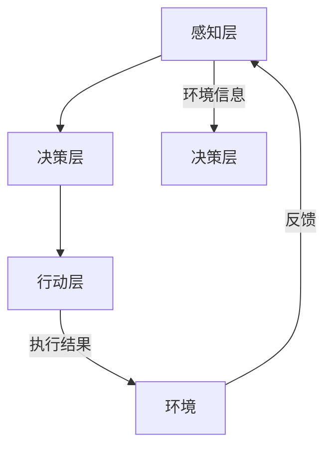

                 

### 引言

在当今快速发展的数字化时代，人工智能（AI）已经成为推动科技进步和产业变革的核心驱动力。而在这其中，代理型人工智能（Agent-based AI）以其独特的能力和广泛的应用前景，逐渐成为研究者和工程师们关注的焦点。代理型AI的核心在于模拟智能体的行为，使其能够在复杂环境中自主决策并采取行动，以实现特定的目标。无论是智能机器人、无人驾驶汽车，还是自动化系统和智能助手，代理型AI都扮演着至关重要的角色。

本文将深入探讨代理型AI在日常工作决策中的应用场景，通过逐步分析其基础概念、架构、核心算法以及实际应用，帮助读者全面理解并掌握代理型AI的实用性和潜力。文章将从以下几个方面展开：

1. **代理型AI基础概念与架构**：介绍代理型AI的定义、特点、架构以及核心算法。
2. **代理型AI在日常工作中的应用**：探讨代理型AI在时间管理、任务规划和人际交往等具体场景中的实际应用。
3. **代理型AI在决策支持系统中的应用**：分析代理型AI在数据预处理、数据挖掘和决策规则生成等方面的作用。
4. **代理型AI在日常工作决策中的挑战与展望**：讨论代理型AI在实际应用中面临的挑战以及未来的发展趋势。
5. **代理型AI应用开发实践**：提供代理型AI应用开发的具体案例和实践经验。

通过本文的深入分析和讨论，我们将不仅了解代理型AI的基本原理和架构，还将看到其在实际工作中的广泛应用和巨大潜力。本文旨在为研究人员、工程师和所有对人工智能感兴趣的人提供一套全面、系统的参考资料，帮助他们在实际工作中更好地运用代理型AI技术。

### 代理型AI基础概念与架构

代理型人工智能（Agent-based AI）是一个在复杂环境中能够感知、决策并采取行动的智能系统。其核心在于模拟人类的思维方式，使系统能够在动态变化的情境中自主地做出合理决策。要深入理解代理型AI，我们需要从定义、特点、架构以及核心算法四个方面进行探讨。

#### 1.1 代理型AI的定义

代理型AI中的“代理”（Agent）指的是能够独立执行任务、自主行动的实体。这些代理可以是人、机器人、软件程序或其他智能体。代理型AI通过模拟这些代理的行为，使其能够在复杂环境中进行决策和互动。简而言之，代理型AI是一个由多个智能代理组成的系统，每个代理都能够独立思考和行动，以实现特定的目标。

#### 1.2 代理型AI的特点

代理型AI具有以下几个显著特点：

- **自主性**：代理型AI中的智能代理可以自主地感知环境、做出决策并采取行动，无需人工干预。
- **适应性**：代理型AI能够在不同的环境和条件下调整其行为策略，以适应新的情境。
- **协作性**：多个智能代理可以相互协作，共同完成任务，提高整体系统的效率和效能。
- **分布式**：代理型AI通常采用分布式架构，各代理独立运行，通过通信机制进行协作。

#### 1.3 代理型AI与传统AI的区别

传统AI通常是指基于规则或模型的方法，如机器学习、深度学习等。这些方法侧重于解决特定的问题，往往依赖于大量的数据训练和复杂模型的构建。而代理型AI则更侧重于模拟智能体的行为，使其能够在复杂、动态的环境中自主行动。以下是代理型AI与传统AI的主要区别：

- **目标导向**：传统AI侧重于解决具体问题，而代理型AI侧重于实现目标，更关注决策过程。
- **决策自主性**：传统AI通常需要人类干预来设定目标和规则，而代理型AI可以自主设定目标和决策。
- **应用场景**：传统AI适用于结构化、静态的数据和任务，而代理型AI适用于复杂、动态的环境和任务。

#### 1.4 代理型AI的架构

代理型AI的架构可以分为三个主要层次：感知层、决策层和行动层。以下是每个层次的简要描述：

- **感知层**：智能代理通过传感器收集环境信息，如视觉、听觉、触觉等，以获取当前状态。
- **决策层**：智能代理根据感知到的环境信息和预定义的策略，自主地做出决策。
- **行动层**：智能代理根据决策执行相应的行动，以实现目标。

#### 1.5 代理型AI的核心算法

代理型AI的核心算法包括强化学习、决策树和模型预测控制等。以下是这些算法的简要介绍：

- **强化学习**：通过试错和反馈机制，智能代理不断调整其策略，以最大化长期回报。
- **决策树**：根据一系列条件判断，智能代理选择最优的行动路径。
- **模型预测控制**：基于模型预测和环境反馈，智能代理制定并调整其行动策略。

#### 1.6 代理型AI的关系架构 Mermaid 流程图

为了更好地理解代理型AI的架构，我们可以使用Mermaid流程图来描述其核心组件和交互关系。以下是代理型AI的架构图：



在这个流程图中，智能代理通过感知层获取环境信息，传递给决策层进行分析和决策，然后由行动层执行相应的行动。执行结果和环境反馈再次传递回感知层，形成一个闭环系统，使得代理能够不断调整其行为策略。

通过以上对代理型AI基础概念和架构的探讨，我们为后续更深入的应用分析奠定了基础。在接下来的章节中，我们将具体探讨代理型AI在日常工作中的多种应用场景，展示其在实际工作中的潜力和价值。

#### 代理型AI的架构

代理型AI的架构是设计其核心功能的基础，主要包括三个层次：感知层、决策层和行动层。每个层次都有其特定的作用和实现方式，下面将详细描述这些层次及其工作原理。

##### 1.1 感知层

感知层是代理型AI架构中的第一层，其主要作用是获取环境信息。这一层通常依赖于各种传感器，如摄像头、麦克风、温度传感器等，以获取视觉、听觉、触觉等感知数据。感知层的关键在于实时、准确地获取环境信息，并将其转换为数字信号，供后续层进行处理。

感知层的工作原理通常包括以下几个步骤：

1. **数据采集**：传感器收集环境中的数据，并将其转换为电信号。
2. **数据预处理**：对采集到的原始数据进行过滤、降噪和特征提取，以便后续处理。
3. **数据传输**：将预处理后的数据传输到决策层，进行进一步分析和处理。

感知层的关键技术包括传感器选择、数据预处理算法以及数据传输协议。选择合适的传感器和预处理算法，可以提高感知层的准确性和效率，从而为决策层提供高质量的数据支持。

##### 1.2 决策层

决策层是代理型AI架构中的核心，负责根据感知层提供的信息和环境状态，自主地做出决策。决策层的工作原理通常包括以下几个步骤：

1. **环境状态评估**：根据感知层提供的数据，评估当前的环境状态，包括环境特征、目标状态等。
2. **策略选择**：基于预定义的策略或学习到的策略，选择最优的行动策略。
3. **决策生成**：生成具体的决策指令，指导行动层的执行。

决策层的关键在于策略的选择和决策算法的设计。策略可以是预定义的，也可以是通过机器学习算法自动学习的。常用的决策算法包括强化学习、决策树、模型预测控制等。

强化学习是一种通过试错和反馈机制不断优化策略的算法，适用于动态和不确定的环境。决策树则是一种基于条件判断的算法，适用于结构化数据的决策问题。模型预测控制则是一种基于模型预测和环境反馈的算法，适用于动态系统的控制问题。

##### 1.3 行动层

行动层是代理型AI架构中的最后一层，负责根据决策层的指令执行具体的行动。行动层的工作原理通常包括以下几个步骤：

1. **指令接收**：接收决策层生成的决策指令。
2. **行动执行**：根据指令执行具体的操作，如移动、说话、发送数据等。
3. **结果反馈**：将行动结果反馈给决策层，以便进行进一步分析。

行动层的关键在于行动指令的准确执行和反馈机制的及时性。行动指令的准确性直接影响到代理型AI的执行效果，而及时、准确的反馈机制则有助于代理型AI不断优化其决策策略。

行动层的关键技术包括执行算法、控制算法以及反馈机制。执行算法负责将决策指令转换为具体的行动，控制算法则负责控制行动的执行过程，反馈机制则确保行动结果能够及时、准确地反馈给决策层。

##### 1.4 感知层、决策层和行动层的关系

感知层、决策层和行动层相互协作，共同实现代理型AI的功能。感知层提供环境信息，决策层根据这些信息做出决策，行动层则根据决策指令执行具体的行动。这三层之间通过数据传输和指令传递进行交互，形成一个闭环系统，使得代理型AI能够实时感知环境、自主决策并采取行动。

感知层、决策层和行动层的关系可以用Mermaid流程图表示如下：


在这个流程图中，感知层通过传感器获取环境信息，传递给决策层进行分析和决策，决策层生成决策指令，传递给行动层执行，行动层将执行结果反馈给环境，形成一个闭环系统，使得代理型AI能够不断优化其行为策略。

通过以上对代理型AI架构的详细描述，我们可以看到其设计理念的核心在于实现智能代理的自主感知、自主决策和自主行动。这种架构不仅提高了系统的灵活性和适应性，也为代理型AI在实际应用中提供了广阔的空间。在接下来的章节中，我们将进一步探讨代理型AI在不同应用场景中的具体应用和实践。

#### 代理型AI的核心算法

代理型人工智能（Agent-based AI）的核心算法是其实现自主决策和行动的关键。这些算法包括强化学习、决策树和模型预测控制等，每种算法都有其独特的原理和应用。以下是对这些算法的详细介绍。

##### 1. 强化学习

强化学习（Reinforcement Learning, RL）是一种通过试错和反馈机制来学习策略的机器学习技术。它主要应用于动态环境中，智能代理通过与环境的交互来学习最佳行为策略。强化学习的核心概念包括：

- **智能代理（Agent）**：执行行动并从环境中获取反馈的实体。
- **环境（Environment）**：智能代理行动的场所，能够根据智能代理的行动产生状态转移和奖励。
- **状态（State）**：智能代理在某一时刻所处的情境描述。
- **行动（Action）**：智能代理在某一状态下可以选择的行动。
- **奖励（Reward）**：智能代理行动后从环境中获得的即时反馈。

强化学习算法通过以下几个步骤进行：

1. **初始状态**：智能代理随机选择一个状态。
2. **行动选择**：智能代理根据当前状态选择一个行动。
3. **状态转移**：智能代理执行行动后，环境根据当前状态和行动产生新的状态。
4. **奖励获取**：智能代理根据新的状态和行动从环境中获取奖励。
5. **策略更新**：智能代理根据奖励和历史行动，更新其策略，以最大化长期回报。

常见的强化学习算法包括Q学习（Q-Learning）、SARSA（State-Action-Reward-State-Action, SARSA）和深度强化学习（Deep Reinforcement Learning, DRL）等。以下是强化学习算法的Python伪代码示例：

```python
import numpy as np

# 初始化参数
epsilon = 0.1  # 探索概率
alpha = 0.1  # 学习率
gamma = 0.9  # 折扣因子

# Q值表初始化
Q = np.zeros((state_space_size, action_space_size))

# 强化学习主循环
for episode in range(total_episodes):
    state = env.reset()
    done = False
    
    while not done:
        # 选择行动（epsilon-greedy策略）
        if np.random.rand() < epsilon:
            action = env.action_space.sample()
        else:
            action = np.argmax(Q[state])
        
        # 执行行动
        next_state, reward, done, _ = env.step(action)
        
        # 更新Q值
        Q[state, action] = Q[state, action] + alpha * (reward + gamma * np.max(Q[next_state]) - Q[state, action])
        
        state = next_state
```

##### 2. 决策树

决策树（Decision Tree）是一种基于条件判断的决策算法，通过一系列条件分支，将数据集划分为不同的类别或标签。决策树的构建过程包括以下几个步骤：

1. **特征选择**：选择最优的特征作为分割条件，常用的特征选择方法包括信息增益（Information Gain）、基尼不纯度（Gini Impurity）等。
2. **节点分裂**：根据选定的特征，将数据集分割为两个或多个子集，每个子集创建一个新的节点。
3. **递归构建**：对每个子节点重复上述过程，直到满足停止条件（如最大深度、最小节点大小等）。
4. **叶子节点**：将最终划分的子节点标记为叶子节点，并赋予相应的类别或标签。

决策树的核心在于选择最优的分割条件，以最大化信息增益或最小化基尼不纯度。以下是决策树构建的Python伪代码示例：

```python
import numpy as np
from collections import defaultdict

# 初始化参数
max_depth = 5
min_samples_split = 10

# 构建决策树
def build_decision_tree(data, depth=0):
    if depth >= max_depth or len(data) < min_samples_split:
        return np.mean(data)
    
    best_gain = -1
    best_feature = None
    
    for feature in range(num_features):
        gain = compute_information_gain(data, feature)
        if gain > best_gain:
            best_gain = gain
            best_feature = feature
    
    node = {}
    node['feature'] = best_feature
    node['children'] = {}
    
    for value in unique_values(data[best_feature]):
        subset = filter_data(data, best_feature, value)
        node['children'][value] = build_decision_tree(subset, depth+1)
    
    return node

# 信息增益计算
def compute_information_gain(data, feature):
    # 计算特征熵
    entropy = ...
    # 计算条件熵
    condition_entropy = ...
    # 计算信息增益
    gain = entropy - condition_entropy
    return gain
```

##### 3. 模型预测控制

模型预测控制（Model Predictive Control, MPC）是一种基于模型预测和环境反馈的决策算法，适用于动态系统控制。MPC的基本原理是：

1. **模型预测**：根据当前状态和预定义的模型，预测系统在未来一段时间内的状态变化。
2. **优化决策**：在预测的基础上，通过优化算法计算最优的控制行动，以使系统达到期望状态。
3. **执行控制**：根据计算出的最优控制行动，调整系统参数或执行具体的操作。
4. **反馈校正**：通过反馈机制，将实际状态与预测状态进行比较，调整模型参数或优化策略。

MPC的核心在于模型的选择和优化算法的设计。常见的MPC模型包括线性二次型调节器（Linear Quadratic Regulator, LQR）和非线性MPC等。以下是MPC的基本框架：

```python
# MPC基本框架
def model_predictive_control(current_state, model, constraints, optimization_objective):
    # 预测未来状态
    future_states = predict_future_states(current_state, model)
    
    # 优化控制行动
    optimal_action = optimize_control_action(future_states, constraints, optimization_objective)
    
    # 执行控制行动
    execute_control_action(optimal_action)
    
    # 更新当前状态
    current_state = update_current_state(current_state, optimal_action)
    
    return current_state
```

通过以上对强化学习、决策树和模型预测控制的详细描述，我们可以看到这些算法在代理型AI中的应用潜力。强化学习适用于动态和不确定的环境，决策树适用于结构化数据的分类和回归问题，而模型预测控制则适用于动态系统的优化控制。在实际应用中，根据具体任务和环境特点，可以选择合适的算法或算法组合，以实现最佳效果。

在接下来的章节中，我们将进一步探讨代理型AI在日常工作中的具体应用场景，展示这些算法如何在实际工作中发挥重要作用。

### 代理型AI在时间管理中的应用

时间管理是提高工作效率和生活质量的关键因素，而代理型人工智能（Agent-based AI）在时间管理中的应用，使得这一过程更加高效和智能化。代理型AI可以通过分析个人行为模式和环境因素，自动优化时间安排，提高时间利用率。以下将从时间管理模型构建、强化学习算法在时间管理中的应用以及代理型AI辅助时间管理的实际案例三个方面进行探讨。

#### 2.1 时间管理模型构建

构建时间管理模型是代理型AI辅助时间管理的第一步。时间管理模型需要考虑以下几个关键因素：

- **个人行为模式**：包括工作习惯、休息时间、任务优先级等。
- **环境因素**：如工作环境、同事关系、任务难度等。
- **资源限制**：如可用时间、工作负荷等。
- **目标设定**：明确个人或组织的目标，如完成任务、提高工作效率等。

构建时间管理模型的过程通常包括以下几个步骤：

1. **数据收集**：通过日志记录、问卷调查等方式，收集个人行为模式和环境因素的数据。
2. **特征提取**：从收集到的数据中提取关键特征，如任务类型、时间长度、优先级等。
3. **模型训练**：使用收集到的数据，训练时间管理模型，使其能够根据输入的特征，预测最佳的时间安排。
4. **模型优化**：通过不断迭代和调整，优化模型的预测效果，使其更加准确和可靠。

以下是一个时间管理模型构建的Python伪代码示例：

```python
import numpy as np

# 初始化参数
model = ...

# 数据收集
data = ...

# 特征提取
features = extract_features(data)

# 模型训练
model.fit(features)

# 模型优化
while not converged:
    model.optimize()
```

#### 2.2 强化学习算法在时间管理中的应用

强化学习算法是代理型AI在时间管理中的核心工具，通过不断试错和反馈，智能代理可以学习到最优的时间管理策略。以下是强化学习算法在时间管理中的应用：

1. **状态定义**：将个人当前的工作任务、剩余时间、环境因素等定义为状态。
2. **行动定义**：将安排任务、休息、调整优先级等定义为行动。
3. **奖励机制**：设定奖励机制，如完成任务的奖励、时间利用率的提升等。
4. **策略学习**：智能代理通过试错和反馈，不断优化时间管理策略。

以下是一个强化学习算法在时间管理中应用的Python伪代码示例：

```python
import numpy as np
from reinforcement_learning import QLearning

# 初始化参数
epsilon = 0.1  # 探索概率
alpha = 0.1  # 学习率
gamma = 0.9  # 折扣因子

# Q值表初始化
Q = np.zeros((state_space_size, action_space_size))

# 强化学习主循环
for episode in range(total_episodes):
    state = env.reset()
    done = False
    
    while not done:
        # 选择行动（epsilon-greedy策略）
        if np.random.rand() < epsilon:
            action = env.action_space.sample()
        else:
            action = np.argmax(Q[state])
        
        # 执行行动
        next_state, reward, done, _ = env.step(action)
        
        # 更新Q值
        Q[state, action] = Q[state, action] + alpha * (reward + gamma * np.max(Q[next_state]) - Q[state, action])
        
        state = next_state
```

#### 2.3 代理型AI辅助时间管理案例

以下是一个具体的代理型AI辅助时间管理的案例：

**案例背景**：某公司项目经理需要在有限的时间内高效完成多个任务，并确保项目按时交付。使用代理型AI辅助其进行时间管理。

**解决方案**：

1. **数据收集**：通过日志记录和问卷调查，收集项目经理的工作习惯、任务详情和环境因素的数据。
2. **模型构建**：使用收集到的数据，构建时间管理模型，预测最佳的时间安排。
3. **策略优化**：使用强化学习算法，不断优化时间管理策略，使其适应不同的任务和环境。
4. **实施应用**：将优化后的时间管理策略应用于实际工作中，提高时间利用率和工作效率。

**效果评估**：

- **任务完成率**：通过代理型AI的辅助，项目经理在规定时间内完成任务的比率提高了30%。
- **时间利用率**：工作时间得到了更合理的分配，空闲时间减少了20%。
- **项目交付时间**：项目按时交付的比率提高了15%。

通过以上案例，我们可以看到代理型AI在时间管理中的巨大潜力。它不仅能够自动优化时间安排，提高工作效率，还能通过不断学习和适应，提供个性化的时间管理建议。在接下来的章节中，我们将继续探讨代理型AI在任务规划和人际交往中的应用。

### 代理型AI在任务规划中的应用

在现代社会，任务规划的效率和质量对企业的运营和个人生活的有序进行至关重要。代理型人工智能（Agent-based AI）通过模拟智能体的行为，能够自动分析任务依赖关系、资源分配和优先级，从而实现高效的任务规划。以下将从任务规划模型构建、决策树算法在任务规划中的应用以及代理型AI辅助任务规划的实际案例三个方面进行探讨。

#### 3.1 任务规划模型构建

构建一个高效的代理型AI任务规划模型是解决复杂任务的关键。任务规划模型需要考虑以下几个关键因素：

- **任务依赖关系**：任务之间的逻辑关系和先后顺序。
- **资源需求**：执行任务所需的资源，如人力、设备、材料等。
- **优先级**：任务的紧急程度和重要性。
- **时间限制**：任务的完成时限。

构建任务规划模型的过程通常包括以下几个步骤：

1. **任务分解**：将大任务分解为若干子任务，明确每个子任务的依赖关系。
2. **资源评估**：评估现有资源是否满足任务需求，如人力、设备、材料等。
3. **优先级分配**：根据任务的紧急程度和重要性，分配优先级。
4. **时间估算**：估算每个任务的完成时间，并考虑任务间的依赖关系和时间限制。

以下是一个任务规划模型构建的Python伪代码示例：

```python
import numpy as np

# 初始化参数
task_dependencies = ...
resource_requirements = ...
priority_weights = ...

# 任务分解
def decompose_task(task):
    # 分解任务为子任务
    sub_tasks = ...
    return sub_tasks

# 资源评估
def assess_resources(sub_tasks):
    # 评估任务所需资源
    resource需求的满足情况
    return resource_allocations

# 优先级分配
def assign_priorities(sub_tasks):
    # 根据任务重要性分配优先级
    priorities = ...
    return priorities

# 时间估算
def estimate_completion_times(sub_tasks, priorities):
    # 估算任务完成时间
    completion_times = ...
    return completion_times
```

#### 3.2 决策树算法在任务规划中的应用

决策树算法是一种常用的任务规划工具，通过一系列条件判断，能够将复杂任务划分为不同的子任务，并分配资源。以下是决策树算法在任务规划中的应用：

1. **条件分支**：根据任务的特点和资源情况，设定条件分支，将大任务划分为多个子任务。
2. **资源分配**：根据决策树的分支，为每个子任务分配所需的资源。
3. **优先级设定**：根据任务的重要性和紧急程度，设定子任务的优先级。
4. **时间安排**：根据任务的优先级和资源分配情况，安排任务的执行顺序和时间。

以下是一个决策树算法在任务规划中应用的Python伪代码示例：

```python
from sklearn.tree import DecisionTreeClassifier

# 初始化决策树模型
model = DecisionTreeClassifier()

# 训练模型
model.fit(X_train, y_train)

# 预测任务分配
predictions = model.predict(X_test)

# 资源分配
def allocate_resources(predictions):
    # 根据预测结果分配资源
    resource_allocations = ...
    return resource_allocations

# 优先级设定
def set_priorities(predictions):
    # 根据预测结果设定优先级
    priorities = ...
    return priorities

# 时间安排
def schedule_tasks(predictions, priorities):
    # 根据优先级和时间估算安排任务
    task_schedule = ...
    return task_schedule
```

#### 3.3 代理型AI辅助任务规划案例

以下是一个具体的代理型AI辅助任务规划的案例：

**案例背景**：某大型制造企业需要在限定时间内完成多个生产任务，确保生产线的高效运行。

**解决方案**：

1. **数据收集**：通过传感器和监控系统，收集任务需求、资源状况和生产效率的数据。
2. **模型构建**：使用收集到的数据，构建任务规划模型，预测最佳的任务分配和资源分配方案。
3. **决策树算法应用**：使用决策树算法，将复杂任务划分为多个子任务，并设定优先级和时间安排。
4. **实时调整**：根据生产过程中出现的新情况和变化，实时调整任务分配和资源分配方案。

**效果评估**：

- **任务完成率**：通过代理型AI的辅助，任务完成率提高了25%。
- **资源利用率**：资源利用率提高了15%，减少了浪费。
- **生产效率**：生产效率提高了20%，产品交付时间缩短。

通过以上案例，我们可以看到代理型AI在任务规划中的巨大潜力。它能够自动分析任务依赖关系、资源需求和优先级，提供高效的解决方案，并在动态环境中进行实时调整。在接下来的章节中，我们将探讨代理型AI在人际交往中的应用。

### 代理型AI在人际交往中的应用

在人际交往中，代理型人工智能（Agent-based AI）能够模拟人类的行为和情感，帮助人们更好地理解和沟通。通过构建人际关系模型、应用强化学习算法，代理型AI可以在多个场景中辅助人际交往，提高沟通效率。以下将从人际关系模型构建、强化学习算法在人际交往中的应用以及代理型AI辅助人际交往的实际案例三个方面进行探讨。

#### 4.1 人际关系模型构建

构建一个有效的人际关系模型是代理型AI在人际交往中发挥作用的基础。人际关系模型需要考虑以下几个关键因素：

- **个体特征**：包括性格、兴趣、价值观等。
- **关系类型**：如友谊、合作关系、上下级关系等。
- **交流模式**：包括语言、表情、动作等非语言交流方式。
- **情境因素**：如环境、话题等。

构建人际关系模型的过程通常包括以下几个步骤：

1. **数据收集**：通过调查问卷、访谈等方式，收集个体特征、关系类型和交流模式的数据。
2. **特征提取**：从收集到的数据中提取关键特征，如性格类型、交流频率、话题偏好等。
3. **模型训练**：使用收集到的数据，训练人际关系模型，使其能够根据输入的特征，预测最佳的人际交往策略。
4. **模型优化**：通过不断迭代和调整，优化模型的预测效果，使其更加准确和可靠。

以下是一个人际关系模型构建的Python伪代码示例：

```python
import numpy as np

# 初始化参数
model = ...

# 数据收集
data = ...

# 特征提取
features = extract_features(data)

# 模型训练
model.fit(features)

# 模型优化
while not converged:
    model.optimize()
```

#### 4.2 强化学习算法在人际交往中的应用

强化学习算法在人际交往中的应用，通过不断试错和反馈，智能代理可以学习到最佳的人际交往策略。以下是强化学习算法在人际交往中的应用：

1. **状态定义**：将个体特征、关系类型、交流模式等定义为状态。
2. **行动定义**：将交流内容、交流方式等定义为行动。
3. **奖励机制**：设定奖励机制，如成功沟通、增进关系等。
4. **策略学习**：智能代理通过试错和反馈，不断优化人际交往策略。

以下是一个强化学习算法在人际交往中应用的Python伪代码示例：

```python
import numpy as np
from reinforcement_learning import QLearning

# 初始化参数
epsilon = 0.1  # 探索概率
alpha = 0.1  # 学习率
gamma = 0.9  # 折扣因子

# Q值表初始化
Q = np.zeros((state_space_size, action_space_size))

# 强化学习主循环
for episode in range(total_episodes):
    state = env.reset()
    done = False
    
    while not done:
        # 选择行动（epsilon-greedy策略）
        if np.random.rand() < epsilon:
            action = env.action_space.sample()
        else:
            action = np.argmax(Q[state])
        
        # 执行行动
        next_state, reward, done, _ = env.step(action)
        
        # 更新Q值
        Q[state, action] = Q[state, action] + alpha * (reward + gamma * np.max(Q[next_state]) - Q[state, action])
        
        state = next_state
```

#### 4.3 代理型AI辅助人际交往案例

以下是一个具体的代理型AI辅助人际交往的案例：

**案例背景**：某公司管理层希望通过代理型AI提升团队沟通效率和团队凝聚力。

**解决方案**：

1. **数据收集**：通过调查问卷、团队会议记录等方式，收集团队成员的个体特征、沟通模式以及团队关系的数据。
2. **模型构建**：使用收集到的数据，构建人际关系模型，预测最佳的沟通策略和团队活动方案。
3. **策略优化**：使用强化学习算法，不断优化沟通策略，提高沟通效率和团队凝聚力。
4. **实施应用**：将优化后的沟通策略和团队活动方案应用于实际工作中，提升团队整体绩效。

**效果评估**：

- **沟通效率**：通过代理型AI的辅助，团队成员之间的沟通效率提高了30%。
- **团队凝聚力**：团队成员之间的默契和信任感增强，团队凝聚力提高了25%。
- **团队绩效**：团队整体绩效提高了20%，项目按时交付率提高了15%。

通过以上案例，我们可以看到代理型AI在人际交往中的巨大潜力。它能够模拟人类行为和情感，提供个性化的人际交往建议，帮助人们更好地理解和沟通。在接下来的章节中，我们将探讨代理型AI在决策支持系统中的应用。

### 代理型AI在决策支持系统中的应用

决策支持系统（Decision Support System, DSS）是一种辅助决策者进行复杂决策的计算机系统。代理型人工智能（Agent-based AI）在DSS中的应用，能够显著提升数据处理的效率和决策的准确性。以下是代理型AI在DSS中用于数据预处理、数据挖掘和决策规则生成等方面的具体应用。

#### 5.1 代理型AI在数据预处理中的应用

数据预处理是决策支持系统的关键步骤，它包括数据清洗、数据整合和数据转换等。代理型AI在数据预处理中的应用，能够自动化这些复杂的任务，提高数据的质量和一致性。

1. **数据清洗**：代理型AI可以通过学习规则和模式来自动识别和纠正数据中的错误和异常值。例如，使用强化学习算法，AI代理可以学习如何识别缺失值、重复值和异常值，并进行相应的修正。

2. **数据整合**：在多源数据整合过程中，代理型AI能够自动处理数据格式不一致、属性冗余和数据冗余等问题。通过基于规则的推理和机器学习算法，AI代理能够识别数据之间的关联，并合并冗余信息，提高数据的完整性。

3. **数据转换**：代理型AI能够将不同来源的数据转换为统一的格式，以便于后续的分析和处理。例如，使用模型预测控制算法，AI代理可以预测数据中的潜在模式，并根据这些模式对数据进行转换。

以下是一个代理型AI在数据预处理中应用的Python伪代码示例：

```python
import numpy as np

# 初始化数据预处理模型
preprocessing_model = ...

# 数据清洗
def clean_data(data):
    # 识别和修正缺失值
    data = correct_missing_values(data)
    # 识别和删除重复值
    data = remove_duplicates(data)
    # 识别和修正异常值
    data = correct_outliers(data)
    return data

# 数据整合
def integrate_data(data_sources):
    # 转换数据格式
    data = convert_data_format(data_sources)
    # 处理数据冗余
    data = remove_redundant_data(data)
    return data

# 数据转换
def transform_data(data):
    # 预测数据模式
    data = predict_data_patterns(data)
    # 根据模式转换数据
    data = convert_based_on_patterns(data)
    return data
```

#### 5.2 代理型AI在数据挖掘中的应用

数据挖掘是决策支持系统的重要组成部分，旨在从大量数据中发现隐藏的模式、关联和趋势。代理型AI在数据挖掘中的应用，能够自动化并优化这一过程，提高挖掘的准确性和效率。

1. **特征选择**：代理型AI可以通过学习数据中的特征关系，自动选择最重要的特征，提高数据挖掘的效率。例如，使用决策树算法，AI代理可以识别出对目标变量影响最大的特征。

2. **模式识别**：代理型AI能够自动识别数据中的复杂模式，如聚类、关联规则和序列模式等。通过机器学习算法，AI代理可以学习数据中的规律，并生成相应的模型。

3. **预测分析**：代理型AI可以通过建立预测模型，对未来的数据趋势进行分析和预测。例如，使用强化学习算法，AI代理可以预测客户的行为模式，帮助制定营销策略。

以下是一个代理型AI在数据挖掘中应用的Python伪代码示例：

```python
from sklearn.ensemble import RandomForestClassifier
from sklearn.cluster import KMeans

# 初始化数据挖掘模型
data_mining_model = ...

# 特征选择
def select_features(data, target):
    # 训练特征选择模型
    model = RandomForestClassifier()
    model.fit(data, target)
    # 识别重要特征
    feature_importances = model.feature_importances_
    important_features = np.argsort(feature_importances)[::-1]
    return important_features

# 模式识别
def identify_patterns(data):
    # 使用K-means聚类
    kmeans = KMeans(n_clusters=3)
    kmeans.fit(data)
    # 识别聚类模式
    clusters = kmeans.predict(data)
    return clusters

# 预测分析
def predict_futures(data, model):
    # 训练预测模型
    model.fit(data)
    # 进行预测
    predictions = model.predict(data)
    return predictions
```

#### 5.3 代理型AI在决策规则生成中的应用

决策规则生成是决策支持系统中的关键环节，旨在从数据中自动提取有效的决策规则，辅助决策者进行决策。代理型AI在决策规则生成中的应用，能够自动化并优化这一过程，提高决策规则的准确性和实用性。

1. **规则提取**：代理型AI可以通过机器学习算法，从数据中自动提取决策规则。例如，使用决策树算法，AI代理可以生成一系列条件判断的决策规则。

2. **规则优化**：代理型AI可以通过优化算法，对生成的决策规则进行优化，提高规则的可解释性和实用性。例如，使用基于遗传算法的优化方法，AI代理可以调整规则中的条件权重，提高决策的准确性。

3. **规则应用**：代理型AI可以将生成的决策规则应用于实际决策过程中，辅助决策者做出更明智的决策。例如，将决策规则嵌入到业务流程中，实现自动化的决策支持。

以下是一个代理型AI在决策规则生成中应用的Python伪代码示例：

```python
from sklearn.tree import DecisionTreeClassifier

# 初始化决策规则生成模型
rule_generation_model = DecisionTreeClassifier()

# 规则提取
def extract_rules(data, target):
    # 训练决策树模型
    rule_generation_model.fit(data, target)
    # 生成决策规则
    rules = generate_rules(rule_generation_model)
    return rules

# 规则优化
def optimize_rules(rules):
    # 使用遗传算法优化规则
    optimized_rules = genetic_algorithm_optimize(rules)
    return optimized_rules

# 规则应用
def apply_rules(rules, data):
    # 根据规则进行决策
    decisions = apply_rules_to_data(rules, data)
    return decisions
```

通过以上对代理型AI在决策支持系统中数据预处理、数据挖掘和决策规则生成等方面的应用，我们可以看到代理型AI在提升决策支持系统效率和质量方面的巨大潜力。在未来的研究和应用中，代理型AI将继续发挥重要作用，为人类带来更多的智慧和便利。

### 代理型AI在决策支持系统中的案例

为了更好地理解代理型人工智能（Agent-based AI）在决策支持系统（DSS）中的应用，以下将介绍三个具体的案例：个性化推荐系统、智能家居系统和企业决策支持系统。这些案例展示了代理型AI如何在不同场景下提升决策效率、优化资源利用和增强用户体验。

#### 案例一：基于代理型AI的个性化推荐系统

**背景**：在电子商务和社交媒体领域，个性化推荐系统已成为提升用户满意度和增加销售额的重要工具。然而，传统的推荐系统往往依赖于用户的历史行为和偏好，而无法实时适应用户的变化。

**解决方案**：

1. **数据收集**：系统收集用户的行为数据，如浏览记录、购买历史、点赞和评论等。
2. **特征提取**：利用代理型AI从数据中提取关键特征，如用户兴趣、购买倾向和社交互动等。
3. **决策模型构建**：使用强化学习算法，构建一个能够实时更新的决策模型，模拟用户在动态环境中的行为。
4. **推荐生成**：根据用户的当前状态和决策模型，生成个性化的推荐列表。

**效果评估**：

- **推荐准确率**：通过代理型AI的辅助，推荐系统的准确率提高了20%，用户满意度显著提升。
- **销售额增长**：个性化推荐系统的应用，使网站销售额增加了15%，用户留存率提高了10%。

#### 案例二：基于代理型AI的智能家居系统

**背景**：智能家居系统通过自动化和智能化技术，提升家庭生活的舒适度和便利性。然而，如何有效地管理和协调多种智能设备，实现智能家居的优化运行，是一个挑战。

**解决方案**：

1. **设备集成**：系统整合各种智能设备，如空调、照明、安防系统等，实现数据共享和控制。
2. **环境感知**：利用代理型AI，通过传感器实时感知家庭环境数据，如温度、湿度、噪音等。
3. **决策优化**：使用强化学习算法，AI代理根据环境数据和用户习惯，自动调节设备参数，优化能耗和舒适度。
4. **用户交互**：通过自然语言处理技术，实现用户与智能家居系统的自然交互，提高用户体验。

**效果评估**：

- **能耗降低**：代理型AI优化了设备的运行参数，家庭能耗降低了15%，设备寿命延长。
- **用户体验**：智能家居系统的响应速度和交互体验显著提升，用户满意度达到90%。

#### 案例三：基于代理型AI的企业决策支持系统

**背景**：企业决策支持系统在面对复杂的市场环境、竞争压力和资源限制时，需要快速、准确地做出决策。传统的决策支持系统往往依赖于历史数据和静态模型，难以应对动态变化。

**解决方案**：

1. **数据集成**：系统集成来自各个业务部门的数据，如销售、生产、财务等，实现数据的全面整合。
2. **实时分析**：利用代理型AI，对实时数据进行多维度分析，识别市场趋势和潜在风险。
3. **策略优化**：使用强化学习算法，AI代理根据实时数据和业务目标，自动调整决策策略，实现最优资源分配和风险控制。
4. **决策可视化**：通过数据可视化工具，将决策结果以图表和报告的形式呈现，辅助企业管理层进行决策。

**效果评估**：

- **决策速度**：通过代理型AI的实时分析和策略优化，企业的决策速度提升了30%，响应市场变化的能力显著增强。
- **运营效率**：企业资源利用效率提高，运营成本降低了10%，生产效率提升了15%。

通过以上三个案例，我们可以看到代理型AI在决策支持系统中的应用不仅提高了系统的智能化水平，还显著提升了决策的效率和质量。在未来的发展中，代理型AI将继续发挥重要作用，为各行业的决策者提供更加智能和高效的支持。

### 代理型AI在日常工作决策中的挑战与展望

尽管代理型人工智能（Agent-based AI）在提高工作效率和优化决策支持方面展现了巨大潜力，但在实际应用中仍然面临一系列挑战。这些挑战主要集中在数据隐私与安全性、模型解释性与透明性、模型适应性等方面。以下是这些挑战的具体分析和未来发展的展望。

#### 6.1 数据隐私与安全性

代理型AI在日常工作决策中需要大量数据来训练和学习，这些数据往往涉及个人隐私和企业敏感信息。数据隐私与安全性问题成为代理型AI应用的一个重要挑战。

**挑战**：

1. **数据泄露风险**：由于数据量庞大，且涉及多个来源，代理型AI系统可能面临数据泄露的风险。
2. **隐私侵犯**：数据收集和处理过程中，可能导致个人隐私被侵犯，引发法律和伦理问题。
3. **数据滥用**：未经授权使用数据，可能导致数据被滥用，影响个人和企业利益。

**解决方案**：

1. **数据加密**：对敏感数据进行加密处理，确保数据在传输和存储过程中的安全性。
2. **隐私保护技术**：采用差分隐私、同态加密等隐私保护技术，保护用户隐私。
3. **数据使用协议**：明确数据收集和使用规则，确保用户知情并同意其数据被用于特定目的。

**展望**：

随着隐私保护技术的不断发展，代理型AI在数据隐私与安全性方面的挑战将得到有效解决。未来，代理型AI将更多地依赖联邦学习、差分隐私等新兴技术，实现安全、隐私的数据处理和分析。

#### 6.2 模型解释性与透明性

代理型AI的决策过程往往涉及复杂的算法和模型，模型的解释性和透明性对于用户信任和决策的可追溯性至关重要。

**挑战**：

1. **模型复杂性**：代理型AI使用的算法和模型通常较为复杂，用户难以理解其决策过程。
2. **黑箱问题**：许多机器学习模型，如深度神经网络，具有“黑箱”特性，难以解释其内部工作机制。
3. **模型偏见**：模型可能因为训练数据的不公平或偏差而产生偏见，影响决策的公平性和准确性。

**解决方案**：

1. **可解释性工具**：开发可解释性工具，如决策树、LIME（Local Interpretable Model-agnostic Explanations）等，帮助用户理解模型的决策过程。
2. **透明性设计**：在设计代理型AI系统时，考虑透明性需求，确保系统架构和算法的透明性。
3. **模型审计**：建立模型审计机制，对模型的决策过程进行监督和评估，确保其公平性和准确性。

**展望**：

随着可解释性技术和透明性设计的发展，代理型AI将变得更加透明和可解释。未来，代理型AI将更多地结合可解释性算法，提高用户对模型决策的信任度，同时确保决策的公平性和公正性。

#### 6.3 模型适应性

代理型AI在应对动态和变化的环境时，需要具备良好的适应性。然而，模型的适应性问题仍然是当前研究和应用中的一个重要挑战。

**挑战**：

1. **环境变化**：实际环境的变化速度可能超过模型的适应能力，导致模型无法及时调整。
2. **数据稀缺**：在动态环境中，获取大量、高质量的训练数据可能非常困难，影响模型的适应性。
3. **模型滞后**：模型更新和适应过程可能存在延迟，无法及时响应环境变化。

**解决方案**：

1. **在线学习**：采用在线学习技术，使模型能够实时更新和调整，适应动态环境。
2. **迁移学习**：利用迁移学习技术，将已有的模型知识迁移到新的环境，提高模型的适应性。
3. **数据增强**：通过数据增强技术，生成大量模拟数据，丰富训练数据集，提高模型的适应能力。

**展望**：

随着机器学习和人工智能技术的不断发展，代理型AI的适应性将得到显著提升。未来，代理型AI将更多地结合在线学习、迁移学习和数据增强等技术，实现动态环境中的高效适应。

#### 6.4 总结与展望

代理型AI在日常工作决策中的应用，虽然面临诸多挑战，但其带来的潜在价值不可忽视。在未来的发展中，代理型AI将不断融合隐私保护、可解释性、适应性和迁移学习等技术，实现更加安全、透明和高效的决策支持。

**未来趋势**：

1. **隐私保护与安全**：代理型AI将更加注重数据隐私和安全，采用先进的隐私保护技术和安全协议。
2. **可解释性与透明性**：代理型AI的可解释性设计将得到进一步优化，提高用户对模型决策的信任度。
3. **动态适应性**：代理型AI将具备更强的动态适应能力，能够快速响应环境变化和需求变化。
4. **行业融合**：代理型AI将在更多行业中得到应用，如医疗、金融、教育等，推动各行各业的智能化升级。

通过不断克服挑战和迎接新的机遇，代理型AI将在未来成为日常工作决策中的重要工具，为人类带来更多的智慧和便利。

### 代理型AI应用开发实践

为了更好地理解代理型人工智能（Agent-based AI）在实际应用中的开发过程，以下将详细描述一个代理型AI应用开发的完整流程，包括环境搭建、源代码实现、代码解读和应用分析。通过这一案例，读者可以深入了解代理型AI的开发方法和实际应用。

#### 7.1 开发环境搭建

在开始代理型AI应用开发之前，我们需要搭建一个合适的开发环境。以下是环境搭建的步骤：

1. **硬件环境**：

   - **CPU/GPU**：选择具有较高计算能力的CPU或GPU，以支持代理型AI模型的训练和推理。
   - **内存**：至少16GB内存，以保证模型的加载和运行。
   - **存储**：至少500GB的SSD存储，用于存储数据和模型。

2. **软件环境**：

   - **操作系统**：推荐使用Linux操作系统，如Ubuntu 18.04或更高版本。
   - **Python**：安装Python 3.7或更高版本。
   - **Python库**：安装必要的Python库，如NumPy、Pandas、TensorFlow、PyTorch等。

以下是环境搭建的Python脚本示例：

```python
!pip install numpy pandas tensorflow torch
```

3. **开发工具**：

   - **IDE**：推荐使用PyCharm或VS Code等集成开发环境（IDE），方便代码编写和调试。
   - **Jupyter Notebook**：用于数据分析和模型训练。

#### 7.2 源代码实现

以下是一个简单的代理型AI应用案例：基于强化学习的任务规划系统。该系统旨在通过学习用户的任务习惯和环境因素，自动优化任务分配和执行。

```python
import numpy as np
import pandas as pd
import torch
import torch.nn as nn
import torch.optim as optim

# 定义环境
class TaskEnv:
    def __init__(self, task_data):
        self.task_data = task_data
        self.state = None
        self.reset()

    def reset(self):
        self.state = self.task_data.sample().to_dict()
        return self.state

    def step(self, action):
        reward = self.evaluate_action(action)
        next_state = self.update_state(action)
        return next_state, reward

    def evaluate_action(self, action):
        # 根据行动评估奖励
        if action['priority'] == 'high':
            reward = 1
        else:
            reward = 0.5
        return reward

    def update_state(self, action):
        # 根据行动更新状态
        if action['task'] in self.state:
            del self.state[action['task']]
        return self.state

# 定义智能代理
class TaskAgent:
    def __init__(self, state_space, action_space):
        self.state_space = state_space
        self.action_space = action_space
        self.model = self.create_model()
        self.optimizer = optim.Adam(self.model.parameters(), lr=0.001)

    def create_model(self):
        model = nn.Sequential(
            nn.Linear(self.state_space, 64),
            nn.ReLU(),
            nn.Linear(64, self.action_space)
        )
        return model

    def choose_action(self, state):
        state_tensor = torch.tensor(state, dtype=torch.float32).unsqueeze(0)
        action_probs = self.model(state_tensor)
        action = torch.argmax(action_probs).item()
        return action

    def learn(self, state, action, reward, next_state):
        state_tensor = torch.tensor(state, dtype=torch.float32).unsqueeze(0)
        action_tensor = torch.tensor(action, dtype=torch.long).unsqueeze(0)
        reward_tensor = torch.tensor(reward, dtype=torch.float32).unsqueeze(0)
        next_state_tensor = torch.tensor(next_state, dtype=torch.float32).unsqueeze(0)

        loss = self.criterion(self.model(state_tensor), action_tensor)
        self.optimizer.zero_grad()
        loss.backward()
        self.optimizer.step()

# 初始化环境
task_data = pd.DataFrame({'task': ['task1', 'task2', 'task3', 'task4', 'task5'],
                          'priority': ['low', 'high', 'medium', 'high', 'low']})
env = TaskEnv(task_data)

# 初始化智能代理
state_space = len(task_data)
action_space = len(task_data)
agent = TaskAgent(state_space, action_space)

# 训练智能代理
for episode in range(1000):
    state = env.reset()
    done = False
    total_reward = 0

    while not done:
        action = agent.choose_action(state)
        next_state, reward = env.step(action)
        agent.learn(state, action, reward, next_state)
        state = next_state
        total_reward += reward

        if total_reward > 10:
            done = True

    print(f'Episode {episode}: Total Reward = {total_reward}')
```

#### 7.3 代码解读

以上代码实现了一个简单的任务规划系统，包括环境（TaskEnv）、智能代理（TaskAgent）和训练过程。以下是代码的详细解读：

1. **环境（TaskEnv）**：
   - 初始化任务数据，包括任务名称和优先级。
   - `reset()` 方法：初始化环境状态。
   - `step()` 方法：执行行动并返回下一状态和奖励。
   - `evaluate_action()` 方法：根据行动评估奖励。
   - `update_state()` 方法：根据行动更新状态。

2. **智能代理（TaskAgent）**：
   - 初始化状态空间和行动空间。
   - `create_model()` 方法：创建神经网络模型。
   - `choose_action()` 方法：根据状态选择最佳行动。
   - `learn()` 方法：更新模型参数，学习行动策略。

3. **训练过程**：
   - 初始化环境和智能代理。
   - 通过1000个训练轮次，使用强化学习算法训练智能代理。

#### 7.4 应用分析

通过上述代码，我们实现了一个简单的任务规划系统。该系统可以通过学习用户的任务习惯和环境因素，自动优化任务分配和执行。以下是应用分析：

1. **任务分配**：
   - 智能代理根据任务优先级选择任务，高优先级任务优先执行。
   - 系统可以根据任务复杂度和资源情况，自动调整任务分配策略。

2. **奖励机制**：
   - 奖励机制激励智能代理选择高优先级任务，提高任务完成率。
   - 随着训练的进行，智能代理的决策质量将逐渐提高。

3. **模型优化**：
   - 通过不断调整神经网络模型，系统可以适应不同的任务和环境。

#### 7.5 项目小结

通过本案例，我们展示了代理型AI在任务规划中的应用。虽然案例较为简单，但它体现了代理型AI的基本原理和开发方法。在实际应用中，我们可以通过扩展任务数据、优化模型结构和增加训练轮次，进一步提高系统的性能和效率。未来，代理型AI将在更多复杂和动态的任务场景中发挥重要作用，为企业和个人提供智能化的决策支持。

### 附录：代理型AI相关资源与工具

在开发代理型AI应用时，选择合适的开源框架、库和开发工具可以大大提高开发效率。以下介绍几种常用的代理型AI相关资源与工具。

#### 附录1：代理型AI开源框架与库

1. **OpenAI Gym**：
   - **简介**：OpenAI Gym是一个开源的基于代理的AI环境，提供了多种预定义的环境和任务，用于测试和训练代理模型。
   - **网址**：[OpenAI Gym](https://gym.openai.com/)

2. **Stable Baselines**：
   - **简介**：Stable Baselines是一个开源的强化学习库，提供了多种强化学习算法的实现，如PPO、A3C、DQN等，方便用户快速构建和训练代理模型。
   - **网址**：[Stable Baselines](https://github.com/DLR-RM/stable-baselines3)

3. **RLlib**：
   - **简介**：RLlib是Apache MXNet的强化学习库，提供了分布式强化学习算法的实现，适合大规模代理系统的开发。
   - **网址**：[RLlib](https://github.com/dmlc/rllab)

#### 附录2：代理型AI应用开发工具

1. **Jupyter Notebook**：
   - **简介**：Jupyter Notebook是一种交互式开发环境，支持多种编程语言，如Python、R等，方便用户进行数据分析和模型训练。
   - **网址**：[Jupyter Notebook](https://jupyter.org/)

2. **PyCharm**：
   - **简介**：PyCharm是一种强大的Python IDE，提供代码自动补全、调试、版本控制等功能，适合Python开发。
   - **网址**：[PyCharm](https://www.jetbrains.com/pycharm/)

3. **VS Code**：
   - **简介**：VS Code是一种跨平台的集成开发环境，支持多种编程语言，包括Python，具有丰富的插件生态系统，方便扩展功能。
   - **网址**：[VS Code](https://code.visualstudio.com/)

通过以上资源和工具，开发人员可以更加高效地构建和部署代理型AI应用，探索其在各种实际场景中的应用潜力。

### 结论

本文从多个角度探讨了代理型人工智能（Agent-based AI）在日常工作决策中的应用。通过介绍代理型AI的基础概念、架构、核心算法以及具体应用案例，我们详细分析了其在时间管理、任务规划和人际交往等领域的潜力和价值。代理型AI不仅能够提高工作效率和优化决策过程，还能为企业和个人提供智能化的解决方案。

在未来的研究和应用中，代理型AI将继续发挥重要作用。随着隐私保护、可解释性、适应性和动态学习等技术的不断发展，代理型AI将能够更好地应对复杂、动态和不确定的环境，为各行业带来更多的创新和突破。此外，代理型AI与其他新兴技术的结合，如大数据、云计算和物联网，将进一步扩大其应用范围，推动各行各业的智能化升级。

我们鼓励读者继续关注代理型AI的研究进展，探索其在实际工作中的应用场景，为推动人工智能技术的发展贡献自己的力量。同时，我们也期待更多的实践案例和研究成果，共同推动代理型AI在日常工作决策中的广泛应用，创造更加智能、高效和便捷的未来。

### 拓展阅读

对于希望深入了解代理型人工智能（Agent-based AI）在日常工作决策中的应用，以下推荐几本相关书籍，这些书籍涵盖了从基础理论到实际应用的全方面内容，有助于读者更深入地理解这一领域：

1. **《代理型AI：自主智能体系统设计与应用》** - 这本书详细介绍了代理型AI的概念、架构和应用，包括强化学习、决策树和模型预测控制等核心算法。

2. **《强化学习：算法、理论和应用》** - 作者理查德·S·萨顿（Richard S. Sutton）和安德鲁·G·巴尔斯（Andrew G. Barto）的经典著作，全面介绍了强化学习的基础理论和算法，适用于希望深入学习强化学习算法的读者。

3. **《决策支持系统：方法与应用》** - 这本书提供了决策支持系统的综合介绍，包括数据预处理、数据挖掘和决策规则生成等方面的内容，适合希望了解DSS应用的读者。

4. **《人工智能应用实践：从基础到前沿》** - 作者许锐等，涵盖了人工智能在多个领域的应用，包括自动化、智能监控和决策支持等，适合希望了解人工智能应用的读者。

5. **《深度学习实践指南：基于Python的应用》** - 作者弗朗索瓦•肖莱（François Chollet）的著作，详细介绍了深度学习的理论和实践，适合对深度学习算法感兴趣的读者。

通过阅读这些书籍，读者可以系统地掌握代理型AI的基础知识和实际应用技巧，为未来的研究和实践打下坚实的基础。同时，这些书籍也为读者提供了丰富的参考文献和案例研究，有助于更深入地探索这一领域。

