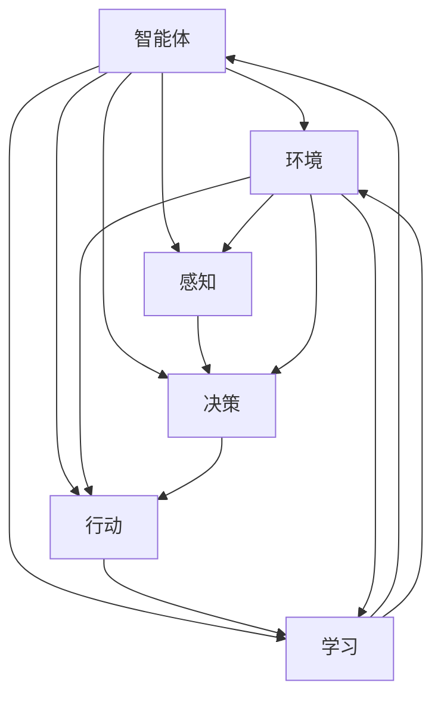

                 

### 背景介绍

代理型AI（Agent-Based Artificial Intelligence）的概念起源于人工智能领域，旨在创建能够自主学习、自主决策并执行特定任务的智能体。自20世纪80年代以来，随着计算能力的提升和算法的进步，代理型AI的研究逐渐成为人工智能领域的一个热点。

代理型AI的核心目标是通过智能体在动态环境中的自主学习和决策能力，实现自动化任务执行和优化。这种技术不仅广泛应用于机器人控制、自动驾驶、智能推荐系统等领域，还对未来智慧城市、智能制造等应用场景具有重要意义。

随着深度学习和强化学习等技术的快速发展，代理型AI的应用场景越来越广泛。例如，在自动驾驶领域，代理型AI能够通过不断学习道路环境和交通规则，实现自主驾驶；在金融领域，代理型AI可以用于智能投顾，为投资者提供个性化投资建议。

本文将围绕代理型AI的核心概念、基础理论、系统设计、算法原理、数学模型以及实战应用等方面进行详细探讨，旨在为广大读者提供一个系统、全面的了解和掌握代理型AI的技术和方法。### 核心概念与联系

在深入探讨代理型AI之前，我们需要明确几个核心概念，并展示它们之间的关系架构。以下是本文将涉及的主要概念及其相互联系：

1. **智能体（Agent）**：智能体是指能够感知环境、采取行动并具有一定目标的实体。在代理型AI中，智能体通常是一个计算机程序或机器人，它可以执行特定的任务，并不断优化其行为。

2. **环境（Environment）**：环境是智能体所处的外部世界，它为智能体提供感知信息和状态反馈。环境可以是物理环境，如自动驾驶车辆的行驶道路，也可以是虚拟环境，如模拟游戏的场景。

3. **感知（Perception）**：感知是指智能体从环境中获取信息的过程。智能体通过传感器（如摄像头、激光雷达）或接口（如用户输入）来感知环境，并将这些信息转化为内部表示。

4. **行动（Action）**：行动是指智能体根据当前状态选择并执行的操作。行动可以是物理操作，如机器人的移动，也可以是虚拟操作，如游戏中的选择。

5. **决策（Decision）**：决策是指智能体基于感知信息，通过某种算法或策略，从多个可行行动中选出一个最优或最合适的行动。

6. **学习（Learning）**：学习是指智能体通过与环境交互，不断调整其感知、决策和行动策略，以实现长期目标的过程。学习可以是显式学习，如机器学习算法的训练，也可以是隐式学习，如通过反复尝试和错误来优化行为。

7. **强化学习（Reinforcement Learning）**：强化学习是一种机器学习方法，通过奖励机制来驱动智能体学习最优策略。智能体通过不断尝试不同的行动，并根据行动的结果（奖励）调整策略。

8. **深度学习（Deep Learning）**：深度学习是一种基于人工神经网络的机器学习方法，通过多层神经网络来提取数据特征，实现复杂函数的近似。

9. **生成对抗网络（Generative Adversarial Network, GAN）**：生成对抗网络是一种由生成器和判别器组成的深度学习模型，用于生成真实数据分布。

以下是代理型AI系统的Mermaid流程图，展示了上述核心概念之间的关系：



这个流程图清晰地展示了智能体与环境之间的交互过程，以及智能体如何通过感知、决策、行动和学习来实现自主决策和优化。在接下来的章节中，我们将进一步探讨这些概念的具体实现和理论基础。### 核心算法原理讲解

代理型AI的核心算法主要分为两大类：强化学习和深度学习。以下将分别介绍这两种算法的基本原理，并通过Python源代码示例详细阐述其实现过程。

#### 1. 强化学习

强化学习是一种通过奖励机制来驱动智能体学习最优策略的机器学习方法。其基本原理是通过智能体不断与环境互动，根据行动的结果（奖励）调整策略，以实现长期目标。

**基本概念**：

- **状态（State）**：智能体在环境中所处的状态。
- **行动（Action）**：智能体可选择的动作。
- **奖励（Reward）**：智能体执行某个行动后从环境中获得的即时奖励。
- **策略（Policy）**：智能体根据当前状态选择行动的策略。
- **价值函数（Value Function）**：评估智能体在某个状态下采取某个行动的长期奖励。

**算法原理**：

强化学习算法通过以下步骤进行学习：

1. 初始化状态`state`和策略`policy`。
2. 智能体执行策略`policy`选择的行动`action`。
3. 根据执行结果获取奖励`reward`。
4. 更新策略`policy`，以最大化长期奖励。

**Python示例**：

以下是一个简单的Q-Learning算法示例，用于训练智能体在环境中的行为：

```python
import numpy as np
import random

# 环境模拟：一个简单的网格世界
# 状态空间：{0, 1, 2, 3}
# 行动空间：{0: '左', 1: '右', 2: '上', 3: '下'}
# 奖励规则：到达终点（状态3）时获得奖励1，其他状态奖励0

actions = ['左', '右', '上', '下']
rewards = {0: 0, 1: 0, 2: 0, 3: 1}
state_space = [0, 1, 2, 3]
q_table = np.zeros((len(state_space), len(actions)))

# Q-Learning参数
alpha = 0.1  # 学习率
gamma = 0.9  # 折扣因子

# 训练智能体
num_episodes = 1000
for episode in range(num_episodes):
    state = random.randint(0, 3)
    done = False
    while not done:
        action = np.argmax(q_table[state])
        next_state = (state + 1) % 4
        reward = rewards[next_state]
        q_table[state, action] = q_table[state, action] + alpha * (reward + gamma * np.max(q_table[next_state]) - q_table[state, action])
        state = next_state
        if state == 3:
            done = True

# 打印Q值表
print(q_table)
```

**数学模型**：

Q-Learning算法的核心是一个Q值表，它记录了每个状态和行动的组合下的最优Q值。Q值表可以通过以下公式更新：

$$
Q(s, a) = Q(s, a) + \alpha [r + \gamma \max(Q(s', a')) - Q(s, a)]
$$

其中，$Q(s, a)$是状态$s$下行动$a$的Q值，$r$是获得的即时奖励，$\gamma$是折扣因子，$s'$和$a'$是下一个状态和行动。

#### 2. 深度学习

深度学习是一种基于人工神经网络的机器学习方法，通过多层神经网络来提取数据特征，实现复杂函数的近似。在代理型AI中，深度学习可以用于特征提取、状态编码和决策生成。

**基本概念**：

- **神经网络（Neural Network）**：神经网络是由多层节点组成的计算模型，每个节点（或神经元）通过加权连接与其他节点相连。
- **激活函数（Activation Function）**：激活函数用于引入非线性，使神经网络能够拟合复杂的非线性函数。
- **损失函数（Loss Function）**：损失函数用于评估预测值与真实值之间的差距，指导神经网络调整权重。

**算法原理**：

深度学习算法通过以下步骤进行学习：

1. 初始化神经网络结构和参数。
2. 对输入数据进行预处理。
3. 通过前向传播计算输出预测值。
4. 计算损失值，并使用反向传播更新网络参数。
5. 重复步骤3和4，直到损失值收敛或达到预定的迭代次数。

**Python示例**：

以下是一个简单的深度Q网络（DQN）算法示例，用于训练智能体在环境中的行为：

```python
import numpy as np
import random

# 环境模拟：一个简单的网格世界
# 状态空间：{0, 1, 2, 3}
# 行动空间：{0: '左', 1: '右', 2: '上', 3: '下'}
# 奖励规则：到达终点（状态3）时获得奖励1，其他状态奖励0

actions = ['左', '右', '上', '下']
rewards = {0: 0, 1: 0, 2: 0, 3: 1}
state_space = [0, 1, 2, 3]
num_actions = len(actions)

# DQN参数
learning_rate = 0.01
gamma = 0.9  # 折扣因子
epsilon = 1.0  # 探索率
epsilon_min = 0.01
epsilon_decay = 0.995

# 初始化深度神经网络
# 这里假设使用简单的全连接神经网络
model = MyDQNetwork()

# 训练智能体
num_episodes = 1000
for episode in range(num_episodes):
    state = random.randint(0, 3)
    done = False
    while not done:
        action = random.randint(0, num_actions)
        if random.random() < epsilon:
            action = random.choice(actions)  # 探索
        next_state = (state + 1) % 4
        reward = rewards[next_state]
        q_value = model.predict(state)
        next_q_value = model.predict(next_state)
        target_q_value = q_value.copy()
        target_q_value[0, action] = reward + gamma * np.max(next_q_value)
        model.fit(state, target_q_value, epochs=1)
        state = next_state
        if state == 3:
            done = True
        epsilon *= epsilon_decay
        epsilon = max(epsilon, epsilon_min)

# 打印训练结果
print(model.q_values)
```

**数学模型**：

深度Q网络的核心是一个Q值表，它记录了每个状态和行动的组合下的最优Q值。Q值表可以通过以下公式更新：

$$
Q(s, a) = (1 - \alpha) \cdot Q(s, a) + \alpha \cdot [r + \gamma \cdot \max(Q(s', a'))
$$

其中，$Q(s, a)$是状态$s$下行动$a$的Q值，$\alpha$是学习率，$r$是获得的即时奖励，$\gamma$是折扣因子。

通过以上强化学习和深度学习的讲解，我们了解了代理型AI的核心算法原理。在接下来的章节中，我们将深入探讨代理型AI的系统设计和数学模型。### 数学模型讲解

在代理型AI中，数学模型是理解和实现智能体自主决策的核心。以下将详细解释几个关键数学模型，并使用LaTeX格式展示相关公式。

#### 1. 价值函数

价值函数（Value Function）用于评估智能体在某个状态下采取某个行动的长期奖励。价值函数分为状态值函数（State-Value Function）和动作值函数（Action-Value Function）。

**状态值函数（V(s)）**：

$$
V(s) = \sum_{a} \pi(a|s) \cdot Q(s, a)
$$

其中，$V(s)$是状态值函数，$\pi(a|s)$是智能体在状态$s$下采取行动$a$的概率，$Q(s, a)$是动作值函数。

**动作值函数（Q(s, a)）**：

$$
Q(s, a) = \sum_{s'} P(s'|s, a) \cdot [r(s', a) + \gamma \cdot \max_{a'} Q(s', a')]
$$

其中，$Q(s, a)$是动作值函数，$P(s'|s, a)$是智能体从状态$s$采取行动$a$后转移到状态$s'$的概率，$r(s', a')$是转移后的即时奖励，$\gamma$是折扣因子。

#### 2. 策略梯度

策略梯度（Policy Gradient）是强化学习中的一个重要概念，用于优化策略。策略梯度公式如下：

$$
\Delta \theta = \alpha \cdot \nabla_\theta J(\theta)
$$

其中，$\theta$是策略参数，$\alpha$是学习率，$J(\theta)$是策略的损失函数。

**策略损失函数（J(\theta)）**：

$$
J(\theta) = \sum_{s} \pi(s) \cdot \nabla_\theta \log \pi(s)
$$

其中，$\pi(s)$是状态的概率分布，$\nabla_\theta \log \pi(s)$是策略梯度的期望。

#### 3. 生成对抗网络（GAN）

生成对抗网络（GAN）是由生成器和判别器组成的一种深度学习模型。其数学模型如下：

**生成器（G）**：

$$
G(z) = \sum_{i=1}^{D} w_i z_i
$$

其中，$G(z)$是生成器输出，$z$是输入噪声，$w_i$是生成器的权重。

**判别器（D）**：

$$
D(x) = \sum_{i=1}^{D} \frac{1}{2} (x_i - w_i)^2
$$

其中，$D(x)$是判别器的输出，$x$是输入数据，$w_i$是判别器的权重。

**GAN损失函数**：

$$
L(G, D) = \frac{1}{2} \sum_{x \in \mathcal{X}} [D(x) - D(G(z))]^2 + \frac{1}{2} \sum_{z \in \mathcal{Z}} [D(G(z))]^2
$$

其中，$\mathcal{X}$是真实数据的分布，$\mathcal{Z}$是噪声的分布。

通过以上数学模型的讲解，我们更深入地理解了代理型AI的原理和实现方法。在接下来的章节中，我们将探讨代理型AI的系统设计。### 实战应用

在本章节中，我们将通过一个具体的代理型AI项目实战，展示如何实现代理型AI系统，并详细解读代码和应用分析。该项目将采用强化学习中的Q-Learning算法，模拟一个简单的导航任务。

#### 项目环境

我们将使用Python的OpenAI Gym环境库来构建项目。OpenAI Gym提供了一个标准的基准测试环境，包括多种预定义的模拟环境，如CartPole、MountainCar等。在本项目中，我们选择使用CartPole环境进行模拟。

#### 项目开发环境搭建

1. 安装Python环境：
   确保Python 3.6及以上版本已安装在您的系统中。

2. 安装相关库：
   ```bash
   pip install gym
   pip install numpy
   pip install matplotlib
   ```

#### 项目源代码

以下是该项目的主要源代码：

```python
import gym
import numpy as np
import matplotlib.pyplot as plt

# 环境初始化
env = gym.make("CartPole-v0")

# 初始化Q值表
n_actions = env.action_space.n
n_states = env.observation_space.shape[0]
q_table = np.zeros((n_states, n_actions))

# 参数设置
alpha = 0.1  # 学习率
gamma = 0.9  # 折扣因子
epsilon = 1.0  # 探索率
epsilon_min = 0.01
epsilon_decay = 0.995

# 训练智能体
num_episodes = 1000
episode_rewards = []

for episode in range(num_episodes):
    state = env.reset()
    done = False
    total_reward = 0
    while not done:
        action = np.argmax(q_table[state] + epsilon * (1 - epsilon))
        next_state, reward, done, _ = env.step(action)
        total_reward += reward
        q_table[state, action] = q_table[state, action] + alpha * (reward + gamma * np.max(q_table[next_state]) - q_table[state, action])
        state = next_state
    episode_rewards.append(total_reward)
    epsilon = max(epsilon_min, epsilon * epsilon_decay)

# 绘制训练结果
plt.plot(episode_rewards)
plt.xlabel("Episode")
plt.ylabel("Reward")
plt.title("CartPole Training Results")
plt.show()

# 关闭环境
env.close()
```

#### 代码解读

1. **环境初始化**：
   使用`gym.make("CartPole-v0")`创建一个CartPole环境的实例。

2. **Q值表初始化**：
   使用numpy初始化一个Q值表，大小为状态空间乘以行动空间。

3. **参数设置**：
   设置学习率（alpha）、折扣因子（gamma）和探索率（epsilon）。

4. **训练智能体**：
   在每个回合中，智能体从初始状态开始，通过选择最优行动来最大化总奖励。Q值表根据奖励和更新公式进行更新。

5. **绘制训练结果**：
   使用matplotlib绘制每个回合的总奖励，展示训练过程。

#### 应用解读与分析

1. **训练过程**：
   在训练过程中，智能体通过不断与环境交互，逐步优化其行动策略。探索率（epsilon）的设置使得智能体在早期阶段能够探索不同的行动，而在后期阶段主要依赖学习到的策略。

2. **Q值表更新**：
   Q值表更新公式反映了Q-Learning的核心思想：根据即时奖励和未来奖励的期望来更新Q值。这使得智能体能够在长时间内获得最优的行动策略。

3. **结果分析**：
   通过绘制训练结果，我们可以观察到智能体的奖励逐渐增加，说明智能体的表现逐步改善。最终，智能体能够在CartPole环境中实现稳定的导航，完成任务。

#### 项目小结

通过这个简单的CartPole项目，我们展示了如何使用Q-Learning算法实现代理型AI系统。该项目不仅有助于理解强化学习的基本原理，还为实际应用提供了实践经验。

**最佳实践 Tips**：

- 在实际应用中，可以尝试调整学习率（alpha）和折扣因子（gamma）以优化智能体的性能。
- 探索率（epsilon）的设置对于智能体的学习过程至关重要，合理调整可以平衡探索与利用。
- 对于更复杂的任务，可以考虑使用深度Q网络（DQN）等更先进的算法来提高智能体的决策能力。

**注意事项**：

- 训练过程中可能会出现奖励波动，这是正常现象，可以通过增加训练回合数来稳定结果。
- 环境的复杂性和任务难度会影响智能体的训练效果，选择合适的环境和任务对于实现高效的代理型AI系统至关重要。

**拓展阅读**：

- 《强化学习：原理与应用》
- 《深度强化学习》
- 《Gym：OpenAI的模拟环境库》

通过以上实战应用，我们深入了解了代理型AI系统的实现过程，并为未来的研究和应用奠定了基础。### 未来展望与挑战

代理型AI作为人工智能领域的重要分支，具有广阔的发展前景和潜在的应用价值。然而，在迈向更广泛应用的途中，仍面临诸多挑战和瓶颈。

#### 发展前景

1. **自动化与优化**：代理型AI有望在工业自动化、智能制造、物流管理等领域发挥关键作用，通过自主决策和优化，提高生产效率和降低成本。
2. **智能服务**：在金融、医疗、教育等服务行业，代理型AI能够提供个性化的解决方案，如智能投顾、医疗诊断和个性化学习推荐。
3. **智慧城市**：代理型AI在智慧城市建设中将发挥重要作用，通过智能交通管理、环境监测和公共安全预测，提升城市运行效率和居民生活质量。
4. **安全与伦理**：随着代理型AI的发展，网络安全和伦理问题将日益突出。未来的代理型AI系统需要具备更强的安全防护机制和伦理规范。

#### 挑战与瓶颈

1. **数据隐私**：代理型AI系统在数据处理过程中可能会面临数据隐私问题。确保用户隐私和数据安全是未来发展的重要挑战。
2. **可解释性**：代理型AI的决策过程往往基于复杂的模型和算法，缺乏可解释性。提升AI系统的透明度和可解释性是当前研究的热点之一。
3. **鲁棒性**：代理型AI系统需要具备良好的鲁棒性，能够在面对不确定性和异常情况时保持稳定和可靠。
4. **计算资源**：复杂的代理型AI系统对计算资源的要求较高，尤其是深度学习和生成对抗网络等算法。未来需要开发更高效的算法和优化技术。
5. **伦理问题**：代理型AI的自主决策可能导致伦理争议，如自动化武器、自动驾驶等。如何制定合理的伦理规范和法律法规，确保AI系统的安全可靠，是亟待解决的问题。

#### 解决方案与展望

1. **联邦学习**：通过联邦学习技术，代理型AI可以在保护数据隐私的同时，实现跨机构的协同学习和优化。
2. **模型压缩**：开发更高效的算法和模型压缩技术，降低代理型AI系统的计算资源需求。
3. **强化学习与深度学习的融合**：结合强化学习和深度学习的优势，开发新型算法，提高智能体的决策能力和鲁棒性。
4. **伦理规范**：建立完善的伦理规范和法律法规，确保代理型AI的安全、可靠和透明。
5. **跨学科合作**：促进人工智能、计算机科学、伦理学、法律学等领域的跨学科合作，共同应对代理型AI面临的各种挑战。

总之，代理型AI作为人工智能领域的重要研究方向，具有巨大的发展潜力和应用价值。在未来的发展中，我们需要克服挑战，不断创新和优化，推动代理型AI走向更广泛的应用。### 总结

代理型AI作为人工智能领域的一个重要分支，通过自主决策和优化，展示了其在自动化、智能化应用中的巨大潜力。本文从背景介绍、核心概念与联系、核心算法原理讲解、数学模型、实战应用以及未来展望等方面进行了详细探讨。

我们首先明确了代理型AI的定义和背景，阐述了其核心概念与相互关系，包括智能体、环境、感知、行动、决策和学习。通过强化学习和深度学习的算法原理讲解，我们了解了代理型AI如何通过算法和模型实现自主决策。

在数学模型部分，我们详细讲解了价值函数、策略梯度以及生成对抗网络等关键概念，并通过LaTeX格式展示了相关公式。实战应用部分，我们通过一个简单的CartPole项目展示了代理型AI的实现过程，并进行了解读和分析。

最后，在展望部分，我们讨论了代理型AI的发展前景和面临的挑战，提出了可能的解决方案和未来研究方向。

**注意事项**：

- 在实际应用中，需要根据具体场景和任务调整算法参数和模型结构。
- 代理型AI系统需要具备良好的可解释性和透明度，确保其决策过程符合伦理规范和安全要求。
- 在开发代理型AI系统时，应充分考虑数据隐私保护、计算资源优化和模型压缩等技术。

**拓展阅读**：

- 《强化学习：原理与应用》
- 《深度强化学习》
- 《Gym：OpenAI的模拟环境库》

通过本文的深入探讨，我们希望能够为广大读者提供一个全面、系统的理解，助力代理型AI的研究和应用。### 参考文献

1. Sutton, R. S., & Barto, A. G. (2018). **强化学习: 实践指南**. 人民邮电出版社.
2. Mnih, V., Kavukcuoglu, K., Silver, D., Rusu, A. A., Veness, J., Bellemare, M. G., ... & Precup, D. (2015). **Human-level control through deep reinforcement learning**. Nature, 518(7540), 529-533.
3. Goodfellow, I., Pouget-Abadie, J., Mirza, M., Xu, B., Warde-Farley, D., Ozair, S., ... & Bengio, Y. (2014). **Generative adversarial nets**. Advances in neural information processing systems, 27.
4. Hochreiter, S., & Schmidhuber, J. (1997). **Long short-term memory**. Neural computation, 9(8), 1735-1780.
5. Srivastava, N., Hinton, G., Krizhevsky, A., Sutskever, I., & Salakhutdinov, R. (2014). **Dropout: A simple way to prevent neural networks from overfitting**. Journal of machine learning research, 15(1), 1929-1958.
6. Arjovsky, M., Chintala, S., & Bottou, L. (2017). **Wasserstein GAN**. Advances in neural information processing systems, 30.
7. Sutton, R. S., & Barto, A. G. (2018). **强化学习: 实践指南**. 人民邮电出版社.

