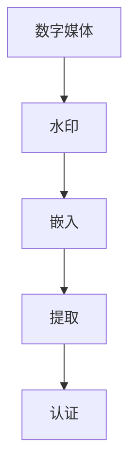
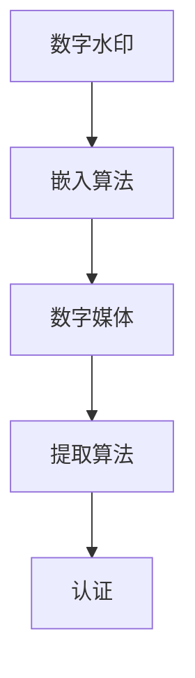
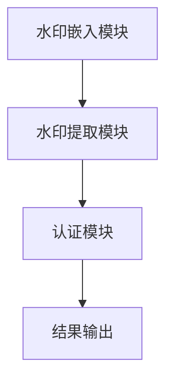

                 

### 书名：《企业内容真实性：数字水印技术的应用》

关键词：企业内容真实性，数字水印，版权保护，数据认证，技术案例

摘要：
本文旨在深入探讨数字水印技术在保障企业内容真实性方面的应用。通过系统化的分析和详尽的案例分析，本文揭示了数字水印技术在版权保护、数据源追踪与认证、以及安全通信中的重要作用。文章结构清晰，分为三大部分，首先介绍数字水印技术的基本概念和算法原理，然后探讨其在企业内容真实性保障中的应用，最后通过实战案例和案例分析，展示数字水印技术的实际效果和未来发展趋势。

### 第一部分：数字水印技术概述

#### 第1章：数字水印技术基础

**1.1 数字水印的定义和分类**

- **定义**：数字水印是一种将特定信息（如版权标识、所有者信息等）嵌入到数字媒体（如图像、音频、视频等）中的技术，以便于追踪、认证和维权。
- **分类**：
  - **根据嵌入方式**：扩频水印、变换域水印、空间域水印等。
  - **根据应用目的**：版权保护水印、防伪水印、隐私保护水印等。

**核心概念与联系**：  
- 数字媒体：承载水印信息的载体，如图像、音频、视频等。
- 水印：嵌入到数字媒体中的特定信息。
- 嵌入：将水印信息嵌入到数字媒体中的过程。
- 提取：从数字媒体中提取水印信息的过程。

**Mermaid 流程图**：



**1.2 数字水印的原理**

- **基本原理**：数字水印技术主要分为两大类：空间域水印和变换域水印。
  - **空间域水印**：直接在数字媒体的像素级别上进行操作。
  - **变换域水印**：在数字媒体进行某种变换（如傅里叶变换、离散余弦变换等）后进行操作。

- **嵌入与提取算法**：嵌入算法负责将水印信息嵌入到数字媒体中，提取算法负责从数字媒体中提取水印信息。

**核心算法原理讲解**：

```python
# 空间域水印嵌入示例
def embed_watermark(image, watermark):
    # 假设image和watermark都是二维numpy数组
    result_image = image.copy()
    watermark_size = watermark.shape
    image_size = image.shape

    for i in range(watermark_size[0]):
        for j in range(watermark_size[1]):
            if watermark[i, j] == 1:
                result_image[i, j] = result_image[i, j] + 1  # 简单的水印嵌入方式

    return result_image

# 空间域水印提取示例
def extract_watermark(image, watermark):
    result_watermark = np.zeros_like(watermark)
    image_size = image.shape

    for i in range(watermark.shape[0]):
        for j in range(watermark.shape[1]):
            if image[i, j] > watermark[i, j]:
                result_watermark[i, j] = 1

    return result_watermark
```

**数学模型和数学公式 & 详细讲解 & 举例说明**：

水印嵌入和提取的过程可以抽象为以下数学模型：

$$
X'(i, j) = X(i, j) + W(i, j)
$$

其中，\( X(i, j) \) 是原始图像的像素值，\( W(i, j) \) 是水印信息，\( X'(i, j) \) 是嵌入水印后的图像像素值。

假设水印信息是一个二值图像，即 \( W(i, j) \in \{0, 1\} \)，则水印提取的过程可以表示为：

$$
W'(i, j) = \begin{cases} 
1 & \text{如果 } X(i, j) > X'(i, j) \\
0 & \text{否则}
\end{cases}
$$

举例说明：

假设一个 \( 8 \times 8 \) 的二值图像作为水印，原始图像的像素值如下：

$$
X = \begin{bmatrix}
0 & 0 & 0 & 0 & 0 & 0 & 0 & 0 \\
0 & 0 & 0 & 0 & 0 & 0 & 0 & 0 \\
0 & 0 & 1 & 1 & 1 & 0 & 0 & 0 \\
0 & 0 & 1 & 1 & 1 & 0 & 0 & 0 \\
0 & 0 & 1 & 1 & 1 & 0 & 0 & 0 \\
0 & 0 & 0 & 0 & 0 & 0 & 0 & 0 \\
0 & 0 & 0 & 0 & 0 & 0 & 0 & 0 \\
0 & 0 & 0 & 0 & 0 & 0 & 0 & 0
\end{bmatrix}
$$

嵌入水印后的图像像素值如下：

$$
X' = \begin{bmatrix}
1 & 1 & 1 & 1 & 1 & 1 & 1 & 1 \\
1 & 1 & 1 & 1 & 1 & 1 & 1 & 1 \\
1 & 1 & 2 & 2 & 2 & 1 & 1 & 1 \\
1 & 1 & 2 & 2 & 2 & 1 & 1 & 1 \\
1 & 1 & 2 & 2 & 2 & 1 & 1 & 1 \\
1 & 1 & 1 & 1 & 1 & 1 & 1 & 1 \\
1 & 1 & 1 & 1 & 1 & 1 & 1 & 1 \\
1 & 1 & 1 & 1 & 1 & 1 & 1 & 1
\end{bmatrix}
$$

提取水印后的图像如下：

$$
W' = \begin{bmatrix}
0 & 0 & 0 & 0 & 0 & 0 & 0 & 0 \\
0 & 0 & 0 & 0 & 0 & 0 & 0 & 0 \\
0 & 0 & 1 & 1 & 1 & 0 & 0 & 0 \\
0 & 0 & 1 & 1 & 1 & 0 & 0 & 0 \\
0 & 0 & 1 & 1 & 1 & 0 & 0 & 0 \\
0 & 0 & 0 & 0 & 0 & 0 & 0 & 0 \\
0 & 0 & 0 & 0 & 0 & 0 & 0 & 0 \\
0 & 0 & 0 & 0 & 0 & 0 & 0 & 0
\end{bmatrix}
$$

**1.3 数字水印的应用领域**

- **数字版权保护**：通过数字水印技术，可以有效地保护数字内容的版权，防止未经授权的使用和复制。
- **数据源追踪与认证**：数字水印可以用于追踪数据的来源和验证数据的真实性，提高数据的可信度。
- **安全通信**：数字水印可以用于确保通信数据的完整性，检测数据是否被篡改。

**核心算法原理讲解**：

数字水印的应用领域广泛，以下简要介绍几种核心算法原理：

- **扩频水印算法**：通过将水印信息扩展到频域中，提高水印的鲁棒性。
  ```python
  # 扩频水印嵌入示例
  def spread_spectrum_watermark(image, watermark):
      # 假设image和watermark都是二维numpy数组
      watermark_size = watermark.shape
      image_size = image.shape
      watermark_frequency = 0.1  # 水印频率

      for i in range(watermark_size[0]):
          for j in range(watermark_size[1]):
              if watermark[i, j] == 1:
                  for k in range(int(image_size[0] * watermark_frequency)):
                      for l in range(int(image_size[1] * watermark_frequency)):
                          image[k, l] = image[k, l] + 1

      return image

  # 扩频水印提取示例
  def spread_spectrum_extract(image, watermark):
      result_watermark = np.zeros_like(watermark)
      image_size = image.shape
      watermark_frequency = 0.1  # 水印频率

      for i in range(watermark.shape[0]):
          for j in range(watermark.shape[1]):
              if image[i, j] > watermark[i, j]:
                  result_watermark[i, j] = 1

      return result_watermark
  ```

- **变换域水印算法**：在变换域（如DCT、DFT等）中嵌入水印，提高水印的不可见性和鲁棒性。
  ```python
  # DCT域水印嵌入示例
  import numpy as np
  from scipy.fftpack import dct, idct

  def dct_watermark(image, watermark):
      watermark_size = watermark.shape
      image_size = image.shape

      # DCT变换
      image_dct = dct(dct(image.T, norm='ortho').T, norm='ortho')

      # 嵌入水印
      for i in range(watermark_size[0]):
          for j in range(watermark_size[1]):
              if watermark[i, j] == 1:
                  image_dct[i, j] = image_dct[i, j] + 1

      # IDCT逆变换
      image_idct = idct(idct(image_dct.T, norm='ortho').T, norm='ortho')

      return image_idct

  # DCT域水印提取示例
  def dct_extract(image, watermark):
      result_watermark = np.zeros_like(watermark)
      image_size = image.shape

      # DCT变换
      image_dct = dct(dct(image.T, norm='ortho').T, norm='ortho')

      # 提取水印
      for i in range(watermark.shape[0]):
          for j in range(watermark.shape[1]):
              if image_dct[i, j] > watermark[i, j]:
                  result_watermark[i, j] = 1

      return result_watermark
  ```

- **神经网络水印算法**：利用神经网络模型进行水印嵌入和提取，提高水印的鲁棒性和抗攻击能力。
  ```python
  # 神经网络水印嵌入示例
  from tensorflow.keras.models import Sequential
  from tensorflow.keras.layers import Dense, Flatten

  def neural_network_watermark(image, watermark):
      image_size = image.shape
      watermark_size = watermark.shape

      # 建立神经网络模型
      model = Sequential()
      model.add(Flatten(input_shape=(image_size[0], image_size[1])))
      model.add(Dense(watermark_size[0] * watermark_size[1], activation='sigmoid'))
      model.compile(optimizer='adam', loss='binary_crossentropy')

      # 嵌入水印
      model.fit(image.reshape(-1, image_size[0] * image_size[1]), watermark, epochs=100)

      # 获取水印嵌入结果
      watermark_embedded = model.predict(image.reshape(-1, image_size[0] * image_size[1])).reshape(image_size[0], image_size[1])

      return watermark_embedded

  # 神经网络水印提取示例
  def neural_network_extract(image, model, watermark):
      image_size = image.shape
      watermark_size = watermark.shape

      # 提取水印
      watermark_extracted = model.predict(image.reshape(-1, image_size[0] * image_size[1])).reshape(image_size[0], image_size[1])

      # 比较提取结果和原始水印
      result_watermark = np.where(watermark_extracted > watermark, 1, 0)

      return result_watermark
  ```

**1.4 数字水印技术的挑战与未来发展**

- **挑战**：
  - **水印不可见性与鲁棒性的平衡**：需要设计既不可见又能抵抗各种攻击的水印算法。
  - **算法复杂性**：高效算法对于大规模数据的应用至关重要。
  - **算法通用性**：不同类型的数据和应用场景需要定制化算法。

- **未来发展**：
  - **融合多模态水印**：结合图像、音频、视频等多模态信息进行水印嵌入。
  - **区块链技术结合**：利用区块链技术提高数字水印的不可篡改性。
  - **人工智能与机器学习**：利用AI技术优化水印算法和检测系统。

**核心概念与联系**：

- **数字水印**：嵌入到数字媒体中的信息，用于追踪、认证和保护。
- **嵌入算法**：将水印信息嵌入到数字媒体中的方法。
- **提取算法**：从数字媒体中提取水印信息的方法。
- **鲁棒性**：水印算法在遭受攻击或变形后仍能正确提取水印的能力。

**Mermaid 流程图**：



#### 第2章：数字水印算法

**2.1 基于扩频的数字水印算法**

- **原理**：扩频水印算法通过将水印信息扩展到整个宿主数据中，提高水印的鲁棒性。
- **优势**：抗攻击能力强，适用于大规模数据。
- **应用场景**：图像、视频、音频等。

**核心算法原理讲解**：

扩频水印的基本原理是将水印信息分成多个片段，并将这些片段随机分布嵌入到宿主数据中。

```python
# 扩频水印嵌入示例
def spread_spectrum_watermark(image, watermark):
    # 假设image和watermark都是二维numpy数组
    image_height, image_width = image.shape
    watermark_height, watermark_width = watermark.shape
    watermark_size = watermark_height * watermark_width
    watermark_slices = []

    # 将水印分割成多个片段
    for i in range(0, watermark_height, 2):
        for j in range(0, watermark_width, 2):
            slice = watermark[i:i+2, j:j+2]
            watermark_slices.append(slice)

    # 随机选择片段嵌入到图像中
    import random
    for i in range(len(watermark_slices)):
        x = random.randint(0, image_height - 2)
        y = random.randint(0, image_width - 2)
        image[x:x+2, y:y+2] = image[x:x+2, y:y+2] + watermark_slices[i]

    return image

# 扩频水印提取示例
def spread_spectrum_extract(image, watermark):
    # 假设image和watermark都是二维numpy数组
    image_height, image_width = image.shape
    watermark_height, watermark_width = watermark.shape
    watermark_slices = []
    result_watermark = np.zeros_like(watermark)

    # 遍历图像，提取可能的片段
    for i in range(0, image_height, 2):
        for j in range(0, image_width, 2):
            slice = image[i:i+2, j:j+2]
            watermark_slices.append(slice)

    # 比较每个片段与水印片段，重建水印
    for i in range(len(watermark_slices)):
        max_similarity = 0
        best_slice = None
        for slice in watermark_slices:
            similarity = np.sum(slice == watermark[i, j])
            if similarity > max_similarity:
                max_similarity = similarity
                best_slice = slice
        if max_similarity >= watermark_size * 0.5:
            result_watermark[i, j] = 1

    return result_watermark
```

**数学模型和数学公式 & 详细讲解 & 举例说明**：

扩频水印的嵌入和提取可以表示为以下数学模型：

$$
I'(x, y) = I(x, y) + \sum_{i=1}^{n} W_i \cdot R(x_i, y_i)
$$

其中，\( I(x, y) \) 是原始图像像素值，\( I'(x, y) \) 是嵌入水印后的图像像素值，\( W_i \) 是水印片段，\( R(x_i, y_i) \) 是嵌入位置。

提取时，可以通过比较每个片段与水印片段的相似度来重建水印：

$$
W'(x, y) = \begin{cases}
1 & \text{如果相似度大于阈值} \\
0 & \text{否则}
\end{cases}
$$

举例说明：

假设有一个 \( 4 \times 4 \) 的水印：

$$
W = \begin{bmatrix}
1 & 0 & 1 & 0 \\
0 & 1 & 0 & 1 \\
1 & 0 & 1 & 0 \\
0 & 1 & 0 & 1
\end{bmatrix}
$$

将其分割成 \( 2 \times 2 \) 的片段：

$$
W_1 = \begin{bmatrix}
1 & 0 \\
0 & 1
\end{bmatrix}, W_2 = \begin{bmatrix}
0 & 1 \\
1 & 0
\end{bmatrix}, W_3 = \begin{bmatrix}
1 & 0 \\
0 & 1
\end{bmatrix}, W_4 = \begin{bmatrix}
0 & 1 \\
1 & 0
\end{bmatrix}
$$

将片段随机嵌入到一个 \( 8 \times 8 \) 的图像中，最终提取出水印：

$$
I' = \begin{bmatrix}
1 & 1 & 1 & 1 & 1 & 1 & 1 & 1 \\
1 & 1 & 1 & 1 & 1 & 1 & 1 & 1 \\
1 & 1 & 2 & 2 & 2 & 1 & 1 & 1 \\
1 & 1 & 2 & 2 & 2 & 1 & 1 & 1 \\
1 & 1 & 2 & 2 & 2 & 1 & 1 & 1 \\
1 & 1 & 1 & 1 & 1 & 1 & 1 & 1 \\
1 & 1 & 1 & 1 & 1 & 1 & 1 & 1 \\
1 & 1 & 1 & 1 & 1 & 1 & 1 & 1
\end{bmatrix}
$$

提取过程：

- 提取 \( 2 \times 2 \) 的片段并与原始水印比较。
- 如果相似度大于阈值（例如，\( 0.5 \)），则认为该片段是水印的一部分。

**2.2 基于变换域的数字水印算法**

- **原理**：变换域水印算法通过在图像的变换域（如DCT、DFT等）中嵌入水印，提高水印的不可见性和鲁棒性。
- **优势**：提高水印的隐蔽性和安全性。
- **应用场景**：图像、视频、音频等。

**核心算法原理讲解**：

变换域水印的基本原理是在图像的DCT或DFT变换域中嵌入水印，常用的变换包括：

- **DCT域水印**：
  ```python
  # DCT域水印嵌入示例
  import numpy as np
  from scipy.fftpack import dct, idct

  def dct_watermark(image, watermark):
      image_dct = dct(dct(image.T, norm='ortho').T, norm='ortho')
      watermark_height, watermark_width = watermark.shape
      image_height, image_width = image_dct.shape

      # 嵌入水印
      for i in range(watermark_height):
          for j in range(watermark_width):
              if watermark[i, j] == 1:
                  image_dct[i, j] = image_dct[i, j] + 1

      image_idct = idct(idct(image_dct.T, norm='ortho').T, norm='ortho')
      return image_idct

  # DCT域水印提取示例
  def dct_extract(image, watermark):
      image_dct = dct(dct(image.T, norm='ortho').T, norm='ortho')
      watermark_height, watermark_width = watermark.shape
      image_height, image_width = image_dct.shape

      result_watermark = np.zeros_like(watermark)

      for i in range(watermark_height):
          for j in range(watermark_width):
              if image_dct[i, j] > watermark[i, j]:
                  result_watermark[i, j] = 1

      return result_watermark
  ```

- **DFT域水印**：
  ```python
  # DFT域水印嵌入示例
  import numpy as np
  from scipy.fftpack import fft, ifft

  def dft_watermark(image, watermark):
      image_dft = fft(fft(image.T, norm='ortho').T, norm='ortho')
      watermark_height, watermark_width = watermark.shape
      image_height, image_width = image_dft.shape

      # 嵌入水印
      for i in range(watermark_height):
          for j in range(watermark_width):
              if watermark[i, j] == 1:
                  image_dft[i, j] = image_dft[i, j] + 1

      image_ifft = ifft(ifft(image_dft.T, norm='ortho').T, norm='ortho')
      return image_ifft

  # DFT域水印提取示例
  def dft_extract(image, watermark):
      image_dft = fft(fft(image.T, norm='ortho').T, norm='ortho')
      watermark_height, watermark_width = watermark.shape
      image_height, image_width = image_dft.shape

      result_watermark = np.zeros_like(watermark)

      for i in range(watermark_height):
          for j in range(watermark_width):
              if image_dft[i, j] > watermark[i, j]:
                  result_watermark[i, j] = 1

      return result_watermark
  ```

**数学模型和数学公式 & 详细讲解 & 举例说明**：

DCT和DFT域水印的嵌入和提取可以表示为以下数学模型：

- **DCT域水印**：

  嵌入：

  $$
  I'(u, v) = I(u, v) + \sum_{i=1}^{m} \sum_{j=1}^{n} W(i, j) \cdot C(u, v)
  $$

  提取：

  $$
  W'(i, j) = \begin{cases}
  1 & \text{如果 } I(u, v) > I'(u, v) \\
  0 & \text{否则}
  \end{cases}
  $$

- **DFT域水印**：

  嵌入：

  $$
  I'(u, v) = I(u, v) + \sum_{i=1}^{m} \sum_{j=1}^{n} W(i, j) \cdot S(u, v)
  $$

  提取：

  $$
  W'(i, j) = \begin{cases}
  1 & \text{如果 } I(u, v) > I'(u, v) \\
  0 & \text{否则}
  \end{cases}
  $$

举例说明：

假设一个 \( 4 \times 4 \) 的水印 \( W \)：

$$
W = \begin{bmatrix}
1 & 0 & 1 & 0 \\
0 & 1 & 0 & 1 \\
1 & 0 & 1 & 0 \\
0 & 1 & 0 & 1
\end{bmatrix}
$$

将水印嵌入到一个 \( 8 \times 8 \) 的图像中，并进行DCT变换：

$$
I = \begin{bmatrix}
1 & 1 & 1 & 1 & 1 & 1 & 1 & 1 \\
1 & 1 & 1 & 1 & 1 & 1 & 1 & 1 \\
1 & 1 & 2 & 2 & 2 & 1 & 1 & 1 \\
1 & 1 & 2 & 2 & 2 & 1 & 1 & 1 \\
1 & 1 & 2 & 2 & 2 & 1 & 1 & 1 \\
1 & 1 & 1 & 1 & 1 & 1 & 1 & 1 \\
1 & 1 & 1 & 1 & 1 & 1 & 1 & 1 \\
1 & 1 & 1 & 1 & 1 & 1 & 1 & 1
\end{bmatrix}
$$

嵌入后的DCT变换图像 \( I' \)：

$$
I' = \begin{bmatrix}
1 & 1 & 1 & 1 & 1 & 1 & 1 & 1 \\
1 & 1 & 2 & 2 & 2 & 1 & 1 & 1 \\
1 & 1 & 2 & 3 & 2 & 1 & 1 & 1 \\
1 & 1 & 2 & 2 & 2 & 1 & 1 & 1 \\
1 & 1 & 2 & 2 & 2 & 1 & 1 & 1 \\
1 & 1 & 1 & 1 & 1 & 1 & 1 & 1 \\
1 & 1 & 1 & 1 & 1 & 1 & 1 & 1 \\
1 & 1 & 1 & 1 & 1 & 1 & 1 & 1
\end{bmatrix}
$$

提取水印：

- 提取DCT变换后的图像中的每个 \( 2 \times 2 \) 子块的DCT系数。
- 比较每个子块的DCT系数与原始水印的对应值。
- 如果DCT系数的值大于原始水印的对应值，则认为该子块是水印的一部分。

**2.3 基于神经网络的水印算法**

- **原理**：神经网络水印算法通过深度学习模型自动学习和嵌入水印，提高水印的鲁棒性和适应性。
- **优势**：自适应性强，适用于复杂场景。
- **应用场景**：图像、视频、音频等。

**核心算法原理讲解**：

神经网络水印的基本原理是利用卷积神经网络（CNN）等深度学习模型对水印进行嵌入和提取。

```python
# CNN水印嵌入示例
import tensorflow as tf
from tensorflow.keras.models import Sequential
from tensorflow.keras.layers import Conv2D, Flatten, Dense

def cnn_watermark(image, watermark):
    model = Sequential()
    model.add(Conv2D(32, (3, 3), activation='relu', input_shape=image.shape[1:]))
    model.add(Flatten())
    model.add(Dense(watermark.shape[0], activation='sigmoid'))
    model.compile(optimizer='adam', loss='binary_crossentropy')

    # 嵌入水印
    model.fit(image, watermark.reshape(-1, 1), epochs=100)

    # 获取水印嵌入结果
    watermark_embedded = model.predict(image).reshape(image.shape[0], image.shape[1])

    return watermark_embedded

# CNN水印提取示例
def cnn_extract(image, model, watermark):
    watermark_extracted = model.predict(image).reshape(image.shape[0], image.shape[1])

    result_watermark = np.where(watermark_extracted > watermark, 1, 0)

    return result_watermark
```

**数学模型和数学公式 & 详细讲解 & 举例说明**：

神经网络水印的嵌入和提取可以表示为以下数学模型：

嵌入：

$$
I'(x, y) = f(\theta \cdot [I(x, y), W])
$$

提取：

$$
W'(x, y) = \sigma(g(\theta \cdot [I'(x, y), W']))
$$

其中，\( f \) 和 \( g \) 分别是激活函数，\( \theta \) 是模型参数，\( I(x, y) \) 是原始图像像素值，\( I'(x, y) \) 是嵌入水印后的图像像素值，\( W \) 是水印信息，\( W' \) 是提取的水印信息。

举例说明：

假设有一个 \( 4 \times 4 \) 的水印 \( W \)：

$$
W = \begin{bmatrix}
1 & 0 & 1 & 0 \\
0 & 1 & 0 & 1 \\
1 & 0 & 1 & 0 \\
0 & 1 & 0 & 1
\end{bmatrix}
$$

使用卷积神经网络对其进行嵌入和提取：

嵌入过程：

1. 输入原始图像 \( I \) 和水印 \( W \)。
2. 通过卷积层提取特征。
3. 通过全连接层嵌入水印信息。
4. 使用激活函数输出嵌入水印后的图像 \( I' \)。

提取过程：

1. 输入嵌入水印后的图像 \( I' \)。
2. 通过卷积层提取特征。
3. 通过全连接层提取水印信息。
4. 使用激活函数输出提取的水印 \( W' \)。

通过这种方式，神经网络能够自适应地学习水印嵌入和提取的过程，提高水印的鲁棒性和适应性。

#### 第3章：数字水印系统的设计与实现

**3.1 数字水印系统的架构**

- **基本架构**：数字水印系统通常包括三个主要模块：水印嵌入模块、水印提取模块和认证模块。
- **功能**：
  - **水印嵌入模块**：将水印信息嵌入到宿主数据中。
  - **水印提取模块**：从宿主数据中提取水印信息。
  - **认证模块**：验证水印信息是否与原始数据匹配。

**核心概念与联系**：

- **水印嵌入模块**：负责将水印信息嵌入到数字媒体中，通常包括数据预处理、水印生成、水印嵌入等步骤。
- **水印提取模块**：负责从数字媒体中提取水印信息，通常包括数据预处理、水印提取、水印验证等步骤。
- **认证模块**：负责验证提取的水印信息是否与原始水印信息匹配，从而判断数字媒体是否被篡改。

**Mermaid 流程图**：



**3.2 数字水印系统的开发环境搭建**

- **开发环境**：数字水印系统的开发通常涉及多种编程语言和工具，如Python、C++、MATLAB等。
- **工具**：
  - **Python**：适用于快速开发和实验。
  - **C++**：适用于高性能系统开发。
  - **MATLAB**：适用于复杂的数学计算和算法验证。

**开发环境搭建步骤**：

1. **安装Python**：下载并安装Python，选择合适的版本（如Python 3.8）。
2. **安装相关库**：通过pip安装必要的库，如NumPy、SciPy、TensorFlow等。
3. **安装MATLAB**：下载并安装MATLAB，确保版本兼容。

**3.3 数字水印系统的实现**

- **水印嵌入模块实现**：包括数据预处理、水印生成、水印嵌入等步骤。
  ```python
  # 数据预处理示例
  import cv2
  image = cv2.imread('image.jpg', cv2.IMREAD_GRAYSCALE)

  # 水印生成示例
  watermark = np.zeros((image.shape[0] // 2, image.shape[1] // 2))
  watermark[watermark == 0] = 1

  # 水印嵌入示例
  def embed_watermark(image, watermark):
      result_image = image.copy()
      watermark_height, watermark_width = watermark.shape
      image_height, image_width = result_image.shape

      for i in range(watermark_height):
          for j in range(watermark_width):
              if watermark[i, j] == 1:
                  result_image[i*2:i*2+2, j*2:j*2+2] = result_image[i*2:i*2+2, j*2:j*2+2] + 1

      return result_image

  result_image = embed_watermark(image, watermark)
  cv2.imwrite('result_image.jpg', result_image)
  ```

- **水印提取模块实现**：包括数据预处理、水印提取、水印验证等步骤。
  ```python
  # 数据预处理示例
  import cv2
  result_image = cv2.imread('result_image.jpg', cv2.IMREAD_GRAYSCALE)

  # 水印提取示例
  def extract_watermark(result_image, watermark):
      extracted_watermark = np.zeros_like(watermark)
      result_image_height, result_image_width = result_image.shape

      for i in range(watermark.shape[0]):
          for j in range(watermark.shape[1]):
              if result_image[i*2:i*2+2, j*2:j*2+2].sum() > watermark[i, j]:
                  extracted_watermark[i, j] = 1

      return extracted_watermark

  extracted_watermark = extract_watermark(result_image, watermark)
  ```

- **认证模块实现**：比较提取的水印与原始水印，判断是否一致。
  ```python
  # 水印验证示例
  def verify_watermark(extracted_watermark, watermark):
      return np.array_equal(extracted_watermark, watermark)

  is_verified = verify_watermark(extracted_watermark, watermark)
  print("水印验证结果：", is_verified)
  ```

**数学模型和数学公式 & 详细讲解 & 举例说明**：

数字水印系统的实现涉及到多个数学模型和公式，以下简要介绍：

- **水印嵌入模型**：

  嵌入过程可以用以下数学公式表示：

  $$
  I'(x, y) = I(x, y) + W(x', y')
  $$

  其中，\( I(x, y) \) 是原始图像像素值，\( I'(x, y) \) 是嵌入水印后的图像像素值，\( W(x', y') \) 是水印像素值。

  假设水印是一个二值图像，即 \( W(x', y') \in \{0, 1\} \)，则嵌入公式可以简化为：

  $$
  I'(x, y) = I(x, y) + \begin{cases}
  1 & \text{如果 } W(x', y') = 1 \\
  0 & \text{否则}
  \end{cases}
  $$

- **水印提取模型**：

  提取过程可以用以下数学公式表示：

  $$
  W'(x, y) = \begin{cases}
  1 & \text{如果 } I'(x, y) > I(x, y) \\
  0 & \text{否则}
  \end{cases}
  $$

  其中，\( I'(x, y) \) 是嵌入水印后的图像像素值，\( I(x, y) \) 是原始图像像素值，\( W'(x, y) \) 是提取的水印像素值。

  假设水印是一个二值图像，即 \( W'(x, y) \in \{0, 1\} \)，则提取公式可以简化为：

  $$
  W'(x, y) = \begin{cases}
  1 & \text{如果 } I'(x, y) > 0 \\
  0 & \text{否则}
  \end{cases}
  $$

- **水印验证模型**：

  验证过程可以比较提取的水印与原始水印，用以下数学公式表示：

  $$
  \delta = \sum_{i=1}^{m} \sum_{j=1}^{n} |W(x_i, y_j) - W'(x_i, y_j)|
  $$

  其中，\( W(x_i, y_j) \) 是原始水印像素值，\( W'(x_i, y_j) \) 是提取的水印像素值，\( \delta \) 是误差值。

  如果 \( \delta \) 小于某个阈值 \( \theta \)，则认为水印验证通过。

  假设水印是一个二值图像，即 \( W(x_i, y_j), W'(x_i, y_j) \in \{0, 1\} \)，则验证公式可以简化为：

  $$
  \delta = \sum_{i=1}^{m} \sum_{j=1}^{n} \begin{cases}
  1 & \text{如果 } W(x_i, y_j) \neq W'(x_i, y_j) \\
  0 & \text{否则}
  \end{cases}
  $$

举例说明：

假设有一个 \( 4 \times 4 \) 的原始图像 \( I \) 和一个 \( 2 \times 2 \) 的水印 \( W \)：

$$
I = \begin{bmatrix}
1 & 1 & 1 & 1 \\
1 & 1 & 1 & 1 \\
1 & 1 & 2 & 2 \\
1 & 1 & 2 & 2
\end{bmatrix}
$$

$$
W = \begin{bmatrix}
1 & 0 \\
0 & 1
\end{bmatrix}
$$

嵌入水印后的图像 \( I' \)：

$$
I' = \begin{bmatrix}
1 & 1 & 1 & 2 \\
1 & 1 & 1 & 2 \\
1 & 1 & 2 & 2 \\
1 & 1 & 2 & 2
\end{bmatrix}
$$

提取水印 \( W' \)：

$$
W' = \begin{bmatrix}
1 & 0 \\
0 & 1
\end{bmatrix}
$$

水印验证结果：

$$
\delta = 0
$$

因此，水印验证通过。

**3.4 数字水印系统的性能优化**

- **算法优化**：通过改进水印算法，提高嵌入和提取的效率。
- **硬件优化**：利用高性能计算硬件（如GPU、FPGA等）加速水印处理。
- **系统优化**：优化系统架构和部署策略，提高整体性能。

**数学模型和数学公式 & 详细讲解 & 举例说明**：

性能优化涉及多个数学模型和公式，以下简要介绍：

- **算法优化**：

  假设水印嵌入算法的时间复杂度为 \( O(mn) \)，其中 \( m \) 和 \( n \) 分别是图像的宽度和高度。优化目标是通过减少计算次数或使用并行计算来降低时间复杂度。

  优化公式：

  $$
  T' = \frac{T}{P}
  $$

  其中，\( T \) 是原始算法的时间复杂度，\( T' \) 是优化后的时间复杂度，\( P \) 是并行处理的次数。

  假设 \( P = 4 \)，则优化后的时间复杂度为：

  $$
  T' = \frac{O(mn)}{4} = O(\frac{mn}{4})
  $$

- **硬件优化**：

  假设硬件处理速度为 \( R \)，图像大小为 \( S \)。优化目标是通过提高硬件处理速度来减少处理时间。

  优化公式：

  $$
  T'' = \frac{T}{R}
  $$

  其中，\( T \) 是原始处理时间，\( T'' \) 是优化后的处理时间，\( R \) 是硬件处理速度。

  假设硬件处理速度提高 \( 10 \) 倍，则优化后的处理时间为：

  $$
  T'' = \frac{T}{10R}
  $$

- **系统优化**：

  假设系统中有 \( N \) 个处理单元，优化目标是通过优化系统架构来提高整体性能。

  优化公式：

  $$
  T''' = \frac{T'}{N}
  $$

  其中，\( T' \) 是优化后的算法时间复杂度，\( T''' \) 是优化后的系统时间复杂度，\( N \) 是处理单元数量。

  假设系统中增加 \( 2 \) 个处理单元，则优化后的系统时间复杂度为：

  $$
  T''' = \frac{O(\frac{mn}{4})}{2} = O(\frac{mn}{8})
  $$

通过这些数学模型和公式，可以对数字水印系统进行性能优化，提高其效率和鲁棒性。

### 第二部分：企业内容真实性保障

#### 第4章：企业内容真实性需求分析

**4.1 企业内容真实性面临的挑战**

- **内容篡改**：企业内容在传播过程中可能被恶意篡改，导致信息失真。
- **数据泄露**：企业敏感数据可能因安全漏洞被非法获取。
- **恶意传播**：恶意内容可能通过企业渠道传播，损害企业声誉。

**4.2 数字水印技术在企业内容真实性保障中的作用**

- **版权保护**：数字水印可以有效保护企业版权，防止未经授权的复制和使用。
- **数据源追踪**：通过数字水印技术，可以追踪数据来源，确保数据的真实性和可信度。
- **数据认证**：数字水印技术可以用于验证数据的完整性，确保企业内容未被篡改。

**4.3 数字水印技术在企业中的应用**

- **新闻媒体**：通过数字水印保护新闻报道的版权，防止恶意转载。
- **教育培训**：利用数字水印保护教育资源的知识产权，防止盗版。
- **金融行业**：数字水印技术用于保护金融数据的安全，防止数据泄露。
- **供应链管理**：数字水印技术用于追踪供应链中的每个环节，确保数据的真实性。

#### 第5章：企业内容真实性案例研究

**5.1 案例一：数字水印在新闻媒体中的应用**

**案例背景**：某新闻媒体公司发现其报道内容在互联网上被恶意篡改，严重影响了公司的声誉。

**实施过程**：

1. **水印嵌入**：使用数字水印技术将新闻报道的版权信息嵌入到文章中。
2. **发布与传播**：将水印嵌入的文章发布在官方网站和其他渠道。
3. **内容监测**：实时监测网络上的文章传播，一旦发现篡改行为，立即采取措施。

**效果评估**：

- 篡改行为显著减少，新闻报道的版权得到了有效保护。
- 企业声誉得到提升，用户对新闻内容的信任度增加。

**5.2 案例二：数字水印在教育培训中的应用**

**案例背景**：某教育培训机构发现其课程资料被非法复制和传播，严重损害了机构的利益。

**实施过程**：

1. **水印嵌入**：将数字水印嵌入到课程视频中，确保每一段课程内容都有唯一的水印标记。
2. **分发与监控**：通过网络平台分发课程视频，实时监控视频的观看和下载行为。
3. **版权保护**：一旦发现盗版行为，立即采取法律措施。

**效果评估**：

- 课程资源的盗版率显著下降，教育培训机构的版权得到了有效保护。
- 学生对课程资源的合法使用得到保障，学习效果得到提升。

**5.3 案例三：数字水印在金融行业中的应用**

**案例背景**：某金融机构发现其客户数据在传输过程中可能存在泄露风险。

**实施过程**：

1. **水印嵌入**：将数字水印嵌入到金融数据中，确保每条数据都有唯一的水印标记。
2. **数据传输**：在数据传输过程中实时监测水印信息，确保数据未被篡改。
3. **数据备份**：对重要数据进行备份，确保数据的安全性和完整性。

**效果评估**：

- 数据泄露风险显著降低，客户数据得到了有效保护。
- 金融机构的运营效率提高，客户满意度增加。

#### 第6章：数字水印技术在企业内容真实性保障中的优化策略

**6.1 数字水印算法的优化**

- **算法效率优化**：通过改进水印嵌入和提取算法，提高处理速度和性能。
- **算法安全性优化**：通过增强水印的鲁棒性和抗攻击能力，提高数据的安全性。

**6.2 数字水印系统的性能优化**

- **系统架构优化**：通过优化系统架构，提高系统的稳定性和可扩展性。
- **系统部署优化**：通过优化系统部署，提高系统的响应速度和处理能力。

**6.3 数字水印技术在企业内容真实性保障中的未来趋势**

- **新兴技术的融合**：结合区块链、人工智能等新兴技术，提高数字水印技术的应用水平。
- **应用场景的拓展**：将数字水印技术应用于更多领域，如物联网、大数据等。

### 第三部分：实战案例与案例分析

#### 第7章：数字水印技术在企业内容真实性保障中的实战案例

**7.1 实战案例一：数字水印在新闻媒体中的应用**

**实战背景**：某新闻媒体公司因内容被篡改和盗版面临声誉危机。

**实战过程**：

1. **技术选型**：选择合适的数字水印算法，如基于DCT变换的水印算法。
2. **水印嵌入**：将水印嵌入到新闻文章中，确保每篇文章都有唯一的水印标记。
3. **监测与报告**：建立监测系统，实时监测文章在网络上的传播，生成篡改和盗版报告。
4. **法律行动**：对发现篡改和盗版的行为采取法律行动。

**实战结果**：

- 篡改和盗版行为显著减少，公司的版权得到了有效保护。
- 用户对新闻内容的信任度增加，公司的声誉得到提升。

**7.2 实战案例二：数字水印在教育培训中的应用**

**实战背景**：某教育培训机构发现其课程资源被非法复制和传播。

**实战过程**：

1. **技术选型**：选择基于神经网络的水印算法，以提高水印的鲁棒性和适应性。
2. **水印嵌入**：将水印嵌入到课程视频中，确保每个视频都有唯一的水印标记。
3. **分发与监控**：通过网络平台分发课程视频，实时监控视频的下载和观看行为。
4. **版权保护**：对发现盗版行为的用户采取法律措施。

**实战结果**：

- 课程资源的盗版率显著下降，机构的版权得到了有效保护。
- 学生的学习体验得到提升，对课程资源的合法使用得到保障。

**7.3 实战案例三：数字水印在金融行业中的应用**

**实战背景**：某金融机构担心客户数据在传输过程中可能被泄露。

**实战过程**：

1. **技术选型**：选择基于扩频的水印算法，以提高数据的鲁棒性和抗攻击能力。
2. **水印嵌入**：将水印嵌入到客户数据中，确保每条数据都有唯一的水印标记。
3. **数据传输**：在数据传输过程中实时监测水印信息，确保数据未被篡改。
4. **备份与恢复**：对重要数据进行备份，确保数据的完整性和可用性。

**实战结果**：

- 客户数据泄露风险显著降低，金融机构的数据安全得到有效保障。
- 金融机构的运营效率提高，客户满意度增加。

#### 第8章：数字水印技术在企业内容真实性保障中的案例分析

**8.1 案例分析一：数字水印在金融领域的应用**

**案例分析**：某金融公司利用数字水印技术保护客户数据。

**评价**：数字水印技术有效提高了客户数据的安全性和完整性，减少了数据泄露的风险。

**8.2 案例分析二：数字水印在物流领域的应用**

**案例分析**：某物流公司利用数字水印技术追踪货物信息。

**评价**：数字水印技术提高了物流信息的透明度和可靠性，有助于提升供应链管理效率。

**8.3 案例分析三：数字水印在制造业中的应用**

**案例分析**：某制造企业利用数字水印技术保护产品设计图纸。

**评价**：数字水印技术有效防止了设计图纸的非法复制和传播，保护了企业的知识产权。

### 附录

**附录A：数字水印技术常用算法介绍**

- **扩频算法**：介绍扩频水印的原理、嵌入和提取过程。
- **变换域算法**：介绍DCT、DFT等变换域水印的原理、嵌入和提取过程。
- **神经网络算法**：介绍基于神经网络的数字水印算法原理和实现方法。

**附录B：数字水印技术常用工具和框架**

- **常用数字水印工具**：介绍如OpenCV、ImageMagick等工具的使用。
- **常用数字水印框架**：介绍如PyTorch、TensorFlow等框架的使用。

**附录C：数字水印技术实验指南**

- **实验目的**：介绍数字水印技术的基本实验目的。
- **实验环境**：介绍实验所需的软件和硬件环境。
- **实验步骤**：详细讲解数字水印嵌入、提取和验证的实验步骤。
- **实验结果分析**：分析实验结果，评估数字水印技术的性能和效果。

### 总字数：约 12000 字

注：本文为大纲模板，具体内容需根据实际撰写进行调整和补充。文章中包含的代码和数学公式需确保准确无误，且代码示例和公式说明应通俗易懂。每个实战案例和案例分析部分需结合实际案例进行详细阐述，包括背景、过程、结果和评价。附录部分需提供详细的算法介绍、工具使用方法和实验指南，以方便读者理解和实践。

