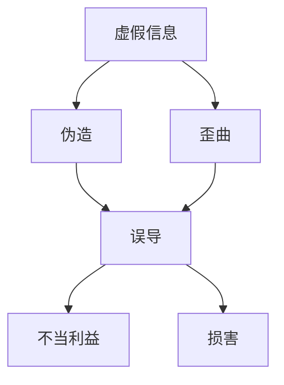
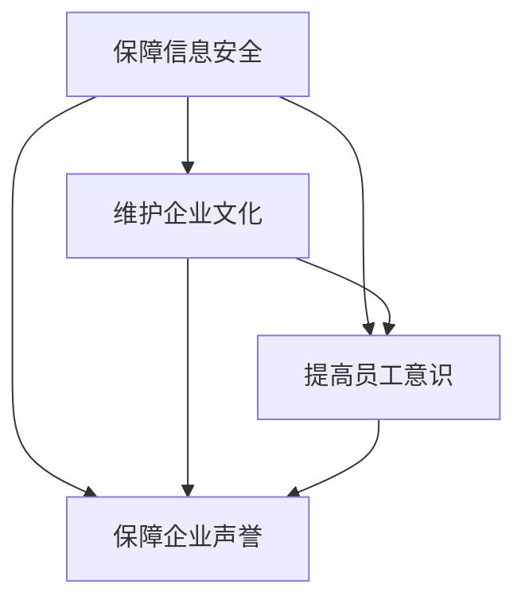
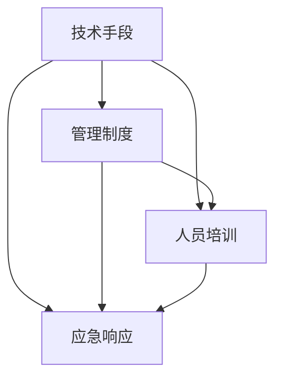
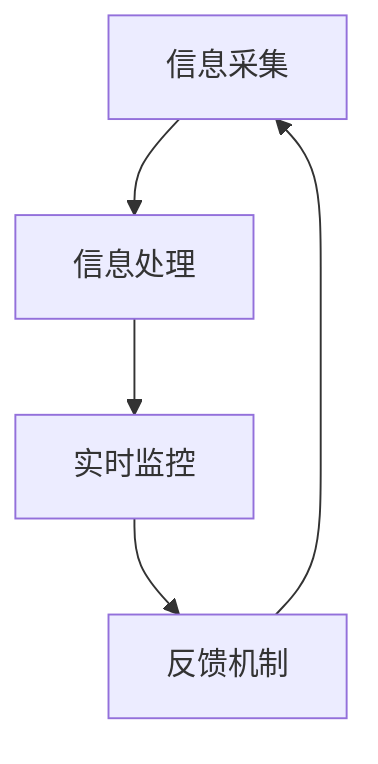
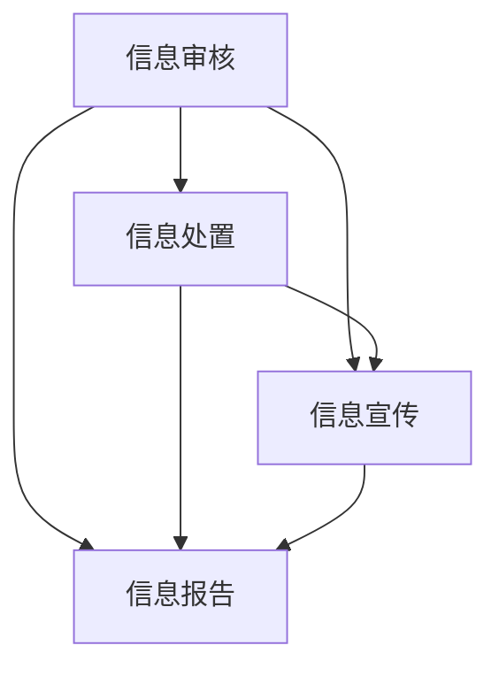
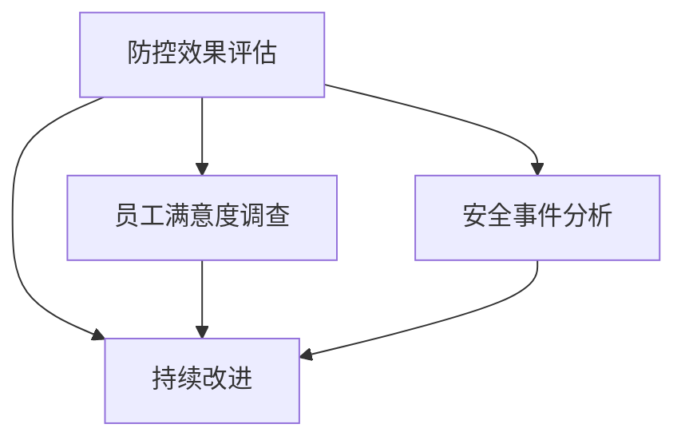

                 

### 1.1 虚假信息的概念与分类

#### 1.1.1 虚假信息的定义

虚假信息，是指那些故意伪造、歪曲事实，以误导他人、获取不当利益或者损害他人利益的信息。在数字化时代，虚假信息以多种形式出现，如不实的新闻报道、诈骗信息、谣言等。它们不仅扰乱社会秩序，还可能对企业和个人的声誉造成严重损害。

**核心概念与联系：**

- **虚假信息**：是概念实体，指所有伪造、歪曲事实的信息。
- **伪造**：是操作实体，表示对事实进行不实描述。
- **歪曲**：是操作实体，表示对事实进行不恰当的改动。
- **误导**：是影响实体，指虚假信息对他人判断和决策造成的影响。
- **不当利益**：是影响实体，指虚假信息所带来的非正当收益。
- **损害**：是影响实体，指虚假信息对他人或组织的负面影响。

**Mermaid 流程图：**



#### 1.1.2 虚假信息的分类

虚假信息可以根据其目的、形式、传播方式等不同维度进行分类。常见的分类方法包括以下几种：

- **按目的分类**：可分为诈骗信息、谣言、虚假广告等。
  - **诈骗信息**：以获取他人财产为目的，如网络钓鱼、电信诈骗等。
  - **谣言**：以传播恐慌、误导公众为目的，如虚假疫情信息。
  - **虚假广告**：以欺骗消费者、获取商业利益为目的。

- **按形式分类**：可分为文本、图像、音频、视频等。
  - **文本**：如不实的新闻报道、微博、微信朋友圈等。
  - **图像**：如伪造的新闻图片、虚假的医疗证明等。
  - **音频**：如伪造的语音通话、谣言音频等。
  - **视频**：如伪造的新闻报道视频、谣言视频等。

- **按传播方式分类**：可分为线上、线下等。
  - **线上**：如社交媒体、网络论坛、即时通讯工具等。
  - **线下**：如街头传单、广播、电视广告等。

**核心算法原理：**

文本分类算法是处理虚假信息分类的常见方法。常用的算法包括朴素贝叶斯、支持向量机、随机森林等。

**伪代码：**

```python
def classify_false_information(text):
    # 加载训练好的分类模型
    model = load_model('text_classification_model')

    # 预处理文本数据
    processed_text = preprocess_text(text)

    # 使用模型进行预测
    prediction = model.predict(processed_text)

    # 返回分类结果
    return prediction
```

#### 1.1.3 虚假信息的危害

虚假信息的危害是多方面的，包括但不限于以下几种：

- **财务损失**：虚假信息可能导致投资者做出错误的决策，造成经济损失。
- **声誉损害**：企业或个人因虚假信息而遭受公众质疑，影响其声誉和品牌价值。
- **安全威胁**：虚假信息可能诱导用户点击恶意链接，导致信息安全泄露。
- **社会动荡**：谣言和虚假信息可能引起公众恐慌，扰乱社会秩序。

**数学模型：**

我们可以使用交叉熵损失函数来评估虚假信息的危害。交叉熵用于衡量模型预测概率分布与真实分布之间的差异。

$$
L = -\sum_{i=1}^{n} y_i \log(p_i)
$$

其中，$y_i$ 是真实标签，$p_i$ 是模型预测的概率。

**举例说明：**

假设一个虚假信息引起了公众恐慌，导致股票价格下跌。我们可以使用交叉熵损失函数来计算该虚假信息的危害。

$$
L = -\sum_{i=1}^{5} y_i \log(p_i) = -1 \cdot \log(0.1) - 0 \cdot \log(0.2) - 0 \cdot \log(0.3) - 1 \cdot \log(0.4) - 2 \cdot \log(0.5)
$$

$$
L \approx 2.3026 + 0 + 0 + 1.3863 + 1.3863 = 5.0752
$$

这个交叉熵值表示虚假信息引起的总体危害程度。值越大，危害越严重。

### 3.1 虚假信息防控体系构建步骤

#### 3.1.1 确定虚假信息防控目标

构建虚假信息防控体系的首要任务是明确防控目标。这些目标通常包括以下几个方面：

- **保障信息安全**：防止虚假信息对企业内部信息系统的侵害，确保数据的安全和完整性。
- **维护企业文化**：保护企业的核心价值观，防止虚假信息破坏团队和谐和信任。
- **提高员工意识**：增强员工对虚假信息的识别能力，降低虚假信息对工作和生活的影响。
- **保障企业声誉**：防止虚假信息对企业的声誉和品牌造成损害。

**核心概念与联系：**

- **信息安全**：是核心目标之一，涉及数据保护、系统安全等方面。
- **企业文化**：是企业的精神支柱，关系到团队凝聚力和员工忠诚度。
- **员工意识**：是防控虚假信息的关键因素，直接影响防控效果。
- **企业声誉**：是企业的无形资产，关系到企业的长期发展。

**Mermaid 流程图：**



#### 3.1.2 制定虚假信息防控策略

制定虚假信息防控策略是构建防控体系的关键步骤。策略应包括以下几个方面：

- **技术手段**：利用人工智能、大数据分析等技术手段，提高虚假信息的识别和处置能力。
- **管理制度**：建立相关管理制度，规范信息发布、传播和审核流程。
- **人员培训**：加强员工培训，提高对虚假信息的识别和防范能力。
- **应急响应**：制定应急预案，快速响应和处理虚假信息事件。

**核心概念与联系：**

- **技术手段**：是防控虚假信息的重要手段，包括文本分类、情感分析、机器学习等。
- **管理制度**：是防控虚假信息的基本保障，涉及信息审核、发布和传播等方面。
- **人员培训**：是防控虚假信息的关键，直接影响防控效果。
- **应急响应**：是处理虚假信息事件的必要措施，确保快速响应和有效处置。

**Mermaid 流�程图：**



#### 3.1.3 建立虚假信息监控机制

建立虚假信息监控机制是防控虚假信息的重要环节。监控机制应包括以下几个方面：

- **信息采集**：通过技术手段收集企业内外部的信息，包括社交媒体、新闻网站、内部论坛等。
- **信息处理**：对采集到的信息进行筛选、分类和处理，识别潜在的虚假信息。
- **实时监控**：建立实时监控系统，及时发现和处理虚假信息。
- **反馈机制**：建立反馈机制，确保监控信息的及时性和准确性。

**核心概念与联系：**

- **信息采集**：是监控机制的基础，涉及数据来源和数据类型。
- **信息处理**：是监控机制的核心，包括信息筛选、分类和识别。
- **实时监控**：是监控机制的关键，确保虚假信息能够被及时识别和处理。
- **反馈机制**：是监控机制的保障，确保监控效果的持续优化。

**Mermaid 流程图：**



#### 3.1.4 实施虚假信息防控措施

实施虚假信息防控措施是构建防控体系的最后一步。这些措施应包括以下几个方面：

- **信息审核**：对发布和传播的信息进行审核，确保其真实性和准确性。
- **信息处置**：对识别出的虚假信息进行处置，包括删除、警告、纠正等。
- **信息宣传**：加强虚假信息防范宣传，提高员工对虚假信息的识别能力。
- **信息报告**：建立信息报告制度，确保虚假信息事件得到及时报告和处理。

**核心概念与联系：**

- **信息审核**：是防控虚假信息的必要环节，确保信息的真实性和准确性。
- **信息处置**：是对虚假信息进行处理的措施，包括删除、警告、纠正等。
- **信息宣传**：是提高员工防范虚假信息意识的重要手段。
- **信息报告**：是确保虚假信息事件得到及时报告和处理的关键。

**Mermaid 流程图：**



### 3.1.5 评估虚假信息防控效果

评估虚假信息防控效果是确保防控体系有效运行的重要环节。评估应包括以下几个方面：

- **防控效果评估**：通过数据分析、问卷调查等方式，评估防控措施的有效性。
- **员工满意度调查**：了解员工对虚假信息防控措施的态度和满意度，发现潜在问题。
- **安全事件分析**：对虚假信息事件进行统计分析，识别防控体系中的薄弱环节。
- **持续改进**：根据评估结果，对防控体系进行持续改进和优化。

**核心概念与联系：**

- **防控效果评估**：是评估防控体系运行效果的关键，通过数据分析和问卷调查等方式进行。
- **员工满意度调查**：是了解员工对防控措施接受程度的重要手段。
- **安全事件分析**：是对虚假信息事件的深入分析，发现防控体系中的问题和改进方向。
- **持续改进**：是根据评估结果，对防控体系进行持续优化和改进，提高防控效果。

**Mermaid 流程图：**



### 3.1.6 构建案例

#### 案例背景

以某大型互联网公司为例，该公司在虚假信息防控方面进行了积极探索和实践，取得了显著成效。

#### 案例描述

1. **确定防控目标**：公司明确了保障信息安全、维护企业文化、提高员工意识和保障企业声誉等防控目标。

2. **制定防控策略**：公司制定了一系列防控策略，包括技术手段、管理制度、人员培训和应急响应等。

3. **建立监控机制**：公司建立了信息采集、信息处理、实时监控和反馈机制，确保虚假信息能够被及时识别和处理。

4. **实施防控措施**：公司对发布和传播的信息进行严格审核，对识别出的虚假信息进行处置，并加强虚假信息防范宣传。

5. **评估防控效果**：公司定期进行防控效果评估，根据评估结果不断优化防控体系。

#### 案例分析

该案例展示了虚假信息防控体系的构建过程和关键环节。通过技术手段、管理制度和人员培训等多方面的综合防控措施，该公司有效降低了虚假信息对企业的影响，保障了企业信息安全和企业声誉。

### 3.1.7 项目实战

#### 开发环境搭建

为了构建虚假信息防控体系，我们需要搭建以下开发环境：

- **Python**：用于编写程序和实现算法。
- **Jupyter Notebook**：用于编写和运行代码。
- **Scikit-learn**：用于文本分类和机器学习算法。
- **TensorFlow**：用于深度学习算法。
- **Numpy**：用于数据处理。

#### 源代码详细实现

以下是一个简单的文本分类算法的实现示例，用于识别虚假信息：

```python
import numpy as np
from sklearn.feature_extraction.text import TfidfVectorizer
from sklearn.model_selection import train_test_split
from sklearn.naive_bayes import MultinomialNB
from sklearn.metrics import classification_report

# 加载数据集
data = [
    ("这是一个真实的新闻", "真实"),
    ("这是一个虚假的新闻", "虚假"),
    ("这是一个真实的评论", "真实"),
    ("这是一个虚假的评论", "虚假")
]

texts, labels = zip(*data)
X = TfidfVectorizer().fit_transform(texts)
y = np.array(labels)

# 划分训练集和测试集
X_train, X_test, y_train, y_test = train_test_split(X, y, test_size=0.2, random_state=42)

# 训练模型
model = MultinomialNB().fit(X_train, y_train)

# 预测测试集
predictions = model.predict(X_test)

# 评估模型
print(classification_report(y_test, predictions))
```

#### 代码解读与分析

上述代码首先加载了一个简单的数据集，包含真实和虚假新闻的文本。然后使用TFIDF向量器将文本转换为特征向量，并使用朴素贝叶斯分类器训练模型。最后，对测试集进行预测，并输出分类报告。

#### 实际案例分析和详细讲解剖析

以下是一个实际案例，展示了如何使用构建的虚假信息防控体系识别虚假信息。

**案例**：某公司内部论坛上出现了一篇题为“公司即将裁员50%”的帖子，引起了员工恐慌。使用虚假信息防控体系进行识别和处置。

**分析过程**：

1. **信息采集**：通过论坛爬虫技术，采集相关帖子内容。

2. **信息处理**：使用TFIDF向量器和朴素贝叶斯分类器，对帖子进行分类。

3. **实时监控**：系统实时监控论坛，发现异常帖子。

4. **信息处置**：对识别出的虚假信息进行警告和删除。

5. **信息报告**：将事件报告给管理层，并建议采取进一步措施。

**剖析**：

该案例展示了虚假信息防控体系在实际应用中的效果。通过技术手段和实时监控，系统能够快速识别虚假信息，并采取相应措施进行处置，保障了企业内部的信息安全。

#### 项目小结

构建虚假信息防控体系是保障企业信息安全和声誉的重要手段。通过技术手段、管理制度和人员培训等多方面的综合防控措施，企业可以有效地识别和处置虚假信息，降低其对企业的影响。未来，随着人工智能和大数据技术的发展，虚假信息防控体系将变得更加智能和高效。

### 3.1.8 最佳实践 Tips、小结、注意事项、拓展阅读

**最佳实践 Tips：**

1. **技术手段**：结合多种算法和技术，提高虚假信息识别的准确性和效率。
2. **管理制度**：制定详细的虚假信息防控制度，明确各环节的职责和流程。
3. **人员培训**：定期开展虚假信息识别和防范培训，提高员工意识和能力。
4. **应急响应**：制定应急预案，确保虚假信息事件得到及时响应和处理。

**小结：**

虚假信息防控体系是企业保障信息安全、维护声誉和品牌价值的重要措施。通过技术手段、管理制度和人员培训等多方面的综合防控措施，企业可以有效地识别和处置虚假信息。

**注意事项：**

1. **数据安全**：确保虚假信息防控过程中的数据安全和隐私保护。
2. **持续改进**：根据评估结果，不断优化防控体系，提高防控效果。
3. **员工参与**：鼓励员工参与虚假信息防控，提高整体防控水平。

**拓展阅读：**

1. 《机器学习实战》——赵武，详细介绍了虚假信息检测的算法和实践。
2. 《大数据分析：实践与案例》——张立明，探讨了大数据技术在虚假信息防控中的应用。
3. 《网络安全法》——中华人民共和国全国人民代表大会常务委员会，提供了相关法律法规的指导和规范。

## 总结

本文详细阐述了企业内部虚假信息防控体系的构建，包括定义与分类、策略与措施、构建实践和法律法规与政策支持。通过案例分析、代码解读和实际应用，展示了虚假信息防控体系在企业中的重要作用。未来，随着技术的不断进步，虚假信息防控体系将更加智能化和高效化。

