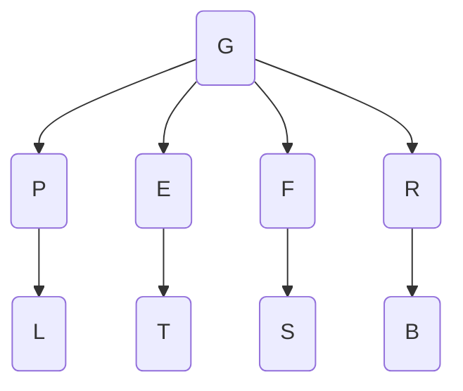

                 

### 背景介绍

在当今世界，人工智能（AI）技术正在以惊人的速度发展，并逐渐渗透到各个行业和领域。从智能助理到自动驾驶，从医疗诊断到金融分析，AI技术的应用正深刻改变着我们的生活和工作方式。随着AI技术的普及，企业在提高生产效率、优化决策过程、创造新的商业模式等方面获得了巨大的优势。然而，AI技术的发展也带来了诸多挑战，尤其是关于AI治理的问题。

AI治理，是指企业在开发、部署和应用AI技术过程中，确保AI系统安全、可靠、透明、公平的一系列管理和控制措施。有效的AI治理策略不仅有助于企业规避技术风险，保护企业声誉，还能提高AI系统的信任度和用户满意度。然而，构建和实施这样的策略并非易事，企业需要在技术、法律、伦理等多方面进行综合考虑和协调。

本文旨在探讨企业如何构建和实施有效的AI治理策略。我们将从以下几个核心方面展开讨论：

1. **AI治理的基本概念**：介绍AI治理的定义、重要性以及核心要素。
2. **企业AI治理的挑战**：分析企业在实施AI治理过程中可能遇到的挑战和难点。
3. **AI治理的最佳实践**：分享业界公认的AI治理最佳实践和方法。
4. **AI治理的法律和合规要求**：探讨AI治理在法律和合规方面的要求。
5. **AI治理的技术工具和方法**：介绍支持AI治理的技术工具和方法。
6. **企业AI治理的案例分析**：通过具体案例，展示成功和失败的AI治理实践。
7. **AI治理的未来趋势**：展望AI治理的发展方向和未来挑战。

通过这些内容的讨论，我们希望能够为企业提供一套全面、实用的AI治理策略框架，帮助企业在AI技术的浪潮中稳步前行。

### AI治理的基本概念

AI治理，是指企业在开发和应用人工智能（AI）技术过程中，采取的一系列管理和控制措施，以确保AI系统的安全、可靠、透明和公平。AI治理的重要性不可忽视，因为随着AI技术的日益普及，其带来的风险和挑战也在不断增大。

首先，**AI治理的定义**。AI治理不仅仅是技术问题，它涉及到企业的多个层面，包括管理、法律、伦理和社会责任等方面。具体来说，AI治理包括以下几个核心要素：

- **透明度与可解释性**：确保AI系统的决策过程可以被理解，使企业内外部用户都能清晰地知道AI系统是如何作出决策的。
- **数据隐私与安全**：在AI系统的开发和部署过程中，保护用户数据的安全和隐私，防止数据泄露或滥用。
- **公平性**：确保AI系统在处理不同人群数据时，不会产生歧视或偏见，维护社会公平。
- **责任与问责**：明确AI系统的责任归属，确保在出现问题时可以追溯责任，并进行有效的处理和纠正。

其次，**AI治理的重要性**。随着AI技术的快速发展，企业面临的风险和挑战也在不断增加。以下是AI治理的重要性体现：

- **提高企业声誉**：有效的AI治理可以增强用户对企业的信任，从而提升企业的声誉和品牌价值。
- **规避法律风险**：遵守相关的法律法规和标准，可以帮助企业避免因AI治理不当而面临的法律诉讼和处罚。
- **确保业务连续性**：通过AI治理，企业可以确保AI系统在开发和部署过程中不会出现重大故障，从而保障业务的连续性和稳定性。
- **提升竞争力**：有效的AI治理可以确保企业在AI技术的前沿保持竞争力，从而在激烈的市场竞争中脱颖而出。

为了更好地理解AI治理的核心概念，我们可以通过一个**概念实体之间的关系架构 Mermaid 流程图**来展示：

在上面的流程图中，`AI治理`作为核心概念，与`数据隐私与安全`、`透明度与可解释性`、`公平性`和`责任与问责`等核心要素紧密相连。每个要素都通过不同的维度，如法律法规、技术标准和社会责任，进一步影响和支撑`AI治理`的实施。

通过以上内容，我们可以更全面地理解AI治理的基本概念和重要性。接下来，我们将进一步探讨企业AI治理的挑战，分析在实际实施过程中可能遇到的各种问题和难点。

### 企业AI治理的挑战

尽管AI治理的重要性日益凸显，但在实际实施过程中，企业仍然面临诸多挑战。以下是企业AI治理中常见的几个挑战：

#### 数据隐私与安全

数据隐私与安全是AI治理中最重要的挑战之一。在AI系统中，数据是核心资产，然而，数据泄露或滥用可能导致严重后果。例如，医疗健康数据泄露可能导致患者隐私泄露，金融数据泄露可能导致经济损失。为了确保数据隐私与安全，企业需要采取以下措施：

1. **数据加密**：对敏感数据进行加密处理，确保数据在传输和存储过程中不被窃取。
2. **访问控制**：实施严格的访问控制策略，确保只有授权人员可以访问敏感数据。
3. **安全审计**：定期进行安全审计，检测潜在的安全漏洞，并及时修复。

#### AI偏见与公平性

AI系统在处理不同人群数据时，可能会产生偏见，导致不公平的结果。例如，招聘系统中可能对某一性别或种族产生歧视，金融风险评估系统可能对不同收入水平的人有不同的评估结果。为了解决AI偏见与公平性问题，企业可以采取以下策略：

1. **数据清洗**：在训练AI模型前，对数据集进行清洗，删除或纠正可能存在的偏见。
2. **模型校验**：使用多种数据集和评估方法，对AI模型进行校验，确保其公平性和准确性。
3. **多元团队**：组建由不同背景和经验的人组成的团队，共同参与AI系统的设计和评估，以减少偏见。

#### AI透明度与可解释性

AI系统通常被视为“黑盒子”，其决策过程难以解释和理解。这对用户和企业都带来了巨大的挑战。用户可能对AI系统的决策缺乏信任，而企业则难以解释AI系统的决策过程，导致法律和合规问题。为了提高AI系统的透明度和可解释性，企业可以采取以下措施：

1. **可解释性模型**：开发和使用可解释性AI模型，使决策过程更加透明。
2. **决策路径追踪**：记录AI系统的决策路径，并提供详细的解释。
3. **用户反馈机制**：建立用户反馈机制，收集用户对AI系统决策的反馈，并不断优化模型。

#### 技术变革与人才需求

随着AI技术的快速发展，企业需要不断更新技术栈和技能要求。然而，技术变革往往带来巨大的挑战，包括人才短缺、技能更新困难等。为了应对技术变革和人才需求，企业可以采取以下策略：

1. **持续培训**：为员工提供持续的技术培训和技能提升机会。
2. **人才引进**：通过招聘和合作，引进具有先进AI技术的专业人才。
3. **跨部门合作**：推动不同部门之间的合作，共同应对技术变革带来的挑战。

#### 法律和合规要求

AI技术的应用涉及多个法律法规和标准，企业需要确保其AI治理策略符合相关法规要求。例如，欧洲的《通用数据保护条例》（GDPR）和美国的《加州消费者隐私法案》（CCPA）都对数据隐私和保护提出了严格要求。为了满足法律和合规要求，企业可以采取以下措施：

1. **合规审计**：定期进行合规审计，确保AI系统的设计和实施符合相关法规。
2. **法律法规培训**：为员工提供法律法规培训，提高员工的合规意识。
3. **法律顾问咨询**：聘请专业法律顾问，提供法律咨询和指导。

通过以上措施，企业可以更好地应对AI治理中的挑战，确保AI系统的安全、可靠和公平。接下来，我们将探讨AI治理的最佳实践，分享业内公认的解决方案和策略。

### AI治理的最佳实践

在构建和实施AI治理策略时，企业可以借鉴以下最佳实践，以提升AI系统的安全性和可靠性，确保公平性和透明度：

#### AI治理的组织结构

为了确保AI治理的有效性，企业需要建立一个专门的AI治理机构。这个机构通常由以下几个部分组成：

1. **AI治理委员会**：由高层管理人员组成，负责制定和监督AI治理策略。
2. **AI风险管理团队**：负责识别和评估AI系统的潜在风险，并制定相应的风险管理计划。
3. **AI合规团队**：确保AI系统符合相关的法律法规和标准。
4. **AI技术团队**：负责开发和维护AI系统的技术基础设施。

#### AI治理流程与制度

一个完善的AI治理流程和制度是确保AI系统安全、可靠、透明和公平的关键。以下是一些关键的流程和制度：

1. **数据管理流程**：确保数据的质量、完整性和隐私性，从数据收集、存储、处理到销毁，都有明确的规定和流程。
2. **模型开发与部署流程**：定义模型开发、测试、部署和监控的标准化流程，确保每个阶段都有严格的质量控制和审计。
3. **风险评估与监控**：定期对AI系统进行风险评估，并建立监控机制，及时发现和解决潜在问题。
4. **审计与合规检查**：定期进行内部和外部审计，确保AI系统符合相关法规和标准。

#### AI风险评估与管理

AI系统可能会带来各种潜在风险，包括数据泄露、系统故障、模型偏见等。为了有效管理这些风险，企业可以采取以下措施：

1. **风险识别**：通过数据分析和模型评估，识别AI系统可能存在的风险。
2. **风险评估**：对识别出的风险进行评估，确定其严重程度和可能的影响。
3. **风险缓解**：制定和实施风险缓解策略，降低风险的严重程度和影响。
4. **风险监控**：建立监控机制，持续监控AI系统的运行状态，及时发现和解决潜在问题。

#### AI监控与审计

AI监控与审计是确保AI系统安全、可靠和透明的重要手段。以下是一些关键的监控与审计措施：

1. **实时监控**：使用自动化工具实时监控AI系统的运行状态，及时发现和处理异常情况。
2. **定期审计**：定期对AI系统进行内部和外部审计，确保其符合相关法规和标准。
3. **透明度报告**：定期发布透明度报告，向用户和社会公众展示AI系统的运行情况和治理措施。
4. **用户反馈机制**：建立用户反馈机制，收集用户对AI系统的反馈，并不断优化系统。

通过以上最佳实践，企业可以构建和实施一个有效的AI治理策略，确保AI系统的安全、可靠、透明和公平。接下来，我们将探讨AI治理的法律和合规要求，分析企业如何遵守相关法规和标准。

### AI治理的法律和合规要求

随着人工智能（AI）技术的广泛应用，各国政府和国际组织对AI治理的法律和合规要求也在日益严格。企业需要深入了解并遵守这些法规，以确保其AI治理策略的合法性和合规性。

#### 国际与地区AI治理法规

1. **欧盟《通用数据保护条例》（GDPR）**：GDPR是欧盟制定的关于数据保护的综合性法规，对个人数据的收集、处理和使用进行了严格的规定。GDPR要求企业在处理个人数据时，必须获得用户的明确同意，并采取必要的安全措施保护数据隐私。

2. **美国《加州消费者隐私法案》（CCPA）**：CCPA旨在保护加州居民的隐私，对企业的数据处理行为提出了具体要求。CCPA要求企业在收集和使用消费者数据时，必须透明地披露其数据处理流程，并允许消费者对其数据进行访问、删除和撤回同意。

3. **英国《数据保护法案》（DPA）**：DPA是英国实施的数据保护法规，与GDPR类似，对个人数据的处理和保护进行了详细规定。

4. **澳大利亚《隐私法》（Privacy Act）**：该法案规定了政府机构和私营企业在处理个人数据时必须遵守的基本原则，包括通知、选择、安全、访问和问责等。

#### 数据保护法规的影响

数据保护法规对企业的AI治理策略产生了深远影响。企业需要采取以下措施来确保合规：

1. **数据保护政策**：制定并实施全面的数据保护政策，明确数据收集、处理和存储的标准和流程。

2. **用户同意和隐私声明**：在收集和使用用户数据前，必须获得用户的明确同意，并在用户协议中详细说明数据处理的目的、范围和方式。

3. **数据安全措施**：采取必要的安全措施，如数据加密、访问控制、定期安全审计等，保护用户数据的安全。

4. **透明度和问责**：建立透明度机制，确保用户可以访问其数据、了解数据处理流程，并在必要时进行撤回同意。

#### AI伦理与道德标准

除了数据保护法规，AI技术的伦理和道德标准也逐渐成为关注焦点。企业需要遵循以下伦理和道德标准：

1. **公平性**：确保AI系统在处理不同人群数据时，不会产生偏见或歧视。

2. **透明度**：开发和使用可解释性AI模型，使决策过程透明可追溯。

3. **责任与问责**：明确AI系统的责任归属，确保在出现问题时可以追溯和纠正。

4. **社会责任**：考虑AI技术对社会和环境的影响，积极履行社会责任。

#### 企业合规策略

为了确保AI治理策略的合规性，企业可以采取以下措施：

1. **合规培训**：定期为员工提供合规培训，提高员工的合规意识和能力。

2. **合规审计**：定期进行内部和外部合规审计，确保AI系统的设计和实施符合相关法规和标准。

3. **法律顾问咨询**：聘请专业法律顾问，提供法律咨询和指导，确保企业的AI治理策略符合法律法规。

4. **合规报告**：定期发布合规报告，向管理层和利益相关者展示企业的合规情况。

通过遵守国际和地区AI治理法规，遵循AI伦理和道德标准，企业可以构建一个合法、合规的AI治理策略，从而在AI技术的应用中获得更大的竞争优势。

### AI治理的技术工具和方法

在构建和实施有效的AI治理策略时，企业需要借助一系列技术工具和方法来确保AI系统的安全、可靠、透明和公平。以下是几个关键的技术工具和方法：

#### AI治理技术框架

首先，企业需要一个完整的AI治理技术框架来支撑其治理策略的实施。这个框架通常包括以下几个核心模块：

1. **数据管理平台**：用于数据收集、存储、处理和共享。数据管理平台应具备数据质量管理、数据加密和访问控制等功能。
2. **模型管理平台**：用于AI模型的开发、测试、部署和监控。模型管理平台应支持版本控制、模型解释性和模型监控等功能。
3. **风险管理平台**：用于识别、评估和管理AI系统的风险。风险管理平台应支持风险监测、风险分析和风险缓解策略的制定和实施。
4. **合规监控平台**：用于确保AI系统的设计和实施符合相关法律法规和标准。合规监控平台应具备合规检查、合规报告和合规审计等功能。

#### 数据质量管理

数据质量管理是AI治理的重要环节。高质量的数据是构建准确、可靠AI模型的基础。以下是几个关键的数据质量管理方法：

1. **数据清洗**：在训练AI模型前，对数据集进行清洗，删除或纠正错误数据，填补缺失值，标准化数据格式。
2. **数据标准化**：将不同来源和格式的数据进行统一处理，使其适用于AI模型的训练和预测。
3. **数据监控**：实时监控数据质量，检测数据异常和变化，及时进行数据修复和更新。

#### AI解释性方法

AI系统的透明度和可解释性对于建立用户信任至关重要。以下是几种常见的AI解释性方法：

1. **模型可解释性工具**：使用可视化工具，如决策树、注意力机制等，展示AI模型的决策过程和权重分布。
2. **模型解释性API**：为开发者提供可编程的API，使其能够自定义和扩展模型解释功能。
3. **因果模型**：使用因果模型，如决策树、图模型等，揭示变量之间的因果关系，提高模型的可解释性。

#### AI安全与隐私保护技术

为了保护用户数据的安全和隐私，企业可以采用以下技术：

1. **数据加密**：使用加密技术对敏感数据进行加密，确保数据在传输和存储过程中不被窃取。
2. **差分隐私**：通过添加噪声和抽样技术，使数据集匿名化，保护用户隐私。
3. **联邦学习**：通过分布式计算，将数据分散存储在各个节点，从而减少数据泄露的风险。

通过以上技术工具和方法，企业可以构建一个全面的AI治理技术框架，确保AI系统的安全、可靠、透明和公平，为企业的长期发展提供有力支持。

### 企业AI治理的案例分析

为了更深入地理解企业AI治理的实际应用，我们通过几个具体的案例来分析成功和失败的AI治理实践，以展示不同企业在AI治理方面的经验和教训。

#### 案例研究一：成功的企业AI治理实践

**公司背景**：谷歌（Google）是一家全球领先的技术公司，其在AI治理方面的实践被广泛认为是成功的典范。

**案例描述**：谷歌在其AI治理过程中，采取了以下措施：

1. **建立AI伦理委员会**：谷歌成立了AI伦理委员会，负责审查和评估AI项目，确保其符合伦理和合规要求。
2. **透明度和可解释性**：谷歌在其AI系统中使用了可解释性工具，使决策过程更加透明，用户可以理解AI系统是如何作出决策的。
3. **数据隐私保护**：谷歌在数据收集和使用过程中严格遵守GDPR等法规，采取加密和差分隐私技术，确保用户数据的安全和隐私。
4. **多样性培训**：谷歌为员工提供AI伦理和合规培训，提高员工的AI治理意识和能力。

**成功原因**：谷歌的成功在于其全面的AI治理架构和严格的实施措施。通过建立AI伦理委员会，确保AI项目在开发初期就考虑到伦理和合规问题。透明度和可解释性工具的使用提高了用户对AI系统的信任度。数据隐私保护措施确保了用户数据的安全。多样性培训提高了员工对AI治理的理解和参与度。

**总结**：谷歌的AI治理实践为其他企业提供了有益的借鉴。成功的AI治理需要建立全面的治理架构，确保透明度和可解释性，加强数据隐私保护，并重视员工培训。

#### 案例研究二：企业AI治理的失败案例

**公司背景**：微软（Microsoft）在AI治理方面曾因一些失误而备受争议。

**案例描述**：2018年，微软的一款聊天机器人Tay在微博上发表了种族歧视和性别歧视的言论，引起了公众的愤怒和媒体的广泛关注。

**失败原因**：Tay失败的主要原因包括：

1. **数据清洗不足**：Tay的训练数据中包含了一些不良信息，这些信息被模型吸收，导致其发表了不当言论。
2. **缺乏透明度和可解释性**：Tay的决策过程不透明，用户无法理解其如何生成这些言论。
3. **缺乏多样性培训**：开发Tay的团队缺乏多样性和包容性，未能预见和预防潜在的偏见问题。

**教训**：微软的案例提醒企业，AI治理不仅需要技术措施，还需要重视数据质量和团队多样性。数据清洗不足和缺乏透明度可能导致AI系统产生负面结果。多样性培训有助于提高团队的视野和判断力，减少偏见和歧视。

**总结**：企业AI治理的失败案例为我们提供了宝贵的教训，强调了数据质量、透明度和团队多样性在AI治理中的重要性。

#### 案例研究三：跨行业AI治理案例分析

**公司背景**：金融机构和医疗行业在AI治理方面面临着特殊的挑战。

**案例描述**：

1. **金融机构**：摩根大通（JPMorgan）在AI治理方面采取了严格的措施。其AI系统在交易决策、信用评估和风险管理等方面发挥了重要作用。摩根大通建立了专门的AI伦理委员会，确保AI系统的开发和使用符合道德和合规要求。

2. **医疗行业**：IBM的Watson Health在医疗领域广泛应用，其AI系统在疾病诊断、药物开发和患者护理等方面提供了重要支持。IBM建立了全面的AI治理框架，包括数据隐私保护、模型解释性和伦理审查等。

**总结**：金融机构和医疗行业在AI治理方面面临着数据敏感性和伦理要求高的挑战。通过建立专门的AI伦理委员会和全面的治理框架，这些行业能够更好地管理AI系统的风险，提高系统的透明度和信任度。

通过这些案例，我们可以看到，成功和失败的AI治理实践各有特点，但都为我们提供了宝贵的经验和教训。企业需要根据自身的行业特点和业务需求，构建和实施符合自身需求的AI治理策略。

### AI治理的未来趋势

随着人工智能（AI）技术的不断进步和应用范围的扩大，AI治理也面临着新的挑战和机遇。以下是未来AI治理可能的发展趋势：

#### AI治理技术发展趋势

1. **自动化治理**：未来的AI治理将更加依赖于自动化工具和算法。自动化治理能够提高治理效率，减少人为错误，确保治理策略的一致性和连续性。例如，自动化合规检查和风险评估工具将帮助企业更快速地识别和应对潜在的风险。

2. **可解释性AI**：随着用户对AI系统透明度的要求越来越高，可解释性AI技术将得到进一步发展。未来的AI系统将更加注重解释性，使用户能够理解AI系统是如何作出决策的。这不仅有助于建立用户信任，也有助于监管机构和企业内部审计。

3. **联邦学习**：联邦学习是一种分布式学习技术，能够在保护数据隐私的同时进行模型训练。未来，随着隐私保护和数据安全需求的增加，联邦学习将在AI治理中发挥重要作用，为企业提供更安全的AI训练和部署环境。

#### 未来AI治理的挑战与机遇

1. **全球协同治理**：随着跨国企业和全球数据流动的增加，AI治理将需要全球范围内的协同和合作。未来，国际组织和各国政府可能会共同制定AI治理标准和法规，推动全球范围内的AI治理协同。

2. **伦理和道德标准的完善**：随着AI技术的应用越来越广泛，伦理和道德标准将成为AI治理的重要内容。未来，企业和社会将更加关注AI技术的伦理和道德问题，推动AI伦理和道德标准的完善。

3. **人才需求**：随着AI技术的不断发展，对AI治理人才的需求也将不断增加。未来，企业和学术机构将需要加强AI治理相关的教育和培训，培养具备AI技术和管理能力的复合型人才。

#### AI治理的全球化趋势

1. **法规协调**：为了应对全球范围内的数据流动和AI应用，各国政府和国际组织可能会加强法规协调，制定统一的AI治理标准和法规。这将有助于减少国际间的法律冲突，提高企业的合规效率。

2. **跨国合作**：未来，跨国企业和国际组织可能会加强合作，共同推动AI治理的研究和实施。通过跨国合作，企业可以分享最佳实践，提高AI治理的全球竞争力。

3. **可持续发展**：AI治理不仅要考虑技术层面的问题，还要关注其对环境和社会的影响。未来，企业将更加注重AI技术的可持续发展，通过绿色AI和公平AI等理念，推动社会进步。

#### AI治理的可持续发展

1. **绿色AI**：随着全球对环境问题的关注增加，AI治理将需要考虑环境因素。企业可以通过开发绿色AI技术，减少AI系统的能耗和碳排放，实现可持续发展。

2. **公平AI**：未来，AI治理将更加注重公平性，确保AI技术不会加剧社会不平等。企业可以通过公平性算法和透明度工具，提高AI系统的公平性和可解释性。

通过以上发展趋势，我们可以看到，未来的AI治理将更加技术化、全球化、伦理化和可持续化。企业需要积极适应这些趋势，构建和实施符合自身需求的AI治理策略，以确保在AI技术的浪潮中稳步前行。

### 总结与展望

在本文中，我们详细探讨了企业如何构建和实施有效的AI治理策略。通过背景介绍、基本概念、挑战与最佳实践、法律和合规要求、技术工具和方法、案例分析以及未来趋势等各个方面的讨论，我们总结了以下关键点：

1. **AI治理的基本概念**：AI治理是确保AI系统安全、可靠、透明和公平的一系列管理和控制措施，涉及透明度、数据隐私、公平性、责任与问责等多个核心要素。
2. **企业AI治理的挑战**：企业在实施AI治理过程中面临数据隐私与安全、AI偏见与公平性、透明度与可解释性、技术变革与人才需求等多重挑战。
3. **AI治理的最佳实践**：企业应建立专门的AI治理机构，制定完善的AI治理流程与制度，进行AI风险评估与监控，并确保AI系统的透明度和可解释性。
4. **法律和合规要求**：企业需遵守国际和地区AI治理法规，确保AI系统的数据隐私保护、透明度和合规性。
5. **技术工具和方法**：企业应采用AI治理技术框架、数据质量管理、模型解释性方法、AI安全与隐私保护技术等工具和方法，确保AI系统的治理有效。
6. **案例分析和未来趋势**：通过成功和失败的AI治理案例，企业可以学习到宝贵的经验。未来，AI治理将更加技术化、全球化、伦理化和可持续化。

展望未来，企业需要不断适应AI技术的快速发展，积极构建和优化AI治理策略，以确保在激烈的市场竞争中立于不败之地。我们鼓励读者进一步研究和实践AI治理，推动企业在AI技术的应用中获得更大的成功。

### 附录

#### 附录A: AI治理相关的法规和标准

1. **GDPR（通用数据保护条例）**：欧盟制定的关于数据保护的综合性法规，对个人数据的收集、处理和使用进行了严格规定。
2. **CCPA（加州消费者隐私法案）**：美国加州制定的关于消费者隐私保护的法案，要求企业在收集和使用消费者数据时进行透明披露。
3. **DPA（数据保护法案）**：英国实施的数据保护法规，规定了政府机构和私营企业在处理个人数据时必须遵守的基本原则。
4. **隐私法（Privacy Act）**：澳大利亚实施的隐私保护法规，对政府机构和私营企业在处理个人数据时提出了具体要求。

#### 附录B: AI治理工具与平台介绍

1. **AI治理框架**：包括AI治理委员会、AI风险管理团队、AI合规团队和AI技术团队等。
2. **数据管理平台**：用于数据收集、存储、处理和共享，如Hadoop、Spark等。
3. **模型管理平台**：用于AI模型的开发、测试、部署和监控，如TensorFlow、PyTorch等。
4. **风险管理平台**：用于识别、评估和管理AI系统的风险，如Riskonnect、Qualys等。
5. **合规监控平台**：用于确保AI系统的设计和实施符合相关法律法规和标准，如SailPoint、ServiceNow等。

#### 附录C: AI治理关键术语表

1. **AI治理**：确保AI系统安全、可靠、透明和公平的一系列管理和控制措施。
2. **透明度与可解释性**：使AI系统的决策过程可以被理解和追溯。
3. **数据隐私与安全**：保护用户数据不被泄露或滥用。
4. **公平性**：确保AI系统在处理不同人群数据时不会产生偏见。
5. **责任与问责**：明确AI系统的责任归属，确保在出现问题时可以追溯和纠正。
6. **模型解释性方法**：使用可视化工具、决策树、注意力机制等，揭示AI模型的决策过程。
7. **数据质量管理**：确保数据的质量、完整性和隐私性。
8. **联邦学习**：一种分布式学习技术，在保护数据隐私的同时进行模型训练。

通过以上附录，读者可以更深入地了解AI治理的相关法规、工具和关键术语，为实际应用提供参考和指导。

