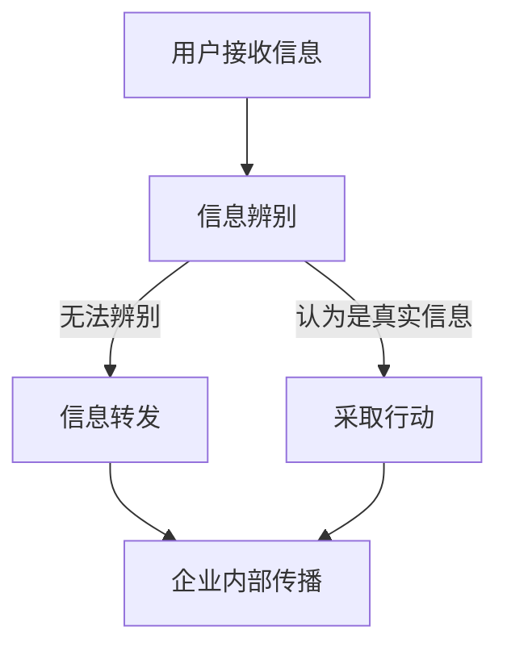
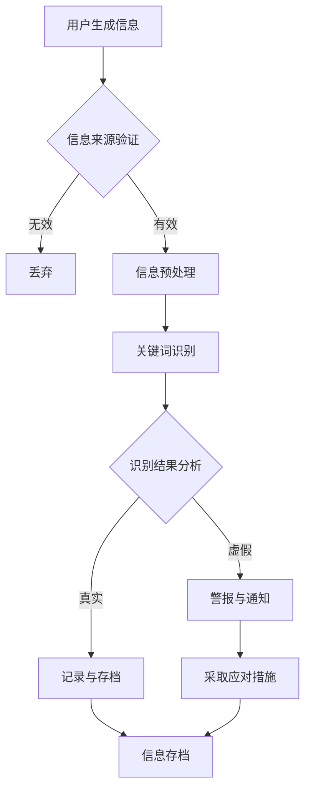

                 

### 虚假信息的概述与影响

#### 虚假信息的定义与分类

虚假信息，又称假新闻或谣言，指的是那些故意编造、虚构或误导的信息，其目的是欺骗、操纵或误导受众。根据虚假信息的内容和目的，可以将虚假信息分为以下几类：

1. **政治虚假信息**：这类虚假信息通常与政治选举、政策讨论或政治事件相关，旨在操纵公众观点、影响选举结果或破坏政治对手的形象。
2. **经济虚假信息**：这类虚假信息涉及金融诈骗、欺诈行为或误导性商业宣传，可能导致投资者受损或市场不稳定。
3. **社会虚假信息**：这类虚假信息可能涉及人身攻击、歧视言论、社会恐慌等，旨在引发社会混乱或偏见。
4. **科技虚假信息**：这类虚假信息可能涉及误导性科技新闻、虚假的科技产品评测或科技谣言，可能会误导公众对科技发展的认识。

#### 虚假信息对企业的影响

虚假信息对企业的负面影响是多方面的，具体体现在以下几方面：

1. **声誉损害**：虚假信息一旦传播，会对企业的声誉造成极大的损害，影响品牌形象和市场信任度。
2. **经济损失**：虚假信息可能导致投资者对企业的投资信心下降，股价下跌，甚至可能引发经济诈骗等经济损失。
3. **运营受阻**：虚假信息可能误导消费者，影响企业的销售和客户服务，进而导致运营受阻。
4. **法律风险**：企业可能因虚假信息而面临法律诉讼，尤其是在涉及误导性广告或欺诈行为时。

#### 虚假信息传播的特点与途径

虚假信息的传播具有以下几个特点：

1. **快速传播**：在互联网时代，虚假信息可以迅速传播到全球各地，速度之快超乎想象。
2. **广泛覆盖**：虚假信息往往能够吸引大量受众，尤其是在社交媒体平台上，它们可以迅速获得关注和转发。
3. **隐蔽性**：虚假信息通常伪装成真实信息，难以辨别真伪，使得受众容易被误导。
4. **不可控性**：一旦虚假信息传播，很难进行有效控制，甚至可能无法完全消除。

虚假信息的传播途径主要包括：

1. **社交媒体**：社交媒体平台是虚假信息传播的主要渠道，如Twitter、Facebook、微信等。
2. **网络论坛**：网络论坛和讨论区也是虚假信息传播的重要途径，例如Reddit、Discourse等。
3. **电子邮件**：通过电子邮件传播的虚假信息，通常以钓鱼邮件或诈骗邮件的形式出现。
4. **传统媒体**：虽然传统媒体（如电视、报纸、杂志）的传播速度较慢，但仍然有相当的影响力。

### 虚假信息的定义与分类

虚假信息，是指那些故意编造、虚构或误导的信息，其目的是欺骗、操纵或误导受众。根据虚假信息的内容和目的，可以将其分为以下几类：

1. **政治虚假信息**：这类虚假信息通常与政治选举、政策讨论或政治事件相关，旨在操纵公众观点、影响选举结果或破坏政治对手的形象。例如，在选举期间，某候选人可能会发布虚假的竞选广告，夸大其政绩或诋毁对手。

2. **经济虚假信息**：这类虚假信息涉及金融诈骗、欺诈行为或误导性商业宣传，可能导致投资者受损或市场不稳定。例如，某些公司可能会发布虚假的财务报表，以误导投资者，从而获得更多的资金。

3. **社会虚假信息**：这类虚假信息可能涉及人身攻击、歧视言论、社会恐慌等，旨在引发社会混乱或偏见。例如，一些社交媒体平台上可能会流传关于种族歧视或暴力的虚假视频，引发公众恐慌。

4. **科技虚假信息**：这类虚假信息可能涉及误导性科技新闻、虚假的科技产品评测或科技谣言，可能会误导公众对科技发展的认识。例如，某些媒体可能会报道未经证实的科技突破，从而误导公众。

#### 虚假信息对企业的影响

虚假信息对企业的负面影响是多方面的，具体体现在以下几方面：

1. **声誉损害**：虚假信息一旦传播，会对企业的声誉造成极大的损害，影响品牌形象和市场信任度。例如，某公司可能会被指控生产有毒食品，尽管这是虚假信息，但公众可能会因此对该公司产生负面印象。

2. **经济损失**：虚假信息可能导致投资者对企业的投资信心下降，股价下跌，甚至可能引发经济诈骗等经济损失。例如，某公司可能会被指控涉及财务造假，导致投资者撤资，公司股价暴跌。

3. **运营受阻**：虚假信息可能误导消费者，影响企业的销售和客户服务，进而导致运营受阻。例如，某产品可能会被指控存在安全隐患，导致消费者拒绝购买，公司销售量下降。

4. **法律风险**：企业可能因虚假信息而面临法律诉讼，尤其是在涉及误导性广告或欺诈行为时。例如，某公司可能会因发布虚假广告而被告上法庭，面临巨额赔偿。

#### 虚假信息传播的特点与途径

虚假信息的传播具有以下几个特点：

1. **快速传播**：在互联网时代，虚假信息可以迅速传播到全球各地，速度之快超乎想象。例如，一个虚假新闻可能在几分钟内被成千上万的用户转发。

2. **广泛覆盖**：虚假信息往往能够吸引大量受众，尤其是在社交媒体平台上，它们可以迅速获得关注和转发。例如，一个虚假的短视频可能在社交媒体上被数百万用户观看。

3. **隐蔽性**：虚假信息通常伪装成真实信息，难以辨别真伪，使得受众容易被误导。例如，一些虚假的新闻报道可能会使用真实的图片和视频，使其看起来更加真实可信。

4. **不可控性**：一旦虚假信息传播，很难进行有效控制，甚至可能无法完全消除。例如，一个虚假的谣言可能在社交媒体上反复传播，即使原始发布者删除了信息，但其他用户仍然可以转发和分享。

虚假信息的传播途径主要包括：

1. **社交媒体**：社交媒体平台是虚假信息传播的主要渠道，如Twitter、Facebook、微信等。这些平台具有高度的互动性和传播性，使得虚假信息可以迅速传播。

2. **网络论坛**：网络论坛和讨论区也是虚假信息传播的重要途径，例如Reddit、Discourse等。在这些平台上，用户可以自由发布和评论信息，使得虚假信息可以迅速传播。

3. **电子邮件**：通过电子邮件传播的虚假信息，通常以钓鱼邮件或诈骗邮件的形式出现。这些邮件可能会伪装成官方通知或重要信息，诱使用户点击恶意链接或提供个人信息。

4. **传统媒体**：虽然传统媒体（如电视、报纸、杂志）的传播速度较慢，但仍然有相当的影响力。一些虚假信息可能会通过传统媒体传播，影响更广泛的受众。

### Mermaid 流程图

以下是一个简化的Mermaid流程图，用于展示虚假信息在企业内部传播的基本流程：



- **用户接收信息**：用户通过社交媒体、网络论坛、电子邮件或传统媒体等途径接收信息。
- **信息辨别**：用户尝试辨别信息的真伪，但通常难以完全确定。
- **信息转发**：如果用户无法辨别信息真伪，可能会选择转发给其他用户。
- **认为是真实信息**：如果用户认为信息是真实的，可能会采取行动，如投资、购买产品或参与行动。
- **企业内部传播**：虚假信息在企业内部传播，可能影响员工的态度和行为。

### 核心概念与联系

在本章节中，核心概念包括虚假信息的定义、分类、影响和传播途径。这些概念之间存在密切的联系，共同构成了对企业应对虚假信息策略的理解。

1. **虚假信息的定义**：虚假信息是故意编造、虚构或误导的信息，其目的是欺骗、操纵或误导受众。这个定义是理解虚假信息的起点，明确了虚假信息的本质和目的。

2. **虚假信息的分类**：虚假信息根据内容和目的可以分为政治、经济、社会和科技四大类。这种分类有助于我们更深入地了解虚假信息的多样性和复杂性。

3. **虚假信息的影响**：虚假信息对企业的影响包括声誉损害、经济损失、运营受阻和法律风险等。这些影响是虚假信息对企业造成的直接后果，也是企业需要关注和应对的关键问题。

4. **虚假信息的传播途径**：虚假信息的传播途径包括社交媒体、网络论坛、电子邮件和传统媒体等。这些途径是虚假信息传播的主要渠道，也是企业需要监控和防范的重点。

这些核心概念之间的联系在于，它们共同构成了对企业应对虚假信息策略的基础。通过理解虚假信息的定义、分类、影响和传播途径，企业可以更有效地制定应对策略，减少虚假信息带来的负面影响。

### 核心算法原理讲解

#### 基于关键词的识别算法原理

在虚假信息识别中，基于关键词的方法是一种简单而有效的方式。这种方法通过分析文本中关键词的出现频率和分布情况，来判断文本的真实性。以下是基于关键词的识别算法的基本原理：

1. **关键词选择**：首先，需要选择一组关键词。这些关键词应该能够代表真实信息和虚假信息的不同特征。例如，对于政治虚假信息，可以选择与选举、政策、政治丑闻等相关的高频词汇。

2. **文本预处理**：在分析文本之前，通常需要进行文本预处理。预处理步骤包括去除停用词（如“的”、“了”等），将文本转换为小写，以及分词等。

3. **关键词计数**：对预处理后的文本进行关键词计数。具体步骤如下：
    - 遍历文本中的每个词，如果该词是关键词，则将其计数加一。
    - 计算每个关键词在文本中的出现次数。

4. **阈值设定**：设定一个阈值，用于判断文本是否可能是虚假信息。如果一个文本中的关键词计数超过了这个阈值，则认为该文本可能是虚假信息。

5. **结果判断**：根据关键词计数的结果，判断文本的真实性。如果关键词计数高于阈值，则认为文本可能是虚假信息；否则，认为文本是真实的。

#### Python 源代码实现

以下是一个简单的Python代码示例，用于实现基于关键词的虚假信息识别算法：

```python
import re

# 关键词列表
keywords = ['选举', '政策', '丑闻', '欺诈', '造假']

# 文本预处理函数
def preprocess_text(text):
    text = text.lower()  # 转换为小写
    text = re.sub(r'\W+', ' ', text)  # 去除非单词字符
    return text

# 关键词计数函数
def count_keywords(text, keywords):
    text = preprocess_text(text)
    keyword_count = {keyword: 0 for keyword in keywords}
    words = text.split()
    for word in words:
        if word in keyword_count:
            keyword_count[word] += 1
    return keyword_count

# 阈值设定函数
def set_threshold(keyword_count, threshold_percentage):
    total_count = sum(keyword_count.values())
    threshold = total_count * threshold_percentage
    return threshold

# 主函数
def is_fake_info(text, keywords, threshold_percentage=0.1):
    keyword_count = count_keywords(text, keywords)
    threshold = set_threshold(keyword_count, threshold_percentage)
    if sum(count for count in keyword_count.values() if count > threshold) > 0:
        return True
    else:
        return False

# 测试
text = "某公司因政策丑闻被指控欺诈和造假，导致股票暴跌。"
print(is_fake_info(text, keywords))
```

#### 数学模型和公式

基于关键词的识别算法中，核心的数学模型是关键词的出现频率。假设文本中每个关键词的出现次数为 $C_i$，文本中总的关键词个数为 $N$，则关键词 $i$ 的出现频率可以表示为：

$$
f_i = \frac{C_i}{N}
$$

阈值设定的公式为：

$$
T = \sum_{i=1}^{N} f_i \cdot p_i
$$

其中，$p_i$ 是关键词 $i$ 的权重，通常通过统计分析得到。

#### 举例说明

假设我们有以下文本：

"某公司在选举中因为丑闻被指控欺诈，导致股价暴跌。"

关键词列表为：['选举', '丑闻', '欺诈']

1. **文本预处理**：将文本转换为小写，去除非单词字符，得到："some company because election scandal accused of fraud，导致股价暴跌。"
2. **关键词计数**：'选举'出现1次，'丑闻'出现1次，'欺诈'出现1次。
3. **阈值设定**：假设阈值为文本总词频的10%，总词频为6，则阈值为0.6。
4. **结果判断**：'选举'、'丑闻'和'欺诈'的计数均高于阈值，因此文本被认为是虚假信息。

通过这个简单的例子，我们可以看到基于关键词的识别算法是如何运作的。尽管这种方法简单有效，但它也有一些局限性，例如无法处理语义层面的虚假信息。因此，在实际应用中，通常需要结合其他算法和技术来提高识别的准确性。

### 常用虚假信息检测工具介绍

在应对虚假信息的过程中，企业可以利用多种工具和资源来帮助识别和验证信息的真实性。以下是一些常用的虚假信息检测工具的介绍，包括其功能、使用方法和优缺点。

#### GossipCop

**功能**：GossipCop 是一个专门针对名人谣言和八卦新闻的在线验证工具。它通过收集和审查各种八卦来源，提供对这些谣言的验证和辟谣服务。

**使用方法**：
1. 访问 GossipCop 的官方网站。
2. 在搜索框中输入相关的谣言或名人的名字。
3. 浏览或搜索结果，查看谣言的来源和验证信息。

**优点**：
- **专业性强**：专注于名人八卦的验证，积累了丰富的数据资源。
- **更新及时**：定期更新谣言的验证结果，确保信息的准确性。

**缺点**：
- **覆盖范围有限**：主要针对名人八卦，不涉及其他类型的虚假信息。

#### Snopes

**功能**：Snopes 是一个历史悠久的虚假信息检测网站，提供对各种虚假新闻、谣言和都市传说的验证服务。它是一个全面的虚假信息资源库，涵盖多个领域。

**使用方法**：
1. 访问 Snopes 的官方网站。
2. 在搜索框中输入感兴趣的主题或关键词。
3. 查看搜索结果，阅读详细的验证报告。

**优点**：
- **权威性高**：拥有庞大的数据库和专业的验证团队。
- **覆盖广泛**：涉及多个领域的虚假信息。

**缺点**：
- **信息量庞大**：需要耐心筛选和查找具体信息。

#### FactCheck.org

**功能**：FactCheck.org 是一个非营利组织，专注于对政治宣传和新闻报告进行事实核查。它提供对政治虚假信息的详细分析和验证服务。

**使用方法**：
1. 访问 FactCheck.org 的官方网站。
2. 浏览或搜索特定的政治主题或事件。
3. 阅读验证报告和详细信息。

**优点**：
- **专业性突出**：专注于政治虚假信息的验证。
- **透明度高**：提供详细的数据来源和验证过程。

**缺点**：
- **更新频率较低**：可能无法及时覆盖最新的虚假信息。

#### Other Useful Tools

**FactCheck.eu**：这是一个欧盟成员国的事实核查网站，提供对欧洲范围内虚假信息的验证服务。

**PolitiFact**：一个专注于美国政治新闻的事实核查网站，由佛罗里达大学新闻学院运营。

**Full Fact**：一个英国非营利组织，提供对各种虚假信息的验证服务。

**优点**：
- **跨国合作**：这些工具通常与全球多个国家的组织合作，提供多语言支持。
- **多样化资源**：覆盖不同领域和地区的虚假信息。

**缺点**：
- **语言限制**：某些工具可能仅支持特定语言。
- **数据源限制**：部分工具的数据源可能有限，影响验证的全面性。

通过使用这些工具，企业可以更有效地识别和应对虚假信息，保护自身声誉和利益。然而，需要注意的是，任何工具都不是完美的，企业应该结合多种方法和资源来提高虚假信息检测的准确性。

### 虚假信息监测与预警系统概述

虚假信息监测与预警系统是企业应对虚假信息传播的关键工具，旨在及时发现和应对虚假信息，以保护企业的声誉和利益。该系统通过一系列技术手段对互联网上的信息进行实时监控，识别潜在的虚假信息，并触发预警机制，确保企业能够迅速响应和采取措施。

#### 系统架构

虚假信息监测与预警系统的架构通常包括以下几个主要模块：

1. **数据采集模块**：该模块负责从各种互联网渠道（如社交媒体、新闻网站、论坛等）收集信息。数据采集可以通过爬虫技术实现，对目标网站进行实时爬取，获取最新的内容和评论。

2. **预处理模块**：采集到的数据通常需要进行预处理，以提高后续分析的质量。预处理步骤包括去除噪声数据（如广告、重复内容）、文本清洗（如去除标点符号、停用词过滤）和分词等。

3. **信息识别模块**：该模块使用各种算法和模型对预处理后的文本进行分析，以识别潜在的虚假信息。常用的方法包括基于关键词的识别、基于语义分析的识别和基于深度学习的识别等。

4. **分类与标签模块**：识别出的虚假信息需要被分类和标签化，以便于后续处理和报告。分类标签可以是虚假信息的类型（如政治、经济、社会等），也可以是根据内容特征生成的标签。

5. **预警机制模块**：一旦检测到虚假信息，系统会触发预警机制，通过邮件、短信或即时通讯工具通知相关负责人或团队。预警信息通常包括虚假信息的摘要、来源和识别时间等。

6. **响应策略模块**：该模块负责制定和实施应对策略，以最小化虚假信息带来的负面影响。响应策略可能包括发布辟谣声明、调整企业策略或采取法律手段等。

#### 系统设计

设计虚假信息监测与预警系统时，需要考虑以下几个关键因素：

1. **实时性**：系统需要能够实时监控和检测虚假信息，以确保在信息传播初期就能发现并采取措施。

2. **准确性**：系统需要具有较高的识别准确性，以避免误报和漏报。这要求系统采用多种识别技术和算法，并结合人工审核进行校正。

3. **可扩展性**：系统应该能够轻松扩展，以适应不断变化的虚假信息环境。例如，可以通过增加新的数据源、算法和标签来提高系统的功能。

4. **用户体验**：系统的用户界面需要直观易用，以便于相关人员快速理解和操作。同时，系统的报告和通知功能也需要清晰明了，确保信息传递无误。

5. **法律合规性**：系统需要遵守相关法律法规，确保数据采集和处理过程的合法性。

#### 系统实现

系统实现的主要步骤包括：

1. **需求分析**：确定系统的具体功能和性能要求，明确数据源、识别算法和预警机制等关键组件。

2. **架构设计**：根据需求分析，设计系统的整体架构，确定各个模块的职责和接口。

3. **模块开发**：按照架构设计，开发各个模块的功能，包括数据采集、预处理、识别、分类、预警和响应等。

4. **系统集成与测试**：将各个模块集成到一起，进行系统测试，确保各个模块之间的协同工作，并解决可能出现的问题。

5. **部署上线**：将系统部署到生产环境，进行实际运行和监控。

通过上述步骤，企业可以构建一个有效的虚假信息监测与预警系统，帮助其应对不断变化的虚假信息挑战。

### 数据采集与预处理

#### 数据采集

数据采集是虚假信息监测与预警系统的第一步，其目的是从各种互联网渠道（如社交媒体、新闻网站、论坛等）收集相关信息。数据采集的方式通常有两种：手动采集和自动化采集。

1. **手动采集**：手动采集是指通过人工浏览互联网内容，收集相关的信息和数据。这种方法适用于小规模的数据采集，例如特定主题的社交媒体讨论或新闻报道。手动采集的优点是灵活性高，可以针对性地收集特定类型的数据，但缺点是耗时且效率低，无法处理大量数据。

2. **自动化采集**：自动化采集是通过编写脚本或使用专门的工具，从互联网上自动抓取数据。这种方法适用于大规模的数据采集，可以快速获取大量的信息。常用的自动化采集工具包括爬虫（如Scrapy、BeautifulSoup）和API接口等。自动化采集的优点是效率高，可以处理大量数据，但需要一定的技术支持，且可能面临法律和伦理问题。

#### 数据预处理

数据预处理是提高虚假信息识别准确性的关键步骤，其目的是对采集到的数据进行清洗、去噪、归一化和特征提取等处理。以下是数据预处理的主要步骤：

1. **去除噪声数据**：噪声数据包括广告、重复内容、无关信息等，它们会干扰后续的识别和分析。去除噪声数据可以通过过滤和筛选实现，例如使用正则表达式去除HTML标签、去除特殊字符和空格等。

2. **文本清洗**：文本清洗包括去除标点符号、停用词过滤、词干还原和词性标注等。停用词是指那些在文本中出现频率高，但语义价值低的词汇，如“的”、“了”等。去除停用词可以减少数据的冗余，提高特征提取的效率。

3. **分词**：分词是将文本分割成单个词汇的过程。中文文本的分词相对复杂，需要考虑词义、语法和上下文等因素。常用的分词工具包括jieba、NLTK等。

4. **去重**：去除重复数据可以减少数据的冗余，提高分析效率。去重可以通过比对文本的哈希值或关键词实现。

5. **特征提取**：特征提取是将原始文本转换为特征向量的过程。常用的特征提取方法包括词袋模型、TF-IDF、Word2Vec等。词袋模型将文本视为词汇的集合，不考虑词序；TF-IDF则考虑词频和词在文档中的分布；Word2Vec是一种将词汇映射到高维空间的模型，可以捕捉词汇的语义信息。

#### Python 源代码示例

以下是一个简单的Python代码示例，用于实现数据采集和预处理：

```python
import requests
from bs4 import BeautifulSoup
import jieba

# 数据采集
def collect_data(url):
    response = requests.get(url)
    if response.status_code == 200:
        return response.text
    else:
        return None

# 数据预处理
def preprocess_text(text):
    # 去除HTML标签
    text = re.sub('<.*>', '', text)
    # 去除特殊字符
    text = re.sub('[^a-zA-Z0-9]', ' ', text)
    # 转换为小写
    text = text.lower()
    # 分词
    words = jieba.lcut(text)
    # 去除停用词
    stop_words = set(['的', '了', '是', '在', '这', '有', '和', '上', '中'])
    words = [word for word in words if word not in stop_words]
    return ' '.join(words)

# 测试
url = 'https://www.example.com'
html = collect_data(url)
if html:
    text = preprocess_text(html)
    print(text)
else:
    print('无法采集数据')
```

通过上述代码，我们可以从指定的URL获取网页内容，并对其进行预处理，去除噪声数据和特殊字符，最终得到一个清洗后的文本。

### 信息识别与分类

#### 信息识别

信息识别是虚假信息监测与预警系统中的关键环节，其目的是通过分析文本内容，判断信息是否为虚假信息。常用的信息识别方法包括基于关键词的识别、基于语义分析的识别和基于深度学习的识别。

1. **基于关键词的识别**：该方法通过分析文本中的关键词，判断其是否与已知的虚假信息特征词匹配。具体步骤如下：

    - **关键词选择**：选择一组与虚假信息相关的关键词，如“欺诈”、“造假”、“丑闻”等。
    - **文本预处理**：对文本进行预处理，包括分词、去除停用词等。
    - **关键词计数**：统计文本中每个关键词的出现次数。
    - **阈值设定**：设定一个阈值，如果一个文本中的关键词计数超过阈值，则认为该文本可能是虚假信息。

    **伪代码示例**：

    ```python
    def keyword_based_recognition(text, keywords, threshold):
        text = preprocess_text(text)
        word_count = count_keywords(text, keywords)
        if sum(count for count in word_count.values() if count > threshold) > 0:
            return True
        else:
            return False
    ```

2. **基于语义分析的识别**：该方法通过理解文本的语义内容，判断其是否具有虚假信息特征。常用的技术包括自然语言处理（NLP）和文本分类算法。

    - **文本表示**：将文本转换为计算机可处理的向量表示，如Word2Vec或BERT。
    - **特征提取**：提取文本中的关键特征，如词性、句法结构等。
    - **分类模型**：使用分类算法（如SVM、朴素贝叶斯、神经网络等）训练模型，对文本进行分类。

    **伪代码示例**：

    ```python
    def semantic_based_recognition(text, model):
        text = preprocess_text(text)
        vector = text_to_vector(text)
        prediction = model.predict(vector)
        if prediction == 'fake':
            return True
        else:
            return False
    ```

3. **基于深度学习的识别**：该方法利用深度学习模型（如卷积神经网络（CNN）、循环神经网络（RNN）、Transformer等）对文本进行自动识别。深度学习模型可以自动学习文本的特征，无需手动选择关键词或特征。

    - **数据预处理**：对文本进行预处理，如分词、序列编码等。
    - **模型训练**：使用标注好的数据集训练深度学习模型。
    - **模型评估**：使用测试数据集评估模型的准确性。

    **伪代码示例**：

    ```python
    def deep_learning_recognition(text, model):
        text = preprocess_text(text)
        vector = text_to_sequence(text)
        prediction = model.predict(vector)
        if prediction == 'fake':
            return True
        else:
            return False
    ```

#### 分类与标签

信息识别后，需要对识别出的虚假信息进行分类和标签化，以便于后续处理和报告。分类和标签化可以基于以下几种方法：

1. **预定义分类**：根据虚假信息的类型（如政治、经济、社会等）进行分类。这种方法简单直观，但分类标准可能过于粗略。

2. **聚类分析**：使用聚类算法（如K-means、层次聚类等）将相似的虚假信息归为一类。这种方法可以根据文本内容自动发现新的分类。

3. **基于规则的分类**：根据专家经验或知识库，定义一系列规则，对文本进行分类。这种方法灵活性强，但需要大量规则支持。

4. **机器学习分类**：使用机器学习算法（如SVM、朴素贝叶斯、随机森林等）对文本进行分类。这种方法可以自动学习分类规则，但需要大量训练数据。

#### Python 源代码示例

以下是一个简单的Python代码示例，用于实现信息识别与分类：

```python
from sklearn.feature_extraction.text import TfidfVectorizer
from sklearn.model_selection import train_test_split
from sklearn.naive_bayes import MultinomialNB
from sklearn.metrics import accuracy_score

# 数据集
data = [
    ("这是一个真实的新闻", "真实"),
    ("某公司涉嫌欺诈", "虚假"),
    ("政治丑闻曝光", "虚假"),
    ("经济下滑趋势明显", "真实"),
    # ... 更多数据
]

# 分词和特征提取
vectorizer = TfidfVectorizer()
X = vectorizer.fit_transform([text for text, label in data])
y = [label for text, label in data]

# 划分训练集和测试集
X_train, X_test, y_train, y_test = train_test_split(X, y, test_size=0.2, random_state=42)

# 训练模型
model = MultinomialNB()
model.fit(X_train, y_train)

# 预测和评估
y_pred = model.predict(X_test)
accuracy = accuracy_score(y_test, y_pred)
print("Accuracy:", accuracy)
```

通过上述代码，我们可以使用TF-IDF向量和朴素贝叶斯分类器，对文本进行分类和评估。

### 预警机制与响应策略

#### 预警机制

预警机制是虚假信息监测与预警系统中的关键部分，其目的是在检测到虚假信息时及时通知相关人员，以便企业能够迅速采取应对措施。预警机制通常包括以下几个环节：

1. **实时监控**：系统实时监控互联网上的相关信息，一旦检测到虚假信息，立即触发预警。

2. **识别与验证**：系统通过信息识别技术，对检测到的信息进行初步判断，确定其是否为虚假信息。必要时，可以进行进一步验证，以确保预警的准确性。

3. **预警触发**：当确认虚假信息时，系统会根据预设的规则和通知方式，向相关人员发送预警通知。通知方式包括邮件、短信、即时通讯工具等。

4. **响应时限**：预警通知应包含虚假信息的摘要、来源和识别时间等信息，同时设定一个响应时限，要求相关人员在此时间内采取应对措施。

#### 响应策略

响应策略是企业应对虚假信息的关键，其目的是最大限度地降低虚假信息带来的负面影响。以下是一些常见的响应策略：

1. **发布辟谣声明**：在发现虚假信息后，企业应迅速发布官方辟谣声明，澄清事实，纠正错误信息。

2. **调整营销策略**：如果虚假信息涉及企业的营销行为，企业应立即调整相关营销策略，避免误导消费者。

3. **法律手段**：对于严重的虚假信息，企业可以考虑采取法律手段，追究相关责任人的法律责任。

4. **公关活动**：企业可以通过公关活动，积极应对虚假信息，维护品牌形象。例如，通过新闻发布会、媒体采访等方式，向公众传达真实信息。

#### 案例分析

以下是一个企业应对虚假信息的案例分析：

**案例背景**：某知名互联网公司被指控在用户数据收集和使用方面存在严重违规行为，导致大量用户信息泄露。

**预警机制**：公司监测系统在发现相关虚假信息后，立即触发预警，通过邮件和短信通知相关高层管理人员。

**响应策略**：
- **发布辟谣声明**：公司迅速发布官方声明，澄清事实，表示从未违规收集用户数据，并承诺加强用户数据保护。
- **调整营销策略**：公司立即调整相关营销活动，避免误导用户，强调对用户隐私的保护。
- **法律手段**：公司聘请律师团队，准备采取法律行动，追究相关责任人的法律责任。
- **公关活动**：公司安排高管接受媒体采访，详细介绍公司数据保护措施，并通过社交媒体积极回应用户关切。

**效果评估**：通过以上措施，公司成功维护了品牌形象，用户信任度逐步恢复，虚假信息的传播也得到了有效控制。

#### 小结

预警机制与响应策略在企业应对虚假信息中起着至关重要的作用。通过实时监控、快速识别和及时响应，企业可以有效应对虚假信息的挑战，维护品牌形象和用户信任。然而，预警机制和响应策略也需要不断优化和改进，以适应不断变化的虚假信息环境和挑战。

### 建立虚假信息应对团队

#### 组建团队

建立一支专业的虚假信息应对团队是企业应对虚假信息的关键步骤。团队成员应具备以下背景和能力：

1. **技术专家**：负责信息识别、分析和技术工具的开发和运用。
2. **公关人员**：负责制定和执行应对策略，与媒体和公众沟通。
3. **法律顾问**：提供法律咨询和支持，协助处理相关法律事务。
4. **数据分析师**：负责数据收集、分析和报告。
5. **内容创作者**：负责撰写辟谣声明、官方回应等材料。

#### 职责分配

团队职责应明确划分，以确保高效运作：

1. **信息识别与分析**：技术专家负责使用算法和工具对信息进行识别和分析，识别潜在的虚假信息。
2. **策略制定**：公关人员和法律顾问共同参与策略制定，根据虚假信息的性质和影响，制定相应的应对措施。
3. **数据报告**：数据分析师负责收集和分析相关数据，为决策提供支持。
4. **沟通协调**：公关人员负责与媒体和公众进行沟通，发布辟谣声明和官方回应。
5. **法律支持**：法律顾问提供法律咨询和支持，协助处理可能的法律纠纷。

#### 团队协作与培训

团队协作和培训是确保团队高效运作的重要环节：

1. **定期会议**：定期召开团队会议，讨论虚假信息的最新情况，分享经验和策略。
2. **技术培训**：定期组织技术培训和研讨会，提升团队成员的专业技能。
3. **应急演练**：进行应急演练，模拟虚假信息的传播和应对过程，提高团队的应对能力。

通过建立专业的虚假信息应对团队，企业可以更好地应对虚假信息带来的挑战，保护自身声誉和利益。

### 制定虚假信息应对计划

#### 计划内容

制定虚假信息应对计划是企业应对虚假信息传播的关键步骤。以下是一个典型的虚假信息应对计划的内容：

1. **识别虚假信息**：建立信息监测系统，实时监控互联网上的相关信息，使用算法和工具识别潜在的虚假信息。

2. **评估虚假信息**：对识别出的虚假信息进行初步评估，确定其类型、传播范围和潜在影响。

3. **制定应对策略**：根据虚假信息的类型和影响，制定相应的应对策略，包括发布辟谣声明、调整营销策略、采取法律手段等。

4. **分配责任**：明确团队各成员的职责和任务，确保每个环节都有专人负责。

5. **通知相关人员**：在检测到虚假信息时，及时通知相关高层管理人员和其他关键人员，确保快速响应。

6. **执行应对措施**：根据应对策略，迅速采取行动，如发布辟谣声明、调整营销策略等。

7. **监控效果**：执行应对措施后，持续监控虚假信息的传播和影响，评估应对效果，及时调整策略。

#### 执行步骤

以下是一个具体的执行步骤：

1. **信息识别**：使用技术工具和算法，实时监控社交媒体、新闻网站等平台，识别潜在的虚假信息。

2. **评估影响**：对识别出的虚假信息进行初步评估，包括虚假信息的类型、传播范围和潜在影响。

3. **制定策略**：根据评估结果，制定相应的应对策略，如发布辟谣声明、调整营销策略、采取法律手段等。

4. **通知相关人员**：将识别出的虚假信息和应对策略通知相关高层管理人员和其他关键人员，确保他们了解情况并能够快速响应。

5. **执行措施**：根据应对策略，迅速采取行动，如发布辟谣声明、调整营销策略等。

6. **监控效果**：执行应对措施后，持续监控虚假信息的传播和影响，评估应对效果，及时调整策略。

#### 案例分析

以下是一个虚假信息应对计划的案例分析：

**案例背景**：某知名科技公司被指控在用户数据收集和使用方面存在严重违规行为，导致大量用户信息泄露。

**执行步骤**：
1. **信息识别**：公司监测系统在社交媒体和新闻网站上发现相关虚假信息。
2. **评估影响**：虚假信息已经广泛传播，可能对公司的声誉和用户信任度造成严重损害。
3. **制定策略**：公司决定发布辟谣声明，澄清事实，并承诺加强用户数据保护。
4. **通知相关人员**：公司高层管理人员和其他关键人员被及时通知，并参与制定应对策略。
5. **执行措施**：公司迅速发布官方辟谣声明，并通过社交媒体积极回应用户关切。
6. **监控效果**：公司持续监控虚假信息的传播，并通过调整营销策略和加强用户沟通，成功控制了虚假信息的传播，用户信任度逐步恢复。

通过这个案例，我们可以看到制定和执行虚假信息应对计划的重要性。一个有效的应对计划可以帮助企业迅速识别和应对虚假信息，最大限度地降低负面影响。

### 加强员工信息素养教育

#### 信息素养教育的重要性

信息素养教育对于企业应对虚假信息具有重要意义。员工的信息素养水平直接影响到他们对信息的辨别能力、处理能力和应对能力。以下是信息素养教育的重要性：

1. **提高辨别能力**：通过信息素养教育，员工可以学会如何辨别信息的真伪，减少被虚假信息误导的可能性。
2. **增强处理能力**：员工可以掌握有效的信息处理方法，包括信息筛选、整理和评估，从而提高工作效率。
3. **提升应对能力**：信息素养教育可以帮助员工在面对虚假信息时，能够迅速采取适当的措施，减少负面影响。

#### 教育内容

信息素养教育的内容应涵盖以下几个方面：

1. **信息辨别技巧**：教授员工如何使用各种工具和技术，如搜索引擎、事实核查网站等，来判断信息的真实性。
2. **信息处理方法**：介绍信息处理的基本步骤，包括信息收集、整理、分析和评估，以及如何有效地管理和利用信息。
3. **信息安全意识**：教育员工如何保护个人信息和公司信息，防止信息泄露和滥用。
4. **伦理道德教育**：强调在信息传播和使用过程中的伦理道德，培养员工的诚信意识和责任感。

#### 教育方法

有效的信息素养教育需要结合多种教育方法，以适应不同员工的学习需求和节奏。以下是几种常用的教育方法：

1. **培训课程**：组织定期的信息素养培训课程，邀请专家讲解信息辨别技巧、信息处理方法和信息安全知识。
2. **在线学习平台**：建立在线学习平台，提供丰富的信息素养教育资源，包括视频课程、电子书籍和在线测试等。
3. **案例分析**：通过分析真实的虚假信息案例，让员工了解虚假信息的常见形式和传播手段，提高他们的辨别能力。
4. **实战演练**：组织模拟演练，让员工在实战中学习和运用信息素养技巧，提高应对虚假信息的能力。

#### 教育效果评估

教育效果评估是信息素养教育的重要环节，通过评估可以了解教育目标的达成情况，及时调整教育内容和方法。以下是几种常用的评估方法：

1. **考试与测试**：定期组织考试或测试，评估员工对信息素养知识的掌握程度。
2. **问卷调查**：通过问卷调查了解员工对信息素养教育的满意度、学习效果和实际应用情况。
3. **绩效评估**：将员工在信息处理和工作中的表现与信息素养教育相关联，评估教育对实际工作的影响。
4. **反馈与改进**：收集员工的反馈意见，根据评估结果及时调整教育内容和方法，提高教育效果。

通过加强员工信息素养教育，企业可以提升整体的信息辨别和处理能力，减少虚假信息的负面影响，保护企业的声誉和利益。

### 提高企业信息安全管理水平

#### 增强信息安全管理的重要性

在信息时代，信息安全管理对于企业来说至关重要。随着网络攻击和数据泄露事件的频繁发生，提高企业的信息安全管理水平已经成为保护企业核心资产和声誉的关键措施。以下是增强信息安全管理的重要性：

1. **保护核心数据**：信息安全管理有助于保护企业的敏感信息和客户数据，防止未经授权的访问和泄露。
2. **维护企业声誉**：良好的信息安全防护措施可以防止因数据泄露或网络攻击而导致的声誉损失，提升公众对企业的信任度。
3. **遵守法律法规**：企业需要遵守各种数据保护法规和标准，如GDPR和CCPA，提高信息安全管理水平有助于合规性。
4. **保障业务连续性**：通过有效的信息安全管理，企业可以预防和应对网络攻击、系统故障等突发事件，保障业务的连续性。

#### 安全管理策略

为了提高企业的信息安全管理水平，企业可以采取以下策略：

1. **制定安全策略和标准**：企业应制定全面的信息安全策略和标准，明确安全目标和要求，确保所有员工了解并遵守。
2. **实施安全培训和教育**：定期组织安全培训和教育，提高员工的安全意识和技能，使其能够识别和应对潜在的安全威胁。
3. **加强访问控制**：实施严格的访问控制措施，确保只有授权人员才能访问敏感信息和系统，如多因素认证、权限管理等。
4. **定期进行安全审计和评估**：定期对企业的信息安全措施进行审计和评估，发现并修复潜在的安全漏洞，确保信息安全体系的持续有效性。
5. **部署安全工具和技术**：利用防火墙、入侵检测系统（IDS）、数据加密等技术工具，增强对网络和数据的保护。

#### 技术手段

以下是几种常用的信息安全技术和工具：

1. **防火墙**：防火墙是保护网络边界的重要工具，可以阻止未经授权的访问和攻击。
2. **入侵检测系统（IDS）**：IDS用于监控网络流量和系统活动，识别潜在的安全威胁并触发警报。
3. **数据加密**：数据加密可以保护敏感数据，防止未授权访问和泄露。
4. **多因素认证**：多因素认证要求用户在登录时提供多种验证信息，如密码、指纹、短信验证码等，提高安全性。
5. **安全信息和事件管理（SIEM）**：SIEM系统用于收集、存储和分析安全事件日志，帮助管理员快速发现和处理安全威胁。

#### 案例分析

以下是一个企业提高信息安全管理水平的案例分析：

**案例背景**：某大型电商企业因其数据库被黑客入侵，导致大量客户信息泄露，引发了严重的信誉危机。

**措施与效果**：
1. **制定安全策略和标准**：企业制定了详细的信息安全策略和标准，明确了数据保护、访问控制等要求。
2. **实施安全培训和教育**：企业定期组织安全培训，提高员工的安全意识和技能，特别是针对网络攻击和信息安全防护的培训。
3. **加强访问控制**：企业实施了多因素认证和严格的权限管理，确保敏感数据只有授权人员才能访问。
4. **部署安全工具和技术**：企业部署了防火墙、入侵检测系统（IDS）和数据加密工具，加强了网络和数据的保护。
5. **定期进行安全审计和评估**：企业定期对信息安全措施进行审计和评估，发现并修复了多个潜在的安全漏洞。

通过上述措施，企业在信息安全管理方面取得了显著提升，不仅有效防止了后续的网络攻击，还恢复了客户的信任，维护了企业的声誉。

### 虚假信息舆论引导策略

#### 舆论引导的原则与方法

虚假信息舆论引导是企业应对虚假信息传播的重要策略之一。有效的舆论引导可以纠正错误信息、稳定公众情绪、保护企业声誉。以下是舆论引导的原则与方法：

1. **及时性**：在虚假信息传播的初期，企业应迅速采取行动，发布官方声明或辟谣信息，以抢占舆论高地，遏制虚假信息的进一步扩散。

2. **准确性**：舆论引导的信息必须准确无误，确保发布的内容基于事实和证据。不准确的信息可能会加剧公众的恐慌和不满，导致更严重的后果。

3. **权威性**：企业应通过权威渠道发布信息，如官方网站、新闻发布会等，提高信息的可信度。同时，邀请专家和权威机构参与辟谣，增强舆论引导的影响力。

4. **透明性**：企业应保持透明，及时向公众披露相关信息，包括事件进展、调查结果和应对措施等。透明度有助于建立信任，减少谣言的空间。

5. **一致性**：舆论引导的信息应保持一致性，避免前后矛盾。一致性有助于增强信息的可信度，减少公众的疑惑和误解。

6. **针对性**：根据不同的虚假信息类型和目标受众，制定针对性的舆论引导策略。例如，对于涉及产品安全的问题，可以侧重于技术细节和解决方案的介绍。

7. **互动性**：企业与公众之间的互动是舆论引导的重要组成部分。通过社交媒体、电话热线等渠道，及时回应公众关切，解答疑问，增强互动性。

#### 媒体运用与舆论引导

媒体是舆论引导的重要工具，企业可以通过多种方式利用媒体来传播真实信息、引导公众舆论：

1. **新闻媒体**：与新闻媒体合作，发布官方声明、采访专家和内部人士，提供详细的背景信息和事实依据，引导媒体报道方向。

2. **自媒体**：利用企业官方网站、微信公众号、微博等自媒体平台，发布辟谣信息、官方回应和正面新闻，直接与公众互动。

3. **社交媒体**：在社交媒体平台上，企业可以发布辟谣声明，利用热门话题和标签提高信息的可见度。同时，关注和回应相关话题，引导公众讨论方向。

4. **专业平台**：利用专业的事实核查网站和论坛，发布详细的事实核查报告和辟谣信息，增强公众对信息的辨别能力。

5. **广告**：在适当的媒体上投放广告，宣传企业的真实信息和正面形象，扩大舆论引导的覆盖范围。

#### 利用社交媒体进行舆论引导

社交媒体在舆论引导中具有重要作用，以下是利用社交媒体进行舆论引导的方法：

1. **内容策划**：制定内容策划方案，明确信息发布的主题、频率和形式。内容应具有吸引力，能够引起公众的兴趣和关注。

2. **关键词策略**：利用热门话题和关键词，提高信息的搜索排名和传播效果。在标题和正文中巧妙地融入关键词，增加信息在社交媒体上的曝光率。

3. **互动推广**：通过评论、点赞、分享等互动方式，增强信息的传播力和影响力。鼓励用户参与讨论，提供反馈，形成良性互动。

4. **多平台运营**：在多个社交媒体平台上运营，扩大信息的覆盖范围。不同平台有不同的特点和受众，企业应根据实际情况选择合适的平台。

5. **实时监控**：实时监控社交媒体上的讨论和趋势，及时发现和处理负面信息，引导公众舆论向积极方向转变。

#### 应对网络谣言的策略

网络谣言的应对策略主要包括以下几方面：

1. **辟谣**：在发现网络谣言后，企业应迅速发布辟谣声明，澄清事实，提供权威证据。辟谣声明应简洁明了，重点突出，确保公众能够快速获取准确信息。

2. **监控与过滤**：利用技术手段，如关键词监测、舆情分析工具等，实时监控网络上的谣言传播情况，及时识别和过滤虚假信息。

3. **法律手段**：对于严重的谣言和诽谤行为，企业可以采取法律手段，追究责任人的法律责任，维护自身权益。

4. **公关宣传**：通过公关活动，如新闻发布会、媒体采访等，积极宣传企业的真实信息和正面形象，引导公众正确认识企业。

5. **公众教育**：通过线上线下活动，提高公众的信息素养和辨别能力，减少谣言的传播空间。

通过有效的舆论引导策略，企业可以有效地应对网络谣言，保护自身声誉和利益。

### 虚假信息公关策略

#### 公关策略概述

虚假信息公关策略是企业应对虚假信息传播、维护品牌形象和声誉的重要手段。一个有效的公关策略应该包括以下几个关键要素：

1. **及时性**：在虚假信息刚出现时，企业应迅速采取行动，发布官方声明或辟谣信息，以抢占舆论高地，遏制虚假信息的进一步扩散。

2. **准确性**：所有发布的信息必须准确无误，确保基于事实和证据。不准确的信息可能会加剧公众的恐慌和不满，导致更严重的后果。

3. **权威性**：企业应通过权威渠道发布信息，如官方网站、新闻发布会等，提高信息的可信度。同时，邀请专家和权威机构参与辟谣，增强舆论引导的影响力。

4. **透明性**：企业应保持透明，及时向公众披露相关信息，包括事件进展、调查结果和应对措施等。透明度有助于建立信任，减少谣言的空间。

5. **一致性**：舆论引导的信息应保持一致性，避免前后矛盾。一致性有助于增强信息的可信度，减少公众的疑惑和误解。

6. **互动性**：企业与公众之间的互动是舆论引导的重要组成部分。通过社交媒体、电话热线等渠道，及时回应公众关切，解答疑问，增强互动性。

#### 虚假信息处理与回应

处理虚假信息的关键在于迅速、准确和公开。以下是处理虚假信息的步骤：

1. **初步评估**：在发现虚假信息时，企业应首先进行初步评估，确定虚假信息的类型、传播范围和潜在影响。

2. **确定回应策略**：根据评估结果，制定相应的回应策略。如果虚假信息影响较小，可以采取内部处理措施；如果影响较大，则需要公开辟谣。

3. **发布官方声明**：发布官方声明是应对虚假信息的重要手段。声明应简洁明了，重点突出，包括虚假信息的澄清、事实依据和后续措施。

4. **多渠道传播**：通过官方网站、社交媒体、新闻媒体等多渠道传播官方声明，扩大信息覆盖范围，提高公众的知情度。

5. **持续监控**：在发布官方声明后，企业应持续监控虚假信息的传播情况，及时调整应对措施，防止虚假信息再次传播。

6. **公众互动**：及时回应公众的疑问和关切，通过社交媒体、电话热线等渠道，建立良好的互动关系，增强公众的信任。

#### 及时性、准确性、针对性的原则

1. **及时性**：在发现虚假信息时，企业应迅速采取行动，发布官方声明或辟谣信息，以抢占舆论高地，遏制虚假信息的进一步扩散。延迟反应可能会让虚假信息获得更多的传播机会，加剧负面影响。

2. **准确性**：所有发布的信息必须准确无误，确保基于事实和证据。不准确的信息可能会加剧公众的恐慌和不满，导致更严重的后果。企业应在发布信息前进行严格审核，确保信息的真实性和准确性。

3. **针对性**：根据虚假信息的类型和目标受众，制定针对性的回应策略。例如，对于涉及产品安全的问题，可以侧重于技术细节和解决方案的介绍；对于涉及企业内部问题，可以强调企业的透明度和改革措施。

#### 维护企业声誉的策略

维护企业声誉是虚假信息公关策略的核心目标。以下是一些具体策略：

1. **透明沟通**：在应对虚假信息时，企业应保持透明，及时向公众披露相关信息，包括事件进展、调查结果和应对措施等。透明度有助于建立信任，减少谣言的空间。

2. **积极宣传**：通过公关活动、媒体采访、官方网站等渠道，积极宣传企业的真实信息和正面形象，引导公众正确认识企业。宣传内容应具有吸引力和说服力，增强公众对企业的信任。

3. **危机管理**：建立危机管理团队，负责应对各类突发事件，包括虚假信息传播、网络攻击等。危机管理团队应具备快速反应和危机处理能力，确保在危机发生时能够迅速采取有效措施。

4. **社会责任**：履行企业社会责任，积极参与公益活动，提升企业形象。社会责任项目可以展示企业的价值观和使命感，增强公众对企业的认可和好感。

5. **员工教育**：加强员工的教育和培训，提高他们的信息素养和危机处理能力。员工是企业的第一道防线，他们应该能够及时识别虚假信息，并在危机发生时提供有效的支持。

通过上述策略，企业可以有效地维护自身声誉，即使在面对虚假信息传播时，也能保持冷静和应对能力，最大限度地减少负面影响。

### 案例分析与实战

#### 案例一：某公司虚假信息应对

**背景**：某知名科技公司被指控在用户数据收集和使用方面存在严重违规行为，导致大量用户信息泄露。这一虚假信息在社交媒体上迅速传播，引发了广泛的社会关注和恐慌。

**应对过程**：

1. **快速反应**：公司监测系统在发现相关虚假信息后，立即触发预警，通知相关高层管理人员和公关团队。

2. **内部评估**：公关团队与技术部门合作，对虚假信息进行内部评估，确认其存在可能性，决定采取紧急应对措施。

3. **发布官方声明**：公司通过官方网站和社交媒体平台，迅速发布官方声明，澄清事实，表示从未违规收集用户数据，并强调对用户隐私的重视。

4. **透明沟通**：公司保持透明，定期更新事件进展，向公众披露调查结果和采取的措施，增强公众的信任。

5. **法律行动**：公司聘请法律顾问，准备采取法律手段，追究相关责任人的法律责任。

6. **公关宣传**：公司通过媒体采访、官方网站和社交媒体，积极宣传公司的真实信息和正面形象，引导公众正确认识企业。

**效果评估**：

通过上述措施，公司成功遏制了虚假信息的进一步传播，恢复了公众的信任，维护了品牌形象。公司股价逐渐回升，用户信任度逐步恢复。

#### 案例二：某行业虚假信息应对

**背景**：某行业（如金融行业）频繁出现虚假信息，涉及投资诈骗、市场操纵等，严重影响了市场的稳定性和投资者信心。

**应对过程**：

1. **联合行动**：行业内各企业联合行动，成立虚假信息应对联盟，共同应对行业内的虚假信息。

2. **信息共享**：联盟内部共享虚假信息监测数据和分析结果，提高整体的应对效率。

3. **发布行业声明**：行业联盟通过官方网站和社交媒体，发布统一的行业声明，澄清事实，强调行业的规范和自律。

4. **加强监管**：行业协会加强监管力度，对涉嫌虚假信息的平台和个人进行处罚，打击虚假信息传播。

5. **公众教育**：通过线上线下活动，提高公众的信息素养和风险意识，减少虚假信息的传播空间。

**效果评估**：

通过联合行动和加强监管，行业内的虚假信息传播得到了有效控制，市场稳定性逐渐恢复，投资者信心逐步回升。

#### 虚假信息应对实战指导

1. **建立监测系统**：企业应建立完善的虚假信息监测系统，实时监控互联网上的相关信息，及时发现潜在的虚假信息。

2. **组建专业团队**：组建一支专业化的虚假信息应对团队，包括技术专家、公关人员和法律顾问，确保能够迅速采取行动。

3. **制定应对策略**：根据虚假信息的类型和影响，制定针对性的应对策略，包括发布官方声明、透明沟通、法律行动等。

4. **多渠道传播**：通过官方网站、社交媒体、新闻媒体等多渠道传播真实信息，扩大信息的覆盖范围。

5. **持续监控**：在应对虚假信息的过程中，持续监控虚假信息的传播情况，及时调整应对措施。

通过上述实战指导，企业可以更有效地应对虚假信息的挑战，保护自身声誉和利益。

### 附录A：虚假信息应对工具与资源汇总

#### 虚假信息检测工具汇总

以下是几种常用的虚假信息检测工具，企业在应对虚假信息时可以使用这些工具进行初步筛选和验证：

1. **GossipCop**：专注于名人谣言和八卦新闻的在线验证工具，提供对谣言的验证和辟谣服务。
   - 网址：[GossipCop](https://www.gossipcop.com/)

2. **Snopes**：提供对各种虚假新闻、谣言和都市传说的验证服务，是一个全面的虚假信息资源库。
   - 网址：[Snopes](https://www.snopes.com/)

3. **FactCheck.org**：专注于政治虚假信息的非营利组织，提供对政治宣传和新闻报告的事实核查服务。
   - 网址：[FactCheck.org](https://www.factcheck.org/)

4. **PolitiFact**：由佛罗里达大学新闻学院运营的事实核查网站，专注于美国政治虚假信息的验证。
   - 网址：[PolitiFact](https://politiFact.com/)

5. **Full Fact**：英国非营利组织，提供对各种虚假信息的验证服务。
   - 网址：[Full Fact](https://fullfact.org/)

6. **FactCheck.eu**：欧盟成员国的事实核查网站，提供对欧洲范围内虚假信息的验证服务。
   - 网址：[FactCheck.eu](https://www.factcheck.eu/)

#### 虚假信息应对案例汇总

以下是一些虚假信息应对的典型案例，企业可以参考这些案例的经验和教训：

1. **谷歌：应对黑客攻击谣言**：2010年，谷歌遭受了一次黑客攻击谣言，公司迅速发布官方声明，澄清事实，并通过社交媒体和新闻媒体积极传播真实信息，成功遏制了谣言的传播。
   - 网址：[谷歌官方声明](https://www.google.com/intl/zh-CN/abc/about/attack/)

2. **苹果：应对iPhone电池问题谣言**：2020年，有关iPhone电池问题的谣言在社交媒体上广泛传播，苹果公司通过官方网站和新闻媒体发布官方声明，并提供详细的技术说明和解决方案，成功维护了品牌形象。
   - 网址：[苹果电池问题声明](https://www.apple.com/cn/support/battery/)

3. **特斯拉：应对自动驾驶车祸谣言**：2021年，特斯拉自动驾驶车祸的谣言在网络上迅速传播，特斯拉通过官方社交媒体账号发布声明，澄清事实，并提供详细的事故调查结果，增强了公众对自动驾驶技术的信任。
   - 网址：[特斯拉自动驾驶声明](https://www.tesla.com/press/releases/tesla-autopilot-update)

4. **沃尔玛：应对食品安全问题谣言**：2018年，沃尔玛被指控在食品中添加有害物质，公司迅速采取措施，通过新闻发布会和官方网站发布声明，澄清事实，并邀请第三方机构进行检测，成功化解了谣言危机。
   - 网址：[沃尔玛食品安全声明](https://www.walmart.com/topic/safety/)

#### 虚假信息研究机构与报告

以下是一些专注于虚假信息研究的专业机构，以及他们发布的相关报告，企业可以参考这些研究和报告，提高自身的虚假信息应对能力：

1. **麻省理工学院媒体实验室**：麻省理工学院媒体实验室的虚假信息研究项目，提供对虚假信息传播机制和技术对策的研究。
   - 网址：[MIT Media Lab](https://Futureof Humanity Institute.mit.edu/research/projects/false-information/)

2. **牛津互联网研究所**：牛津互联网研究所的虚假信息研究项目，发布了一系列关于社交媒体和虚假信息传播的报告。
   - 网址：[Oxford Internet Institute](https://www.oii.ox.ac.uk/research/projects/false-information/)

3. **哈佛大学肯尼迪学院**：哈佛大学肯尼迪学院的研究项目，关注虚假信息和舆论引导的对策。
   - 网址：[Harvard Kennedy School](https://haasschool.harvard.edu/online-courses/fact-checking-and-urban-legends)

4. **国际新闻学会**：国际新闻学会的虚假信息项目，提供关于新闻媒体和虚假信息传播的研究和报告。
   - 网址：[International Journalism Festival](https://www.journalismfestival.com/en/program/fighting-fake-news/)

5. **全球虚假信息研究中心**：全球虚假信息研究中心的研究项目，关注虚假信息的传播、影响和对策。
   - 网址：[Global Disinformation Index](https://globaldisinfoindex.org/)

通过使用这些工具、参考案例和报告，企业可以更有效地识别、监测和应对虚假信息，保护自身声誉和利益。

### 附录B：Mermaid流程图

以下使用Mermaid语言绘制的流程图，用于展示虚假信息识别和监测与预警系统的整体架构。



#### 流程图说明

- **用户生成信息**：用户在互联网上生成和传播信息。
- **信息来源验证**：对信息的来源进行初步验证，判断其可信度。
- **信息预处理**：对有效信息进行预处理，包括去除噪声、分词、去除停用词等。
- **关键词识别**：使用关键词识别算法，检测信息中是否包含虚假信息特征关键词。
- **识别结果分析**：分析关键词识别的结果，确定信息是否为虚假信息。
- **警报与通知**：如果识别出虚假信息，触发警报并通知相关人员。
- **采取应对措施**：相关人员采取相应的应对措施，如发布辟谣声明等。
- **记录与存档**：将虚假信息及应对措施记录并存档，以备后续分析和改进。

通过这个流程图，我们可以清晰地了解虚假信息监测与预警系统的整体架构和工作流程，有助于企业更好地设计和实施相关策略。

