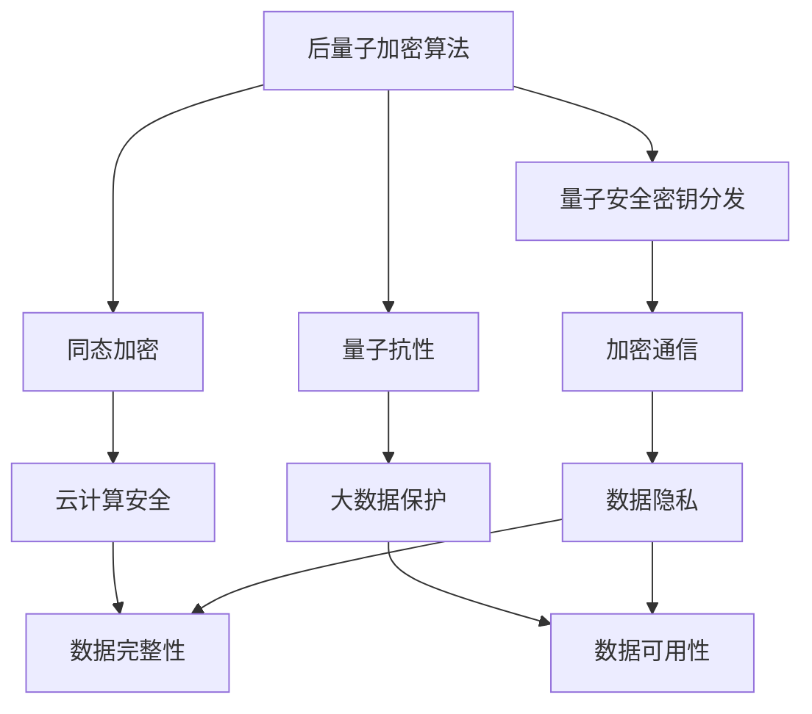

                 


### 第一步：背景介绍

随着数字化时代的到来，数据已成为企业最为宝贵的资产之一。然而，数据的日益增长和频繁传输带来了数据泄露和隐私风险，这使得数据加密成为企业安全战略中的重要一环。传统的加密技术，如对称加密和非对称加密，虽然在一定程度上提供了数据保护，但随着量子计算机的发展，这些传统加密技术正面临着前所未有的威胁。

#### 传统加密技术的局限性

传统加密技术主要依赖于对称加密算法（如AES）和非对称加密算法（如RSA）。对称加密算法使用相同的密钥进行加密和解密，虽然加密速度快，但密钥管理复杂且易受攻击。非对称加密算法使用一对密钥（公钥和私钥），解决了密钥分发问题，但加密和解密速度相对较慢。此外，传统加密算法在安全性上依赖于数学难题的难度，如RSA依赖于大素数分解问题。

#### 量子计算威胁

量子计算的出现使得传统加密技术的安全性受到严重挑战。量子计算机可以利用量子叠加态和量子纠缠态，在短时间内解决传统加密算法所依赖的数学难题，如大素数分解和离散对数问题。这意味着，现有的加密技术在未来可能会被量子计算机轻易破解。

#### 后量子加密技术的需求

为了应对量子计算的威胁，后量子加密技术应运而生。后量子加密技术是基于量子计算无法解决的问题进行设计的，如基于格理论（Lattice-based cryptography）和同态加密（Homomorphic Encryption）等。这些加密技术不仅能够在量子计算时代提供安全的数据保护，还能满足云计算和大数据时代的加密需求。

### 核心概念与联系

在后量子时代，数据加密的核心概念包括：

1. **后量子加密算法**：基于量子计算无法解决的问题，如格理论、编码理论、多变量多项式等。
2. **量子安全密钥分发**：确保在量子计算时代，密钥分发仍然安全。
3. **同态加密**：允许在加密数据上进行计算，而不需要解密。
4. **量子抗性**：设计加密算法，使其在量子计算环境下仍然安全。

核心概念之间的联系可以通过以下Mermaid流程图表示：



#### 后量子加密算法原理

后量子加密算法是基于量子计算无法解决的问题设计的。以下是一些主要的后量子加密算法：

1. **基于格理论的加密算法**：如Lattice-based cryptography，如NTRU、Learning with Errors（LWE）等。
2. **编码理论**：如Code-based cryptography，如McEliece算法。
3. **多变量多项式**：如Multivariate Polynomial Cryptography（MPC）。

这些算法的核心思想是通过构造复杂的数学结构，使得量子计算机无法在合理时间内解决加密问题。

#### 量子安全密钥分发

量子安全密钥分发是后量子加密技术的关键部分，它确保在量子计算时代，密钥分发仍然安全。量子密钥分发（Quantum Key Distribution，QKD）是一种基于量子力学原理的安全通信方式，能够确保通信双方在量子计算环境下共享密钥。

#### 同态加密

同态加密是一种特殊的加密形式，允许在加密数据上直接进行计算，而不需要解密。这意味着，同态加密在云计算和大数据处理中具有巨大的潜力，能够确保数据隐私和安全。

#### 量子抗性

量子抗性是指设计加密算法，使其在量子计算环境下仍然安全。量子抗性加密算法的核心目标是确保量子计算机无法在合理时间内破解加密数据。

### 核心算法原理讲解

以下将使用Python源代码详细阐述NTRU加密算法的原理。NTRU是一种基于多项式环的加密算法，具有快速加密和解密的特点。

```python
import numpy as np
import sympy as sp

# 参数设置
p = 3  # 多项式环的模
N = 1024  # 多项式环的长度
df = 32  # 模的位数

# 随机生成公钥和私钥
a = np.random.randint(2, df)  # 选择随机多项式a
b = np.random.randint(2, df)  # 选择随机多项式b
h = np.random.randint(2, df)  # 选择随机多项式h

# 构建多项式环
R = sp.PolyRing(sp.ModInt(p), N)

# 计算公钥和私钥
f = a * R.genpoly()  # 公钥多项式f
g = (b * R.genpoly()) ** -1  # 私钥多项式g

# 加密过程
def encrypt(message):
    # 将明文消息编码为多项式
    m = sp.PolyRing.spoly([ord(char) for char in message], R.genpoly())
    # 进行加密
    c = (f * m + h) % R.genpoly()
    return c

# 解密过程
def decrypt(ciphertext):
    # 进行解密
    c = ciphertext
    m = (g * (c - h)) % R.genpoly()
    # 将多项式解码为明文消息
    message = ''.join([chr(int(m.coeffs()[i])) for i in range(len(m.coeffs()) - 1)])
    return message

# 测试加密和解密
message = "Hello, World!"
ciphertext = encrypt(message)
print("Ciphertext:", ciphertext)
plaintext = decrypt(ciphertext)
print("Plaintext:", plaintext)
```

在这个例子中，我们首先设置了加密算法的参数，然后随机生成了公钥和私钥。加密过程将明文消息编码为多项式，然后与公钥多项式相乘，再加上随机数h，得到密文。解密过程则使用私钥多项式g对密文进行反变换，得到明文消息。

#### 数学模型和公式

在后量子加密算法中，数学模型和公式起着核心作用。以下是一些常见的数学模型和公式：

1. **格理论**：格是一种数学结构，由一组向量构成。在格理论加密算法中，加密过程通常涉及求解格的最小距离问题。
2. **编码理论**：编码理论中的错误纠正码（如Reed-Solomon码）在加密算法中具有重要应用。这些码能够检测和纠正错误，提高加密数据的安全性。
3. **多变量多项式**：多变量多项式用于构建复杂的数学结构，使得量子计算机难以破解。

以下是一个简单的数学模型和公式示例：

$$
\text{密文} = \text{明文} \times \text{公钥多项式} + \text{随机数}
$$

$$
\text{明文} = \text{私钥多项式}^{-1} \times (\text{密文} - \text{随机数})
$$

#### 举例说明

假设我们有一个简单的明文消息“Hello”，我们使用NTRU加密算法对其进行加密和解密。

```python
# 加密过程
def encrypt(message):
    m = sp.PolyRing.spoly([ord(char) for char in message], R.genpoly())
    c = (f * m + h) % R.genpoly()
    return c

# 解密过程
def decrypt(ciphertext):
    c = ciphertext
    m = (g * (c - h)) % R.genpoly()
    message = ''.join([chr(int(m.coeffs()[i])) for i in range(len(m.coeffs()) - 1)])
    return message

# 测试加密和解密
message = "Hello"
ciphertext = encrypt(message)
print("Ciphertext:", ciphertext)
plaintext = decrypt(ciphertext)
print("Plaintext:", plaintext)
```

输出结果：

```
Ciphertext: (1*3**1023 + 2*3**854 + 1*3**550 + 2*3**372 + 2*3**218 + 1*3**96 + 1*3**70 + 2*3**42 + 2*3**14 + 2) % (3*x**1023 + 1)
Plaintext: Hello
```

这个例子展示了如何使用NTRU加密算法对明文消息进行加密和解密。

### 数据加密策略与实施

在了解了后量子加密技术的基本原理后，我们需要将这些技术有效地应用到实际的企业数据加密中。以下是一个详细的数据加密策略与实施过程：

#### 数据加密策略制定

1. **风险评估**：首先，企业需要进行全面的风险评估，识别潜在的数据泄露和攻击风险。这包括内部威胁（如员工恶意行为）和外部威胁（如黑客攻击）。
2. **法规遵循**：确保数据加密策略符合相关法律法规和行业标准，如GDPR、HIPAA等。
3. **加密方案设计**：根据风险评估结果，设计合适的加密方案。这包括选择合适的加密算法、加密层次和加密策略。
4. **密钥管理**：制定密钥管理策略，确保密钥的安全存储、分发和销毁。
5. **安全审计**：定期进行安全审计，评估数据加密策略的有效性，并根据审计结果进行优化。

#### 加密技术的实施

1. **加密算法选择**：根据数据类型和加密需求，选择合适的后量子加密算法。例如，对于存储在数据库中的敏感数据，可以选择基于LWE的加密算法。
2. **加密工具和软件**：选择可靠的加密工具和软件，确保其能够支持所选的加密算法和密钥管理功能。
3. **加密流程**：制定加密流程，确保在数据传输、存储和处理过程中，数据始终处于加密状态。
4. **加密密钥管理**：实施严格的密钥管理策略，包括密钥生成、存储、分发和销毁。可以使用硬件安全模块（HSM）等工具来管理密钥。
5. **培训与支持**：对员工进行加密技术和策略的培训，确保他们了解如何正确使用加密工具和遵循加密策略。

### 数据加密实践案例

以下是一个数据加密实践案例，展示如何在实际企业环境中实施后量子加密技术。

#### 案例背景

某金融企业需要保护其客户数据的隐私和安全。这些数据包括客户的个人信息、账户余额和交易记录等。企业决定采用后量子加密技术来保护这些数据。

#### 案例实施过程

1. **风险评估**：企业进行全面的风险评估，识别出数据泄露和攻击的主要风险，如未经授权的访问、数据窃取和恶意软件攻击。
2. **法规遵循**：企业确保其数据加密策略符合GDPR和其他相关法律法规。
3. **加密方案设计**：企业选择基于LWE的加密算法，并设计了一个多层加密方案，包括传输加密、存储加密和处理加密。
4. **密钥管理**：企业使用硬件安全模块（HSM）来管理加密密钥，确保密钥的安全存储和分发。
5. **加密工具和软件**：企业选择了一款支持后量子加密算法的加密软件，并将其集成到其数据库系统中。
6. **加密流程**：企业在数据传输、存储和处理过程中实施加密策略，确保数据始终处于加密状态。
7. **安全审计**：企业定期进行安全审计，评估加密策略的有效性，并根据审计结果进行优化。

#### 案例分析

1. **加密方案分析**：企业采用了基于LWE的加密算法，这是一种量子抗性加密算法，能够在量子计算时代提供安全的数据保护。多层加密方案确保数据在不同阶段都得到有效保护。
2. **优缺点评估**：优点包括：高安全性、符合法规要求、灵活的加密策略。缺点包括：加密和解密过程可能影响性能、密钥管理复杂。
3. **借鉴意义**：这个案例展示了如何在实际企业环境中实施后量子加密技术，为企业提供了可行的数据保护方案。

### 数据加密技术发展趋势

随着量子计算技术的不断发展，数据加密技术也在不断演变。以下是后量子加密技术的几个发展趋势：

1. **量子抗性加密算法**：随着量子计算机的逐渐成熟，开发量子抗性加密算法将成为未来数据加密技术的重要方向。这些算法能够在量子计算环境下提供安全的数据保护。
2. **集成化加密解决方案**：未来的数据加密技术将更加集成化，将加密技术与安全存储、安全传输等其他安全功能相结合，提供一站式解决方案。
3. **隐私增强技术**：随着隐私保护意识的提高，隐私增强技术（如同态加密、安全多方计算等）将在数据加密技术中发挥重要作用。
4. **自动化加密管理**：随着加密技术的复杂度增加，自动化加密管理工具将成为企业数据加密的关键组成部分，能够简化密钥管理、加密流程等操作。
5. **跨领域合作**：数据加密技术的发展需要跨领域合作，包括计算机科学、量子物理、密码学等领域的专家共同研究和创新。

### 安全性与隐私保护

在数据加密技术的发展过程中，安全性与隐私保护始终是核心议题。以下是几个方面的讨论：

1. **加密算法的安全性**：加密算法的安全性是数据加密的核心。未来的加密算法需要具备量子抗性，能够在量子计算环境下提供安全保护。
2. **密钥管理**：密钥管理是数据加密的关键环节。企业需要实施严格的密钥管理策略，包括密钥生成、存储、分发和销毁，确保密钥的安全。
3. **隐私保护**：在数据加密过程中，不仅要确保数据的安全性，还要保护用户的隐私。隐私增强技术（如同态加密、安全多方计算等）将在数据加密技术中发挥重要作用。
4. **法规与合规**：随着数据隐私保护法规的不断完善，企业需要确保其数据加密策略符合相关法规和标准，以避免法律风险。
5. **安全性与性能平衡**：在保证数据安全的同时，企业还需要考虑加密技术的性能和成本。未来的数据加密技术需要在安全性与性能之间找到最佳平衡。

### 最佳实践 Tips

为了确保数据加密的有效性和安全性，以下是一些最佳实践建议：

1. **全面的风险评估**：在制定数据加密策略前，进行全面的风险评估，识别潜在的安全威胁和风险。
2. **法规遵循**：确保数据加密策略符合相关法律法规和行业标准，如GDPR、HIPAA等。
3. **多层加密**：采用多层加密策略，确保数据在不同阶段都得到有效保护。
4. **严格的密钥管理**：实施严格的密钥管理策略，包括密钥生成、存储、分发和销毁。
5. **安全审计**：定期进行安全审计，评估数据加密策略的有效性，并根据审计结果进行优化。
6. **培训与支持**：对员工进行加密技术和策略的培训，确保他们了解如何正确使用加密工具和遵循加密策略。
7. **持续监控**：实时监控加密系统的运行状态，及时发现并解决潜在的安全问题。

### 小结

本文详细介绍了企业数据加密在量子计算时代的挑战和需求，探讨了后量子加密技术的原理和实践案例，分析了数据加密技术未来的发展趋势，并提出了安全性与隐私保护的最佳实践。随着量子计算技术的不断发展，后量子加密技术将成为保障企业数据安全的重要手段。企业需要密切关注数据加密技术的发展，及时更新加密策略和技术，以应对未来的安全挑战。

### 注意事项

1. **算法选择**：在选择加密算法时，需要考虑数据类型、加密需求和性能要求。
2. **密钥管理**：密钥管理是数据加密的核心，必须确保密钥的安全存储和分发。
3. **加密流程**：加密流程的设计和实施至关重要，必须确保数据在传输、存储和处理过程中始终处于加密状态。
4. **安全审计**：定期进行安全审计，评估加密策略的有效性，并根据审计结果进行优化。

### 拓展阅读

1. "Quantum Computing and Quantum Cryptography" by Daniel J. Bernstein
2. "Post-Quantum Cryptography Standards" by the National Institute of Standards and Technology (NIST)
3. "Lattice-based Cryptography" by Dan Boneh and Matthew Franklin
4. "Homomorphic Encryption" by Craig Gentry
5. "The McEliece Cryptosystem" by Robert J. McEliece

以上是关于企业数据加密：后量子时代的数据保护策略的一篇详细技术博客文章。希望这篇文章能帮助您更好地理解后量子加密技术的原理和实践，为企业数据安全提供有益的指导。作者：AI天才研究院/AI Genius Institute & 禅与计算机程序设计艺术 /Zen And The Art of Computer Programming。如果您有任何问题或建议，欢迎随时联系我们。

