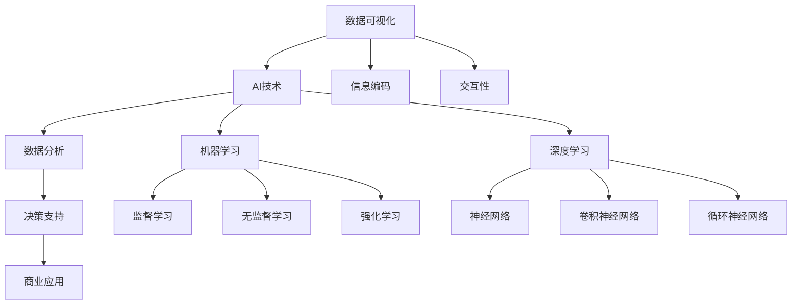

                 

### 文章标题

《企业数据可视化AI：增强数据分析和决策能力》

### 关键词

- 数据可视化
- AI技术
- 数据分析
- 商业决策
- 企业应用

### 摘要

本文将深入探讨企业数据可视化与人工智能（AI）的结合，阐述如何利用AI技术增强数据分析和决策能力。首先，我们将介绍数据可视化的基础知识和AI在数据可视化中的角色。接着，我们将解析AI算法原理，包括机器学习和深度学习，并探讨数据预处理和特征工程的重要性。随后，文章将介绍常见的数据可视化工具与框架，展示AI驱动的数据可视化应用。实战案例将展示数据可视化AI在实际项目中的应用和效果。最后，文章将展望数据可视化AI的发展前景和其在商业决策中的价值。

## 第一部分：数据可视化与AI概述

### 1. 数据可视化基础知识

#### 1.1 数据可视化的定义与目的

数据可视化是通过对数据进行分析和转换，将其以图表、图像或其他视觉形式呈现的过程。其目的是使复杂的数据更易于理解，帮助用户快速识别数据中的模式、趋势和关系。

数据可视化的基本原理包括：

- **数据抽象**：将大量数据转化为简洁的视觉元素，例如图表。
- **信息编码**：将数据属性映射到视觉属性，如颜色、形状、大小等。
- **交互性**：允许用户通过点击、缩放、筛选等方式与数据可视化进行交互。

#### 1.2 数据可视化的发展历程

数据可视化的发展可以追溯到17世纪，当时威廉·莎比负责绘制天气图表。随着计算机技术的发展，数据可视化工具和技术的进步使其应用范围不断扩大。

- **早期阶段**：以简单的图表为主，如折线图、柱状图等。
- **中期阶段**：引入了交互性和动态可视化，如D3.js等库的出现。
- **现阶段**：随着大数据和AI技术的发展，数据可视化变得更加智能化和互动化。

#### 1.3 数据可视化在商业分析中的应用

数据可视化在商业分析中扮演着重要角色，其应用场景包括：

- **市场营销**：通过分析消费者行为数据，优化营销策略。
- **供应链管理**：监控库存、物流和订单情况，提高供应链效率。
- **财务分析**：通过财务报表的可视化，帮助管理层做出更明智的决策。
- **客户关系管理**：分析客户数据，提升客户满意度和忠诚度。

### 2. AI与数据可视化的关系

#### 2.1 AI在数据可视化中的作用

AI技术为数据可视化带来了革命性的变化。首先，AI能够自动识别数据中的模式和趋势，生成可视化图表。其次，AI可以通过自然语言处理（NLP）技术，将非结构化数据转换为易于理解的可视化形式。此外，AI还可以通过增强现实（AR）和虚拟现实（VR）技术，提供更加沉浸式的数据可视化体验。

#### 2.2 AI在数据分析与决策支持中的应用

AI在数据分析中的关键作用包括：

- **预测分析**：使用机器学习模型预测未来的趋势和结果。
- **聚类分析**：自动识别数据中的相似群组。
- **关联规则学习**：发现数据项之间的关联关系。

在决策支持中，AI可以提供以下帮助：

- **数据洞察**：通过分析大量数据，提供决策所需的洞察。
- **自动化决策**：使用机器学习模型，自动执行重复性的决策任务。
- **智能建议**：根据数据分析结果，提供个性化建议。

#### 2.3 AI与数据可视化的未来趋势

随着AI技术的发展，数据可视化将变得更加智能化和个性化。以下是一些未来的发展趋势：

- **自动化可视化**：AI将能够自动生成数据可视化报告，减少手动工作量。
- **交互式探索**：用户可以通过自然语言与数据可视化进行交互，获取更深层次的分析结果。
- **沉浸式体验**：通过AR和VR技术，用户可以沉浸在一个虚拟的数据分析环境中。
- **可解释性AI**：AI模型的可解释性将得到提升，使决策者能够理解模型的决策过程。

### 3. AI算法原理介绍

AI算法可以分为两大类：机器学习和深度学习。

#### 3.1 机器学习基础

机器学习是AI的核心技术之一，其基本原理是让计算机从数据中学习，并做出决策或预测。机器学习算法分为监督学习、无监督学习和强化学习。

##### 3.1.1 监督学习

监督学习是一种从标记数据中学习的方法。标记数据包含输入和相应的输出标签。常见的监督学习算法包括：

- **线性回归**：通过拟合线性模型来预测连续值输出。
- **逻辑回归**：通过拟合逻辑函数来预测二分类输出。
- **支持向量机（SVM）**：通过最大化分类间隔来分类数据。

##### 3.1.2 无监督学习

无监督学习是在没有标记数据的情况下学习数据结构的算法。常见的无监督学习算法包括：

- **聚类分析**：将相似的数据点分组，常见的算法包括K-means、层次聚类等。
- **降维**：通过减少数据维度来简化数据分析，常用的算法有主成分分析（PCA）和t-SNE等。

##### 3.1.3 强化学习

强化学习是一种通过与环境互动来学习决策策略的算法。常见的强化学习算法包括：

- **Q-Learning**：通过学习状态-动作值函数来决策。
- **深度Q网络（DQN）**：使用神经网络来近似状态-动作值函数。

#### 3.2 深度学习基础

深度学习是机器学习的一个分支，它通过多层神经网络来模拟人脑的学习方式。深度学习在图像识别、语音识别和自然语言处理等领域取得了显著的成果。

##### 3.2.1 神经网络

神经网络是深度学习的基础，它由多个神经元组成，每个神经元都与其他神经元相连。常见的神经网络结构包括：

- **全连接神经网络（FCNN）**：每个神经元都与前一层和后一层的所有神经元相连。
- **卷积神经网络（CNN）**：适用于图像识别，通过卷积操作提取图像特征。
- **循环神经网络（RNN）**：适用于序列数据，可以处理变长的输入序列。

##### 3.2.2 卷积神经网络（CNN）

卷积神经网络是一种专门用于图像识别的神经网络，其核心在于卷积操作。卷积操作可以提取图像中的局部特征，并通过逐层组合形成全局特征。

##### 3.2.3 循环神经网络（RNN）

循环神经网络适用于处理序列数据，例如时间序列数据、文本数据等。RNN的核心是循环连接，使得网络能够记住之前的输入信息，并在后续的输出中使用这些信息。

### 4. 数据预处理与特征工程

#### 4.1 数据清洗

数据清洗是数据预处理的重要步骤，旨在识别和纠正数据集中的错误、异常和不一致之处。常见的数据清洗任务包括：

- **缺失值处理**：可以通过填补、删除或插值等方法处理缺失值。
- **异常值处理**：可以通过阈值方法、箱线图等方法检测和纠正异常值。
- **数据规范化**：通过缩放或转换数据，使其符合特定的分布或范围。

#### 4.2 特征工程

特征工程是将原始数据转换为适合机器学习模型输入的特征的过程。特征工程的目标是提高模型的性能和可解释性。常见的特征工程方法包括：

- **特征提取**：通过计算原始数据的统计特征或变换特征来提取新的特征。
- **特征选择**：通过评估特征的重要性和相关性，选择对模型性能最有影响力的特征。
- **特征转换**：通过归一化、离散化或编码等方法，将特征转换为适合模型训练的形式。

### 5. 常见数据可视化工具介绍

数据可视化工具可以帮助用户轻松地创建和共享可视化图表，以下是几种常见的工具：

#### 5.1 Tableau

Tableau是一种广泛使用的数据可视化工具，它提供了丰富的图表类型和交互功能。

- **基本功能**：Tableau支持连接多种数据源，包括数据库、Excel和CSV文件等。它提供了拖放式的用户界面，用户可以轻松创建图表。
- **数据连接**：Tableau支持实时连接到数据库和数据仓库，可以实现动态数据更新。
- **图表类型与应用**：Tableau提供了多种图表类型，包括柱状图、折线图、饼图、地图等。用户可以根据需求选择合适的图表类型，并进行自定义。

#### 5.2 Power BI

Power BI是微软推出的数据可视化工具，它与企业级数据分析平台紧密结合。

- **基本功能**：Power BI支持多种数据连接方式，包括SQL Server、Azure、Excel等。它提供了强大的数据建模功能，用户可以轻松创建数据模型。
- **数据建模**：Power BI的数据建模功能使得用户可以将来自多个数据源的数据整合到一个模型中，进行高级的数据分析和处理。
- **仪表盘创建**：Power BI的仪表盘功能允许用户将多个图表和指标整合到一个视图中，便于用户快速了解数据状况。

#### 5.3 Matplotlib

Matplotlib是Python中最常用的数据可视化库，它提供了丰富的图表绘制功能。

- **基本使用**：Matplotlib的接口简单易用，用户可以通过简单的代码绘制出各种类型的图表。
- **图表定制**：Matplotlib提供了丰富的定制选项，用户可以自定义图表的样式、颜色、字体等。
- **数据分析中的应用**：Matplotlib在数据分析和机器学习领域有着广泛的应用，可以用于可视化数据分析结果、模型训练过程等。

### 6. AI驱动的数据可视化框架

#### 6.1 TensorFlow Data Visualization

TensorFlow Data Visualization是TensorFlow的一部分，它提供了强大的数据可视化功能。

- **介绍**：TensorFlow Data Visualization提供了多种可视化工具，如`tf.summary`和`tf.keras.metrics`等，可以帮助用户更好地理解和分析模型训练过程。
- **使用**：用户可以通过调用这些工具，将模型的训练进度、损失函数值、准确率等指标以图表的形式可视化展示。
- **高级应用**：TensorFlow Data Visualization还支持自定义可视化函数，用户可以根据需求实现特定的可视化效果。

#### 6.2 Plotly

Plotly是一个开源的数据可视化库，它提供了丰富的图表类型和交互功能。

- **基本使用**：Plotly提供了简单易用的API，用户可以通过几行代码创建各种类型的图表，如散点图、线图、饼图等。
- **图表定制**：Plotly提供了丰富的定制选项，用户可以自定义图表的颜色、样式、字体等，以适应特定的需求。
- **数据分析中的应用**：Plotly在数据分析领域有着广泛的应用，可以用于可视化数据分析结果、交互式数据探索等。

### 7. 数据可视化AI项目实战

#### 7.1 数据可视化AI项目规划

一个成功的数据可视化AI项目需要详细的规划，以下是项目规划的主要步骤：

- **需求分析**：了解项目的具体需求，包括数据来源、可视化目标和用户需求等。
- **技术路线**：根据需求选择合适的技术方案，包括数据预处理、模型训练、可视化工具等。
- **团队构建**：组建合适的团队，包括数据科学家、数据工程师、可视化专家等。

#### 7.2 数据收集与预处理

数据收集和预处理是数据可视化AI项目的关键步骤，以下是详细的流程：

- **数据来源与采集**：确定数据来源，并使用适当的工具和技术采集数据。常见的数据源包括数据库、API、文件系统等。
- **数据预处理流程**：清洗数据，处理缺失值、异常值，并进行数据规范化。此外，还需进行特征工程，提取和选择对模型性能有重要影响的特征。
- **数据处理工具与技巧**：使用Python的Pandas库进行数据清洗和预处理，使用Scikit-learn库进行特征工程。

#### 7.3 数据可视化与AI模型构建

在数据收集和预处理完成后，下一步是构建数据可视化AI模型：

- **可视化方案设计**：根据需求设计合适的可视化方案，包括图表类型、交互功能等。
- **AI模型选择与训练**：选择合适的AI模型，如机器学习模型或深度学习模型，并进行训练。使用Python的TensorFlow或PyTorch库进行模型训练。
- **可视化与AI模型的整合**：将训练好的模型与可视化工具结合，实现数据可视化。

#### 7.4 项目评估与优化

在项目实施过程中，需要进行项目评估和优化，以下是具体的步骤：

- **项目效果评估**：评估模型的可视化效果，包括准确性、可解释性等。
- **性能优化**：通过调整模型参数、优化数据预处理流程等方式，提高模型的性能。
- **用户反馈与迭代**：收集用户反馈，根据反馈进行项目迭代，优化用户体验。

### 8. 数据可视化AI应用案例

#### 8.1 案例一：销售数据分析

**案例背景**：一家零售企业希望通过数据可视化AI项目了解销售数据，以便优化营销策略和提高销售额。

**解决方案**：

1. **数据收集与预处理**：采集销售数据，包括销售额、销售量、客户分类等。对数据进行清洗，处理缺失值和异常值，并进行数据规范化。

2. **模型训练**：使用机器学习模型对销售数据进行分析，包括分类模型和回归模型。选择合适的模型，如随机森林或神经网络，并进行训练。

3. **数据可视化**：使用Tableau或Matplotlib等工具，将销售数据可视化，包括销售额趋势图、销售量柱状图、客户分布地图等。

**效果分析**：

通过数据可视化，企业能够直观地了解销售数据的分布和变化趋势。这有助于企业优化营销策略，如调整产品组合、定位目标客户等，从而提高销售额。

#### 8.2 案例二：供应链优化

**案例背景**：一家制造企业希望通过数据可视化AI项目优化供应链管理，降低库存成本和提高生产效率。

**解决方案**：

1. **数据收集与预处理**：采集供应链数据，包括库存量、生产进度、订单状态等。对数据进行清洗和预处理，处理缺失值和异常值，并进行数据规范化。

2. **模型训练**：使用机器学习模型对供应链数据进行分析，包括聚类模型和预测模型。选择合适的模型，如K-means聚类或时间序列预测，并进行训练。

3. **数据可视化**：使用Power BI或TensorFlow Data Visualization等工具，将供应链数据可视化，包括库存趋势图、生产进度仪表盘、订单状态地图等。

**效果分析**：

通过数据可视化，企业能够实时监控供应链的运行状况，发现潜在的问题和瓶颈。这有助于企业优化库存管理，提高生产效率，降低库存成本。

### 9. 数据可视化AI的发展前景

数据可视化AI技术在未来将继续快速发展，以下是几个可能的发展方向：

- **自动化可视化**：随着AI技术的进步，自动化可视化将更加普及，用户将能够轻松创建和定制数据可视化报告。
- **交互式探索**：用户将能够通过自然语言与数据可视化进行交互，实现更加灵活和深入的数据分析。
- **沉浸式体验**：通过AR和VR技术，用户将能够在一个虚拟的数据分析环境中进行互动，提高数据分析的效率和体验。
- **可解释性AI**：为了提高AI模型的透明度和可解释性，研究者将继续探索可解释性AI技术，使决策者能够理解模型的决策过程。

### 10. 数据可视化AI在商业决策中的价值

数据可视化AI在商业决策中具有巨大的价值，以下是其主要优势：

- **快速洞察**：通过数据可视化，决策者可以快速获取数据的洞察，发现业务中的问题和机会。
- **精确预测**：AI技术能够对数据进行分析和预测，为决策者提供精确的数据支持。
- **优化决策**：数据可视化AI可以帮助企业优化决策过程，提高决策的准确性和效率。
- **提升用户体验**：通过交互式可视化，用户可以更好地理解和使用数据，提升数据分析和决策的体验。

### 结论

数据可视化AI技术为企业提供了强大的数据分析和决策支持。通过结合AI技术，企业可以更有效地利用数据，提高业务效率和竞争力。随着技术的不断发展，数据可视化AI将在未来发挥更加重要的作用。

### 参考文献

- **数据可视化相关书籍**：《数据可视化：设计原则与应用》（作者：Stephen Few）、《数据可视化实战》（作者：Kevin Flerlage）。
- **机器学习和深度学习相关书籍**：《深度学习》（作者：Ian Goodfellow）、《Python机器学习》（作者：Sebastian Raschka）。
- **商业分析相关书籍**：《商业分析实战》（作者：Bill Baker）、《商业智能分析：使用Excel和Power BI》（作者：Jeffrey Carr）。

### 作者信息

- 作者：AI天才研究院/AI Genius Institute & 禅与计算机程序设计艺术 /Zen And The Art of Computer Programming

### 结语

数据可视化AI不仅是技术的前沿，更是企业提升竞争力的重要工具。本文详细探讨了数据可视化与AI技术的结合，从基础概念到实际应用，展示了其在商业决策中的巨大价值。随着技术的不断进步，我们有理由相信，数据可视化AI将在未来的商业世界中发挥更加重要的作用。希望本文能为读者提供有益的启示和帮助。在数据可视化和AI的探索之路上，让我们共同前行，追求卓越。

---

**本文使用了Mermaid流程图来展示核心概念实体之间的关系架构。**

通过这些流程图，我们能够更直观地理解数据可视化与AI技术的核心概念和它们之间的关系。

### 注意事项

在实践数据可视化AI项目时，以下注意事项至关重要：

1. **数据质量**：确保数据准确、完整和可靠，这是数据可视化和AI模型成功的基础。
2. **用户需求**：深入了解用户需求，确保可视化结果能够满足实际业务需求。
3. **模型解释性**：尽管AI模型可以提供强大分析能力，但需要确保模型的解释性，以便用户能够理解模型的决策过程。
4. **性能优化**：持续优化模型的性能和可扩展性，以适应不断变化的数据量和业务需求。
5. **安全性**：确保数据安全，特别是在处理敏感数据时，采取适当的数据保护措施。

### 拓展阅读

对于希望深入了解数据可视化AI技术的读者，以下书籍和资源推荐：

- **《数据可视化：设计原则与应用》**：提供了数据可视化设计原则和实践。
- **《深度学习》**：详尽介绍了深度学习的基础理论和应用。
- **《Python机器学习》**：介绍了机器学习在Python中的应用。
- **《商业智能分析：使用Excel和Power BI》**：介绍了商业智能分析工具的使用方法。

### 结语

数据可视化AI不仅是技术的前沿，更是企业提升竞争力的重要工具。本文详细探讨了数据可视化与AI技术的结合，从基础概念到实际应用，展示了其在商业决策中的巨大价值。随着技术的不断进步，我们有理由相信，数据可视化AI将在未来的商业世界中发挥更加重要的作用。希望本文能为读者提供有益的启示和帮助。在数据可视化和AI的探索之路上，让我们共同前行，追求卓越。作者：AI天才研究院/AI Genius Institute & 禅与计算机程序设计艺术 /Zen And The Art of Computer Programming。

