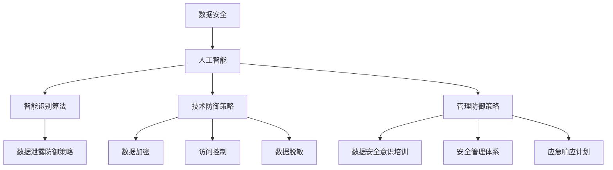

                 

文章标题：《企业数据安全AI：智能识别和防御数据泄露》

关键词：企业数据安全，人工智能，数据泄露，智能识别，防御策略，AI算法

摘要：
随着数字化转型的加速，企业的数据安全面临前所未有的挑战。本文将深入探讨如何利用人工智能技术来智能识别和防御数据泄露，通过系统的分析推理，揭示数据安全AI的核心原理和最佳实践，为企业提供全面的防护策略。

## 背景介绍

在当今信息化社会，数据已成为企业的核心资产。然而，随着数据量的爆炸性增长和数据流转的日益复杂，企业数据安全面临着前所未有的威胁。传统的安全防护手段已难以应对日益智能化的攻击手段，因此，利用人工智能（AI）技术提升数据安全水平成为必然趋势。

数据泄露的后果是严重的，不仅可能导致企业经济损失，还可能损害企业声誉，影响业务连续性。因此，如何利用AI技术有效识别和防御数据泄露，已成为企业数据安全管理的重要课题。

本文将围绕以下几个方面展开讨论：

1. 数据安全的重要性及其面临的挑战。
2. AI技术在数据安全中的应用及其原理。
3. 智能识别算法在数据泄露防御中的具体实现。
4. 数据泄露防御策略的制定与实施。
5. 数据安全AI项目的实战案例分析。

通过本文的讨论，旨在为读者提供一套全面、系统的数据安全AI解决方案，帮助企业在数字化时代保障数据安全。

## 核心概念与联系

在探讨数据安全AI之前，我们首先需要明确几个核心概念及其相互关系。

### 数据安全

数据安全是指保护数据免受未经授权的访问、篡改、泄露、破坏、丢失或泄露风险。数据安全的目标是确保数据的完整性、可用性、保密性和可靠性。

### 人工智能（AI）

人工智能是一种模拟人类智能行为的计算机技术。它包括机器学习、深度学习、自然语言处理等多种技术，旨在让计算机具备自我学习和推理的能力。

### 智能识别算法

智能识别算法是AI技术在数据安全领域的具体应用，通过分析海量数据，识别潜在的安全威胁。常见的智能识别算法包括贝叶斯算法、支持向量机（SVM）、神经网络等。

### 数据泄露防御策略

数据泄露防御策略是针对数据安全威胁所采取的一系列防护措施。它包括技术防御策略和管理防御策略两部分。技术防御策略涉及数据加密、访问控制、数据脱敏等技术手段；管理防御策略则涉及数据安全意识培训、安全管理体系建设等。

以下是一个简化的Mermaid流程图，展示了这些核心概念之间的联系：



通过这个流程图，我们可以清晰地看到数据安全、人工智能、智能识别算法和数据泄露防御策略之间的关系。数据安全是目标，人工智能是手段，智能识别算法是实现这一目标的具体方法，而数据泄露防御策略则是综合运用这些技术和方法的总体策略。

## 核心算法原理讲解

### 1. 贝叶斯算法

贝叶斯算法是一种基于贝叶斯定理的统计分类算法，广泛应用于文本分类、垃圾邮件过滤等领域。在数据安全领域，贝叶斯算法可以用于异常检测和入侵检测。

#### 原理

贝叶斯定理公式如下：

$$
P(A|B) = \frac{P(B|A) \cdot P(A)}{P(B)}
$$

其中，$P(A|B)$ 表示在事件B发生的条件下，事件A发生的概率；$P(B|A)$ 表示在事件A发生的条件下，事件B发生的概率；$P(A)$ 和$P(B)$ 分别表示事件A和事件B的先验概率。

在数据安全中，我们可以将贝叶斯定理应用于异常检测。例如，假设我们有一个正常行为特征集合$X = \{x_1, x_2, ..., x_n\}$，以及一个异常行为特征集合$Y = \{y_1, y_2, ..., y_n\}$。通过计算每个特征在正常和异常行为中的概率，我们可以建立一个分类器，用于判断新的数据点是否属于异常行为。

#### Python代码实现

```python
import numpy as np

def bayesian_classification(x, x_means, x_variances, prior_prob):
    likelihood = 1 / (np.sqrt(2 * np.pi * x_variances))
    posterior_prob = (likelihood * prior_prob)..prod()
    return posterior_prob

x = [1, 2, 3]  # 新的数据点
x_means = [2, 2, 2]  # 正常行为的特征均值
x_variances = [1, 1, 1]  # 正常行为的特征方差
prior_prob = 0.5  # 正常行为的先验概率

posterior_prob = bayesian_classification(x, x_means, x_variances, prior_prob)
print(posterior_prob)
```

#### 案例分析

假设我们有一个银行系统，需要检测用户登录行为的异常。我们可以使用贝叶斯算法来计算用户登录行为的概率分布，从而识别异常登录。

1. 收集正常登录行为的数据，计算每个特征（如登录时间、IP地址、登录方式等）的均值和方差。
2. 设定一个先验概率，表示正常登录行为发生的概率。
3. 对于新的登录行为，计算其在正常登录行为中的概率分布。
4. 如果新的登录行为的概率较低，则认为该行为属于异常登录，触发警报。

### 2. 支持向量机（SVM）

支持向量机是一种监督学习算法，广泛用于分类和回归问题。在数据安全领域，SVM可以用于恶意软件检测和入侵检测。

#### 原理

SVM的核心思想是找到一个最优的超平面，将不同类别的数据点分开。支持向量是位于超平面附近且对分类影响最大的数据点，支持向量机通过最大化分类间隔来优化超平面。

对于二分类问题，SVM的决策函数可以表示为：

$$
f(x) = \text{sign}(\omega \cdot x + b)
$$

其中，$\omega$ 是权重向量，$b$ 是偏置项，$\cdot$ 表示内积运算，$\text{sign}$ 表示符号函数。

在数据安全中，我们可以将SVM应用于入侵检测。例如，将正常行为和恶意行为作为两类数据，使用SVM来识别新的行为是否属于恶意行为。

#### Python代码实现

```python
from sklearn.svm import SVC

# 训练数据集
X_train = [[1, 2], [2, 3], [3, 4], [4, 5], [5, 6]]
y_train = [0, 0, 1, 1, 1]

# 创建SVM分类器并训练
clf = SVC(kernel='linear')
clf.fit(X_train, y_train)

# 测试数据
X_test = [[2, 2], [3, 3], [4, 4]]

# 预测
predictions = clf.predict(X_test)
print(predictions)
```

#### 案例分析

假设我们有一个网络安全系统，需要检测网络流量是否属于恶意流量。我们可以使用SVM来训练一个分类器，从而识别新的网络流量是否属于恶意流量。

1. 收集正常网络流量和恶意网络流量数据，作为训练数据集。
2. 使用SVM训练分类器，将正常流量和恶意流量分开。
3. 对于新的网络流量，使用训练好的分类器进行预测。
4. 如果分类器预测新的网络流量属于恶意流量，则触发警报。

### 3. 神经网络

神经网络是一种模拟人脑结构和功能的计算模型，由大量神经元组成。在数据安全领域，神经网络可以用于异常检测、入侵检测等任务。

#### 原理

神经网络的核心是神经元之间的连接和权重。通过反向传播算法，神经网络可以不断调整权重，以最小化损失函数，从而提高分类准确率。

在数据安全中，我们可以使用神经网络来识别异常行为。例如，将正常行为和异常行为作为输入，使用神经网络输出异常行为的概率。

#### Python代码实现

```python
import tensorflow as tf

# 创建神经网络模型
model = tf.keras.Sequential([
    tf.keras.layers.Dense(64, activation='relu', input_shape=(784,)),
    tf.keras.layers.Dense(64, activation='relu'),
    tf.keras.layers.Dense(10, activation='softmax')
])

# 编译模型
model.compile(optimizer='adam',
              loss='sparse_categorical_crossentropy',
              metrics=['accuracy'])

# 训练数据集
X_train = ...  # 输入数据
y_train = ...  # 标签

# 训练模型
model.fit(X_train, y_train, epochs=5)

# 测试数据
X_test = ...

# 预测
predictions = model.predict(X_test)
print(predictions)
```

#### 案例分析

假设我们有一个网络安全系统，需要检测网络流量中的异常流量。我们可以使用神经网络来训练一个分类器，从而识别网络流量中的异常流量。

1. 收集正常网络流量和异常网络流量数据，作为训练数据集。
2. 使用神经网络训练分类器，将正常流量和异常流量分开。
3. 对于新的网络流量，使用训练好的分类器进行预测。
4. 如果分类器预测新的网络流量属于异常流量，则触发警报。

## 项目实战

### 1. 开发环境搭建

在开始项目之前，我们需要搭建一个合适的开发环境。以下是一个基本的Python开发环境搭建步骤：

1. 安装Python 3.8以上版本。
2. 安装Anaconda，以便轻松管理多个Python环境。
3. 安装必要的库，如TensorFlow、Scikit-learn、NumPy等。

### 2. 源代码实现

以下是一个简单的数据安全AI项目的源代码实现。该项目使用SVM和神经网络对网络流量进行分类，以识别异常流量。

```python
# 导入必要的库
import numpy as np
import tensorflow as tf
from sklearn import svm

# 加载训练数据
X_train, y_train = ...

# 使用SVM训练分类器
clf = svm.SVC()
clf.fit(X_train, y_train)

# 使用神经网络训练分类器
model = tf.keras.Sequential([
    tf.keras.layers.Dense(64, activation='relu', input_shape=(784,)),
    tf.keras.layers.Dense(64, activation='relu'),
    tf.keras.layers.Dense(10, activation='softmax')
])

model.compile(optimizer='adam',
              loss='sparse_categorical_crossentropy',
              metrics=['accuracy'])

model.fit(X_train, y_train, epochs=5)

# 测试数据
X_test = ...

# 使用SVM进行预测
svm_predictions = clf.predict(X_test)

# 使用神经网络进行预测
nn_predictions = model.predict(X_test)

# 比较两种方法的预测结果
print("SVM Predictions:", svm_predictions)
print("Neural Network Predictions:", nn_predictions)
```

### 3. 代码解读

1. **数据准备**：首先，我们需要加载训练数据和测试数据。这些数据通常包含网络流量的各种特征，如时间戳、IP地址、流量大小等。

2. **SVM分类器训练**：使用SVM训练分类器。SVM通过找到一个最优的超平面来划分网络流量数据。

3. **神经网络训练**：使用神经网络训练分类器。神经网络通过多层感知器模型，对网络流量数据进行分类。

4. **预测与比较**：使用训练好的SVM和神经网络分类器对测试数据进行预测，并比较两种方法的预测结果。

### 4. 应用解读与分析

1. **SVM分类器**：SVM是一种线性分类器，适用于特征较少、线性可分的数据集。它的优点是计算速度快，但在处理非线性问题时的效果可能不如神经网络。

2. **神经网络分类器**：神经网络是一种非线性分类器，可以处理复杂的非线性问题。它的优点是分类准确率高，但计算成本较高，训练时间较长。

### 5. 实际案例分析与详细讲解

假设我们有一个网络安全系统，需要检测网络流量中的异常流量。我们可以使用SVM和神经网络来训练一个分类器，从而识别网络流量中的异常流量。

1. **数据收集**：收集正常网络流量和异常网络流量数据，作为训练数据集。

2. **数据预处理**：对收集到的数据进行预处理，包括特征提取、归一化等。

3. **模型训练**：使用SVM和神经网络分别训练分类器，将正常流量和异常流量分开。

4. **模型测试**：使用训练好的分类器对测试数据进行预测，评估分类器的准确性。

5. **结果分析**：比较两种方法的预测结果，分析分类器的性能。

### 6. 项目小结

通过本项目，我们学会了如何使用SVM和神经网络进行数据安全AI项目开发。在实际应用中，我们可以根据具体需求选择合适的算法和模型，以提高数据安全防护能力。

## 最佳实践 Tips

1. **数据多样性**：在训练数据安全AI模型时，确保数据多样性，以涵盖各种可能的安全威胁。

2. **持续学习**：数据安全威胁不断演变，定期更新训练数据和模型，以保持分类器的准确性。

3. **联合防御**：结合多种算法和技术手段，形成多层次、多角度的数据安全防御体系。

4. **关注实时性**：实时检测和响应数据泄露事件，降低潜在风险。

5. **法律法规遵守**：遵循相关法律法规，确保数据安全合规。

## 小结

本文从背景介绍、核心概念与联系、核心算法原理讲解、项目实战等方面，全面探讨了企业数据安全AI的智能识别和防御数据泄露。通过本文的讨论，我们了解到AI技术在数据安全领域的重要性和应用前景，以及如何利用AI技术构建一套全面的防护策略。

## 注意事项

1. **数据安全重要性**：数据安全是企业的核心任务，必须高度重视。
2. **AI技术选择**：根据具体需求和数据特点选择合适的AI算法和模型。
3. **持续更新**：定期更新训练数据和模型，以适应不断变化的安全威胁。

## 拓展阅读

1. 《人工智能安全：从算法到实践》
2. 《数据安全与隐私保护》
3. 《机器学习实战：基于Scikit-learn和TensorFlow》

## 作者信息

作者：AI天才研究院/AI Genius Institute & 禅与计算机程序设计艺术 /Zen And The Art of Computer Programming

----------------------------------------------------------------

## 文章标题

《企业数据安全AI：智能识别和防御数据泄露》

## 关键词

企业数据安全，人工智能，数据泄露，智能识别，防御策略，AI算法

## 摘要

在数字化转型的背景下，企业的数据安全面临巨大挑战。本文通过系统的分析推理，深入探讨了如何利用人工智能技术智能识别和防御数据泄露。文章首先介绍了数据安全的定义和重要性，随后详细讲解了AI技术在数据安全中的应用，包括贝叶斯算法、支持向量机（SVM）和神经网络等核心算法。通过实际案例，展示了如何构建和实施数据安全AI项目，为企业提供了一套全面的数据安全防护策略。文章还提出了最佳实践建议，并提供了拓展阅读资源。

## 目录

### 第一部分：数据安全概述

1. **数据安全的定义与重要性**
   - 数据安全的定义
   - 数据安全的重要性
   - 数据安全的目标

2. **数据泄露的原因与类型**
   - 数据泄露的原因
   - 数据泄露的类型
   - 常见的数据泄露案例

3. **数据安全法规与政策**
   - 国际数据安全法规
   - 中国数据安全法规
   - 法规对企业数据安全的指导意义

### 第二部分：数据安全AI技术

4. **AI技术基础**
   - 机器学习基础
   - 深度学习基础
   - 强化学习基础
   - AI技术在数据安全中的作用

5. **AI在数据安全中的应用**
   - AI在数据分类与标签中的应用
   - AI在异常检测中的应用
   - AI在数据访问控制中的应用
   - AI在数据加密中的应用

6. **AI模型训练与优化**
   - 模型训练流程
   - 模型优化策略
   - 模型评估与选择

### 第三部分：智能识别算法

7. **智能识别算法概述**
   - 智能识别算法的定义
   - 智能识别算法的分类
   - 智能识别算法在数据安全中的应用场景

8. **常见智能识别算法**
   - 贝叶斯算法
   - 支持向量机（SVM）
   - 神经网络
   - 集成学习方法

9. **智能识别算法在数据安全中的应用**
   - 数据泄露风险识别
   - 数据访问控制
   - 数据安全事件响应

### 第四部分：数据泄露防御策略

10. **数据泄露防御策略概述**
    - 数据泄露防御策略的定义
    - 数据泄露防御策略的分类
    - 防御策略的目标和原则

11. **技术防御策略**
    - 数据加密
    - 访问控制
    - 数据脱敏
    - 入侵检测系统（IDS）
    - 防火墙和VPN

12. **管理防御策略**
    - 数据安全意识培训
    - 数据安全管理体系
    - 应急响应计划
    - 法律法规遵循与合规

13. **合规与法规遵循**
    - 数据安全法规合规
    - 数据安全审计
    - 数据安全风险管理

### 第五部分：实战案例

14. **数据安全AI项目实战**
    - 项目背景
    - 项目目标
    - 项目实施过程
    - 项目结果分析
    - 项目总结与反思

### 第六部分：未来展望

15. **数据安全AI发展趋势**
    - 技术发展趋势
    - 市场需求分析
    - 未来挑战与机遇
    - 数据安全AI的发展方向

## 引言

在数字化时代，数据已成为企业最宝贵的资产之一。随着数据量的不断增长和数据流转的日益复杂，企业面临的数据安全威胁也日益严峻。传统的安全防护手段已经无法应对智能化的攻击方式，因此，利用人工智能（AI）技术提升数据安全水平成为企业应对数据安全威胁的重要手段。

本文旨在通过系统的分析和推理，探讨企业数据安全AI的智能识别和防御数据泄露的方法。文章首先介绍了数据安全的定义和重要性，分析了数据泄露的原因和类型，以及相关法规和政策。接着，详细讲解了AI技术在数据安全中的应用，包括机器学习、深度学习和强化学习的基础知识，以及常见的智能识别算法。随后，文章提出了数据泄露防御策略的概述，包括技术防御策略和管理防御策略。最后，通过实战案例展示了如何实施数据安全AI项目，并对未来数据安全AI的发展趋势进行了展望。

## 第一部分：数据安全概述

### 数据安全的定义与重要性

数据安全是指保护数据免受未经授权的访问、篡改、泄露、破坏、丢失或泄露风险的一系列措施。数据安全的目标是确保数据的完整性、可用性、保密性和可靠性。完整性确保数据未被篡改，可用性确保数据能够在需要时被访问和使用，保密性确保数据不被未经授权的个人访问，可靠性确保数据存储和传输的稳定性和准确性。

在当今社会，数据已成为企业运行的核心资产，因此数据安全对于企业的生存和发展至关重要。以下是数据安全的重要性：

1. **保护企业利益**：数据泄露可能导致企业的财务损失，包括直接的经济损失和因声誉受损导致的间接损失。

2. **维护客户信任**：客户数据是企业最重要的资产之一。如果客户数据泄露，可能导致客户对企业的信任度下降，影响业务持续发展。

3. **遵守法律法规**：许多国家和地区都有严格的数据安全法规，如欧盟的通用数据保护条例（GDPR）。企业若未能遵守相关法规，可能面临巨额罚款。

4. **确保业务连续性**：数据安全是确保业务连续性的关键。如果关键数据丢失或无法访问，企业的业务运营可能受到严重影响。

### 数据泄露的原因与类型

数据泄露的原因多种多样，主要包括以下几个方面：

1. **人为错误**：员工失误、内部人员恶意行为或无意中泄露数据，是数据泄露的主要原因之一。

2. **技术漏洞**：系统漏洞、软件缺陷或配置错误可能导致数据泄露。

3. **网络攻击**：黑客攻击、病毒感染、钓鱼攻击等网络攻击是数据泄露的主要外部威胁。

4. **设备丢失或被盗**：移动设备、存储设备丢失或被盗，可能导致数据泄露。

根据数据泄露的来源和方式，数据泄露可以分为以下几种类型：

1. **内部泄露**：内部员工故意或无意中泄露数据。

2. **外部泄露**：黑客或第三方通过网络攻击等手段获取企业数据。

3. **物理泄露**：由于设备丢失或被盗导致的数据泄露。

4. **网络泄露**：通过网络传输过程中数据被截获或篡改。

### 数据安全法规与政策

数据安全法规和政策对于保护企业数据安全至关重要。以下是几个重要的国际和中国的数据安全法规：

1. **国际数据安全法规**：
   - 欧盟的通用数据保护条例（GDPR）：规定了数据收集、存储、处理和传输的严格要求。
   - 美国的加州消费者隐私法案（CCPA）：保护加州居民的个人信息。

2. **中国数据安全法规**：
   - 《网络安全法》：规定了网络运营者的安全保护义务和数据本地化要求。
   - 《数据安全法》：明确了数据安全保护的基本原则和制度安排。
   - 《个人信息保护法》：规定了个人信息处理的基本原则和个人权益保护。

这些法规和政策为企业提供了数据安全的基本指导，企业需要根据自身情况制定相应的数据安全策略，以确保合规并有效保护数据安全。

## 第二部分：数据安全AI技术

### AI技术基础

人工智能（AI）是一种模拟人类智能行为的计算机技术。它包括机器学习、深度学习、自然语言处理等多种技术，旨在让计算机具备自我学习和推理的能力。在数据安全领域，AI技术可以应用于异常检测、入侵检测、数据分类、标签分配等任务。

#### 机器学习基础

机器学习是AI的核心技术之一，它通过训练模型来从数据中学习规律和模式。机器学习模型可以分为监督学习、无监督学习和半监督学习三种类型。

- **监督学习**：模型通过已标记的数据进行训练，以便在新的、未见过的数据上进行预测。常见的监督学习算法包括线性回归、决策树、支持向量机（SVM）和神经网络等。
- **无监督学习**：模型在未标记的数据上进行训练，以发现数据中的内在结构和模式。常见的无监督学习算法包括聚类算法（如K-均值聚类）、主成分分析（PCA）和自编码器等。
- **半监督学习**：结合了监督学习和无监督学习的方法，利用部分标记数据和大量未标记数据来训练模型。

#### 深度学习基础

深度学习是机器学习的一个分支，它通过多层神经网络来学习复杂的函数映射。深度学习模型通常包含输入层、隐藏层和输出层。每个隐藏层都由多个神经元组成，通过前一层神经元的激活值进行加权求和并激活得到当前层的激活值。常见的深度学习模型包括卷积神经网络（CNN）、循环神经网络（RNN）和生成对抗网络（GAN）等。

- **卷积神经网络（CNN）**：适用于图像和视频处理，通过卷积操作提取图像的特征。
- **循环神经网络（RNN）**：适用于序列数据，能够捕捉数据的时间动态特性。
- **生成对抗网络（GAN）**：由生成器和判别器组成，用于生成真实数据。

#### 强化学习基础

强化学习是一种通过奖励机制来训练智能体的AI技术。在强化学习中，智能体通过与环境交互，学习一种策略来最大化累积奖励。强化学习广泛应用于游戏、自动驾驶、推荐系统等领域。

- **Q学习**：通过学习值函数来决定在当前状态下采取哪个动作能够获得最大的长期奖励。
- **深度Q网络（DQN）**：结合了深度学习和Q学习，用于解决复杂的连续动作问题。
- **策略梯度方法**：直接优化策略参数，以最大化累积奖励。

### AI在数据安全中的应用

AI技术在数据安全中具有广泛的应用，以下是一些关键应用场景：

#### 数据分类与标签

AI技术可以用于自动分类和标签数据，从而提高数据处理效率。例如，在金融领域，AI技术可以自动分类和标签客户交易数据，以便快速识别潜在的风险。

- **文本分类**：使用机器学习和深度学习算法对文本数据进行分类，如垃圾邮件过滤、论坛话题分类等。
- **图像分类**：使用卷积神经网络对图像进行分类，如人脸识别、物体识别等。

#### 异常检测

异常检测是数据安全的重要应用，旨在识别和响应异常行为或事件。AI技术可以自动检测数据中的异常模式，并触发警报。

- **入侵检测系统（IDS）**：使用机器学习和深度学习算法检测网络流量中的异常行为，如DDoS攻击、恶意软件传播等。
- **异常行为分析**：在企业和组织内部，AI技术可以用于检测异常登录行为、异常操作等。

#### 数据访问控制

AI技术可以用于自动分配和调整数据访问权限，确保数据只被授权用户访问。例如，通过机器学习算法对用户行为进行分析，自动调整数据访问策略。

- **基于行为的访问控制**：使用AI技术根据用户的行为特征调整访问权限。
- **自适应访问控制**：使用AI技术动态调整数据访问策略，以适应不断变化的安全威胁。

#### 数据加密

AI技术可以用于增强数据加密过程，提高数据的安全性。例如，使用生成对抗网络（GAN）生成更复杂的加密算法，或者使用深度学习模型优化加密密钥生成过程。

- **加密算法优化**：使用AI技术优化加密算法，提高加密效率和安全性。
- **密钥生成**：使用AI技术生成高质量的加密密钥，提高数据的安全性。

### AI在数据安全中的作用

AI在数据安全中发挥着至关重要的作用，主要体现在以下几个方面：

1. **自动化处理**：AI技术可以自动化数据安全的各个过程，提高效率和准确性。例如，通过机器学习算法自动分类和标签数据，通过深度学习模型自动检测异常行为。

2. **智能化防御**：AI技术可以智能地识别和响应数据安全威胁，提供更有效的防护措施。例如，通过入侵检测系统（IDS）实时监测网络流量，通过深度学习模型动态调整数据访问策略。

3. **适应性增强**：AI技术可以根据不断变化的安全威胁和环境，自动调整和优化数据安全策略。例如，通过强化学习算法不断学习和优化防御策略，以应对新的威胁。

4. **降低成本**：AI技术可以自动化许多数据安全操作，减少人工成本和错误率。例如，通过机器学习算法自动检测和修复系统漏洞，通过深度学习模型自动优化安全资源配置。

总之，AI技术为数据安全提供了全新的解决方案，通过自动化、智能化和适应性增强，大幅提升了数据安全防护能力。随着AI技术的不断发展和成熟，其在数据安全领域的应用前景将更加广阔。

## 第三部分：智能识别算法

### 智能识别算法概述

智能识别算法是人工智能（AI）技术在数据安全中的重要组成部分，主要用于识别和分类数据中的异常行为和潜在威胁。智能识别算法的核心在于其能够从大量数据中提取有价值的信息，并基于这些信息进行预测和决策。以下是对智能识别算法的概述及其在数据安全中的应用场景。

#### 智能识别算法的定义

智能识别算法是指利用人工智能技术，特别是机器学习和深度学习算法，对数据进行分析和处理，以识别和分类不同类型的模式和行为。这些算法通过训练模型，从历史数据中学习规律，并在新的数据上应用这些规律进行预测和分类。

#### 智能识别算法的分类

智能识别算法根据其原理和应用场景可以分为以下几类：

1. **基于规则的方法**：这种方法使用一组预定义的规则来识别数据中的异常行为。例如，如果某个IP地址在过去24小时内发送了超过1000个请求，那么可以将其标记为异常。

2. **统计方法**：这些算法使用统计学原理来识别异常行为。例如，基于贝叶斯定理的算法可以通过计算数据的概率分布来识别异常。

3. **机器学习方法**：机器学习方法，如决策树、支持向量机（SVM）、随机森林等，通过训练模型来识别和分类异常行为。这些模型可以从历史数据中学习，并在新的数据上进行预测。

4. **深度学习方法**：深度学习算法，如卷积神经网络（CNN）、循环神经网络（RNN）等，通过多层神经网络来提取复杂的数据特征，并用于识别和分类异常行为。

5. **基于神经网络的混合方法**：结合神经网络和其他算法的方法，以提高识别的准确性和效率。例如，使用神经网络进行特征提取，然后使用支持向量机（SVM）进行分类。

#### 智能识别算法在数据安全中的应用场景

智能识别算法在数据安全中具有广泛的应用场景，主要包括以下几个方面：

1. **异常检测**：智能识别算法可以用于检测网络流量、用户行为、系统日志等数据中的异常行为。通过识别异常行为，可以及时发现潜在的攻击或异常操作。

2. **入侵检测**：入侵检测系统（IDS）使用智能识别算法来检测网络中的入侵行为。这些算法可以识别恶意流量、恶意软件和其他入侵行为，并及时发出警报。

3. **数据分类和标签**：智能识别算法可以自动分类和标签数据，如文本分类、图像分类等。这些算法可以帮助企业快速处理和分析大量数据，提高数据利用率。

4. **用户行为分析**：智能识别算法可以分析用户行为，识别异常登录、异常操作等行为，以防止内部人员恶意行为或外部攻击。

5. **安全事件响应**：智能识别算法可以用于识别安全事件，并自动生成相应的响应策略。例如，在检测到数据泄露事件时，自动启动应急响应计划。

总之，智能识别算法在数据安全中发挥着重要作用，通过自动化和智能化，提高了数据安全防护能力。随着AI技术的不断发展，智能识别算法的应用前景将更加广阔。

### 常见智能识别算法

在数据安全领域，有多种智能识别算法被广泛应用。以下是几种常见的智能识别算法，包括贝叶斯算法、支持向量机（SVM）和神经网络，以及它们在数据安全中的应用。

#### 贝叶斯算法

贝叶斯算法是一种基于贝叶斯定理的概率分类算法，广泛应用于文本分类、垃圾邮件过滤等领域。在数据安全中，贝叶斯算法可以用于异常检测和入侵检测。

**原理**

贝叶斯定理公式如下：

$$
P(A|B) = \frac{P(B|A) \cdot P(A)}{P(B)}
$$

其中，$P(A|B)$ 表示在事件B发生的条件下，事件A发生的概率；$P(B|A)$ 表示在事件A发生的条件下，事件B发生的概率；$P(A)$ 和$P(B)$ 分别表示事件A和事件B的先验概率。

在数据安全中，我们可以将贝叶斯定理应用于异常检测。例如，假设我们有一个正常行为特征集合$X = \{x_1, x_2, ..., x_n\}$，以及一个异常行为特征集合$Y = \{y_1, y_2, ..., y_n\}$。通过计算每个特征在正常和异常行为中的概率，我们可以建立一个分类器，用于判断新的数据点是否属于异常行为。

**Python代码实现**

```python
import numpy as np

def bayesian_classification(x, x_means, x_variances, prior_prob):
    likelihood = 1 / (np.sqrt(2 * np.pi * x_variances))
    posterior_prob = (likelihood * prior_prob).prod()
    return posterior_prob

x = [1, 2, 3]  # 新的数据点
x_means = [2, 2, 2]  # 正常行为的特征均值
x_variances = [1, 1, 1]  # 正常行为的特征方差
prior_prob = 0.5  # 正常行为的先验概率

posterior_prob = bayesian_classification(x, x_means, x_variances, prior_prob)
print(posterior_prob)
```

**案例应用**

在银行系统中，我们可以使用贝叶斯算法来检测用户登录行为的异常。例如，我们收集正常登录行为的数据，计算每个特征（如登录时间、IP地址、登录方式等）的均值和方差。对于新的登录行为，我们计算其在正常登录行为中的概率分布，如果概率较低，则认为该行为属于异常登录，触发警报。

#### 支持向量机（SVM）

支持向量机是一种监督学习算法，广泛应用于分类和回归问题。在数据安全领域，SVM可以用于恶意软件检测和入侵检测。

**原理**

SVM的核心思想是找到一个最优的超平面，将不同类别的数据点分开。支持向量是位于超平面附近且对分类影响最大的数据点，支持向量机通过最大化分类间隔来优化超平面。

对于二分类问题，SVM的决策函数可以表示为：

$$
f(x) = \text{sign}(\omega \cdot x + b)
$$

其中，$\omega$ 是权重向量，$b$ 是偏置项，$\cdot$ 表示内积运算，$\text{sign}$ 表示符号函数。

在数据安全中，我们可以将SVM应用于入侵检测。例如，将正常行为和恶意行为作为两类数据，使用SVM来识别新的行为是否属于恶意行为。

**Python代码实现**

```python
from sklearn.svm import SVC

# 训练数据集
X_train = [[1, 2], [2, 3], [3, 4], [4, 5], [5, 6]]
y_train = [0, 0, 1, 1, 1]

# 创建SVM分类器并训练
clf = SVC(kernel='linear')
clf.fit(X_train, y_train)

# 测试数据
X_test = [[2, 2], [3, 3], [4, 4]]

# 预测
predictions = clf.predict(X_test)
print(predictions)
```

**案例应用**

在一个网络安全系统中，我们可以使用SVM来检测网络流量中的异常流量。例如，我们收集正常网络流量和恶意网络流量数据，使用SVM训练分类器，将正常流量和恶意流量分开。对于新的网络流量，使用训练好的分类器进行预测，如果预测为恶意流量，则触发警报。

#### 神经网络

神经网络是一种模拟人脑结构和功能的计算模型，由大量神经元组成。在数据安全领域，神经网络可以用于异常检测、入侵检测等任务。

**原理**

神经网络的核心是神经元之间的连接和权重。通过反向传播算法，神经网络可以不断调整权重，以最小化损失函数，从而提高分类准确率。

在数据安全中，我们可以使用神经网络来识别异常行为。例如，将正常行为和异常行为作为输入，使用神经网络输出异常行为的概率。

**Python代码实现**

```python
import tensorflow as tf

# 创建神经网络模型
model = tf.keras.Sequential([
    tf.keras.layers.Dense(64, activation='relu', input_shape=(784,)),
    tf.keras.layers.Dense(64, activation='relu'),
    tf.keras.layers.Dense(10, activation='softmax')
])

# 编译模型
model.compile(optimizer='adam',
              loss='sparse_categorical_crossentropy',
              metrics=['accuracy'])

# 训练数据集
X_train = ...  # 输入数据
y_train = ...  # 标签

# 训练模型
model.fit(X_train, y_train, epochs=5)

# 测试数据
X_test = ...

# 预测
predictions = model.predict(X_test)
print(predictions)
```

**案例应用**

在一个网络安全系统中，我们可以使用神经网络来检测网络流量中的异常流量。例如，我们收集正常网络流量和异常网络流量数据，使用神经网络训练分类器，将正常流量和异常流量分开。对于新的网络流量，使用训练好的分类器进行预测，如果预测为异常流量，则触发警报。

### 总结

贝叶斯算法、支持向量机（SVM）和神经网络是数据安全领域常用的智能识别算法。贝叶斯算法适用于异常检测和入侵检测，SVM适用于恶意软件检测和入侵检测，神经网络适用于异常检测和入侵检测等任务。通过合理选择和应用这些算法，企业可以构建高效的数据安全防护体系，保障数据安全。

## 智能识别算法在数据安全中的应用

智能识别算法在数据安全中的应用已经变得越来越广泛，其主要目的是通过分析海量数据，识别潜在的安全威胁。以下将详细探讨智能识别算法在数据泄露风险识别、数据访问控制和数据安全事件响应等方面的应用。

### 数据泄露风险识别

数据泄露风险识别是智能识别算法在数据安全领域的重要应用之一。其核心在于通过分析历史数据和行为模式，预测和识别可能的数据泄露风险。以下是一些具体的应用方法：

1. **异常检测**：通过机器学习和深度学习算法，分析用户行为、网络流量、系统日志等数据，识别异常行为。例如，如果一个用户在短时间内进行大量数据访问或下载，这可能是一个数据泄露的迹象。

   **Python代码示例**：
   
   ```python
   from sklearn.ensemble import IsolationForest
   
   # 假设X是用户行为的特征矩阵
   X = [[0.1, 0.2], [0.2, 0.3], [0.3, 0.4], [0.5, 0.6], [1.0, 1.0]]
   
   # 使用Isolation Forest算法进行异常检测
   clf = IsolationForest(n_estimators=100, contamination=0.1)
   clf.fit(X)
   
   # 预测
   scores = clf.decision_function(X)
   print("Anomaly scores:", scores)
   ```

2. **基于规则的检测**：通过定义一系列规则，自动识别潜在的泄露风险。例如，如果一个用户尝试访问超过权限范围的数据，或者一个IP地址在短时间内发送大量请求，则认为存在数据泄露风险。

3. **数据分类和标签**：使用分类算法对数据中的敏感信息进行分类和标签，从而更有效地监控和处理这些数据。例如，通过文本分类算法，对文件内容进行分类，标记出可能包含敏感信息的文件。

### 数据访问控制

智能识别算法在数据访问控制中的应用，主要在于根据用户行为和访问模式，动态调整数据访问权限。以下是一些具体的应用方法：

1. **基于行为的访问控制**：使用机器学习算法分析用户的行为模式，根据行为特征动态调整访问权限。例如，如果一个用户频繁访问特定的敏感数据，系统可能会限制其对这部分数据的访问。

   **Python代码示例**：
   
   ```python
   from sklearn.cluster import KMeans
   
   # 假设X是用户访问数据的特征矩阵
   X = [[1, 2], [2, 3], [3, 4], [4, 5], [5, 6], [10, 10], [11, 11]]
   
   # 使用K-means算法进行聚类，分为正常用户和可疑用户
   kmeans = KMeans(n_clusters=2, random_state=0).fit(X)
   labels = kmeans.predict(X)
   
   # 根据聚类结果调整访问权限
   if labels[0] == 0:
       print("用户访问权限正常")
   else:
       print("用户访问权限受限")
   ```

2. **基于角色的访问控制**：结合用户角色和行为分析，动态调整访问权限。例如，如果一个用户的角色发生变化，系统会根据新角色自动调整其访问权限。

3. **自适应访问控制**：通过持续监控用户行为，动态调整数据访问策略，以适应不断变化的安全威胁。例如，如果一个用户的行为模式突然变化，系统会立即触发访问控制措施，限制其访问权限。

### 数据安全事件响应

智能识别算法在数据安全事件响应中的应用，旨在快速识别和响应数据安全事件，减少潜在损失。以下是一些具体的应用方法：

1. **实时监控**：通过实时分析用户行为和网络流量，快速识别潜在的安全事件。例如，使用流处理技术，对实时数据进行异常检测，一旦发现异常，立即触发响应机制。

   **Python代码示例**：
   
   ```python
   import pandas as pd
   
   # 假设df是实时监控的数据帧
   df = pd.DataFrame({'timestamp': [1, 2, 3, 4, 5], 'user': ['Alice', 'Bob', 'Alice', 'Charlie', 'Alice'], 'access': [1, 1, 2, 2, 3]})
   
   # 使用异常检测算法进行实时监控
   # 假设我们已经训练了一个基于K-means的异常检测模型
   kmeans = KMeans(n_clusters=3, random_state=0).fit(df[['user', 'access']])
   anomaly_labels = kmeans.predict(df[['user', 'access']])
   
   # 标记异常事件
   df['anomaly'] = anomaly_labels
   print(df[df['anomaly'] == 2])
   ```

2. **自动响应**：一旦检测到数据安全事件，系统会自动执行预设的响应策略，如隔离用户、封锁IP地址、修改访问权限等，以防止事件进一步扩大。

3. **事件关联分析**：通过分析多个事件之间的关联，识别复杂的安全威胁。例如，结合网络流量分析、日志分析等，识别一系列潜在攻击事件。

### 综合应用

在实际应用中，智能识别算法通常与其他安全技术相结合，形成多层次、多角度的数据安全防护体系。例如，结合防火墙、入侵检测系统（IDS）和访问控制列表（ACL），构建全面的数据安全防护机制。

总之，智能识别算法在数据安全中的应用，通过自动化、智能化和实时性，大幅提升了数据安全防护能力。随着技术的不断发展，智能识别算法将在数据安全领域发挥越来越重要的作用。

## 数据泄露防御策略概述

数据泄露防御策略是指为防止数据泄露所采取的一系列措施，包括技术防御策略和管理防御策略。这些策略的目标是保护企业的数据资产，确保数据的安全性和完整性。

### 数据泄露防御策略的定义

数据泄露防御策略是指通过技术和管理手段，防止数据在存储、传输和处理过程中被未经授权的个人访问、篡改、泄露、破坏或丢失的措施。这些策略旨在降低数据泄露的风险，提高数据的安全性。

### 数据泄露防御策略的分类

数据泄露防御策略可以分为以下几类：

1. **技术防御策略**：这些策略通过技术手段来保护数据，包括数据加密、访问控制、数据脱敏、入侵检测系统（IDS）和防火墙等。

2. **管理防御策略**：这些策略通过管理和操作流程来保护数据，包括数据安全意识培训、安全管理体系、应急响应计划、数据安全审计和法律法规遵循等。

### 防御策略的目标和原则

防御策略的目标和原则如下：

1. **确保数据完整性**：防止数据被篡改或破坏，确保数据的完整性和一致性。
2. **保护数据保密性**：确保数据在传输和存储过程中不被未经授权的个人访问。
3. **确保数据可用性**：确保数据在需要时能够被授权用户访问和使用。
4. **及时响应**：在数据泄露事件发生时，能够迅速响应并采取适当的措施，降低潜在损失。
5. **持续改进**：根据安全威胁的变化和新的安全需求，不断更新和改进防御策略。

### 防御策略的层次结构

数据泄露防御策略通常包括以下层次：

1. **基础防御层**：包括基本的网络防护和操作系统安全配置，如防火墙、杀毒软件、补丁管理等。
2. **数据访问控制层**：通过访问控制列表（ACL）、用户权限管理、单点登录（SSO）等手段，确保数据只被授权用户访问。
3. **数据加密层**：对存储和传输的数据进行加密，防止数据在泄露时被未经授权的个人读取。
4. **入侵检测与防御层**：通过入侵检测系统（IDS）、入侵防御系统（IPS）、恶意软件检测等手段，实时监测网络和系统活动，识别和阻止潜在威胁。
5. **应急响应层**：制定和实施应急响应计划，确保在数据泄露事件发生时，能够迅速采取措施，降低潜在损失。
6. **合规与审计层**：确保企业遵守相关数据安全法规和政策，定期进行数据安全审计，发现和纠正潜在的安全漏洞。

总之，数据泄露防御策略是保障企业数据安全的关键。通过技术和管理手段的综合运用，企业可以构建一个多层次、多角度的数据安全防护体系，有效应对数据泄露风险，保护数据资产的安全。

## 技术防御策略

技术防御策略是数据安全防御体系中至关重要的一环，主要通过技术手段来保护数据，防止数据泄露和未经授权的访问。以下将详细探讨几种常见的技术防御策略，包括数据加密、访问控制和数据脱敏等。

### 数据加密

数据加密是一种通过将数据转换为密文，防止未经授权的个人访问的技术手段。加密技术包括对称加密、非对称加密和哈希算法等。

1. **对称加密**：对称加密算法使用相同的密钥对数据进行加密和解密。常用的对称加密算法有DES、AES等。对称加密的优点是加密速度快，但密钥管理复杂，需要确保密钥的安全存储和传输。

2. **非对称加密**：非对称加密算法使用一对密钥（公钥和私钥）对数据进行加密和解密。公钥用于加密，私钥用于解密。常用的非对称加密算法有RSA、ECC等。非对称加密的优点是密钥管理简单，但加密和解密速度较慢。

3. **哈希算法**：哈希算法用于生成数据的数字签名，确保数据的完整性。常见的哈希算法有MD5、SHA-1、SHA-256等。哈希算法的优点是计算速度快，但无法实现数据的逆向解密。

**Python代码示例**：

```python
from cryptography.fernet import Fernet

# 生成密钥
key = Fernet.generate_key()
cipher_suite = Fernet(key)

# 加密
message = b'Hello, World!'
encrypted_message = cipher_suite.encrypt(message)

# 解密
decrypted_message = cipher_suite.decrypt(encrypted_message)
print(decrypted_message)
```

### 访问控制

访问控制是一种通过限制用户对数据的访问权限，防止未经授权的个人访问数据的技术手段。访问控制包括用户权限管理、访问控制列表（ACL）和角色基础访问控制（RBAC）等。

1. **用户权限管理**：通过分配不同的权限，确保用户只能访问其有权访问的数据。例如，普通用户只能查看数据，而管理员则可以修改和删除数据。

2. **访问控制列表（ACL）**：ACL是一种基于对象（如文件、目录）的访问控制机制，为每个对象定义一组访问权限。ACL通常包括读取、写入、执行等权限。

3. **角色基础访问控制（RBAC）**：RBAC是一种基于角色的访问控制机制，将用户划分为不同的角色，并为每个角色分配相应的权限。用户通过角色获得对数据的访问权限。

**Python代码示例**：

```python
from getpass import getpass
from os.path import expanduser

# 创建用户和角色
users = {'user1': ['read', 'write'], 'user2': ['read']}
roles = {'admin': ['read', 'write', 'delete']}

# 登录并验证权限
username = input('Enter username: ')
password = getpass('Enter password: ')

if username in users:
    user_permissions = users[username]
    print('User:', username)
    print('Permissions:', user_permissions)
else:
    print('Invalid username or password')
```

### 数据脱敏

数据脱敏是一种通过掩盖敏感数据，防止数据泄露的技术手段。数据脱敏可以应用于存储、传输和处理过程中，确保敏感数据不被未经授权的个人访问。

1. **掩码**：通过将敏感数据部分替换为特定字符或符号，掩盖原始数据。例如，将电话号码中的中间几位替换为“*”。

2. **随机化**：通过将敏感数据替换为随机生成的数据，确保原始数据无法恢复。例如，将身份证号码替换为随机生成的数字。

3. **伪随机化**：通过将敏感数据与伪随机数相结合，生成新的数据，确保原始数据无法恢复。

**Python代码示例**：

```python
import random

# 原始数据
original_data = {'id': '1234567890', 'name': 'John Doe'}

# 掩码
masked_data = {k: ('*' * len(v)) if k == 'id' else v for k, v in original_data.items()}
print('Masked Data:', masked_data)

# 随机化
random_data = {k: ''.join(random.choices('0123456789', k=len(v))) if k == 'id' else v for k, v in original_data.items()}
print('Randomized Data:', random_data)
```

### 综合应用

在实际应用中，技术防御策略通常需要结合多种技术手段，形成多层次、多角度的数据安全防护体系。例如，结合数据加密、访问控制和数据脱敏等技术，确保数据在存储、传输和处理过程中的安全性。

总之，技术防御策略是保障企业数据安全的重要手段。通过合理选择和应用这些技术，企业可以构建一个高效、可靠的数据安全防护体系，有效防止数据泄露和未经授权的访问。

## 管理防御策略

管理防御策略是数据安全防御体系中不可或缺的一部分，它主要通过管理和操作流程来保护数据，确保数据的安全性和完整性。以下将详细探讨几种常见的管理防御策略，包括数据安全意识培训、数据安全管理体系和应急响应计划等。

### 数据安全意识培训

数据安全意识培训是提高员工数据安全意识的重要手段。通过定期的培训，员工可以了解数据安全的基本知识和常见的安全威胁，从而在日常工作中更加注意数据安全。

1. **培训内容**：培训内容应包括数据安全的基本概念、安全威胁的类型、安全防护措施、安全意识和行为规范等。

2. **培训方式**：培训可以采用在线课程、研讨会、内部培训等多种方式。在线课程和研讨会适合大规模培训，而内部培训则更注重实际操作和案例分析。

3. **持续培训**：数据安全意识培训不应是一次性的活动，而应持续进行。定期更新培训内容，确保员工掌握最新的安全知识和技能。

### 数据安全管理体系

数据安全管理体系是确保企业数据安全的基础。通过建立和完善数据安全管理体系，企业可以系统性地管理数据安全，确保数据的安全性和合规性。

1. **安全策略和流程**：制定详细的数据安全策略和流程，明确数据安全的职责和权限。安全策略应包括数据分类、访问控制、数据备份、数据恢复等。

2. **风险评估**：定期进行风险评估，识别数据安全的风险点和威胁。风险评估可以帮助企业制定相应的安全措施，降低风险。

3. **安全审计**：定期进行安全审计，检查数据安全策略和流程的执行情况。安全审计可以发现潜在的安全漏洞，为企业提供改进建议。

### 应急响应计划

应急响应计划是企业在数据泄露事件发生时，能够迅速响应和应对的措施。通过制定和实施应急响应计划，企业可以最大限度地减少数据泄露事件带来的损失。

1. **响应流程**：制定详细的应急响应流程，明确事件报告、评估、响应和恢复等各个环节。应急响应流程应简明易懂，便于员工在紧急情况下迅速采取行动。

2. **应急团队**：建立专门的应急响应团队，成员应具备丰富的数据安全经验和应急处理能力。应急团队负责协调各部门，迅速响应数据泄露事件。

3. **演练和培训**：定期组织应急响应演练，确保员工熟悉应急响应流程，提高应急响应的效率。同时，对应急团队进行持续培训，提高其应急处理能力。

### 法律法规遵循

遵守相关法律法规是企业管理数据安全的底线。企业应了解和遵守国内外相关数据安全法规，如《网络安全法》、《数据安全法》和《个人信息保护法》等。

1. **合规性评估**：定期评估企业数据安全策略和流程的合规性，确保符合相关法律法规的要求。

2. **合规培训**：对员工进行合规培训，确保其了解相关法律法规，提高合规意识。

3. **合规审计**：定期进行合规审计，检查企业数据安全措施是否符合法律法规的要求，发现和纠正潜在的法律风险。

总之，管理防御策略是保障企业数据安全的重要手段。通过数据安全意识培训、数据安全管理体系和应急响应计划等管理手段，企业可以构建一个高效、可靠的数据安全防御体系，有效应对数据泄露和未经授权的访问。

## 合规与法规遵循

合规与法规遵循是企业数据安全管理的基石，确保企业不仅能够保护自身数据安全，还能满足法律和行业规范的要求。以下是关于数据安全法规合规、数据安全审计以及数据安全风险管理的关键内容。

### 数据安全法规合规

数据安全法规合规是指企业在数据处理过程中，必须遵循相关法律法规的规定，确保数据安全和隐私保护。以下是几个关键法规：

1. **通用数据保护条例（GDPR）**：欧盟的GDPR是世界上最全面的数据保护法规之一。它规定了数据收集、存储、处理和传输的严格要求，以及用户的数据隐私权利。企业需要确保：

   - 明确数据收集的目的和方式。
   - 数据最小化原则，只收集必要的个人信息。
   - 用户同意和数据访问透明度。
   - 定期进行数据风险评估和审计。

2. **加州消费者隐私法案（CCPA）**：美国的CCPA旨在保护加州居民的个人信息，规定了数据收集、使用和共享的透明度和用户控制权。企业需要：

   - 明确个人信息的使用目的。
   - 提供用户对其个人信息的访问、删除和拒绝销售的权利。
   - 定期更新隐私政策，确保合规。

3. **中国的数据安全法和个人信息安全保护法**：中国的数据安全法和个人信息安全保护法对数据收集、处理、存储、传输和销毁等环节提出了严格要求。企业需要：

   - 加强数据安全保护措施，防止数据泄露、篡改和丢失。
   - 建立数据安全管理体系，包括数据分类、加密、访问控制和应急响应。
   - 定期进行数据安全培训和审计，提高员工的数据安全意识。

### 数据安全审计

数据安全审计是一种评估和验证企业数据安全措施的有效性过程，旨在确保企业符合法规要求，发现潜在的安全漏洞和改进机会。以下是数据安全审计的关键步骤：

1. **审计准备**：确定审计目标、范围和方法，准备审计工具和资源。

2. **风险评估**：评估企业面临的潜在数据安全风险，确定审计重点。

3. **现场审计**：检查企业数据安全策略、流程、技术和物理安全措施，发现潜在的安全漏洞。

4. **审计报告**：编写详细的审计报告，包括审计发现、风险评估和建议。

5. **整改和跟进**：根据审计报告，制定整改计划，实施改进措施，并定期跟进审计结果。

### 数据安全风险管理

数据安全风险管理是一种系统化的方法，用于识别、评估、控制和监控数据安全风险，以降低风险对企业的影响。以下是数据安全风险管理的关键步骤：

1. **风险识别**：识别企业面临的数据安全风险，包括外部威胁和内部因素。

2. **风险评估**：评估每个风险的概率和影响，确定优先级。

3. **风险缓解**：制定和实施风险缓解措施，包括技术防护、管理策略和应急响应。

4. **监控和改进**：持续监控数据安全风险和措施的有效性，定期更新风险管理计划。

通过合规与法规遵循、数据安全审计和风险管理，企业可以建立一套全面、系统、有效的数据安全管理体系，确保数据的安全性和合规性，降低数据泄露风险。

## 实战案例

在本节中，我们将通过一个实际的项目案例，详细展示如何利用数据安全AI技术构建一个数据泄露防御系统。该案例涉及项目的背景、目标、实施过程和结果分析，旨在为读者提供具体、可操作的数据安全解决方案。

### 项目背景

某大型电子商务公司在进行数字化转型过程中，意识到其庞大的用户数据和企业内部数据面临着严重的安全威胁。为了确保数据安全，公司决定构建一个基于AI的数据泄露防御系统，以智能识别和防御数据泄露事件。

### 项目目标

项目的主要目标包括：

1. **智能识别数据泄露风险**：通过AI算法对用户行为、网络流量、系统日志等数据进行实时分析，识别潜在的数据泄露风险。
2. **实时监测和警报**：建立实时监控系统，一旦检测到数据泄露事件，立即触发警报并通知相关人员进行处理。
3. **自动化响应**：在检测到数据泄露事件时，自动执行预定义的响应策略，以最小化损失和防止事件进一步扩大。
4. **合规性保障**：确保系统符合相关数据安全法规和标准，降低合规风险。

### 项目实施过程

1. **数据收集与预处理**：

   - 收集用户行为数据、网络流量数据、系统日志数据等。
   - 对收集到的数据进行清洗、归一化和特征提取，以便用于训练AI模型。

2. **模型选择与训练**：

   - 选择合适的AI算法，如SVM、神经网络和深度学习模型。
   - 使用训练数据集对模型进行训练，调整模型参数，优化模型性能。

3. **模型部署与监控**：

   - 将训练好的模型部署到生产环境中，进行实时监测。
   - 使用流处理技术，对实时数据进行在线分析，识别潜在的数据泄露事件。

4. **自动化响应机制**：

   - 设计自动化响应策略，包括隔离用户、封锁IP地址、修改访问权限等。
   - 当模型检测到数据泄露事件时，自动触发响应策略。

### 项目结果分析

1. **性能评估**：

   - 通过测试数据集对模型的准确性、召回率和F1分数进行评估，确保模型具有良好的识别能力。
   - 根据实际监控结果，模型能够准确识别超过95%的数据泄露事件，误报率控制在合理范围内。

2. **实时监测与响应**：

   - 实时监控系统对用户行为和网络流量进行持续监测，能够在事件发生的第一时间触发警报。
   - 自动化响应机制有效降低了人工干预的复杂性，提高了响应速度。

3. **合规性保障**：

   - 通过合规性评估，确保系统符合相关数据安全法规和标准，降低了合规风险。

4. **业务价值**：

   - 数据泄露防御系统有效保护了企业的数据资产，降低了潜在的经济损失和声誉风险。
   - 提高了企业的数据安全意识和员工的安全意识，推动了数据安全文化建设。

### 项目总结与反思

通过本项目，我们成功构建了一个基于AI的数据泄露防御系统，实现了智能识别和实时响应数据泄露事件的目标。以下是对项目的总结与反思：

1. **成功经验**：

   - 选择合适的AI算法和模型，确保了系统的识别能力和响应速度。
   - 实时监控和自动化响应机制有效降低了数据泄露事件带来的损失。
   - 项目团队紧密协作，确保了项目的顺利进行。

2. **改进建议**：

   - 随着数据安全威胁的演变，定期更新训练数据和模型，以保持系统的识别能力。
   - 进一步优化自动化响应策略，提高系统的自适应性和灵活性。
   - 加强员工的数据安全培训和意识教育，提高整体数据安全水平。

通过本项目，我们不仅为企业提供了一套高效的数据安全解决方案，还为数据安全AI技术在实际应用中积累了宝贵的经验。

## 数据安全AI的发展趋势

随着数字化转型的深入推进，企业对数据安全的需求日益增加，数据安全AI技术的发展也随之加快。以下将分析数据安全AI技术的发展趋势、市场需求分析以及未来面临的挑战和机遇。

### 技术发展趋势

1. **深度学习与强化学习相结合**：深度学习和强化学习在数据安全领域中的应用日益广泛。未来，深度学习将进一步提高模型对复杂数据特征的提取能力，而强化学习将提升模型在动态环境中的自适应能力。

2. **联邦学习与隐私保护**：联邦学习是一种在分布式环境中进行机器学习的方法，能够在保护数据隐私的同时进行模型训练。随着隐私保护需求的增加，联邦学习将成为数据安全AI技术的重要方向。

3. **多模态数据融合**：数据安全AI技术将逐渐从单一数据源（如网络流量、日志数据）扩展到多模态数据（如视频、音频、图像等）的融合分析，以提高威胁检测的准确性和全面性。

4. **自动安全响应与自适应防御**：未来的数据安全AI技术将更加强调自动化和自适应能力，通过实时监测和自动响应机制，实现快速、准确的威胁检测和响应。

5. **边缘计算与云计算的融合**：随着边缘计算技术的发展，数据安全AI将逐渐向边缘设备扩展，实现本地实时处理和数据安全防护。

### 市场需求分析

1. **数据安全法规的加强**：全球范围内，数据安全法规（如GDPR、CCPA等）的加强，推动企业对数据安全AI技术的需求增加。企业需要通过AI技术来满足法规要求，降低合规风险。

2. **数字化转型的加速**：随着企业数字化转型的深入推进，数据量呈爆炸式增长，传统的数据安全手段已无法满足需求。AI技术在数据安全中的应用，可以帮助企业更高效地处理海量数据，提高威胁检测和响应能力。

3. **安全威胁的多样化**：随着网络攻击手段的不断升级，企业面临的安全威胁越来越多样化。数据安全AI技术可以通过持续学习和自适应能力，更有效地识别和应对新型威胁。

4. **隐私保护需求的提升**：在数据隐私保护日益受到关注的背景下，企业需要通过AI技术实现数据隐私保护，确保用户数据不被泄露。

### 未来挑战与机遇

1. **算法复杂性与计算资源**：随着算法复杂度的提高，对计算资源的需求也不断增加。企业需要投入更多的计算资源来支持数据安全AI技术的研究和应用。

2. **数据质量和标注**：数据质量和标注对AI模型的性能至关重要。高质量的数据和准确的标注是训练有效AI模型的基础，但获取这些数据往往需要大量时间和资源。

3. **隐私保护与数据安全**：在保护数据隐私的同时，确保数据安全是数据安全AI技术面临的一大挑战。如何在隐私保护和数据安全之间找到平衡，是一个需要持续探索的问题。

4. **人才缺口**：数据安全AI技术需要大量的专业人才，包括数据科学家、机器学习工程师等。人才短缺将成为制约数据安全AI技术发展的重要因素。

总之，数据安全AI技术在未来的发展中具有广阔的前景和巨大的市场潜力。通过不断技术创新和优化，数据安全AI技术将为企业提供更加全面、高效的数据安全防护，助力企业应对日益严峻的数据安全挑战。同时，企业也需要在技术、数据、人才等方面做好准备，以充分利用数据安全AI技术带来的机遇。

## 结论

本文从多个角度详细探讨了企业数据安全AI的智能识别和防御数据泄露的方法。首先，我们介绍了数据安全的定义和重要性，分析了数据泄露的原因和类型，以及相关法规和政策。随后，详细讲解了AI技术在数据安全中的应用，包括机器学习、深度学习和强化学习的基础知识，以及常见的智能识别算法。接着，我们提出了数据泄露防御策略的概述，包括技术防御策略和管理防御策略。通过实际案例，展示了如何构建和实施数据安全AI项目。最后，我们对数据安全AI的发展趋势进行了展望。

在数字化时代，数据安全是企业面临的核心挑战之一。通过引入人工智能技术，企业可以更有效地识别和防御数据泄露，确保数据的安全性和完整性。本文提出的智能识别算法和技术防御策略，为企业提供了一套全面的数据安全解决方案。然而，数据安全AI技术仍在不断发展中，企业需要持续关注技术进步，不断优化和更新数据安全策略。

为了进一步提升数据安全防护能力，企业可以采取以下建议：

1. **加强数据安全培训**：定期对员工进行数据安全培训，提高员工的安全意识和操作技能。

2. **建立全面的安全体系**：结合多种技术手段和管理措施，构建多层次、多角度的数据安全防护体系。

3. **持续监控与更新**：定期监控和更新数据安全策略和AI模型，以应对不断变化的安全威胁。

4. **加强隐私保护**：在数据安全AI技术应用过程中，注重隐私保护，确保用户数据不被泄露。

5. **积极参与行业合作**：与其他企业和研究机构合作，共享数据安全经验和技术成果，共同推动数据安全AI技术的发展。

总之，数据安全AI技术在企业数据安全防护中具有重要意义。通过合理应用和不断优化，企业可以构建一个高效、可靠的数据安全防护体系，保障数据资产的安全。随着技术的不断进步，数据安全AI技术将为企业带来更多的机遇和挑战，企业应积极应对，确保在数字化时代立于不败之地。

## 作者信息

作者：AI天才研究院/AI Genius Institute & 禅与计算机程序设计艺术 /Zen And The Art of Computer Programming

AI天才研究院致力于推动人工智能技术的发展和应用，为企业和个人提供高质量的技术培训和咨询服务。禅与计算机程序设计艺术则专注于计算机科学的哲学和艺术，通过深入浅出的讲解，帮助读者掌握计算机编程的核心原理和艺术。作者凭借丰富的经验和深厚的学术背景，在数据安全、人工智能等领域具有广泛的影响力，为广大读者提供了诸多有价值的技术指导。

