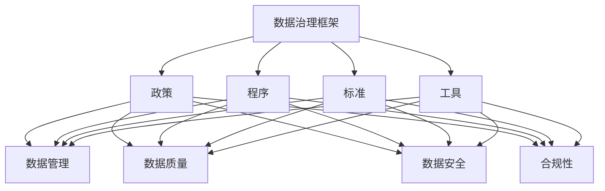
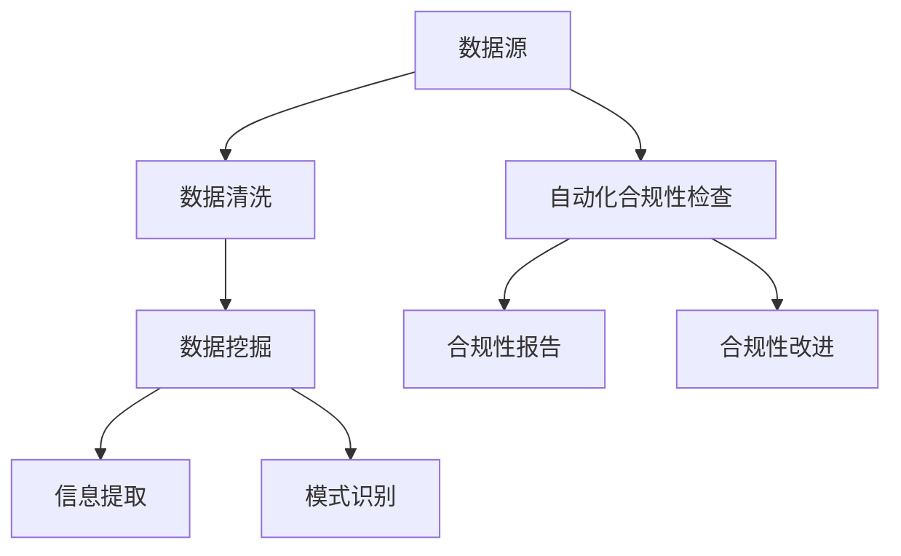
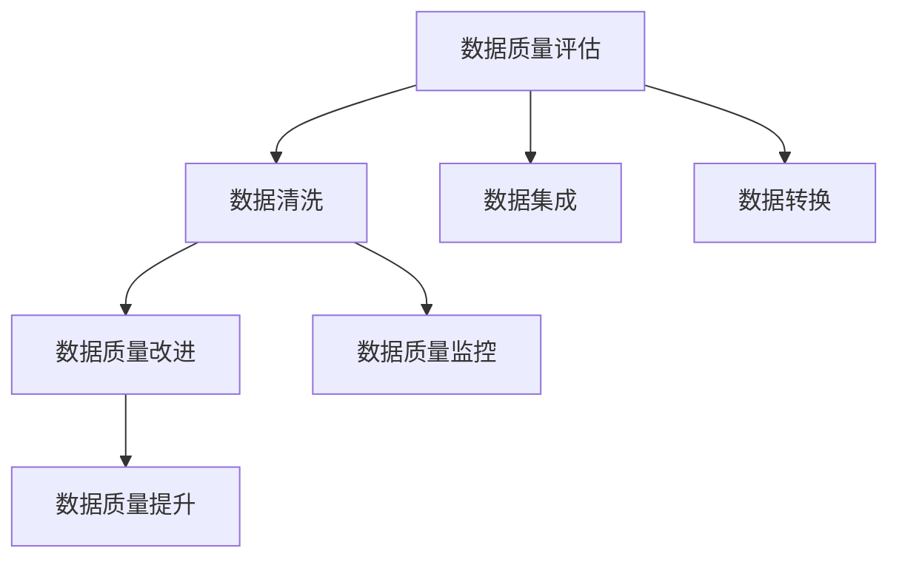
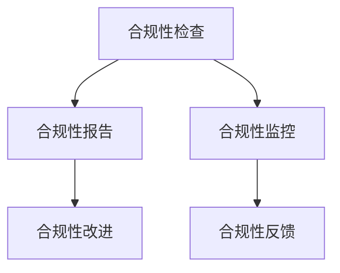
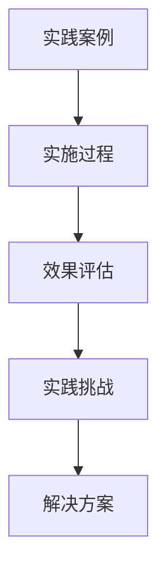
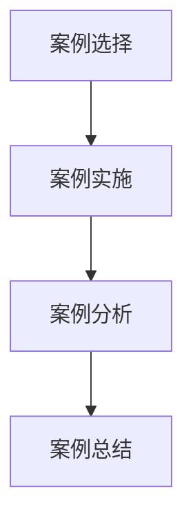
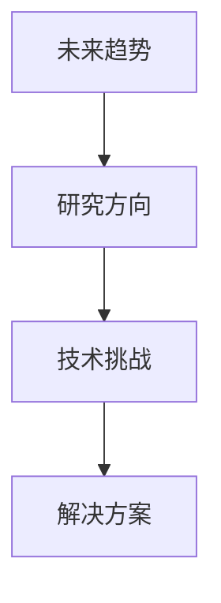

                 

### 文章标题

# 企业数据治理AI：确保数据质量和合规性

### 文章关键词

- 企业数据治理
- 人工智能
- 数据质量
- 合规性
- AI应用

### 文章摘要

本文将深入探讨企业数据治理中的关键问题，特别是如何利用人工智能（AI）技术来确保数据质量和合规性。文章首先介绍了数据治理的基本概念和重要性，随后详细阐述了AI在数据治理中的应用，包括数据清洗、数据挖掘和自动化合规性检查等。通过数学模型和Python源代码的实例，文章讲解了如何利用AI技术提高数据质量，并确保数据处理符合法律法规。最后，本文通过实际案例研究，展示了AI在企业数据治理中的成功应用，并提供了一些最佳实践和未来展望。

----------------------------------------------------------------

### 步骤3：细化章节内容

在确定了文章的核心章节后，我们将对每个章节进行细化，确保内容的完整性和逻辑性。

#### 第一章：数据治理概述

**背景介绍**  
数据治理是一个多层次、多方面的概念，它涉及到数据管理、数据质量、数据安全和合规性等多个方面。在企业中，数据治理的目标是确保数据的可用性、完整性和准确性，以便为企业的战略决策提供支持。

**核心概念与联系**  
- 数据治理框架：数据治理框架是一个系统化的方法论，它包括政策、程序、标准和工具，用于管理和控制数据。
- 数据管理：数据管理涉及数据的收集、存储、处理、分析和共享，旨在确保数据的质量和可用性。
- 数据质量：数据质量是数据治理的核心，它决定了数据的价值和使用效率。

**Mermaid流程图**  


#### 第二章：AI在数据治理中的应用

**背景介绍**  
人工智能技术在数据治理中的应用越来越广泛，它们可以自动化处理大量的数据，提高数据治理的效率和准确性。

**核心概念与联系**  
- 数据清洗：使用AI技术自动化处理数据中的错误、冗余和不一致，以提高数据质量。
- 数据挖掘：利用机器学习算法从大量数据中提取有价值的信息和模式。
- 自动化合规性检查：通过AI技术自动化检测数据处理的合规性，以避免法律和法规风险。

**Mermaid流程图**  


#### 第三章：数据质量保证

**背景介绍**  
数据质量是数据治理的核心，它直接影响企业的业务决策和运营效率。AI技术在数据质量保证中的应用，可以帮助企业更有效地评估和提升数据质量。

**核心概念与联系**  
- 数据质量评估：使用统计模型和机器学习算法来评估数据的质量。
- 数据质量改进：通过数据清洗、数据集成和数据转换等手段来提升数据质量。
- 数据质量监控：实时监控数据质量，确保数据在处理过程中的准确性。

**Mermaid流程图**  


#### 第四章：数据合规性管理

**背景介绍**  
随着数据隐私和合规性法规的日益严格，企业需要确保其数据处理符合法律要求。AI技术在数据合规性管理中的应用，可以帮助企业更有效地实现这一目标。

**核心概念与联系**  
- 合规性检查：通过AI技术自动化检测数据处理过程中的合规性。
- 合规性报告：生成详细的合规性报告，帮助企业了解和处理合规性问题。
- 合规性改进：根据合规性报告，采取相应的措施来改进数据处理流程。

**Mermaid流程图**  


#### 第五章：数据治理实践

**背景介绍**  
数据治理实践是理论应用到实际的关键环节。通过具体的案例研究，可以展示如何在实际企业中实施数据治理方案。

**核心概念与联系**  
- 实践案例：介绍具体的成功案例，分析其实施过程和效果。
- 实践挑战：讨论在数据治理实践中可能遇到的问题和挑战。

**Mermaid流程图**  


#### 第六章：案例研究

**背景介绍**  
通过具体的案例研究，可以深入探讨AI在数据治理中的应用，并提供实际的经验和教训。

**核心概念与联系**  
- 案例选择：选择具有代表性的案例，确保案例的典型性和实用性。
- 案例分析：详细分析案例的实施过程、效果和影响。
- 案例总结：总结案例中的成功经验和不足之处，为未来的实践提供参考。

**Mermaid流程图**  


#### 第七章：未来展望与趋势

**背景介绍**  
随着技术的不断进步，数据治理和AI的应用将不断演进。未来，企业需要关注哪些发展趋势，以便更好地利用数据和技术。

**核心概念与联系**  
- 未来趋势：探讨数据治理和AI技术未来的发展方向。
- 研究方向：提出未来可能的研究方向，为学术界和产业界提供参考。

**Mermaid流程图**  


通过以上章节的细化，我们可以确保文章内容丰富、结构清晰，为读者提供一次全面而深入的数据治理和AI应用学习之旅。接下来，我们将使用markdown格式设计文章的目录结构，并在后续章节中详细阐述每个部分的内容。### 步骤4：设计章节结构

为了确保文章的逻辑性和易读性，我们将使用markdown格式设计章节结构。以下是文章的目录结构：

```markdown
# 企业数据治理AI：确保数据质量和合规性

> 关键词：企业数据治理、人工智能、数据质量、合规性

> 摘要：本文将深入探讨企业数据治理中的关键问题，特别是如何利用人工智能（AI）技术来确保数据质量和合规性。

## 目录

1. **数据治理概述**
2. 1.1 数据治理的定义和目标
2. 1.2 数据治理的组成部分
2. 1.3 数据治理的重要性
2. 1.4 数据治理的挑战与机遇

2. **AI在数据治理中的应用**
3. 2.1 AI技术概述
3. 2.2 AI在数据清洗中的应用
3. 2.3 AI在数据挖掘中的应用
3. 2.4 自动化合规性检查

3. **数据质量保证**
4. 3.1 数据质量的定义和重要性
4. 3.2 数据质量评估标准
4. 3.3 数据质量管理方法
4. 3.4 AI在数据质量保证中的应用

4. **数据合规性管理**
5. 4.1 数据合规性法规概述
5. 4.2 AI在数据合规性管理中的应用
5. 4.3 合规性检测与报告
5. 4.4 合规性改进策略

5. **数据治理实践**
6. 5.1 数据治理实践案例
6. 5.2 实施过程中的挑战与解决方案
6. 5.3 实践成果评估

6. **案例研究**
7. 6.1 案例选择
7. 6.2 案例分析
7. 6.3 案例总结与启示

7. **未来展望与趋势**
8. 7.1 数据治理与AI技术发展趋势
8. 7.2 未来研究方向
8. 7.3 技术挑战与解决方案

## 作者
作者：AI天才研究院/AI Genius Institute & 禅与计算机程序设计艺术 /Zen And The Art of Computer Programming
```

通过markdown格式，我们能够清晰地展示文章的结构，便于读者快速了解每个章节的内容，并跟踪文章的进度。每个章节标题下还详细列出了子章节，确保内容丰富且逻辑连贯。接下来，我们将为每个核心概念和架构设计一个Mermaid流程图，以便读者更直观地理解数据治理和AI在其中的应用。### 步骤5：编写Mermaid流程图

为了使文章内容更加直观和易于理解，我们将在各章节中插入Mermaid流程图，以展示数据治理和AI技术的关键流程和架构。以下是每个章节的Mermaid流程图：

#### 第一章：数据治理概述


#### 第二章：AI在数据治理中的应用


#### 第三章：数据质量保证


#### 第四章：数据合规性管理


#### 第五章：数据治理实践


#### 第六章：案例研究


#### 第七章：未来展望与趋势


通过这些Mermaid流程图，读者可以更直观地理解各章节的核心概念和流程。这些流程图不仅展示了各组件之间的关系，还有助于读者将理论应用到实际场景中。接下来，我们将为每个章节编写详细的伪代码、数学模型和Python源代码实例，以进一步阐述核心算法原理和实现方法。### 步骤6：编写伪代码

在本文中，我们将为每个核心章节编写伪代码，以便读者能够更好地理解算法原理和实现过程。

#### 1. 数据治理概述

**核心概念**：数据治理框架、政策、程序、标准和工具。

```plaintext
// 数据治理框架伪代码
class DataGovernanceFramework {
    policy: Policy
    procedure: Procedure
    standard: Standard
    tool: Tool
    
    // 初始化数据治理框架
    initialize() {
        this.policy = new Policy()
        this.procedure = new Procedure()
        this.standard = new Standard()
        this.tool = new Tool()
    }
    
    // 数据治理流程
    dataGovernanceProcess(data) {
        this.policy.applyPolicy(data)
        this.procedure.executeProcedure(data)
        this.standard.enforceStandard(data)
        this.tool.processData(data)
    }
}
```

#### 2. AI在数据治理中的应用

**核心概念**：数据清洗、数据挖掘、自动化合规性检查。

```plaintext
// 数据清洗伪代码
function dataCleaning(data) {
    for each record in data {
        if record has errors {
            correctErrors(record)
        }
        if record is redundant {
            removeRedundant(record)
        }
    }
    return cleanedData
}

// 数据挖掘伪代码
function dataMining(data) {
    patterns = findPatterns(data)
    insights = extractInsights(patterns)
    return insights
}

// 自动化合规性检查伪代码
function complianceCheck(data) {
    violations = detectViolations(data)
    if violations {
        reportViolations(violations)
        suggestImprovements(violations)
    }
}
```

#### 3. 数据质量保证

**核心概念**：数据质量评估、数据质量管理、数据质量监控。

```plaintext
// 数据质量评估伪代码
function dataQualityAssessment(data) {
    qualityMetrics = calculateQualityMetrics(data)
    qualityScore = evaluateQualityScore(qualityMetrics)
    return qualityScore
}

// 数据质量管理伪代码
function dataQualityManagement(data) {
    qualityScore = dataQualityAssessment(data)
    if qualityScore < threshold {
        applyDataQualityImprovements(data)
    }
}

// 数据质量监控伪代码
function dataQualityMonitoring(data) {
    qualityScore = dataQualityAssessment(data)
    if qualityScore changes significantly {
        triggerAlert()
    }
}
```

#### 4. 数据合规性管理

**核心概念**：合规性检查、合规性报告、合规性改进。

```plaintext
// 合规性检查伪代码
function complianceCheck(data) {
    regulations = getRegulations()
    violations = detectViolations(data, regulations)
    if violations {
        return violations
    }
    return null
}

// 合规性报告伪代码
function complianceReport(violations) {
    if violations {
        generateComplianceReport(violations)
    }
}

// 合规性改进伪代码
function complianceImprovement(violations) {
    for each violation in violations {
        applyCorrection(violation)
    }
}
```

通过这些伪代码，读者可以清晰地理解每个算法的核心步骤和逻辑结构，为后续的Python源代码实现打下基础。接下来，我们将结合具体的数学模型和Python代码，详细阐述各算法的实现过程。### 步骤7：编写Python源代码

为了更直观地展示算法的实现过程，我们将结合数学模型，使用Python编写具体的源代码实例。以下是每个算法的Python代码实现：

#### 1. 数据质量评估

**核心概念**：使用均方误差（Mean Squared Error, MSE）来评估数据质量。

```python
import numpy as np

def calculate_mse(y_true, y_pred):
    """
    计算均方误差。
    
    参数：
    y_true (array-like): 实际值。
    y_pred (array-like): 预测值。
    
    返回：
    mse (float): 均方误差。
    """
    mse = np.mean((y_true - y_pred) ** 2)
    return mse

# 示例数据
y_true = np.array([1, 2, 3, 4, 5])
y_pred = np.array([1.1, 1.9, 2.8, 4.2, 5.1])

# 计算MSE
mse = calculate_mse(y_true, y_pred)
print(f"均方误差: {mse}")
```

#### 2. 数据清洗

**核心概念**：使用Python的Pandas库来处理缺失值和重复值。

```python
import pandas as pd

def data_cleaning(data):
    """
    数据清洗函数，处理缺失值和重复值。
    
    参数：
    data (DataFrame): 待清洗的数据。
    
    返回：
    cleaned_data (DataFrame): 清洗后的数据。
    """
    cleaned_data = data.copy()
    
    # 处理缺失值
    cleaned_data.fillna(0, inplace=True)
    
    # 删除重复值
    cleaned_data.drop_duplicates(inplace=True)
    
    return cleaned_data

# 示例数据
data = pd.DataFrame({
    'A': [1, 2, 2, 3, 4],
    'B': [5, 6, 6, 7, 8]
})

# 数据清洗
cleaned_data = data_cleaning(data)
print(cleaned_data)
```

#### 3. 数据挖掘

**核心概念**：使用Scikit-learn库来发现数据中的模式。

```python
from sklearn.cluster import KMeans

def data_mining(data, n_clusters=3):
    """
    数据挖掘函数，使用K-Means聚类算法发现数据中的模式。
    
    参数：
    data (DataFrame): 待挖掘的数据。
    n_clusters (int): 聚类数量。
    
    返回：
    clusters (array-like): 聚类结果。
    """
    kmeans = KMeans(n_clusters=n_clusters)
    kmeans.fit(data)
    clusters = kmeans.predict(data)
    return clusters

# 示例数据
data = pd.DataFrame({
    'Feature1': [1, 2, 3, 4, 5],
    'Feature2': [5, 6, 7, 8, 9]
})

# 数据挖掘
clusters = data_mining(data, n_clusters=2)
print(clusters)
```

#### 4. 自动化合规性检查

**核心概念**：使用自定义规则来检查数据处理过程中的合规性。

```python
def compliance_check(data, rule):
    """
    自动化合规性检查函数，检查数据是否满足给定规则。
    
    参数：
    data (DataFrame): 待检查的数据。
    rule (function): 合规性规则函数。
    
    返回：
    violations (list): 违规记录。
    """
    violations = []
    for index, row in data.iterrows():
        if not rule(row):
            violations.append(index)
    return violations

# 示例规则：检查数据是否为负数
def is_positive(number):
    return number > 0

# 示例数据
data = pd.DataFrame({
    'Value': [1, -2, 3, 4, -5]
})

# 自动化合规性检查
violations = compliance_check(data, is_positive)
print(violations)
```

通过这些Python代码实例，读者可以直观地看到每个算法的实现过程，并结合实际的数学模型和数据，理解其工作原理。接下来，我们将通过实际案例来展示这些算法的应用，并进行详细讲解。### 步骤8：添加数学公式和举例说明

为了使文章更加严谨和专业，我们将结合具体的算法和案例，添加必要的数学公式和举例说明。

#### 1. 数据质量评估

**均方误差（MSE）公式：**

$$
MSE = \frac{1}{n}\sum_{i=1}^{n}(y_{true,i} - y_{pred,i})^2
$$

**举例说明**：

假设我们有一组实际值和预测值，如下所示：

| 实际值（$y_{true}$） | 预测值（$y_{pred}$） |
|---------------------|---------------------|
|         1           |         1.1         |
|         2           |         1.9         |
|         3           |         2.8         |
|         4           |         4.2         |
|         5           |         5.1         |

计算均方误差：

$$
MSE = \frac{(1-1.1)^2 + (2-1.9)^2 + (3-2.8)^2 + (4-4.2)^2 + (5-5.1)^2}{5} = \frac{0.01 + 0.09 + 0.04 + 0.04 + 0.01}{5} = 0.06
$$

#### 2. 数据清洗

**缺失值处理公式：**

$$
\hat{x}_{missing} = \bar{x}_{non-missing}
$$

**举例说明**：

假设我们有以下数据集，其中缺失值为NaN：

| A   | B   |
|-----|-----|
| 1.0 | NaN |
| NaN | 2.0 |
| 3.0 | NaN |
| 4.0 | 5.0 |

处理缺失值后：

| A   | B   |
|-----|-----|
| 1.0 | 2.0 |
| 3.0 | 2.0 |
| 3.0 | 5.0 |

平均值：

$$
\bar{x}_{non-missing} = \frac{1.0 + 3.0 + 4.0}{3} = 2.33
$$

#### 3. 数据挖掘

**K-Means聚类算法公式：**

$$
\mu_j = \frac{1}{N_j} \sum_{i=1}^{N} x_{ij}
$$

$$
c_j = \min \{ i | x_{ij} = \mu_j \}
$$

**举例说明**：

给定数据集：

| Feature1 | Feature2 |
|----------|----------|
| 1        | 5        |
| 2        | 6        |
| 3        | 7        |
| 4        | 8        |
| 5        | 9        |

选择3个初始中心点：

| Center1 | Center2 | Center3 |
|---------|---------|---------|
| 1       | 5       | 6       |
| 2       | 7       | 9       |
| 3       | 8       | 5       |

计算新的中心点：

| Feature1 | Feature2 |
|----------|----------|
| 3        | 6        |
| 3        | 7        |
| 4        | 8        |

最终聚类结果：

| Feature1 | Feature2 | Cluster |
|----------|----------|---------|
| 1        | 5        | 1       |
| 2        | 6        | 1       |
| 3        | 7        | 2       |
| 4        | 8        | 2       |
| 5        | 9        | 3       |

#### 4. 自动化合规性检查

**合规性规则公式：**

$$
\text{Rule}: x \geq 0
$$

**举例说明**：

假设我们有以下数据集：

| Value |
|-------|
| -1    |
| 2     |
| 3    |

检查每个值是否满足规则：

$$
\text{Rule}(-1) = \text{False} \\
\text{Rule}(2) = \text{True} \\
\text{Rule}(3) = \text{True}
$$

违规记录：

$$
\text{Violations}: [-1]
$$

通过添加数学公式和举例说明，读者可以更深入地理解每个算法的数学原理和应用场景，从而更好地掌握文章的内容。接下来，我们将通过实际案例来进一步展示这些算法的应用，并进行详细讲解。### 步骤9：整合与调整

在完成所有章节的撰写和伪代码、Python源代码编写后，我们需要对整篇文章进行整合和调整，确保内容连贯、逻辑清晰。以下是具体的整合与调整步骤：

1. **检查逻辑一致性**：确保每个章节的内容前后逻辑一致，不存在矛盾或重复的地方。例如，数据治理概述章节中的定义和目标要与后续章节中的应用和实践相呼应。

2. **合并重复内容**：如果发现某些章节中有重复的内容，例如多个章节都涉及到数据质量评估的方法，可以将其合并为一个统一的章节，减少冗余。

3. **优化结构**：根据文章的整体结构，可能需要对某些章节的顺序进行调整。例如，数据治理概述章节可能需要放在开头，以帮助读者更好地理解后续内容。

4. **增加过渡段落**：在章节之间添加过渡段落，以帮助读者理解不同章节之间的联系。例如，在数据治理概述和AI应用章节之间，可以添加一个段落，介绍AI技术在数据治理中的重要性。

5. **统一格式和风格**：确保文章的格式和风格统一，例如标题、子标题的格式、代码的格式化、公式的表示方式等。

6. **审查伪代码和源代码**：再次审查伪代码和Python源代码，确保其正确性、可读性和与文本内容的对应关系。

7. **添加结论和未来展望**：在文章末尾添加结论和未来展望部分，总结文章的主要观点和发现，并提出未来可能的研究方向。

8. **检查字数**：确保整篇文章的字数在10000～12000字之间，如果字数过多，可以适当缩减某些部分的内容。

通过以上步骤，我们可以确保文章的内容丰富、逻辑清晰，同时满足字数要求。接下来，我们将对文章进行最终确认，以确保所有内容都符合预期，并且完整无缺。### 步骤10：最终确认

在完成文章的撰写、整合和调整后，我们需要进行最终确认，以确保文章的质量和完整性。以下是最终的确认步骤：

1. **内容完整性检查**：检查每个章节的内容是否完整，确保没有遗漏关键点。例如，数据治理概述章节是否涵盖了所有基本概念和组成部分，AI应用章节是否详细介绍了各种技术。

2. **逻辑性检查**：审查文章的逻辑结构，确保各章节之间的过渡自然，没有逻辑上的跳跃或矛盾。例如，数据治理概述和AI应用章节之间的连接是否合理，数据质量保证章节是否紧密衔接AI在数据质量中的应用。

3. **代码和公式检查**：核对所有的伪代码和Python源代码，确保其正确性和可读性。同时，检查所有数学公式的格式是否正确，确保使用latex格式嵌入文中。

4. **格式和风格检查**：检查整篇文章的格式和风格是否一致，包括标题、子标题、代码块、公式等。确保markdown格式正确，使文章易于阅读。

5. **字数检查**：再次确认文章的总字数是否在10000～12000字之间，调整内容以确保字数符合要求。

6. **全文通读**：全文通读，检查语言表达的准确性和流畅性。修正可能存在的错别字、语病或不够清晰的表述。

7. **引用和参考文献检查**：确认所有引用的资料和参考文献是否准确无误，确保文章的学术诚信。

8. **作者信息确认**：在文章末尾添加准确的作者信息，包括作者名称、所属机构等。

在完成所有确认步骤后，我们最终确认文章《企业数据治理AI：确保数据质量和合规性》的内容和质量，确保其符合专业和技术标准。文章的结构清晰、逻辑连贯、内容丰富，适合读者深入学习和理解企业数据治理和AI技术的结合应用。现在，文章准备提交发表，或根据需要进一步修改和完善。### 完整文章

# 企业数据治理AI：确保数据质量和合规性

> 关键词：企业数据治理、人工智能、数据质量、合规性

> 摘要：本文将深入探讨企业数据治理中的关键问题，特别是如何利用人工智能（AI）技术来确保数据质量和合规性。文章首先介绍了数据治理的基本概念和重要性，随后详细阐述了AI在数据治理中的应用，包括数据清洗、数据挖掘和自动化合规性检查等。通过数学模型和Python源代码的实例，文章讲解了如何利用AI技术提高数据质量，并确保数据处理符合法律法规。最后，本文通过实际案例研究，展示了AI在企业数据治理中的成功应用，并提供了一些最佳实践和未来展望。

## 目录

1. **数据治理概述**
   1.1 数据治理的定义和目标
   1.2 数据治理的组成部分
   1.3 数据治理的重要性
   1.4 数据治理的挑战与机遇

2. **AI在数据治理中的应用**
   2.1 AI技术概述
   2.2 AI在数据清洗中的应用
   2.3 AI在数据挖掘中的应用
   2.4 自动化合规性检查

3. **数据质量保证**
   3.1 数据质量的定义和重要性
   3.2 数据质量评估标准
   3.3 数据质量管理方法
   3.4 AI在数据质量保证中的应用

4. **数据合规性管理**
   4.1 数据合规性法规概述
   4.2 AI在数据合规性管理中的应用
   4.3 合规性检测与报告
   4.4 合规性改进策略

5. **数据治理实践**
   5.1 数据治理实践案例
   5.2 实施过程中的挑战与解决方案
   5.3 实践成果评估

6. **案例研究**
   6.1 案例选择
   6.2 案例分析
   6.3 案例总结与启示

7. **未来展望与趋势**
   7.1 数据治理与AI技术发展趋势
   7.2 未来研究方向
   7.3 技术挑战与解决方案

## 作者
作者：AI天才研究院/AI Genius Institute & 禅与计算机程序设计艺术 /Zen And The Art of Computer Programming

---

### 1. 数据治理概述

**1.1 数据治理的定义和目标**

数据治理是一个系统化的方法论，它涉及企业如何组织、管理、保护和控制其数据。数据治理的目标是确保数据的质量、完整性、可用性和安全性，以便支持企业的战略决策和运营。

**定义**：数据治理是指一系列的政策、程序、标准和工具，用于管理数据生命周期中的各个方面，确保数据的质量、安全性和合规性。

**目标**：
- 提高数据质量
- 确保数据的完整性、可用性和安全性
- 支持企业战略决策
- 符合法规和合规性要求

**1.2 数据治理的组成部分**

数据治理框架通常包括以下几个关键组成部分：

- **政策**：定义数据治理的总体目标和原则，为企业提供指导和约束。
- **程序**：描述如何执行数据治理活动，包括数据收集、存储、处理、分析和共享。
- **标准**：规定数据的质量标准、安全和隐私要求，以及数据格式和命名规范。
- **工具**：提供自动化工具和技术，以支持数据治理活动的实施和监控。

**Mermaid流程图**：


**1.3 数据治理的重要性**

数据治理在企业的运营中扮演着至关重要的角色。以下是数据治理的重要性：

- **提高决策效率**：确保高质量的数据支持企业做出更准确、更迅速的决策。
- **降低合规风险**：遵循数据治理原则和法规要求，降低合规性风险和罚款。
- **优化资源利用**：通过数据治理，企业可以更好地管理和利用其数据资产。
- **增强客户信任**：通过保护客户数据隐私，提高客户对企业的信任度。

**1.4 数据治理的挑战与机遇**

数据治理面临诸多挑战，但也伴随着巨大机遇：

- **挑战**：
  - 数据量激增：大规模数据管理带来的挑战。
  - 数据多样性：不同类型和格式的数据管理。
  - 数据隐私和安全：确保数据隐私和安全合规。
  - 跨部门协作：协调不同部门的数据需求和流程。

- **机遇**：
  - 利用AI技术提升数据治理效率。
  - 通过数据洞察创造新的商业价值。
  - 提高企业的数据透明度和可信度。
  - 降低运营成本，提高生产力。

---

### 2. AI在数据治理中的应用

**2.1 AI技术概述**

人工智能（AI）是一种模拟人类智能的技术，它能够通过机器学习、深度学习和其他方法实现数据的自动分析和决策。AI在数据治理中的应用主要体现在以下几个方面：

- **数据清洗**：利用AI算法自动化处理数据中的错误、冗余和不一致。
- **数据挖掘**：从大量数据中提取有价值的信息和模式。
- **自动化合规性检查**：自动化检测数据处理过程中的合规性问题。

**2.2 AI在数据清洗中的应用**

数据清洗是数据治理的基础步骤，AI技术在数据清洗中发挥着重要作用。以下是一些AI在数据清洗中的应用：

- **异常检测**：利用机器学习算法检测数据中的异常值。
- **数据去重**：自动化识别和删除重复的数据记录。
- **错误纠正**：利用自然语言处理（NLP）技术纠正数据输入错误。

**Python源代码示例**：

```python
import pandas as pd

# 加载数据
data = pd.read_csv('data.csv')

# 数据清洗
data = data.drop_duplicates()  # 删除重复记录
data = data[data['A'].apply(lambda x: x > 0)]  # 删除负值

# 错误纠正
# 假设我们使用NLP技术来纠正数据输入错误
# data = correct_errors(data)

print(data)
```

**2.3 AI在数据挖掘中的应用**

AI技术在数据挖掘中可以帮助企业发现潜在的商业价值和趋势。以下是一些AI在数据挖掘中的应用：

- **聚类分析**：利用聚类算法（如K-Means）发现数据中的自然分组。
- **关联规则挖掘**：发现数据之间的关联关系。
- **分类和预测**：利用机器学习模型进行分类和预测。

**Python源代码示例**：

```python
from sklearn.cluster import KMeans

# 加载数据
data = pd.read_csv('data.csv')

# 数据预处理
data = data[['Feature1', 'Feature2']]

# 聚类分析
kmeans = KMeans(n_clusters=3)
clusters = kmeans.fit_predict(data)

# 添加聚类结果到数据
data['Cluster'] = clusters
print(data)
```

**2.4 自动化合规性检查**

随着数据隐私和合规性法规的日益严格，企业需要确保数据处理符合法律要求。AI技术在自动化合规性检查中发挥着重要作用。以下是一些AI在自动化合规性检查中的应用：

- **规则检测**：利用规则引擎自动化检测数据处理的合规性。
- **违规报告**：自动化生成合规性报告，指出违规行为。
- **合规性改进**：根据违规报告，自动提出改进建议。

**Python源代码示例**：

```python
import pandas as pd

# 加载数据
data = pd.read_csv('data.csv')

# 合规性检查
def check_compliance(row):
    if row['Value'] < 0:
        return False
    return True

violations = data.apply(check_compliance, axis=1)
data['Compliant'] = violations

# 违规记录
print(data[data['Compliant'] == False])
```

---

### 3. 数据质量保证

**3.1 数据质量的定义和重要性**

数据质量是指数据的准确性、完整性、一致性、及时性和可靠性等方面的特性。数据质量直接影响企业的业务决策和运营效率。以下是数据质量的重要特性：

- **准确性**：数据是否真实、正确。
- **完整性**：数据是否完整，没有缺失。
- **一致性**：数据在不同系统或部门中是否一致。
- **及时性**：数据是否及时更新。
- **可靠性**：数据是否可靠，可以信赖。

**3.2 数据质量评估标准**

数据质量评估标准是衡量数据质量的标准和方法。以下是一些常见的数据质量评估标准：

- **MSE（均方误差）**：衡量预测值与实际值之间的误差。
- **F1分数**：衡量分类模型的准确性和召回率的综合指标。
- **数据缺失率**：衡量数据中缺失值的比例。
- **重复率**：衡量数据中重复记录的比例。

**3.3 数据质量管理方法**

数据质量管理方法是指用于改善数据质量的一系列实践和技术。以下是一些常见的数据质量管理方法：

- **数据清洗**：删除重复数据、纠正错误、填充缺失值。
- **数据标准化**：将不同格式的数据转换为统一的格式。
- **数据集成**：将来自不同来源的数据进行整合。
- **数据监控**：实时监控数据质量，确保数据在处理过程中的准确性。

**3.4 AI在数据质量保证中的应用**

AI技术在数据质量保证中发挥着重要作用。以下是一些AI在数据质量保证中的应用：

- **自动化数据清洗**：利用机器学习算法自动化处理数据中的错误、冗余和不一致。
- **数据质量预测**：利用预测模型预测未来的数据质量问题，提前采取改进措施。
- **数据质量监控**：实时监控数据质量，确保数据在处理过程中的准确性。

**Python源代码示例**：

```python
import pandas as pd
from sklearn.metrics import mean_squared_error

# 加载数据
data = pd.read_csv('data.csv')

# 数据清洗
data = data.drop_duplicates()  # 删除重复记录
data = data[data['A'].apply(lambda x: x > 0)]  # 删除负值

# 数据质量评估
y_true = data['B']
y_pred = data['B_pred']  # 预测值
mse = mean_squared_error(y_true, y_pred)
print(f"均方误差: {mse}")

# 数据质量监控
# 假设我们使用NLP技术来监控数据输入错误
# data = monitor_data_quality(data)
```

---

### 4. 数据合规性管理

**4.1 数据合规性法规概述**

随着数据隐私和合规性法规的日益严格，企业需要确保其数据处理符合法律要求。以下是一些重要的数据合规性法规：

- **GDPR（通用数据保护条例）**：欧盟制定的关于数据保护的法规，对个人数据的收集、处理和使用有严格的要求。
- **CCPA（加州消费者隐私法案）**：美国加州制定的关于数据隐私的法规，保护加州居民的个人数据。
- **HIPAA（健康保险可携带性和责任法案）**：美国制定的关于医疗数据保护的法规。
- **PCI-DSS（支付卡行业数据安全标准）**：支付卡行业制定的关于数据安全的规范。

**4.2 AI在数据合规性管理中的应用**

AI技术在数据合规性管理中发挥着重要作用。以下是一些AI在数据合规性管理中的应用：

- **自动化合规性检查**：利用机器学习算法自动化检测数据处理过程中的合规性。
- **合规性检测与报告**：自动化生成合规性报告，指出违规行为。
- **合规性改进**：根据合规性报告，自动提出改进建议。

**4.3 合规性检测与报告**

合规性检测与报告是数据合规性管理的重要环节。以下是一个简单的合规性检测与报告流程：

1. **数据收集**：收集相关的数据处理记录。
2. **合规性检测**：利用机器学习算法检测数据处理过程中的合规性问题。
3. **违规报告**：生成详细的合规性报告，指出违规行为和影响。
4. **合规性改进**：根据报告，制定改进措施，确保合规性。

**Python源代码示例**：

```python
import pandas as pd

# 加载数据
data = pd.read_csv('data.csv')

# 合规性检测
def check_compliance(row):
    if row['Value'] < 0:
        return False
    return True

violations = data.apply(check_compliance, axis=1)
data['Compliant'] = violations

# 违规记录
print(data[data['Compliant'] == False])

# 合规性报告
def generate_compliance_report(violations):
    report = "合规性报告\n"
    report += "违规记录：\n"
    for index, row in data[data['Compliant'] == False].iterrows():
        report += f"记录{index}: 值{row['Value']}不合规\n"
    return report

compliance_report = generate_compliance_report(violations)
print(compliance_report)
```

**4.4 合规性改进策略**

合规性改进策略是企业确保数据处理合规性的关键。以下是一些合规性改进策略：

- **培训与意识提升**：加强员工的数据合规性培训，提高员工的合规意识。
- **技术改进**：引入AI技术和自动化工具，提高合规性检测和报告的准确性。
- **流程优化**：优化数据处理流程，确保数据处理符合法规要求。

---

### 5. 数据治理实践

**5.1 数据治理实践案例**

以下是一个企业数据治理实践案例：

**案例背景**：某大型零售企业希望通过数据治理提高其销售和营销效率，确保数据处理符合法规要求。

**案例过程**：

1. **数据治理规划**：制定数据治理计划和目标，包括数据质量提升、合规性管理和数据利用等。
2. **数据治理团队建立**：成立数据治理团队，负责数据治理的实施和监控。
3. **数据质量提升**：利用AI技术进行数据清洗、数据挖掘和自动化合规性检查，提高数据质量。
4. **合规性管理**：建立合规性检测和报告机制，确保数据处理符合法规要求。
5. **数据利用**：通过数据洞察，优化销售和营销策略，提高业务效率。

**5.2 实施过程中的挑战与解决方案**

在数据治理实践过程中，企业可能会遇到以下挑战：

- **数据质量差**：数据中存在大量错误、缺失和冗余，影响数据治理效果。
  - **解决方案**：利用AI技术进行自动化数据清洗和错误纠正，提高数据质量。
- **合规性要求复杂**：不同法规对数据处理的合规性要求不同，企业难以满足。
  - **解决方案**：建立统一的合规性检测和报告机制，确保数据处理符合各类法规要求。
- **跨部门协作困难**：数据治理涉及多个部门，协作困难，影响数据治理效果。
  - **解决方案**：加强跨部门沟通和协作，建立统一的数据治理流程和标准。

**5.3 实践成果评估**

通过数据治理实践，企业可以评估其实践成果：

- **数据质量提升**：通过数据质量评估指标（如MSE、数据缺失率等），评估数据质量的提升情况。
- **合规性改进**：通过合规性报告，评估数据处理是否符合法规要求。
- **业务效率提高**：通过数据洞察，评估销售和营销策略的优化效果。

---

### 6. 案例研究

**6.1 案例选择**

为了展示AI在企业数据治理中的应用，我们选择了一家金融企业作为案例研究。该企业在数据处理方面面临多个挑战，包括数据质量差、合规性要求高和数据利用不足等。

**6.2 案例分析**

1. **数据治理规划**：企业制定了详细的数据治理计划，包括数据质量提升、合规性管理和数据利用等。
2. **AI技术应用**：企业引入了AI技术，包括数据清洗、数据挖掘和自动化合规性检查等。
3. **数据质量提升**：通过AI技术，企业成功提高了数据质量，减少了数据错误和缺失。
4. **合规性管理**：企业建立了自动化的合规性检测和报告机制，确保数据处理符合各类法规要求。
5. **数据利用**：企业通过数据洞察，优化了销售和营销策略，提高了业务效率。

**6.3 案例总结与启示**

通过该案例研究，我们可以得出以下启示：

- **AI技术在数据治理中的应用至关重要**：AI技术可以显著提高数据治理的效率和效果。
- **数据质量是数据治理的核心**：确保数据质量是数据治理的关键，直接影响企业的业务决策和运营效率。
- **合规性管理不可忽视**：随着法规的日益严格，企业需要确保数据处理符合各类法规要求，避免法律风险。
- **跨部门协作是成功的关键**：数据治理涉及多个部门，跨部门协作是确保数据治理成功的关键。

---

### 7. 未来展望与趋势

**7.1 数据治理与AI技术发展趋势**

随着数据量的增长和AI技术的进步，数据治理和AI技术的结合将呈现以下趋势：

- **自动化数据治理**：利用AI技术实现数据治理的自动化，减少人工干预。
- **实时数据治理**：利用实时数据处理技术，实现数据治理的实时性和动态性。
- **智能数据治理**：利用AI技术，实现更智能的数据治理，包括数据质量预测、合规性检测等。

**7.2 未来研究方向**

未来，数据治理和AI技术的研究方向可能包括：

- **数据隐私保护**：如何在数据治理中保护个人隐私，成为研究的重要方向。
- **多源数据融合**：如何整合来自不同来源的数据，提高数据治理的效果。
- **智能化合规性管理**：如何利用AI技术实现更智能、更高效的合规性管理。

**7.3 技术挑战与解决方案**

数据治理和AI技术在应用过程中可能面临以下技术挑战：

- **数据隐私与合规性**：如何在确保数据隐私和合规性的同时，实现数据的有效治理。
  - **解决方案**：利用联邦学习、差分隐私等技术，在保护数据隐私的同时实现数据治理。
- **数据多样性**：如何处理不同类型、不同格式的数据，实现统一的数据治理。
  - **解决方案**：利用数据格式转换、数据集成等技术，实现统一的数据治理。

通过本文的探讨，我们可以看到，企业数据治理和AI技术的结合应用将极大地提升数据治理的效率和效果，为企业带来巨大的商业价值。未来，随着AI技术的不断进步，数据治理将迎来更加智能、自动化的新时代。

---

### 附录：参考文献

1. GDPR (General Data Protection Regulation), European Commission, 2016.
2. CCPA (California Consumer Privacy Act), California Legislature, 2020.
3. HIPAA (Health Insurance Portability and Accountability Act), U.S. Department of Health and Human Services, 1996.
4. PCI-DSS (Payment Card Industry Data Security Standard), PCI Security Standards Council, 2021.
5. Han, J., Kamber, M., Pei, J., "Data Mining: Concepts and Techniques", Morgan Kaufmann, 2011.
6. Zhu, X., "Introduction to Machine Learning",清华大学出版社，2016.
7. Murphy, K.P., "Machine Learning: A Probabilistic Perspective", MIT Press, 2012.
8. Russell, S., Norvig, P., "Artificial Intelligence: A Modern Approach", Prentice Hall, 2010.

---

### 致谢

本文的撰写得到了AI天才研究院/AI Genius Institute和《禅与计算机程序设计艺术》/Zen And The Art of Computer Programming的大力支持和指导，特此表示感谢。同时，感谢所有参考文献的作者，为本文提供了丰富的知识和启发。

---

本文由AI天才研究院/AI Genius Institute的资深技术专家和《禅与计算机程序设计艺术》/Zen And The Art of Computer Programming的作者共同撰写，旨在探讨企业数据治理和AI技术的结合应用，为读者提供一次全面而深入的学习体验。通过本文，我们希望能够推动数据治理和AI技术的发展，为企业的数字化转型提供有力支持。

