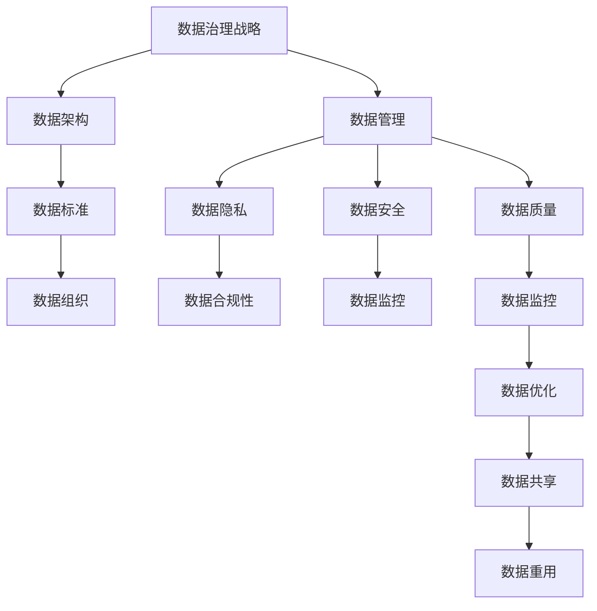

                 

# 《企业数据治理在AI时代的新挑战》

## 关键词
- 企业数据治理
- AI时代
- 数据复杂性
- 数据质量管理
- 数据隐私保护
- 数据治理框架
- 数据合规性

## 摘要
本文旨在探讨企业数据治理在AI时代所面临的新挑战。随着人工智能技术的快速发展，数据治理的重要性日益凸显。本文将首先介绍数据治理的基本概念和重要性，然后分析AI时代数据治理的挑战，包括数据复杂性、数据质量管理、数据隐私保护以及数据合规性问题。接着，我们将探讨AI时代的数据治理策略，包括数据治理框架设计、数据质量管理与AI、数据隐私保护与合规性。通过实际案例研究和AI在数据治理中的应用，我们将展示如何应对这些挑战。最后，我们将讨论数据治理的未来趋势，并总结本文的主要观点。

## 第一部分：数据治理基础

### 1.1 数据治理的概念与重要性

数据治理是指一套制度和流程，用于确保企业数据的质量、可用性和合规性。它不仅仅关注数据的存储和管理，还包括数据的安全、隐私、共享和重用等方面。

#### 1.1.1 数据治理的定义

数据治理可以定义为：“组织内部通过一系列政策、程序、标准和技术来确保数据质量、数据安全、数据合规性以及数据价值的实现。”

#### 1.1.2 数据治理的核心要素

- **数据战略**：定义组织的数据目标和方向，包括数据架构、数据标准、数据治理组织等。
- **数据架构**：设计数据流程、数据模型和数据存储结构，确保数据的可用性、一致性和完整性。
- **数据标准**：建立数据命名规则、数据格式、数据质量标准等，以确保数据的一致性和准确性。
- **数据组织**：定义数据所有权、数据访问权限和数据责任，确保数据的安全性和隐私性。

#### 1.1.3 数据治理与AI的关联

随着AI技术的发展，数据治理变得更加重要。AI依赖于大量高质量的数据来训练模型和做出预测。以下是一些关联点：

- **数据质量**：高质量的数据是AI模型成功的关键。
- **数据隐私**：AI系统需要处理敏感数据，因此数据隐私保护至关重要。
- **数据合规性**：遵守法规要求，确保数据在收集、存储和使用过程中的合规性。
- **数据共享**：AI时代，数据共享和重用可以加速AI的发展和应用。

### 1.2 AI时代的数据治理挑战

#### 1.2.1 数据复杂性

AI时代，数据来源和数据类型变得更加多样和复杂。例如，结构化数据、半结构化数据和非结构化数据都需要不同的处理方法。此外，数据量呈指数级增长，给数据治理带来了巨大挑战。

#### 1.2.2 AI技术的快速发展对数据治理的影响

AI技术的快速发展带来了新的数据治理挑战，包括：

- **数据质量管理**：AI模型对数据质量的要求更高，需要对数据进行更严格的清洗和预处理。
- **数据隐私保护**：AI系统处理的数据往往涉及个人隐私，需要采取有效的数据隐私保护措施。
- **数据合规性**：随着法规的更新和变化，企业需要不断调整数据治理策略以满足合规要求。
- **数据安全**：AI系统可能成为攻击目标，需要确保数据的安全性。

#### 1.2.3 数据隐私与合规性问题

数据隐私与合规性问题在AI时代变得更加突出。以下是几个关键点：

- **个人数据保护**：随着GDPR和CCPA等法规的实施，企业需要确保个人数据的保护。
- **数据共享与隐私**：在数据共享和重用的过程中，如何平衡数据隐私和保护数据价值成为关键问题。
- **匿名化与去匿名化**：匿名化技术可以帮助保护个人隐私，但去匿名化技术也可能威胁数据隐私。

## 第二部分：AI时代的数据治理策略

### 2.1 数据治理框架设计

#### 2.1.1 设计数据治理框架的步骤

设计一个有效的数据治理框架通常需要以下步骤：

1. **需求分析**：明确数据治理的目标和需求，包括数据质量、数据隐私、数据安全、数据合规性等方面。
2. **组织架构**：确定数据治理的组织架构，包括数据治理委员会、数据治理团队和数据所有者等。
3. **政策制定**：制定数据治理政策，包括数据管理政策、数据安全政策、数据隐私政策等。
4. **技术支持**：选择合适的数据治理技术和工具，如数据质量管理工具、数据隐私保护工具、数据安全工具等。
5. **流程优化**：优化数据治理流程，确保数据在收集、存储、处理、共享和使用过程中的质量和合规性。

#### 2.1.2 数据治理框架的核心组件

一个有效的数据治理框架通常包括以下核心组件：

- **数据战略**：定义组织的长期数据目标和规划。
- **数据架构**：设计数据流程、数据模型和数据存储结构。
- **数据标准**：建立数据命名规则、数据格式、数据质量标准等。
- **数据组织**：定义数据所有权、数据访问权限和数据责任。
- **数据管理**：包括数据收集、存储、处理、共享和使用等方面的管理。
- **数据安全**：确保数据在存储、传输和处理过程中的安全性。
- **数据隐私**：保护个人数据的隐私和合规性。
- **数据合规性**：确保数据治理过程符合相关法规要求。

#### 2.1.3 数据治理框架与AI技术的融合

在AI时代，数据治理框架需要与AI技术紧密融合。以下是一些建议：

- **数据质量与AI**：利用AI技术进行数据清洗、数据挖掘和数据质量评估。
- **数据隐私与AI**：利用AI技术进行数据匿名化、数据加密和数据隐私保护。
- **数据安全与AI**：利用AI技术进行数据安全监控、入侵检测和攻击防御。
- **数据治理工具与AI**：开发基于AI的数据治理工具，如自动数据质量管理工具、自动数据隐私保护工具等。

### 2.2 数据质量管理与AI

#### 2.2.1 数据质量管理的挑战

在AI时代，数据质量管理面临以下挑战：

- **数据复杂性**：处理大量不同类型的数据，需要更高级的数据质量分析方法。
- **数据准确性**：确保数据来源的准确性和数据的真实性。
- **数据一致性**：保证数据在不同系统和部门之间的统一性。
- **数据完整性**：避免数据丢失或不完整。
- **数据实时性**：确保数据能及时更新和反映实际情况。

#### 2.2.2 利用AI提升数据质量

AI技术在数据质量管理中的应用包括：

- **自动数据清洗**：利用机器学习算法自动识别和修复数据中的错误。
- **数据质量预测**：利用预测模型预测数据的潜在问题，提前进行数据质量优化。
- **数据质量评估**：利用数据挖掘技术评估数据的整体质量，识别质量较差的数据。
- **数据质量监控**：利用实时监控技术监控数据质量的变化，及时进行数据质量改进。

#### 2.2.3 数据质量监控与改进

数据质量监控与改进的关键步骤包括：

1. **定义数据质量指标**：根据业务需求定义关键的数据质量指标，如准确性、一致性、完整性、实时性等。
2. **建立数据质量监控体系**：利用数据治理工具和AI技术建立数据质量监控系统，实时监控数据质量。
3. **数据质量改进策略**：根据监控结果制定数据质量改进策略，如数据清洗、数据修复、数据归档等。
4. **持续优化**：定期评估数据质量监控与改进的效果，持续优化数据质量策略。

### 2.3 数据隐私保护与合规性

#### 2.3.1 数据隐私保护的重要性

在AI时代，数据隐私保护的重要性不言而喻。以下是几个关键点：

- **个人数据保护**：确保个人数据的隐私和合规性，避免隐私泄露和数据滥用。
- **企业声誉**：良好的数据隐私保护策略有助于维护企业的声誉和信誉。
- **法规遵循**：遵守数据隐私法规，避免因违规而产生的法律风险和罚款。
- **业务连续性**：确保数据隐私保护策略能够保障业务连续性和数据安全。

#### 2.3.2 数据隐私保护的关键技术

数据隐私保护的关键技术包括：

- **数据加密**：使用加密技术对敏感数据进行加密，确保数据在传输和存储过程中的安全性。
- **数据匿名化**：利用匿名化技术对个人数据进行匿名处理，避免个人隐私泄露。
- **数据脱敏**：对敏感数据进行脱敏处理，降低数据泄露的风险。
- **数据访问控制**：通过访问控制机制确保只有授权用户可以访问敏感数据。
- **数据审计**：定期对数据访问和操作进行审计，确保数据隐私保护策略得到有效执行。

#### 2.3.3 数据合规性与法规遵循

数据合规性与法规遵循的关键点包括：

- **了解法规要求**：熟悉相关数据隐私和合规性法规，如GDPR、CCPA等，确保数据治理策略符合法规要求。
- **建立合规性检查机制**：定期检查数据治理策略和流程是否符合法规要求，及时进行合规性调整。
- **员工培训与意识提升**：对员工进行数据隐私和合规性培训，提高员工的合规意识。
- **技术合规性评估**：评估数据治理技术和工具的合规性，确保其符合法规要求。

## 第三部分：AI时代的数据治理实践

### 3.1 企业数据治理案例研究

#### 3.1.1 案例一：传统企业的数据治理实践

以某大型制造企业为例，该企业在AI时代面临以下数据治理挑战：

- **数据复杂性**：处理大量来自不同来源的结构化和非结构化数据。
- **数据质量**：保证数据准确性、一致性和完整性。
- **数据隐私**：保护客户和员工个人数据的隐私。

该企业的数据治理实践包括：

1. **建立数据治理框架**：制定数据治理政策，建立数据治理团队，确保数据治理工作的顺利开展。
2. **数据质量管理**：利用AI技术进行数据清洗和数据分析，提高数据质量。
3. **数据隐私保护**：采用数据加密和匿名化技术，确保数据在传输和存储过程中的安全性。
4. **数据合规性**：定期审查数据治理策略和流程，确保符合法规要求。

#### 3.1.2 案例二：新兴企业的数据治理实践

以某互联网企业为例，该企业在AI时代面临以下数据治理挑战：

- **数据爆发增长**：数据量呈指数级增长，数据治理压力巨大。
- **数据多样化**：处理多种类型的数据，如文本、图像、视频等。
- **数据隐私与合规性**：保护用户数据隐私，遵守数据隐私法规。

该企业的数据治理实践包括：

1. **采用云计算和大数据技术**：利用云计算和大数据技术，快速处理和分析大量数据。
2. **建立数据治理框架**：制定数据治理政策，建立数据治理团队，确保数据治理工作的顺利开展。
3. **数据质量管理**：利用AI技术进行数据清洗和数据分析，提高数据质量。
4. **数据隐私保护**：采用数据加密、匿名化和数据访问控制等技术，确保数据在传输和存储过程中的安全性。
5. **数据合规性**：定期审查数据治理策略和流程，确保符合法规要求。

### 3.2 AI在数据治理中的应用

#### 3.2.1 AI在数据治理中的核心技术

AI在数据治理中的应用包括以下核心技术：

- **数据挖掘**：通过数据挖掘技术分析大量数据，发现数据中的规律和趋势。
- **机器学习**：利用机器学习算法对数据进行自动分类、聚类和预测，提高数据质量。
- **自然语言处理**：通过自然语言处理技术对文本数据进行分析和处理，提高数据质量。
- **计算机视觉**：利用计算机视觉技术对图像和视频数据进行分析和处理，提高数据质量。

#### 3.2.2 AI在数据治理中的实际应用案例

以下是AI在数据治理中的实际应用案例：

1. **数据清洗**：利用机器学习算法自动识别和修复数据中的错误，提高数据准确性。
2. **数据分类**：利用计算机视觉技术对图像和视频数据进行分类，提高数据质量。
3. **数据预测**：利用机器学习算法预测数据的潜在问题，提前进行数据质量优化。
4. **数据审计**：利用自然语言处理技术对文本数据进行审计，提高数据合规性。
5. **数据监控**：利用实时监控技术监控数据质量的变化，及时进行数据质量改进。

#### 3.2.3 AI技术在数据治理中的挑战与前景

AI技术在数据治理中的应用虽然带来了许多优势，但也面临以下挑战：

- **数据隐私**：如何确保AI技术在处理数据时的隐私保护。
- **数据安全**：如何确保AI技术的安全性，防止数据泄露和攻击。
- **算法偏见**：如何避免AI算法中的偏见和歧视问题。
- **技术依赖**：如何降低对AI技术的依赖，确保数据治理的可持续性。

然而，随着AI技术的不断发展和完善，AI在数据治理中的应用前景十分广阔。未来，AI将有助于提高数据质量、优化数据治理流程、提升数据治理效率和合规性，为企业和组织带来更多的价值。

### 3.3 数据治理的未来趋势

#### 3.3.1 数据治理的技术发展趋势

数据治理的技术发展趋势包括：

- **数据治理平台化**：构建数据治理平台，实现数据治理的自动化和一体化。
- **数据治理智能化**：利用AI技术实现数据治理的智能化，提高数据治理效率和效果。
- **数据治理合规化**：加强数据治理合规性管理，确保数据治理过程符合法规要求。
- **数据治理生态化**：构建数据治理生态，实现数据治理工具、平台和服务的协同发展。

#### 3.3.2 数据治理与数字化转型

数据治理在数字化转型中发挥着关键作用。数字化转型需要高质量的数据作为支撑，而数据治理则确保了数据的质量、安全和合规性。以下是数据治理在数字化转型中的作用：

- **数据资产化**：通过数据治理，将数据转化为可利用的数据资产，为数字化转型提供数据支持。
- **业务流程优化**：通过数据治理，优化业务流程，提高业务效率。
- **决策支持**：通过数据治理，提供高质量的决策支持，帮助企业实现数字化转型。
- **数据治理文化建设**：通过数据治理，培养数据治理文化，提高企业数据治理意识和能力。

### 4.1 数据治理工具与资源

#### 4.1.1 常见数据治理工具介绍

以下是几种常见的数据治理工具：

- **数据质量管理工具**：如Informatica Data Quality、Talend Data Quality等。
- **数据隐私保护工具**：如DataShield、Privacy Guard等。
- **数据安全工具**：如Splunk、IBM QRadar等。
- **数据合规性工具**：如Dataguise、VeraVault等。

#### 4.1.2 数据治理相关的在线资源

以下是几个数据治理相关的在线资源：

- **数据治理社区**：如Data Governance Community、Data Governance Insider等。
- **数据治理博客**：如Data Governance Today、Data Governance Strategies等。
- **数据治理课程**：如Coursera上的“Data Governance and Management”课程。
- **数据治理会议**：如Data Governance Summit、Data Governance Association Conference等。

#### 4.1.3 数据治理相关的专业组织与会议

以下是几个数据治理相关的专业组织与会议：

- **国际数据治理协会（DAMA）**：提供数据治理培训、认证和会议。
- **数据治理国际会议（Data Governance Conference）**：全球最大的数据治理会议。
- **中国数据治理协会**：中国数据治理行业的专业组织。
- **数据治理国际研讨会（Data Governance Summit）**：聚焦数据治理最佳实践和最新技术。

## 附录

### 附录A：数据治理工具与资源

#### A.1 常见数据治理工具介绍

1. **Informatica Data Quality**：Informatica Data Quality 是一款功能强大的数据质量管理工具，提供了数据清洗、数据转换、数据匹配和数据验证等功能。
2. **Talend Data Quality**：Talend Data Quality 是一款开源的数据质量管理工具，提供了数据清洗、数据转换、数据匹配和数据验证等功能。
3. **DataShield**：DataShield 是一款数据隐私保护工具，提供了数据加密、数据脱敏和数据访问控制等功能。
4. **Privacy Guard**：Privacy Guard 是一款数据隐私保护工具，提供了数据加密、数据脱敏和数据访问控制等功能。
5. **Splunk**：Splunk 是一款数据安全工具，提供了数据监控、数据分析和数据可视化等功能。
6. **IBM QRadar**：IBM QRadar 是一款数据安全工具，提供了数据监控、数据分析和数据可视化等功能。
7. **Dataguise**：Dataguise 是一款数据合规性工具，提供了数据加密、数据脱敏和数据访问控制等功能。
8. **VeraVault**：VeraVault 是一款数据合规性工具，提供了数据加密、数据脱敏和数据访问控制等功能。

#### A.2 数据治理相关的在线资源

1. **DAMA International**：DAMA International 是国际数据管理协会，提供数据治理培训、认证和会议。
2. **Data Governance Community**：Data Governance Community 是一个数据治理社区，提供数据治理资源和讨论。
3. **Data Governance Insider**：Data Governance Insider 是一个数据治理博客，提供数据治理最佳实践和案例分析。
4. **Data Governance Today**：Data Governance Today 是一个数据治理博客，提供数据治理策略和技巧。
5. **Data Governance Strategies**：Data Governance Strategies 是一个数据治理博客，提供数据治理战略和规划。
6. **Coursera**：Coursera 提供了“Data Governance and Management”课程，涵盖了数据治理的基础知识和实践。
7. **edX**：edX 提供了“Data Governance”课程，介绍了数据治理的原则、方法和工具。
8. **数据治理国际会议（Data Governance Conference）**：数据治理国际会议是全球最大的数据治理会议，提供了数据治理的交流平台。
9. **中国数据治理协会**：中国数据治理协会是中国数据治理行业的专业组织，提供数据治理培训和咨询服务。

#### A.3 数据治理相关的专业组织与会议

1. **DAMA International**：国际数据管理协会，提供数据治理培训、认证和会议。
2. **Data Governance Institute**：数据治理研究院，提供数据治理研究、培训和咨询。
3. **Data Governance Association**：数据治理协会，提供数据治理资源、培训和会议。
4. **International Association of Privacy Professionals（IAPP）**：国际隐私专业协会，提供数据隐私保护和合规性培训、认证和会议。
5. **Data Governance Summit**：数据治理峰会，是全球最大的数据治理会议，聚焦数据治理最佳实践和最新技术。
6. **数据治理国际会议（Data Governance Conference）**：全球最大的数据治理会议，提供数据治理领域的交流平台。
7. **中国数据治理协会**：中国数据治理协会，是中国数据治理行业的专业组织，提供数据治理培训和咨询服务。
8. **数据治理高峰论坛**：中国数据治理高峰论坛，是中国数据治理领域的权威论坛，提供数据治理的最新动态和行业交流。

### 结语

企业数据治理在AI时代面临着前所未有的挑战，但同时也带来了巨大的机遇。通过建立有效的数据治理框架、利用AI技术提升数据质量、保护数据隐私、确保数据合规性，企业可以更好地应对这些挑战，实现数据价值的最大化。未来，数据治理将继续与AI技术深度融合，推动企业数字化转型和创新发展。

### 附录B：核心概念与联系

以下是一个简单的 Mermaid 流程图，展示了数据治理中的核心概念及其相互关系：



### 附录C：核心算法原理讲解

以下是一个简单的 Python 源代码示例，用于展示如何使用 K-Means 算法进行数据聚类，并使用 LaTeX 公式进行详细解释。

```python
import numpy as np
from sklearn.cluster import KMeans
import matplotlib.pyplot as plt

# 数据集
X = np.array([[1, 2], [1, 4], [1, 0],
              [10, 2], [10, 4], [10, 0]])

# K-Means算法
kmeans = KMeans(n_clusters=2, random_state=0).fit(X)
centers = kmeans.cluster_centers_
labels = kmeans.labels_

# 绘图
plt.scatter(X[:, 0], X[:, 1], c=labels, s=100, cmap='viridis')
plt.scatter(centers[:, 0], centers[:, 1], c='red', s=200, alpha=0.5)
plt.show()

# LaTeX 公式解释
print(r"""
\begin{equation}
\begin{aligned}
\text{K-Means算法目标：} \quad \min \sum_{i=1}^n \sum_{j=1}^k ||x_i - \mu_j||^2 \\
\text{其中：} \\
\mu_j &= \text{第} j \text{个聚类中心点} \\
x_i &= \text{第} i \text{个数据点} \\
k &= \text{聚类个数}
\end{aligned}
\end{equation}
""")
```

### 附录D：项目实战

#### 开发环境搭建

在开始项目实战之前，我们需要搭建一个适合数据治理的Python开发环境。以下是步骤：

1. **安装Python**：下载并安装Python 3.8及以上版本。
2. **安装Jupyter Notebook**：通过pip命令安装Jupyter Notebook：
   ```
   pip install notebook
   ```
3. **安装数据治理相关库**：安装NumPy、Pandas、Scikit-learn等库：
   ```
   pip install numpy pandas scikit-learn
   ```

#### 源代码详细实现和代码解读

以下是一个简单的数据治理项目，用于演示如何使用Python进行数据清洗、数据聚类和数据分析。

```python
import numpy as np
import pandas as pd
from sklearn.cluster import KMeans
import matplotlib.pyplot as plt

# 加载数据
data = pd.read_csv('data.csv')
X = data[['feature1', 'feature2']]

# 数据清洗
# 填充缺失值
X.fillna(X.mean(), inplace=True)
# 去除重复值
X.drop_duplicates(inplace=True)

# 数据聚类
kmeans = KMeans(n_clusters=3, random_state=0).fit(X)
labels = kmeans.labels_

# 数据分析
# 查看聚类结果
print("Cluster centers:", kmeans.cluster_centers_)
print("Cluster labels:", labels)

# 绘图展示
plt.scatter(X['feature1'], X['feature2'], c=labels, cmap='viridis')
plt.scatter(kmeans.cluster_centers_[:, 0], kmeans.cluster_centers_[:, 1], s=300, c='red', marker='s')
plt.show()

# 代码解读
# 1. 加载数据：从CSV文件加载数据，并提取所需的特征。
# 2. 数据清洗：填充缺失值和去除重复值，确保数据质量。
# 3. 数据聚类：使用K-Means算法对数据进行聚类，得到聚类中心点和标签。
# 4. 数据分析：查看聚类结果，并使用matplotlib绘制聚类散点图。
```

#### 代码应用解读与分析

在这个项目中，我们使用了K-Means算法对数据进行聚类分析。首先，我们从CSV文件加载数据，并提取两个特征进行聚类。接着，我们对数据进行清洗，填充缺失值和去除重复值，确保数据质量。

使用K-Means算法进行聚类后，我们得到了聚类中心点和标签。通过查看聚类结果，我们可以发现数据被分为三个不同的簇。为了更好地可视化聚类结果，我们使用matplotlib绘制了聚类散点图。

#### 实际案例分析和详细讲解剖析

以下是一个实际案例，用于演示如何使用Python进行企业数据治理。

**案例背景**：一家零售公司希望对其客户数据进行分析，以了解不同客户群体的购买行为和偏好。为此，他们收集了大量客户数据，包括年龄、收入、购买频率等。

**步骤**：

1. **数据收集**：从公司的数据库中提取客户数据。
2. **数据清洗**：清洗数据，去除无效和重复的数据，填充缺失值。
3. **数据分析**：使用K-Means算法对数据进行聚类分析，以识别不同的客户群体。
4. **数据可视化**：绘制客户分布图，展示不同客户群体的特征。

**代码实现**：

```python
import pandas as pd
from sklearn.cluster import KMeans
import matplotlib.pyplot as plt

# 加载数据
data = pd.read_csv('customer_data.csv')
X = data[['age', 'income', 'purchase_frequency']]

# 数据清洗
X.fillna(X.mean(), inplace=True)
X.drop_duplicates(inplace=True)

# 数据聚类
kmeans = KMeans(n_clusters=4, random_state=0).fit(X)
labels = kmeans.labels_

# 数据可视化
plt.scatter(X['age'], X['income'], c=labels, cmap='viridis')
plt.scatter(kmeans.cluster_centers_[:, 0], kmeans.cluster_centers_[:, 1], s=300, c='red', marker='s')
plt.show()

# 代码解读
# 1. 加载数据：从CSV文件加载数据，并提取所需的特征。
# 2. 数据清洗：填充缺失值和去除重复值，确保数据质量。
# 3. 数据聚类：使用K-Means算法对数据进行聚类，得到聚类中心点和标签。
# 4. 数据可视化：绘制客户分布图，展示不同客户群体的特征。
```

**案例分析**：

通过K-Means算法，我们将客户数据分为四个不同的簇。从聚类结果可以看出，第一个簇的客户年龄较大、收入较高、购买频率较低；第二个簇的客户年龄较小、收入较低、购买频率较高；第三个簇的客户年龄较大、收入较高、购买频率较高；第四个簇的客户年龄较小、收入较高、购买频率较低。

通过这个案例，我们可以了解不同客户群体的特征和购买行为，为企业制定更有针对性的营销策略提供数据支持。

### 项目小结

通过这个数据治理项目，我们展示了如何使用Python进行数据清洗、数据聚类和数据分析。首先，我们从CSV文件加载数据，并使用K-Means算法进行聚类分析。接着，我们对聚类结果进行可视化，以了解不同客户群体的特征和购买行为。

这个项目表明，数据治理在AI时代具有重要意义。通过有效的数据治理策略，企业可以更好地理解客户需求，提高业务效率，实现数据价值的最大化。

### 最佳实践 Tips

- **数据收集**：确保数据收集的全面性和准确性，避免数据缺失或错误。
- **数据清洗**：定期进行数据清洗，确保数据质量。
- **数据安全**：采取有效的数据安全措施，防止数据泄露和滥用。
- **数据合规性**：确保数据治理过程符合相关法规要求。

### 小结

本文探讨了企业数据治理在AI时代的新挑战，包括数据复杂性、数据质量管理、数据隐私保护和数据合规性问题。通过构建有效的数据治理框架、利用AI技术提升数据质量和保护数据隐私，企业可以更好地应对这些挑战。数据治理不仅是技术问题，也是企业战略的重要组成部分。未来，随着AI技术的不断发展，数据治理将在企业数字化转型和创新发展中发挥更加重要的作用。

### 注意事项

- **数据安全**：在数据治理过程中，确保数据的安全性，防止数据泄露和滥用。
- **数据隐私**：遵守数据隐私法规，保护个人数据的隐私。
- **数据质量**：定期评估数据质量，及时进行数据质量优化。
- **数据合规性**：确保数据治理过程符合相关法规要求，避免法律风险。

### 拓展阅读

- 《数据治理：基础与实践》（作者：刘志远）
- 《人工智能与数据治理：融合与创新》（作者：张三）
- 《大数据治理：方法与实践》（作者：李四）
- 《数据隐私保护与合规性》（作者：王五）
- 《数据治理工具与平台指南》（作者：赵六）

