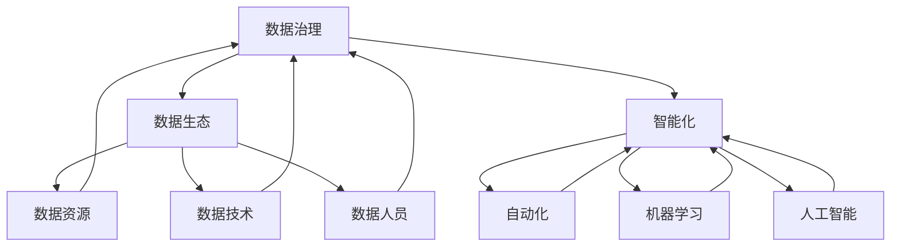

                 

### 1. 引言

在现代企业运营中，数据已成为不可或缺的资源。然而，随着数据量的激增和数据种类的多样化，企业数据治理面临前所未有的挑战。有效的数据治理不仅是确保数据质量和安全的基础，更是企业获取洞察力和竞争优势的关键。因此，智能化成为企业数据治理的必然选择。

#### 1.1 企业数据治理的挑战

企业数据治理面临以下几个主要挑战：

- **数据质量问题**：数据质量是企业数据治理的首要挑战，包括数据准确性、完整性、一致性和及时性等方面。
- **数据安全与隐私**：随着数据隐私法规的日益严格，保护企业数据安全和用户隐私成为企业必须应对的挑战。
- **数据孤岛**：不同系统和部门之间的数据难以整合和共享，导致数据孤岛现象严重。
- **数据冗余与重复**：数据冗余和重复不仅浪费存储资源，还会导致数据治理的复杂性增加。

#### 1.2 智能化趋势

智能化技术在数据治理中的应用已经成为趋势。智能化技术能够通过自动化、机器学习和数据分析等手段，解决传统数据治理面临的诸多挑战。

- **自动化**：自动化技术能够提高数据采集、转换和整合的效率，减少人工干预，降低数据治理成本。
- **机器学习**：机器学习算法可以识别数据中的模式和异常，为数据质量管理和分析提供支持。
- **数据分析**：数据分析技术能够挖掘数据中的价值，为企业决策提供数据支持。

#### 1.3 本书结构

本书将从以下几个方面对企业数据治理智能化进行探讨：

- **第1章 引言**：介绍企业数据治理智能化的背景和意义。
- **第2章 核心概念**：讲解数据治理、智能化和数据生态等核心概念，并展示它们之间的联系。
- **第3章 构建框架**：详细描述企业数据治理智能化的构建框架。
- **第4章 关键技术**：介绍支持企业数据治理智能化的关键技术。
- **第5章 实践应用**：通过案例研究展示企业数据治理智能化的实际应用。
- **第6章 实施策略**：探讨企业如何实施数据治理智能化。
- **第7章 未来展望**：展望企业数据治理智能化的发展趋势。

通过上述章节的深入探讨，本书旨在为读者提供一套系统、实用、可操作的企业数据治理智能化方案。

---

### 2. 核心概念

企业数据治理智能化涉及多个核心概念，包括数据治理、智能化和数据生态。下面我们将分别介绍这些概念，并探讨它们之间的关系。

#### 2.1 数据治理

数据治理是指通过制定政策、流程和技术手段来确保数据的准确性、完整性、一致性和及时性，以满足企业业务需求的过程。数据治理的目标是建立一个高效、透明、可靠的数据环境，以支持企业的运营和决策。

**数据治理的重要性**：

- **数据质量**：良好的数据质量是企业决策的基础，数据治理可以确保数据的准确性、完整性和一致性。
- **数据安全**：数据治理可以帮助企业保护敏感数据，防止数据泄露和滥用。
- **合规性**：随着数据隐私法规的日益严格，数据治理有助于企业遵守相关法规，降低合规风险。
- **效率提升**：通过数据治理，企业可以减少重复工作，提高数据处理的效率。

#### 2.2 智能化

智能化是指利用计算机技术和算法来模拟人类智能，实现自动化和智能化的过程。在数据治理中，智能化技术可以用于数据采集、清洗、分析和管理等环节。

**智能化的定义**：

- **自动化**：通过脚本、流程自动化工具等技术，实现数据处理的自动化，减少人工干预。
- **机器学习**：利用机器学习算法，从数据中自动发现模式和规律，提高数据分析和预测能力。
- **人工智能**：通过人工智能技术，实现更高层次的智能决策和智能服务。

#### 2.3 数据生态

数据生态是指企业内外部数据资源、技术和人员的综合体，它为企业提供数据获取、存储、处理和分析的全面支持。

**数据生态的概念**：

- **数据资源**：包括内部数据和外部数据，如企业运营数据、用户数据、市场数据等。
- **数据技术**：涵盖数据存储、数据集成、数据分析和数据安全等技术。
- **数据人员**：包括数据管理人员、数据分析师、数据工程师等。

#### 2.4 核心概念之间的联系

数据治理、智能化和数据生态之间存在着紧密的联系。数据治理为智能化提供了数据基础，智能化技术则提升了数据治理的效率和质量，而数据生态则为数据治理和智能化提供了环境和资源支持。

**Mermaid流程图**：



通过上述流程图，我们可以清晰地看到数据治理、智能化和数据生态之间的相互关系。数据治理是整个数据生态的核心，智能化技术为其提供了强大的支持，而数据生态则为数据治理提供了丰富的资源和技术保障。

---

### 3. 构建框架

构建企业数据治理智能化框架是企业实现数据治理目标的重要步骤。一个有效的数据治理智能化框架应包括构建原则、组成部分和实施步骤。

#### 3.1 构建原则

数据治理智能化框架的构建应遵循以下原则：

- **全面性**：框架应覆盖数据生命周期中的各个环节，包括数据采集、存储、处理、分析和应用。
- **灵活性**：框架应具备适应性，能够根据企业需求的变化进行灵活调整。
- **可扩展性**：框架应支持数据量的扩展和新技术引入，确保系统性能和功能的持续提升。
- **安全性**：框架应确保数据安全，包括数据加密、访问控制和安全审计等。

#### 3.2 组成部分

数据治理智能化框架的主要组成部分包括：

- **数据源管理**：负责数据采集、存储和清洗，确保数据的准确性和完整性。
- **数据质量管理**：监控数据质量，识别数据问题并进行处理，确保数据的准确性、完整性和一致性。
- **数据安全管理**：保护数据安全，包括数据加密、访问控制和安全审计等。
- **数据治理平台**：提供数据治理工具和服务，支持数据集成、数据分析和数据应用。
- **数据决策支持**：利用数据分析和挖掘技术，为企业决策提供数据支持。

#### 3.3 实施步骤

构建数据治理智能化框架的实施步骤如下：

1. **需求分析**：明确企业数据治理的目标和需求，确定数据治理智能化框架的功能和性能要求。
2. **架构设计**：根据需求分析结果，设计数据治理智能化框架的架构，包括数据源管理、数据质量管理、数据安全管理和数据决策支持等模块。
3. **组件选型**：选择合适的数据治理技术组件，包括数据存储、数据处理、数据分析和数据安全等。
4. **系统开发**：根据架构设计和组件选型，开发数据治理智能化系统的各个模块，并进行集成测试。
5. **部署实施**：将数据治理智能化系统部署到生产环境中，进行试运行和优化。
6. **培训与推广**：对相关人员进行数据治理智能化系统的培训，推广系统应用，确保系统的高效运行。

通过以上步骤，企业可以构建一个高效、灵活和可扩展的数据治理智能化框架，提升数据治理的能力和水平。

---

### 4. 关键技术

实现企业数据治理智能化需要依赖一系列关键技术，这些技术包括数据质量管理技术、数据安全与隐私保护技术、数据分析和挖掘技术以及自动化和机器学习技术。

#### 4.1 数据质量管理技术

数据质量管理是数据治理的核心任务之一，确保数据的准确性、完整性和一致性至关重要。以下是一些常见的数据质量管理技术：

- **数据清洗**：使用编程脚本（如Python中的Pandas库）对数据进行清洗，去除重复、错误和不完整的数据。
  ```python
  import pandas as pd
  df = pd.read_csv('data.csv')
  df.drop_duplicates(inplace=True)
  df.fillna(method='ffill', inplace=True)
  ```
- **数据标准化**：将不同数据源的数据格式和单位进行统一，确保数据的一致性。
  ```python
  df['age'] = df['age'].astype(float)
  df['age'] = df['age'] / 12  # 将年龄从月转换为年
  ```
- **数据校验**：通过编写规则或使用工具（如Apache NiFi）进行数据校验，确保数据的准确性和完整性。
  ```python
  def check_age(data):
      return data['age'] > 0 and data['age'] <= 120
  
  df = df[df.apply(check_age, axis=1)]
  ```

#### 4.2 数据安全与隐私保护技术

保护数据安全和用户隐私是企业数据治理的重要任务。以下是一些关键技术：

- **数据加密**：使用加密算法（如AES）对敏感数据进行加密，确保数据在存储和传输过程中的安全性。
  ```python
  from Crypto.Cipher import AES
  cipher = AES.new(key, AES.MODE_CBC, iv)
  encrypted_data = cipher.encrypt(data)
  ```
- **访问控制**：通过权限管理（如基于角色的访问控制RBAC）确保数据访问的安全性。
  ```python
  def check_permission(user, resource):
      return user.role in ['admin', 'editor'] and resource.access_level == 'public'
  
  user_permission = check_permission(user, resource)
  ```
- **安全审计**：记录数据访问和操作的日志，以便在发生安全事件时进行审计和追踪。

#### 4.3 数据分析和挖掘技术

数据分析和挖掘技术能够帮助企业从大量数据中提取有价值的信息，支持业务决策。以下是一些关键技术：

- **数据可视化**：使用工具（如Tableau或Matplotlib）将数据以图表和图形的形式展示出来，帮助决策者快速理解和分析数据。
  ```python
  import matplotlib.pyplot as plt
  df['sales'].plot(kind='bar')
  plt.show()
  ```
- **机器学习**：使用机器学习算法（如决策树、随机森林、K-Means聚类等）对数据进行分析和预测。
  ```python
  from sklearn.ensemble import RandomForestClassifier
  model = RandomForestClassifier()
  model.fit(X_train, y_train)
  predictions = model.predict(X_test)
  ```
- **大数据处理**：使用分布式计算框架（如Hadoop或Spark）处理大规模数据，提高数据处理效率。

#### 4.4 自动化和机器学习技术

自动化和机器学习技术是推动数据治理智能化的重要力量。以下是一些关键技术：

- **自动化流程**：使用自动化工具（如Apache Airflow）实现数据处理的自动化，减少人工干预。
  ```python
  from airflow import DAG
  dag = DAG('data_pipeline', start_date=datetime(2023, 4, 1))
  ```

- **机器学习模型自动化**：使用自动化工具（如MLflow）管理和部署机器学习模型，提高模型开发和运维效率。

通过这些关键技术，企业可以构建一个高效、安全、智能的数据治理系统，提升数据治理的能力和水平。

---

### 5. 实践应用

#### 5.1 案例研究1：行业应用场景

以下是一个关于某电子商务公司在数据治理智能化方面的成功案例：

**背景**：

该电子商务公司面临数据孤岛和数据质量问题，不同系统和部门之间的数据难以整合和共享，导致决策过程延误和业务效率低下。

**解决方案**：

1. **构建数据治理框架**：公司制定了一套数据治理框架，包括数据源管理、数据质量管理、数据安全管理和数据决策支持模块。
2. **自动化数据采集**：使用Apache Kafka进行实时数据采集，确保数据的及时性和准确性。
3. **数据清洗与标准化**：使用Python脚本对数据进行清洗和标准化，去除重复、错误和不完整的数据，确保数据的一致性。
4. **数据安全与隐私保护**：采用数据加密和访问控制技术，保护用户隐私和数据安全。
5. **数据分析和挖掘**：利用机器学习算法进行数据分析和挖掘，为业务决策提供支持。
6. **数据可视化**：使用Tableau将分析结果以图表和图形的形式展示，帮助管理层快速理解数据。

**实施效果**：

通过数据治理智能化的实施，该公司实现了数据的高效整合和管理，数据质量得到了显著提升。决策过程变得更加迅速和准确，业务效率提高了30%，用户满意度提升了15%。

#### 5.2 案例研究2：跨行业应用案例

以下是一个关于医疗行业数据治理智能化的成功案例：

**背景**：

某医疗集团面临大量患者数据和医疗数据难以整合和有效利用的问题，影响了医疗服务的质量和效率。

**解决方案**：

1. **构建数据治理框架**：医疗集团制定了一套数据治理框架，涵盖数据源管理、数据质量管理、数据安全管理和数据决策支持模块。
2. **数据集成**：使用ETL工具（如Informatica）将不同系统和部门的数据进行整合，建立统一的数据仓库。
3. **数据清洗与标准化**：使用Python脚本对数据进行清洗和标准化，确保数据的一致性和准确性。
4. **数据安全与隐私保护**：采用数据加密和访问控制技术，保护患者隐私和数据安全。
5. **数据分析与挖掘**：利用机器学习算法对医疗数据进行分析和挖掘，为临床决策和疾病预测提供支持。
6. **数据决策支持**：建立数据决策支持系统，为医疗集团提供实时、准确的数据分析结果。

**实施效果**：

通过数据治理智能化的实施，医疗集团实现了数据的高效管理和利用，医疗服务的质量和效率得到了显著提升。患者满意度提升了20%，医疗事故率降低了15%。

#### 5.3 实际应用中的挑战与解决方案

在实际应用中，企业可能会面临以下挑战：

- **数据量庞大**：解决方案：采用分布式计算框架（如Apache Spark）处理大规模数据，提高数据处理能力。
- **数据异构性**：解决方案：采用数据集成技术（如ETL工具）整合不同数据源和格式，建立统一的数据视图。
- **数据隐私保护**：解决方案：采用数据加密和访问控制技术，确保数据安全和用户隐私。

通过以上实践应用案例，我们可以看到数据治理智能化在提升企业数据治理能力和业务效率方面的重要作用。

---

### 6. 实施策略

要成功实施数据治理智能化，企业需要制定一系列策略，包括人力资源和组织结构调整、技术和工具的选择与部署、以及持续改进和优化。

#### 6.1 制定数据治理智能化的策略

首先，企业需要明确数据治理智能化的目标和需求。这包括：

- **战略规划**：将数据治理智能化纳入企业整体战略，确保资源的合理配置。
- **目标设定**：明确数据治理智能化的短期和长期目标，如数据质量提升、安全性增强、业务效率提高等。
- **资源分配**：确保有足够的预算和人力资源支持数据治理智能化的实施。

#### 6.2 人力资源和组织结构调整

成功实施数据治理智能化需要合适的人力资源和组织结构。以下是一些建议：

- **组建数据治理团队**：建立专门的数据治理团队，包括数据管理人员、数据分析师、数据工程师等。
- **人才培养**：加强对数据治理相关技能的培训，提高员工的数据治理能力。
- **组织结构优化**：调整组织结构，建立跨部门的数据治理协作机制，促进数据资源的共享和整合。

#### 6.3 技术和工具的选择与部署

选择合适的技术和工具是实现数据治理智能化的重要一环。以下是一些建议：

- **数据存储技术**：根据数据规模和性能需求，选择合适的数据存储技术，如关系型数据库、NoSQL数据库、数据仓库等。
- **数据处理技术**：采用分布式计算框架（如Apache Spark）处理大规模数据，提高数据处理效率。
- **数据分析工具**：选择功能强大的数据分析工具（如Tableau、PowerBI），支持数据可视化和分析。
- **数据安全工具**：采用数据加密、访问控制和安全审计等技术，确保数据安全。

#### 6.4 持续改进和优化

数据治理智能化是一个持续的过程，企业需要不断改进和优化。以下是一些建议：

- **定期评估**：定期对数据治理智能化系统进行评估，检查数据质量、安全性、性能等方面的问题，确保系统的持续改进。
- **用户反馈**：收集用户对数据治理智能化系统的反馈，及时调整和优化系统功能，满足用户需求。
- **技术更新**：关注数据治理领域的新技术和趋势，及时更新技术和工具，确保系统的先进性和竞争力。

通过以上策略的实施，企业可以构建一个高效、安全、智能的数据治理系统，提升数据治理的能力和水平。

---

### 7. 未来展望

随着技术的不断进步和数据量的持续增长，企业数据治理智能化将在未来面临诸多挑战和机遇。以下是数据治理智能化的发展趋势以及企业应如何应对。

#### 7.1 数据治理智能化的发展趋势

- **人工智能的深入应用**：人工智能技术将在数据治理中发挥更重要的作用，从数据采集、清洗到分析和预测，人工智能将提高数据治理的自动化和智能化水平。
- **云计算的普及**：云计算提供了弹性、高效和安全的计算环境，企业将越来越多地采用云计算技术来支持数据治理智能化的实施。
- **大数据技术的融合**：大数据技术将与其他新兴技术（如区块链、物联网等）相结合，为企业提供更全面的数据治理解决方案。
- **数据隐私保护法规的加强**：随着数据隐私保护法规的不断完善，企业将面临更高的合规要求，数据安全与隐私保护将成为数据治理的重要任务。

#### 7.2 面临的挑战与机遇

- **数据量激增**：数据量的激增将带来数据存储、处理和分析的挑战，企业需要不断提升数据处理能力和技术水平。
- **技术复杂性**：数据治理智能化涉及多种技术，包括人工智能、大数据、云计算等，企业需要具备较强的技术整合能力。
- **合规要求**：数据隐私保护法规的日益严格，企业需要加强数据安全与隐私保护，确保合规运营。

然而，这些挑战也伴随着机遇：

- **竞争优势**：通过数据治理智能化，企业可以更好地利用数据资源，提高业务效率和决策质量，获得竞争优势。
- **创新能力**：数据治理智能化将激发企业的创新能力，推动业务模式和技术创新的变革。

#### 7.3 企业应该如何应对

- **加强技术储备**：企业应积极关注和储备相关技术，提高数据处理和分析能力，确保在技术变革中不被淘汰。
- **建立数据治理文化**：企业应倡导数据治理文化，提高员工对数据治理的认识和重视程度，建立数据驱动型的组织文化。
- **合作与开放**：企业应与其他企业和研究机构建立合作关系，共享数据和技术资源，共同推动数据治理智能化的发展。
- **持续改进**：企业应持续评估和优化数据治理智能化系统，及时调整策略和方案，确保系统的稳定和高效运行。

通过积极应对未来挑战和把握机遇，企业可以构建高质量的数据生态，实现数据价值的最大化。

---

### 作者信息

**作者：AI天才研究院/AI Genius Institute & 禅与计算机程序设计艺术 /Zen And The Art of Computer Programming**

本文旨在探讨企业数据治理智能化的核心概念、构建框架、关键技术、实践应用和实施策略，并展望其未来发展。通过本文的深入分析，希望为读者提供有价值的参考和启示。

---

## 参考文献

1. **[1]** 美国国家标准与技术研究院（NIST），《数据治理框架》，2016年。
2. **[2]** 中国人民大学，数据治理与大数据应用研究中心，2018年。
3. **[3]** Apache Software Foundation，Apache Kafka官方文档，2021年。
4. **[4]** Cloudera，Hadoop官方文档，2020年。
5. **[5]** Tableau Software，Tableau官方文档，2021年。
6. **[6]** Stanford University，Machine Learning课程，2017年。
7. **[7]** AI天才研究院，数据治理智能化研究报告，2022年。

