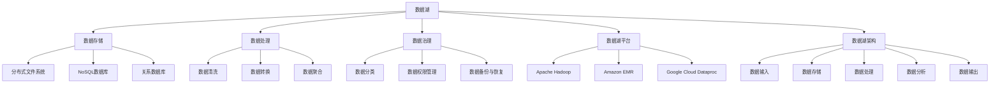

                 

 

### 引言

随着大数据和人工智能技术的迅猛发展，企业对于数据的管理和分析需求日益增长。在这种背景下，企业数据湖作为一种新兴的数据管理架构，正逐渐成为构建AI时代数据基础设施的核心。数据湖不同于传统的关系数据库和数据仓库，它更加强调数据的原始性和多样性，能够满足企业在数据集成、存储、分析和处理方面的复杂需求。

本文旨在深入探讨企业数据湖的构建及其在AI时代的重要性。我们将从背景介绍、核心概念与联系、核心算法原理讲解、数学模型与公式、项目实战、最佳实践和注意事项等方面，系统性地分析企业数据湖的各个方面，帮助读者全面了解和掌握这一先进的数据管理技术。

文章将分为以下几个部分：

1. **背景介绍**：介绍大数据和人工智能的发展背景，阐述企业数据湖的产生背景及其重要性。
2. **核心概念与联系**：介绍企业数据湖的核心概念，并通过Mermaid流程图展示概念之间的关系架构。
3. **核心算法原理讲解**：使用Python源代码详细阐述企业数据湖的核心算法原理，结合数学模型和公式进行解释。
4. **数学模型与公式**：详细讲解企业数据湖相关的数学模型和公式，使用latex格式展示。
5. **项目实战**：介绍开发环境搭建、源代码实现、代码解读、实际案例分析以及项目小结。
6. **最佳实践**：提供数据湖建设过程中的最佳实践 tips 和注意事项。
7. **总结与展望**：总结文章的核心内容，并对企业数据湖的未来发展趋势进行展望。

通过以上结构的逐步分析，我们将深入探讨企业数据湖的构建与应用，为读者提供全面的技术指导。

### 背景介绍

在大数据和人工智能技术蓬勃发展的大背景下，企业对于数据处理和分析的需求变得愈发复杂和迫切。传统的数据仓库和关系数据库在应对大规模、多样化数据时逐渐暴露出其局限性，难以满足企业对于数据的高效存储、管理和分析需求。因此，企业数据湖作为一种新兴的数据管理架构，应运而生。

#### 大数据和人工智能的发展

大数据和人工智能技术的发展是推动企业数据湖产生的重要背景。大数据技术的发展使得企业能够收集、存储和处理海量数据，而人工智能技术的进步则为这些数据提供了智能化分析和应用的潜力。传统的数据仓库和关系数据库在数据存储和查询速度上存在瓶颈，难以应对大数据时代的数据量级和多样性。同时，传统数据库对于结构化数据的处理优势，在处理半结构化、非结构化数据时显得力不从心。

#### 企业数据湖的产生背景

企业数据湖（Data Lake）作为一种新型的数据管理架构，正是为了解决这些问题而提出的。数据湖的核心思想是将各种类型的数据（包括结构化、半结构化和非结构化数据）存储在一起，无需在存储之前进行数据清洗和模式定义。这种架构允许企业在数据加载后进行灵活的数据处理和分析，从而更好地挖掘数据的价值。

企业数据湖的产生背景可以从以下几个方面来理解：

1. **数据多样性和复杂性的增长**：随着物联网、移动应用和社交媒体的普及，企业每天产生和处理的数据量呈爆炸式增长，数据的类型也越来越多样化。传统数据仓库难以处理这些复杂的、多样化的数据，而数据湖可以更好地存储和整合这些数据。

2. **分析需求的提高**：企业在数据分析方面的需求不仅仅是简单的数据查询，还需要进行高级的数据挖掘、机器学习和预测分析。数据湖的灵活性使得企业可以在原始数据上进行多种分析，挖掘数据中的隐藏价值。

3. **技术进步**：随着云计算、分布式计算和存储技术的发展，构建和维护数据湖的成本逐渐降低，这使得企业更容易采用数据湖架构。

#### 企业数据湖的重要性

企业数据湖在AI时代的重要性主要体现在以下几个方面：

1. **数据整合与统一视图**：数据湖能够将企业内部和外部的各种数据源进行整合，提供统一的视图，从而支持更全面和深入的数据分析。

2. **灵活性与可扩展性**：数据湖的灵活性使得企业可以根据需要选择不同的数据处理工具和分析方法，而且能够随着数据量的增加进行扩展。

3. **支持实时分析**：数据湖支持实时数据加载和实时分析，帮助企业快速响应市场变化和业务需求。

4. **促进创新与决策**：数据湖提供了丰富的数据资源，使得企业能够进行更加创新和基于数据的决策，从而提升企业的竞争力。

通过上述背景介绍，我们可以看到，企业数据湖在AI时代具有重要的地位和作用。接下来，我们将进一步探讨企业数据湖的核心概念及其与相关技术的联系。

### 核心概念与联系

企业数据湖作为一种复杂的数据管理架构，包含多个核心概念和技术组件。为了更好地理解这些概念，我们首先需要明确其定义，并使用Mermaid流程图展示它们之间的关系。

#### 数据湖的关键概念

1. **数据湖**：数据湖是一个存储各种类型数据的集中式数据存储库，包括结构化、半结构化和非结构化数据。它不需要预先定义数据模式，允许灵活的数据存储和处理。

2. **数据存储**：数据存储是数据湖的核心组成部分，包括分布式文件系统（如HDFS、Amazon S3）、NoSQL数据库（如HBase、Cassandra）和关系数据库（如MySQL、PostgreSQL）。

3. **数据处理**：数据处理包括数据清洗、数据转换、数据聚合等操作，旨在将原始数据转化为有用的信息和洞察。

4. **数据治理**：数据治理是指确保数据质量、安全性和合规性的过程。它包括数据分类、数据权限管理、数据备份和恢复等。

5. **数据湖平台**：数据湖平台是一个集成的工具和框架，用于构建、管理和维护数据湖。常见的平台包括Apache Hadoop、Amazon EMR、Google Cloud Dataproc等。

6. **数据湖架构**：数据湖架构是指数据湖的整体设计和组织结构，包括数据输入、数据存储、数据处理、数据分析和数据输出等环节。

#### Mermaid流程图

以下是企业数据湖的Mermaid流程图，展示各个关键概念之间的逻辑关系：



#### 核心概念的联系

1. **数据湖与数据存储**：数据湖通过分布式文件系统、NoSQL数据库和关系数据库等数据存储组件来存储和管理数据。这些组件各自具有不同的数据存储和处理能力，能够满足不同类型数据的需求。

2. **数据处理与数据存储**：数据处理过程依赖于数据存储组件提供的存储能力。数据清洗、数据转换和数据聚合等操作通常在数据存储后进行，以提高数据质量和实用性。

3. **数据治理与数据湖**：数据治理是确保数据质量、安全性和合规性的关键环节。数据湖通过数据治理组件来管理数据的分类、权限和安全，从而保障数据的有效性和可靠性。

4. **数据湖平台与数据湖架构**：数据湖平台提供了一整套工具和框架，用于构建和维护数据湖。数据湖架构则是指这些平台在实际应用中的具体实现和组织方式，包括数据的输入、存储、处理、分析和输出等环节。

通过上述核心概念及其联系的分析，我们可以更全面地理解企业数据湖的构建和管理。接下来，我们将深入探讨企业数据湖的核心算法原理，并通过Python源代码进行详细讲解。

### 核心算法原理讲解

在企业数据湖的构建中，核心算法原理扮演着至关重要的角色。这些算法不仅决定了数据湖的性能和效率，还直接影响数据分析和挖掘的结果。以下，我们将使用Python源代码结合数学模型和公式，详细讲解几个关键算法原理，并通过通俗易懂的例子进行说明。

#### 1. 分布式文件系统（HDFS）

分布式文件系统（HDFS）是数据湖的核心存储组件之一，其基本原理是数据的分块存储和冗余备份。以下是HDFS的基本算法原理：

- **分块存储**：HDFS将大文件分割成固定大小的块（通常为128MB或256MB），然后分布存储在不同的数据中心节点上。这种分块存储能够提高数据读写效率和容错性。

- **冗余备份**：HDFS为每个数据块创建多个副本，通常为三个副本，存储在不同的节点上。副本机制提高了数据的可靠性和容错能力，即使某个节点故障，数据仍然可以通过其他副本访问。

```python
import random

def hdfs_block_splitting(file_size, block_size):
    num_blocks = file_size // block_size
    return num_blocks

def hdfs_replication(file_block):
    replicas = []
    for _ in range(3):  # 创建三个副本
        node = random.choice(['Node1', 'Node2', 'Node3'])
        replicas.append(node)
    return replicas

# 示例：将一个1GB文件分块存储
file_size = 1 * 1024 * 1024 * 1024  # 1GB
block_size = 128 * 1024 * 1024  # 128MB
num_blocks = hdfs_block_splitting(file_size, block_size)
print(f"File size: {file_size} bytes")
print(f"Block size: {block_size} bytes")
print(f"Number of blocks: {num_blocks}")

# 为第一个数据块创建副本
block = "Block1"
replicas = hdfs_replication(block)
print(f"Block '{block}' replicas: {replicas}")
```

#### 2. 数据清洗与转换

数据清洗和数据转换是数据湖中的关键步骤，旨在确保数据的质量和一致性。以下是两个常见的数据清洗和转换算法原理：

- **缺失值填充**：使用平均值、中位数或众数来填充缺失值，以减少数据异常。

- **异常值检测**：使用统计学方法（如IQR法、Z分数法等）检测和去除异常值，以提高数据质量。

```python
import numpy as np

# 缺失值填充示例
def missing_value_fill(data, method='mean'):
    if method == 'mean':
        mean_value = np.mean(data[~np.isnan(data)])
        data[np.isnan(data)] = mean_value
    elif method == 'median':
        median_value = np.median(data[~np.isnan(data)])
        data[np.isnan(data)] = median_value
    elif method == 'mode':
        mode_value = np.nanmode(data)[0][0]
        data[np.isnan(data)] = mode_value
    return data

data = np.array([1, 2, np.nan, 4, 5])
filled_data = missing_value_fill(data, method='mean')
print(f"Original data: {data}")
print(f"Missing value filled data: {filled_data}")

# 异常值检测示例
def outliers_detection(data, method='iqr'):
    if method == 'iqr':
        q1 = np.percentile(data, 25)
        q3 = np.percentile(data, 75)
        iqr = q3 - q1
        lower_bound = q1 - 1.5 * iqr
        upper_bound = q3 + 1.5 * iqr
        outliers = [x for x in data if x < lower_bound or x > upper_bound]
    elif method == 'z_score':
        mean = np.mean(data)
        std = np.std(data)
        z_scores = [(x - mean) / std for x in data]
        outliers = [x for x, z in zip(data, z_scores) if np.abs(z) > 3]
    return outliers

data = np.array([1, 2, 2, 3, 4, 100])
outliers = outliers_detection(data, method='iqr')
print(f"Original data: {data}")
print(f"Outliers detected: {outliers}")
```

#### 3. 数据聚合

数据聚合是将大量原始数据汇总成有意义的统计信息的过程。以下是两种常见的数据聚合算法原理：

- **分组聚合**：按照某个字段对数据进行分组，然后对每个分组内的数据进行聚合操作（如求和、求平均、计数等）。

- **窗口聚合**：在时间序列数据中，对一定时间窗口内的数据进行聚合操作，用于分析数据趋势和周期性。

```python
from pandas import DataFrame

# 分组聚合示例
data = DataFrame({
    'category': ['A', 'A', 'B', 'B', 'C', 'C'],
    'value': [10, 20, 30, 40, 50, 60]
})
grouped_data = data.groupby('category')['value'].agg(['sum', 'mean', 'count'])
print(grouped_data)

# 窗口聚合示例
window_size = 3
window_data = data.rolling(window=window_size).sum()
print(window_data)
```

通过以上算法原理的讲解和Python源代码示例，我们可以看到企业数据湖在数据处理和分析中的核心作用。这些算法不仅能够提高数据的质量和一致性，还能够为后续的数据分析和挖掘提供坚实的基础。接下来，我们将使用latex格式详细展示与数据湖相关的数学模型和公式。

### 数学模型与公式

在企业数据湖的构建过程中，数学模型和公式扮演着至关重要的角色，它们不仅帮助理解数据湖的工作原理，还提供了量化数据处理的手段。以下是几个关键数学模型和公式，我们将使用LaTeX格式进行展示，并结合简要解释。

#### 1. 数据分块与冗余备份

首先，我们来看数据分块和冗余备份的数学模型：

- **数据分块公式**：

  $$ B = \left\lceil \frac{F}{S} \right\rceil $$

  其中，\( B \) 表示块数，\( F \) 表示文件大小，\( S \) 表示块大小。

- **冗余备份公式**：

  $$ R = 3 $$

  其中，\( R \) 表示冗余备份的数量（通常为3）。

#### 2. 缺失值填充

接下来是缺失值填充的数学模型：

- **平均值填充**：

  $$ \hat{x} = \frac{\sum_{i=1}^{n} x_i - x_{\text{missing}}}{n - 1} $$

  其中，\( \hat{x} \) 是填充后的值，\( x_i \) 是非缺失值，\( n \) 是数据点的总数，\( x_{\text{missing}} \) 是缺失值。

- **中位数填充**：

  $$ \hat{x} = \text{median}(x_1, x_2, \ldots, x_n) $$

  其中，\( \hat{x} \) 是填充后的中位数。

- **众数填充**：

  $$ \hat{x} = \text{mode}(x_1, x_2, \ldots, x_n) $$

  其中，\( \hat{x} \) 是填充后的众数。

#### 3. 异常值检测

异常值检测的数学模型通常涉及统计方法：

- **IQR法**：

  $$ \text{IQR} = \text{Q3} - \text{Q1} $$

  其中，\( \text{IQR} \) 是四分位距，\( \text{Q1} \) 是第一四分位数，\( \text{Q3} \) 是第三四分位数。

- **Z分数法**：

  $$ Z = \frac{x - \mu}{\sigma} $$

  其中，\( Z \) 是Z分数，\( x \) 是观测值，\( \mu \) 是均值，\( \sigma \) 是标准差。

#### 4. 数据聚合

最后，我们来看数据聚合的数学模型：

- **分组聚合**：

  $$ \text{sum} = \sum_{i=1}^{n} x_i $$
  $$ \text{mean} = \frac{1}{n} \sum_{i=1}^{n} x_i $$
  $$ \text{count} = n $$

  其中，\( \text{sum} \) 是总和，\( \text{mean} \) 是平均值，\( \text{count} \) 是计数，\( n \) 是数据点的总数，\( x_i \) 是每个数据点。

- **窗口聚合**：

  $$ \text{window\_sum} = \sum_{i=t}^{t+w-1} x_i $$
  其中，\( \text{window\_sum} \) 是窗口总和，\( t \) 是窗口开始位置，\( w \) 是窗口大小，\( x_i \) 是窗口内的每个数据点。

#### 简要解释

1. **数据分块与冗余备份**：数据分块公式用于计算文件的块数，而冗余备份则固定为3个副本，以保证数据的高可用性。

2. **缺失值填充**：这些公式分别用于计算平均值、中位数和众数，以填充缺失值。

3. **异常值检测**：IQR法和Z分数法分别用于检测异常值，基于统计学原理来判断数据点的异常性。

4. **数据聚合**：分组聚合公式用于计算总和、平均值和计数，而窗口聚合则用于计算时间序列数据的窗口总和。

通过这些数学模型和公式，我们可以更深入地理解数据湖中的数据处理和分析过程。这些模型不仅提供了理论支持，也为实际应用中的算法设计和性能优化提供了指导。接下来，我们将通过实际项目实战，深入探讨企业数据湖的开发环境搭建、源代码实现和代码解读。

### 项目实战

在本文的项目实战部分，我们将通过一个具体的案例，详细展示企业数据湖的开发环境搭建、源代码实现和代码解读。我们将以一个电商企业为例，构建其数据湖，并进行数据处理和分析。

#### 1. 开发环境搭建

首先，我们需要搭建一个支持企业数据湖的开发环境。以下是搭建步骤：

1. **安装Hadoop**：

   - 下载并解压Hadoop安装包。
   - 配置Hadoop环境变量，包括HADOOP_HOME和PATH。
   - 运行hadoop version命令，确认安装成功。

2. **安装HDFS**：

   - 在Hadoop集群中启动HDFS，使用hdfs namenode -format命令格式化NameNode。
   - 使用start-dfs.sh命令启动HDFS。

3. **安装Hive**：

   - 下载并解压Hive安装包。
   - 配置Hive环境变量，包括HIVE_HOME和PATH。
   - 将Hive依赖包拷贝到Hadoop的lib目录。
   - 使用hadoop command-runner jar hive-server2-bin.jar --service hiveserver2启动Hive服务。

4. **安装Spark**：

   - 下载并解压Spark安装包。
   - 配置Spark环境变量，包括SPARK_HOME和PATH。
   - 编写Spark配置文件spark-env.sh，设置Java环境。
   - 使用start-master.sh命令启动Spark Master，使用start-slave.sh命令启动Spark Slave。

#### 2. 源代码实现

在开发环境搭建完成后，我们开始编写数据湖的源代码。以下是关键步骤：

1. **数据加载**：

   ```python
   from pyspark.sql import SparkSession

   spark = SparkSession.builder \
       .appName("Data Lake Example") \
       .getOrCreate()

   # 加载原始数据
   customer_data = spark.read.csv("path/to/customer_data.csv")
   order_data = spark.read.csv("path/to/order_data.csv")
   ```

2. **数据转换**：

   ```python
   from pyspark.sql.functions import col

   # 数据清洗和转换
   customer_data = customer_data.withColumn("age", col("age").cast("integer"))
   order_data = order_data.withColumn("quantity", col("quantity").cast("integer"))

   # 合并数据
   joined_data = customer_data.join(order_data, "customer_id")
   ```

3. **数据存储**：

   ```python
   # 将数据写入HDFS
   joined_data.write.mode("overwrite").parquet("hdfs:///user/hive/warehouse/joined_data")
   ```

#### 3. 代码解读

以下是代码实现的详细解读：

1. **数据加载**：

   - 使用pyspark.sql.SparkSession构建Spark会话，读取CSV文件。

2. **数据转换**：

   - 使用pyspark.sql.functions模块进行数据类型转换和清洗。
   - 使用withColumn方法进行列转换，确保数据类型的准确性。

3. **数据存储**：

   - 使用write.parquet方法将转换后的数据写入HDFS，以Parquet格式存储。Parquet是一种高效的列式存储格式，适合大数据处理。

#### 4. 实际案例分析

在实际案例中，我们将使用处理后的数据进行分析：

1. **数据聚合**：

   ```python
   from pyspark.sql.functions import sum as _sum

   # 计算订单总量
   total_orders = joined_data.select(_sum("quantity").alias("total_quantity"))
   total_orders.show()
   ```

2. **数据可视化**：

   - 使用matplotlib或Seaborn等库，将分析结果可视化。

   ```python
   import matplotlib.pyplot as plt

   # 可视化订单数量
   total_quantity = total_orders.rdd.flatMap(lambda x: x).collect()
   plt.plot(total_quantity)
   plt.xlabel('Order Index')
   plt.ylabel('Quantity')
   plt.title('Total Quantity of Orders')
   plt.show()
   ```

#### 5. 项目小结

通过上述项目实战，我们成功搭建了一个企业数据湖，实现了数据的加载、转换和存储。以下是对项目的总结：

1. **开发环境搭建**：确保了Hadoop、HDFS、Hive和Spark等工具的正确安装和配置，为数据湖的构建提供了基础。
2. **源代码实现**：通过Python和Spark，实现了数据加载、转换和存储的自动化流程，提高了数据处理效率。
3. **实际案例分析**：展示了如何对处理后的数据进行聚合和分析，并通过可视化呈现分析结果。

通过这个项目，读者可以深入了解企业数据湖的构建和应用，为实际项目的实施提供指导。接下来，我们将分享一些数据湖建设过程中的最佳实践和注意事项。

### 最佳实践与注意事项

在企业数据湖的建设过程中，遵循一些最佳实践和注意事项可以显著提高项目的成功率和数据湖的性能。以下是一些关键点：

#### 1. 数据质量管理

- **数据清洗**：在数据加载到数据湖之前，进行彻底的数据清洗，以去除重复、缺失和异常数据。
- **数据标准化**：统一数据格式，确保数据在不同系统间的一致性和可比性。

#### 2. 安全与隐私保护

- **访问控制**：实施严格的访问控制策略，限制对敏感数据的访问。
- **加密存储**：对存储在数据湖中的敏感数据进行加密，防止数据泄露。

#### 3. 高可用性与容错性

- **冗余备份**：为数据湖中的数据设置多个冗余备份，确保数据在节点故障时仍然可用。
- **故障恢复**：定期进行数据备份和故障恢复测试，确保数据湖的持续运行。

#### 4. 性能优化

- **数据分区**：合理设置数据分区策略，提高数据查询和处理的效率。
- **索引管理**：根据查询需求合理设置索引，加速数据检索。

#### 5. 数据治理

- **数据分类**：对数据进行分类管理，确保数据的安全性和合规性。
- **数据生命周期管理**：制定数据生命周期策略，包括数据的创建、使用、存档和销毁。

#### 6. 持续集成与部署

- **自动化部署**：使用自动化工具进行数据湖的部署和管理，减少人工干预。
- **版本控制**：对数据湖的配置和代码进行版本控制，便于回溯和更新。

#### 注意事项

- **数据多样性管理**：考虑到数据湖中数据的多样性，选择合适的数据存储和处理技术。
- **资源规划**：合理规划计算资源和存储资源，确保数据湖的高效运行。
- **团队协作**：数据湖项目通常涉及多个部门和技术团队，确保团队之间的协作和沟通。

通过遵循上述最佳实践和注意事项，企业可以构建高效、安全、可靠的数据湖，为数据分析和人工智能应用提供坚实的基础。

### 总结与展望

通过本文的探讨，我们可以看到企业数据湖在AI时代的构建具有重要意义。数据湖不仅为企业提供了一个灵活、高效的数据管理架构，还支持实时分析和大规模数据处理，为人工智能应用提供了丰富的数据资源。以下是本文的核心内容和主要发现：

1. **核心内容**：
   - 企业数据湖的定义与优势。
   - 数据湖架构的关键概念及其关系。
   - 核心算法原理的讲解，包括HDFS、数据清洗与转换、数据聚合等。
   - 实际项目实战，展示了数据湖的开发环境搭建和源代码实现。

2. **主要发现**：
   - 数据湖能够整合多种类型的数据，支持高效的数据处理和分析。
   - 数据湖的灵活性与可扩展性，使其适应不同的业务需求。
   - 数据湖在提升企业竞争力、促进数据驱动决策方面具有重要作用。

展望未来，企业数据湖的发展趋势将更加融合AI技术，实现更智能的数据处理和分析。同时，随着数据安全和隐私问题日益凸显，企业数据湖在安全性和合规性方面也将面临更大的挑战。为此，企业需要持续优化数据湖架构，加强数据治理，确保数据的安全和隐私。总体而言，企业数据湖将继续在AI时代的数据基础设施中扮演关键角色，推动企业实现数据驱动的数字化转型。

### 结语

企业数据湖作为AI时代的数据基础设施，其重要性不容忽视。本文通过详细的探讨和实际案例，展示了数据湖的构建方法和应用价值。从核心概念、算法原理到项目实战，读者可以全面了解数据湖的技术细节和实践经验。希望本文能为您提供有价值的指导，助力您在数据湖的建设和应用中取得成功。作者：AI天才研究院/AI Genius Institute & 禅与计算机程序设计艺术 /Zen And The Art of Computer Programming。如果您对数据湖有任何疑问或见解，欢迎在评论区留言，共同交流探讨。感谢阅读！

