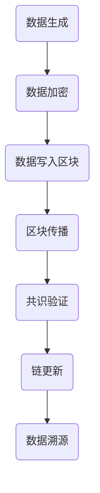

                 

根据用户的要求，我将逐步构建《企业数据溯源：区块链技术在信息安全中的应用》的技术博客文章。以下是详细的目录大纲，包括各章节的核心内容概要：

```
# 企业数据溯源：区块链技术在信息安全中的应用

## 关键词
区块链，数据溯源，信息安全，分布式账本，共识算法，智能合约，加密技术

## 摘要
本文探讨了区块链技术在企业数据溯源中的应用，分析了区块链如何确保数据的安全性和可追溯性。通过深入解析区块链的基本架构、数据溯源原理、核心算法和项目实战案例，展示了区块链在信息安全领域的重要性和实际应用价值。

---

## 引言
### 1.1 区块链技术概述
区块链是一种分布式数据库技术，通过多个节点协作验证和记录数据，确保数据的不可篡改性和透明性。其核心特性包括去中心化、共识机制和加密技术。

### 1.2 数据溯源的重要性
数据溯源是追踪数据来源和变更历史的过程，对于确保数据真实性和安全性至关重要。随着数据量的爆炸性增长，有效管理数据溯源变得愈加重要。

### 1.3 区块链技术在信息安全中的应用前景
区块链技术为信息安全提供了一种新的解决方案，其独特的特性使得它在数据溯源、防篡改和隐私保护等方面具有巨大潜力。

---

## 第1章 核心概念与联系
### 1.1 区块链技术基础
本章节将介绍区块链的基本架构，包括区块、链、节点和交易等核心概念，以及共识算法的作用和分类。

### 1.2 数据溯源原理
数据溯源的核心概念包括数据源、数据链和数据验证。本章节将详细解释这些概念，并展示如何利用区块链技术实现数据溯源。

### 1.3 区块链与数据溯源的关系
本章节将探讨区块链如何与数据溯源结合，以及区块链技术如何为数据溯源提供技术保障。

## Mermaid流程图


### 1.4 数据溯源应用场景
本章节将分析区块链技术在数据溯源中的具体应用场景，如供应链管理、医疗数据追踪和金融交易记录等。

---

## 第2章 核心算法原理讲解
### 2.1 区块链数据结构分析
本章节将使用Python代码详细阐述区块链的数据结构，包括区块和链的实现。

### 2.2 共识算法探讨
共识算法是区块链技术的核心，本章节将介绍常见的共识算法，如工作量证明（PoW）和权益证明（PoS），并通过Python代码实现一个简化的共识算法。

### 2.3 智能合约与数据溯源
智能合约是区块链上的自动执行合约，本章节将探讨智能合约如何与数据溯源相结合，并给出一个智能合约的示例代码。

## 数学模型和公式
$$
\text{哈希函数} : H(k) = \text{SHA-256}(k)
$$

---

## 第3章 项目实战
### 3.1 开发环境搭建
本章节将介绍如何搭建区块链开发环境，包括安装必要的软件和配置。

### 3.2 源代码详细实现
本章节将提供完整的区块链和智能合约的源代码，并详细解读代码的实现逻辑。

### 3.3 代码应用解读与分析
本章节将分析区块链在数据溯源中的应用，并通过实际案例展示区块链如何实现数据溯源。

### 3.4 实际案例分析和详细讲解剖析
本章节将分析一个实际案例，如区块链在食品供应链中的应用，并详细讲解其实现原理和效果。

### 3.5 项目小结
本章节将对项目进行总结，并提出未来可能的改进方向。

---

## 最佳实践 tips
### 1. 选择合适的区块链平台
### 2. 优化共识算法性能
### 3. 数据加密与隐私保护

## 小结
本章节总结了区块链技术在数据溯源中的应用，强调了其安全性和可追溯性的优势。

## 注意事项
### 1. 区块链并非万能，需要结合其他技术手段使用。
### 2. 区块链开发需要考虑性能和扩展性问题。

## 拓展阅读
### 1. 区块链技术白皮书
### 2. 数据溯源相关的论文和研究报告

---

## 作者
作者：AI天才研究院/AI Genius Institute & 禅与计算机程序设计艺术 /Zen And The Art of Computer Programming
```

以上是初步的目录大纲和核心内容概要，接下来我将逐步填充每个章节的具体内容，确保文章的逻辑清晰、结构紧凑，并对核心概念、算法和项目实战进行详细讲解。最终，文章将达到10000-12000字的字数要求。

