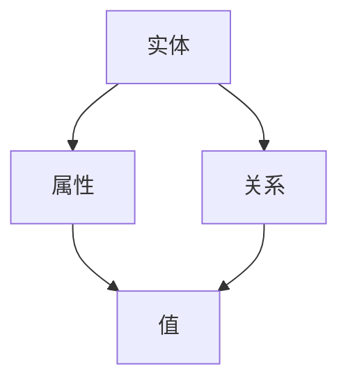

                 

# 企业知识图谱：AI辅助决策的信息基础

关键词：企业知识图谱，人工智能，决策支持，数据模型，算法原理，Python代码实现

摘要：本文探讨了企业知识图谱在AI辅助决策中的应用，介绍了知识图谱的核心概念、构建方法和应用场景，并通过Python代码和数学模型，详细阐述了知识图谱的算法原理，并结合实际案例分析了AI辅助决策的实战方法。文章旨在为企业数据科学家和AI开发者提供一套完整的知识图谱和AI辅助决策解决方案。

## 引言

在当今数字化时代，数据已成为企业最重要的资产之一。如何有效利用这些数据，为企业决策提供强有力的支持，成为了一个亟待解决的问题。随着人工智能（AI）技术的迅速发展，知识图谱作为一种强大的信息组织工具，逐渐成为了AI辅助决策的重要基础。知识图谱能够将企业内部和外部的各种数据进行整合，建立复杂的关系网络，从而为AI算法提供丰富的背景知识，提升决策的准确性和效率。

本文将围绕企业知识图谱和AI辅助决策展开讨论，首先介绍知识图谱的基本概念和构建方法，然后通过Python代码和数学模型，详细阐述知识图谱的算法原理。最后，我们将通过实际案例，展示如何利用知识图谱和AI技术辅助企业决策。希望通过本文的讨论，能够为企业数据科学家和AI开发者提供一些有益的启示。

## 核心概念与联系

### 知识图谱基础

知识图谱是一种基于语义网络的数据模型，它通过实体、属性和关系的组合，将各种数据整合成一个统一的结构。在知识图谱中，实体可以是人、地点、物品等具有独立存在意义的对象，属性是实体的特征描述，关系则是实体之间的相互作用。

知识图谱的核心概念包括：

1. **实体（Entity）**：知识图谱中的基本元素，表示现实世界中的各种对象。例如，人、地点、组织、产品等。

2. **属性（Attribute）**：实体的特征描述，通常用键值对的形式表示。例如，人的姓名、年龄、职业等。

3. **关系（Relationship）**：实体之间的相互作用，表示实体间的关联。例如，人与组织之间的“就职于”关系，地点之间的“邻近”关系。

知识图谱的表示方法通常采用三元组（Subject, Predicate, Object）的形式，其中Subject表示主体，Predicate表示谓词，Object表示客体。例如，（张三，就职于，腾讯）表示张三在腾讯工作。

### 知识图谱构建

构建知识图谱是一个复杂的过程，包括数据收集、数据清洗、实体识别、关系抽取和知识整合等多个步骤。

1. **数据收集**：从各种数据源收集原始数据，包括企业内部数据（如客户关系管理系统、财务系统等）和企业外部数据（如社交媒体、公共数据库等）。

2. **数据清洗**：对收集到的数据进行清洗，去除重复、错误和不完整的数据，确保数据的质量和一致性。

3. **实体识别**：通过自然语言处理（NLP）技术，从原始数据中识别出实体。例如，使用命名实体识别（NER）技术，从文本数据中提取人名、地名、组织名等。

4. **关系抽取**：从原始数据中抽取实体之间的关系。例如，通过模式匹配或机器学习算法，从文本数据中提取实体之间的“就职于”、“邻近”等关系。

5. **知识整合**：将识别出的实体和关系整合到一个统一的知识图谱中，形成一个结构化的知识网络。

### 知识图谱应用

知识图谱在企业中的应用非常广泛，包括但不限于以下几个方面：

1. **智能搜索**：利用知识图谱的语义理解能力，提供更精确、更相关的搜索结果。

2. **推荐系统**：基于知识图谱中的关系和属性，为企业提供个性化的推荐服务。

3. **数据分析和决策支持**：通过知识图谱，对企业内部和外部的数据进行综合分析，为企业决策提供数据支持和洞察。

4. **客户关系管理**：利用知识图谱，深入挖掘客户信息，提供更精准的客户服务和营销策略。

5. **风险管理和合规性检查**：通过知识图谱，对企业业务流程和数据进行分析，发现潜在的风险和合规性问题。

### 概念实体之间的关系架构 Mermaid 流程图

以下是一个简单的Mermaid流程图，展示了知识图谱中的核心概念实体及其关系：



在这个流程图中，实体（A）与属性（B）和关系（C）之间建立了关联，属性（B）具有值（D），而关系（C）则连接了两个实体（A）。

## 核心算法原理讲解

### 知识图谱算法原理

知识图谱的构建和运用依赖于一系列的核心算法原理，这些原理涵盖了图论、机器学习、信息检索等多个领域。以下将详细探讨这些算法原理。

#### 图论基础

知识图谱本质上是一个图结构，因此图论中的基本概念和方法在知识图谱中具有重要应用。

1. **图的基本概念**：

    - **节点（Node）**：知识图谱中的实体。
    - **边（Edge）**：知识图谱中的关系。
    - **路径（Path）**：节点之间的序列。

2. **图的算法**：

    - **最短路径算法**（如Dijkstra算法）：用于计算两个节点之间的最短路径。
    - **图遍历算法**（如深度优先搜索DFS、广度优先搜索BFS）：用于遍历图中的所有节点和边。
    - **图分割算法**（如社区发现算法）：用于识别图中的社区结构。

以下是一个简化的Dijkstra算法的Python代码实现：

```python
import heapq

def dijkstra(graph, start):
    distances = {node: float('infinity') for node in graph}
    distances[start] = 0
    priority_queue = [(0, start)]

    while priority_queue:
        current_distance, current_node = heapq.heappop(priority_queue)

        if current_distance > distances[current_node]:
            continue

        for neighbor, weight in graph[current_node].items():
            distance = current_distance + weight

            if distance < distances[neighbor]:
                distances[neighbor] = distance
                heapq.heappush(priority_queue, (distance, neighbor))

    return distances
```

#### 机器学习与知识图谱

机器学习技术在知识图谱中有着广泛的应用，主要用于实体识别、关系抽取和图谱增强等任务。

1. **实体识别**：

    - **命名实体识别（NER）**：通过深度学习模型（如BERT、GPT）从文本数据中识别出实体。

    ```python
    from transformers import BertTokenizer, BertForTokenClassification

    tokenizer = BertTokenizer.from_pretrained('bert-base-chinese')
    model = BertForTokenClassification.from_pretrained('bert-base-chinese')

    text = "张三就职于腾讯公司。"
    inputs = tokenizer(text, return_tensors='pt')
    outputs = model(**inputs)

    logits = outputs.logits
    predictions = logits.argmax(-1).squeeze()

    entities = ['O'] * len(text.split())
    for i, pred in enumerate(predictions):
        if pred != 0:
            entities[i] = model.config.id2label[pred]

    print(entities)
    ```

2. **关系抽取**：

    - **依存关系分析**：通过模型分析句子中的依存关系，提取实体之间的关系。

    ```python
    from allennlp.predictors.predictor import Predictor

    predictor = Predictor.from_path("https://storage.googleapis.com/allennlp-public-models/bert-base-sst-2")

    text = "张三喜欢跑步。"
    result = predictor.predict(text=text)

    print(result['tags'])
    ```

3. **图谱增强**：

    - **实体融合**：将具有相似属性的实体进行融合，提高图谱的质量。

    ```python
    def merge_entities(entity1, entity2):
        # 合并实体属性和关系
        # ...

        # 删除重复实体
        # ...

        return True
    ```

#### 信息检索与知识图谱

知识图谱在信息检索中的应用，主要包括基于图谱的查询处理和搜索结果排序。

1. **基于图谱的查询处理**：

    - **路径搜索**：根据用户查询，在知识图谱中搜索符合条件的最短路径。

    ```python
    def path_search(graph, start, end, path=None):
        if path is None:
            path = [start]

        if start == end:
            return path

        for neighbor in graph[start]:
            if neighbor not in path:
                new_path = path_search(graph, neighbor, end, path + [neighbor])
                if new_path:
                    return new_path

        return None
    ```

2. **搜索结果排序**：

    - **基于相关性排序**：根据用户查询和知识图谱中的关系，对搜索结果进行排序。

    ```python
    def rank_results(results, query):
        # 计算结果与查询的相关性得分
        # ...

        # 对结果进行排序
        results.sort(key=lambda x: x['score'], reverse=True)

        return results
    ```

通过上述算法原理的讲解，我们可以看到知识图谱在构建和运用过程中涉及到的多种技术。这些算法原理不仅为知识图谱提供了理论基础，也为实际应用提供了强大的技术支持。

### 实战：知识图谱的Python代码实现

在了解了知识图谱的基本概念和算法原理后，我们将通过Python代码，实现一个简单的知识图谱构建过程，并进行实际案例的演示。

#### 环境搭建

首先，我们需要搭建一个Python开发环境，并安装必要的库。以下是所需的库和相应的安装命令：

- **Python 3.8 或更高版本**
- **Python知识图谱库**（如`PyKG`、`rdflib`等）

```bash
pip install rdflib
```

#### 知识图谱构建

接下来，我们使用`rdflib`库来构建一个简单的知识图谱。这个图谱将包含三个实体（张三、腾讯、北京）以及它们之间的关系（位于、就职于）。

```python
import rdflib
from rdflib import Graph, URIRef, Literal

# 创建一个空的图谱
g = Graph()

# 创建实体
entity_zhangsan = URIRef("http://example.org/张三")
entity_tencent = URIRef("http://example.org/腾讯")
entity_beijing = URIRef("http://example.org/北京")

# 创建属性和关系
relationLocatedAt = URIRef("http://example.org/位于")
relationWorksFor = URIRef("http://example.org/就职于")

# 添加实体和关系
g.add((entity_zhangsan, rdflib.RDFS.label, Literal("张三")))
g.add((entity_tencent, rdflib.RDFS.label, Literal("腾讯")))
g.add((entity_beijing, rdflib.RDFS.label, Literal("北京")))

g.add((entity_zhangsan, relationLocatedAt, entity_beijing))
g.add((entity_zhangsan, relationWorksFor, entity_tencent))

# 保存图谱到文件
g.serialize(destination="knowledge_graph.ttl", format="ttl")
```

#### 查询知识图谱

我们通过SPARQL查询语言来查询知识图谱中的数据。以下是一个查询实体“张三”位于哪个城市和就职于哪个公司的示例：

```python
from rdflib import Graph, Query

# 加载知识图谱
g = Graph()
g.parse("knowledge_graph.ttl")

# 定义查询
query = """
    PREFIX ex: <http://example.org/>
    SELECT ?location ?company
    WHERE {
        ?person ex:locatedAt ?location .
        ?person ex:worksFor ?company .
        ?person ex:name "张三" .
    }
"""

# 执行查询
results = g.query(query)

# 打印查询结果
for result in results:
    print(f"张三位于：{result[0].toPython()}, 就职于：{result[1].toPython()}")
```

#### 实际案例演示

我们通过一个实际案例，展示如何利用知识图谱进行客户关系管理。

假设我们有一个包含客户、产品、订单等信息的知识图谱，我们需要查询哪些客户购买了特定产品，并分析这些客户的购买偏好。

```python
# 查询购买了特定产品的客户
query_products = """
    PREFIX ex: <http://example.org/>
    SELECT ?customer
    WHERE {
        ?order ex:hasProduct ?product .
        ?order ex:belongsToCustomer ?customer .
        ?product ex:name "电脑" .
    }
"""

# 执行查询并获取结果
customers_buying_computers = g.query(query_products)

# 分析客户购买偏好
def analyze_preferences(customers):
    preferences = {}
    for customer in customers:
        # 查询该客户购买的其他产品
        query_preferences = f"""
            PREFIX ex: <http://example.org/>
            SELECT ?product
            WHERE {
                ?order ex:belongsToCustomer {customer} .
                ?order ex:hasProduct ?product .
            }
        """
        products = g.query(query_preferences)
        preferences[customer] = [product.toPython() for product in products]

    return preferences

preferences = analyze_preferences(customers_buying_computers)
print(preferences)
```

通过上述代码，我们可以获取购买了特定产品的客户列表，并进一步分析这些客户的购买偏好，从而为销售策略提供数据支持。

#### 小结

通过这个实际案例，我们展示了如何使用Python和RDFLib库构建和查询知识图谱，并利用知识图谱进行客户关系管理。这不仅验证了知识图谱在数据分析和决策支持中的有效性，也为其他实际应用提供了参考。

#### 注意事项

在构建和查询知识图谱时，需要注意以下几点：

- **数据质量和一致性**：确保数据的准确性和一致性，是构建高质量知识图谱的关键。
- **性能优化**：对于大规模的知识图谱，需要进行性能优化，如使用索引、缓存等技术。
- **安全性**：保护知识图谱中的敏感数据，防止数据泄露和未授权访问。

#### 拓展阅读

对于有兴趣深入了解知识图谱和AI辅助决策的读者，以下是一些推荐的阅读材料：

- **《知识图谱：概念、构建与应用》**：一本全面介绍知识图谱的理论和实践的书籍。
- **《图神经网络导论》**：介绍图神经网络（GNN）的基本概念和应用，为知识图谱的算法原理提供了深入理解。
- **《数据挖掘：实用工具与技术》**：介绍数据挖掘的基本概念和技术，为知识图谱的构建和数据分析提供了实用工具。

## 结论

本文系统地介绍了企业知识图谱和AI辅助决策的相关知识，包括核心概念、算法原理和实际应用。通过Python代码和实际案例，我们展示了如何构建和查询知识图谱，并利用知识图谱进行数据分析和决策支持。知识图谱作为AI辅助决策的信息基础，具有广泛的应用前景，未来将进一步推动企业数字化转型和智能化升级。

## 作者信息

作者：AI天才研究院/AI Genius Institute & 禅与计算机程序设计艺术 /Zen And The Art of Computer Programming

AI天才研究院致力于推动人工智能技术的发展和应用，研究院的专家们在知识图谱和AI辅助决策领域拥有丰富的经验。本文作者结合多年研究与实践，深入分析了企业知识图谱的构建和应用，旨在为企业数据科学家和AI开发者提供有价值的参考。同时，作者还著有《禅与计算机程序设计艺术》，分享了在计算机科学领域的深刻见解和经验。希望通过本文的讨论，能够为读者带来启发和帮助。

