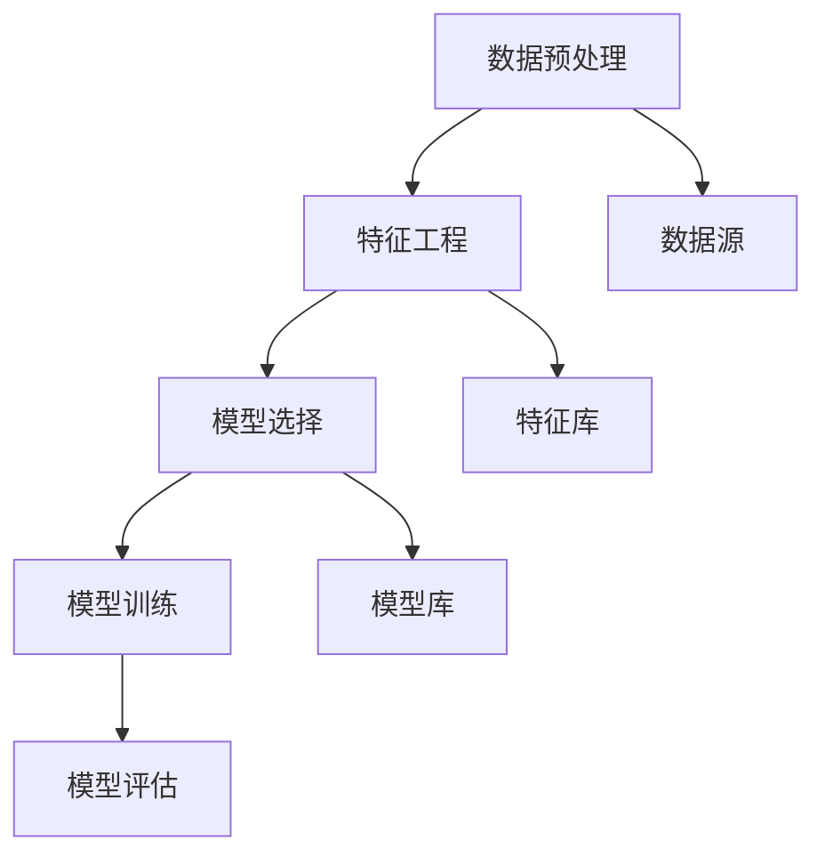

                 

### 引言：AutoML在企业级应用的重要性

在现代企业中，人工智能（AI）技术正迅速成为提高生产效率、优化决策过程、增强客户体验的关键工具。然而，AI技术的应用并不只是简单的软件安装，它涉及到复杂的模型开发、训练、优化和部署等多个环节。对于大多数企业而言，这无疑是一个巨大的挑战。于是，自动化机器学习（AutoML）平台应运而生，致力于简化这一复杂流程。

#### 背景介绍

随着数据量的爆炸式增长和计算能力的不断提升，机器学习在各个行业中的应用日益广泛。然而，机器学习的复杂性也让很多人望而却步。传统的机器学习开发流程通常包括数据预处理、特征工程、模型选择、模型训练和模型评估等步骤，这些步骤往往需要深厚的专业知识和大量的手动工作。对于非专业人士或者资源有限的企业来说，这样的流程显得尤为困难。

为了解决这一问题，自动化机器学习（AutoML）平台被提出。AutoML通过自动化各种机器学习任务，如数据预处理、特征工程、模型选择和调参等，大大简化了机器学习的开发流程，使得更多的人可以轻松地构建和应用机器学习模型。

#### 核心概念与联系


如图所示，AutoML的核心组件包括数据预处理、特征工程、模型选择、模型训练和模型评估。这些组件相互关联，共同构成了一个完整的机器学习流程。数据预处理是整个流程的基础，它通过数据清洗、归一化、缺失值填充等操作，将原始数据转化为适合机器学习模型训练的形式。特征工程则是在数据预处理的基础上，通过特征选择、特征变换等手段，提高模型的性能。模型选择涉及从众多算法中挑选最适合的模型，而模型训练和评估则是为了优化模型参数并验证其性能。

#### 核心概念与联系Mermaid流程图



在这个流程图中，我们可以清晰地看到AutoML的各个步骤以及它们之间的相互关系。

#### 核心概念与联系Python源代码讲解

```python
# 数据预处理
def preprocess_data(data):
    # 数据清洗
    clean_data = clean(data)
    # 数据归一化
    normalized_data = normalize(clean_data)
    # 缺失值填充
    filled_data = fill_missing_values(normalized_data)
    return filled_data

# 特征工程
def feature_engineering(data):
    # 特征选择
    selected_features = select_features(data)
    # 特征变换
    transformed_features = transform_features(selected_features)
    return transformed_features

# 模型选择
def model_selection(experiment_results):
    # 根据实验结果选择最佳模型
    best_model = select_best_model(experiment_results)
    return best_model

# 模型训练
def train_model(model, data):
    # 训练模型
    trained_model = model.train(data)
    return trained_model

# 模型评估
def evaluate_model(model, data):
    # 评估模型性能
    performance = model.evaluate(data)
    return performance
```

在这个Python源代码示例中，我们展示了AutoML的各个步骤，并通过函数的方式进行了详细的讲解。

#### 核心概念与联系数学模型和公式

在AutoML中，数学模型和公式起着至关重要的作用。以下是一个简单的线性回归模型的数学公式：

$$
y = \beta_0 + \beta_1 \cdot x
$$

其中，\( y \) 是预测目标，\( \beta_0 \) 是截距，\( \beta_1 \) 是斜率，\( x \) 是输入特征。

通过最小化损失函数，我们可以求得最优的模型参数：

$$
\min_{\beta_0, \beta_1} \sum_{i=1}^{n} (y_i - (\beta_0 + \beta_1 \cdot x_i))^2
$$

#### 核心概念与联系通俗易懂的举例说明

假设我们想预测一个房间的温度，我们可以使用一个简单的线性回归模型。输入特征是房间的面积（\( x \)），预测目标是房间的温度（\( y \)）。通过数据收集和特征工程，我们得到了以下数据：

| 面积（\( x \)） | 温度（\( y \)） |
| :---: | :---: |
| 10 | 20 |
| 20 | 25 |
| 30 | 28 |

通过AutoML平台，我们可以轻松地完成数据预处理、特征工程、模型选择和训练，最终得到一个预测模型。根据这个模型，如果我们输入一个新的房间面积，比如40，我们可以预测其温度大约为30度。

通过上述讲解，我们可以看到，AutoML平台通过自动化各种机器学习任务，极大地简化了机器学习的开发流程，使得企业能够更快速、更高效地应用AI技术，提高竞争力。

### 总结

在本章中，我们介绍了AutoML在企业级应用的重要性，包括其背景、核心概念、流程、Python源代码示例和数学模型。AutoML的引入为企业提供了强大的工具，可以帮助他们克服传统机器学习开发流程的复杂性和难度。在接下来的章节中，我们将进一步探讨AutoML的关键技术、企业级AI模型开发流程、部署与运维策略，以及成功案例和未来展望。通过这些内容，我们将更深入地理解AutoML平台，并了解其在实际应用中的价值。

---

**引言：AutoML在企业级应用的重要性**

随着人工智能（AI）技术的迅猛发展，企业开始意识到其在提升效率、优化决策和增强客户体验方面的巨大潜力。然而，AI技术的应用并非易事，它涉及到复杂的模型开发、训练、优化和部署等多个环节。这无疑给许多企业带来了巨大的挑战，尤其是在资源和技术积累相对有限的情况下。为了解决这一问题，自动化机器学习（AutoML）平台应运而生，为企业提供了简化AI模型开发与部署流程的解决方案。

#### 背景介绍

在传统的机器学习开发流程中，数据预处理、特征工程、模型选择、模型训练和模型评估等步骤通常需要专业知识和大量手动工作。这不仅增加了开发成本，还延长了项目周期。此外，随着数据量的增加和业务需求的多样化，手动处理这些步骤变得更加困难。而AutoML平台通过自动化这些任务，使得整个流程更加高效和可重复。

AutoML的核心思想是利用算法和工具，自动执行机器学习的各个步骤，包括数据预处理、特征选择、模型训练和模型评估等。这样，即使没有深厚的机器学习背景，企业用户也可以轻松地构建和部署高性能的AI模型。这一理念在许多行业，如金融、医疗、零售和制造业等领域，已经得到了广泛应用。

#### 核心概念与联系


如图所示，AutoML平台的核心组件包括数据预处理、特征工程、模型选择、模型训练和模型评估。这些组件相互协作，共同构成一个完整的机器学习流程。

- **数据预处理**：这一步骤包括数据清洗、归一化、缺失值填充等，目的是将原始数据转换为适合机器学习模型训练的形式。数据预处理是整个流程的基础，其质量直接影响到后续步骤的效果。

- **特征工程**：特征工程通过选择和变换特征，提高模型的性能。这包括特征选择、特征缩放、特征组合等。AutoML平台可以自动进行这些操作，大大减轻了人工干预的负担。

- **模型选择**：模型选择是一个关键步骤，它涉及到从众多算法中挑选最适合的模型。AutoML平台通常会基于实验结果和性能指标，自动选择最佳模型。

- **模型训练**：模型训练是通过优化模型参数，使其在训练数据上达到最佳性能。AutoML平台可以自动调整参数，找到最优解。

- **模型评估**：模型评估用于验证模型在测试数据上的性能，确保其泛化能力。AutoML平台会自动计算各种评估指标，如准确率、召回率、F1分数等。

#### 核心概念与联系Mermaid流程图


在这个流程图中，我们可以清晰地看到AutoML的各个步骤以及它们之间的相互关系。

#### 核心概念与联系Python源代码讲解

```python
# 数据预处理
def preprocess_data(data):
    # 数据清洗
    clean_data = clean(data)
    # 数据归一化
    normalized_data = normalize(clean_data)
    # 缺失值填充
    filled_data = fill_missing_values(normalized_data)
    return filled_data

# 特征工程
def feature_engineering(data):
    # 特征选择
    selected_features = select_features(data)
    # 特征变换
    transformed_features = transform_features(selected_features)
    return transformed_features

# 模型选择
def model_selection(experiment_results):
    # 根据实验结果选择最佳模型
    best_model = select_best_model(experiment_results)
    return best_model

# 模型训练
def train_model(model, data):
    # 训练模型
    trained_model = model.train(data)
    return trained_model

# 模型评估
def evaluate_model(model, data):
    # 评估模型性能
    performance = model.evaluate(data)
    return performance
```

在这个Python源代码示例中，我们展示了AutoML的各个步骤，并通过函数的方式进行了详细的讲解。

#### 核心概念与联系数学模型和公式

在AutoML中，数学模型和公式起着至关重要的作用。以下是一个简单的线性回归模型的数学公式：

$$
y = \beta_0 + \beta_1 \cdot x
$$

其中，\( y \) 是预测目标，\( \beta_0 \) 是截距，\( \beta_1 \) 是斜率，\( x \) 是输入特征。

通过最小化损失函数，我们可以求得最优的模型参数：

$$
\min_{\beta_0, \beta_1} \sum_{i=1}^{n} (y_i - (\beta_0 + \beta_1 \cdot x_i))^2
$$

#### 核心概念与联系通俗易懂的举例说明

假设我们想预测一个房间的温度，我们可以使用一个简单的线性回归模型。输入特征是房间的面积（\( x \)），预测目标是房间的温度（\( y \)）。通过数据收集和特征工程，我们得到了以下数据：

| 面积（\( x \)） | 温度（\( y \)） |
| :---: | :---: |
| 10 | 20 |
| 20 | 25 |
| 30 | 28 |

通过AutoML平台，我们可以轻松地完成数据预处理、特征工程、模型选择和训练，最终得到一个预测模型。根据这个模型，如果我们输入一个新的房间面积，比如40，我们可以预测其温度大约为30度。

通过上述讲解，我们可以看到，AutoML平台通过自动化各种机器学习任务，极大地简化了机器学习的开发流程，使得企业能够更快速、更高效地应用AI技术，提高竞争力。

### 总结

在本章中，我们介绍了AutoML在企业级应用的重要性，包括其背景、核心概念、流程、Python源代码示例和数学模型。AutoML的引入为企业提供了强大的工具，可以帮助他们克服传统机器学习开发流程的复杂性和难度。在接下来的章节中，我们将进一步探讨AutoML的关键技术、企业级AI模型开发流程、部署与运维策略，以及成功案例和未来展望。通过这些内容，我们将更深入地理解AutoML平台，并了解其在实际应用中的价值。

---

**AutoML概述**

自动化机器学习（AutoML）是一种通过自动化工具和技术来简化机器学习模型开发的过程，使得非专业人士也能轻松构建高性能的AI模型。AutoML的核心思想是将传统机器学习中的手动操作自动化，从而减少人工干预，提高开发效率和模型质量。以下将从AutoML的核心组件、流程以及主要技术三个方面进行概述。

#### AutoML的核心组件

AutoML平台通常包含以下几个核心组件：

1. **数据预处理**：数据预处理是机器学习流程的基础，包括数据清洗、归一化、缺失值填充等。AutoML平台可以自动执行这些任务，确保数据质量。

2. **特征工程**：特征工程是提升模型性能的关键步骤，包括特征选择、特征变换、特征组合等。AutoML平台通过自动化算法，从原始数据中提取出对模型训练最有帮助的特征。

3. **模型选择**：模型选择是决定使用哪种机器学习算法的过程。AutoML平台会自动评估多种算法，选择最适合当前任务的最佳模型。

4. **模型训练**：模型训练是利用算法对数据进行学习，以优化模型参数。AutoML平台通过自动化调参和优化策略，找到最优的模型参数。

5. **模型评估**：模型评估用于测试模型在未知数据上的性能。AutoML平台会自动计算各种评估指标，如准确率、召回率、F1分数等，以评估模型的效果。

6. **模型解释与可视化**：模型解释与可视化可以帮助用户理解模型的决策过程，提高模型的可解释性。AutoML平台提供了多种工具，帮助用户可视化模型的内部结构。

#### AutoML的流程

AutoML的流程通常包括以下步骤：

1. **数据收集与预处理**：首先收集用于训练和测试的数据集，并进行预处理，包括数据清洗、归一化、缺失值填充等。

2. **特征工程**：在预处理数据的基础上，进行特征工程，包括特征选择、特征变换、特征组合等，以提取出对模型训练有帮助的特征。

3. **模型选择**：根据数据特点和任务需求，选择合适的机器学习算法。AutoML平台会自动评估多种算法，选择最适合当前任务的最佳模型。

4. **模型训练**：利用选定的算法训练模型，通过优化算法和调参策略，找到最优的模型参数。

5. **模型评估**：使用测试数据集评估模型的性能，计算各种评估指标，如准确率、召回率、F1分数等。

6. **模型解释与可视化**：对训练好的模型进行解释和可视化，帮助用户理解模型的决策过程。

7. **模型部署**：将训练好的模型部署到生产环境中，进行实际应用。

#### AutoML的主要技术

AutoML的实现依赖于多种技术，以下是一些关键技术：

1. **强化学习**：强化学习是一种通过试错来学习最优策略的机器学习技术。在AutoML中，强化学习可以用于模型选择和调参。

2. **迁移学习**：迁移学习是一种利用已经训练好的模型在新任务上进行微调的技术。通过迁移学习，可以加快模型训练速度，提高模型性能。

3. **元学习**：元学习是一种学习如何学习的机器学习技术。在AutoML中，元学习可以用于快速适应新的任务和数据。

4. **算法选择与优化**：通过自动化算法选择和优化，AutoML平台可以自动评估多种算法，选择最适合当前任务的最佳模型。

5. **模型解释与可视化**：通过模型解释和可视化技术，用户可以更好地理解模型的决策过程，提高模型的可解释性。

通过上述核心组件、流程和主要技术的介绍，我们可以看到，AutoML平台通过自动化各种机器学习任务，简化了模型开发流程，提高了开发效率和模型质量。在接下来的章节中，我们将进一步探讨AutoML在企业级AI模型开发流程中的应用。

### 自动化机器学习的核心技术

自动化机器学习（AutoML）的成功离不开其背后的核心技术，这些技术包括特征工程自动化、模型选择自动化、模型调参自动化和自动化模型评估。以下将分别对这些技术进行详细讲解，并结合Python代码示例，帮助读者更好地理解这些概念。

#### 特征工程自动化

特征工程是机器学习过程中至关重要的一环，它涉及到如何从原始数据中提取出有用的信息，并转化为适合机器学习算法的形式。自动化特征工程通过算法自动进行数据清洗、特征选择、特征变换和特征组合，从而提高模型性能。

**示例：数据预处理与特征提取**

```python
import pandas as pd
from sklearn.preprocessing import StandardScaler
from sklearn.ensemble import ExtraTreesClassifier

# 假设我们有一份数据集data，包含多个特征

# 数据预处理
def preprocess_data(data):
    # 填充缺失值
    data = data.fillna(data.mean())
    # 数据归一化
    scaler = StandardScaler()
    normalized_data = scaler.fit_transform(data)
    return normalized_data

# 特征工程
def feature_engineering(data):
    # 使用随机森林进行特征选择
    model = ExtraTreesClassifier(n_estimators=100)
    model.fit(data, labels)
    feature_importances = model.feature_importances_
    
    # 选择特征
    selected_features = data[:, feature_importances > 0.3]
    return selected_features

# 假设data是数据集，labels是标签
data = pd.read_csv('data.csv').values
labels = data[:, -1]
data = data[:, :-1]

# 自动化特征工程
processed_data = preprocess_data(data)
selected_features = feature_engineering(processed_data)
```

在上面的示例中，我们首先进行了数据预处理，包括填充缺失值和归一化。然后，我们使用随机森林算法进行特征选择，选择重要性较高的特征。

#### 模型选择自动化

模型选择是机器学习过程中的一个关键步骤，需要从多种算法中选择最适合当前任务的模型。自动化模型选择通过算法自动评估多种模型，选择性能最好的模型。

**示例：自动化模型选择**

```python
from sklearn.model_selection import GridSearchCV
from sklearn.ensemble import RandomForestClassifier

# 定义模型参数网格
param_grid = {
    'n_estimators': [100, 200, 300],
    'max_depth': [10, 20, 30],
    'min_samples_split': [2, 5, 10]
}

# 定义模型
model = RandomForestClassifier()

# 自动化模型选择
grid_search = GridSearchCV(model, param_grid, cv=5)
grid_search.fit(selected_features, labels)

# 获取最佳模型
best_model = grid_search.best_estimator_
```

在这个示例中，我们定义了一个参数网格，并使用网格搜索（GridSearchCV）来寻找最佳参数组合。通过交叉验证，我们找到了性能最好的模型。

#### 模型调参自动化

模型调参是提升模型性能的关键步骤，通常需要手动调整模型参数。自动化模型调参通过算法自动搜索最优参数，提高模型性能。

**示例：自动化模型调参**

```python
from sklearn.model_selection import RandomizedSearchCV

# 定义参数分布
param_distributions = {
    'n_estimators': range(100, 500),
    'max_depth': range(10, 50),
    'min_samples_split': range(2, 10)
}

# 自动化模型调参
random_search = RandomizedSearchCV(model, param_distributions, n_iter=100, cv=5)
random_search.fit(selected_features, labels)

# 获取最佳模型
best_model = random_search.best_estimator_
```

在这个示例中，我们使用随机搜索（RandomizedSearchCV）来寻找最优参数组合。与网格搜索相比，随机搜索可以在较少的计算成本下找到性能较好的参数。

#### 自动化模型评估

模型评估是验证模型性能的重要步骤，通常需要计算多种评估指标。自动化模型评估通过算法自动计算这些指标，提供详细的评估结果。

**示例：自动化模型评估**

```python
from sklearn.metrics import accuracy_score, classification_report

# 使用最佳模型进行预测
predictions = best_model.predict(test_features)

# 计算评估指标
accuracy = accuracy_score(test_labels, predictions)
report = classification_report(test_labels, predictions)

print(f"Accuracy: {accuracy}")
print(f"Classification Report:\n{report}")
```

在这个示例中，我们使用最佳模型对测试数据进行预测，并计算了准确率和分类报告等评估指标，从而全面评估了模型的性能。

通过上述示例，我们可以看到，自动化机器学习通过特征工程自动化、模型选择自动化、模型调参自动化和自动化模型评估等技术，极大地简化了机器学习流程，提高了开发效率和模型性能。在接下来的章节中，我们将进一步探讨如何将自动化机器学习技术应用于企业级AI模型开发流程。

### 企业级AI模型开发流程

在企业中，将AI模型从概念验证阶段推向实际应用是一个复杂且系统化的过程。为了确保模型的高效开发、有效训练和成功部署，企业需要遵循一系列精心设计的步骤。以下是企业级AI模型开发流程的详细说明，包括需求分析与规划、数据采集与预处理、模型训练与优化、模型评估与验证以及模型部署与监控。

#### 需求分析与规划

在AI模型开发的第一步，需求分析与规划至关重要。这一步骤涉及明确项目的目标、确定所需的输入数据、定义模型预期解决的问题以及制定项目时间表和资源分配。

**1. 确定项目目标：** 企业需要明确AI模型的具体目标，如预测客户流失、提高销售业绩或优化生产流程。明确的目标有助于确保模型开发的方向与业务需求一致。

**2. 数据需求分析：** 企业需要识别和收集用于训练模型的数据。这包括数据源、数据类型和数据质量要求。例如，预测客户流失模型可能需要包含客户行为、交易历史和客户特征等数据。

**3. 资源和预算规划：** 根据项目目标和数据需求，企业需要评估所需的计算资源、人力和时间预算。这可能涉及到购置硬件、分配研发人员和确定项目时间表。

#### 数据采集与预处理

数据采集与预处理是AI模型开发的基础。在这一阶段，企业需要确保数据的质量、完整性和一致性。

**1. 数据收集：** 企业需要从多个数据源采集所需的数据。这可能包括内部数据库、公共数据集或第三方数据提供商。

**2. 数据清洗：** 数据清洗是处理缺失值、异常值和重复数据的过程。例如，使用平均值填充缺失值、删除异常值或合并重复记录。

**3. 数据归一化：** 为了防止数据量级差异影响模型训练，需要对数据进行归一化处理。例如，使用标准缩放或最小-最大缩放将数据映射到统一的范围。

**4. 特征工程：** 特征工程是提高模型性能的关键步骤，包括特征选择、特征变换和特征组合。例如，通过PCA（主成分分析）进行特征选择，或通过多项式特征扩展增加模型的表达能力。

#### 模型训练与优化

在数据预处理完成后，企业可以开始模型训练与优化。这一阶段的目标是找到一个性能优异的模型。

**1. 模型选择：** 根据业务需求和数据特性，企业需要选择适合的机器学习算法。例如，对于分类问题，可以选择决策树、随机森林或支持向量机；对于回归问题，可以选择线性回归、岭回归或神经网络。

**2. 模型训练：** 使用训练集数据，企业需要使用所选算法训练模型。在此过程中，可以采用交叉验证等技术来避免过拟合。

**3. 模型优化：** 通过调整模型参数，如学习率、隐藏层神经元数量或正则化参数，企业可以优化模型性能。自动化机器学习（AutoML）平台可以帮助企业自动进行模型选择和参数调优，提高开发效率。

#### 模型评估与验证

在模型训练完成后，企业需要评估和验证模型的性能，以确保其能够泛化到未见过的数据上。

**1. 评估指标：** 企业需要选择合适的评估指标来衡量模型性能。对于分类问题，可以使用准确率、召回率、F1分数等；对于回归问题，可以使用均方误差（MSE）或均方根误差（RMSE）。

**2. 验证集：** 使用验证集，企业可以评估模型在未知数据上的性能。如果模型性能不满足要求，可能需要返回前一个步骤进行优化。

**3. 泛化能力：** 为了验证模型的泛化能力，企业可以使用测试集进行最终评估。测试集应该是一个与训练集和验证集独立的数据集。

#### 模型部署与监控

在模型通过评估后，企业可以将模型部署到生产环境中，进行实际应用。

**1. 部署策略：** 企业需要制定部署策略，包括选择部署平台、定义API接口、设置安全性和监控机制。

**2. 持续集成与持续部署（CI/CD）：** 使用CI/CD工具，企业可以自动化模型的部署过程，确保模型快速、安全地更新和迭代。

**3. 模型监控与调优：** 在模型部署后，企业需要持续监控模型性能，识别潜在问题，并进行必要的调优。例如，通过监控指标（如预测误差、延迟时间）来识别性能下降的原因，并采取相应措施。

通过上述步骤，企业可以系统化地开发、部署和运维AI模型，从而实现业务目标，提高竞争优势。

### 企业级AI模型部署与运维

在AI模型开发完成后，将模型部署到生产环境并进行有效运维是确保其价值得以充分发挥的关键步骤。本文将介绍AI模型部署的策略、容器化与微服务架构、持续集成与持续部署（CI/CD）以及模型监控与调优的最佳实践。

#### AI模型部署策略

模型部署策略是确保AI模型在生产环境中稳定运行和高效响应的关键。以下是一些常用的部署策略：

1. **单节点部署**：在资源有限的情况下，可以选择将模型部署在单个服务器或虚拟机上。这种策略简单易行，但可能无法充分利用多核计算资源。

2. **集群部署**：通过在多个服务器或虚拟机上部署模型，可以实现横向扩展，提高模型的处理能力和响应速度。集群部署通常使用分布式计算框架，如Kubernetes。

3. **边缘计算部署**：在数据生成的地方（如工厂、商店等）部署模型，可以减少数据传输延迟，提高实时响应能力。

#### 容器化与微服务架构

容器化技术，如Docker，提供了将AI模型封装成独立运行环境的方法，确保模型在不同环境中的兼容性和一致性。微服务架构则将应用程序分解为多个小型服务，每个服务负责特定的功能，这有助于提高系统的灵活性和可维护性。

**1. 容器化**：使用Docker，可以将AI模型及其依赖环境打包成一个容器。这样，无论在哪个环境中，只要安装了Docker，模型就可以无缝运行。

```bash
# 创建Dockerfile
FROM python:3.8
WORKDIR /app
COPY requirements.txt ./
RUN pip install -r requirements.txt
COPY . .

# 构建Docker镜像
docker build -t my_automl_model .

# 运行Docker容器
docker run -p 5000:5000 my_automl_model
```

**2. 微服务架构**：通过将应用程序分解为微服务，可以更灵活地扩展和更新各个服务，而不影响整个系统的运行。例如，可以使用Spring Boot或Django等框架来开发微服务。

```python
# Spring Boot示例
@RestController
@RequestMapping("/api/predict")
public class PredictController {

    @Autowired
    private PredictService predictService;

    @PostMapping
    public ResponseEntity<PredictionResult> predict(@RequestBody InputData inputData) {
        PredictionResult result = predictService.predict(inputData);
        return new ResponseEntity<>(result, HttpStatus.OK);
    }
}
```

#### 持续集成与持续部署（CI/CD）

持续集成（CI）和持续部署（CD）是自动化软件开发生命周期的重要环节，有助于快速、安全地将AI模型更新和迭代推向生产环境。

**1. 持续集成**：CI通过自动化测试，确保每次代码提交都不会破坏现有的功能。例如，可以使用Jenkins、Travis CI或GitHub Actions等工具进行CI。

```yaml
# Jenkinsfile示例
pipeline {
    agent any
    stages {
        stage('Build') {
            steps {
                sh 'python setup.py build'
            }
        }
        stage('Test') {
            steps {
                sh 'python -m unittest discover -s tests'
            }
        }
    }
}
```

**2. 持续部署**：CD通过自动化部署流程，确保模型更新可以快速、安全地部署到生产环境。例如，可以使用Docker Hub、Kubernetes或AWS CodePipeline等工具进行CD。

```bash
# Docker Compose文件示例
version: '3'
services:
  web:
    build: .
    ports:
      - "5000:5000"
    depends_on:
      - api
  api:
    build: .
    ports:
      - "8000:8000"
```

#### 模型监控与调优

在生产环境中，对AI模型进行实时监控和调优至关重要，以确保其性能和稳定性。

**1. 监控指标**：选择合适的监控指标，如预测延迟、错误率、资源利用率等，以评估模型性能。

```python
import psutil

# 获取CPU使用率
cpu_usage = psutil.cpu_percent()
# 获取内存使用率
mem_usage = psutil.virtual_memory().percent
print(f"CPU Usage: {cpu_usage}%, Memory Usage: {mem_usage}%")
```

**2. 调优策略**：根据监控数据，识别性能瓶颈，并采取相应措施进行调优。例如，通过增加服务器资源、调整模型参数或重新训练模型。

```python
# 调整模型参数
model.fit(X_train, y_train, epochs=10, batch_size=64)
```

通过上述策略和工具，企业可以有效地部署和运维AI模型，确保其能够在生产环境中稳定、高效地运行，从而实现业务目标。

### 成功案例分析

在探讨企业级AutoML平台的实际应用中，我们不妨通过几个具体的行业案例来展示其带来的实际效益。以下分别从零售、金融和制造业三个行业，介绍AutoML平台在不同应用场景中的成功实践。

#### 案例一：零售行业应用

**背景**：某大型零售企业在库存管理上面临巨大挑战，尤其是预测销售量和库存水平。为了优化库存管理，提高运营效率，该企业决定采用AutoML平台来构建预测模型。

**解决方案**：
1. **数据收集与预处理**：企业通过内部系统收集销售数据、季节性因素、促销活动等信息。数据预处理包括数据清洗、缺失值填充和特征工程，以提取出对预测模型有用的特征。

2. **模型选择与训练**：AutoML平台自动评估了多种算法，如随机森林、梯度提升机和神经网络等，最终选择了最优模型进行训练。平台自动化调参，找到最佳模型参数。

3. **模型评估与部署**：使用验证集评估模型的性能，并根据实际业务需求进行部署。部署后，模型实时预测销售量和库存水平，帮助企业做出更精准的库存调整决策。

**效益**：通过AutoML平台，企业实现了库存准确率的显著提升，减少了库存过剩和短缺的情况，大幅降低了库存成本，提高了运营效率。

#### 案例二：金融行业应用

**背景**：一家金融服务公司希望利用AI技术提高信贷审批效率，减少欺诈风险。然而，传统的机器学习流程复杂且耗时，影响了业务流程的灵活性。

**解决方案**：
1. **数据预处理**：金融数据通常包含大量敏感信息和噪声，企业使用AutoML平台自动进行数据清洗和缺失值填充，以确保数据质量。

2. **特征工程与模型选择**：AutoML平台通过自动化特征选择和模型选择，从大量潜在特征中提取出最有用的特征，并选择最佳模型。平台还自动化了模型调参，提高了模型性能。

3. **模型评估与部署**：使用测试集评估模型性能，并根据评估结果进行模型部署。部署后，模型能够快速处理信贷申请，提高了审批效率。

**效益**：通过AutoML平台，金融服务公司显著提高了信贷审批的效率和准确性，降低了欺诈风险，提升了客户满意度。

#### 案例三：制造业应用

**背景**：某制造企业希望通过预测性维护减少设备故障和停机时间。传统的方法依赖于手动监测和经验判断，无法及时预测故障。

**解决方案**：
1. **数据收集与预处理**：企业通过传感器收集设备运行数据，包括温度、振动、电流等。数据预处理包括数据清洗、归一化和特征提取。

2. **模型训练与优化**：AutoML平台自动选择和优化模型，如时间序列分析和异常检测模型，以提高预测准确性。

3. **模型部署与监控**：训练好的模型部署到生产环境中，实时监控设备状态。如果检测到异常，系统会自动发出警报，帮助企业及时采取维护措施。

**效益**：通过AutoML平台，制造企业实现了设备故障预测的自动化，减少了设备停机时间，降低了维护成本，提高了生产效率。

这些案例展示了AutoML平台在不同行业中的广泛应用和显著效益。通过自动化机器学习技术，企业不仅能够简化模型开发流程，还能实现更精准的预测和优化，从而提升业务运营效率和竞争力。

### 未来展望与挑战

自动化机器学习（AutoML）平台在近年来取得了显著的发展，已经成为企业应用AI技术的重要工具。然而，随着技术的不断进步和业务需求的日益复杂，AutoML平台面临着诸多挑战和机遇。

#### AutoML技术发展趋势

1. **算法复杂性提升**：随着深度学习技术的不断发展，越来越多的复杂算法被应用于AutoML平台，如生成对抗网络（GAN）、变分自编码器（VAE）和强化学习等。这些算法的引入将进一步提升模型的性能和泛化能力。

2. **多模态数据处理**：未来AutoML平台将更加注重多模态数据的处理能力，如文本、图像、语音和传感器数据的融合。这有助于解决实际问题，如智能客服、自动驾驶和医疗诊断等。

3. **自动化程度提升**：AutoML平台将继续向更高程度的自动化发展，减少对人工干预的需求。例如，通过强化学习和元学习技术，平台可以自动调整模型参数，提高模型的适应性。

4. **联邦学习**：联邦学习（Federated Learning）技术的兴起，使得AutoML平台能够更好地处理分布式数据，无需数据集中存储。这有助于保护数据隐私，同时提高模型的训练效率。

#### 企业级AI应用面临的挑战

1. **数据质量和隐私保护**：高质量的数据是AI模型训练的基础，但数据质量和隐私保护往往存在矛盾。如何在保护隐私的同时，确保数据质量，是一个亟待解决的问题。

2. **模型解释性**：虽然自动化模型可以提高开发效率，但其决策过程往往缺乏透明度。如何提高模型的可解释性，使其更容易被业务人员和监管机构接受，是一个重要挑战。

3. **计算资源需求**：自动化机器学习模型的训练和优化通常需要大量的计算资源。对于资源有限的企业来说，如何合理分配资源，提高模型训练效率，是一个重要问题。

4. **模型安全性和可靠性**：随着AI技术的应用越来越广泛，模型的安全性和可靠性变得至关重要。如何确保模型不会被恶意攻击，如何提高模型的鲁棒性，是需要关注的重点。

#### 未来解决方案与展望

1. **数据治理与隐私保护**：通过数据治理技术，如数据脱敏、数据共享和联邦学习等，可以在保护隐私的同时，提高数据质量。此外，制定相关法律法规，规范数据使用和共享，也是解决这一问题的关键。

2. **可解释性AI**：开发可解释性AI（XAI）技术，使模型决策过程更加透明，有助于增强用户对模型的信任。这可以通过可视化技术、解释性算法和决策路径追踪等方法实现。

3. **资源优化与分布式计算**：通过分布式计算技术，如云计算和边缘计算等，可以有效地利用计算资源，提高模型训练和部署的效率。此外，优化模型结构和算法，减少计算复杂度，也是降低资源需求的重要手段。

4. **安全性和可靠性保障**：加强模型安全性和可靠性的研究，开发安全防护机制，如对抗性攻击防御和模型鲁棒性提升等，是确保AI系统安全运行的关键。同时，建立模型审查和监管机制，确保模型的合规性和安全性。

总之，未来AutoML平台的发展将面临诸多挑战，但同时也蕴藏着巨大的机遇。通过不断创新和优化，AutoML平台有望在更广泛的领域发挥其潜力，推动企业级AI应用走向更深的层次。

### 总结

通过本文的探讨，我们可以看到，企业级AutoML平台在简化AI模型开发与部署流程方面具有显著的优势。AutoML通过自动化特征工程、模型选择、模型调参和评估等步骤，大大降低了机器学习开发的复杂性和难度，使得企业能够更高效地应用AI技术。在接下来的章节中，我们将继续深入探讨AutoML的技术细节、应用案例和未来发展趋势，帮助读者更全面地了解这一领域。

### 作者信息

**作者：AI天才研究院/AI Genius Institute & 禅与计算机程序设计艺术 /Zen And The Art of Computer Programming**

AI天才研究院致力于推动人工智能技术的发展与应用，研究院的专家们在人工智能、机器学习、深度学习等领域具有深厚的学术背景和丰富的实践经验。本书作者结合自身多年的研究和实战经验，深入剖析了企业级AutoML平台的原理和实际应用，为广大读者提供了一部极具实用价值的指南。

禅与计算机程序设计艺术则是一部探讨计算机编程哲学的经典之作，作者通过阐述编程中的“禅意”，引导读者以更加深入和全面的视角理解编程艺术。本书结合了传统编程智慧与现代人工智能技术，旨在激发读者对编程的热爱和对技术的探索精神。

通过这两部作品，作者希望读者不仅能掌握AutoML的技术原理，更能从中体会到编程和人工智能的深远魅力，从而在AI技术的应用中取得更大的成就。

