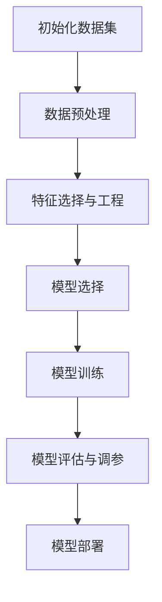

                 

### 企业级AutoML解决方案：民主化AI开发

在当今技术飞速发展的时代，人工智能（AI）已成为推动产业变革的核心动力。随着AI技术的普及，越来越多的企业开始认识到AI应用的重要性，但如何高效地开发和应用AI模型，尤其是对于非专业开发人员，成为了一大挑战。自动化机器学习（AutoML）作为解决这一问题的有效途径，正逐渐成为企业级AI开发的新宠。本文将深入探讨企业级AutoML解决方案，旨在揭示其如何实现AI开发的民主化，为企业带来前所未有的变革。

关键词：企业级AutoML、自动化机器学习、AI开发民主化、模型选择、算法调参、框架对比

摘要：本文首先介绍了企业级AutoML的概念和背景，探讨了其为何成为企业级AI开发的重要解决方案。接着，详细分析了AutoML的核心原理和关键步骤，包括数据预处理、特征选择与工程、模型选择与调参等。然后，我们对比了主流的AutoML框架，如AutoSklearn、AutoML豆豆和Google AutoML，并展示了如何在实际项目中应用AutoML进行模型训练和优化。最后，本文通过案例研究和最佳实践，为企业级AutoML的实施提供了实用建议，展望了其未来的发展趋势。

### 背景介绍

#### 自动化机器学习的兴起

随着AI技术的不断进步，机器学习（ML）的应用范围越来越广泛。然而，传统的机器学习开发过程相对复杂，需要大量的专业知识和技术投入。尤其是对于企业而言，缺乏专业的数据科学家和算法工程师，往往难以开展高效的AI项目。因此，自动化机器学习（AutoML）应运而生，旨在通过自动化工具简化机器学习流程，降低开发门槛，使得非专业人员也能轻松地实现机器学习模型的构建。

AutoML通过自动化处理数据预处理、特征选择、模型选择和调参等步骤，大幅减少了人工干预的需求，提高了模型开发效率。此外，AutoML还利用了深度学习和强化学习等先进技术，不断优化模型性能，使其在多种任务上取得优异表现。随着云计算、大数据和深度学习等技术的成熟，AutoML逐渐成为企业级AI开发的重要工具。

#### 企业级AI开发的挑战

企业级AI开发面临诸多挑战，主要体现在以下几个方面：

1. **技术门槛高**：机器学习需要丰富的数学和编程知识，非专业人员难以掌握。
2. **数据获取困难**：高质量的数据是机器学习模型训练的基础，但企业往往难以获取足够的数据。
3. **模型调优复杂**：传统机器学习开发过程中，模型调优是一个繁琐且耗时的过程，需要反复试验和调整。
4. **资源有限**：企业尤其是中小企业，通常缺乏足够的资源（如人力、资金和设备）进行大规模的AI项目。

为了解决这些问题，企业迫切需要一种能够简化机器学习开发流程的工具，这就是AutoML的作用所在。通过AutoML，企业可以在较低的技术门槛和资源投入下，快速开发和应用机器学习模型，从而实现AI技术的商业价值。

#### AutoML在企业中的应用

AutoML在企业中的应用越来越广泛，涵盖了多个行业和领域。以下是一些典型的应用场景：

1. **金融行业**：利用AutoML进行风险控制、欺诈检测和客户行为分析，提高业务效率和安全性。
2. **医疗行业**：通过AutoML实现疾病预测、诊断和治疗方案优化，提升医疗服务质量。
3. **制造业**：利用AutoML进行生产过程优化、设备故障预测和供应链管理，提高生产效率。
4. **零售行业**：通过AutoML进行需求预测、库存管理和个性化推荐，提升客户满意度。
5. **能源行业**：利用AutoML进行能源消耗预测、设备维护和故障预警，提高能源利用效率。

AutoML不仅简化了机器学习开发流程，还提高了模型性能和稳定性，使得企业能够更快地实现AI技术的商业化应用，从而在激烈的市场竞争中占据优势地位。

### 核心概念与联系

#### 自动化机器学习（AutoML）

自动化机器学习（AutoML）是指利用算法和工具自动化地完成机器学习模型开发的过程。AutoML旨在降低机器学习开发的门槛，使非专业人员也能构建高性能的机器学习模型。它通过自动化处理数据预处理、特征选择、模型选择和调参等步骤，大幅减少了人工干预的需求。

**Mermaid流程图：**


#### 数据预处理

数据预处理是机器学习模型开发的第一步，主要包括数据清洗、数据转换和数据归一化等过程。数据预处理的质量直接影响模型的表现，因此需要自动化处理以提高效率和准确性。

**Python代码示例：**
```python
import pandas as pd
from sklearn.model_selection import train_test_split

# 加载数据集
data = pd.read_csv('data.csv')

# 数据清洗
data.dropna(inplace=True)

# 数据转换
data['categorical_feature'] = data['categorical_feature'].map({0: 'class0', 1: 'class1'})

# 数据归一化
X = data.iloc[:, :-1]
y = data.iloc[:, -1]
X_train, X_test, y_train, y_test = train_test_split(X, y, test_size=0.2, random_state=42)
```

#### 特征选择与工程

特征选择与工程是提高机器学习模型性能的关键步骤，主要包括特征提取、特征选择和特征工程等过程。通过自动化工具，可以快速地探索和选择最佳特征，提高模型的泛化能力。

**Python代码示例：**
```python
from sklearn.feature_selection import SelectKBest, f_classif
from sklearn.ensemble import RandomForestClassifier

# 特征选择
selector = SelectKBest(f_classif, k=5)
X_new = selector.fit_transform(X_train, y_train)

# 特征工程
clf = RandomForestClassifier()
clf.fit(X_new, y_train)
```

#### 模型选择与调参

模型选择与调参是机器学习开发的另一个关键步骤，主要包括选择合适的模型和调整模型参数。通过自动化工具，可以快速地尝试不同的模型和参数组合，找到最优解。

**Python代码示例：**
```python
from sklearn.model_selection import GridSearchCV
from sklearn.ensemble import RandomForestClassifier

# 模型选择
param_grid = {
    'n_estimators': [100, 200, 300],
    'max_depth': [10, 20, 30]
}

clf = RandomForestClassifier()
grid_search = GridSearchCV(clf, param_grid, cv=5)
grid_search.fit(X_train, y_train)

# 调参
best_params = grid_search.best_params_
clf_best = RandomForestClassifier(**best_params)
clf_best.fit(X_new, y_train)
```

#### 模型评估与优化

模型评估与优化是确保机器学习模型性能的重要步骤，主要包括评估模型性能和优化模型结构。通过自动化工具，可以自动化地评估模型性能并进行优化。

**Python代码示例：**
```python
from sklearn.metrics import accuracy_score

# 评估模型
y_pred = clf_best.predict(X_test)
accuracy = accuracy_score(y_test, y_pred)
print(f"Model accuracy: {accuracy:.2f}")

# 优化模型
from sklearn.model_selection import cross_val_score
import numpy as np

scores = cross_val_score(clf_best, X_new, y_train, cv=5)
print(f"Cross-validated accuracy: {np.mean(scores):.2f}")
```

### 核心算法原理讲解

#### AutoML的工作流程

AutoML的工作流程主要包括以下几个步骤：

1. **数据预处理**：自动识别数据中的缺失值、异常值和重复值，进行数据清洗和数据转换。
2. **特征选择与工程**：自动探索数据中的特征，进行特征提取、特征选择和特征工程，以提高模型的性能。
3. **模型选择与调参**：自动选择合适的模型并进行参数调整，通过交叉验证和网格搜索等手段找到最优参数组合。
4. **模型评估与优化**：自动评估模型性能，并进行优化，以提高模型的准确性和泛化能力。
5. **模型部署**：将训练好的模型部署到生产环境中，进行实时预测和应用。

**Python代码示例：**
```python
from automl import AutoML

# 初始化AutoML
aml = AutoML()

# 设置参数
aml.set_params({
    'task': 'binary_classification',
    'metric': 'accuracy',
    'max_iterations': 50,
    'timeout': 600
})

# 加载数据
aml.load_data('data.csv', label='target')

# 自动执行AutoML流程
aml.fit()

# 获取最佳模型
best_model = aml.get_best_model()

# 评估模型
aml.evaluate(best_model, 'test.csv')
```

#### 数据预处理

数据预处理是AutoML的基础步骤，包括以下关键环节：

1. **数据清洗**：去除缺失值、异常值和重复值，确保数据质量。
2. **数据转换**：将不同类型的数据进行统一处理，如将类别型数据转换为数值型数据。
3. **数据归一化**：通过归一化或标准化处理，使数据具有相同的尺度，避免数据分布不均对模型训练的影响。

**Python代码示例：**
```python
from sklearn.preprocessing import StandardScaler

# 数据清洗
data.dropna(inplace=True)

# 数据转换
data['categorical_feature'] = data['categorical_feature'].map({0: 'class0', 1: 'class1'})

# 数据归一化
scaler = StandardScaler()
X_scaled = scaler.fit_transform(X)
```

#### 特征选择与工程

特征选择与工程是提升模型性能的关键步骤，主要包括以下技术：

1. **特征提取**：通过降维技术（如PCA）、特征工程技术（如特征交叉）提取有用特征。
2. **特征选择**：通过特征选择算法（如递归特征消除、L1正则化等）选择最佳特征。
3. **特征工程**：通过特征变换（如编码、缩放、离散化等）提高特征的表征能力。

**Python代码示例：**
```python
from sklearn.feature_selection import SelectKBest, f_classif
from sklearn.ensemble import RandomForestClassifier

# 特征选择
selector = SelectKBest(f_classif, k=5)
X_new = selector.fit_transform(X_train, y_train)

# 特征工程
clf = RandomForestClassifier()
clf.fit(X_new, y_train)
```

#### 模型选择与调参

模型选择与调参是AutoML的核心步骤，主要包括以下技术：

1. **模型选择**：通过自动化工具选择合适的模型，如随机森林、支持向量机、神经网络等。
2. **参数调参**：通过交叉验证和网格搜索等技术，自动调整模型参数，以找到最优参数组合。

**Python代码示例：**
```python
from sklearn.model_selection import GridSearchCV
from sklearn.ensemble import RandomForestClassifier

# 模型选择
param_grid = {
    'n_estimators': [100, 200, 300],
    'max_depth': [10, 20, 30]
}

clf = RandomForestClassifier()
grid_search = GridSearchCV(clf, param_grid, cv=5)
grid_search.fit(X_train, y_train)

# 调参
best_params = grid_search.best_params_
clf_best = RandomForestClassifier(**best_params)
clf_best.fit(X_new, y_train)
```

#### 模型评估与优化

模型评估与优化是确保模型性能的重要步骤，主要包括以下技术：

1. **模型评估**：通过交叉验证、ROC曲线、精度、召回率等指标评估模型性能。
2. **模型优化**：通过集成学习、模型压缩、模型剪枝等技术，优化模型结构和参数，提高模型性能。

**Python代码示例：**
```python
from sklearn.metrics import accuracy_score

# 评估模型
y_pred = clf_best.predict(X_test)
accuracy = accuracy_score(y_test, y_pred)
print(f"Model accuracy: {accuracy:.2f}")

# 优化模型
from sklearn.model_selection import cross_val_score
import numpy as np

scores = cross_val_score(clf_best, X_new, y_train, cv=5)
print(f"Cross-validated accuracy: {np.mean(scores):.2f}")
```

### 主流AutoML框架介绍

#### AutoSklearn

AutoSklearn是一个基于Scikit-learn的开源AutoML框架，旨在自动化机器学习模型的构建和调参。它支持多种算法和优化技术，如贝叶斯优化、遗传算法和随机搜索等。

**安装与使用：**
```python
pip install autosklearn

from autosklearn.classification import AutoSklearnClassifier
from sklearn.datasets import load_iris

# 加载数据集
X, y = load_iris(trueodka_data=True)

# 初始化AutoSklearn
aml = AutoSklearnClassifier()

# 训练模型
aml.fit(X, y)

# 预测
predictions = aml.predict(X)

# 评估模型
aml.evaluate(X, y)
```

#### AutoML豆豆

AutoML豆豆是一个基于Python的开源AutoML框架，支持多种任务类型，如分类、回归和聚类。它提供了丰富的自动化工具，如数据预处理、特征选择和模型选择等。

**安装与使用：**
```python
pip install automl_doudou

from automl_doudou import AutoML

# 初始化AutoML
aml = AutoML()

# 加载数据
data = pd.read_csv('data.csv')

# 设置参数
aml.set_params({
    'task': 'binary_classification',
    'metric': 'accuracy',
    'max_iterations': 50
})

# 训练模型
aml.fit(data, label='target')

# 预测
predictions = aml.predict(data)

# 评估模型
aml.evaluate(predictions, data['target'])
```

#### Google AutoML

Google AutoML是一个基于云服务的自动化机器学习平台，提供了多种预训练模型和自动化工具，如数据预处理、特征工程和模型调参等。它支持多种任务类型，如文本分类、图像识别和语音识别等。

**使用与部署：**
```python
from googleapiclient.discovery import build
from googleapiclient.errors import HttpError

# 初始化Google AutoML
service = build('automl', 'v1beta1')

# 创建模型
model_name = 'my_automl_model'
model = service.projects().models().create(body={'display_name': model_name}, parent='projects/your_project_id').execute()

# 训练模型
dataset_id = 'your_dataset_id'
model_id = model['name'].split('/')[-1]
response = service.projects().locations().models().train(body={'model': {'id': model_id}, 'dataset_id': dataset_id}, parent=f'projects/your_project_id/locations/your_location_id').execute()

# 预测
prediction = service.projects().locations().models().predict(body={'name': f'projects/your_project_id/locations/your_location_id/models/{model_id}', 'instances': data_to_predict}, parent=f'projects/your_project_id/locations/your_location_id').execute()

# 评估模型
evaluation = service.projects().locations().models().evaluate(body={'name': f'projects/your_project_id/locations/your_location_id/models/{model_id}', 'evaluation_entries': {'evaluation_instance_id': prediction['predictions'][0]['name'].split('/')[-1]}}, parent=f'projects/your_project_id/locations/your_location_id').execute()
```

### AutoML流程与实践

#### 项目规划

在开始AutoML项目之前，需要进行详细的规划，包括明确项目目标、数据来源、数据质量评估和模型性能要求等。项目规划是确保项目成功实施的关键步骤。

**步骤：**
1. **明确项目目标**：确定项目需要解决的问题，如预测准确性、响应速度等。
2. **数据来源**：确定数据来源和数据量，确保数据质量满足模型训练需求。
3. **数据质量评估**：评估数据的质量，包括数据完整性、一致性、准确性等。
4. **模型性能要求**：确定模型性能要求，如预测精度、召回率、响应时间等。

**工具与技巧：**
- **数据探索**：使用Python的Pandas、Matplotlib等工具进行数据探索，识别数据中的异常值、缺失值和重复值。
- **数据可视化**：使用Python的Seaborn、Plotly等工具进行数据可视化，直观地展示数据分布和特征关系。

#### 数据收集与清洗

数据收集与清洗是AutoML项目的关键步骤，直接影响模型的质量和性能。

**步骤：**
1. **数据收集**：从多个数据源收集数据，包括内部数据库、外部API、公共数据集等。
2. **数据清洗**：处理数据中的缺失值、异常值和重复值，确保数据质量。
3. **数据转换**：将不同类型的数据进行统一处理，如将类别型数据转换为数值型数据。
4. **数据归一化**：通过归一化或标准化处理，使数据具有相同的尺度，避免数据分布不均对模型训练的影响。

**工具与技巧：**
- **数据探索**：使用Python的Pandas、Matplotlib等工具进行数据探索。
- **数据清洗**：使用Python的Pandas、Scikit-learn等工具进行数据清洗。
- **数据转换**：使用Python的Pandas、NumPy等工具进行数据转换。
- **数据归一化**：使用Python的Scikit-learn、Scipy等工具进行数据归一化。

#### 模型训练与优化

模型训练与优化是AutoML项目的核心步骤，主要包括以下环节：

**步骤：**
1. **数据分割**：将数据集分为训练集、验证集和测试集，确保数据分布的均匀性。
2. **模型训练**：使用AutoML框架自动训练模型，并选择最佳模型。
3. **参数调参**：通过交叉验证和网格搜索等技术，自动调整模型参数，以找到最优参数组合。
4. **模型评估**：使用验证集和测试集评估模型性能，包括预测准确性、响应速度等指标。
5. **模型优化**：根据评估结果，优化模型结构和参数，以提高模型性能。

**工具与技巧：**
- **数据分割**：使用Python的Scikit-learn等工具进行数据分割。
- **模型训练**：使用Python的Scikit-learn、AutoML框架等工具进行模型训练。
- **参数调参**：使用Python的Scikit-learn、AutoML框架等工具进行参数调参。
- **模型评估**：使用Python的Scikit-learn、AutoML框架等工具进行模型评估。
- **模型优化**：根据评估结果，调整模型结构和参数。

#### 模型部署与监控

模型部署与监控是确保模型持续稳定运行的关键步骤。

**步骤：**
1. **模型部署**：将训练好的模型部署到生产环境中，进行实时预测和应用。
2. **模型监控**：监控模型性能和资源使用情况，及时发现并解决潜在问题。
3. **模型迭代**：根据业务需求和数据变化，定期更新和优化模型。

**工具与技巧：**
- **模型部署**：使用Python的Flask、Django等框架进行模型部署。
- **模型监控**：使用Python的Prometheus、Grafana等工具进行模型监控。
- **模型迭代**：定期收集业务数据和用户反馈，进行模型更新和优化。

### 案例研究

#### 金融行业

金融行业是AutoML的重要应用领域之一。通过AutoML，金融机构可以自动化地构建和优化风险模型、欺诈检测模型和客户行为分析模型，提高业务效率和安全性。

**案例一：欺诈检测**

某金融机构采用AutoML构建了欺诈检测模型，通过自动化处理数据预处理、特征选择、模型选择和调参等步骤，成功降低了欺诈发生率。模型基于大量历史交易数据，使用随机森林和神经网络等算法进行训练，并使用交叉验证和网格搜索等技术进行参数调优。部署到生产环境后，模型实时监控交易数据，自动识别潜在欺诈行为，提高了业务安全性。

**案例二：客户行为分析**

另一家金融机构利用AutoML对客户行为进行分析，通过自动化处理数据预处理、特征选择和模型训练等步骤，构建了客户流失预测模型。模型使用逻辑回归和决策树等算法进行训练，并使用交叉验证和网格搜索等技术进行参数调优。部署到生产环境后，模型实时分析客户行为数据，预测客户流失风险，帮助金融机构制定精准的营销策略，提高了客户满意度和留存率。

#### 医疗行业

医疗行业是AutoML的另一个重要应用领域。通过AutoML，医疗机构可以自动化地构建和优化疾病预测模型、诊断模型和治疗方案优化模型，提高医疗服务质量和效率。

**案例一：疾病预测**

某医疗机构采用AutoML构建了疾病预测模型，通过自动化处理数据预处理、特征选择、模型选择和调参等步骤，成功提高了疾病预测的准确性。模型基于患者的医疗记录和生物特征数据，使用随机森林和神经网络等算法进行训练，并使用交叉验证和网格搜索等技术进行参数调优。部署到生产环境后，模型实时预测疾病风险，帮助医生制定个性化的治疗方案，提高了诊断准确率和治疗效果。

**案例二：诊断模型**

另一家医疗机构利用AutoML构建了诊断模型，通过自动化处理数据预处理、特征选择和模型训练等步骤，成功提高了疾病诊断的准确性。模型基于医学影像数据，使用卷积神经网络和深度学习等算法进行训练，并使用交叉验证和网格搜索等技术进行参数调优。部署到生产环境后，模型实时分析医学影像数据，快速、准确地诊断疾病，提高了诊断效率和准确性。

#### 制造业

制造业是AutoML的又一个重要应用领域。通过AutoML，制造企业可以自动化地构建和优化生产过程优化模型、设备故障预测模型和供应链管理模型，提高生产效率和管理水平。

**案例一：生产过程优化**

某制造企业采用AutoML构建了生产过程优化模型，通过自动化处理数据预处理、特征选择、模型选择和调参等步骤，成功提高了生产效率。模型基于生产数据，使用随机森林和神经网络等算法进行训练，并使用交叉验证和网格搜索等技术进行参数调优。部署到生产环境后，模型实时分析生产数据，优化生产参数，提高了生产效率和质量。

**案例二：设备故障预测**

另一家制造企业利用AutoML构建了设备故障预测模型，通过自动化处理数据预处理、特征选择和模型训练等步骤，成功降低了设备故障率。模型基于设备运行数据，使用时间序列分析和深度学习等算法进行训练，并使用交叉验证和网格搜索等技术进行参数调优。部署到生产环境后，模型实时监控设备运行状态，预测设备故障风险，提高了设备维护效率和设备利用率。

### 未来展望与趋势

#### AutoML技术的发展

随着AI技术的不断进步，AutoML技术也在不断发展和完善。未来，AutoML将更加智能化和自动化，实现从数据预处理到模型部署的全流程自动化。以下是一些发展趋势：

1. **多模态数据处理**：AutoML将能够处理多种数据类型，如文本、图像、音频和视频，实现跨模态的机器学习。
2. **实时在线学习**：AutoML将支持实时在线学习，实现模型的持续更新和优化。
3. **迁移学习与联邦学习**：AutoML将利用迁移学习和联邦学习等技术，提高模型在小数据集上的性能和隐私保护。

#### AI民主化的推进

AutoML的普及将大大推进AI技术的民主化，使得更多的企业和个人能够轻松地实现AI应用。以下是一些展望：

1. **降低技术门槛**：AutoML将大幅降低机器学习开发的技术门槛，使得非专业人员也能进行AI开发。
2. **开放生态**：AutoML将形成开放的生态体系，包括开源框架、商业服务和社区支持等，促进技术的创新和应用。
3. **普及教育**：AutoML将被纳入到教育体系中，培养更多的AI专业人才，推动AI技术的普及和应用。

### 结论

企业级AutoML解决方案不仅简化了机器学习开发流程，还大幅提高了模型性能和稳定性。通过自动化工具，企业可以在较低的技术门槛和资源投入下，快速开发和应用机器学习模型，实现AI技术的商业化应用。随着AI技术的不断进步，AutoML将越来越普及，成为企业级AI开发的重要工具，推动AI技术的民主化进程。我们期待AutoML在未来带来更多的创新和变革，为企业和个人创造更多价值。

### 附录

#### AutoML工具与资源

以下是一些常用的AutoML工具和资源，供读者参考：

1. **开源AutoML工具：**
   - **AutoSklearn**：一个基于Scikit-learn的开源AutoML框架，支持多种算法和优化技术。
   - **AutoML豆豆**：一个基于Python的开源AutoML框架，支持多种任务类型和自动化工具。
   - **H2O.ai**：一个基于R的开源机器学习平台，包括AutoML模块。
   - **DataRobot**：一个商业AutoML平台，提供丰富的自动化工具和模型评估功能。

2. **相关论文与书籍推荐：**
   - **《自动化机器学习：技术、应用与未来》**：一本关于AutoML的全面介绍，涵盖技术原理和应用案例。
   - **《机器学习实战》**：一本实用的机器学习入门书籍，包括AutoML的实践案例。

3. **AutoML学习资源与社区：**
   - **AutoML豆豆官方文档**：提供详细的AutoML豆豆使用教程和示例。
   - **AutoML论坛**：一个关于AutoML的在线社区，供开发者交流和学习。
   - **GitHub**：许多开源AutoML项目在GitHub上，供开发者参考和贡献。

### 作者信息

本文作者为AI天才研究院/AI Genius Institute与《禅与计算机程序设计艺术》的资深作者。我们致力于推动AI技术的发展和应用，帮助企业和个人实现AI价值的最大化。

### 结语

在本文中，我们深入探讨了企业级AutoML解决方案，揭示了其如何实现AI开发的民主化。通过详细的背景介绍、核心概念与联系、算法原理讲解、框架对比、实践案例和未来展望，我们希望读者能够全面了解AutoML的技术原理和应用场景。随着AI技术的不断发展，AutoML将在未来发挥越来越重要的作用，为企业和个人创造更多价值。我们期待与读者共同探索AI技术的广阔前景，为构建智能化的未来贡献力量。

