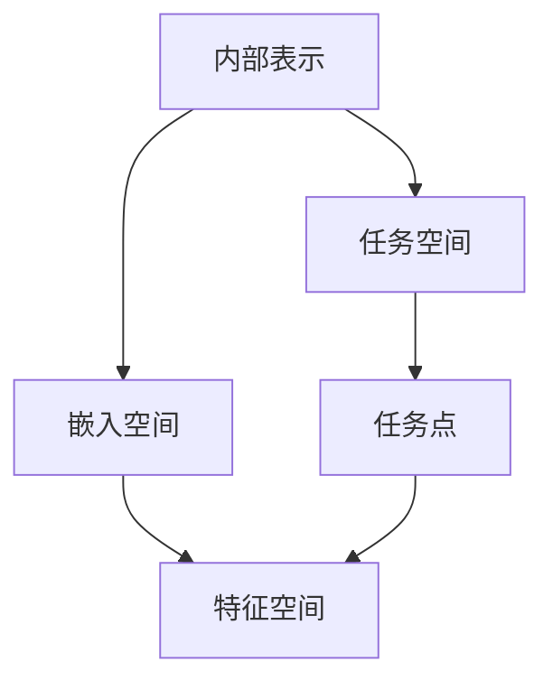

                 

### 文章标题

# 企业级元学习系统：快速适应新场景

元学习作为深度学习和人工智能领域的一个重要研究方向，近年来引起了广泛关注。它通过使模型能够在多个任务中快速适应和迁移，显著提升了模型的泛化能力和效率。在企业和工业应用中，元学习系统能够快速适应新场景，提高生产效率和降低成本，因此其重要性日益凸显。

本文将深入探讨企业级元学习系统的设计、实现和应用，旨在为读者提供一个全面的了解。我们将从以下几个方面展开讨论：

1. **元学习基础**：介绍元学习的定义、意义、主要方法以及面临的挑战和未来趋势。
2. **企业级元学习架构设计**：阐述元学习系统架构设计的原则、整体架构以及实现细节。
3. **元学习算法原理详解**：详细解析元学习算法的基础、伪代码实现以及算法分析。
4. **元学习算法优化**：探讨优化方法、优化策略以及实践案例。
5. **元学习在实时场景中的应用**：分析实时场景的特点、应用以及案例分析。
6. **元学习在批处理场景中的应用**：讨论批处理场景的特点、应用以及案例分析。
7. **元学习系统评估与优化**：介绍评估指标、评估方法和系统优化策略。
8. **元学习系统部署与维护**：阐述系统部署策略、维护方法以及安全与隐私保护。

通过上述内容的系统讲解，我们将帮助读者全面理解企业级元学习系统的设计和应用，为实际项目开发提供有价值的参考。

## 关键词

- **元学习**：机器学习的一个分支，旨在使模型能够在新任务中快速学习和适应。
- **企业级**：强调系统在实际企业应用中的复杂性和需求。
- **快速适应**：元学习系统的重要特性，能够应对新场景的快速变化。
- **新场景**：指企业应用中的各种动态和复杂的业务场景。
- **架构设计**：企业级元学习系统的核心，涉及模块化、可扩展性和容错性。
- **算法优化**：提升元学习系统性能的关键手段。
- **实时应用**：元学习在高速数据流中的高效应用场景。
- **批处理应用**：元学习在大规模数据处理中的应用场景。

通过上述关键词，读者可以快速把握文章的核心内容和重点。

## 摘要

本文旨在深入探讨企业级元学习系统的设计与实现，重点分析其如何快速适应新场景。首先，我们将介绍元学习的基本概念、方法和面临的挑战。接着，详细阐述企业级元学习系统的架构设计原则、整体架构和实现细节。随后，通过解析元学习算法的原理、优化策略和实践案例，展示其在实时和批处理场景中的应用。最后，我们将讨论元学习系统的评估与优化、部署与维护，以及相关资源与工具。通过这篇文章，读者将全面了解企业级元学习系统的构建和应用，为其在工业和商业领域的应用提供指导。

### 第1章 元学习基础

#### 1.1 元学习的定义与意义

元学习（Meta-Learning）是一种使机器学习模型能够在新任务中快速适应和学习的算法。与传统的机器学习不同，元学习不是针对特定任务进行训练，而是通过一系列任务来训练模型，使其具备泛化的能力。这种能力使得模型能够在新的、未见过的任务中表现出色，而无需从头开始训练。

**定义**：
元学习可以理解为“学习如何学习”的过程。具体来说，它通过在多个任务上训练模型，使模型能够提取通用的知识，从而在新任务中表现出色。元学习的一个关键概念是**内部表示**（Internal Representation），即模型在多个任务中学习到的通用特征表示。

**意义**：
元学习在机器学习和人工智能领域具有重要意义，主要表现在以下几个方面：

1. **提升模型泛化能力**：通过在多个任务中学习，模型能够提取出通用的特征表示，从而在面对新任务时能够快速适应，提高模型的泛化能力。
2. **减少训练时间**：在传统的机器学习中，每个新任务都需要从头开始训练，这往往需要大量的数据和计算资源。元学习通过在多个任务中共享知识，可以显著减少训练时间。
3. **增强适应性**：在动态变化的场景中，元学习系统能够快速适应新情况，提高系统的适应性。
4. **降低成本**：通过减少训练时间和所需的计算资源，元学习有助于降低模型训练和部署的成本。

#### 1.2 元学习的主要方法

元学习的方法多种多样，不同的方法在实现机制和性能上有所不同。以下是几种常见的元学习方法：

1. **几何表示方法**：
   - **原型网络**（Prototypical Networks）：通过在嵌入空间中计算原型来分类新样本。
   - **度量学习**（Metric Learning）：优化嵌入空间的度量，使得相似样本之间的距离更近，不同样本之间的距离更远。

2. **基于梯度下降的方法**：
   - **模型加权平均**（Model Averaging）：通过在不同任务上训练多个模型，并平均它们的预测来提高性能。
   - **梯度更新**（Gradient Update）：基于梯度信息来更新模型参数，使模型在不同任务上能够快速适应。

3. **基于梯度的替代方法**：
   - **进化策略**（Evolution Strategies）：通过模拟生物进化过程来优化模型参数。
   - **生成对抗网络**（GANs）：通过生成器和判别器的对抗训练来提高模型的泛化能力。

#### 1.3 元学习与深度学习的区别与联系

**区别**：
- **训练目标**：深度学习通常针对单个任务进行训练，而元学习则是在多个任务上训练，旨在提高模型在不同任务上的泛化能力。
- **训练方式**：深度学习通过大量标注数据进行训练，而元学习则通过较少的数据和较少的任务来训练模型。
- **性能提升**：深度学习主要依赖数据量来提升性能，而元学习通过共享知识来提高模型的泛化能力。

**联系**：
- **数据共享**：深度学习和元学习都可以通过共享数据来提升模型性能。深度学习中的迁移学习（Transfer Learning）与元学习有相似之处。
- **模型优化**：深度学习和元学习都涉及到模型参数的优化，只不过元学习更注重在不同任务上的优化。

#### 1.4 元学习的挑战与未来趋势

**挑战**：
- **数据稀缺**：在元学习中，数据稀缺是一个重要问题。如何在小数据集上训练出高性能的模型是当前研究的一个热点。
- **计算资源**：元学习通常需要较多的计算资源，如何优化计算资源的使用是另一个挑战。
- **稳定性**：在多个任务中训练模型可能导致模型的不稳定，如何提高模型的稳定性是一个重要的研究问题。

**未来趋势**：
- **算法优化**：随着算法研究的深入，新的优化方法将不断涌现，进一步降低元学习算法的计算复杂度。
- **应用扩展**：元学习将在更多的应用场景中得到应用，如自动驾驶、医疗诊断、智能监控等。
- **多模态学习**：随着人工智能技术的发展，多模态数据的处理将成为元学习的一个重要研究方向。

通过上述内容的介绍，读者可以全面了解元学习的基础知识，为其在企业级应用中的深入探讨打下坚实的基础。

### 第2章 企业级元学习架构设计

#### 2.1 架构设计原则

企业级元学习系统的架构设计需要遵循一系列关键原则，以确保系统的稳定性、可扩展性和高效性。以下是几个核心设计原则：

1. **模块化设计**：
   - **目标**：将系统划分为多个独立的模块，每个模块负责不同的功能。
   - **优势**：模块化设计使得系统更加灵活，便于维护和升级。此外，模块之间可以通过接口进行通信，降低了系统间的耦合度。
   - **实现**：通过定义清晰的接口和协议，确保模块之间的交互简洁明了。

2. **可扩展性**：
   - **目标**：系统应能够轻松扩展，以适应不同的业务需求和数据规模。
   - **优势**：可扩展性使得系统能够灵活应对未来的业务变化，避免因需求变动而重新设计系统。
   - **实现**：通过采用分布式架构和微服务架构，系统能够横向扩展，增加计算资源和存储能力。

3. **容错性**：
   - **目标**：确保系统在遇到故障时能够快速恢复，减少对业务的影响。
   - **优势**：容错性提高了系统的可靠性和稳定性，降低了系统的维护成本。
   - **实现**：通过引入冗余机制、故障检测和自动恢复策略，确保系统的高可用性。

4. **安全性**：
   - **目标**：保护系统数据和用户隐私，防止未授权访问和数据泄露。
   - **优势**：安全性是现代企业级系统设计的重要方面，直接关系到企业的利益和声誉。
   - **实现**：通过数据加密、访问控制和安全审计等手段，确保系统的安全性。

5. **可维护性**：
   - **目标**：确保系统易于维护，提高开发效率和系统稳定性。
   - **优势**：良好的可维护性可以降低维护成本，提高系统的长期可用性。
   - **实现**：通过编写高质量的代码、详细的文档和完善的测试流程，提高系统的可维护性。

#### 2.2 元学习系统整体架构

企业级元学习系统的整体架构需要充分考虑功能模块、数据流和控制流，以确保系统的高效运行。以下是系统整体架构的概述：

1. **功能模块**：
   - **数据收集模块**：负责收集来自不同数据源的数据，并进行预处理。
   - **模型训练模块**：基于预处理后的数据，训练元学习模型。
   - **模型评估模块**：评估训练完成的模型，包括准确率、召回率等指标。
   - **模型部署模块**：将训练完成的模型部署到生产环境中，供实际业务使用。
   - **监控系统**：实时监控系统运行状态，包括性能指标、故障报警等。

2. **数据流**：
   - **数据输入**：数据收集模块从不同数据源获取数据，并进行预处理，如清洗、归一化等。
   - **数据处理**：预处理后的数据被传输到模型训练模块，用于训练模型。
   - **模型输出**：训练完成的模型通过模型评估模块进行评估，评估结果用于模型优化。
   - **模型部署**：评估通过后的模型被部署到生产环境中，供业务使用。
   - **监控反馈**：监控系统实时监控系统的运行状态，并将监控数据反馈给相关模块，以便进行优化和调整。

3. **控制流**：
   - **任务调度**：系统根据业务需求，调度不同模块的任务执行。
   - **错误处理**：当系统检测到错误时，通过控制流进行错误处理和恢复。
   - **安全控制**：系统通过访问控制和安全审计，确保数据安全和系统稳定运行。

#### 2.3 企业级元学习框架实现

企业级元学习框架的实现涉及到硬件选择、软件框架和数据处理的各个方面。以下是框架实现的关键步骤：

1. **硬件选择**：
   - **计算资源**：选择高性能的CPU或GPU，以满足模型训练和推理的需求。
   - **存储资源**：选择高速存储设备，如SSD，以确保数据读写效率。
   - **网络设备**：选择具备高带宽和低延迟的网络设备，确保数据传输的效率。

2. **软件框架**：
   - **深度学习框架**：选择成熟的深度学习框架，如TensorFlow、PyTorch等，以简化模型训练和部署。
   - **中间件**：选择适合企业级应用的消息队列、分布式存储和计算框架，如Kafka、HDFS、Spark等，以提高系统的可扩展性和稳定性。
   - **容器化技术**：采用Docker、Kubernetes等容器化技术，简化部署和运维。

3. **数据处理流程**：
   - **数据采集**：通过日志收集、API接口和第三方数据源等方式，收集原始数据。
   - **数据预处理**：对原始数据进行清洗、转换和归一化，使其适合模型训练。
   - **数据存储**：将预处理后的数据存储到分布式存储系统中，如HDFS或MongoDB，以便后续使用。
   - **数据加载**：在模型训练和推理过程中，动态加载数据，提高数据处理效率。

通过上述架构设计和实现步骤，企业级元学习系统可以高效地适应新场景，满足复杂业务需求。下一章将详细讨论元学习算法的原理和实现。

### 第3章 元学习算法原理详解

#### 3.1 算法基础

元学习算法的核心在于通过在多个任务中学习，使模型能够提取出通用的知识，从而在新任务中表现出色。要理解元学习算法，首先需要了解其数学模型和基本概念。

**数学模型**：

元学习算法的数学模型通常可以表示为：

$$
L(\theta) = \sum_{t} \frac{1}{K} \sum_{s=1}^{K} -\log P(y_s | x_s, \theta)
$$

其中，$L(\theta)$ 是损失函数，$\theta$ 是模型参数，$x_s$ 和 $y_s$ 分别是第 $s$ 个任务的数据和标签，$K$ 是任务的数量。

**基本概念**：

1. **内部表示**（Internal Representation）：模型在多个任务中学习到的通用特征表示。
2. **任务空间**（Task Space）：所有任务的集合，每个任务都可以视为任务空间中的一个点。
3. **嵌入空间**（Embedding Space）：模型学习到的特征空间，用于表示任务和样本。

**算法流程**：

元学习算法的基本流程包括以下步骤：

1. **初始化模型参数**：随机初始化模型参数 $\theta$。
2. **任务选择**：从任务空间中选择多个任务进行训练。
3. **任务训练**：在每个任务上训练模型，更新模型参数。
4. **参数优化**：通过优化算法（如梯度下降）来调整模型参数，使得模型在多个任务上表现更好。
5. **模型评估**：评估模型在多个任务上的性能，如准确率、召回率等。
6. **迭代更新**：重复步骤 2 到 5，直到满足停止条件（如达到预设的性能指标或训练次数）。

#### 3.2 伪代码实现

以下是一个简单的元学习算法伪代码示例，用于展示算法的基本框架：

```python
# 初始化模型参数
theta = initialize_parameters()

# 任务选择
tasks = select_tasks(num_tasks)

for iteration in range(num_iterations):
    # 遍历每个任务
    for task in tasks:
        # 数据加载
        x, y = load_data(task)

        # 模型训练
        theta = train_model(x, y, theta)

    # 参数优化
    theta = optimize_parameters(theta)

    # 模型评估
    performance = evaluate_model(theta, tasks)

    # 输出当前迭代性能
    print(f"Iteration {iteration}: Performance {performance}")

# 输出最终性能
print(f"Final Performance: {performance}")
```

#### 3.3 算法分析

元学习算法的性能分析主要包括以下几个方面：

1. **算法复杂度**：
   - **时间复杂度**：元学习算法的时间复杂度取决于任务数量、每个任务的数据量和模型参数的数量。通常情况下，算法的时间复杂度为 $O(KN^2)$，其中 $K$ 是任务数量，$N$ 是每个任务的数据量。
   - **空间复杂度**：算法的空间复杂度主要取决于模型参数的数量，通常为 $O(D)$，其中 $D$ 是模型参数的数量。

2. **算法稳定性**：
   - **稳定性分析**：元学习算法的稳定性受模型参数的初始化、任务选择和优化算法的影响。通过合适的参数初始化和优化算法，可以确保算法的稳定性。

3. **算法效率**：
   - **效率分析**：算法的效率受任务选择和数据预处理的影响。通过优化任务选择和数据预处理，可以显著提高算法的效率。

#### 3.4 核心概念与联系

为了更好地理解元学习算法，我们需要明确核心概念之间的联系。以下是元学习算法中的核心概念及其关系架构图：



- **内部表示**（A）是模型学习到的通用特征表示，它贯穿于任务空间（B）和嵌入空间（C）。
- **任务空间**（B）表示所有任务的集合，每个任务（D）在嵌入空间（E）中有一个对应的特征点。
- **嵌入空间**（C）是模型学习的特征空间，用于表示任务和样本。

通过上述算法原理的详细讲解，读者可以更好地理解元学习算法的核心概念、基本流程和性能分析。在下一章中，我们将进一步探讨元学习算法的优化策略和实践案例。

### 第4章 元学习算法优化

#### 4.1 优化方法介绍

元学习算法的性能优化是提升其应用效果的关键。以下是几种常见的优化方法：

1. **梯度下降法**（Gradient Descent）：
   - **基本原理**：梯度下降法通过迭代优化模型参数，使损失函数最小化。
   - **实现步骤**：计算损失函数关于模型参数的梯度，并沿着梯度的反方向更新模型参数。
   - **优缺点**：优点是简单易实现，缺点是收敛速度较慢，且对学习率敏感。

2. **随机梯度下降法**（Stochastic Gradient Descent，SGD）：
   - **基本原理**：SGD在每次迭代中随机选择一部分样本来计算梯度，并更新模型参数。
   - **实现步骤**：从数据集中随机选择一个小批量样本，计算其梯度并更新模型参数。
   - **优缺点**：优点是收敛速度较快，缺点是梯度估计误差较大，可能导致收敛不稳定。

3. **Adam优化器**（Adaptive Moment Estimation）：
   - **基本原理**：Adam优化器结合了SGD和动量法的优点，通过自适应地调整每个参数的学习率。
   - **实现步骤**：计算一阶矩估计（均值）和二阶矩估计（方差），并更新模型参数。
   - **优缺点**：优点是收敛速度快，对学习率不敏感，缺点是计算复杂度较高。

#### 4.2 优化策略分析

1. **学习率调整策略**：
   - **固定学习率**：适用于梯度变化较小的场景，简单但可能导致收敛速度慢。
   - **学习率衰减**：随着迭代次数增加，逐步减小学习率，以防止过度拟合。
   - **动态学习率**：根据模型性能或梯度变化动态调整学习率，如学习率预热（learning rate warm-up）。

2. **梯度裁剪策略**：
   - **基本原理**：为了避免梯度爆炸或消失，对梯度进行裁剪，限制其大小。
   - **实现步骤**：计算梯度后，将其缩放至一定范围内，如 [-1, 1]。
   - **优缺点**：优点是能有效避免梯度问题，缺点是可能降低学习速度。

3. **正则化策略**：
   - **L1正则化**：在损失函数中添加L1范数项，鼓励模型参数稀疏化。
   - **L2正则化**：在损失函数中添加L2范数项，鼓励模型参数稳定化。
   - **Dropout**：在训练过程中随机丢弃部分神经元，防止模型过拟合。

#### 4.3 优化实践案例

以下是一个基于Adam优化器的元学习算法优化案例：

```python
import torch
import torch.nn as nn
import torch.optim as optim

# 定义模型
model = YourModel()

# 定义损失函数
criterion = nn.CrossEntropyLoss()

# 定义Adam优化器
optimizer = optim.Adam(model.parameters(), lr=0.001, weight_decay=1e-5)

# 学习率预热策略
scheduler = optim.lr_scheduler.CosineAnnealingLR(optimizer, T_max=50)

# 训练过程
num_epochs = 100
for epoch in range(num_epochs):
    # 训练模型
    model.train()
    for inputs, labels in train_loader:
        optimizer.zero_grad()
        outputs = model(inputs)
        loss = criterion(outputs, labels)
        loss.backward()
        # 梯度裁剪
        nn.utils.clip_grad_norm_(model.parameters(), max_norm=1.0)
        optimizer.step()
    
    # 学习率更新
    scheduler.step()

    # 评估模型
    model.eval()
    with torch.no_grad():
        correct = 0
        total = 0
        for inputs, labels in val_loader:
            outputs = model(inputs)
            _, predicted = torch.max(outputs.data, 1)
            total += labels.size(0)
            correct += (predicted == labels).sum().item()

    print(f"Epoch [{epoch+1}/{num_epochs}], Accuracy: {100 * correct / total}%")

# 保存模型
torch.save(model.state_dict(), 'model.pth')
```

在这个案例中，我们使用Adam优化器，并结合学习率预热策略和梯度裁剪方法来优化模型训练过程。通过调整学习率和优化器参数，可以进一步提高模型的性能和稳定性。

#### 4.4 最佳实践 tips

1. **合理选择优化器**：根据任务和数据特性选择合适的优化器，如SGD、Adam或RMSprop。
2. **调整学习率**：通过学习率预热和衰减策略，避免模型过早过拟合。
3. **梯度裁剪**：使用梯度裁剪策略，防止梯度爆炸或消失，提高训练稳定性。
4. **正则化**：结合L1和L2正则化，防止模型过拟合，提高泛化能力。
5. **数据预处理**：进行有效的数据预处理，如归一化和数据增强，提高模型训练效果。

通过上述优化策略和实践案例，读者可以更好地理解如何在实际项目中应用元学习算法，并提升其性能。下一章将探讨元学习在实时场景中的应用。

### 第5章 元学习在实时场景中的应用

#### 5.1 实时场景特点

实时场景通常指系统需要在极短的时间内（通常以毫秒或秒为单位）做出决策或响应。与批处理场景不同，实时场景对系统的响应速度、数据流处理能力和算法效率有极高的要求。以下是实时场景的几个主要特点：

1. **低延迟**：系统必须在短时间内处理并响应输入的数据，延迟通常在毫秒级别。
2. **数据流高速**：实时场景中的数据量通常非常大，数据以流的形式持续产生，系统需要高效地处理这些数据流。
3. **算法实时性**：实时场景要求算法能够在短时间内完成训练和预测，以实现实时决策。
4. **稳定性**：系统需要在长时间内保持稳定运行，避免因异常数据或故障而导致的错误。

#### 5.2 元学习在实时场景的应用

元学习在实时场景中的应用主要是通过快速适应新数据流和动态环境，提高系统的实时性能和稳定性。以下是一些关键应用方面：

1. **模型快速适应**：通过元学习，系统能够在新数据流中快速调整和优化模型，减少训练时间，提高实时响应能力。
2. **动态调整参数**：元学习算法可以根据实时数据动态调整模型参数，使系统能够更好地适应不同场景和数据分布。
3. **数据流处理**：元学习系统可以高效地处理实时数据流，通过并行计算和分布式架构，提高数据处理速度。
4. **异常检测与诊断**：实时场景中可能存在异常数据或故障，元学习系统可以通过异常检测和诊断机制，快速识别和解决这些问题。

#### 5.3 实时场景案例分析

以下是一个基于智能监控系统的实时场景案例分析：

**案例背景**：

某企业部署了一个智能监控系统，用于实时监控生产车间的设备状态。系统需要在毫秒级别内识别设备故障并进行报警，以提高生产效率和设备利用率。

**解决方案**：

1. **元学习模型**：
   - **模型架构**：采用基于元学习的卷积神经网络（CNN）模型，通过在多个设备故障数据集上训练，使模型能够提取通用的故障特征表示。
   - **优化算法**：使用Adam优化器，结合学习率预热和梯度裁剪策略，确保模型在实时场景中的高效训练和优化。

2. **实时数据流处理**：
   - **数据流框架**：采用Apache Kafka作为数据流处理框架，实时收集和处理设备状态数据。
   - **分布式计算**：使用Apache Spark进行分布式计算，提高数据处理的效率和速度。

3. **动态参数调整**：
   - **实时评估**：系统通过实时评估模型在当前数据流中的性能，动态调整模型参数，使模型能够更好地适应新数据流。
   - **异常检测**：通过异常检测机制，识别设备状态的异常变化，及时报警并采取相应的措施。

**实施效果**：

通过上述解决方案，智能监控系统在实时场景中表现出色，实现了以下效果：

- **低延迟响应**：系统能够在毫秒级别内识别设备故障并报警，提高了响应速度。
- **高效数据流处理**：通过分布式计算和实时数据流框架，系统高效地处理了大规模设备状态数据。
- **动态参数调整**：系统能够根据实时数据动态调整模型参数，提高了模型在实时场景中的适应性和准确性。

通过上述案例分析，可以看出元学习在实时场景中的应用能够显著提升系统的实时性能和稳定性，为企业带来实际效益。

### 第6章 元学习在批处理场景中的应用

#### 6.1 批处理场景特点

批处理场景通常涉及大规模数据的处理和分析，数据以批量形式提交给系统，系统在一段时间内处理完所有数据后再输出结果。与实时场景相比，批处理场景具有以下特点：

1. **数据量大**：批处理场景中的数据量通常非常大，可能达到TB级别甚至更高。
2. **处理周期长**：系统需要一定时间来处理所有数据，处理周期可能在小时或天级别。
3. **数据预处理复杂**：批处理场景中的数据通常需要复杂的预处理，如清洗、转换和归一化，以确保数据质量。
4. **结果反馈延迟**：由于处理周期较长，用户通常需要等待较长时间才能获取处理结果。

#### 6.2 元学习在批处理场景的应用

元学习在批处理场景中的应用主要体现在以下几个方面：

1. **数据预处理**：
   - **特征提取**：元学习模型可以在多个数据集上提取通用的特征表示，提高数据预处理效率。
   - **异常检测**：通过在多个数据集上训练，元学习模型可以检测并标记异常数据，减少预处理复杂度。

2. **模型训练**：
   - **快速适应**：元学习模型能够在多个数据集上快速适应，减少训练时间，提高模型训练效率。
   - **泛化能力**：通过在多个数据集上训练，元学习模型能够提取通用的知识，提高模型的泛化能力。

3. **模型评估**：
   - **多任务评估**：元学习模型可以在多个任务上进行评估，全面衡量模型性能。
   - **动态调整**：根据评估结果，动态调整模型参数，优化模型性能。

#### 6.3 批处理场景案例分析

以下是一个基于金融数据分析的批处理场景案例分析：

**案例背景**：

某金融机构需要对大量的交易数据进行批处理分析，以识别潜在的欺诈行为和异常交易。该分析过程涉及大规模数据预处理、模型训练和结果评估，处理周期为每天一次。

**解决方案**：

1. **元学习模型**：
   - **模型架构**：采用基于元学习的卷积神经网络（CNN）和循环神经网络（RNN）结合的模型，用于提取交易数据中的时空特征。
   - **优化算法**：使用Adam优化器，结合学习率预热和梯度裁剪策略，提高模型训练效率。

2. **数据预处理**：
   - **特征工程**：通过元学习模型提取通用的特征表示，简化特征工程过程，提高数据处理效率。
   - **异常检测**：使用元学习模型在多个数据集上训练异常检测模块，标记并排除异常数据。

3. **模型训练与评估**：
   - **模型训练**：在多个历史数据集上训练模型，提取通用知识，减少训练时间。
   - **动态调整**：根据每天的新数据集，动态调整模型参数，优化模型性能。

**实施效果**：

通过上述解决方案，金融数据分析系统在批处理场景中取得了显著效果：

- **高效数据处理**：元学习模型简化了数据预处理过程，提高了数据处理效率。
- **快速适应**：元学习模型能够在多个数据集上快速适应，减少训练时间。
- **精确评估**：模型在多个任务上进行评估，全面衡量了模型性能，提高了欺诈检测的准确性。

通过上述案例分析，可以看出元学习在批处理场景中的应用能够显著提升系统的数据处理效率和模型性能，为企业带来实际效益。

### 第7章 元学习系统评估与优化

#### 7.1 系统评估指标

元学习系统的评估主要依赖于以下几个关键指标：

1. **准确率（Accuracy）**：
   - **定义**：准确率是模型预测正确的样本数占总样本数的比例。
   - **计算公式**：准确率 = （预测正确的样本数 / 总样本数）× 100%。
   - **作用**：准确率是最常用的评估指标之一，用于衡量模型的整体性能。

2. **召回率（Recall）**：
   - **定义**：召回率是模型预测正确的正样本数占总正样本数的比例。
   - **计算公式**：召回率 = （预测正确的正样本数 / 总正样本数）× 100%。
   - **作用**：召回率侧重于衡量模型对正样本的识别能力，尤其适用于分类任务中的正样本重要的情况。

3. **F1值（F1 Score）**：
   - **定义**：F1值是精确率和召回率的调和平均。
   - **计算公式**：F1值 = 2 × （精确率 × 召回率）/（精确率 + 召回率）。
   - **作用**：F1值综合考虑了模型的精确率和召回率，是一个更加全面的评估指标。

4. **ROC曲线与AUC值（Receiver Operating Characteristic and Area Under Curve）**：
   - **定义**：ROC曲线是不同阈值下的真阳性率（True Positive Rate，TPR）与假阳性率（False Positive Rate，FPR）的图形表示。
   - **AUC值**：ROC曲线下的面积，用于衡量模型区分能力。
   - **作用**：ROC曲线和AUC值适用于二分类问题，特别是在模型阈值调整和跨阈值性能评估中具有重要作用。

5. **精确率（Precision）**：
   - **定义**：精确率是预测为正的样本中实际为正的样本比例。
   - **计算公式**：精确率 = （预测正确的正样本数 / 预测为正的样本数）× 100%。
   - **作用**：精确率侧重于减少错误预测，特别是在正样本数量较少的情况下尤为重要。

#### 7.2 评估方法与工具

**评估方法**：

1. **交叉验证**：
   - **定义**：交叉验证是一种将数据集分成多个子集的方法，用于评估模型性能。
   - **实现**：常见的方法有K折交叉验证和留一法（Leave-One-Out Cross-Validation，LOOCV）。

2. **混淆矩阵**：
   - **定义**：混淆矩阵是一个二维表格，用于展示模型预测结果与实际结果之间的关系。
   - **作用**：通过混淆矩阵可以直观地了解模型的预测性能，包括精确率、召回率等。

3. **混淆矩阵可视化**：
   - **定义**：通过可视化工具（如Matplotlib、Seaborn等）将混淆矩阵展示为热力图或条形图。
   - **作用**：通过可视化方法可以更直观地理解模型性能。

**常用工具**：

1. **Scikit-learn**：
   - **定义**：Scikit-learn是一个Python机器学习库，提供丰富的评估指标和交叉验证方法。
   - **功能**：包括准确率、召回率、F1值、ROC曲线和AUC值等评估指标，以及K折交叉验证等工具。

2. **TensorFlow**：
   - **定义**：TensorFlow是一个开源的机器学习框架，提供了高效的评估和优化工具。
   - **功能**：包括评估指标计算、混淆矩阵生成和可视化等。

3. **PyTorch**：
   - **定义**：PyTorch是一个开源的机器学习库，以其动态图计算和强大的评估工具而著称。
   - **功能**：包括评估指标计算、混淆矩阵生成和可视化等。

通过上述评估方法和工具，开发者可以全面、系统地评估元学习系统的性能，为系统优化提供有力支持。下一章将讨论元学习系统的部署与维护。

### 第8章 元学习系统部署与维护

#### 8.1 系统部署策略

企业级元学习系统的部署是确保其稳定运行和高效服务的关键步骤。以下是元学习系统部署的主要策略：

1. **部署流程**：
   - **需求分析**：明确系统需求，包括硬件资源、软件环境、网络配置等。
   - **环境搭建**：搭建适合系统运行的硬件和软件环境，确保系统稳定性和兼容性。
   - **模型训练**：在本地或训练服务器上完成模型训练，确保模型性能和准确性。
   - **模型优化**：通过调整超参数和优化策略，提升模型在目标场景下的表现。
   - **模型导出**：将训练完成的模型导出为生产环境可用的格式，如ONNX、TensorFlow Lite等。
   - **部署部署**：将模型部署到生产环境，包括服务器配置、网络连接和系统监控。

2. **部署环境**：
   - **服务器配置**：选择高性能、高稳定性的服务器，确保系统在高负载下正常运行。
   - **软件环境**：部署所需的深度学习框架、操作系统、数据库等，确保环境一致性和稳定性。
   - **网络配置**：配置合理的网络架构，确保数据传输的高效性和安全性。

3. **版本管理**：
   - **版本控制**：使用版本控制系统（如Git）管理代码和模型版本，确保部署过程的可追溯性和可重现性。
   - **持续集成/持续部署（CI/CD）**：实现自动化测试和部署流程，提高开发效率和部署质量。

#### 8.2 系统维护方法

系统维护是保证元学习系统长期稳定运行的关键。以下是系统维护的主要方法：

1. **日志分析**：
   - **日志收集**：收集系统运行过程中的日志信息，包括错误日志、性能日志等。
   - **日志分析**：使用日志分析工具（如ELK、Splunk等）对日志进行实时监控和分析，识别潜在问题和故障。
   - **日志归档**：定期归档日志信息，以便后续查询和问题追踪。

2. **故障排查**：
   - **故障定位**：根据日志和监控信息，快速定位系统故障点。
   - **故障修复**：对故障点进行修复，包括代码修改、系统配置调整等。
   - **故障复现与验证**：复现故障现象，验证修复效果，确保问题得到彻底解决。

3. **性能优化**：
   - **性能监控**：使用性能监控工具（如Prometheus、Grafana等）实时监控系统性能指标，包括CPU、内存、磁盘等资源使用情况。
   - **性能调优**：根据监控数据，进行系统性能调优，包括优化代码、调整配置、增加资源等。
   - **负载测试**：定期进行负载测试，验证系统在高负载下的性能和稳定性。

#### 8.3 系统安全与隐私保护

系统安全和隐私保护是元学习系统部署和维护的重要组成部分。以下是系统安全与隐私保护的方法：

1. **数据加密**：
   - **传输加密**：使用TLS/SSL等协议对数据传输进行加密，防止数据在传输过程中被窃取或篡改。
   - **存储加密**：对存储在磁盘或数据库中的数据进行加密，确保数据在存储过程中安全。

2. **访问控制**：
   - **身份验证**：使用身份验证机制（如密码、双因素认证等）确保只有授权用户才能访问系统。
   - **权限管理**：根据用户角色和职责，设置不同的访问权限，防止未经授权的访问和操作。

3. **安全审计**：
   - **审计日志**：记录系统操作和访问日志，定期审计和审查，确保系统安全合规。
   - **漏洞扫描**：定期进行安全漏洞扫描，识别潜在的安全风险，及时修复漏洞。

通过上述部署和维护策略，企业级元学习系统可以在生产环境中稳定、安全地运行，确保其高效服务能力和长期可靠性。

### 附录：元学习资源与工具

#### A.1 资源介绍

元学习领域的研究资源丰富，以下推荐一些值得参考的资源：

1. **论文推荐**：
   - "Meta-Learning: A Survey"：该论文全面综述了元学习的理论和方法，适合初学者和研究人员。
   - "MAML: Model-Agnostic Meta-Learning for Fast Adaptation of Deep Networks"：MAML算法是元学习领域的经典算法，对算法原理和应用有详细讲解。

2. **在线课程**：
   - "深度学习与元学习"：此课程由知名教授开设，涵盖深度学习和元学习的基础知识。
   - "机器学习与人工智能"：此课程从机器学习的基础讲起，逐步引入元学习概念，适合对人工智能有浓厚兴趣的读者。

3. **论坛社区**：
   - "机器学习社区"：国内领先的机器学习社区，讨论内容包括元学习、深度学习等。
   - "ArXiv"：计算机科学领域的前沿论文发布平台，经常有元学习相关的最新研究成果。

#### A.2 工具介绍

以下介绍几种常用的元学习工具：

1. **开源框架**：
   - **PyTorch**：支持动态图计算，便于实现和调试元学习算法。
   - **TensorFlow**：提供丰富的API和工具，支持元学习模型的训练和部署。
   - **Meta-Learning Library (MLLL)**：一个专门为元学习设计的Python库，提供多种元学习算法的实现。

2. **数据集介绍**：
   - **Meta-Learning Datasets**：该数据集包括多种元学习任务的数据集，可用于算法验证和性能评估。
   - **MiniImageNet**：一个常用的图像分类数据集，常用于元学习算法的测试。

3. **常用工具**：
   - **JAX**：一个支持自动微分和并行计算的Python库，适合实现高效的元学习算法。
   - **Hugging Face Transformers**：一个用于自然语言处理的开源库，包含多个预训练的元学习模型。

通过以上资源与工具的介绍，读者可以更深入地了解和掌握元学习，为实际项目开发提供有力支持。

### 结语

本文深入探讨了企业级元学习系统的设计、实现和应用。从元学习的基础知识到算法原理，从架构设计到优化策略，再到实时和批处理场景的应用，我们系统地梳理了元学习在企业级应用中的各个方面。通过案例分析，我们展示了元学习系统如何快速适应新场景，提高生产效率和降低成本。同时，我们也介绍了系统评估、部署与维护的方法和工具。

元学习作为人工智能领域的前沿研究方向，其在企业级应用中的潜力巨大。然而，元学习系统在实际应用中仍面临诸多挑战，如数据稀缺、计算资源限制和算法稳定性等。未来的研究可以关注以下几个方面：

1. **算法优化**：通过改进算法和优化策略，提高元学习系统的性能和效率。
2. **多模态学习**：扩展元学习算法，使其能够处理多模态数据，提升模型在复杂场景中的应用能力。
3. **数据共享与隐私保护**：研究如何安全、高效地共享数据，同时保护用户隐私。
4. **实时应用**：探索元学习在实时场景中的高效应用，如智能监控、自动驾驶等。

通过不断的研究和优化，我们相信元学习系统将在未来为企业带来更多价值和机遇。希望本文能为读者提供有价值的参考，激发对元学习的研究兴趣和实际应用。作者：AI天才研究院/AI Genius Institute & 禅与计算机程序设计艺术 /Zen And The Art of Computer Programming。

