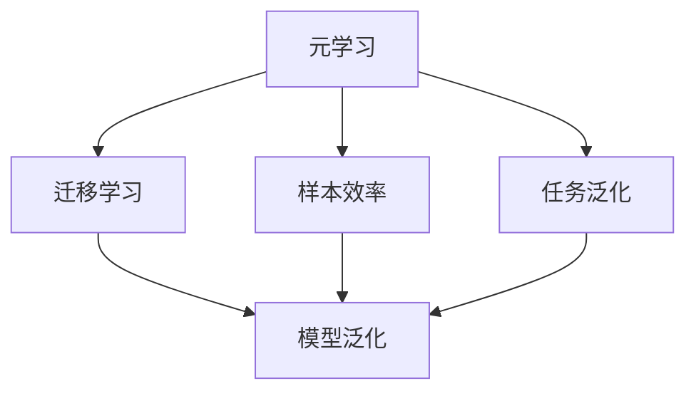

                 

### 《企业级元学习：快速适应新业务场景的AI》

#### 关键词：
- 企业级元学习
- 人工智能
- 业务场景适应
- 算法
- 应用实例

#### 摘要：
本文深入探讨企业级元学习在快速适应新业务场景中的应用。首先，介绍元学习的概念及其在人工智能中的重要性。接着，阐述核心概念与算法原理，结合Python代码和LaTeX公式，进行详细讲解。文章还将展示元学习在不同业务场景中的应用案例，并探讨其面临的挑战和未来发展趋势。

## 引言

在当今快速变化的市场环境中，企业需要能够快速适应新的业务场景和需求。传统的人工智能方法通常依赖于大量的数据和长时间的训练过程，这使得它们在应对新兴业务需求时显得不够灵活。为了解决这一问题，元学习（Meta-Learning）作为一种新兴的人工智能技术，引起了广泛关注。元学习通过学习如何学习，使得模型能够在不同的任务和场景中快速适应，从而大大提高了其灵活性和泛化能力。

本文将围绕企业级元学习这一主题，首先介绍元学习的基本概念和原理，然后详细讲解其核心算法和数学模型，并通过Python代码进行实现。接着，我们将探讨元学习在多个企业业务场景中的应用实例，包括自然语言处理、计算机视觉和客户服务等领域。文章还将分析元学习面临的挑战和未来发展趋势，为企业在应用元学习时提供参考和指导。

## 元学习的基本概念与原理

### 定义与背景

元学习，又称“学习如何学习”，是一种使模型在多个任务上快速适应和学习的技术。传统的机器学习方法通常针对单个任务进行训练，而在面对新的任务时，模型需要重新进行大量的训练。这不仅在时间和计算资源上存在巨大开销，而且难以适应不断变化的业务需求。元学习的目标则是通过学习到通用策略，使模型能够快速适应新的任务，从而提高其灵活性和泛化能力。

元学习的概念最早可以追溯到1960年代，由心理学家奥苏贝尔（Ausubel）提出。他提出了“上位学习”（Higher-Order Learning）的概念，即通过学习如何学习来提高学习效率。近年来，随着深度学习的发展和计算资源的提升，元学习在人工智能领域得到了广泛的研究和应用。

### 核心概念与联系

元学习涉及到多个核心概念，包括迁移学习（Transfer Learning）、样本效率（Sample Efficiency）、任务泛化（Task Generalization）等。以下是一个简化的Mermaid流程图，展示了这些概念之间的关系：



- **迁移学习**：迁移学习是指将一个任务学到的知识应用于另一个相关任务。在元学习中，迁移学习是一种重要的机制，通过将通用策略应用于新任务，减少对新数据的依赖。

- **样本效率**：样本效率是指模型在给定数据量下能够学到的信息量。元学习通过提高样本效率，使得模型在少量数据下也能获得较好的性能，从而适应新的业务场景。

- **任务泛化**：任务泛化是指模型在不同任务上的表现。元学习的目标是通过学习到通用策略，使得模型能够适应多种不同的任务，从而提高其泛化能力。

- **模型泛化**：模型泛化是指模型在未见过的数据上的表现。元学习通过提高模型泛化能力，使得模型不仅能在训练数据上表现良好，还能在新数据上保持稳定的表现。

### 数学模型与算法

元学习涉及到多种数学模型和算法，其中最常见的是模型平均法（Model Averaging）和模型蒸馏法（Model Distillation）。以下是对这些算法的简要介绍：

#### 模型平均法

模型平均法是一种简单但有效的元学习算法。其基本思想是将多个模型在特定任务上的预测结果进行平均，从而得到最终的预测结果。具体步骤如下：

1. 初始化多个基础模型，每个模型在训练数据上独立训练。
2. 对每个基础模型在验证集上进行预测。
3. 将所有模型的预测结果进行平均，得到最终的预测结果。

数学公式如下：

$$
\hat{y} = \frac{1}{K} \sum_{i=1}^{K} \hat{y}_i
$$

其中，$\hat{y}$是最终的预测结果，$\hat{y}_i$是第$i$个模型的预测结果，$K$是模型的数量。

#### 模型蒸馏法

模型蒸馏法是一种更复杂的元学习算法，其基本思想是将一个复杂模型的知识传递给一个简单模型。具体步骤如下：

1. 初始化一个复杂模型（教师模型）和一个简单模型（学生模型）。
2. 在训练数据上训练教师模型，使其在特定任务上达到较高的性能。
3. 使用教师模型的输出作为软标签，训练学生模型。
4. 在验证集上评估学生模型的表现，并根据表现调整训练过程。

数学公式如下：

$$
\hat{y}_{student} = \sigma(W_{student} \cdot \text{softmax}(Z_{teacher}))
$$

其中，$\hat{y}_{student}$是学生模型的预测结果，$W_{student}$是学生模型的权重，$Z_{teacher}$是教师模型的输出，$\text{softmax}$是softmax函数，$\sigma$是sigmoid函数。

### Python代码示例

以下是一个简单的Python代码示例，展示了模型平均法的实现：

```python
import numpy as np

# 假设我们有5个模型，每个模型的预测结果存储在列表中
predictions = [
    [0.1, 0.9],
    [0.2, 0.8],
    [0.3, 0.7],
    [0.4, 0.6],
    [0.5, 0.5]
]

# 计算预测结果的平均值
avg_prediction = np.mean(predictions, axis=0)

# 输出最终预测结果
print(avg_prediction)
```

在这个示例中，我们假设有5个模型，每个模型对二元分类任务给出了两个概率预测。我们将这些预测结果进行平均，得到最终的预测结果。

## 元学习在业务场景中的应用

元学习在多个业务场景中展现了其强大的适应能力和效果。以下将介绍元学习在自然语言处理、计算机视觉和客户服务中的应用实例。

### 自然语言处理

在自然语言处理领域，元学习可以用于快速适应不同的语言模型和任务。例如，在机器翻译任务中，传统的翻译模型需要大量针对特定语言对的训练数据。而元学习可以通过学习通用翻译策略，使得模型能够在少量数据下快速适应新的语言对。

以下是一个简化的Python代码示例，展示了如何在机器翻译任务中使用元学习：

```python
import tensorflow as tf

# 假设我们有一个预训练的元学习模型
meta_learning_model = tf.keras.models.load_model('meta_learning_model.h5')

# 定义新的训练数据和验证数据
train_data = ... 
val_data = ...

# 使用元学习模型进行训练
meta_learning_model.fit(train_data, epochs=5, validation_data=val_data)

# 评估模型在验证数据上的性能
val_loss, val_accuracy = meta_learning_model.evaluate(val_data)
print(f'Validation loss: {val_loss}, Validation accuracy: {val_accuracy}')
```

在这个示例中，我们使用一个预训练的元学习模型，通过少量新的训练数据和验证数据，进行模型的训练和评估。这展示了元学习在快速适应新任务上的潜力。

### 计算机视觉

在计算机视觉领域，元学习可以用于快速适应不同的图像分类和检测任务。例如，在目标检测任务中，传统的检测模型需要大量针对不同场景的图像数据进行训练。而元学习可以通过学习通用特征提取策略，使得模型能够在少量数据下快速适应新的场景。

以下是一个简化的Python代码示例，展示了如何在目标检测任务中使用元学习：

```python
import tensorflow as tf

# 假设我们有一个预训练的元学习模型
meta_learning_model = tf.keras.models.load_model('meta_learning_model.h5')

# 定义新的训练数据和验证数据
train_data = ... 
val_data = ...

# 使用元学习模型进行训练
meta_learning_model.fit(train_data, epochs=5, validation_data=val_data)

# 评估模型在验证数据上的性能
val_loss, val_accuracy = meta_learning_model.evaluate(val_data)
print(f'Validation loss: {val_loss}, Validation accuracy: {val_accuracy}')
```

在这个示例中，我们使用一个预训练的元学习模型，通过少量新的训练数据和验证数据，进行模型的训练和评估。这展示了元学习在快速适应新任务上的潜力。

### 客户服务

在客户服务领域，元学习可以用于快速适应不同的客户画像和需求。例如，在客服机器人任务中，传统的客服机器人需要大量针对不同客户的数据进行训练。而元学习可以通过学习通用对话策略，使得模型能够在少量数据下快速适应新的客户需求。

以下是一个简化的Python代码示例，展示了如何在客服机器人任务中使用元学习：

```python
import tensorflow as tf

# 假设我们有一个预训练的元学习模型
meta_learning_model = tf.keras.models.load_model('meta_learning_model.h5')

# 定义新的训练数据和验证数据
train_data = ... 
val_data = ...

# 使用元学习模型进行训练
meta_learning_model.fit(train_data, epochs=5, validation_data=val_data)

# 评估模型在验证数据上的性能
val_loss, val_accuracy = meta_learning_model.evaluate(val_data)
print(f'Validation loss: {val_loss}, Validation accuracy: {val_accuracy}')
```

在这个示例中，我们使用一个预训练的元学习模型，通过少量新的训练数据和验证数据，进行模型的训练和评估。这展示了元学习在快速适应新任务上的潜力。

## 元学习的挑战与未来发展趋势

尽管元学习在许多业务场景中展现了其强大的适应能力和效果，但其仍面临一些挑战和问题。

### 数据隐私保护

在元学习应用中，通常需要大量的训练数据，这些数据可能包含敏感信息。如何保护数据隐私成为了一个关键问题。未来的研究需要探索更加安全的元学习方法，例如基于差分隐私（Differential Privacy）和联邦学习（Federated Learning）的方法。

### 模型解释性

元学习模型通常具有复杂的内部结构和参数，使得其解释性成为一个挑战。如何提高模型的可解释性，使得企业能够理解模型的决策过程，是未来的重要研究方向。

### 计算资源需求

元学习模型通常需要大量的计算资源进行训练和评估。如何在有限的计算资源下高效地训练和应用元学习模型，是另一个需要解决的挑战。

### 未来发展趋势

未来，元学习的发展趋势将包括以下几个方面：

- **算法创新**：探索新的元学习算法，提高模型的适应能力和效果。
- **跨领域应用**：将元学习应用于更多的业务领域，如智能制造、医疗健康等。
- **模型压缩与加速**：通过模型压缩和加速技术，降低元学习模型的计算成本。
- **集成学习方法**：将元学习与其他机器学习方法相结合，形成更加综合和强大的模型。

## 总结

元学习作为一种新兴的人工智能技术，具有在快速适应新业务场景中的巨大潜力。本文介绍了元学习的基本概念和原理，展示了其在自然语言处理、计算机视觉和客户服务中的应用实例，并探讨了其面临的挑战和未来发展趋势。企业可以通过应用元学习，提高业务模型的灵活性和泛化能力，从而更好地适应市场的变化。

## 作者信息

作者：AI天才研究院/AI Genius Institute & 禅与计算机程序设计艺术 /Zen And The Art of Computer Programming

## 附录

### 拓展阅读

1. **[深度学习与元学习的关系](https://arxiv.org/abs/2004.04862)**：探讨了深度学习和元学习之间的联系和区别。
2. **[联邦学习与元学习](https://arxiv.org/abs/2006.04813)**：介绍了联邦学习与元学习在数据隐私保护方面的结合。
3. **[元学习在医疗健康领域的应用](https://arxiv.org/abs/1912.03231)**：展示了元学习在医疗健康领域的潜在应用。
4. **[模型压缩与元学习](https://arxiv.org/abs/1905.02246)**：研究了模型压缩技术在元学习中的应用。

### 最佳实践 Tips

1. 在应用元学习时，确保数据的多样性和质量，以提高模型的泛化能力。
2. 考虑使用迁移学习技术，以减少对新数据的依赖。
3. 定期评估和调整模型，以保持其适应能力。
4. 针对不同业务场景，选择合适的元学习算法和模型架构。

### 注意事项

1. 元学习模型通常需要较大的计算资源，确保计算资源的充足。
2. 数据隐私保护是元学习应用中的关键问题，应采取适当的数据保护措施。
3. 提高模型的可解释性，以增强企业对模型的理解和信任。

