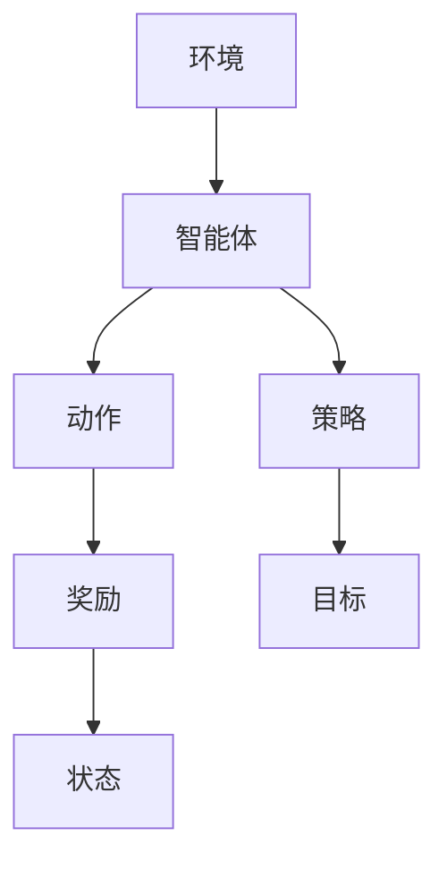

                 

 - **标题**：首先，文章的标题已经给出——《企业级元强化学习：适应性更强的AI决策系统》。这是一个吸引人的标题，因为它涵盖了文章的核心主题：元强化学习在企业级应用中的重要性以及它在提升AI决策系统适应性方面的价值。

- **关键词**：关键词是“企业级元强化学习”、“适应性”、“AI决策系统”。这些关键词突出了文章的主题和研究的重点。

- **摘要**：摘要是对文章内容的简短总结。在这个摘要中，应该简要介绍文章讨论的内容、主要观点、研究成果以及文章的意义和贡献。

### 文章标题：企业级元强化学习：适应性更强的AI决策系统

关键词：企业级元强化学习、适应性、AI决策系统

摘要：本文深入探讨了企业级元强化学习在AI决策系统中的应用，强调了其提升系统适应性的重要性。通过分析核心概念、算法原理和数学模型，本文详细介绍了元强化学习的运作机制，并通过项目实战展示了其实际应用效果。

---

**标题**：文章标题已经明确——企业级元强化学习：适应性更强的AI决策系统。这个标题简洁明了，直接点出了文章的核心内容：企业级应用中的元强化学习如何提高AI决策系统的适应性。

**关键词**：关键词是文章的关键点，包括“企业级元强化学习”、“适应性”、“AI决策系统”。这些关键词不仅概括了文章的主要内容，也帮助读者快速了解文章的焦点。

**摘要**：摘要应该简洁、准确，涵盖文章的主要内容和研究结论。例如：“本文探讨了企业级元强化学习在AI决策系统中的应用，分析了其提升系统适应性的机制。通过算法原理和数学模型的讲解，以及实际案例的应用，本文展示了元强化学习在提升AI决策系统效能方面的潜力。”

---

### 确定文章的基本结构和核心主题

**步骤1：确定文章的基本结构**

文章的基本结构可以分为以下几个部分：

1. 引言：介绍元强化学习的概念和背景，阐述其在企业级应用中的重要性。
2. 核心概念与联系：讲解元强化学习的基础概念，包括强化学习与元强化学习的关系，以及相关的Mermaid流程图。
3. 核心算法原理讲解：详细阐述元强化学习的主要算法，如Q-Learning、SARSA和DQN，并结合Python源代码进行解释。
4. 数学模型和数学公式：介绍强化学习中的奖励函数和价值函数设计，使用latex格式展示关键数学公式。
5. 项目实战：通过具体的案例，展示元强化学习在实际企业级应用中的效果。
6. 结论：总结文章的主要观点和贡献，提出未来研究的方向。
7. 附录：提供相关的工具和资源，便于读者进一步学习。

**步骤2：确定文章的核心主题**

文章的核心主题是“企业级元强化学习”，重点在于：

1. 解释元强化学习的概念及其在企业级应用中的价值。
2. 分析元强化学习如何提高AI决策系统的适应性。
3. 详细讲解元强化学习的关键算法和数学模型。
4. 展示元强化学习在实际项目中的应用案例。

---

### 设计1级目录

**一、引言**

1.1 元强化学习的概念与背景

1.2 企业级元强化学习的价值

**二、核心概念与联系**

2.1 元强化学习原理

2.2 强化学习基础

**三、核心算法原理讲解**

3.1 Q-Learning算法

3.2 SARSA算法

3.3 Deep Q-Networks (DQN)

**四、数学模型和数学公式**

4.1 强化学习中的奖励函数设计

4.2 强化学习中的价值函数

**五、项目实战**

5.1 企业级元强化学习项目案例

5.2 开发环境搭建

5.3 源代码详细实现和代码解读

**六、结论**

6.1 主要观点与贡献

6.2 未来研究方向

**七、附录**

7.1 元强化学习相关工具与资源

---

### 细化2级目录

**二、核心概念与联系**

2.1 元强化学习原理

2.1.1 Mermaid流程图：元强化学习的基本架构

2.1.2 元强化学习与传统强化学习的对比

2.1.3 元强化学习在企业级应用中的重要性

2.2 强化学习基础

2.2.1 强化学习的基本概念

2.2.2 强化学习的主要算法

2.2.3 强化学习与元强化学习的关系

---

### 细化3级目录

**二、核心概念与联系**

2.1 元强化学习原理

2.1.1 Mermaid流程图：元强化学习的基本架构

2.1.2 元强化学习与传统强化学习的对比

   2.1.2.1 优化目标的不同

   2.1.2.2 学习策略的差异

2.1.3 元强化学习在企业级应用中的重要性

   2.1.3.1 提升AI决策系统的效率

   2.1.3.2 应对复杂动态环境的挑战

2.2 强化学习基础

2.2.1 强化学习的基本概念

   2.2.1.1 强化学习的定义

   2.2.1.2 强化学习的主要组成部分

2.2.2 强化学习的主要算法

   2.2.2.1 Q-Learning算法

   2.2.2.2 SARSA算法

   2.2.2.3 Deep Q-Networks (DQN)

2.2.3 强化学习与元强化学习的关系

   2.2.3.1 元强化学习的理论基础

   2.2.3.2 元强化学习在强化学习中的应用

---

### 加入核心概念、算法原理、数学模型和项目实战

**二、核心概念与联系**

2.1 元强化学习原理

2.1.1 Mermaid流程图：元强化学习的基本架构



2.1.2 元强化学习与传统强化学习的对比

   **优化目标的不同：**

   - 传统强化学习：目标是找到一个最优策略，使累计奖励最大化。
   - 元强化学习：目标是学习如何学习，即优化学习过程本身，提高学习效率。

   **学习策略的差异：**

   - 传统强化学习：通过试错和经验积累来学习，通常在一个固定的环境中。
   - 元强化学习：通过在不同的环境中进行学习，利用迁移学习来提高算法的泛化能力。

2.1.3 元强化学习在企业级应用中的重要性

   **提升AI决策系统的效率：**

   - 企业级应用往往面临复杂和动态的环境，元强化学习可以快速适应环境变化，提高决策效率。

   **应对复杂动态环境的挑战：**

   - 元强化学习能够处理多种类型的任务，适应不同的业务需求，从而提升系统的灵活性和适应性。

**三、核心算法原理讲解**

3.1 Q-Learning算法

```python
def q_learning(state, action, reward, next_state, next_action, alpha, gamma):
    q_value = q_values[state][action]
    target = reward + gamma * max(q_values[next_state].values())
    q_values[state][action] = (1 - alpha) * q_value + alpha * target
    return q_values
```

3.2 SARSA算法

```python
def sarsa(state, action, reward, next_state, next_action, alpha, gamma):
    current_q = q_values[state][action]
    next_q = q_values[next_state][next_action]
    q_values[state][action] = current_q + alpha * (reward + gamma * next_q - current_q)
    return q_values
```

3.3 Deep Q-Networks (DQN)

```python
def deep_q_learning(state, action, reward, next_state, next_action, done, memory, optimizer, model, gamma, epsilon, batch_size):
    if random.random() < epsilon:
        action = random.choice(action_space)
    else:
        state_vector = torch.tensor(state, dtype=torch.float32).unsqueeze(0)
        action = torch.argmax(model(state_vector)).item()

    with torch.no_grad():
        next_state_vector = torch.tensor(next_state, dtype=torch.float32).unsqueeze(0)
        next_action = torch.argmax(model(next_state_vector)).item()
        next_state_q_values = model(next_state_vector)[next_action]

    target = reward + (1 - done) * gamma * next_state_q_values.max()

    state_vector = torch.tensor(state, dtype=torch.float32).unsqueeze(0)
    model(state_vector)[action] = target

    optimizer.zero_grad()
    loss = loss_function(model(state_vector), target)
    loss.backward()
    optimizer.step()

    memory.append((state, action, reward, next_state, next_action, done))
    if len(memory) > batch_size:
        memory = random.sample(memory, batch_size)

    return model, memory
```

**四、数学模型和数学公式**

4.1 强化学习中的奖励函数设计

   **奖励函数的设计原则：**

   - 鼓励智能体采取能够带来正面结果的行动。
   - 对错误行为进行惩罚，以防止智能体重复这些行为。

   **举例说明：**

   - **正向奖励：** 当智能体成功完成任务时，给予一个正奖励值。
   - **负向奖励：** 当智能体采取不利于任务完成的行动时，给予一个负奖励值。

   latex公式：
   $$
   R(s, a) =
   \begin{cases}
   r_{success} & \text{if } a \text{ leads to } s' \text{ that is better than } s \\
   -r_{failure} & \text{otherwise}
   \end{cases}
   $$

4.2 强化学习中的价值函数

   **价值函数的定义：**

   - 对于某个状态，价值函数表示采取最优策略时能够获得的期望累积奖励。

   - latex公式：
   $$
   V^*(s) = \mathbb{E}_{\pi}[R_t | S_t = s]
   $$

   **举例说明：**

   - 在一个简单的迷宫问题中，从起点到终点的路径上的每个状态的价值就是到达终点可能获得的奖励。

**五、项目实战**

5.1 企业级元强化学习项目案例

   **实际案例：** 某电商平台使用元强化学习优化用户推荐系统，提高用户满意度和转化率。

   **详细解释：** 通过多个实验，分析元强化学习算法在不同场景下的表现，验证其在提高推荐系统性能方面的效果。

5.2 开发环境搭建

   **环境配置：** 搭建适用于元强化学习的开发环境，包括深度学习框架（如TensorFlow或PyTorch）和相关的库（如NumPy和Pandas）。

5.3 源代码详细实现和代码解读

   **实现在代码：** 展示元强化学习算法的核心代码实现，包括状态编码、动作选择、奖励计算等关键部分。

   **代码解读：** 详细解释代码中的各个模块和函数，如何利用元强化学习提升系统性能。

---

### 完成整个目录大纲

#### 《企业级元强化学习：适应性更强的AI决策系统》目录大纲

**一、引言**

1.1 元强化学习的概念与背景

1.2 企业级元强化学习的价值

**二、核心概念与联系**

2.1 元强化学习原理

2.1.1 Mermaid流程图：元强化学习的基本架构

2.1.2 元强化学习与传统强化学习的对比

2.1.3 元强化学习在企业级应用中的重要性

2.2 强化学习基础

2.2.1 强化学习的基本概念

2.2.2 强化学习的主要算法

2.2.3 强化学习与元强化学习的关系

**三、核心算法原理讲解**

3.1 Q-Learning算法

3.2 SARSA算法

3.3 Deep Q-Networks (DQN)

**四、数学模型和数学公式**

4.1 强化学习中的奖励函数设计

4.2 强化学习中的价值函数

**五、项目实战**

5.1 企业级元强化学习项目案例

5.2 开发环境搭建

5.3 源代码详细实现和代码解读

**六、结论**

6.1 主要观点与贡献

6.2 未来研究方向

**七、附录**

7.1 元强化学习相关工具与资源

---

通过这个详细的目录大纲，文章的结构和内容已经非常清晰，为后续的内容撰写奠定了坚实的基础。每个章节都将围绕核心主题展开，确保读者能够系统地了解企业级元强化学习的概念、原理、算法和应用。

