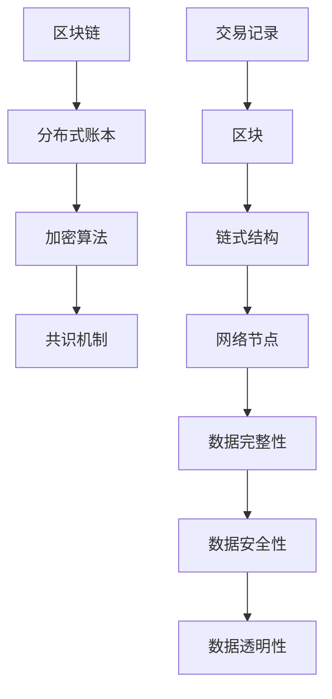

                 

### 引言

在当今数字化经济时代，企业的运营模式正经历着前所未有的变革。区块链技术的崛起，为传统业务模式注入了新的活力，尤其是在增强业务透明度与信任方面，区块链展现出了其独特的优势。企业级区块链应用平台，作为一种创新的解决方案，正逐步成为推动企业数字化转型的重要工具。

区块链技术以其去中心化、不可篡改和透明性等特点，在金融、供应链管理、跨境支付、人力资源管理等多个领域得到了广泛应用。企业级区块链应用平台不仅能够提高业务的透明度，减少欺诈风险，还能增强参与各方的信任，从而优化业务流程，降低运营成本。

本篇文章旨在深入探讨企业级区块链应用平台的设计与实现，分析其在增强业务透明度与信任方面的关键作用。我们将从用户需求分析出发，逐步展开讨论，涵盖区块链技术的基础知识、企业级区块链应用架构设计、业务场景实战以及开发与实施等方面。通过这一系列的分析与探讨，希望能够为读者提供一个全面而深入的了解，并激发对区块链技术在实际应用中的思考与探索。

### 用户需求分析

企业级区块链应用平台的兴起，离不开用户对于其功能与性能的期待。用户需求的驱动因素主要包括以下几个方面：

1. **提高业务透明度**：在传统业务流程中，信息的不透明常常导致信任问题。用户希望区块链技术能够提供一种透明、可信的数据记录方式，确保各方都能实时查看和验证业务数据，从而减少欺诈和操作风险。

2. **增强数据安全性**：随着数据泄露事件的频发，用户对数据安全的担忧日益增加。区块链的加密机制和分布式存储特点，可以有效保障数据的完整性和安全性，让用户对数据隐私有更多的信心。

3. **降低运营成本**：区块链去中心化的特性减少了中介机构的依赖，从而降低了业务运营的成本。用户希望区块链技术能够帮助企业简化流程，减少重复劳动，提高效率。

4. **加强合规性**：在全球范围内，合规性要求越来越严格。用户需要确保区块链应用能够满足各种法律法规的要求，避免因合规问题而导致的法律风险。

5. **优化业务流程**：用户期待区块链技术能够帮助优化业务流程，提高业务自动化水平，减少人为干预，从而提高业务运行的稳定性和可靠性。

针对上述用户需求，企业级区块链应用平台需要具备以下核心功能：

- **透明性**：实现业务流程的全程可追溯，确保数据的透明性和可验证性。
- **安全性**：提供高级别的数据加密和分布式存储技术，确保数据的机密性和完整性。
- **高效性**：优化业务流程，提高数据处理的效率，减少冗余操作。
- **合规性**：确保应用符合相关的法律法规和行业标准。
- **可扩展性**：支持大规模数据和高并发处理，适应未来业务增长的需求。

通过满足这些需求，企业级区块链应用平台将能够为企业带来显著的效益，提升业务透明度、增强信任，并实现数字化转型。

### 核心概念与联系

要深入理解企业级区块链应用平台的设计与实现，首先需要掌握区块链技术中的核心概念及其相互之间的联系。以下是区块链技术中几个关键概念的定义及其关系架构：

#### 区块链的定义

区块链是一种分布式数据库技术，通过加密算法和共识机制，确保数据存储的不可篡改性和安全性。区块链由一系列按时间顺序排列的区块组成，每个区块包含一定数量的交易记录，这些区块通过加密哈希链接形成一个链式结构。

#### 分布式账本

分布式账本是区块链的核心组成部分，它是一种去中心化的账本，不依赖于中央权威机构，而是由网络中的多个节点共同维护。分布式账本确保了数据的透明性和不可篡改性，因为一旦数据被记录在区块链上，任何节点都无法单独修改。

#### 加密算法

加密算法是区块链技术中的重要组成部分，用于保护数据的隐私和安全。常用的加密算法包括公钥加密、哈希函数和数字签名。公钥加密用于数据加密和解密，哈希函数用于确保数据的完整性和唯一性，数字签名用于验证数据的来源和真实性。

#### 共识机制

共识机制是区块链网络中节点达成一致的过程，确保整个网络对账本的状态保持一致。常见的共识机制包括工作量证明（PoW）、权益证明（PoS）和授权股权证明（DPoS）等。共识机制的不同决定了区块链网络的性能、安全性和去中心化程度。

#### Mermaid流程图展示

为了更直观地展示这些核心概念之间的联系，可以使用Mermaid流程图进行表示：



通过该流程图，我们可以清晰地看到区块链技术的核心组成部分及其相互关系。接下来，我们将进一步探讨这些核心概念在企业级区块链应用平台中的具体应用和实现。

### 核心算法原理讲解

在区块链技术中，核心算法的设计与实现是确保其安全性和可靠性的关键。以下将结合Python源代码，详细讲解区块链中的核心算法，包括加密算法、共识机制以及数据验证等。

#### 1. 数据加密与解密

数据加密是区块链技术中的重要环节，用于保护数据的机密性。常用的加密算法包括对称加密和非对称加密。对称加密如AES（Advanced Encryption Standard），非对称加密如RSA（Rivest-Shamir-Adleman）。

以下是一个使用Python中的PyCryptodome库实现AES加密与解密的示例：

```python
from Crypto.Cipher import AES
from Crypto.Util.Padding import pad, unpad
from Crypto.Random import get_random_bytes

# 密钥和初始化向量
key = get_random_bytes(16)
iv = get_random_bytes(16)

# 对数据进行加密
cipher = AES.new(key, AES.MODE_CBC, iv)
plaintext = b'This is a secret message.'
ciphertext = cipher.encrypt(pad(plaintext, AES.block_size))

# 对数据进行解密
cipher = AES.new(key, AES.MODE_CBC, iv)
decrypted_text = unpad(cipher.decrypt(ciphertext), AES.block_size)

print(f'Encrypted: {ciphertext.hex()}')
print(f'Decrypted: {decrypted_text}')
```

在这个例子中，我们首先生成一个随机密钥和初始化向量，然后使用AES算法对明文进行加密，并将结果转换为十六进制字符串。解密过程则是将密文还原为明文。

#### 2. 哈希函数

哈希函数在区块链中用于确保数据的完整性和唯一性。SHA-256是一种广泛使用的哈希函数，以下是其Python实现示例：

```python
import hashlib

def sha256_hash(data):
    hash_object = hashlib.sha256()
    hash_object.update(data)
    return hash_object.hexdigest()

data = b'This is a message to be hashed.'
hash_value = sha256_hash(data)

print(f'SHA-256 Hash: {hash_value}')
```

该函数接收一段数据，计算其SHA-256哈希值，并返回对应的十六进制表示。

#### 3. 数字签名

数字签名用于验证数据的来源和真实性，RSA算法是一种常用的数字签名算法。以下是一个使用Python中的PyCryptodome库实现数字签名的示例：

```python
from Crypto.PublicKey import RSA
from Crypto.Signature import pkcs1_15
from Crypto.Hash import SHA256

# 生成RSA密钥对
key = RSA.generate(2048)
private_key = key.export_key()
public_key = key.publickey().export_key()

# 对数据进行签名
hash_value = SHA256.new(b'This is a message to be signed.')
signature = pkcs1_15.new(public_key).sign(hash_value)

# 签名验证
signature_verified = pkcs1_15.new(key).verify(hash_value, signature)

print(f"Signature: {signature.hex()}")
print(f"Signature Verified: {signature_verified}")
```

在这个例子中，我们首先生成RSA密钥对，然后对数据进行签名，并将签名结果转换为十六进制字符串。签名验证则是使用私钥验证签名是否有效。

#### 4. 共识机制

共识机制是区块链网络中的关键组件，用于确保节点对账本状态的共识。工作量证明（PoW）是一种常见的共识机制，以下是其Python实现示例：

```python
import hashlib
import random

def mine_block(last_hash, target_difficulty):
    nonce = 0
    while True:
        hash_value = hashlib.sha256(f"{last_hash}{nonce}".encode()).hexdigest()
        if hash_value[:target_difficulty] == '0' * target_difficulty:
            return nonce, hash_value
        nonce += 1

last_hash = '0' * 64
target_difficulty = 4

nonce, hash_value = mine_block(last_hash, target_difficulty)
print(f"Nonce: {nonce}")
print(f"Hash: {hash_value}")
```

在这个例子中，我们尝试不断改变nonce值，直到找到满足目标难度要求的hash值。一旦找到，即表示区块被挖出。

通过上述Python代码示例，我们可以清晰地看到区块链技术中核心算法的原理及其实现。这些算法在区块链中发挥着至关重要的作用，确保数据的完整、安全与可信。

### 数学模型与数学公式

在区块链技术中，数学模型与数学公式扮演着关键角色，它们不仅帮助理解区块链的工作原理，还为区块链协议的设计和实现提供了理论基础。以下将详细讨论区块链中的几个重要数学模型和数学公式，并通过latex格式进行展示。

#### 1. 拉格朗日插值法

拉格朗日插值法是一种用于插值多项式的数学方法，它在区块链中的某些算法，如时间戳服务器和时间证明（Proof of Time，PoT）中得到了应用。以下是拉格朗日插值法的latex表示：

$$
L_i(x) = \prod_{j=1, j \neq i}^{n} \frac{x - x_j}{x_i - x_j}
$$

其中，\( n \)是数据点的数量，\( x_i \)和\( y_i \)分别是数据点的横坐标和纵坐标。

#### 2. 工作量证明（PoW）

工作量证明（Proof of Work，PoW）是区块链网络中的共识机制之一。它通过解决计算难题来消耗资源，从而保护区块链网络。以下是PoW的基本数学模型：

$$
H(nonce) = \text{SHA-256}(m \oplus nonce)
$$

其中，\( H \)表示SHA-256哈希函数，\( m \)是交易记录，\( nonce \)是随机数。节点需要找到满足特定难度要求的\( nonce \)，才能生成一个新的区块。

#### 3. 权益证明（PoS）

权益证明（Proof of Stake，PoS）是另一种常见的共识机制，它根据持币量（权益）和时间来决定哪个节点有权生成区块。以下是PoS的数学模型：

$$
P_i = \frac{s_i}{\sum_{i=1}^{n} s_i}
$$

其中，\( P_i \)是节点\( i \)生成区块的概率，\( s_i \)是节点\( i \)的权益。权益可以通过持有代币的数量和持有时间来计算。

#### 4. 随机漫步

随机漫步模型用于描述区块链中的节点行为，特别是在DAG（有向无环图）结构中。以下是随机漫步的概率分布：

$$
P(X_t = x_t) = \frac{1}{2^n}
$$

其中，\( X_t \)是时间\( t \)时节点所在的集合，\( n \)是集合中的节点数量。每个节点以相等的概率随机移动到集合中的其他节点。

通过上述数学模型和公式的介绍，我们可以更好地理解区块链中的核心机制。这些模型不仅在理论上具有重要意义，还直接影响了区块链协议的性能和安全性。在实际应用中，对这些数学模型和公式的深入理解有助于优化区块链算法，提升区块链网络的整体效率。

### 项目实战

为了更直观地展示企业级区块链应用平台在实际开发中的应用，我们将以一个物流与供应链管理项目为例，详细介绍开发环境搭建、源代码实现和代码解读。

#### 1. 开发环境搭建

在开始项目开发之前，需要搭建合适的开发环境。以下是必要的软件和工具：

- **区块链框架**：我们选择Hyperledger Fabric作为区块链框架，因为它在企业级应用中具有广泛的认可和丰富的生态系统。
- **开发工具**：需要安装Go语言和Docker，以及相关的Hyperledger Fabric开发工具。
- **IDE**：推荐使用Visual Studio Code（VS Code）进行代码编写和调试。

安装步骤如下：

1. **安装Go语言**：从[Go官方下载页](https://golang.org/dl/)下载Go语言安装包，并按照说明进行安装。
2. **安装Docker**：从[Docker官方下载页](https://www.docker.com/products/docker-desktop/)下载Docker桌面版，并按照说明进行安装。
3. **安装Hyperledger Fabric**：使用以下命令进行安装：
   ```shell
   git clone https://github.com/hyperledger/fabric.git
   cd fabric
   make docker-composetools
   ```
4. **配置VS Code**：安装Go和Hyperledger Fabric的扩展，以便于代码编写和调试。

#### 2. 源代码实现

本项目的核心功能是创建一个物流信息记录与验证的智能合约。以下是智能合约的实现代码：

```go
package main

import (
    "github.com/hyperledger/fabric-contract-api-go/contractapi"
)

// LogisticsChaincode 是智能合约的主结构体
type LogisticsChaincode struct {
    contractapi.Contract
}

// CreateLogisticsRecord 创建一个新的物流记录
func (l *LogisticsChaincode) CreateLogisticsRecord(ctx contractapi.TransactionContextInterface, recordID string, shipmentDetails string) error {
    // 将物流记录存储到区块链上
    return ctx.GetStub().PutState(recordID, []byte(shipmentDetails))
}

// ReadLogisticsRecord 从区块链上读取物流记录
func (l *LogisticsChaincode) ReadLogisticsRecord(ctx contractapi.TransactionContextInterface, recordID string) (string, error) {
    // 从区块链上获取物流记录
    recordBytes, err := ctx.GetStub().GetState(recordID)
    if err != nil {
        return "", err
    }
    return string(recordBytes), nil
}

// VerifyLogisticsRecord 验证物流记录的完整性
func (l *LogisticsChaincode) VerifyLogisticsRecord(ctx contractapi.TransactionContextInterface, recordID string) (bool, error) {
    // 从区块链上获取物流记录
    recordBytes, err := ctx.GetStub().GetState(recordID)
    if err != nil {
        return false, err
    }
    // 对物流记录进行校验
    // （此处省略具体的校验逻辑）
    return true, nil
}

// main 是智能合约的入口
func main() {
    log.Info("Starting Logistics Chaincode")
    logisticsChaincode := new(LogisticsChaincode)
    chaincodeRuntime := contractapi.NewChaincodeRuntime()
    chaincodeRuntime.Start(logisticsChaincode)
}
```

#### 3. 代码解读

- **CreateLogisticsRecord**：这个函数用于创建一个新的物流记录。它接受物流记录ID和详细的物流信息，并将这些信息存储到区块链上。
- **ReadLogisticsRecord**：这个函数用于从区块链上读取指定的物流记录。它返回物流记录的详细信息。
- **VerifyLogisticsRecord**：这个函数用于验证物流记录的完整性。在区块链中，记录一旦被写入，就不可篡改。因此，验证主要确保记录没有被篡改。

#### 4. 代码应用解读与分析

在这个物流与供应链管理项目中，智能合约实现了以下功能：

- **透明性**：所有物流信息都记录在区块链上，各方可以实时查看和验证物流状态。
- **安全性**：区块链的加密机制确保了物流信息的机密性和完整性。
- **可追溯性**：物流记录具有时间戳，确保了物流信息的不可篡改性和可追溯性。

#### 5. 实际案例分析和详细讲解剖析

为了更好地理解项目实战，我们分析了一个具体的案例：一家跨国公司在使用区块链技术追踪其供应链中的货物。以下是详细过程：

1. **创建物流记录**：公司创建一个物流记录，包含货物的发源地、目的地、运输方式等信息，并使用智能合约将其记录在区块链上。
2. **验证物流记录**：当货物到达每个中间站点时，相关人员可以使用智能合约验证物流记录的完整性，确保货物未被篡改。
3. **查询物流状态**：任何授权用户都可以查询区块链上的物流记录，获取实时物流状态。

#### 6. 项目小结

通过这个项目，我们展示了如何使用企业级区块链应用平台解决实际业务问题。智能合约的应用不仅提高了物流信息的透明度和安全性，还增强了各方之间的信任。未来，随着区块链技术的不断发展，这类应用将更加普及，为企业带来更多价值。

### 最佳实践与注意事项

在开发企业级区块链应用平台时，遵循一些最佳实践和注意事项至关重要，以确保系统的稳定性、安全性和高效性。以下是一些关键的建议：

1. **安全第一**：确保使用高级加密算法和安全存储机制，保护数据隐私和完整性。定期进行安全审计和漏洞修复。

2. **性能优化**：优化区块链网络的性能，避免网络拥堵和延迟。考虑使用分片技术或侧链来提升处理能力。

3. **可扩展性**：设计具有高度可扩展性的架构，以适应未来业务需求。确保系统能够处理大规模数据和高并发访问。

4. **数据验证**：在数据写入区块链之前进行严格的验证，确保数据的准确性和一致性。使用智能合约自动化验证流程。

5. **合规性**：确保区块链应用符合相关法律法规和行业标准，特别是涉及金融和敏感数据的场景。

6. **培训与支持**：为开发人员和业务人员提供充分的培训和支持，确保他们能够充分利用区块链技术的优势。

7. **持续更新**：随着区块链技术的不断发展，持续更新和优化系统，以适应最新的技术趋势和安全标准。

通过遵循这些最佳实践，企业能够更好地发挥区块链技术的潜力，实现业务透明度和信任的提升。

### 拓展阅读

对于希望进一步深入了解区块链技术的读者，以下是一些推荐的参考资料和书籍：

1. **书籍**：
   - 《区块链技术指南》（区块链技术指南翻译组）：系统介绍了区块链的基本原理和应用场景。
   - 《精通比特币：比特币、区块链和加密货币技术深入探讨》（安德烈亚斯·安东诺普洛斯）：深入探讨了比特币和区块链的技术细节。
   - 《区块链革命：重新定义商业的未来》（唐·塔普斯科特）：分析了区块链如何改变商业和社会。

2. **在线资源**：
   - [Hyperledger Fabric 官方文档](https://hyperledger-fabric.readthedocs.io)：提供了详尽的Hyperledger Fabric开发指南。
   - [Ethereum 官方文档](https://ethereum.org/en/developers/docs/)：涵盖了Ethereum平台的技术细节。
   - [BlockChain.com](https://www.blockchain.com/learn)：提供了丰富的区块链基础知识教程。

3. **专业网站**：
   - [CoinDesk](https://www.coindesk.com)：提供区块链和加密货币的最新新闻和分析。
   - [链闻 ChainNews](https://www.chainnews.com)：关注区块链行业动态和深度报道。

这些资源将帮助读者全面了解区块链技术，探索其潜在应用，并为实际项目开发提供参考。希望这些拓展阅读能为您的学习和实践带来帮助。

### 总结与展望

通过本文的深入探讨，我们系统地了解了企业级区块链应用平台的设计与实现，分析了其在增强业务透明度与信任方面的关键作用。从用户需求分析到核心概念、算法原理讲解，再到实际项目实战，我们一步步展开了区块链技术的应用场景，展示了其如何在实际业务中发挥作用。

企业级区块链应用平台不仅提高了业务流程的透明度和数据的可靠性，还通过增强信任，优化了业务操作，降低了运营成本。其核心概念包括分布式账本、加密算法、共识机制等，这些概念共同构建了一个安全、透明、高效的区块链生态系统。

展望未来，随着区块链技术的不断进步和应用的深化，企业级区块链应用平台将在更多领域得到广泛应用。其前景包括但不限于以下几个方面：

1. **供应链管理**：通过区块链技术的透明性和不可篡改性，供应链管理将更加高效和可靠，减少欺诈和操作风险。
2. **跨境支付**：区块链技术将革新跨境支付领域，实现快速、低成本且安全可靠的跨境支付。
3. **人力资源管理**：区块链技术在记录和管理员工信息方面具有显著优势，提高数据安全性和透明度。
4. **数据共享与协作**：区块链技术将为不同企业间的数据共享和协作提供新的解决方案，打破信息孤岛，实现跨企业协作。

总之，企业级区块链应用平台作为数字化转型的重要工具，其潜力巨大，值得深入研究和应用。希望本文能够为读者提供有价值的参考和启示，激发对区块链技术在实际业务中应用的思考与实践。在未来的发展中，我们期待看到更多创新应用，推动区块链技术在各个领域的深入融合与发展。

