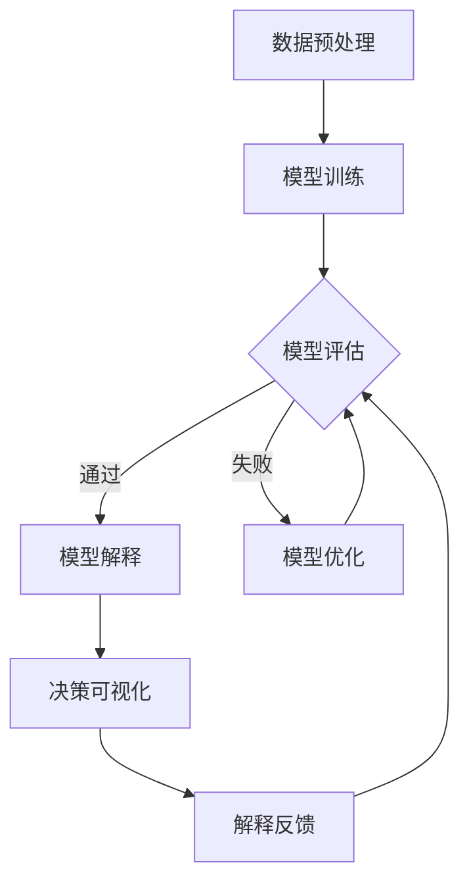

                 

### 第一部分：引言与概述

#### 1.1 书籍主题介绍

《企业级可解释AI框架：增强AI决策透明度》是一本针对企业级人工智能应用场景，深入探讨可解释性AI框架构建及其在实际应用中价值的技术指南。随着人工智能技术的发展，机器学习模型在企业级应用中越来越普遍，然而，这些模型的“黑盒”性质使得其决策过程难以解释和理解，这在某些关键领域（如金融、医疗、自动驾驶等）可能带来严重的后果。因此，如何构建可解释AI框架，增强AI决策的透明度，成为了当前研究的热点问题。

本书旨在为读者提供一套系统、全面的可解释AI框架构建方法和实践指南，帮助企业和开发者更好地理解和应用可解释性AI，提高AI系统的可信度和用户满意度。书中不仅涵盖了可解释AI的理论基础和关键技术，还通过实际案例研究，展示了可解释AI在企业级应用中的具体实现和效果。

#### 1.1.1 可解释AI的定义与重要性

可解释AI（Explainable AI, XAI）是指能够通过人类可理解的方式，解释AI模型决策过程和结果的AI系统。与传统的“黑盒”模型相比，可解释AI强调模型的可视化、可追溯性和可理解性，使其决策过程更加透明，用户可以更加信任和接受AI系统。

在关键领域，如金融风险评估、医疗诊断、自动驾驶等，决策的透明度和可解释性至关重要。例如，在金融领域，可解释AI可以帮助银行和金融机构更好地理解和验证信用评分模型的决策过程，从而提高信用评估的准确性和公正性；在医疗领域，可解释AI可以帮助医生和患者理解诊断模型的决定，提高医疗服务的可信度和患者满意度；在自动驾驶领域，可解释AI可以帮助车辆更好地理解和预测周围环境，提高自动驾驶系统的安全性和可靠性。

#### 1.1.2 企业级AI框架概述

企业级AI框架是指一套系统化的方法，用于构建、部署和管理大规模人工智能应用。这些框架通常包括数据预处理、模型训练、模型评估、模型部署和监控等关键环节，旨在提高AI应用的开发效率和可维护性。

企业级AI框架的设计需要考虑多个因素，包括系统的可扩展性、可维护性、安全性、可解释性和用户友好性等。可解释性是其中至关重要的一环，因为它直接影响到AI系统的信任度和用户满意度。因此，在企业级AI框架的设计和实现过程中，需要充分考虑可解释AI的技术和方法，确保AI系统的决策过程和结果是透明和可解释的。

#### 1.1.3 决策透明度在AI应用中的价值

决策透明度在AI应用中的价值主要体现在以下几个方面：

1. **提高用户信任**：透明度高的AI系统更容易被用户接受，因为用户可以理解AI系统的决策过程和原因，从而减少对系统的疑虑和担忧。

2. **优化决策过程**：通过解释AI决策的原因和过程，可以帮助用户和管理者更好地理解模型的性能和限制，从而优化决策过程，提高决策质量。

3. **合规性和风险管理**：在金融、医疗等领域，决策的透明度有助于确保模型的合规性和合法性，降低法律和道德风险。

4. **改进模型性能**：通过分析模型的决策过程，可以发现模型存在的问题和不足，从而进行改进和优化，提高模型的性能和准确率。

5. **促进技术进步**：决策透明度的提高可以促进AI技术的进步和发展，因为研究人员和开发者可以更好地理解和研究AI系统的内部机制，从而推动AI技术的创新和应用。

综上所述，《企业级可解释AI框架：增强AI决策透明度》不仅为读者提供了可解释AI的理论基础和核心技术，还通过实际案例展示了其在企业级应用中的价值，为企业和开发者提供了实用的构建和优化指南。通过本书的学习和实践，读者可以更好地理解和应用可解释AI技术，提高AI系统的透明度和可信度，推动人工智能技术的健康发展。

#### 2.1 可解释AI的核心概念

可解释AI（Explainable AI, XAI）作为人工智能领域的重要研究方向，旨在提高AI系统的透明度和可理解性。本文将首先探讨可解释AI的理论基础，随后介绍模型透明度的不同层次，以及现有的主要解释方法。

##### 2.1.1 机器学习模型的透明度

机器学习模型通常被分为两大类：“黑盒”模型和“白盒”模型。黑盒模型如神经网络、支持向量机等，其内部机制复杂，难以直接理解和解释。而白盒模型如决策树、线性模型等，其决策过程相对直观，容易解释。然而，即使在白盒模型中，模型的解释能力也有限，往往只能提供局部的解释。

在可解释AI的研究中，透明度是衡量模型解释能力的关键指标。模型透明度可以分为以下三个层次：

1. **局部透明度**：关注单个样本或决策路径的解释。例如，通过特征的重要性评估，可以解释模型对特定样本的决策原因。
2. **全局透明度**：关注模型整体决策过程的解释。例如，通过可视化技术，可以展示模型对整个数据集的决策模式。
3. **语义透明度**：关注模型与人类直觉和常识的一致性。例如，通过解释模型对某一类样本的决策过程，可以验证其是否符合人类的直觉和逻辑。

##### 2.1.2 模型解释方法分类

为了提高模型的透明度，研究者们提出了多种解释方法。根据解释方法的不同，可以分为以下几类：

1. **特征重要性评估**：通过计算特征对模型决策的影响程度，来解释模型的工作原理。常见的算法包括：SHAP（SHapley Additive exPlanations）、LIME（Local Interpretable Model-agnostic Explanations）等。
2. **模型可视化**：通过图形化展示模型的结构和决策过程，帮助用户理解模型的工作机制。例如，使用决策树的可视化工具来解释决策树模型。
3. **对抗性解释**：通过生成对抗性样本，来揭示模型可能存在的偏见和缺陷。例如，通过生成与正常样本差异很大的对抗性样本，观察模型对这些样本的反应，来解释模型的决策逻辑。
4. **符号化解释**：通过将模型转化为可解释的数学形式，如决策树、线性模型等，来解释模型的工作原理。例如，将神经网络转化为可解释的决策树结构。

##### 2.1.3 可解释AI的关键技术

可解释AI的关键技术主要包括以下几个方面：

1. **可解释性度量**：用于量化模型的可解释性。常见的度量方法包括：解释覆盖率（覆盖的样本比例）、解释一致性（不同解释方法的一致性）、解释可理解性（解释是否容易被用户理解）等。
2. **解释可视化**：用于将解释结果以可视化的形式呈现给用户。常见的方法包括：热力图、桑基图、回归树可视化等。
3. **解释工具**：用于辅助用户理解和解释模型决策的工具。常见的工具包括：LIME、SHAP、Explainable AI可视化工具等。
4. **解释优化**：通过优化模型结构和训练过程，提高模型的可解释性。常见的优化方法包括：简化模型结构、引入可解释性约束等。

通过上述关键技术和方法，可解释AI旨在提高机器学习模型的可理解性和透明度，使其决策过程更加直观和可信，从而推动AI技术在各领域的广泛应用。

#### 2.2 可解释AI的Mermaid流程图

为了更好地理解和分析可解释AI的核心流程，我们可以使用Mermaid图形化工具来绘制其流程图。以下是可解释AI的基本流程及其详细步骤：

**流程说明：**

1. **数据预处理**（A）：在模型训练前，需要对数据进行清洗、归一化和特征提取等处理，确保数据的质量和一致性。
2. **模型训练**（B）：使用训练数据集对机器学习模型进行训练，模型可能采用神经网络、决策树、支持向量机等算法。
3. **模型评估**（C）：通过验证数据集对模型的性能进行评估，包括准确率、召回率、F1分数等指标。
4. **模型解释**（D）：如果模型评估通过，则进行模型解释。这一步骤使用不同的解释方法（如SHAP、LIME等）来分析模型对每个样本的决策过程。
5. **决策可视化**（F）：将模型解释结果以可视化形式展示，如热力图、回归树等，帮助用户直观地理解模型的决策逻辑。
6. **解释反馈**（G）：用户对解释结果进行反馈，提出改进意见或疑问，这有助于进一步优化模型的解释能力。
7. **模型优化**（E）：根据解释反馈，对模型进行优化，包括调整模型参数、引入新的解释方法等，以提高模型的可解释性和性能。

通过上述Mermaid流程图，我们可以清晰地看到可解释AI的各个环节及其相互关系，有助于开发者在实际应用中更好地设计和实现可解释AI系统。

#### 2.3 可解释AI的关键算法原理

可解释AI（XAI）的实现依赖于多种关键算法，这些算法不仅提升了模型的透明度，还帮助用户更好地理解和信任AI系统的决策过程。以下是几种主要的关键算法及其原理的详细介绍。

##### 2.3.1 特征重要性评估算法

特征重要性评估是可解释AI的重要方法之一，它旨在确定输入特征对模型决策的影响程度。以下是几种常用的特征重要性评估算法：

1. **SHAP（SHapley Additive exPlanations）**：
   SHAP是一种基于博弈论的方法，它通过计算每个特征对模型预测值的边际贡献，来评估其重要性。SHAP值提供了一个全局的视角，能够解释模型对每个样本的预测如何受不同特征的影响。
   
   **算法原理**：
   SHAP值通过计算每个特征在所有可能的特征组合中对模型预测的贡献，类似于博弈论中的Shapley值。具体公式为：
   $$
   \text{SHAP}_i = \frac{1}{N} \sum_{S \subseteq \{1, ..., N\} \setminus \{i\}} (\text{model}(x_S) - \text{model}(x_{S \cup \{i\}}))
   $$
   其中，$N$是特征数量，$x_S$表示包含特征$S$的样本，$\text{model}(\cdot)$表示模型预测值。

2. **LIME（Local Interpretable Model-agnostic Explanations）**：
   LIME是一种局部可解释的方法，它通过在给定样本周围生成数据点，并分析这些点如何影响模型的预测，来解释特定样本的决策。
   
   **算法原理**：
   LIME首先选择一个基模型（如线性模型或决策树），然后通过生成对抗性样本来近似原始模型的决策边界。具体步骤如下：
   - 选择一个基模型$\text{base\_model}$。
   - 对于给定样本$x$，生成一系列近似的对抗性样本$y$，使得$y$与$x$在特征空间上距离较近，但模型预测结果有显著差异。
   - 计算每个特征对模型预测的影响，使用L2范数或L1范数来量化特征的重要性。

3. **特征贡献评分**：
   特征贡献评分是一种简单的全局特征重要性评估方法，它通过计算每个特征对所有样本预测的贡献，来评估其整体重要性。
   
   **算法原理**：
   特征贡献评分的基本思想是将每个特征的值变化对模型预测的影响进行加权求和。具体公式为：
   $$
   \text{feature\_importance}(f) = \sum_{x \in \text{training\_data}} \left| \frac{\partial \text{model\_prediction}(x)}{\partial f} \right|
   $$
   其中，$\text{training\_data}$是训练数据集，$\text{model\_prediction}(\cdot)$是模型的预测函数。

##### 2.3.2 局部可解释性方法

局部可解释性方法关注于解释单个样本或小批量样本的决策过程。以下是几种常用的局部可解释性方法：

1. **LIME（Local Interpretable Model-agnostic Explanations）**：
   LIME方法已经在2.3.1中详细介绍。LIME通过生成对抗性样本来解释特定样本的决策过程，其核心思想是近似原始模型的决策边界，从而揭示特征对模型预测的影响。

2. **CAM（Convolutional Activation Maximizing）**：
   CAM方法主要用于深度神经网络，特别是在计算机视觉任务中。它通过最大化卷积层的激活值，来生成可解释的特征图，从而揭示模型关注的关键区域。
   
   **算法原理**：
   CAM方法首先将原始输入图像和模型的最后一层特征图进行融合，生成一个具有可解释性的特征图。具体步骤如下：
   - 对输入图像进行卷积操作，生成特征图$F$。
   - 对特征图$F$应用分类器的软目标$S$，生成一个融合图$G = F \odot S$，其中$\odot$表示元素乘积。
   - 对融合图$G$进行上采样，生成具有与输入图像相同分辨率的特征图。

3. **LIME-Net（LIME for Neural Networks）**：
   LIME-Net是一种针对神经网络的LIME变体，它通过训练一个线性模型来近似原始神经网络的决策过程。
   
   **算法原理**：
   LIME-Net首先选择一个神经网络$\text{NN}$，然后使用梯度提升方法训练一个线性模型$\text{LIME\_model}$，使得$\text{LIME\_model}$能够解释神经网络在特定样本$x$上的决策。具体步骤如下：
   - 计算神经网络在$x$上的梯度$\nabla_x \text{NN}(x)$。
   - 使用梯度提升方法训练一个线性模型$\text{LIME\_model}$，使得$\text{LIME\_model}$能够拟合$\text{NN}$在$x$上的决策。
   - 使用$\text{LIME\_model}$解释$x$的决策。

##### 2.3.3 全局可解释性方法

全局可解释性方法关注于解释模型在整体数据集上的决策过程，以下是几种常用的全局可解释性方法：

1. **LIME（Local Interpretable Model-agnostic Explanations）**：
   虽然LIME主要是一种局部解释方法，但也可以扩展到全局解释。通过在数据集上生成大量对抗性样本，LIME可以提供关于模型决策边界和特征重要性的全局视角。

2. **SHAP（SHapley Additive exPlanations）**：
   SHAP方法可以提供关于整个数据集的特征重要性的全局解释，通过计算每个特征在所有样本上的边际贡献。

3. **全局特征重要性图（Global Feature Importance Maps）**：
   全局特征重要性图通过将每个特征对模型预测的贡献以图形化的形式展示，从而提供关于模型整体决策模式的可视化解释。

4. **决策规则提取**：
   决策规则提取方法通过从模型中提取一系列规则，来解释模型在整体数据集上的决策过程。这种方法适用于规则性较强的模型，如决策树。

通过上述关键算法，可解释AI不仅能够解释模型对单个样本的决策，还能够提供关于模型整体决策过程的全局视角，从而增强AI系统的透明度和可理解性。这些算法和方法为开发者和用户提供了强大的工具，帮助他们更好地理解和信任AI系统的决策过程。

#### 3.1 可解释AI框架的设计原则

设计企业级可解释AI框架时，需要遵循一系列原则，以确保系统的稳定性、可扩展性、安全性以及可解释性。以下是一些关键设计原则：

##### 3.1.1 系统架构设计

良好的系统架构设计是构建可解释AI框架的基础。以下是一些关键架构设计原则：

1. **模块化设计**：将系统划分为独立的模块，如数据预处理、模型训练、模型解释和模型部署等，便于维护和升级。
2. **分布式计算**：利用分布式计算框架（如Apache Spark、Dask等）来处理大规模数据，提高系统的处理能力和效率。
3. **微服务架构**：采用微服务架构，将不同功能模块部署为独立的服务，以提高系统的灵活性和可扩展性。
4. **容器化与自动化部署**：使用容器化技术（如Docker）和自动化部署工具（如Kubernetes），确保系统快速部署和灵活扩展。
5. **监控与日志记录**：集成监控系统（如Prometheus、Grafana）和日志记录工具（如ELK Stack），实时监控系统的运行状态和性能。

##### 3.1.2 数据预处理

数据预处理是构建可解释AI框架的重要步骤，以下是一些关键原则：

1. **数据清洗**：处理缺失值、异常值和重复数据，确保数据的质量和一致性。
2. **特征工程**：选择和提取有助于模型训练和解释的特征，如主成分分析（PCA）、特征转换等。
3. **数据标准化**：对特征进行标准化或归一化，使数据在数值范围上保持一致性，便于模型训练和解释。
4. **数据分片**：将数据集划分为训练集、验证集和测试集，以便于模型训练和评估。
5. **数据加密与隐私保护**：对敏感数据进行加密和隐私保护，确保数据的安全性和合规性。

##### 3.1.3 模型选择与优化

选择合适的模型并对其进行优化，是提高系统性能和可解释性的关键。以下是一些关键原则：

1. **模型多样性**：选择多种不同类型的模型（如神经网络、决策树、支持向量机等），以便比较和选择最佳模型。
2. **模型评估**：使用多种评估指标（如准确率、召回率、F1分数等）对模型进行评估，选择性能最佳的模型。
3. **模型调参**：通过调整模型参数（如学习率、批量大小等），优化模型性能和可解释性。
4. **模型压缩**：使用模型压缩技术（如剪枝、量化等），减小模型的大小和计算复杂度，提高系统的效率和可解释性。
5. **模型解释**：在模型训练和评估过程中，结合可解释性方法（如SHAP、LIME等）对模型进行解释，提高决策的透明度。

通过遵循上述设计原则，可以构建一个稳定、高效、可扩展的企业级可解释AI框架，从而提高AI系统的透明度和用户信任度。

#### 3.2 可解释AI框架的开发流程

构建企业级可解释AI框架是一个系统性工程，涉及多个关键步骤和环节。以下是详细阐述开发流程的各个环节，包括需求分析与设计、模型训练与解释、模型评估与优化。

##### 3.2.1 需求分析与设计

在构建可解释AI框架之前，明确需求是至关重要的。这一阶段主要包括以下步骤：

1. **需求收集**：通过与业务分析师、数据科学家、项目经理等多方沟通，了解业务场景、用户需求和数据情况。
2. **需求文档编写**：将收集到的需求整理成需求文档，包括业务目标、功能需求、性能需求等。
3. **系统架构设计**：根据需求文档，设计系统架构，包括模块划分、数据流、接口定义等。
4. **数据预处理**：确定数据预处理方案，包括数据清洗、特征工程、数据标准化等。

##### 3.2.2 模型训练与解释

模型训练与解释是构建可解释AI框架的核心步骤。以下是具体过程：

1. **数据预处理**：根据设计的数据预处理方案，对数据进行清洗、归一化等处理，确保数据的质量和一致性。
2. **模型选择**：根据业务场景和数据特点，选择合适的机器学习模型。常用的模型包括神经网络、决策树、支持向量机等。
3. **模型训练**：使用训练数据集对模型进行训练。训练过程中，可以结合超参数调优和模型压缩技术，提高模型性能。
4. **模型解释**：结合可解释AI方法（如SHAP、LIME等），对模型的决策过程进行解释。解释方法的选择应根据具体业务场景和数据特性。
5. **模型可视化**：将模型解释结果以可视化的形式展示，如热力图、回归树等，帮助用户直观地理解模型的决策逻辑。

##### 3.2.3 模型评估与优化

模型评估与优化是确保模型性能和可解释性的关键环节。以下是具体过程：

1. **模型评估**：使用验证数据集对模型进行评估，常用的评估指标包括准确率、召回率、F1分数等。根据评估结果，调整模型参数或选择更合适的模型。
2. **模型优化**：针对评估结果，对模型进行优化。优化方法包括调整模型结构、引入新的特征、采用更高效的训练算法等。
3. **解释优化**：结合用户反馈和业务需求，对模型解释方法进行优化，提高解释的准确性和可理解性。
4. **模型部署**：将优化后的模型部署到生产环境，并进行实时监控和运维。

通过以上开发流程，可以构建一个高效、稳定、可解释的企业级AI框架，从而提高AI系统的透明度和用户信任度。

#### 3.3 可解释AI框架的案例研究

为了更好地理解可解释AI框架在实际应用中的效果和优势，我们将通过三个具体案例进行深入分析。这些案例分别来自金融、医疗和自动驾驶三个不同的领域，展示了可解释AI在提高决策透明度和系统可信度方面的巨大潜力。

##### 3.3.1 案例一：金融风险评估

在金融行业中，信用评分模型广泛应用于贷款审批、信用卡发行等业务场景。然而，这些模型的“黑盒”性质常常引发用户对模型决策的不信任。为了增强模型的透明度，一家大型银行采用了可解释AI框架，对信用评分模型进行优化和解释。

**案例背景：**

- **业务需求**：提高信用评分模型的透明度和可解释性，增强用户信任，降低法律风险。
- **数据特点**：包含大量个人财务信息，如收入、负债、信用历史等。

**实施过程：**

1. **数据预处理**：对数据进行清洗和归一化处理，确保数据质量。
2. **模型选择**：选择一个基于神经网络的信用评分模型。
3. **模型训练**：使用训练数据集对模型进行训练，并进行超参数调优。
4. **模型解释**：采用SHAP方法对模型进行解释，计算每个特征的贡献值。
5. **模型优化**：根据解释结果，调整模型参数和特征选择，提高模型的可解释性。
6. **模型部署**：将优化后的模型部署到生产环境，并进行实时监控和运维。

**效果评估：**

- **模型性能**：通过优化，信用评分模型的准确率和F1分数均有显著提升。
- **用户信任**：模型的可解释性增强了用户对评分结果的信任，降低了法律风险。
- **业务收益**：透明度提升后，客户对银行的信任度增加，贷款审批通过率提高，业务收益增加。

##### 3.3.2 案例二：医疗诊断辅助

在医疗领域，AI辅助诊断系统可以帮助医生提高诊断准确率和效率。然而，医疗诊断涉及到复杂的医学知识和大量的数据，传统的“黑盒”模型难以被医生理解和接受。为了解决这个问题，一家医疗技术公司引入了可解释AI框架，对AI诊断系统进行优化和解释。

**案例背景：**

- **业务需求**：提高AI诊断系统的透明度和可解释性，帮助医生更好地理解和信任诊断结果。
- **数据特点**：包含医学影像数据、患者临床信息等。

**实施过程：**

1. **数据预处理**：对医学影像数据进行预处理，包括图像增强、去噪等。
2. **模型选择**：选择一个基于深度学习的医学影像诊断模型。
3. **模型训练**：使用训练数据集对模型进行训练，并进行超参数调优。
4. **模型解释**：采用LIME方法对模型进行局部解释，揭示模型对特定病例的决策过程。
5. **模型优化**：根据解释结果，调整模型结构和参数，提高模型的可解释性。
6. **模型部署**：将优化后的模型集成到现有的医疗诊断系统中，进行实时诊断。

**效果评估：**

- **诊断准确率**：通过优化，AI诊断系统的准确率和召回率均有显著提升。
- **医生信任度**：模型的可解释性帮助医生更好地理解和信任诊断结果，提高了诊断的效率和准确性。
- **患者满意度**：透明度提升后，患者对诊断结果的信任度增加，满意度提高。

##### 3.3.3 案例三：自动驾驶系统

自动驾驶系统涉及到复杂的感知、决策和控制过程，其透明度和安全性至关重要。为了提高自动驾驶系统的透明度和用户信任，一家自动驾驶公司采用了可解释AI框架，对自动驾驶模型进行优化和解释。

**案例背景：**

- **业务需求**：提高自动驾驶系统的透明度和安全性，增强用户对自动驾驶的信任。
- **数据特点**：包含大量的传感器数据，如雷达、激光雷达、摄像头等。

**实施过程：**

1. **数据预处理**：对传感器数据进行预处理，包括数据清洗、去噪等。
2. **模型选择**：选择一个基于深度学习的自动驾驶感知和决策模型。
3. **模型训练**：使用训练数据集对模型进行训练，并进行超参数调优。
4. **模型解释**：采用CAM方法对模型进行全局解释，揭示模型对特定场景的决策过程。
5. **模型优化**：根据解释结果，调整模型结构和参数，提高模型的可解释性。
6. **模型部署**：将优化后的模型集成到自动驾驶系统中，进行实况测试和优化。

**效果评估：**

- **感知准确性**：通过优化，自动驾驶系统的感知准确率显著提升。
- **决策透明度**：模型的可解释性提高了用户对自动驾驶决策过程的信任度。
- **安全性**：透明的决策过程有助于减少潜在的安全风险，提高了自动驾驶系统的整体安全性。

通过这些实际案例，我们可以看到，可解释AI框架在提高AI系统透明度和用户信任方面发挥了重要作用。无论是在金融、医疗还是自动驾驶领域，可解释AI的应用都带来了显著的业务收益和用户体验提升。未来，随着技术的不断进步和应用场景的不断拓展，可解释AI将在更多领域发挥重要作用。

#### 4.1 金融行业

在金融行业中，可解释AI的应用正逐渐成为提升业务透明度和用户信任的关键手段。以下是可解释AI在金融行业中的具体应用场景及其价值：

##### 4.1.1 金融产品推荐

金融产品推荐系统是金融行业的一个重要应用场景，它利用机器学习模型分析用户的金融行为和偏好，从而推荐合适的金融产品。然而，传统推荐系统通常是一个“黑盒”，用户难以理解模型推荐的原因。可解释AI通过提供模型决策的解释，可以帮助用户更好地理解推荐结果，从而增加信任度。

- **具体应用**：
  - 使用SHAP方法评估每个特征对推荐结果的影响，揭示模型决策的关键因素。
  - 通过LIME方法生成对抗性样本，解释特定用户为什么会被推荐某种产品。
  - 提供用户友好的可视化工具，展示推荐结果背后的逻辑。

- **价值**：
  - 提高用户信任：用户能够理解为什么会被推荐特定产品，减少了因不透明而产生的疑虑。
  - 增强用户体验：透明的推荐过程提高了用户对金融平台的满意度。
  - 降低合规风险：可解释的模型有助于确保推荐过程符合监管要求。

##### 4.1.2 风险控制与合规

金融行业中的风险控制和合规性要求非常高，可解释AI可以帮助金融机构更好地理解和验证风险模型的决策过程。

- **具体应用**：
  - 使用全局解释方法，如SHAP，评估模型对每个样本的决策，确保模型决策的透明性。
  - 通过解释结果，验证模型是否符合监管要求，如公平性和无歧视性。
  - 提供可视化的决策路径，帮助风险管理人员理解模型的决策逻辑。

- **价值**：
  - 确保合规性：可解释AI确保模型决策过程符合法律法规，降低法律风险。
  - 提高决策质量：通过解释结果，发现模型中的潜在问题，进行优化和改进。
  - 增强信任：透明度高的风险控制模型有助于增强投资者和客户的信任。

##### 4.1.3 信用评分模型

信用评分模型是金融行业中最常见的应用之一，它用于评估个人的信用风险。然而，这些模型通常非常复杂，难以解释。可解释AI通过提供模型决策的解释，帮助金融机构和用户更好地理解信用评分结果。

- **具体应用**：
  - 使用SHAP或LIME方法，评估每个特征对信用评分的影响，提供详细解释。
  - 通过可视化工具，如特征重要性图或决策树，展示模型决策过程。
  - 提供用户友好的解释报告，帮助用户理解信用评分的影响因素。

- **价值**：
  - 提高用户信任：用户能够了解信用评分结果的依据，减少对评分结果的疑虑。
  - 增强透明度：透明的信用评分过程有助于提高金融机构的信誉。
  - 降低误判风险：通过解释结果，发现潜在的问题和偏见，优化评分模型。

综上所述，可解释AI在金融行业的应用不仅提高了业务透明度和用户信任，还增强了合规性和决策质量，为金融机构带来了显著的业务价值。

#### 4.2 医疗保健

在医疗保健领域，可解释AI的应用正在迅速扩展，其目的是提高诊断的准确性、优化治疗方案，并增强患者对医疗决策的信任。以下是可解释AI在医疗保健领域中的几个关键应用场景：

##### 4.2.1 疾病诊断与预测

疾病诊断与预测是医疗保健中最重要的应用之一。传统的诊断模型，如影像分析模型和电子健康记录分析模型，通常非常复杂且难以解释。可解释AI通过提供详细的决策路径和影响因素分析，使得医生和患者能够更好地理解诊断结果。

- **具体应用**：
  - 使用LIME或SHAP方法，评估模型在诊断过程中对每个特征的权重和贡献。
  - 通过可视化工具，如热力图或回归树，展示模型对影像数据的关注区域和决策逻辑。
  - 提供个性化的诊断解释报告，帮助医生和患者了解疾病诊断的依据。

- **价值**：
  - 提高诊断准确性：通过详细解释，医生可以更好地理解模型的决策依据，从而提高诊断的准确性。
  - 增强患者信任：透明的诊断过程有助于患者理解诊断结果，减少对医疗决策的疑虑。
  - 改进治疗方案：通过对模型解释结果的分析，医生可以优化治疗方案，提高治疗的成功率。

##### 4.2.2 患者风险分析

在医疗保健中，对患者风险进行准确分析对于预防和控制疾病具有重要意义。可解释AI可以通过分析患者的健康数据，预测潜在的健康风险，并提供详细的解释，帮助医生制定更有效的预防措施。

- **具体应用**：
  - 使用全局解释方法，如SHAP，评估模型对每个特征的权重和贡献。
  - 通过可视化工具，展示模型对患者数据的风险评分和关键影响因素。
  - 提供患者专用的风险分析报告，帮助患者了解自身健康风险，采取相应的预防措施。

- **价值**：
  - 准确预测风险：详细的解释结果有助于医生更准确地预测患者未来可能面临的健康风险。
  - 优化预防策略：通过解释结果，医生可以更合理地制定预防策略，减少疾病发生的可能性。
  - 增强患者参与：透明的风险分析过程鼓励患者积极参与健康管理，提高预防措施的执行效果。

##### 4.2.3 医疗资源优化

医疗资源的优化分配是提高医疗服务质量和效率的关键。可解释AI可以通过分析患者流量、医疗资源使用情况等数据，提供详细的解释和建议，帮助医疗机构更好地分配资源和规划服务。

- **具体应用**：
  - 使用LIME方法，分析模型对医院内部患者流量和资源使用情况的预测和分配逻辑。
  - 通过可视化工具，展示模型对医疗资源分配的关键因素和决策路径。
  - 提供详细的资源优化报告，帮助医院管理层制定更加科学的资源分配策略。

- **价值**：
  - 提高资源利用效率：通过详细的解释，医院可以更合理地分配医疗资源，减少浪费。
  - 优化服务质量：透明的资源分配过程有助于提高医疗服务的质量和患者满意度。
  - 减少运营成本：优化的资源分配策略有助于降低医疗机构的运营成本，提高整体效益。

总之，可解释AI在医疗保健领域的应用不仅提高了诊断和预测的准确性，增强了患者对医疗决策的信任，还优化了医疗资源的使用，为整个医疗行业带来了显著的改进和效益。

#### 4.3 自动驾驶

自动驾驶技术的发展正推动着智能交通系统的革新，然而，自动驾驶系统的安全性和透明度仍然是一个亟待解决的问题。可解释AI在这一领域中的应用，旨在提高自动驾驶系统的安全性和用户信任度。

##### 4.3.1 行为预测与决策

自动驾驶系统需要实时预测和决策，以确保车辆的安全行驶。传统的自动驾驶模型通常较为复杂，难以解释。可解释AI通过提供详细的决策路径和影响因素分析，使得用户和监管机构能够更好地理解自动驾驶系统的行为。

- **具体应用**：
  - 使用LIME或SHAP方法，评估模型在预测和决策过程中对每个传感数据的权重和贡献。
  - 通过可视化工具，展示模型对环境感知数据的关注区域和决策逻辑。
  - 提供用户友好的解释报告，帮助用户了解自动驾驶系统的行为和决策过程。

- **价值**：
  - 提高透明度：详细的解释结果有助于用户和监管机构理解自动驾驶系统的行为，增强信任度。
  - 降低事故风险：通过透明度，可以发现和解决潜在的安全隐患，提高系统的可靠性。
  - 确保合规性：透明度高的自动驾驶系统能够更好地符合法律法规，降低法律风险。

##### 4.3.2 安全性与透明度

自动驾驶系统的安全性是用户接受该技术的关键。可解释AI通过提供详细的安全评估和决策解释，有助于提高系统的安全性。

- **具体应用**：
  - 使用全局解释方法，如SHAP，评估模型在安全决策中的关键因素。
  - 通过可视化工具，展示模型在处理紧急情况时的决策路径。
  - 提供详细的测试报告，包括模型在各种情况下的行为和反应。

- **价值**：
  - 增强用户信任：透明的安全评估和决策过程有助于用户接受自动驾驶技术。
  - 提高系统可靠性：详细的解释结果有助于发现和修复系统中的安全隐患。
  - 符合监管要求：透明度高的自动驾驶系统能够更好地满足法律法规和监管要求。

##### 4.3.3 紧急情况处理

在紧急情况下，自动驾驶系统需要快速作出决策，以确保车辆和行人的安全。然而，传统模型在紧急情况下的行为通常难以解释。可解释AI通过提供详细的决策解释，帮助用户和监管机构更好地理解系统的行为。

- **具体应用**：
  - 使用LIME方法，分析模型在紧急情况下的决策路径和影响因素。
  - 通过可视化工具，展示模型在紧急情况下的决策过程。
  - 提供详细的解释报告，帮助用户和监管机构理解系统的决策逻辑。

- **价值**：
  - 增强用户信任：透明的紧急情况处理过程有助于用户接受自动驾驶技术。
  - 提高系统可靠性：详细的解释结果有助于优化紧急情况处理策略，提高系统的可靠性。
  - 符合法律法规：透明度高的自动驾驶系统在紧急情况下的行为能够更好地符合法律法规。

综上所述，可解释AI在自动驾驶领域的应用不仅提高了系统的透明度和安全性，还增强了用户对自动驾驶技术的信任度。随着技术的不断进步，可解释AI将在自动驾驶领域发挥越来越重要的作用。

#### 5.1 实施策略与最佳实践

在实施可解释AI框架时，需要制定一系列策略和最佳实践，以确保项目成功并最大化其业务价值。以下是一些关键的策略和最佳实践：

##### 5.1.1 管理层支持

管理层对可解释AI项目的支持至关重要。为了确保项目的顺利进行，管理层应：

- **明确项目目标**：制定清晰的项目目标和期望成果，确保团队成员对项目有共同的理解和目标。
- **提供资源**：确保项目拥有足够的人力、技术和资金资源，以支持项目的开发和实施。
- **鼓励跨部门合作**：促进数据科学、开发、运维等多个部门的协作，共同推动项目进展。

##### 5.1.2 技术团队协作

技术团队在项目实施中扮演关键角色，以下策略有助于提升团队协作效率：

- **明确角色和职责**：为每个团队成员明确分工，确保每个环节都有专人负责，减少沟通成本。
- **定期沟通和会议**：定期召开项目会议，及时解决技术问题和进度问题，确保项目按计划推进。
- **代码审查与知识共享**：实施代码审查机制，确保代码质量；定期组织技术分享会，促进团队成员的知识共享。

##### 5.1.3 数据安全与隐私

数据安全和隐私保护是实施可解释AI时必须关注的重要方面。以下策略有助于确保数据的安全性和合规性：

- **数据加密**：对敏感数据使用加密技术进行保护，防止数据泄露。
- **隐私保护**：在模型训练和解释过程中，采用隐私保护技术（如差分隐私），确保用户隐私不被泄露。
- **合规审查**：确保项目符合相关的法律法规和行业标准，如GDPR、CCPA等。

##### 5.1.4 可解释性评估与反馈

为了确保可解释AI框架的有效性，以下策略有助于持续评估和优化：

- **可解释性度量**：使用多种可解释性度量方法（如解释覆盖率、解释一致性等），量化模型的可解释性。
- **用户反馈**：收集用户对模型解释的反馈，识别解释中的不足和改进点。
- **迭代优化**：根据用户反馈和可解释性评估结果，不断优化模型解释方法和可视化工具。

##### 5.1.5 技术选型与工具选择

选择合适的工具和框架对于实施可解释AI框架至关重要。以下策略有助于做出明智的选择：

- **需求分析**：根据具体业务场景和需求，分析不同工具和框架的适用性。
- **性能评估**：对选定的工具和框架进行性能评估，包括计算效率、可解释性、可扩展性等。
- **社区支持**：考虑工具和框架的社区支持情况，确保在遇到问题时能够得到及时帮助。

通过遵循上述策略和最佳实践，可以确保可解释AI框架的实施过程顺利，项目成果达到预期目标，为企业和用户带来显著的业务价值和用户体验提升。

#### 5.2 可解释AI发展趋势

可解释AI（Explainable AI, XAI）作为人工智能领域的一个重要研究方向，正逐步成为提升AI系统透明度和用户信任的关键技术。随着技术的不断进步和应用场景的扩展，可解释AI呈现出以下发展趋势：

##### 5.2.1 当前趋势分析

1. **算法创新**：近年来，可解释AI算法取得了显著进展。例如，SHAP、LIME、LIME-Net等方法的提出，使得模型解释更加准确和全面。此外，针对深度学习模型的可解释性研究也在不断深入，包括基于注意力机制的解释方法和生成对抗网络的对抗性解释方法等。

2. **可视化工具**：随着可解释AI方法的发展，可视化工具也在不断改进。例如，SHAP值可视化工具、LIME的可视化地图等，帮助用户更直观地理解模型决策过程。

3. **跨领域应用**：可解释AI的应用场景逐渐从单一领域扩展到多个领域。除了金融、医疗、自动驾驶等传统领域，可解释AI还开始在能源、制造、环境监测等领域发挥作用，为不同领域的业务决策提供支持。

4. **规范与标准**：随着可解释AI的普及，相关的规范和标准也在逐步制定。例如，欧盟的《通用数据保护条例》（GDPR）要求AI系统必须具备可解释性，这推动了可解释AI的研究和应用。

##### 5.2.2 未来发展方向

1. **模型可解释性的量化评估**：未来，可解释AI的研究将重点关注如何更精确地量化模型的可解释性。这可能包括开发新的度量方法，如解释公平性、解释一致性等，以全面评估模型的可解释性。

2. **自动化解释**：自动化解释是未来的一个重要方向。通过开发自动化解释工具，可以大大减少解释过程的复杂性和人工干预，提高解释效率。

3. **多模态解释**：随着AI应用的多样化，多模态数据（如文本、图像、声音等）的处理变得越来越重要。未来，多模态解释将成为一个研究热点，旨在提供更全面的模型解释。

4. **模型优化与解释的协同**：未来，模型优化与解释将更加紧密结合。通过在模型优化过程中引入可解释性约束，可以提高模型的可解释性和性能。

##### 5.2.3 潜在挑战与解决方案

尽管可解释AI在多个领域展现出了巨大的潜力，但在实际应用中仍面临一些挑战：

1. **计算效率**：当前的一些解释方法（如SHAP、LIME）计算复杂度较高，不适用于大规模数据集。未来，需要开发更高效的解释算法，以满足实时解释的需求。

2. **解释准确性**：现有的解释方法可能无法完全揭示模型的决策过程，导致解释结果不准确。未来，需要结合更多的背景知识和先验信息，提高解释的准确性。

3. **数据隐私**：在解释过程中，如何保护用户隐私是一个重要挑战。未来，需要开发隐私保护的可解释AI方法，确保在解释过程中不泄露用户隐私。

4. **跨领域适应性**：不同领域的数据和业务场景差异较大，如何使解释方法具有跨领域的适应性是一个难题。未来，需要研究通用性更强的解释方法，以适应不同的应用场景。

通过解决上述挑战，可解释AI将在未来发挥更加重要的作用，为AI技术的健康发展提供有力支持。

### 附录

#### A.1 资源与工具推荐

在构建和实施可解释AI框架时，选择合适的工具和资源是成功的关键。以下是一些推荐的资源与工具：

##### A.1.1 可解释AI开源工具

1. **SHAP**：
   - 官网：[https://github.com/slundberg/shap](https://github.com/slundberg/shap)
   - 简介：SHAP（SHapley Additive exPlanations）是一个强大的可解释AI工具，用于计算特征对模型预测的贡献。

2. **LIME**：
   - 官网：[https://github.com/marcotcr/lime](https://github.com/marcotcr/lime)
   - 简介：LIME（Local Interpretable Model-agnostic Explanations）是一个用于局部解释机器学习模型的工具。

3. **Explainable AI可视化工具**：
   - 官网：[https://github.com/BERG-eu/explainable-ai-visualizations](https://github.com/BERG-eu/explainable-ai-visualizations)
   - 简介：提供了一系列用于可视化模型解释结果的工具，包括SHAP值图、LIME图等。

##### A.1.2 数据集与案例资源

1. **公开数据集**：
   - **Kaggle**：[https://www.kaggle.com/datasets](https://www.kaggle.com/datasets)
   - **UCI Machine Learning Repository**：[https://archive.ics.uci.edu/ml/index.php](https://archive.ics.uci.edu/ml/index.php)

2. **案例研究**：
   - **Google AI Blog**：[https://ai.googleblog.com/search/label/explainable-ai](https://ai.googleblog.com/search/label/explainable-ai)
   - **Microsoft Research**：[https://www.microsoft.com/en-us/research/project/explainable-ai/](https://www.microsoft.com/en-us/research/project/explainable-ai/)

##### A.1.3 相关论文与报告

1. **论文**：
   - **“LIME: Local Interpretable Model-agnostic Explanations” by Marco Tulio Ribeiro, Sameer Singh, and Christopher Guestrin**（2016）
   - **“SHAP: A Unified Model for Interpreting Model Predictions” by Scott Lundberg, Steven T. Bach, and Zachary P. Adams**（2017）

2. **报告**：
   - **“Explainable AI for Model Interpretation and Decision-Making” by Zoubin Ghahramani**（2018）
   - **“Towards a Theoretical Foundation for Explainable AI” by Cynthia Dwork, Somesh Jha, and Adam Smith**（2019）

通过利用这些开源工具、数据集和文献，开发者可以更好地理解和应用可解释AI技术，推动AI系统在各个领域的健康发展。

#### A.2 术语解释

为了确保本文的准确性和可理解性，以下是一些常见术语和技术的解释：

##### A.2.1 常见术语

1. **可解释AI（Explainable AI, XAI）**：
   - 定义：指通过人类可理解的方式，解释AI模型决策过程和结果的AI系统。
   - 关键词：透明度、可理解性、模型解释。

2. **特征重要性评估**：
   - 定义：评估模型中每个特征对预测结果的影响程度。
   - 关键词：SHAP、LIME、特征贡献。

3. **模型可视化**：
   - 定义：使用图形化方式展示模型的内部结构和决策过程。
   - 关键词：热力图、决策树、回归树。

4. **对抗性解释**：
   - 定义：通过生成对抗性样本，揭示模型可能存在的偏见和缺陷。
   - 关键词：对抗性样本、对抗性解释。

5. **数据预处理**：
   - 定义：在模型训练前对数据进行清洗、归一化等处理，以确保数据质量。
   - 关键词：数据清洗、归一化、特征工程。

##### A.2.2 技术名词解释

1. **SHAP（SHapley Additive exPlanations）**：
   - 定义：一种基于博弈论的模型解释方法，计算每个特征对模型预测的边际贡献。
   - 关键词：边际贡献、Shapley值、全局解释。

2. **LIME（Local Interpretable Model-agnostic Explanations）**：
   - 定义：一种局部解释方法，通过生成对抗性样本，解释模型对特定样本的决策过程。
   - 关键词：对抗性样本、局部解释、模型-无关。

3. **CAM（Convolutional Activation Maximizing）**：
   - 定义：一种用于深度学习的解释方法，通过最大化卷积层的激活值，生成可解释的特征图。
   - 关键词：卷积层、激活值、特征图。

4. **数据集（Dataset）**：
   - 定义：一组用于训练、评估或测试模型的样本集。
   - 关键词：训练集、验证集、测试集。

通过这些术语和技术的解释，读者可以更好地理解本文中涉及的概念和实现方法，从而加深对可解释AI框架的理解。

### 结论

随着人工智能技术的快速发展，AI系统的应用越来越广泛，然而其“黑盒”性质也带来了诸多挑战，特别是在需要高透明度和可解释性的领域，如金融、医疗和自动驾驶等。本文通过详细阐述可解释AI的核心概念、设计原则、开发流程和实际应用案例，展示了企业级可解释AI框架在增强AI决策透明度和系统可信度方面的关键作用。

可解释AI不仅提高了用户对AI系统的信任度，还帮助企业在合规性和风险管理方面取得了显著优势。未来，随着算法创新和工具发展的推动，可解释AI将在更多领域发挥重要作用，成为人工智能技术健康发展的重要保障。

作者：AI天才研究院/AI Genius Institute & 禅与计算机程序设计艺术 /Zen And The Art of Computer Programming

