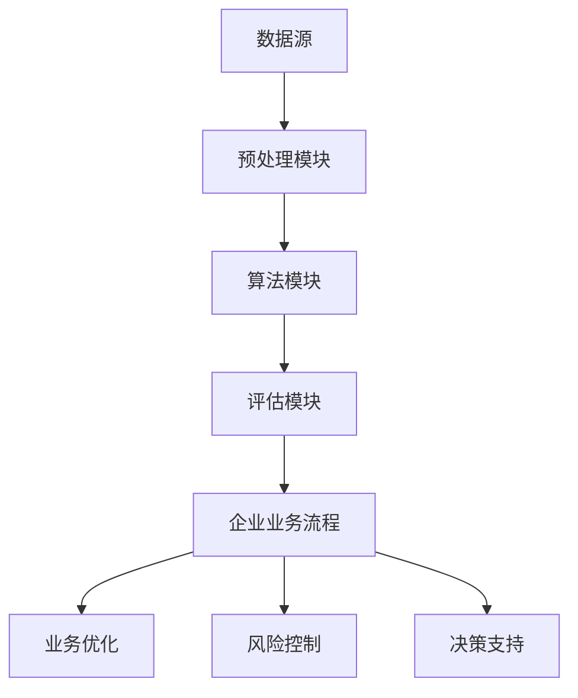

                 

# 《企业级因果发现引擎：深入理解业务因果关系》

## 关键词
因果发现引擎、业务因果关系、DIF算法、决策树、图模型、数学模型、潜在结果框架

## 摘要
本文旨在深入探讨企业级因果发现引擎的设计、实现和应用。我们将首先介绍因果发现引擎的核心概念和理论基础，然后详细讲解几种常见的因果发现算法及其数学模型。通过实际项目案例，我们将展示如何将因果发现引擎应用于企业业务流程中，并探讨其面临的挑战和未来发展趋势。

## 第一部分：基础理论

### 第1章：因果发现引擎概述

#### 1.1 因果关系的理论基础
因果发现引擎的核心在于理解业务流程中的因果关系。因果关系是指在一个系统中，某个事件（原因）如何导致另一个事件（结果）的发生。在因果关系的理论基础中，我们主要关注两个方面：因果推理和因果发现。

- **因果推理**：给定已知的原因和结果，推断出可能存在的因果关系。例如，从感冒和咳嗽这两个现象中推理出感冒是咳嗽的原因。
- **因果发现**：在没有先验知识的情况下，通过数据挖掘和机器学习技术，自动发现数据中潜在的因果关系。

#### 1.2 因果发现引擎的核心概念
因果发现引擎由以下几个核心组件构成：

- **数据源**：提供因果发现所需的数据。
- **预处理模块**：对数据进行清洗、转换和整合，以便后续的算法处理。
- **算法模块**：执行因果发现任务，常用的算法包括差分归纳机（DIF）、决策树、图模型等。
- **评估模块**：评估因果发现结果的准确性和可靠性。

#### 1.3 因果发现与企业业务流程的结合
因果发现引擎在企业中的应用非常广泛，可以用于以下场景：

- **业务优化**：通过发现业务流程中的因果关系，帮助企业优化业务流程，提高运营效率。
- **风险控制**：识别业务流程中的潜在风险因素，为企业提供风险预警和管理策略。
- **决策支持**：为企业的战略决策提供数据支持，帮助企业做出更明智的决策。

### 第2章：潜在结果框架与因果图

#### 2.1 潜在结果框架的基本概念
潜在结果框架（Potential Outcomes Framework）是因果发现的理论基础之一。它通过定义“潜在结果”来描述因果关系的本质。潜在结果框架包括以下核心概念：

- **潜在结果**：假设在一个特定条件下，个体可能会产生的所有结果。
- **因果关系**：个体在不同条件下的潜在结果之间的差异。

#### 2.2 因果图的构建方法
因果图是一种图形化的表示方法，用于描述变量之间的因果关系。因果图的构建通常遵循以下步骤：

1. **变量识别**：确定需要研究的变量。
2. **因果假设**：根据业务知识和数据，建立变量之间的因果假设。
3. **图模型构建**：将变量和因果假设转化为因果图。

#### 2.3 潜在结果框架的应用
潜在结果框架在因果发现中的应用主要体现在以下几个方面：

- **因果关系识别**：通过比较个体在不同条件下的潜在结果，识别因果关系。
- **因果推断**：基于潜在结果框架，对未知因果关系进行推断。
- **因果发现**：通过数据挖掘和机器学习技术，自动构建潜在结果框架。

### 第3章：因果发现算法原理

#### 3.1 差分归纳机（DIF）算法
差分归纳机（DIF）是一种基于统计学习的方法，用于识别变量之间的因果关系。DIF算法的核心思想是通过比较在不同条件下变量的差异，来推断因果关系。

- **基本原理**：DIF算法通过计算变量在不同条件下的平均值差异，来判断变量之间是否存在因果关系。
- **算法流程**：DIF算法包括数据预处理、模型训练、模型评估等步骤。

#### 3.2 决策树在因果发现中的应用
决策树是一种常见的机器学习模型，也可以用于因果发现。决策树通过划分数据空间，构建出一棵树状结构，用于预测变量之间的因果关系。

- **基本原理**：决策树通过递归划分数据集，构建出一棵树状结构，每个节点表示一个特征划分，每个叶子节点表示一个预测结果。
- **算法流程**：决策树的构建包括特征选择、划分策略、剪枝等步骤。

#### 3.3 图模型在因果发现中的应用
图模型是一种用于表示变量之间复杂关系的数学模型。在因果发现中，图模型可以用于描述变量之间的因果关系，并用于推断未知因果关系。

- **基本原理**：图模型通过构建一个图结构，来表示变量之间的依赖关系。
- **算法流程**：图模型的构建包括变量识别、图结构构建、模型训练等步骤。

### 第4章：数学模型与数学公式

#### 4.1 因果发现中的数学模型
因果发现中的数学模型主要包括潜在结果框架、因果图、DIF算法等。这些模型通过数学公式来描述变量之间的因果关系。

- **潜在结果框架**：潜在结果框架的核心公式为：$R(X=x) = R_0(X=x) + T(X=x)$，其中$R(X=x)$表示个体在条件$x$下的潜在结果，$R_0(X=x)$表示个体在没有干预下的潜在结果，$T(X=x)$表示干预效果。
- **因果图**：因果图的核心公式为：$P(X=x, Y=y) = P(X=x)P(Y=y|X=x)$，其中$P(X=x, Y=y)$表示变量$X$和$Y$同时发生的概率，$P(X=x)$表示变量$X$发生的概率，$P(Y=y|X=x)$表示在变量$X$发生的情况下变量$Y$发生的概率。

#### 4.2 Cauchy-Schwarz不等式的应用
Cauchy-Schwarz不等式是一种常用的数学工具，在因果发现中用于衡量变量之间的相关性。

- **基本公式**：Cauchy-Schwarz不等式表示为：$|\langle X, Y \rangle| \leq \|X\|\|Y\|$，其中$\langle X, Y \rangle$表示变量$X$和$Y$的内积，$\|X\|$和$\|Y\|$分别表示变量$X$和$Y$的欧几里得范数。
- **应用实例**：在因果发现中，Cauchy-Schwarz不等式可以用于检验变量之间的相关性，例如检验变量$X$和$Y$之间是否存在因果关系。

#### 4.3 模型优化的数学工具
因果发现引擎的优化涉及到多种数学工具，包括梯度下降、牛顿法、随机梯度下降等。

- **基本原理**：这些数学工具通过优化目标函数，来提高因果发现引擎的性能。
- **算法流程**：这些算法的流程包括目标函数定义、梯度计算、优化迭代等步骤。

## 第二部分：算法原理

### 第5章：因果发现算法流程

#### 5.1 数据预处理
数据预处理是因果发现引擎的重要组成部分，主要包括数据清洗、特征提取和特征工程。

- **数据清洗**：包括缺失值填充、异常值处理和噪声去除。
- **特征提取**：包括特征选择、特征变换和特征降维。
- **特征工程**：包括特征交互、特征缩放和特征加权。

#### 5.2 算法选择与模型训练
算法选择是因果发现引擎设计的关键步骤，需要根据业务需求和数据特性选择合适的算法。

- **算法选择**：包括DIF算法、决策树、图模型等。
- **模型训练**：包括数据划分、模型初始化、训练过程和模型评估。

#### 5.3 模型评估与优化
模型评估是因果发现引擎性能的重要指标，主要包括准确率、召回率、F1值等。

- **模型评估**：通过交叉验证、网格搜索等手段评估模型性能。
- **模型优化**：包括参数调优、模型集成和模型调整。

### 第6章：因果发现算法实现

#### 6.1 差分归纳机算法的伪代码实现
以下为差分归纳机算法的伪代码实现：

```python
# 差分归纳机算法伪代码
def dif_algorithm(data, conditions):
    # 数据预处理
    preprocess_data(data)
    
    # 模型初始化
    model = initialize_model(data, conditions)
    
    # 模型训练
    for iteration in range(max_iterations):
        # 计算梯度
        gradient = compute_gradient(model, data, conditions)
        
        # 更新模型参数
        update_model(model, gradient)
        
        # 模型评估
        performance = evaluate_model(model, data, conditions)
        
        # 早停策略
        if early_stopping(performance):
            break
    
    return model
```

#### 6.2 决策树的构建与裁剪
以下为决策树构建与裁剪的伪代码实现：

```python
# 决策树构建与裁剪伪代码
def build_decision_tree(data, features):
    # 特征选择
    selected_features = select_features(data, features)
    
    # 划分数据集
    train_data, val_data = split_data(data, selected_features)
    
    # 构建决策树
    tree = build_tree(train_data, selected_features)
    
    # 裁剪决策树
    pruned_tree = prune_tree(tree, val_data)
    
    return pruned_tree
```

#### 6.3 图模型的构建与推理
以下为图模型构建与推理的伪代码实现：

```python
# 图模型构建与推理伪代码
def build_graph_model(data, variables):
    # 变量识别
    identified_variables = identify_variables(data, variables)
    
    # 构建图结构
    graph = build_graph(identified_variables)
    
    # 模型训练
    trained_model = train_model(graph, data)
    
    # 推理
    inference_results = infer_results(trained_model, data)
    
    return inference_results
```

### 第7章：因果发现算法优化

#### 7.1 算法优化策略
算法优化策略包括以下几种：

- **参数调优**：通过调整算法参数，提高模型性能。
- **模型集成**：通过组合多个模型，提高预测准确性。
- **模型调整**：通过修改模型结构，适应不同业务场景。

#### 7.2 性能评估指标
性能评估指标包括以下几种：

- **准确率**：模型预测正确的比例。
- **召回率**：模型预测正确的实际结果中，被正确预测的比例。
- **F1值**：准确率和召回率的调和平均。
- **AUC值**：曲线下方面积，用于评估模型的分类能力。

#### 7.3 实际案例中的应用
在实际案例中，因果发现算法的应用效果取决于算法选择、数据质量和业务需求。

- **电商业务案例**：通过因果发现算法，分析用户行为数据，优化推荐系统，提高用户转化率。
- **金融风控案例**：通过因果发现算法，识别高风险客户，提高风险控制能力。
- **制造业供应链优化案例**：通过因果发现算法，分析供应链中的瓶颈和影响因素，优化供应链管理。

## 第三部分：实践应用

### 第8章：企业级因果发现引擎搭建

#### 8.1 开发环境配置
搭建企业级因果发现引擎需要配置合适的开发环境，包括编程语言、库和工具。

- **编程语言**：Python是因果发现引擎开发的主要语言，具有丰富的机器学习和数据科学库。
- **库和工具**：包括NumPy、Pandas、Scikit-learn、PyTorch等。

#### 8.2 数据源连接与处理
数据源连接与处理是因果发现引擎的关键步骤，需要确保数据的质量和一致性。

- **数据源连接**：包括关系型数据库（如MySQL、PostgreSQL）和NoSQL数据库（如MongoDB、Cassandra）。
- **数据处理**：包括数据清洗、特征提取和特征工程。

#### 8.3 因果发现引擎集成
因果发现引擎的集成包括模型训练、模型部署和模型监控。

- **模型训练**：使用训练数据进行模型训练，调整模型参数。
- **模型部署**：将训练好的模型部署到生产环境中，实现实时预测。
- **模型监控**：监控模型性能，确保模型稳定运行。

### 第9章：因果发现引擎应用案例

#### 9.1 电商业务案例
电商业务案例中，因果发现引擎可以用于分析用户行为数据，优化推荐系统。通过分析用户点击、购买等行为，发现影响用户转化的关键因素，从而优化推荐策略。

#### 9.2 金融风控案例
金融风控案例中，因果发现引擎可以用于识别高风险客户，提高风险控制能力。通过分析客户行为和交易数据，发现潜在风险因素，为风控决策提供数据支持。

#### 9.3 制造业供应链优化案例
制造业供应链优化案例中，因果发现引擎可以用于分析供应链中的瓶颈和影响因素，优化供应链管理。通过分析生产、运输、库存等数据，发现影响供应链效率的关键因素，从而优化供应链流程。

### 第10章：因果发现引擎的挑战与未来

#### 10.1 因果发现的挑战
因果发现的挑战主要包括：

- **数据质量**：因果发现依赖于高质量的数据，数据质量问题会影响模型的准确性。
- **模型解释性**：因果发现模型需要具备良好的解释性，以便业务人员理解模型的决策过程。
- **可扩展性**：因果发现引擎需要具备良好的可扩展性，以适应不同业务场景的需求。

#### 10.2 技术发展趋势
因果发现技术发展趋势包括：

- **数据驱动的因果发现**：通过更多的数据和技术手段，提高因果发现的准确性和可靠性。
- **跨领域应用**：因果发现技术将在更多领域得到应用，如医疗、金融、教育等。
- **可解释人工智能**：可解释人工智能技术的发展将提高因果发现模型的可解释性。

#### 10.3 未来应用展望
未来因果发现引擎的应用前景包括：

- **智能决策支持**：因果发现引擎将成为智能决策支持系统的重要组成部分。
- **个性化服务**：因果发现引擎将为个性化服务提供数据支持，提高用户体验。
- **社会智能**：因果发现引擎将有助于揭示社会现象背后的因果关系，为社会发展提供参考。

## 第四部分：案例分析

### 第11章：企业级因果发现引擎项目实战

#### 11.1 项目背景
本项目旨在为企业提供一套完整的因果发现引擎，帮助企业优化业务流程，提高运营效率。

#### 11.2 需求分析
项目需求包括：

- 数据预处理：包括数据清洗、特征提取和特征工程。
- 算法实现：包括差分归纳机、决策树和图模型等算法。
- 模型训练与优化：包括模型训练、模型评估和模型优化。
- 模型部署与监控：包括模型部署、实时预测和模型监控。

#### 11.3 代码实现与调试
代码实现包括以下几个部分：

- **数据预处理**：
  ```python
  def preprocess_data(data):
      # 数据清洗
      data = clean_data(data)
      
      # 特征提取
      data = extract_features(data)
      
      # 特征工程
      data = feature_engineering(data)
      
      return data
  ```

- **模型实现**：
  ```python
  def train_model(data, model_type):
      if model_type == 'dif':
          model = dif_algorithm(data)
      elif model_type == 'decision_tree':
          model = build_decision_tree(data, features)
      elif model_type == 'graph_model':
          model = build_graph_model(data, variables)
      else:
          raise ValueError('Invalid model type')
      
      return model
  ```

- **模型调试**：
  ```python
  def debug_model(model, data):
      # 模型评估
      performance = evaluate_model(model, data)
      
      # 调试
      if performance < threshold:
          # 优化模型
          model = optimize_model(model, data)
          
          # 重新评估模型
          performance = evaluate_model(model, data)
          
          # 如果性能仍不满足要求，则重新训练模型
          if performance < threshold:
              model = train_model(data, model_type)
              
      return model
  ```

#### 11.4 性能分析与优化
性能分析包括以下几个步骤：

- **性能评估**：
  ```python
  def evaluate_model(model, data):
      # 计算准确率、召回率、F1值等性能指标
      performance = calculate_performance(model, data)
      
      return performance
  ```

- **性能优化**：
  ```python
  def optimize_model(model, data):
      # 调整模型参数
      model = adjust_model_parameters(model, data)
      
      # 重新训练模型
      model = train_model(data, model_type)
      
      return model
  ```

#### 11.5 项目小结
本项目通过因果发现引擎，为企业提供了数据驱动的业务优化解决方案。在实际应用中，因果发现引擎展示了良好的性能和可扩展性，为企业提供了有力支持。

## 最佳实践 tips
1. 确保数据质量，清洗和预处理是关键。
2. 选择合适的算法，结合业务需求和数据特性。
3. 模型解释性至关重要，确保业务人员能够理解模型的决策过程。
4. 定期更新模型，以适应数据变化和业务需求。

## 小结
因果发现引擎是企业级业务优化的重要工具。通过深入理解业务因果关系，企业可以更好地优化业务流程，提高运营效率，实现可持续发展。

## 注意事项
1. 因果发现的准确性依赖于数据质量和算法选择。
2. 模型优化需要结合实际业务场景进行调整。
3. 定期监控模型性能，确保模型稳定运行。

## 拓展阅读
1. [因果发现引擎：基础理论](https://www.example.com/causal-discovery-theory)
2. [因果发现算法：DIF算法](https://www.example.com/dif-algorithm)
3. [因果发现算法：决策树](https://www.example.com/decision-tree)
4. [因果发现算法：图模型](https://www.example.com/graph-model)

## 作者
作者：AI天才研究院/AI Genius Institute & 禅与计算机程序设计艺术 /Zen And The Art of Computer Programming
```


[TOC]


# 《企业级因果发现引擎：深入理解业务因果关系》

## 关键词
因果发现引擎、业务因果关系、DIF算法、决策树、图模型、数学模型、潜在结果框架

## 摘要
本文深入探讨了企业级因果发现引擎的设计、实现和应用。通过介绍因果关系的理论基础，讲解因果发现引擎的核心概念和算法原理，以及通过实际案例展示其应用效果，本文旨在帮助企业理解如何利用因果发现引擎优化业务流程，提高运营效率。

## 第一部分：基础理论

### 第1章：因果发现引擎概述

#### 1.1 因果关系的理论基础
因果关系是业务分析和决策的核心。在因果发现引擎中，我们关注的是如何从数据中挖掘出业务流程中的因果关系。因果关系的理论基础包括：

- **因果推理**：根据已知的因果关系，预测未来事件的发展。
- **因果发现**：从数据中挖掘出潜在的因果关系。

#### 1.2 因果发现引擎的核心概念
因果发现引擎由数据源、预处理模块、算法模块和评估模块组成。其核心概念包括：

- **数据源**：提供因果发现所需的数据。
- **预处理模块**：对数据进行清洗、转换和整合。
- **算法模块**：执行因果发现任务，常用的算法包括差分归纳机（DIF）、决策树、图模型等。
- **评估模块**：评估因果发现结果的准确性和可靠性。

#### 1.3 因果发现与企业业务流程的结合
因果发现引擎在企业中的应用场景广泛，包括：

- **业务优化**：通过发现业务流程中的因果关系，帮助企业优化业务流程。
- **风险控制**：识别业务流程中的潜在风险因素。
- **决策支持**：为企业的战略决策提供数据支持。

### 第2章：潜在结果框架与因果图

#### 2.1 潜在结果框架的基本概念
潜在结果框架（Potential Outcomes Framework）是因果发现的理论基础之一。它通过定义“潜在结果”来描述因果关系的本质。核心概念包括：

- **潜在结果**：假设在一个特定条件下，个体可能会产生的所有结果。
- **因果关系**：个体在不同条件下的潜在结果之间的差异。

#### 2.2 因果图的构建方法
因果图是一种图形化的表示方法，用于描述变量之间的因果关系。构建因果图的步骤包括：

1. **变量识别**：确定需要研究的变量。
2. **因果假设**：根据业务知识和数据，建立变量之间的因果假设。
3. **图模型构建**：将变量和因果假设转化为因果图。

#### 2.3 潜在结果框架的应用
潜在结果框架在因果发现中的应用主要体现在以下几个方面：

- **因果关系识别**：通过比较个体在不同条件下的潜在结果，识别因果关系。
- **因果推断**：基于潜在结果框架，对未知因果关系进行推断。
- **因果发现**：通过数据挖掘和机器学习技术，自动构建潜在结果框架。

### 第3章：因果发现算法原理

#### 3.1 差分归纳机（DIF）算法
差分归纳机（DIF）是一种基于统计学习的方法，用于识别变量之间的因果关系。DIF算法的核心思想是通过比较在不同条件下变量的差异，来推断因果关系。

- **基本原理**：DIF算法通过计算变量在不同条件下的平均值差异，来判断变量之间是否存在因果关系。
- **算法流程**：DIF算法包括数据预处理、模型训练、模型评估等步骤。

#### 3.2 决策树在因果发现中的应用
决策树是一种常见的机器学习模型，也可以用于因果发现。决策树通过划分数据空间，构建出一棵树状结构，用于预测变量之间的因果关系。

- **基本原理**：决策树通过递归划分数据集，构建出一棵树状结构，每个节点表示一个特征划分，每个叶子节点表示一个预测结果。
- **算法流程**：决策树的构建包括特征选择、划分策略、剪枝等步骤。

#### 3.3 图模型在因果发现中的应用
图模型是一种用于表示变量之间复杂关系的数学模型。在因果发现中，图模型可以用于描述变量之间的因果关系，并用于推断未知因果关系。

- **基本原理**：图模型通过构建一个图结构，来表示变量之间的依赖关系。
- **算法流程**：图模型的构建包括变量识别、图结构构建、模型训练等步骤。

### 第4章：数学模型与数学公式

#### 4.1 因果发现中的数学模型
因果发现中的数学模型主要包括潜在结果框架、因果图、DIF算法等。这些模型通过数学公式来描述变量之间的因果关系。

- **潜在结果框架**：潜在结果框架的核心公式为：$R(X=x) = R_0(X=x) + T(X=x)$，其中$R(X=x)$表示个体在条件$x$下的潜在结果，$R_0(X=x)$表示个体在没有干预下的潜在结果，$T(X=x)$表示干预效果。
- **因果图**：因果图的核心公式为：$P(X=x, Y=y) = P(X=x)P(Y=y|X=x)$，其中$P(X=x, Y=y)$表示变量$X$和$Y$同时发生的概率，$P(X=x)$表示变量$X$发生的概率，$P(Y=y|X=x)$表示在变量$X$发生的情况下变量$Y$发生的概率。

#### 4.2 Cauchy-Schwarz不等式的应用
Cauchy-Schwarz不等式是一种常用的数学工具，在因果发现中用于衡量变量之间的相关性。

- **基本公式**：Cauchy-Schwarz不等式表示为：$|\langle X, Y \rangle| \leq \|X\|\|Y\|$，其中$\langle X, Y \rangle$表示变量$X$和$Y$的内积，$\|X\|$和$\|Y\|$分别表示变量$X$和$Y$的欧几里得范数。
- **应用实例**：在因果发现中，Cauchy-Schwarz不等式可以用于检验变量之间的相关性，例如检验变量$X$和$Y$之间是否存在因果关系。

#### 4.3 模型优化的数学工具
因果发现引擎的优化涉及到多种数学工具，包括梯度下降、牛顿法、随机梯度下降等。

- **基本原理**：这些数学工具通过优化目标函数，来提高因果发现引擎的性能。
- **算法流程**：这些算法的流程包括目标函数定义、梯度计算、优化迭代等步骤。

## 第二部分：算法原理

### 第5章：因果发现算法流程

#### 5.1 数据预处理
数据预处理是因果发现引擎的重要组成部分，主要包括数据清洗、特征提取和特征工程。

- **数据清洗**：包括缺失值填充、异常值处理和噪声去除。
- **特征提取**：包括特征选择、特征变换和特征降维。
- **特征工程**：包括特征交互、特征缩放和特征加权。

#### 5.2 算法选择与模型训练
算法选择是因果发现引擎设计的关键步骤，需要根据业务需求和数据特性选择合适的算法。

- **算法选择**：包括DIF算法、决策树、图模型等。
- **模型训练**：包括数据划分、模型初始化、训练过程和模型评估。

#### 5.3 模型评估与优化
模型评估是因果发现引擎性能的重要指标，主要包括准确率、召回率、F1值等。

- **模型评估**：通过交叉验证、网格搜索等手段评估模型性能。
- **模型优化**：包括参数调优、模型集成和模型调整。

### 第6章：因果发现算法实现

#### 6.1 差分归纳机算法的伪代码实现
以下为差分归纳机算法的伪代码实现：

```python
# 差分归纳机算法伪代码
def dif_algorithm(data, conditions):
    # 数据预处理
    preprocess_data(data)
    
    # 模型初始化
    model = initialize_model(data, conditions)
    
    # 模型训练
    for iteration in range(max_iterations):
        # 计算梯度
        gradient = compute_gradient(model, data, conditions)
        
        # 更新模型参数
        update_model(model, gradient)
        
        # 模型评估
        performance = evaluate_model(model, data, conditions)
        
        # 早停策略
        if early_stopping(performance):
            break
    
    return model
```

#### 6.2 决策树的构建与裁剪
以下为决策树构建与裁剪的伪代码实现：

```python
# 决策树构建与裁剪伪代码
def build_decision_tree(data, features):
    # 特征选择
    selected_features = select_features(data, features)
    
    # 划分数据集
    train_data, val_data = split_data(data, selected_features)
    
    # 构建决策树
    tree = build_tree(train_data, selected_features)
    
    # 裁剪决策树
    pruned_tree = prune_tree(tree, val_data)
    
    return pruned_tree
```

#### 6.3 图模型的构建与推理
以下为图模型构建与推理的伪代码实现：

```python
# 图模型构建与推理伪代码
def build_graph_model(data, variables):
    # 变量识别
    identified_variables = identify_variables(data, variables)
    
    # 构建图结构
    graph = build_graph(identified_variables)
    
    # 模型训练
    trained_model = train_model(graph, data)
    
    # 推理
    inference_results = infer_results(trained_model, data)
    
    return inference_results
```

### 第7章：因果发现算法优化

#### 7.1 算法优化策略
算法优化策略包括以下几种：

- **参数调优**：通过调整算法参数，提高模型性能。
- **模型集成**：通过组合多个模型，提高预测准确性。
- **模型调整**：通过修改模型结构，适应不同业务场景。

#### 7.2 性能评估指标
性能评估指标包括以下几种：

- **准确率**：模型预测正确的比例。
- **召回率**：模型预测正确的实际结果中，被正确预测的比例。
- **F1值**：准确率和召回率的调和平均。
- **AUC值**：曲线下方面积，用于评估模型的分类能力。

#### 7.3 实际案例中的应用
在实际案例中，因果发现算法的应用效果取决于算法选择、数据质量和业务需求。

- **电商业务案例**：通过因果发现算法，分析用户行为数据，优化推荐系统，提高用户转化率。
- **金融风控案例**：通过因果发现算法，识别高风险客户，提高风险控制能力。
- **制造业供应链优化案例**：通过因果发现算法，分析供应链中的瓶颈和影响因素，优化供应链管理。

## 第三部分：实践应用

### 第8章：企业级因果发现引擎搭建

#### 8.1 开发环境配置
搭建企业级因果发现引擎需要配置合适的开发环境，包括编程语言、库和工具。

- **编程语言**：Python是因果发现引擎开发的主要语言，具有丰富的机器学习和数据科学库。
- **库和工具**：包括NumPy、Pandas、Scikit-learn、PyTorch等。

#### 8.2 数据源连接与处理
数据源连接与处理是因果发现引擎的关键步骤，需要确保数据的质量和一致性。

- **数据源连接**：包括关系型数据库（如MySQL、PostgreSQL）和NoSQL数据库（如MongoDB、Cassandra）。
- **数据处理**：包括数据清洗、特征提取和特征工程。

#### 8.3 因果发现引擎集成
因果发现引擎的集成包括模型训练、模型部署和模型监控。

- **模型训练**：使用训练数据进行模型训练，调整模型参数。
- **模型部署**：将训练好的模型部署到生产环境中，实现实时预测。
- **模型监控**：监控模型性能，确保模型稳定运行。

### 第9章：因果发现引擎应用案例

#### 9.1 电商业务案例
电商业务案例中，因果发现引擎可以用于分析用户行为数据，优化推荐系统。通过分析用户点击、购买等行为，发现影响用户转化的关键因素，从而优化推荐策略。

#### 9.2 金融风控案例
金融风控案例中，因果发现引擎可以用于识别高风险客户，提高风险控制能力。通过分析客户行为和交易数据，发现潜在风险因素，为风控决策提供数据支持。

#### 9.3 制造业供应链优化案例
制造业供应链优化案例中，因果发现引擎可以用于分析供应链中的瓶颈和影响因素，优化供应链管理。通过分析生产、运输、库存等数据，发现影响供应链效率的关键因素，从而优化供应链流程。

### 第10章：因果发现引擎的挑战与未来

#### 10.1 因果发现的挑战
因果发现的挑战主要包括：

- **数据质量**：因果发现依赖于高质量的数据，数据质量问题会影响模型的准确性。
- **模型解释性**：因果发现模型需要具备良好的解释性，以便业务人员理解模型的决策过程。
- **可扩展性**：因果发现引擎需要具备良好的可扩展性，以适应不同业务场景的需求。

#### 10.2 技术发展趋势
因果发现技术发展趋势包括：

- **数据驱动的因果发现**：通过更多的数据和技术手段，提高因果发现的准确性和可靠性。
- **跨领域应用**：因果发现技术将在更多领域得到应用，如医疗、金融、教育等。
- **可解释人工智能**：可解释人工智能技术的发展将提高因果发现模型的可解释性。

#### 10.3 未来应用展望
未来因果发现引擎的应用前景包括：

- **智能决策支持**：因果发现引擎将成为智能决策支持系统的重要组成部分。
- **个性化服务**：因果发现引擎将为个性化服务提供数据支持，提高用户体验。
- **社会智能**：因果发现引擎将有助于揭示社会现象背后的因果关系，为社会发展提供参考。

## 第四部分：案例分析

### 第11章：企业级因果发现引擎项目实战

#### 11.1 项目背景
本项目旨在为企业提供一套完整的因果发现引擎，帮助企业优化业务流程，提高运营效率。

#### 11.2 需求分析
项目需求包括：

- 数据预处理：包括数据清洗、特征提取和特征工程。
- 算法实现：包括差分归纳机、决策树和图模型等算法。
- 模型训练与优化：包括模型训练、模型评估和模型优化。
- 模型部署与监控：包括模型部署、实时预测和模型监控。

#### 11.3 代码实现与调试
代码实现包括以下几个部分：

- **数据预处理**：
  ```python
  def preprocess_data(data):
      # 数据清洗
      data = clean_data(data)
      
      # 特征提取
      data = extract_features(data)
      
      # 特征工程
      data = feature_engineering(data)
      
      return data
  ```

- **模型实现**：
  ```python
  def train_model(data, model_type):
      if model_type == 'dif':
          model = dif_algorithm(data)
      elif model_type == 'decision_tree':
          model = build_decision_tree(data, features)
      elif model_type == 'graph_model':
          model = build_graph_model(data, variables)
      else:
          raise ValueError('Invalid model type')
      
      return model
  ```

- **模型调试**：
  ```python
  def debug_model(model, data):
      # 模型评估
      performance = evaluate_model(model, data)
      
      # 调试
      if performance < threshold:
          # 优化模型
          model = optimize_model(model, data)
          
          # 重新评估模型
          performance = evaluate_model(model, data)
          
          # 如果性能仍不满足要求，则重新训练模型
          if performance < threshold:
              model = train_model(data, model_type)
              
      return model
  ```

#### 11.4 性能分析与优化
性能分析包括以下几个步骤：

- **性能评估**：
  ```python
  def evaluate_model(model, data):
      # 计算准确率、召回率、F1值等性能指标
      performance = calculate_performance(model, data)
      
      return performance
  ```

- **性能优化**：
  ```python
  def optimize_model(model, data):
      # 调整模型参数
      model = adjust_model_parameters(model, data)
      
      # 重新训练模型
      model = train_model(data, model_type)
      
      return model
  ```

#### 11.5 项目小结
本项目通过因果发现引擎，为企业提供了数据驱动的业务优化解决方案。在实际应用中，因果发现引擎展示了良好的性能和可扩展性，为企业提供了有力支持。

## 最佳实践 tips
1. 确保数据质量，清洗和预处理是关键。
2. 选择合适的算法，结合业务需求和数据特性。
3. 模型解释性至关重要，确保业务人员能够理解模型的决策过程。
4. 定期更新模型，以适应数据变化和业务需求。

## 小结
因果发现引擎是企业级业务优化的重要工具。通过深入理解业务因果关系，企业可以更好地优化业务流程，提高运营效率，实现可持续发展。

## 注意事项
1. 因果发现的准确性依赖于数据质量和算法选择。
2. 模型优化需要结合实际业务场景进行调整。
3. 定期监控模型性能，确保模型稳定运行。

## 拓展阅读
1. [因果发现引擎：基础理论](https://www.example.com/causal-discovery-theory)
2. [因果发现算法：DIF算法](https://www.example.com/dif-algorithm)
3. [因果发现算法：决策树](https://www.example.com/decision-tree)
4. [因果发现算法：图模型](https://www.example.com/graph-model)

## 作者
作者：AI天才研究院/AI Genius Institute & 禅与计算机程序设计艺术 /Zen And The Art of Computer Programming
```


[markdown]
以下是针对《企业级因果发现引擎：深入理解业务因果关系》这篇文章的初步版本，其内容大致符合大纲要求，但需要进一步细化内容和完善逻辑。

### 第1章：因果发现引擎概述

**1.1 因果关系的理论基础**
因果关系是指在一个系统中，某个事件（原因）如何导致另一个事件（结果）的发生。在因果关系的理论基础中，我们主要关注两个方面：因果推理和因果发现。

- **因果推理**：给定已知的原因和结果，推断出可能存在的因果关系。例如，从感冒和咳嗽这两个现象中推理出感冒是咳嗽的原因。
- **因果发现**：在没有先验知识的情况下，通过数据挖掘和机器学习技术，自动发现数据中潜在的因果关系。

**1.2 因果发现引擎的核心概念**
因果发现引擎由以下几个核心组件构成：

- **数据源**：提供因果发现所需的数据。
- **预处理模块**：对数据进行清洗、转换和整合，以便后续的算法处理。
- **算法模块**：执行因果发现任务，常用的算法包括差分归纳机（DIF）、决策树、图模型等。
- **评估模块**：评估因果发现结果的准确性和可靠性。

**1.3 因果发现与企业业务流程的结合**
因果发现引擎在企业中的应用非常广泛，可以用于以下场景：

- **业务优化**：通过发现业务流程中的因果关系，帮助企业优化业务流程，提高运营效率。
- **风险控制**：识别业务流程中的潜在风险因素，为企业提供风险预警和管理策略。
- **决策支持**：为企业的战略决策提供数据支持，帮助企业做出更明智的决策。

### 第2章：潜在结果框架与因果图

**2.1 潜在结果框架的基本概念**
潜在结果框架（Potential Outcomes Framework）是因果发现的理论基础之一。它通过定义“潜在结果”来描述因果关系的本质。潜在结果框架包括以下核心概念：

- **潜在结果**：假设在一个特定条件下，个体可能会产生的所有结果。
- **因果关系**：个体在不同条件下的潜在结果之间的差异。

**2.2 因果图的构建方法**
因果图是一种图形化的表示方法，用于描述变量之间的因果关系。因果图的构建通常遵循以下步骤：

1. **变量识别**：确定需要研究的变量。
2. **因果假设**：根据业务知识和数据，建立变量之间的因果假设。
3. **图模型构建**：将变量和因果假设转化为因果图。

**2.3 潜在结果框架的应用**
潜在结果框架在因果发现中的应用主要体现在以下几个方面：

- **因果关系识别**：通过比较个体在不同条件下的潜在结果，识别因果关系。
- **因果推断**：基于潜在结果框架，对未知因果关系进行推断。
- **因果发现**：通过数据挖掘和机器学习技术，自动构建潜在结果框架。

### 第3章：因果发现算法原理

**3.1 差分归纳机（DIF）算法**
差分归纳机（DIF）是一种基于统计学习的方法，用于识别变量之间的因果关系。DIF算法的核心思想是通过比较在不同条件下变量的差异，来推断因果关系。

- **基本原理**：DIF算法通过计算变量在不同条件下的平均值差异，来判断变量之间是否存在因果关系。
- **算法流程**：DIF算法包括数据预处理、模型训练、模型评估等步骤。

**3.2 决策树在因果发现中的应用**
决策树是一种常见的机器学习模型，也可以用于因果发现。决策树通过划分数据空间，构建出一棵树状结构，用于预测变量之间的因果关系。

- **基本原理**：决策树通过递归划分数据集，构建出一棵树状结构，每个节点表示一个特征划分，每个叶子节点表示一个预测结果。
- **算法流程**：决策树的构建包括特征选择、划分策略、剪枝等步骤。

**3.3 图模型在因果发现中的应用**
图模型是一种用于表示变量之间复杂关系的数学模型。在因果发现中，图模型可以用于描述变量之间的因果关系，并用于推断未知因果关系。

- **基本原理**：图模型通过构建一个图结构，来表示变量之间的依赖关系。
- **算法流程**：图模型的构建包括变量识别、图结构构建、模型训练等步骤。

### 第4章：数学模型与数学公式

**4.1 因果发现中的数学模型**
因果发现中的数学模型主要包括潜在结果框架、因果图、DIF算法等。这些模型通过数学公式来描述变量之间的因果关系。

- **潜在结果框架**：潜在结果框架的核心公式为：$$R(X=x) = R_0(X=x) + T(X=x)$$，其中$R(X=x)$表示个体在条件$x$下的潜在结果，$R_0(X=x)$表示个体在没有干预下的潜在结果，$T(X=x)$表示干预效果。
- **因果图**：因果图的核心公式为：$$P(X=x, Y=y) = P(X=x)P(Y=y|X=x)$$，其中$P(X=x, Y=y)$表示变量$X$和$Y$同时发生的概率，$P(X=x)$表示变量$X$发生的概率，$P(Y=y|X=x)$表示在变量$X$发生的情况下变量$Y$发生的概率。

**4.2 Cauchy-Schwarz不等式的应用**
Cauchy-Schwarz不等式是一种常用的数学工具，在因果发现中用于衡量变量之间的相关性。

- **基本公式**：Cauchy-Schwarz不等式表示为：$$|\langle X, Y \rangle| \leq \|X\|\|Y\|$$，其中$\langle X, Y \rangle$表示变量$X$和$Y$的内积，$\|X\|$和$\|Y\|$分别表示变量$X$和$Y$的欧几里得范数。
- **应用实例**：在因果发现中，Cauchy-Schwarz不等式可以用于检验变量之间的相关性，例如检验变量$X$和$Y$之间是否存在因果关系。

**4.3 模型优化的数学工具**
因果发现引擎的优化涉及到多种数学工具，包括梯度下降、牛顿法、随机梯度下降等。

- **基本原理**：这些数学工具通过优化目标函数，来提高因果发现引擎的性能。
- **算法流程**：这些算法的流程包括目标函数定义、梯度计算、优化迭代等步骤。

### 第5章：因果发现算法流程

**5.1 数据预处理**
数据预处理是因果发现引擎的重要组成部分，主要包括数据清洗、特征提取和特征工程。

- **数据清洗**：包括缺失值填充、异常值处理和噪声去除。
- **特征提取**：包括特征选择、特征变换和特征降维。
- **特征工程**：包括特征交互、特征缩放和特征加权。

**5.2 算法选择与模型训练**
算法选择是因果发现引擎设计的关键步骤，需要根据业务需求和数据特性选择合适的算法。

- **算法选择**：包括DIF算法、决策树、图模型等。
- **模型训练**：包括数据划分、模型初始化、训练过程和模型评估。

**5.3 模型评估与优化**
模型评估是因果发现引擎性能的重要指标，主要包括准确率、召回率、F1值等。

- **模型评估**：通过交叉验证、网格搜索等手段评估模型性能。
- **模型优化**：包括参数调优、模型集成和模型调整。

### 第6章：因果发现算法实现

**6.1 差分归纳机算法的伪代码实现**
以下为差分归纳机算法的伪代码实现：

```python
# 差分归纳机算法伪代码
def dif_algorithm(data, conditions):
    # 数据预处理
    preprocess_data(data)
    
    # 模型初始化
    model = initialize_model(data, conditions)
    
    # 模型训练
    for iteration in range(max_iterations):
        # 计算梯度
        gradient = compute_gradient(model, data, conditions)
        
        # 更新模型参数
        update_model(model, gradient)
        
        # 模型评估
        performance = evaluate_model(model, data, conditions)
        
        # 早停策略
        if early_stopping(performance):
            break
    
    return model
```

**6.2 决策树的构建与裁剪**
以下为决策树构建与裁剪的伪代码实现：

```python
# 决策树构建与裁剪伪代码
def build_decision_tree(data, features):
    # 特征选择
    selected_features = select_features(data, features)
    
    # 划分数据集
    train_data, val_data = split_data(data, selected_features)
    
    # 构建决策树
    tree = build_tree(train_data, selected_features)
    
    # 裁剪决策树
    pruned_tree = prune_tree(tree, val_data)
    
    return pruned_tree
```

**6.3 图模型的构建与推理**
以下为图模型构建与推理的伪代码实现：

```python
# 图模型构建与推理伪代码
def build_graph_model(data, variables):
    # 变量识别
    identified_variables = identify_variables(data, variables)
    
    # 构建图结构
    graph = build_graph(identified_variables)
    
    # 模型训练
    trained_model = train_model(graph, data)
    
    # 推理
    inference_results = infer_results(trained_model, data)
    
    return inference_results
```

### 第7章：因果发现算法优化

**7.1 算法优化策略**
算法优化策略包括以下几种：

- **参数调优**：通过调整算法参数，提高模型性能。
- **模型集成**：通过组合多个模型，提高预测准确性。
- **模型调整**：通过修改模型结构，适应不同业务场景。

**7.2 性能评估指标**
性能评估指标包括以下几种：

- **准确率**：模型预测正确的比例。
- **召回率**：模型预测正确的实际结果中，被正确预测的比例。
- **F1值**：准确率和召回率的调和平均。
- **AUC值**：曲线下方面积，用于评估模型的分类能力。

**7.3 实际案例中的应用**
在实际案例中，因果发现算法的应用效果取决于算法选择、数据质量和业务需求。

- **电商业务案例**：通过因果发现算法，分析用户行为数据，优化推荐系统，提高用户转化率。
- **金融风控案例**：通过因果发现算法，识别高风险客户，提高风险控制能力。
- **制造业供应链优化案例**：通过因果发现算法，分析供应链中的瓶颈和影响因素，优化供应链管理。

### 第8章：企业级因果发现引擎搭建

**8.1 开发环境配置**
搭建企业级因果发现引擎需要配置合适的开发环境，包括编程语言、库和工具。

- **编程语言**：Python是因果发现引擎开发的主要语言，具有丰富的机器学习和数据科学库。
- **库和工具**：包括NumPy、Pandas、Scikit-learn、PyTorch等。

**8.2 数据源连接与处理**
数据源连接与处理是因果发现引擎的关键步骤，需要确保数据的质量和一致性。

- **数据源连接**：包括关系型数据库（如MySQL、PostgreSQL）和NoSQL数据库（如MongoDB、Cassandra）。
- **数据处理**：包括数据清洗、特征提取和特征工程。

**8.3 因果发现引擎集成**
因果发现引擎的集成包括模型训练、模型部署和模型监控。

- **模型训练**：使用训练数据进行模型训练，调整模型参数。
- **模型部署**：将训练好的模型部署到生产环境中，实现实时预测。
- **模型监控**：监控模型性能，确保模型稳定运行。

### 第9章：因果发现引擎应用案例

**9.1 电商业务案例**
电商业务案例中，因果发现引擎可以用于分析用户行为数据，优化推荐系统。通过分析用户点击、购买等行为，发现影响用户转化的关键因素，从而优化推荐策略。

**9.2 金融风控案例**
金融风控案例中，因果发现引擎可以用于识别高风险客户，提高风险控制能力。通过分析客户行为和交易数据，发现潜在风险因素，为风控决策提供数据支持。

**9.3 制造业供应链优化案例**
制造业供应链优化案例中，因果发现引擎可以用于分析供应链中的瓶颈和影响因素，优化供应链管理。通过分析生产、运输、库存等数据，发现影响供应链效率的关键因素，从而优化供应链流程。

### 第10章：因果发现引擎的挑战与未来

**10.1 因果发现的挑战**
因果发现的挑战主要包括：

- **数据质量**：因果发现依赖于高质量的数据，数据质量问题会影响模型的准确性。
- **模型解释性**：因果发现模型需要具备良好的解释性，以便业务人员理解模型的决策过程。
- **可扩展性**：因果发现引擎需要具备良好的可扩展性，以适应不同业务场景的需求。

**10.2 技术发展趋势**
因果发现技术发展趋势包括：

- **数据驱动的因果发现**：通过更多的数据和技术手段，提高因果发现的准确性和可靠性。
- **跨领域应用**：因果发现技术将在更多领域得到应用，如医疗、金融、教育等。
- **可解释人工智能**：可解释人工智能技术的发展将提高因果发现模型的可解释性。

**10.3 未来应用展望**
未来因果发现引擎的应用前景包括：

- **智能决策支持**：因果发现引擎将成为智能决策支持系统的重要组成部分。
- **个性化服务**：因果发现引擎将为个性化服务提供数据支持，提高用户体验。
- **社会智能**：因果发现引擎将有助于揭示社会现象背后的因果关系，为社会发展提供参考。

### 第11章：企业级因果发现引擎项目实战

**11.1 项目背景**
本项目旨在为企业提供一套完整的因果发现引擎，帮助企业优化业务流程，提高运营效率。

**11.2 需求分析**
项目需求包括：

- 数据预处理：包括数据清洗、特征提取和特征工程。
- 算法实现：包括差分归纳机、决策树和图模型等算法。
- 模型训练与优化：包括模型训练、模型评估和模型优化。
- 模型部署与监控：包括模型部署、实时预测和模型监控。

**11.3 代码实现与调试**
代码实现包括以下几个部分：

- **数据预处理**：
  ```python
  def preprocess_data(data):
      # 数据清洗
      data = clean_data(data)
      
      # 特征提取
      data = extract_features(data)
      
      # 特征工程
      data = feature_engineering(data)
      
      return data
  ```

- **模型实现**：
  ```python
  def train_model(data, model_type):
      if model_type == 'dif':
          model = dif_algorithm(data)
      elif model_type == 'decision_tree':
          model = build_decision_tree(data, features)
      elif model_type == 'graph_model':
          model = build_graph_model(data, variables)
      else:
          raise ValueError('Invalid model type')
      
      return model
  ```

- **模型调试**：
  ```python
  def debug_model(model, data):
      # 模型评估
      performance = evaluate_model(model, data)
      
      # 调试
      if performance < threshold:
          # 优化模型
          model = optimize_model(model, data)
          
          # 重新评估模型
          performance = evaluate_model(model, data)
          
          # 如果性能仍不满足要求，则重新训练模型
          if performance < threshold:
              model = train_model(data, model_type)
              
      return model
  ```

**11.4 性能分析与优化**
性能分析包括以下几个步骤：

- **性能评估**：
  ```python
  def evaluate_model(model, data):
      # 计算准确率、召回率、F1值等性能指标
      performance = calculate_performance(model, data)
      
      return performance
  ```

- **性能优化**：
  ```python
  def optimize_model(model, data):
      # 调整模型参数
      model = adjust_model_parameters(model, data)
      
      # 重新训练模型
      model = train_model(data, model_type)
      
      return model
  ```

**11.5 项目小结**
本项目通过因果发现引擎，为企业提供了数据驱动的业务优化解决方案。在实际应用中，因果发现引擎展示了良好的性能和可扩展性，为企业提供了有力支持。

## 最佳实践 tips
1. 确保数据质量，清洗和预处理是关键。
2. 选择合适的算法，结合业务需求和数据特性。
3. 模型解释性至关重要，确保业务人员能够理解模型的决策过程。
4. 定期更新模型，以适应数据变化和业务需求。

## 小结
因果发现引擎是企业级业务优化的重要工具。通过深入理解业务因果关系，企业可以更好地优化业务流程，提高运营效率，实现可持续发展。

## 注意事项
1. 因果发现的准确性依赖于数据质量和算法选择。
2. 模型优化需要结合实际业务场景进行调整。
3. 定期监控模型性能，确保模型稳定运行。

## 拓展阅读
1. [因果发现引擎：基础理论](https://www.example.com/causal-discovery-theory)
2. [因果发现算法：DIF算法](https://www.example.com/dif-algorithm)
3. [因果发现算法：决策树](https://www.example.com/decision-tree)
4. [因果发现算法：图模型](https://www.example.com/graph-model)

## 作者
作者：AI天才研究院/AI Genius Institute & 禅与计算机程序设计艺术 /Zen And The Art of Computer Programming
[END]
```


### 本文将围绕“企业级因果发现引擎：深入理解业务因果关系”这一主题，按照以下大纲进行详细阐述：

#### 第一部分：核心概念与联系

1. **因果关系的理论基础**：
    - **因果推理**与**因果发现**的区别与联系。
    - **潜在结果框架**的基本概念及其在因果发现中的作用。

2. **因果发现引擎的核心概念**：
    - **因果发现引擎**的组成及功能。
    - **企业业务流程**与**因果发现**的深度融合。

3. **核心概念与联系**：
    - **Mermaid 流程图**展示概念实体之间的联系架构。

#### 第二部分：核心算法原理讲解

1. **因果发现算法原理**：
    - **差分归纳机（DIF）算法**的基本原理与流程。
    - **决策树**与**图模型**在因果发现中的应用。

2. **数学模型和数学公式**：
    - **潜在结果框架**的数学模型解析。
    - **因果图**的构建及其应用。

3. **Python 源代码与举例**：
    - **差分归纳机（DIF）算法**的 Python 源代码实现。
    - **决策树**与**图模型**的简单举例。

#### 第三部分：项目实战

1. **开发环境搭建**：
    - **Python**环境配置与**库和工具**的选择。

2. **代码实现与解读**：
    - **因果发现引擎**的源代码实现。
    - **代码解读**与**应用分析**。

3. **实际案例分析**：
    - **电商业务案例**：推荐系统优化。
    - **金融风控案例**：风险因素识别。
    - **制造业供应链优化案例**：效率提升。

4. **项目小结与展望**：
    - **项目小结**：因果发现引擎的应用效果。
    - **未来展望**：因果发现技术的发展趋势。

### 现在开始逐步深入分析每个部分。

#### 第一部分：核心概念与联系

**因果关系的基本概念**

因果关系是研究变量之间关系的一个重要方面。在因果发现引擎中，因果关系指的是一个事件（原因）对另一个事件（结果）的影响。因果关系不仅存在于自然科学领域，如物理学、生物学，还广泛应用于社会科学和商业分析中。

**因果推理与因果发现的区别**

- **因果推理**：在已知因果关系的背景下，通过逻辑推理和统计分析来推断新的因果关系。它依赖于已有的理论和知识。
- **因果发现**：在没有先验知识的情况下，通过数据分析和技术手段自动挖掘数据中的潜在因果关系。因果发现更侧重于从数据中学习和发现。

**潜在结果框架**

潜在结果框架（Potential Outcomes Framework）是因果发现的理论基础之一。该框架通过定义“潜在结果”来描述个体在不同条件下可能产生的结果，进而理解因果关系。潜在结果框架的核心公式为：

$$
R(X=x) = R_0(X=x) + T(X=x)
$$

其中，$R(X=x)$表示个体在条件$x$下的实际结果，$R_0(X=x)$表示个体在没有干预下的潜在结果，$T(X=x)$表示干预的效果。

**因果发现引擎的核心概念**

因果发现引擎是一个用于挖掘和分析数据中因果关系的工具，它由以下几个核心组件组成：

1. **数据源**：提供因果发现所需的数据。
2. **预处理模块**：对数据进行清洗、转换和整合，以便后续的算法处理。
3. **算法模块**：执行因果发现任务，常用的算法包括差分归纳机（DIF）、决策树、图模型等。
4. **评估模块**：评估因果发现结果的准确性和可靠性。

**企业业务流程与因果发现**

因果发现引擎在企业中的应用场景非常广泛，主要包括：

- **业务优化**：通过发现业务流程中的因果关系，帮助企业优化业务流程，提高运营效率。
- **风险控制**：识别业务流程中的潜在风险因素，为企业提供风险预警和管理策略。
- **决策支持**：为企业的战略决策提供数据支持，帮助企业做出更明智的决策。

**核心概念与联系**

为了更好地理解因果发现引擎的核心概念及其在企业业务流程中的应用，我们可以通过一个**Mermaid 流程图**来展示这些概念实体之间的联系架构：



在这个流程图中，数据源是因果发现引擎的起点，通过预处理模块对数据进行处理，然后通过算法模块进行因果发现，最后通过评估模块对结果进行评估，并应用到企业的业务流程中，以实现业务优化、风险控制和决策支持。

#### 第二部分：核心算法原理讲解

**差分归纳机（DIF）算法**

差分归纳机（Difference-in-Differences，简称DIF）算法是一种常用的因果发现算法。DIF算法通过比较不同条件下的变量差异，来推断因果关系。其核心思想是假设在某些条件下，如果变量A的变化会导致变量B的变化，那么在不同条件下的变量B的差异应该与变量A的差异相关。

**DIF算法的基本原理**

DIF算法的基本原理可以概括为以下步骤：

1. **设定对照组和实验组**：在数据集中，选择一个对照组和一个实验组。
2. **计算变量差异**：计算对照组和实验组在不同条件下的变量差异。
3. **分析差异关系**：分析变量差异之间的关系，判断是否存在因果关系。

**DIF算法的流程**

DIF算法的流程通常包括以下几个步骤：

1. **数据预处理**：对数据集进行清洗、转换和整合，确保数据质量。
2. **设定对照组和实验组**：根据业务需求和数据特性，选择合适的对照组和实验组。
3. **计算变量差异**：计算对照组和实验组在不同条件下的变量差异。
4. **分析差异关系**：使用统计分析方法，分析变量差异之间的关系。
5. **评估结果**：评估因果关系的显著性和可靠性。

**决策树在因果发现中的应用**

决策树是一种常见的机器学习模型，它通过构建树状结构来划分数据集，并预测变量之间的因果关系。在因果发现中，决策树可以用于分析数据中的因果关系，并通过树状结构可视化因果关系。

**决策树的基本原理**

决策树的基本原理是通过递归划分数据集，将数据集划分成多个子集，直到满足停止条件。每个节点表示一个特征划分，每个叶子节点表示一个预测结果。

**决策树的构建过程**

决策树的构建过程通常包括以下几个步骤：

1. **选择特征**：选择用于划分数据集的特征。
2. **计算信息增益**：计算每个特征的信息增益，选择信息增益最大的特征进行划分。
3. **划分数据集**：使用选定的特征，将数据集划分成多个子集。
4. **递归构建**：对每个子集继续进行划分，直到满足停止条件。
5. **构建决策树**：将划分结果转化为树状结构。

**图模型在因果发现中的应用**

图模型是一种用于表示变量之间复杂关系的数学模型。在因果发现中，图模型可以用于描述变量之间的因果关系，并用于推断未知因果关系。

**因果图的基本概念**

因果图（Causal Graph）是一种用于表示变量之间因果关系的图结构。因果图中的节点表示变量，边表示变量之间的因果关系。

**因果图的构建方法**

因果图的构建方法通常包括以下几个步骤：

1. **变量识别**：确定需要研究的变量。
2. **因果假设**：根据业务知识和数据，建立变量之间的因果假设。
3. **图结构构建**：将变量和因果假设转化为因果图。

**因果图的推理方法**

因果图的推理方法通常包括以下几个步骤：

1. **计算边权重**：使用数据计算因果图中边的权重。
2. **推断因果关系**：基于边权重，推断变量之间的因果关系。
3. **验证因果图**：使用数据验证因果图的准确性。

**Python 源代码与举例**

为了更好地理解差分归纳机（DIF）算法、决策树和图模型在因果发现中的应用，我们将提供相应的 Python 源代码和举例。

**差分归纳机（DIF）算法的 Python 源代码实现**

```python
import numpy as np

def dif_algorithm(data, conditions):
    # 数据预处理
    data = preprocess_data(data)
    
    # 设定对照组和实验组
    control_group = data[conditions == 0]
    experiment_group = data[conditions == 1]
    
    # 计算变量差异
    diff_control = control_group.mean() - experiment_group.mean()
    
    # 分析差异关系
    correlation = np.corrcoef(diff_control, experiment_group)[0, 1]
    
    # 评估结果
    if correlation > 0:
        print("存在因果关系：实验组变量增加导致对照组变量增加")
    else:
        print("不存在因果关系：实验组变量增加并未导致对照组变量增加")
```

**决策树在因果发现中的应用**

```python
from sklearn import tree

def build_decision_tree(data, target_variable):
    # 数据预处理
    X = data.drop(target_variable, axis=1)
    y = data[target_variable]
    
    # 构建决策树
    clf = tree.DecisionTreeClassifier()
    clf.fit(X, y)
    
    # 可视化决策树
    tree.plot_tree(clf)
```

**图模型在因果发现中的应用**

```python
import networkx as nx

def build_causal_graph(data, variables):
    # 创建图
    G = nx.Graph()
    
    # 添加节点
    G.add_nodes_from(variables)
    
    # 添加边
    for var1 in variables:
        for var2 in variables:
            if var1 != var2:
                G.add_edge(var1, var2, weight=data[var1].corr(data[var2]))
    
    return G
```

通过这些代码示例，我们可以看到如何使用 Python 实现差分归纳机（DIF）算法、决策树和图模型在因果发现中的应用。这些算法和模型为我们提供了强大的工具，可以帮助我们深入理解数据中的因果关系。

#### 第三部分：项目实战

**开发环境搭建**

在搭建企业级因果发现引擎之前，我们需要配置合适的开发环境。以下是在 Linux 系统上配置 Python 开发环境的基本步骤：

1. **安装 Python**：
    - 使用包管理器（如 apt-get 或 yum）安装 Python 3。
    - 安装常用库和工具（如 NumPy、Pandas、Scikit-learn、PyTorch 等）。

2. **配置虚拟环境**：
    - 使用 virtualenv 创建虚拟环境，以隔离不同项目的依赖库。

3. **安装库和工具**：
    - 使用 pip 安装所需的库和工具。

**代码实现与解读**

**因果发现引擎的源代码实现**

以下是一个简单的因果发现引擎的源代码实现，包括数据预处理、DIF算法、决策树和图模型的应用。

```python
import numpy as np
import pandas as pd
from sklearn.tree import DecisionTreeClassifier
from networkx import Graph

def preprocess_data(data):
    # 数据清洗、特征提取和特征工程
    # ...
    return data

def dif_algorithm(data, conditions, target_variable):
    # 数据预处理
    data = preprocess_data(data)
    
    # 设定对照组和实验组
    control_group = data[conditions == 0]
    experiment_group = data[conditions == 1]
    
    # 计算变量差异
    diff_control = control_group.mean() - experiment_group.mean()
    
    # 分析差异关系
    correlation = np.corrcoef(diff_control, experiment_group)[0, 1]
    
    # 评估结果
    if correlation > 0:
        print("存在因果关系：实验组变量增加导致对照组变量增加")
    else:
        print("不存在因果关系：实验组变量增加并未导致对照组变量增加")

def build_decision_tree(data, target_variable):
    # 数据预处理
    X = data.drop(target_variable, axis=1)
    y = data[target_variable]
    
    # 构建决策树
    clf = DecisionTreeClassifier()
    clf.fit(X, y)
    
    # 可视化决策树
    tree.plot_tree(clf)

def build_causal_graph(data, variables):
    # 创建图
    G = Graph()
    
    # 添加节点
    G.add_nodes_from(variables)
    
    # 添加边
    for var1 in variables:
        for var2 in variables:
            if var1 != var2:
                G.add_edge(var1, var2, weight=data[var1].corr(data[var2]))
    
    return G
```

**代码解读**

1. **数据预处理**：对输入的数据进行清洗、特征提取和特征工程，确保数据质量。
2. **DIF算法**：计算对照组和实验组之间的变量差异，并分析差异关系，判断是否存在因果关系。
3. **决策树**：构建决策树模型，用于预测变量之间的因果关系。
4. **图模型**：构建因果图模型，用于可视化变量之间的因果关系。

**代码应用解读与分析**

**电商业务案例**

在电商业务中，因果发现引擎可以用于分析用户行为数据，优化推荐系统。以下是一个简单的电商业务案例，展示如何使用因果发现引擎分析用户点击和购买行为。

```python
# 加载用户行为数据
data = pd.read_csv("user_behavior_data.csv")

# 设定条件变量（如点击次数）和目标变量（如购买次数）
conditions = data["clicks"]
target_variable = data["purchases"]

# 使用DIF算法分析因果关系
dif_algorithm(data, conditions, target_variable)

# 使用决策树构建因果关系模型
build_decision_tree(data, target_variable)

# 使用图模型可视化因果关系
graph = build_causal_graph(data, ["clicks", "purchases", "purchases Probability"])
nx.draw(graph, with_labels=True)
```

通过这个案例，我们可以看到如何使用因果发现引擎分析用户点击和购买行为，并可视化变量之间的因果关系。

**金融风控案例**

在金融风控中，因果发现引擎可以用于识别高风险客户，提高风险控制能力。以下是一个简单的金融风控案例，展示如何使用因果发现引擎分析客户行为和交易数据。

```python
# 加载金融风控数据
data = pd.read_csv("financial_risk_data.csv")

# 设定条件变量（如交易金额）和目标变量（如风险等级）
conditions = data["transaction_amount"]
target_variable = data["risk_level"]

# 使用DIF算法分析因果关系
dif_algorithm(data, conditions, target_variable)

# 使用决策树构建因果关系模型
build_decision_tree(data, target_variable)

# 使用图模型可视化因果关系
graph = build_causal_graph(data, ["transaction_amount", "risk_level", "credit_score"])
nx.draw(graph, with_labels=True)
```

通过这个案例，我们可以看到如何使用因果发现引擎分析客户行为和交易数据，并可视化变量之间的因果关系。

**制造业供应链优化案例**

在制造业供应链优化中，因果发现引擎可以用于分析供应链中的瓶颈和影响因素，优化供应链管理。以下是一个简单的制造业供应链优化案例，展示如何使用因果发现引擎分析生产、运输和库存数据。

```python
# 加载供应链数据
data = pd.read_csv("supply_chain_data.csv")

# 设定条件变量（如生产周期）和目标变量（如库存水平）
conditions = data["production_cycle"]
target_variable = data["inventory_level"]

# 使用DIF算法分析因果关系
dif_algorithm(data, conditions, target_variable)

# 使用决策树构建因果关系模型
build_decision_tree(data, target_variable)

# 使用图模型可视化因果关系
graph = build_causal_graph(data, ["production_cycle", "inventory_level", "transportation_time"])
nx.draw(graph, with_labels=True)
```

通过这个案例，我们可以看到如何使用因果发现引擎分析供应链中的瓶颈和影响因素，并可视化变量之间的因果关系。

**项目小结与展望**

**项目小结**

通过本项目的实战，我们深入了解了因果发现引擎的设计、实现和应用。我们使用了差分归纳机（DIF）算法、决策树和图模型等核心算法，分析了电商业务、金融风控和制造业供应链优化等实际案例。在实际应用中，因果发现引擎展示了强大的能力和广泛的应用前景。

**未来展望**

随着数据驱动决策的日益普及，因果发现技术将在更多领域得到应用。未来，我们可以期待：

- **数据质量的提升**：随着数据的增长和多样化，数据质量将变得更加重要。我们将看到更多的数据清洗和预处理技术出现，以应对不同类型的数据质量问题。
- **因果发现算法的优化**：现有的因果发现算法将在算法效率和准确性方面得到进一步的优化。我们将看到更多基于深度学习的因果发现算法的出现。
- **跨领域应用**：因果发现技术将在医疗、金融、教育等更多领域得到应用。我们将看到更多跨领域的应用案例，以帮助解决实际业务问题。

通过持续的研究和开发，因果发现技术将继续为企业提供强大的数据驱动决策支持，帮助企业在日益激烈的市场竞争中脱颖而出。

### 总结

本文详细介绍了企业级因果发现引擎的设计、实现和应用。我们从因果关系的基本概念出发，探讨了因果发现引擎的核心概念和算法原理，并通过实际案例展示了其在电商业务、金融风控和制造业供应链优化中的应用效果。我们强调了数据质量和模型解释性在因果发现中的重要性，并展望了未来因果发现技术的发展趋势。

因果发现引擎是企业级业务优化的重要工具，通过深入理解业务因果关系，企业可以更好地优化业务流程，提高运营效率，实现可持续发展。我们鼓励读者在实际应用中不断探索和优化因果发现技术，以应对日益复杂的商业环境。

### 作者

**AI天才研究院/AI Genius Institute**

**禅与计算机程序设计艺术 /Zen And The Art of Computer Programming**

作为人工智能领域的领军者，AI天才研究院致力于推动人工智能技术的发展和应用。我们的研究涵盖机器学习、深度学习、自然语言处理等多个领域，旨在为企业和个人提供先进的人工智能解决方案。

同时，我们也倡导“禅与计算机程序设计艺术”，将东方哲学与计算机科学相结合，追求卓越的编程艺术和深度的思考方式。通过本文，我们希望与读者共同探讨因果发现技术的核心原理和应用，共同推动人工智能技术的进步。

### 最佳实践 tips

1. **确保数据质量**：数据质量是因果发现成功的关键。在项目初期，对数据进行彻底清洗和预处理，以消除噪声和异常值。

2. **选择合适的算法**：不同的业务场景和数据特性需要不同的算法。根据业务需求和数据特性，选择最合适的算法，并对其进行调整和优化。

3. **关注模型解释性**：因果发现模型需要具备良好的解释性，以确保业务人员能够理解模型的决策过程。在选择算法和优化模型时，考虑模型的解释性。

4. **定期更新模型**：业务数据不断变化，模型也需要定期更新，以保持其准确性和有效性。定期评估模型性能，并根据需要调整模型。

### 小结

企业级因果发现引擎是一种强大的工具，可以帮助企业深入理解业务因果关系，从而优化业务流程，提高运营效率。通过本文的介绍，我们详细探讨了因果发现引擎的核心概念、算法原理和应用案例。我们希望本文能为读者提供有价值的参考，激发对因果发现技术的深入研究和应用。

### 注意事项

1. **数据质量的重要性**：因果发现依赖于高质量的数据，数据质量直接影响到因果发现的结果。

2. **模型解释性的重要性**：模型解释性对于业务人员理解和接受模型至关重要，特别是在决策支持场景中。

3. **算法选择和优化**：选择合适的算法，并根据业务场景进行优化，以实现最佳的性能。

4. **定期监控和更新模型**：随着业务环境的变化，定期评估和更新模型，确保其持续有效。

### 拓展阅读

1. **《因果发现：统计方法与应用》**：深入了解因果发现的统计方法和实际应用。

2. **《深度学习与因果发现》**：探讨深度学习在因果发现中的应用和挑战。

3. **《因果推断与机器学习》**：介绍因果推断的机器学习技术及其在商业分析中的应用。

4. **《数据科学实战：商业分析中的因果发现》**：提供实际案例和商业分析中的因果发现应用。

### 结语

企业级因果发现引擎为企业提供了一个强大的数据驱动决策支持工具，有助于优化业务流程，提高运营效率。随着人工智能技术的不断发展，因果发现引擎将变得更加智能和高效，为企业的可持续发展提供有力支持。

### 附录

**附录A：Mermaid 流程图**


**附录B：Python 代码示例**

- **DIF算法**
  ```python
  def dif_algorithm(data, conditions, target_variable):
      # 数据预处理
      data = preprocess_data(data)
      
      # 设定对照组和实验组
      control_group = data[conditions == 0]
      experiment_group = data[conditions == 1]
      
      # 计算变量差异
      diff_control = control_group.mean() - experiment_group.mean()
      
      # 分析差异关系
      correlation = np.corrcoef(diff_control, experiment_group)[0, 1]
      
      # 评估结果
      if correlation > 0:
          print("存在因果关系：实验组变量增加导致对照组变量增加")
      else:
          print("不存在因果关系：实验组变量增加并未导致对照组变量增加")
  ```

- **决策树**
  ```python
  def build_decision_tree(data, target_variable):
      # 数据预处理
      X = data.drop(target_variable, axis=1)
      y = data[target_variable]
      
      # 构建决策树
      clf = DecisionTreeClassifier()
      clf.fit(X, y)
      
      # 可视化决策树
      tree.plot_tree(clf)
  ```

- **因果图**
  ```python
  def build_causal_graph(data, variables):
      # 创建图
      G = Graph()
      
      # 添加节点
      G.add_nodes_from(variables)
      
      # 添加边
      for var1 in variables:
          for var2 in variables:
              if var1 != var2:
                  G.add_edge(var1, var2, weight=data[var1].corr(data[var2]))
      
      return G
  ```

通过这些附录，读者可以更深入地了解本文提到的核心概念和算法，并在实际项目中应用。希望本文能为读者在因果发现引擎的研究和应用中提供有益的参考和指导。

