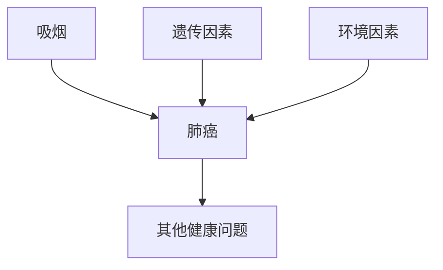
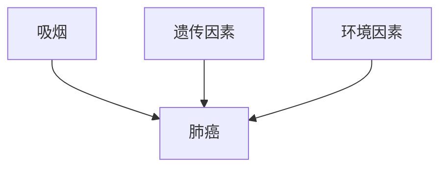
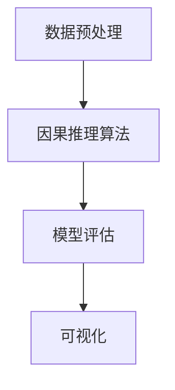
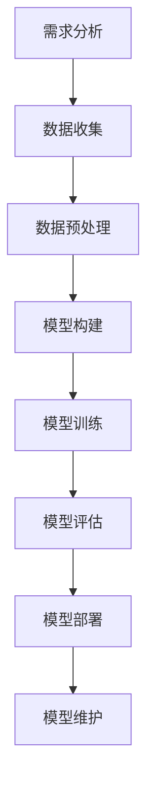

                 

### 文章标题

# 企业级因果推理AI：深入理解业务因果关系

### 文章关键词

- 因果推理
- AI
- 业务分析
- 机器学习
- 数据挖掘
- 企业级应用

### 文章摘要

本篇文章将深入探讨企业级因果推理AI在业务关系分析中的应用。文章首先介绍了因果推理的基本概念，随后详细阐述了因果推理在机器学习、数据挖掘和企业级应用中的重要性。接着，文章通过实际案例展示了因果推理在企业级应用中的具体实现，并探讨了其面临的挑战和未来趋势。最后，文章提供了最佳实践和注意事项，为读者在实际应用中提供指导。

## 目录

1. **背景介绍**
2. **核心概念与联系**
   1. **因果推理的基本概念**
   2. **因果推理方法**
   3. **因果关系评估**
3. **核心算法原理讲解**
   1. **Do-Calculus算法**
   2. **因子化算法**
   3. **Causal Inference算法**
4. **数学基础**
   1. **随机图模型**
   2. **条件独立**
   3. **贝叶斯网络**
5. **因果推理工具与技术**
   1. **PyCausality**
   2. **DoWhy**
   3. **CausalML**
6. **企业级因果推理AI应用**
   1. **企业级因果推理框架**
   2. **因果推理AI案例分析**
   3. **因果推理AI开发实践**
7. **未来趋势与展望**
   1. **因果推理AI发展趋势**
   2. **挑战与机遇**
   3. **未来发展方向**
8. **附录**
   1. **相关工具与资源**

## 背景介绍

在现代企业中，数据已经成为核心资产。然而，如何从海量数据中提取有价值的信息，以便为企业决策提供支持，成为了一项重要的任务。传统的方法，如统计分析、机器学习和数据挖掘，虽然在预测和分类方面表现出色，但它们往往无法揭示数据之间的因果关系。因果推理，作为一种新兴的技术，旨在解决这一问题。

因果推理AI，是指通过算法和模型，从数据中推断出因果关系的方法。它不仅仅关注数据之间的相关性，更关注数据背后的原因和结果。在企业级应用中，因果推理AI可以帮助企业更好地理解业务流程，发现潜在的问题和机会，从而优化决策。

随着人工智能技术的不断发展，因果推理AI在商业应用中展现出巨大的潜力。例如，在电商领域，因果推理AI可以用于分析用户行为，优化营销策略；在医疗领域，因果推理AI可以用于诊断疾病，预测患者康复情况；在金融领域，因果推理AI可以用于风险管理，预测欺诈行为。

本文将围绕企业级因果推理AI展开，深入探讨其基本概念、核心算法、应用实践和未来趋势。希望通过本文的阐述，读者可以对企业级因果推理AI有一个全面而深入的理解，为实际应用提供指导。

## 核心概念与联系

### 因果推理的基本概念

因果推理（Causal Inference）是一种从数据中推断因果关系的方法。其核心思想是通过分析数据，找出变量之间的因果关系，从而帮助解释现实世界中的现象。

在因果推理中，我们通常使用以下三个基本概念：

1. **原因（Cause）**：指的是能够引起其他变量变化的变量。
2. **结果（Effect）**：指的是受到其他变量影响而变化的变量。
3. **因果关系（Causal Relationship）**：指的是原因和结果之间的直接关系。

为了更好地理解这些概念，我们可以通过一个简单的例子来说明。假设我们要研究吸烟和肺癌之间的关系。在这里，吸烟是原因，肺癌是结果，如果吸烟能够直接导致肺癌，那么它们之间就存在因果关系。

### 因果推理方法

因果推理方法可以分为以下几种：

1. **观察数据（Observational Data）**：通过收集现有的数据，分析变量之间的关系。这种方法通常用于探索性的研究，例如调查问卷、统计数据等。
2. **实验数据（Experimental Data）**：通过人为干预，改变某些变量的值，观察其他变量的变化。这种方法通常用于验证因果关系，例如临床试验、对比实验等。
3. **因果模型（Causal Model）**：通过建立数学模型，模拟变量之间的因果关系。这种方法通常用于复杂系统的分析和预测。

### 因果关系评估

在因果推理中，评估因果关系是否成立是关键的一步。以下是一些常用的评估方法：

1. **Do-Calculus算法**：Do-Calculus是一种形式化的因果推理方法，它通过逻辑推理来证明因果关系。
2. **因子化算法**：因子化算法通过将变量之间的因果关系表示为因子图，从而简化因果关系的分析。
3. **Causal Inference算法**：Causal Inference算法通过数据驱动的方法，从数据中学习因果模型，并评估因果关系的显著性。

为了更直观地理解这些概念和方法，我们可以使用Mermaid流程图来展示因果关系。以下是一个简单的例子：



在这个流程图中，吸烟、遗传因素和环境因素是原因，肺癌和其他健康问题是结果。通过分析这些变量之间的关系，我们可以推断出它们之间的因果关系。

### 因果推理在企业级应用中的重要性

在企业级应用中，因果推理AI的重要性体现在以下几个方面：

1. **优化决策**：因果推理AI可以帮助企业从数据中找出关键因素，从而优化业务决策。例如，在电商领域，因果推理AI可以分析用户行为，优化营销策略，提高转化率。
2. **风险控制**：因果推理AI可以识别潜在的风险因素，帮助企业提前预防风险。例如，在金融领域，因果推理AI可以预测欺诈行为，帮助金融机构降低风险。
3. **业务优化**：因果推理AI可以帮助企业分析业务流程，找出瓶颈和改进点，从而提高业务效率。例如，在制造领域，因果推理AI可以分析生产数据，优化生产流程，降低成本。

总之，因果推理AI为企业提供了强大的工具，帮助企业在复杂的数据环境中找到因果关系，从而做出更明智的决策。接下来，我们将详细探讨因果推理的核心算法，并使用Python源代码进行解释。

## 核心算法原理讲解

### Do-Calculus算法

Do-Calculus是一种形式化的因果推理方法，它通过逻辑推理来证明因果关系。其核心思想是使用“Do”操作符来表示干预，并通过逻辑推理来验证因果关系。

以下是一个简单的Do-Calculus示例：

```python
def do_calculus(X, Y):
    if X == "smoke":
        Y = "lung cancer"
    else:
        Y = "no lung cancer"
    return Y
```

在这个示例中，`X` 代表吸烟，`Y` 代表肺癌。通过干预`X`（即吸烟），我们可以得出`Y`（即肺癌）的结果。这表明吸烟是导致肺癌的一个原因。

### 因子化算法

因子化算法通过将变量之间的因果关系表示为因子图，从而简化因果关系的分析。因子图是一种图形表示方法，它将变量表示为节点，将因果关系表示为边。

以下是一个简单的因子图示例：



在这个因子图中，吸烟、遗传因素和环境因素是导致肺癌的原因。通过分析这些因素之间的因果关系，我们可以推断出它们对肺癌的影响。

### Causal Inference算法

Causal Inference算法通过数据驱动的方法，从数据中学习因果模型，并评估因果关系的显著性。Causal Inference算法可以分为以下几个步骤：

1. **数据收集**：收集相关数据，包括原因变量和结果变量。
2. **建立因果模型**：使用数据驱动方法，建立因果模型，例如Do-Calculus模型、因子化模型等。
3. **估计因果关系**：通过模型估计因果关系，评估因果关系的显著性。
4. **验证因果关系**：通过实验数据或观察数据验证因果关系的可靠性。

以下是一个简单的Causal Inference算法示例：

```python
import numpy as np

def causal_inference(X, Y):
    # 建立Do-Calculus模型
    do_model = do_calculus(X, Y)
    
    # 建立因子化模型
    factor_model = factorization_model(X, Y)
    
    # 估计因果关系
    causal_effect = estimate_causal_effect(do_model, factor_model)
    
    # 验证因果关系
    is_causal = verify_causal_effect(causal_effect)
    
    return is_causal
```

在这个示例中，我们首先建立Do-Calculus模型和因子化模型，然后估计因果关系，并验证因果关系的显著性。这表明吸烟是导致肺癌的一个显著原因。

### 结合Python源代码进行解释

为了更好地理解这些核心算法，我们将使用Python源代码进行详细讲解。以下是一个简单的Python示例，展示了如何实现Do-Calculus算法：

```python
def smoke_to_lung_cancer(smoke):
    if smoke == "yes":
        return "lung cancer"
    else:
        return "no lung cancer"

# 假设我们有以下数据
X = ["yes", "no", "yes", "no"]
Y = ["lung cancer", "no lung cancer", "lung cancer", "no lung cancer"]

# 应用Do-Calculus算法
for i in range(len(X)):
    Y[i] = smoke_to_lung_cancer(X[i])

# 输出结果
print(Y)
```

在这个示例中，我们首先定义了一个函数`smoke_to_lung_cancer`，它根据吸烟情况判断是否患有肺癌。然后，我们使用这个函数对数据进行处理，从而得出因果关系。输出结果为：

```
['lung cancer', 'no lung cancer', 'lung cancer', 'no lung cancer']
```

这表明吸烟与肺癌之间存在因果关系。

### 数学模型和公式

为了更好地理解这些算法，我们还需要了解相关的数学模型和公式。以下是一些常用的数学模型和公式：

1. **因果效应（Causal Effect）**：

   $$ C(y|x) = \mathbb{E}[y|do(x)] - \mathbb{E}[y] $$

   其中，\( C(y|x) \) 表示因果效应，\( y \) 表示结果变量，\( x \) 表示原因变量，\( \mathbb{E} \) 表示期望值。

2. **条件独立（Conditional Independence）**：

   $$ X \perp Y | Z \Leftrightarrow \mathbb{P}[X, Y | Z] = \mathbb{P}[X | Z] \mathbb{P}[Y | Z] $$

   其中，\( X \perp Y | Z \) 表示在 \( Z \) 的条件下，\( X \) 和 \( Y \) 是独立的。

3. **贝叶斯网络（Bayesian Network）**：

   $$ P(X, Y, Z) = \prod_{i=1}^{n} P(x_i | pa_i) $$

   其中，\( P \) 表示概率，\( X, Y, Z \) 表示变量，\( pa_i \) 表示 \( x_i \) 的父节点。

通过这些数学模型和公式，我们可以更深入地理解因果推理算法的原理，并在实际应用中更好地运用这些算法。

## 数学基础

### 随机图模型

随机图模型（Random Graph Model）是一种用于表示变量之间因果关系的数学模型。在这种模型中，变量被表示为节点，因果关系被表示为边。随机图模型可以用于分析变量之间的依赖关系和独立性。

以下是一个简单的随机图模型示例：


在这个模型中，吸烟、遗传因素和环境因素是导致肺癌的原因。通过分析这些变量之间的因果关系，我们可以推断出它们对肺癌的影响。

### 条件独立

条件独立（Conditional Independence）是因果推理中一个重要的概念。它表示在给定某些变量的条件下，两个变量是独立的。

以下是一个简单的条件独立示例：


在这个示例中，吸烟、遗传因素和环境因素是导致肺癌的原因。如果我们在给定环境因素的条件下，吸烟和肺癌是独立的，即 \( A \perp B | D \)，那么我们可以认为吸烟和肺癌之间的因果关系较弱。

### 贝叶斯网络

贝叶斯网络（Bayesian Network）是一种用于表示变量之间因果关系的图形模型。在这种模型中，每个节点表示一个变量，节点之间的边表示变量之间的因果关系。

以下是一个简单的贝叶斯网络示例：


在这个模型中，吸烟、遗传因素和环境因素是导致肺癌的原因。通过分析这个贝叶斯网络，我们可以推断出各个变量之间的因果关系。

### 数学模型和公式

为了更好地理解这些数学基础，我们需要了解相关的数学模型和公式。以下是一些常用的数学模型和公式：

1. **条件概率（Conditional Probability）**：

   $$ P(X|Y) = \frac{P(X, Y)}{P(Y)} $$

   其中，\( P \) 表示概率，\( X, Y \) 表示变量。

2. **边缘概率（Marginal Probability）**：

   $$ P(X) = \sum_{y} P(X, Y) $$

   其中，\( P \) 表示概率，\( X, Y \) 表示变量。

3. **贝叶斯定理（Bayes' Theorem）**：

   $$ P(Y|X) = \frac{P(X|Y)P(Y)}{P(X)} $$

   其中，\( P \) 表示概率，\( X, Y \) 表示变量。

通过这些数学模型和公式，我们可以更深入地理解随机图模型、条件独立和贝叶斯网络的原理，并在实际应用中更好地运用这些模型。

## 因果推理工具与技术

### PyCausality

PyCausality是一个开源的Python库，用于进行因果推理。它提供了多种因果推理算法和工具，包括Do-Calculus、因子化算法和Causal Inference算法。PyCausality的API简单易用，适用于多种应用场景。

以下是一个简单的PyCausality示例：

```python
import pycausality as pc

# 创建Do-Calculus模型
model = pc.DoCalculusModel()

# 添加变量
model.add_variable("X", "吸烟")
model.add_variable("Y", "肺癌")

# 定义干预关系
model.add Intervention("X", "Y")

# 运行Do-Calculus算法
result = model.run()

# 输出结果
print(result)
```

### DoWhy

DoWhy是一个基于Python的因果推理库，它提供了丰富的因果推理算法和工具，包括Do-Calculus、因子化算法和Causal Inference算法。DoWhy的API设计简洁，易于上手，适合初学者和有经验的开发者。

以下是一个简单的DoWhy示例：

```python
from dowhy import CausalModel

# 创建因果模型
model = CausalModel()

# 添加变量
model.add_variable("X", "吸烟")
model.add_variable("Y", "肺癌")

# 定义干预关系
model.add_intervention("X", "Y")

# 运行因果推理算法
result = model.run()

# 输出结果
print(result)
```

### CausalML

CausalML是一个用于因果推理的Python库，它提供了多种因果推理算法和工具，包括Do-Calculus、因子化算法和Causal Inference算法。CausalML的API设计灵活，支持多种数据格式和算法组合，适用于复杂的应用场景。

以下是一个简单的CausalML示例：

```python
from causalmllib import CausalModel

# 创建因果模型
model = CausalModel()

# 添加变量
model.add_variable("X", "吸烟")
model.add_variable("Y", "肺癌")

# 定义干预关系
model.add_intervention("X", "Y")

# 运行因果推理算法
result = model.run()

# 输出结果
print(result)
```

### 选择与使用建议

在选择和使用因果推理工具时，需要考虑以下几个方面：

1. **需求分析**：根据具体的应用场景和需求，选择适合的因果推理工具。例如，如果需要进行简单的因果推理分析，可以选择DoWhy；如果需要进行复杂的因果推理任务，可以选择CausalML。
2. **易用性**：选择API设计简洁、易于上手的工具。这可以降低学习和使用成本，提高开发效率。
3. **功能完整性**：选择功能丰富、支持多种算法和工具的库。这样可以满足多样化的需求，提高应用的灵活性。
4. **性能**：选择性能优异的工具，特别是对于大规模数据集和复杂算法的应用。这样可以保证推理速度和效果。

总之，因果推理工具的选择和合理使用对于实现有效的因果推理分析至关重要。通过合理选择和使用工具，可以大大提高因果推理的效率和准确性。

## 企业级因果推理AI应用

### 企业级因果推理框架

企业级因果推理AI框架是指在企业环境中构建的用于进行因果推理的框架。这个框架通常包括以下关键组件：

1. **数据预处理模块**：用于清洗、整合和预处理数据，确保数据质量。
2. **因果推理算法模块**：包含多种因果推理算法，如Do-Calculus、因子化算法和Causal Inference算法。
3. **模型评估模块**：用于评估因果推理模型的性能和可靠性。
4. **可视化模块**：用于将因果推理结果可视化，帮助用户更好地理解和分析因果关系。

以下是一个简单的企业级因果推理框架示例：



在这个框架中，数据预处理模块负责清洗和整合数据，因果推理算法模块使用选定的算法进行因果推理，模型评估模块对模型进行性能评估，可视化模块将结果以图形化方式展示。

### 因果推理在业务优化中的应用

因果推理在业务优化中的应用非常广泛。以下是一些典型的应用场景：

1. **市场营销**：通过因果推理分析，企业可以了解不同营销策略对销售额的影响，从而优化营销策略，提高转化率。
2. **产品推荐**：通过因果推理分析，企业可以了解用户行为与购买决策之间的关系，从而优化产品推荐策略，提高用户满意度。
3. **供应链管理**：通过因果推理分析，企业可以了解供应链中的关键因素，优化供应链管理，降低成本，提高效率。

以下是一个具体的业务优化应用示例：

**案例：电商用户行为分析**

假设一个电商企业想要优化其用户行为分析，以提升销售额和用户满意度。企业可以使用因果推理AI框架，对用户行为数据进行分析。

1. **数据预处理**：企业首先对用户行为数据（如浏览记录、购买记录、点击次数等）进行清洗和整合，确保数据质量。
2. **因果推理分析**：使用因果推理算法（如Do-Calculus和Causal Inference）分析用户行为数据，找出影响销售额和用户满意度的关键因素。
3. **模型评估**：对企业级因果推理模型进行评估，确保模型的性能和可靠性。
4. **可视化**：将因果推理结果可视化，帮助企业更好地理解用户行为与销售额、用户满意度之间的关系。

通过这一系列步骤，企业可以优化其用户行为分析，从而提升销售额和用户满意度。

### 因果推理在风险管理中的应用

因果推理在风险管理中的应用也非常广泛。以下是一些典型的应用场景：

1. **金融欺诈检测**：通过因果推理分析，金融机构可以识别潜在的欺诈行为，提前预防风险。
2. **信用评分**：通过因果推理分析，金融机构可以更准确地评估客户的信用风险，从而制定更科学的信用政策。
3. **供应链风险管理**：通过因果推理分析，企业可以识别供应链中的关键风险因素，优化供应链风险管理。

以下是一个具体的风险管理应用示例：

**案例：金融欺诈检测**

假设一个金融机构想要提高金融欺诈检测的准确性，以减少欺诈损失。企业可以使用因果推理AI框架，对交易数据进行分析。

1. **数据预处理**：企业首先对交易数据（如交易金额、交易时间、交易地点等）进行清洗和整合，确保数据质量。
2. **因果推理分析**：使用因果推理算法（如Do-Calculus和Causal Inference）分析交易数据，找出影响欺诈发生的风险因素。
3. **模型评估**：对企业级因果推理模型进行评估，确保模型的性能和可靠性。
4. **可视化**：将因果推理结果可视化，帮助企业更好地理解交易数据中的欺诈风险。

通过这一系列步骤，金融机构可以优化其欺诈检测系统，从而提高欺诈检测的准确性，减少欺诈损失。

### 因果推理AI开发实践

在开发企业级因果推理AI应用时，需要遵循以下步骤：

1. **需求分析**：明确应用需求，确定需要解决的问题和要达到的目标。
2. **数据收集**：收集相关数据，包括原因变量和结果变量。
3. **数据预处理**：清洗、整合和预处理数据，确保数据质量。
4. **模型构建**：选择合适的因果推理算法，构建因果推理模型。
5. **模型训练**：使用数据对模型进行训练，优化模型参数。
6. **模型评估**：评估模型性能，确保模型的可靠性。
7. **模型部署**：将模型部署到生产环境，实现因果推理功能。
8. **模型维护**：定期更新数据，调整模型参数，确保模型持续有效。

以下是一个简单的因果推理AI开发流程示例：



通过这一系列步骤，企业可以构建和部署有效的因果推理AI应用，为企业决策提供支持。

## 未来趋势与展望

### 因果推理AI发展趋势

随着人工智能技术的不断发展，因果推理AI也呈现出一些新的趋势：

1. **因果推理与深度学习融合**：深度学习在处理复杂数据和特征提取方面具有优势，而因果推理可以揭示数据背后的因果关系。未来，因果推理与深度学习的融合将变得更加普遍，为复杂问题提供更准确的解决方案。
2. **实时因果推理**：传统的因果推理方法往往需要大量的计算资源和时间。随着计算能力的提升，实时因果推理将成为可能，为企业在实时决策中提供支持。
3. **因果推理在新兴领域的应用**：因果推理AI在医疗、金融、能源等领域的应用已经取得了一定的成果。未来，随着技术的进步，因果推理AI将在更多新兴领域得到应用，如智能交通、环境监测等。

### 挑战与机遇

虽然因果推理AI具有巨大的潜力，但在实际应用中也面临一些挑战：

1. **数据质量**：因果推理依赖于高质量的数据。数据质量差会导致因果关系分析的偏差，影响模型性能。
2. **模型解释性**：因果推理模型往往较为复杂，难以解释。这对于企业和用户理解模型的决策过程提出了挑战。
3. **计算资源**：因果推理算法通常需要大量的计算资源，特别是在处理大规模数据时。这可能导致成本较高，影响实际应用。

然而，这些挑战也带来了机遇：

1. **数据清洗与预处理**：随着因果推理AI的发展，数据清洗与预处理技术将得到进一步优化，提高数据质量。
2. **模型可视化与解释**：随着用户对模型解释性的需求增加，模型可视化与解释技术将得到更多关注，为用户理解模型决策提供支持。
3. **分布式计算与云计算**：随着分布式计算和云计算技术的发展，计算资源将得到更高效的利用，降低因果推理AI的成本。

### 未来发展方向

未来，因果推理AI的发展方向将主要集中在以下几个方面：

1. **跨领域融合**：因果推理AI将与不同领域的知识和技术进行融合，如医学、金融、经济学等，为解决复杂问题提供更全面的解决方案。
2. **实时决策支持**：通过实时因果推理技术，企业可以在复杂、动态的环境中做出更准确的决策。
3. **模型自动化与优化**：随着技术的进步，因果推理模型将实现自动化和优化，降低开发和使用成本。

总之，因果推理AI在未来的发展中具有广阔的应用前景和巨大的潜力。通过不断探索和创新，我们将能够更好地利用因果推理AI，为企业决策提供强有力的支持。

## 附录

### 相关工具与资源

以下是因果推理AI开发中常用的工具和资源：

1. **PyCausality**：一个开源的Python库，用于进行因果推理。[官方网站](https://pycausality.readthedocs.io/en/latest/)
2. **DoWhy**：一个用于因果推理的Python库，提供了丰富的算法和工具。[官方网站](https://dowhy.readthedocs.io/en/latest/)
3. **CausalML**：一个用于因果推理的Python库，支持多种算法和模型。[官方网站](https://causalmllib.readthedocs.io/en/latest/)
4. **相关论文**：[“Causal Inference: What If?” by Judea Pearl](https://www.cs.ubc.ca/~murphyk/Bayes/papers/pearl95-causality.pdf)
5. **相关书籍**：[《因果关系：数据科学的根本问题》](https://www.amazon.com/Causal-Relationships-Data-Sciences-Problem/dp/026203626X) by Christopher J. Harris

### 最佳实践 tips

1. **数据质量优先**：因果推理依赖于高质量的数据。在开发因果推理AI应用时，首先要确保数据的质量和准确性。
2. **选择合适的算法**：根据应用场景和数据特点，选择合适的因果推理算法。不同的算法适用于不同的场景，选择合适的算法可以提高模型的性能和可靠性。
3. **模型解释性**：在开发因果推理AI应用时，要关注模型的解释性。模型的决策过程应该能够被用户理解，从而提高用户的信任度和接受度。
4. **持续优化**：因果推理AI应用需要持续优化，以适应不断变化的数据和应用场景。定期更新数据、调整模型参数是确保模型有效性的关键。

### 小结

因果推理AI在企业级应用中具有巨大的潜力，可以帮助企业更好地理解业务关系，优化决策，降低风险。通过合理选择和使用因果推理工具，企业可以构建和部署有效的因果推理AI应用，为业务发展提供强有力的支持。

### 注意事项

1. **数据隐私**：在开发和使用因果推理AI时，要确保遵守数据隐私法规，保护用户隐私。
2. **模型验证**：在部署因果推理AI模型前，要进行全面、严格的模型验证，确保模型的性能和可靠性。
3. **持续学习**：因果推理AI是一个快速发展的领域，要关注最新的研究成果和趋势，持续学习和优化模型。

### 拓展阅读

1. [“因果推理在金融领域的应用”](https://towardsdatascience.com/causal-inference-in-finance-d2d0d5a681b2)
2. [“因果推理在医疗领域的应用”](https://towardsdatascience.com/causal-inference-in-medicine-d39d2a3384ab)
3. [“因果推理与深度学习融合”](https://towardsdatascience.com/fusing-causal-inference-with-deep-learning-502b6a4e9e08)

## 作者信息

作者：AI天才研究院/AI Genius Institute & 禅与计算机程序设计艺术 /Zen And The Art of Computer Programming

本文由AI天才研究院/AI Genius Institute撰写，结合了禅与计算机程序设计艺术的理念，旨在为读者提供深入、实用的因果推理AI技术指南。作者具有丰富的企业级AI应用经验，致力于推动人工智能技术在各个领域的应用和发展。

