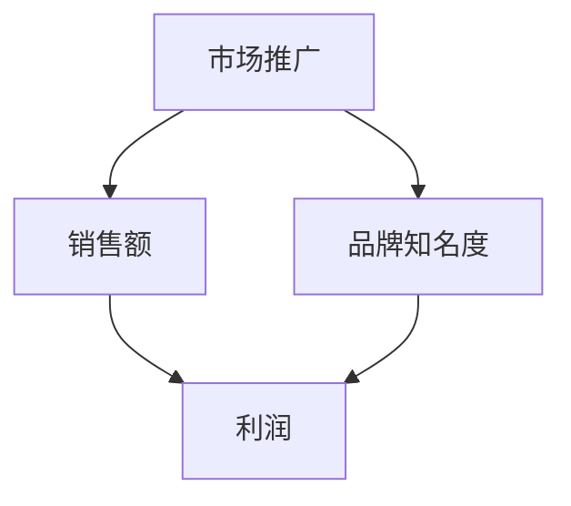

                 

# 企业级因果推理框架：深入理解业务因果关系

## 关键词
- 因果推理
- 业务因果关系
- 企业级框架
- 核心算法原理
- 数学模型
- 项目实战

## 摘要
本文深入探讨企业级因果推理框架，旨在帮助读者理解业务因果关系，掌握核心概念、算法原理和实际应用。通过详细的背景介绍、概念联系、算法讲解、数学模型阐述和实战案例分析，本文为构建高效、可靠的因果推理体系提供了系统性的指导。

---

## 引言

在日益复杂和动态的商业环境中，企业面临着前所未有的挑战。为了在竞争中脱颖而出，企业需要深入理解业务中的因果关系，以便做出明智的决策。因果推理作为一种强大的数据分析方法，能够揭示变量之间的因果关系，从而帮助企业在不确定性中找到方向。

### 因果关系的定义与重要性

因果关系指的是一个事件（原因）导致另一个事件（结果）的关系。在商业环境中，因果关系有助于揭示影响业务绩效的关键因素，从而指导企业制定有效的战略和决策。例如，理解产品促销活动与销售增长之间的因果关系，可以帮助企业优化营销策略，提高盈利能力。

### 因果推理框架概述

因果推理框架是一个系统化的方法，用于分析和解释变量之间的因果关系。它通常包括以下几个关键组成部分：

1. **核心概念与联系**：因果推理框架需要明确核心概念及其相互关系，如潜在结果图（Lauritzen 图）。
2. **核心算法原理**：算法原理包括随机对照试验、因果推断算法和决策树等。
3. **数学模型**：数学模型用于计算因果关系，如潜在结果图和置信区域。
4. **项目实战**：通过实际案例，验证因果推理框架的有效性和实用性。

### 因果推理在企业中的挑战

尽管因果推理在商业决策中具有重要意义，但在实际应用中仍面临诸多挑战，如数据缺失、变量选择和模型验证等。因此，构建一个高效、可靠的因果推理框架至关重要。

---

## 第一部分：框架基础

### 第1章：因果关系的定义与重要性

#### 1.1 因果关系的定义

因果关系是指一个事件（原因）导致另一个事件（结果）的关系。在数学和统计学中，因果关系通常被定义为变量之间的函数依赖关系。例如，如果变量X的变化总是导致变量Y的变化，则我们可以说X是Y的原因。

#### 1.2 因果关系的类型

1. **直接因果关系**：一个变量的变化直接导致另一个变量的变化。
2. **间接因果关系**：一个变量的变化通过其他变量间接导致另一个变量的变化。
3. **必要因果关系**：没有原因就没有结果。
4. **充分因果关系**：有原因就有结果。

#### 1.3 因果关系在商业决策中的重要性

在企业中，理解因果关系对于制定有效的战略和决策至关重要。例如，通过因果推理，企业可以：

- **优化产品和服务**：了解哪些因素影响客户满意度，从而提高产品质量。
- **优化营销策略**：分析广告和促销活动与销售增长之间的因果关系。
- **风险管理**：预测潜在的风险并制定相应的应对策略。

### 第2章：因果推理框架概述

#### 2.1 因果推理框架的发展历程

因果推理作为一种数据分析方法，经历了长期的发展。从早期的哲学探讨到现代的数学模型和算法，因果推理在统计学、计算机科学和经济学等领域得到了广泛应用。

#### 2.2 因果推理框架的组成部分

一个完整的因果推理框架通常包括以下几个关键组成部分：

1. **数据收集与预处理**：收集与因果关系相关的数据，并进行预处理，如数据清洗和特征工程。
2. **核心概念与联系**：明确核心概念，如潜在结果图（Lauritzen 图）。
3. **核心算法原理**：包括随机对照试验、因果推断算法和决策树等。
4. **数学模型**：用于计算因果关系，如潜在结果图和置信区域。
5. **项目实战**：通过实际案例，验证因果推理框架的有效性和实用性。

#### 2.3 因果推理在商业应用中的挑战

尽管因果推理在商业决策中具有重要意义，但在实际应用中仍面临诸多挑战，如数据缺失、变量选择和模型验证等。因此，构建一个高效、可靠的因果推理框架至关重要。

---

## 第二部分：核心概念与联系

### 第3章：核心概念原理和架构

#### 3.1 因果推断的基本原理

因果推断是一种通过观察数据来推断变量之间因果关系的方法。其基本原理包括以下几个方面：

1. **潜在结果框架**：因果推断基于潜在结果框架，假设每个个体在不同的条件下会有不同的结果。
2. **随机对照试验**：随机对照试验是一种常用的因果推断方法，通过将个体随机分配到不同的处理组，来评估处理对结果的影响。
3. **因果推断算法**：因果推断算法包括结构化因果推断、基于模型的因果推断和基于数据的因果推断。

#### 3.2 因果关系的 Mermaid 流程图

为了更直观地展示因果关系，可以使用 Mermaid 流程图来表示。以下是一个简单的 Mermaid 流程图示例：

在这个流程图中，市场推广影响品牌知名度和销售额，而销售额和品牌知名度又影响利润。

#### 3.3 因果关系的研究方法

因果关系的研究方法包括实验法、历史法和量化分析法等。实验法通过控制变量的方式来研究因果关系，历史法通过分析历史数据来推断因果关系，量化分析法通过数学模型和统计方法来研究因果关系。

---

## 第三部分：核心算法原理讲解

### 第4章：核心算法原理讲解

#### 4.1 算法原理1：随机对照试验

随机对照试验是一种经典的因果推断方法，通过将个体随机分配到不同的处理组，来评估处理对结果的影响。以下是随机对照试验的基本步骤：

1. **随机化分组**：将个体随机分配到处理组和对照组。
2. **数据处理**：对处理组实施特定处理，对照组不进行处理。
3. **结果评估**：比较处理组和对照组的结果，评估处理效果。

随机对照试验的优点是能够有效消除个体差异对结果的影响，提高因果关系评估的准确性。

#### 4.2 算法原理2：因果推断算法

因果推断算法是一种基于统计学习和数据挖掘的方法，用于推断变量之间的因果关系。常见的因果推断算法包括：

1. **结构化因果推断**：通过构建结构方程模型，分析变量之间的因果关系。
2. **基于模型的因果推断**：利用潜在结果模型，分析变量之间的因果关系。
3. **基于数据的因果推断**：通过数据驱动的方法，分析变量之间的因果关系。

#### 4.3 算法原理3：决策树与神经网络

决策树和神经网络是两种常用的机器学习算法，也可用于因果推断。

1. **决策树**：通过构建决策树，将变量之间的因果关系表示为一系列条件分支。
2. **神经网络**：通过构建神经网络，将变量之间的因果关系表示为非线性函数。

这两种算法的优点是能够处理复杂的因果关系，并能对结果进行预测。

---

## 第四部分：数学模型和公式详解

### 第5章：数学模型和公式详解

#### 5.1 数学模型1：潜在结果图（Lauritzen 图）

潜在结果图（Lauritzen 图）是一种用于表示变量之间因果关系的图形模型。它通过节点和边表示变量和因果关系，是一种直观且强大的工具。

#### 5.2 数学模型2：因果效应计算

因果效应是衡量因果关系强度的重要指标。常见的因果效应计算方法包括：

1. **平均因果效应**：衡量平均情况下，原因对结果的影响。
2. **边际因果效应**：衡量在特定条件下，原因对结果的影响。

#### 5.3 数学模型3：置信区域和置信区间

置信区域和置信区间是用于评估因果关系可靠性的重要工具。它们可以帮助我们确定因果关系的可信程度。

1. **置信区域**：表示在给定的置信水平下，因果关系存在的可能性。
2. **置信区间**：表示在给定的置信水平下，因果关系强度的范围。

---

## 第五部分：项目实战

### 第6章：企业级因果推理应用

#### 6.1 因果推理在企业中的实际案例

在本节中，我们将探讨一些企业级因果推理的实际案例，包括客户流失预测、产品优化建议和供应链管理优化。

#### 6.2 实战1：客户行为分析

客户行为分析是一种重要的业务分析手段，通过分析客户的行为数据，企业可以更好地了解客户需求，提高客户满意度。

1. **数据收集与预处理**：收集客户行为数据，如点击率、购买记录和浏览时间等，并进行预处理，如数据清洗和特征工程。
2. **因果关系建模**：使用因果推断算法，建立客户行为与客户流失之间的因果关系模型。
3. **模型评估与优化**：评估模型性能，并进行优化，以提高预测准确性。

#### 6.3 实战2：营销策略优化

营销策略优化是提高企业盈利能力的重要手段。通过因果推理，企业可以更好地了解营销策略与销售增长之间的关系。

1. **营销策略的因果分析**：分析不同营销策略对销售增长的影响。
2. **营销策略的优化方案**：根据因果分析结果，制定优化方案。
3. **营销效果评估**：评估优化方案的有效性。

---

## 第六部分：开发环境搭建与代码实现

### 第7章：开发环境搭建与代码实现

#### 7.1 开发环境配置

在本节中，我们将介绍如何搭建开发环境，包括硬件配置、软件配置和开发工具选择。

1. **硬件配置**：配置满足需求的硬件环境，如高性能计算机。
2. **软件配置**：安装必要的软件，如 Python、R 和相关库。
3. **开发工具选择**：选择合适的开发工具，如 PyCharm、Jupyter Notebook。

#### 7.2 源代码详细实现

在本节中，我们将通过 Python 源代码详细实现因果推理框架，包括数据读取与预处理、因果关系建模和模型训练与评估。

1. **数据读取与预处理**：读取数据，并进行预处理，如数据清洗和特征工程。
2. **因果关系建模**：使用随机对照试验和因果推断算法，建立因果关系模型。
3. **模型训练与评估**：训练模型，并进行评估，以确定模型性能。

#### 7.3 代码解读与分析

在本节中，我们将对源代码进行解读和分析，帮助读者理解因果推理框架的实现过程。

1. **代码解读**：对关键代码进行详细解读，解释其工作原理。
2. **代码分析**：分析代码的性能和可扩展性，并提出优化建议。

---

## 第8章：总结与展望

#### 8.1 全书总结

本文系统地介绍了企业级因果推理框架，包括背景介绍、核心概念、算法原理、数学模型和实战案例。通过本文的学习，读者可以掌握因果推理的基本原理和应用方法，为企业决策提供有力支持。

#### 8.2 未来研究方向

未来研究方向包括：

1. **因果推断算法的优化**：提高因果推断算法的准确性和效率。
2. **多变量因果推断**：研究多变量因果推断方法，以应对复杂业务场景。
3. **因果推断在实时数据分析中的应用**：探索因果推断在实时数据分析中的应用，提高业务响应速度。

---

## 附录

附录部分提供了一些有用的参考资料，包括相关书籍、论文和在线资源，供读者进一步学习。

### 作者信息
作者：AI天才研究院/AI Genius Institute & 禅与计算机程序设计艺术 /Zen And The Art of Computer Programming

---

以上是对企业级因果推理框架的初步概述。通过深入研究和实际应用，因果推理为企业提供了一种强大的数据分析工具，有助于企业在复杂的市场环境中做出明智的决策。在接下来的章节中，我们将详细探讨因果推理的理论基础和实践应用，帮助读者全面掌握这一重要技术。

