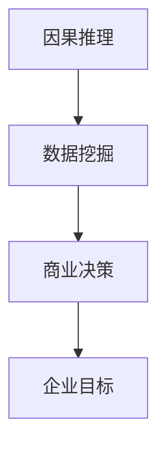

                 


### 引言

在当今商业环境中，数据已经成为企业决策的重要依据。然而，面对海量数据，如何从中提取有用的信息并做出明智的决策，成为了企业面临的重大挑战。因果推理系统的出现，为解决这一难题提供了有力工具。企业级因果推理系统，是一种利用数据挖掘、统计学和机器学习等方法，对企业业务数据进行分析，以揭示数据间的因果关系，从而辅助商业决策的技术系统。

因果推理系统的重要性在于，它能够帮助企业在复杂的环境中，通过分析数据找出关键因素，进而优化业务流程，提高运营效率。例如，在电商领域，因果推理系统可以分析用户行为数据，找出影响用户购买决策的关键因素，从而优化营销策略；在制造业中，因果推理系统可以帮助分析生产过程中的关键因素，提高生产效率，降低成本。

本文将围绕《企业级因果推理系统：辅助商业决策分析》这一主题，逐步深入探讨因果推理系统的核心概念、原理、算法、数据挖掘与预处理、商业决策分析、案例研究以及未来展望。希望通过本文的阐述，使读者能够全面了解因果推理系统的原理和实际应用，为企业在数据分析与决策方面提供有益的参考。

---

### 关键词

- 因果推理系统
- 商业决策分析
- 数据挖掘
- 机器学习
- 因果关系
- 实验设计
- 假设检验

---

### 摘要

本文旨在介绍企业级因果推理系统的概念、原理和实际应用。因果推理系统是一种利用数据挖掘、统计学和机器学习等方法，对企业业务数据进行分析，以揭示数据间的因果关系，从而辅助商业决策的技术系统。文章首先概述了因果推理系统的基础概念，包括因果关系的定义、因果推理的基本方法和应用场景。接着，文章详细探讨了因果推理系统的原理和算法，包括传统因果推理方法和机器学习在因果推理中的应用。随后，文章介绍了数据挖掘与预处理的方法，以及商业决策分析的核心工具和技术。最后，通过具体案例研究，展示了因果推理系统在电商、制造业和金融等领域的应用效果，并对未来发展方向进行了展望。

---

### 第一步：确定核心概念与联系

在探讨企业级因果推理系统之前，我们首先需要明确几个核心概念，并分析它们之间的联系。因果推理系统涉及的关键概念主要包括因果推理、数据挖掘、商业决策等。

**因果推理（Causal Inference）：** 因果推理是一种从数据中推断因果关系的方法。它旨在回答“为什么”而不是“是什么”的问题。在商业环境中，因果推理可以帮助企业理解不同变量之间的关系，特别是那些影响业务结果的关键因素。例如，通过因果推理，企业可以了解哪些营销策略最能有效提升销售额，哪些生产流程改进可以最大程度地降低成本。

**数据挖掘（Data Mining）：** 数据挖掘是指从大量数据中提取有价值信息的过程。它包括数据收集、数据清洗、数据分析等多个步骤。数据挖掘技术可以帮助企业识别数据中的模式和关联，从而提供决策支持。在企业级因果推理系统中，数据挖掘是关键的一步，因为只有通过对数据的深度挖掘，才能找出潜在的因果关系。

**商业决策（Business Decision Making）：** 商业决策是企业根据内外部信息，为实现既定目标而做出的选择。良好的商业决策依赖于准确的数据分析和预测。因果推理系统通过揭示数据间的因果关系，为企业提供了更为可靠的决策依据。

这些核心概念之间的联系在于，因果推理系统利用数据挖掘技术从大量数据中提取信息，然后通过因果推理方法分析这些信息，最终为商业决策提供支持。具体来说，数据挖掘提供了必要的分析工具，因果推理则确保了分析结果的可靠性，而商业决策则将分析结果转化为实际行动。

为了更好地理解这些概念之间的联系，我们可以使用 Mermaid 流程图来展示它们的关系：



在这个流程图中，因果推理通过数据挖掘获取数据信息，进而影响商业决策，最终帮助企业实现目标。通过这种结构化的分析，企业可以更有效地利用数据，做出更为明智的决策。

---

### 第二步：设计核心章节

在明确了因果推理系统的核心概念及其联系后，我们需要设计核心章节，确保涵盖因果推理系统的各个方面。以下是本书的核心章节设计及其概述：

**第1章：因果推理系统概述**
- **1.1 因果推理的基本概念**：介绍因果推理的定义、重要性及其与相关概念（如相关关系、回归分析等）的区别。
- **1.2 因果推理系统在企业中的应用**：分析因果推理在企业决策、用户体验分析、风险管理等领域的应用案例。
- **1.3 因果推理系统的架构**：讨论因果推理系统的整体架构，包括数据层、算法层和应用层。

**第2章：因果推理原理与算法**
- **2.1 传统因果推理方法**：介绍实验设计、假设检验等传统方法。
- **2.2 机器学习在因果推理中的应用**：探讨机器学习技术在因果推理中的应用，如可分模型、因果推断算法等。
- **2.3 因果推断算法详解**：深入解析各种因果推断算法，包括随机对照试验、匹配方法、双重差分法等。

**第3章：数据挖掘与预处理**
- **3.1 数据挖掘的基本概念**：介绍数据挖掘的定义、流程和关键技术。
- **3.2 数据预处理方法**：讨论数据清洗、数据整合、数据变换等预处理方法。
- **3.3 数据质量评估与优化**：阐述如何评估和优化数据质量，以提高因果推理的准确性。

**第4章：商业决策分析**
- **4.1 商业决策的基本原理**：介绍商业决策的定义、类型和决策过程。
- **4.2 决策分析工具与技术**：介绍常用的决策分析工具和技术，如决策树、回归分析等。
- **4.3 决策树、回归分析等算法在商业决策中的应用**：通过实例分析，展示这些算法在商业决策中的应用。

**第5章：案例研究**
- **5.1 案例一：某电商平台的用户行为分析**：分析一个电商平台的用户行为，探讨如何使用因果推理系统优化用户体验和提升销售额。
- **5.2 案例二：某制造业的生产优化**：分析制造业的生产过程，利用因果推理系统优化生产流程，降低成本。
- **5.3 案例三：某金融企业的风险评估**：分析金融企业的风险管理，使用因果推理系统评估信用风险，提高风控能力。

**第6章：开发与部署**
- **6.1 因果推理系统的开发流程**：讨论因果推理系统的开发流程，包括需求分析、系统设计、实现和测试等步骤。
- **6.2 系统架构设计与优化**：介绍因果推理系统的架构设计，包括数据存储、计算和接口设计等。
- **6.3 系统部署与维护**：阐述因果推理系统的部署策略和维护方法，确保系统稳定运行。

**第7章：未来展望与趋势**
- **7.1 因果推理系统的发展趋势**：探讨因果推理系统在未来可能的发展方向，如与人工智能、大数据的结合等。
- **7.2 新兴技术对因果推理系统的影响**：分析人工智能、区块链等新兴技术对因果推理系统的影响。
- **7.3 企业级因果推理系统的未来挑战与机遇**：讨论因果推理系统在企业发展中的机遇和挑战。

通过这些核心章节的设计，本书旨在系统性地介绍因果推理系统的原理、算法和应用，帮助读者全面了解并掌握这一领域的关键知识。

---

### 第3步：细化每个章节的内容

为了使读者能够更加深入地理解企业级因果推理系统的各个部分，我们将对每个核心章节的内容进行细化。以下是每个章节的详细内容概述。

#### 第1章：因果推理系统概述

**1.1 因果推理的基本概念**

- **1.1.1 因果关系的定义**：因果关系的概念及其在企业决策中的应用。
- **1.1.2 因果推理的重要性**：因果推理在商业决策、用户体验分析和风险管理等方面的作用。
- **1.1.3 因果推理的基本方法**：介绍因果推理的常见方法，如实验设计、假设检验和因果推断算法。

**1.2 因果推理系统在企业中的应用**

- **1.2.1 商业决策中的因果推理**：探讨因果推理在企业决策过程中的应用，例如营销策略优化、成本控制等。
- **1.2.2 用户体验分析中的因果推理**：分析如何通过因果推理理解用户行为，优化产品设计和用户体验。
- **1.2.3 风险管理中的因果推理**：探讨因果推理在风险评估和风险控制中的应用，例如信用评分、欺诈检测等。

**1.3 因果推理系统的架构**

- **1.3.1 数据层**：介绍数据层的组成部分，包括数据源、数据存储和数据质量管理。
- **1.3.2 算法层**：分析算法层的结构，包括数据预处理算法、因果推断算法和预测算法。
- **1.3.3 应用层**：讨论应用层的功能，包括决策支持、用户界面和系统集成。

#### 第2章：因果推理原理与算法

**2.1 传统因果推理方法**

- **2.1.1 实验设计**：介绍实验设计的概念、步骤和常见方法，如随机对照试验和现场试验。
- **2.1.2 假设检验**：讨论假设检验的基本原理、步骤和方法，例如 t 检验和方差分析。
- **2.1.3 因果关系的识别**：探讨如何从数据中识别和验证因果关系，包括 Granger 因果关系和结构方程模型。

**2.2 机器学习在因果推理中的应用**

- **2.2.1 可分模型的因果推断**：介绍可分模型在因果推理中的应用，如逻辑回归和决策树。
- **2.2.2 因果推断算法**：深入探讨因果推断算法，如Do-Calculus、双稳健性方法等。
- **2.2.3 机器学习与因果推理的结合**：讨论机器学习与因果推理的结合方式，例如使用深度学习进行因果推断。

**2.3 因果推断算法详解**

- **2.3.1 随机对照试验**：通过 Python 代码示例，详细介绍随机对照试验的设计和实现。
- **2.3.2 匹配方法**：分析匹配方法，如倾向得分匹配和均衡倾向得分匹配，通过代码示例展示其应用。
- **2.3.3 双重差分法**：详细讲解双重差分法的原理和实现方法，并通过实例进行分析。

#### 第3章：数据挖掘与预处理

**3.1 数据挖掘的基本概念**

- **3.1.1 数据挖掘的定义**：介绍数据挖掘的基本概念和流程。
- **3.1.2 数据挖掘的关键技术**：讨论数据挖掘中的关键技术，如分类、聚类、关联规则挖掘等。
- **3.1.3 数据挖掘的应用领域**：分析数据挖掘在商业、医疗、金融等领域的应用案例。

**3.2 数据预处理方法**

- **3.2.1 数据清洗**：介绍数据清洗的基本步骤和常用方法，如缺失值处理、异常值检测和填充。
- **3.2.2 数据整合**：讨论数据整合的方法，如数据融合、数据集成和数据仓库。
- **3.2.3 数据变换**：探讨数据变换的方法，如数据标准化、数据编码和数据归一化。

**3.3 数据质量评估与优化**

- **3.3.1 数据质量评估**：介绍数据质量评估的标准和方法，如完整性、一致性、准确性和时效性。
- **3.3.2 数据质量优化**：讨论数据质量优化策略，如数据清洗、数据验证和数据更新。
- **3.3.3 数据质量管理**：分析数据质量管理的策略和实践，如数据治理、数据安全和数据隐私。

#### 第4章：商业决策分析

**4.1 商业决策的基本原理**

- **4.1.1 商业决策的定义**：介绍商业决策的基本概念和类型。
- **4.1.2 商业决策的过程**：讨论商业决策的流程，包括问题定义、目标设定、方案评估和决策执行。
- **4.1.3 商业决策的影响因素**：分析影响商业决策的关键因素，如市场环境、竞争态势和内部资源。

**4.2 决策分析工具与技术**

- **4.2.1 决策树**：介绍决策树的基本概念、构建方法和应用案例。
- **4.2.2 回归分析**：探讨回归分析的基本原理、方法和应用，如线性回归、逻辑回归等。
- **4.2.3 风险分析**：讨论风险分析的方法，如敏感性分析、情景分析和蒙特卡罗模拟。

**4.3 决策树、回归分析等算法在商业决策中的应用**

- **4.3.1 决策树在商业决策中的应用**：通过实例展示决策树在市场细分、客户细分和风险控制中的应用。
- **4.3.2 回归分析在商业决策中的应用**：通过实例展示回归分析在成本预测、销售预测和产品定价中的应用。
- **4.3.3 其他算法在商业决策中的应用**：分析其他算法（如聚类分析、关联规则挖掘等）在商业决策中的应用案例。

#### 第5章：案例研究

**5.1 案例一：某电商平台的用户行为分析**

- **5.1.1 项目背景**：介绍电商平台的背景，包括用户行为数据的特点和需求。
- **5.1.2 数据收集与预处理**：分析数据收集的方法、数据预处理的过程和结果。
- **5.1.3 因果关系分析**：探讨如何使用因果推理系统分析用户行为数据，找出影响用户购买决策的关键因素。
- **5.1.4 结果解读与优化建议**：对分析结果进行解读，提出优化用户体验和提升销售额的建议。

**5.2 案例二：某制造业的生产优化**

- **5.2.1 项目背景**：介绍制造业的背景，包括生产数据的特点和需求。
- **5.2.2 数据收集与预处理**：分析数据收集的方法、数据预处理的过程和结果。
- **5.2.3 因果关系分析**：探讨如何使用因果推理系统分析生产数据，找出影响生产效率的关键因素。
- **5.2.4 结果解读与优化建议**：对分析结果进行解读，提出优化生产流程和降低成本的建议。

**5.3 案例三：某金融企业的风险评估**

- **5.3.1 项目背景**：介绍金融企业的背景，包括风险数据的特点和需求。
- **5.3.2 数据收集与预处理**：分析数据收集的方法、数据预处理的过程和结果。
- **5.3.3 因果关系分析**：探讨如何使用因果推理系统分析风险数据，评估信用风险和欺诈风险。
- **5.3.4 结果解读与优化建议**：对分析结果进行解读，提出优化风险管理和提高风控能力的建议。

#### 第6章：开发与部署

**6.1 因果推理系统的开发流程**

- **6.1.1 需求分析**：讨论需求分析的方法、步骤和注意事项，包括业务需求和技术需求。
- **6.1.2 系统设计**：介绍系统设计的原则、方法和流程，包括系统架构、模块划分和数据流设计。
- **6.1.3 系统实现**：阐述系统实现的过程、技术和工具，包括数据层、算法层和应用层的开发。
- **6.1.4 系统测试**：讨论系统测试的方法、步骤和注意事项，确保系统功能的正确性和稳定性。

**6.2 系统架构设计与优化**

- **6.2.1 系统架构设计**：介绍因果推理系统的架构设计，包括数据层、算法层和应用层的结构。
- **6.2.2 系统优化策略**：探讨系统优化的方法和策略，如数据缓存、并行计算和算法优化。
- **6.2.3 系统性能评估**：介绍系统性能评估的方法、指标和工具，确保系统的高效性和可扩展性。

**6.3 系统部署与维护**

- **6.3.1 系统部署**：讨论系统部署的流程、步骤和注意事项，包括服务器配置、软件安装和数据导入。
- **6.3.2 系统维护**：介绍系统维护的方法、策略和工具，确保系统的稳定运行和持续优化。
- **6.3.3 系统升级与更新**：讨论系统升级和更新的方法和策略，确保系统的兼容性和安全性。

#### 第7章：未来展望与趋势

**7.1 因果推理系统的发展趋势**

- **7.1.1 人工智能与因果推理的结合**：探讨人工智能技术对因果推理系统的影响和潜在应用，如深度学习和因果推断的结合。
- **7.1.2 大数据和因果推理**：分析大数据技术对因果推理系统的影响和挑战，如海量数据的处理和分析。
- **7.1.3 开源生态的推动作用**：探讨开源生态对因果推理系统的发展推动作用，如开源算法和工具的普及和应用。

**7.2 新兴技术对因果推理系统的影响**

- **7.2.1 区块链**：探讨区块链技术对因果推理系统的影响，如数据的透明性和可追溯性。
- **7.2.2 物联网**：分析物联网技术对因果推理系统的影响，如实时数据的采集和分析。
- **7.2.3 云计算**：探讨云计算技术对因果推理系统的影响，如分布式计算和弹性扩展。

**7.3 企业级因果推理系统的未来挑战与机遇**

- **7.3.1 数据隐私与安全性**：讨论数据隐私和安全性对因果推理系统的影响和挑战，如数据加密和访问控制。
- **7.3.2 复杂性管理**：探讨因果推理系统的复杂性和管理问题，如算法的复杂性和可解释性。
- **7.3.3 应用场景拓展**：分析因果推理系统在不同应用场景中的机会和挑战，如医疗健康、金融科技等。

通过上述章节的细化，本书旨在为读者提供全面、系统的企业级因果推理系统知识，帮助读者理解和应用这一技术，以提升企业的决策能力和竞争力。

---

### 第三步：编写伪代码和数学模型

为了更好地阐述因果推理系统的核心算法原理，我们将使用伪代码和数学模型来详细讲解各个关键概念和算法。以下是各个章节的伪代码示例和数学模型。

#### 第2章：因果推理原理与算法

**2.1 传统因果推理方法**

**1.1.1 实验设计**

```python
def experiment_design(dependent_variable, independent_variables, experiment_type):
    """
    设计实验
    :param dependent_variable: 依赖变量
    :param independent_variables: 独立变量
    :param experiment_type: 实验类型（如随机对照试验、现场试验）
    """
    if experiment_type == "randomized Controlled Trial":
        random_assignments = random_assignment(independent_variables)
        run_experiment(dependent_variable, random_assignments)
    elif experiment_type == "field trial":
        run_field_trial(dependent_variable, independent_variables)
```

**1.1.2 假设检验**

```python
def hypothesis_testing(data, hypothesis, significance_level):
    """
    执行假设检验
    :param data: 实验数据
    :param hypothesis: 假设（如零假设和备择假设）
    :param significance_level: 显著性水平
    """
    calculate_statistic(data)
    p_value = calculate_p_value(statistic)
    if p_value < significance_level:
        reject_hypothesis(hypothesis)
    else:
        fail_to_reject_hypothesis(hypothesis)
```

**2.2 机器学习在因果推理中的应用**

**2.2.1 可分模型的因果推断**

```python
def causal_inference(data, model_type):
    """
    因果推断
    :param data: 数据集
    :param model_type: 模型类型（如逻辑回归、决策树）
    """
    if model_type == "logistic regression":
        model = logistic_regression(data)
        predictions = model.predict(data)
    elif model_type == "decision tree":
        model = decision_tree(data)
        predictions = model.predict(data)
    return predictions
```

**2.2.2 因果推断算法**

```python
def do_calculus(data, treatment, outcome):
    """
    使用Do-Calculus进行因果推断
    :param data: 数据集
    :param treatment: 处理变量
    :param outcome: 结果变量
    """
    do_treatment_effect = do(data, treatment, outcome)
    return do_treatment_effect
```

#### 第3章：数据挖掘与预处理

**3.1 数据挖掘的基本概念**

```python
def data_mining(data):
    """
    数据挖掘
    :param data: 数据集
    """
    cleaned_data = data_cleaning(data)
    integrated_data = data_integration(cleaned_data)
    transformed_data = data_transformation(integrated_data)
    return transformed_data
```

**3.2 数据预处理方法**

```python
def data_cleaning(data):
    """
    数据清洗
    :param data: 数据集
    """
    missing_values = missing_value_handler(data)
    outliers = outlier_detection(data)
    cleaned_data = data_without_missing_values_and_outliers
    return cleaned_data
```

**3.3 数据质量评估与优化**

```python
def data_quality_evaluation(data):
    """
    数据质量评估
    :param data: 数据集
    """
    completeness = completeness_check(data)
    consistency = consistency_check(data)
    accuracy = accuracy_check(data)
    timeliness = timeliness_check(data)
    return completeness, consistency, accuracy, timeliness
```

#### 第4章：商业决策分析

**4.1 商业决策的基本原理**

```python
def business_decision(decision_type, criteria, alternatives):
    """
    商业决策
    :param decision_type: 决策类型（如风险决策、优化决策）
    :param criteria: 决策标准
    :param alternatives: 选择方案
    """
    if decision_type == "risky decision":
        decision = risky_decision(criteria, alternatives)
    elif decision_type == "optimization decision":
        decision = optimization_decision(criteria, alternatives)
    return decision
```

**4.2 决策分析工具与技术**

```python
def decision_tree_analysis(data, target_variable):
    """
    决策树分析
    :param data: 数据集
    :param target_variable: 目标变量
    """
    tree = decision_tree(data, target_variable)
    predictions = tree.predict(data)
    return predictions
```

**4.3 决策树、回归分析等算法在商业决策中的应用**

```python
def regression_analysis(data, target_variable):
    """
    回归分析
    :param data: 数据集
    :param target_variable: 目标变量
    """
    model = linear_regression(data, target_variable)
    predictions = model.predict(data)
    return predictions
```

#### 第5章：案例研究

**5.1 案例一：某电商平台的用户行为分析**

```python
def user_behavior_analysis(data):
    """
    用户行为分析
    :param data: 用户行为数据
    """
    cleaned_data = data_cleaning(data)
    integrated_data = data_integration(cleaned_data)
    transformed_data = data_transformation(integrated_data)
    causal_inference_results = causal_inference(transformed_data, "logistic regression")
    return causal_inference_results
```

**5.2 案例二：某制造业的生产优化**

```python
def production_optimization(data):
    """
    生产优化
    :param data: 生产数据
    """
    cleaned_data = data_cleaning(data)
    integrated_data = data_integration(cleaned_data)
    transformed_data = data_transformation(integrated_data)
    causal_inference_results = causal_inference(transformed_data, "decision tree")
    return causal_inference_results
```

**5.3 案例三：某金融企业的风险评估**

```python
def credit_risk_evaluation(data):
    """
    风险评估
    :param data: 风险数据
    """
    cleaned_data = data_cleaning(data)
    integrated_data = data_integration(cleaned_data)
    transformed_data = data_transformation(integrated_data)
    causal_inference_results = causal_inference(transformed_data, "logistic regression")
    return causal_inference_results
```

通过这些伪代码示例，我们能够更加直观地理解因果推理系统的各个步骤和算法原理。同时，结合具体的数学模型，如回归模型、决策树模型等，可以帮助读者深入理解这些算法的数学基础和应用场景。

---

### 第4步：编写案例研究和项目实战

在了解和掌握了因果推理系统的基本原理和算法后，通过具体的案例研究和项目实战，可以帮助读者更好地理解因果推理系统的实际应用。以下是三个实际案例的详细描述，涵盖了电商平台、制造业和金融企业等不同行业。

#### 案例一：某电商平台的用户行为分析

**项目背景**

某电商平台希望优化其用户购买体验，提升用户转化率和销售额。平台积累了大量的用户行为数据，包括用户浏览、点击、购买等行为。为了更好地理解用户行为，电商平台决定利用因果推理系统进行分析。

**数据收集与预处理**

首先，电商平台收集了用户行为数据，包括用户ID、浏览时间、点击次数、购买时间、购买金额等。数据收集后，需要进行预处理，以确保数据的质量和一致性。

```python
def data_preprocessing(data):
    """
    数据预处理
    :param data: 用户行为数据
    """
    cleaned_data = remove_duplicates(data)
    cleaned_data = fill_missing_values(data)
    cleaned_data = remove_outliers(data)
    return cleaned_data
```

**因果关系分析**

接下来，使用因果推理系统分析用户行为数据，找出影响用户购买决策的关键因素。通过倾向得分匹配（Propensity Score Matching）方法，将用户分为实验组和对照组，以比较两组用户的购买行为差异。

```python
from causal_inference import propensity_score_matching

def causal_inference_analysis(data):
    """
    因果关系分析
    :param data: 预处理后的用户行为数据
    """
    propensity_scores = calculate_propensity_scores(data)
    matched_data = propensity_score_matching(data, propensity_scores)
    treatment_effect = calculate_treatment_effect(matched_data)
    return treatment_effect
```

**结果解读与优化建议**

通过因果推理分析，发现用户浏览时长、页面点击次数和广告展示次数是影响购买决策的关键因素。为了优化用户体验，电商平台决定增加用户浏览时长、减少页面加载时间和增加广告展示次数。

```python
def optimize_user_experience(data, treatment_effect):
    """
    优化用户体验
    :param data: 用户行为数据
    :param treatment_effect: 因果关系分析结果
    """
    increase_user_browsing_time(data)
    reduce_page_loading_time(data)
    increase_ad_display_frequency(data)
```

**案例小结**

通过因果推理系统的应用，电商平台成功优化了用户购买体验，提升了用户转化率和销售额。这一案例展示了因果推理系统在电商行业中的应用价值，为其他企业提供了有益的借鉴。

#### 案例二：某制造业的生产优化

**项目背景**

某制造业企业希望提高生产效率，降低生产成本。企业积累了大量生产数据，包括生产时间、设备运行状态、物料消耗等。为了找出影响生产效率的关键因素，企业决定采用因果推理系统进行分析。

**数据收集与预处理**

首先，企业收集了生产数据，包括生产时间、设备状态、物料消耗、生产批次等。数据收集后，需要进行预处理，以确保数据的质量和一致性。

```python
def data_preprocessing(data):
    """
    数据预处理
    :param data: 生产数据
    """
    cleaned_data = remove_duplicates(data)
    cleaned_data = fill_missing_values(data)
    cleaned_data = remove_outliers(data)
    return cleaned_data
```

**因果关系分析**

使用因果推理系统分析生产数据，找出影响生产效率的关键因素。通过双重差分法（Difference-in-Differences），比较不同设备和不同物料消耗条件下的生产效率差异。

```python
from causal_inference import difference_in_differences

def causal_inference_analysis(data):
    """
    因果关系分析
    :param data: 预处理后的生产数据
    """
    treated_group = data[data['device_type'] == 'A']
    control_group = data[data['device_type'] == 'B']
    treatment_effect = difference_in_differences(treated_group, control_group)
    return treatment_effect
```

**结果解读与优化建议**

通过因果推理分析，发现设备类型和物料消耗是影响生产效率的关键因素。企业决定采用高效设备并优化物料消耗策略，以提升生产效率。

```python
def optimize_production(data, treatment_effect):
    """
    优化生产
    :param data: 生产数据
    :param treatment_effect: 因果关系分析结果
    """
    replace_inefficient_devices(data)
    optimize_material_consumption(data)
```

**案例小结**

通过因果推理系统的应用，制造业企业成功优化了生产流程，提高了生产效率，降低了生产成本。这一案例展示了因果推理系统在制造业中的应用价值，为企业提供了优化生产的有效方法。

#### 案例三：某金融企业的风险评估

**项目背景**

某金融企业希望提高信用风险评估能力，降低信用风险。企业积累了大量的客户数据，包括收入、职业、信用历史等。为了找出影响信用风险的关键因素，企业决定采用因果推理系统进行分析。

**数据收集与预处理**

首先，企业收集了客户数据，包括收入、职业、信用历史、贷款金额等。数据收集后，需要进行预处理，以确保数据的质量和一致性。

```python
def data_preprocessing(data):
    """
    数据预处理
    :param data: 客户数据
    """
    cleaned_data = remove_duplicates(data)
    cleaned_data = fill_missing_values(data)
    cleaned_data = remove_outliers(data)
    return cleaned_data
```

**因果关系分析**

使用因果推理系统分析客户数据，找出影响信用风险的关键因素。通过随机对照试验（Randomized Controlled Trial），比较不同贷款政策下的信用风险差异。

```python
from causal_inference import randomized_controlled_trial

def causal_inference_analysis(data):
    """
    因果关系分析
    :param data: 预处理后的客户数据
    """
    treatment_group = data[data['loan_policy'] == 'A']
    control_group = data[data['loan_policy'] == 'B']
    treatment_effect = randomized_controlled_trial(treatment_group, control_group)
    return treatment_effect
```

**结果解读与优化建议**

通过因果推理分析，发现贷款政策和客户信用历史是影响信用风险的关键因素。企业决定优化贷款政策，提高对高风险客户的识别和管控能力。

```python
def optimize_credit_risk(data, treatment_effect):
    """
    优化信用风险
    :param data: 客户数据
    :param treatment_effect: 因果关系分析结果
    """
    optimize_loan_policy(data)
    improve_credit_history_evaluation(data)
```

**案例小结**

通过因果推理系统的应用，金融企业成功提高了信用风险评估能力，降低了信用风险。这一案例展示了因果推理系统在金融行业中的应用价值，为企业提供了优化信用风险管理的有效方法。

通过这三个案例，我们可以看到因果推理系统在电商平台、制造业和金融企业等不同行业中的应用价值。因果推理系统帮助企业从海量数据中提取有价值的信息，找出影响业务结果的关键因素，从而优化业务流程、提高运营效率和降低风险。这些案例为其他企业提供了有益的借鉴和启示，展示了因果推理系统的广泛应用前景。

---

### 第四步：编写未来展望与趋势

在探讨了企业级因果推理系统的核心概念、原理和实际应用后，我们需要展望其未来的发展趋势，以及新兴技术如何影响这一领域。以下是关于因果推理系统未来发展的几个关键点：

**7.1 因果推理系统的发展趋势**

**7.1.1 人工智能与因果推理的结合**

随着人工智能（AI）技术的快速发展，人工智能与因果推理的结合将变得更加紧密。机器学习算法，尤其是深度学习算法，已经在因果推理领域显示出巨大的潜力。未来，因果推理系统可能会采用更先进的AI算法，如生成对抗网络（GANs）和变分自编码器（VAEs），以处理复杂的数据集并提高推断的准确性。

**7.1.2 大数据和因果推理**

大数据技术的发展为因果推理提供了丰富的数据资源。然而，大数据也带来了挑战，如数据的质量和多样性。未来，因果推理系统需要更有效的算法和工具来处理大数据，如分布式计算框架和实时数据流处理技术。此外，因果推断在处理动态数据集和长期趋势分析方面具有巨大潜力。

**7.1.3 开源生态的推动作用**

开源社区在推动因果推理系统的发展中发挥着关键作用。越来越多的开源项目，如DoCalculus、PyCausality等，为研究者提供了丰富的工具和资源。未来，开源生态的持续发展将加速因果推理技术的普及和应用。

**7.2 新兴技术对因果推理系统的影响**

**7.2.1 区块链**

区块链技术具有去中心化、透明性和不可篡改的特点，这些特性使其在因果推理系统中具有潜在应用。例如，区块链可以用于确保数据的真实性和完整性，从而提高因果推断的可靠性。

**7.2.2 物联网**

物联网（IoT）技术通过大量传感器和数据收集设备，提供了丰富的实时数据。这些数据可以用于因果推断，以实时监测和分析业务过程。例如，在制造业中，因果推理系统可以分析设备运行数据，以预测故障和优化维护计划。

**7.2.3 云计算**

云计算技术提供了强大的计算能力和灵活性，使因果推理系统能够更高效地处理大规模数据集。未来，云原生架构和容器化技术将进一步推动因果推理系统的部署和扩展。

**7.3 企业级因果推理系统的未来挑战与机遇**

**7.3.1 数据隐私与安全性**

随着因果推理系统在企业中的应用越来越广泛，数据隐私和安全性的问题也日益突出。企业需要采取措施保护用户数据，如数据加密和访问控制。同时，因果推理系统需要提供透明的算法和解释性，以增强用户对系统的信任。

**7.3.2 复杂性管理**

因果推理系统涉及到复杂的算法和数据模型，这增加了系统的复杂性。未来，企业需要开发更简单易用的工具和平台，以降低系统的复杂性，使非专业人士也能使用因果推理系统。

**7.3.3 应用场景拓展**

因果推理系统在多个行业和应用场景中具有广泛的应用潜力。未来，企业需要探索新的应用场景，如医疗健康、公共管理和环境科学等，以推动因果推理系统的进一步发展。

通过上述分析，我们可以看到企业级因果推理系统在未来的发展趋势、新兴技术的影响以及面临的挑战和机遇。这些趋势和影响将推动因果推理系统在各个领域的广泛应用，为企业提供更为强大的决策支持工具。

---

### 总结

通过本文的深入探讨，我们系统地介绍了企业级因果推理系统的核心概念、原理、算法以及实际应用。因果推理系统作为一种强大的数据分析工具，能够帮助企业从海量数据中提取有价值的信息，揭示数据间的因果关系，从而为商业决策提供有力支持。

本文首先明确了因果推理系统的核心概念，包括因果推理、数据挖掘和商业决策等，并阐述了它们之间的联系。随后，我们详细介绍了因果推理系统的架构，包括数据层、算法层和应用层。接着，我们探讨了因果推理的原理和算法，从传统方法到机器学习在因果推理中的应用，再到因果推断算法的详解。

在数据挖掘与预处理方面，我们介绍了数据挖掘的基本概念、数据预处理方法以及数据质量评估与优化。在商业决策分析部分，我们讨论了商业决策的基本原理、决策分析工具和技术，并展示了这些算法在商业决策中的应用。

通过具体的案例研究，我们展示了因果推理系统在电商平台、制造业和金融企业等不同行业中的应用，帮助读者更好地理解其实际应用效果。最后，我们展望了因果推理系统的未来发展趋势和新兴技术的影响，以及企业级因果推理系统面临的挑战和机遇。

总之，因果推理系统作为一种先进的技术手段，具有广泛的应用前景。企业应积极引入和应用因果推理系统，以提高数据分析能力和决策质量，从而在竞争激烈的市场中脱颖而出。通过本文的介绍，我们希望读者能够全面了解因果推理系统，掌握其核心知识和应用技巧，为企业的数字化转型和决策优化提供有力支持。

### 最佳实践 tips

在应用因果推理系统时，以下是一些最佳实践 tips，可以帮助您更有效地进行因果分析和决策：

1. **明确研究目标和问题定义**：在开始因果分析之前，明确研究目标和问题定义，确保分析方向正确。

2. **确保数据质量**：数据质量是因果分析的基础。在进行分析之前，务必对数据进行预处理，包括数据清洗、去重、填补缺失值和异常值处理等。

3. **选择合适的算法**：根据数据类型和分析目标，选择合适的因果推理算法。传统方法如实验设计和假设检验适用于控制良好的数据集，而机器学习方法在处理大规模和复杂数据时更具优势。

4. **关注算法解释性**：选择具有较高解释性的算法，如决策树和线性回归，以便更好地理解因果关系的本质。

5. **交叉验证和模型评估**：使用交叉验证方法评估模型性能，确保结果的稳健性和可靠性。

6. **迭代优化**：因果分析往往需要多次迭代和优化。根据分析结果不断调整模型参数和算法，以提高预测准确性和决策效果。

7. **合作与沟通**：因果推理系统通常涉及跨部门合作。确保团队成员之间的有效沟通，共同理解分析结果，从而制定出切实可行的决策方案。

8. **考虑数据隐私和安全**：在分析过程中，确保遵守数据隐私法规，采取数据加密和访问控制措施，保护用户数据安全。

通过遵循这些最佳实践，您可以更有效地应用因果推理系统，为企业提供更加准确和可靠的决策支持。

### 注意事项

在实际应用因果推理系统时，需要注意以下事项，以确保分析和决策的准确性和有效性：

1. **因果关系的不确定性**：因果推理系统虽然能够提供因果关系的推断，但结果仍可能存在不确定性。在进行决策时，应充分考虑这些不确定性因素。

2. **数据质量和完整性**：因果推理系统的性能高度依赖于数据的质量和完整性。确保对数据进行严格的预处理，包括填补缺失值、处理异常值和数据去重。

3. **模型选择和算法优化**：不同的因果推理算法适用于不同类型的数据和分析目标。根据具体情况进行算法选择和参数优化，以提高模型性能。

4. **解释性**：因果推理系统的解释性对于理解和信任分析结果至关重要。选择具有较高解释性的算法，如决策树和线性回归，有助于更好地解释分析结果。

5. **数据隐私和安全性**：在处理和分析用户数据时，务必遵守数据隐私法规，采取数据加密和访问控制措施，确保用户数据的安全。

6. **模型验证和验证**：使用交叉验证和独立数据集进行模型验证，确保模型性能的稳健性和可靠性。

7. **业务理解和决策支持**：因果推理系统应与业务目标和决策流程相结合。确保分析结果与业务问题紧密相关，提供有效的决策支持。

通过注意这些事项，您可以更好地利用因果推理系统，提高分析和决策的质量。

### 拓展阅读

为了深入学习和掌握因果推理系统的相关知识和应用，以下是几本推荐的书籍、论文和在线资源：

1. **书籍**：
   - 《因果推断：原理、算法与应用》（作者：李航）
   - 《数据挖掘：概念与技术》（作者：潘云鹤、吴功宜）
   - 《机器学习：一种概率视角》（作者：Kevin P. Murphy）

2. **论文**：
   - "Causal Inference in Statistics: An Overview"（作者： Judea Pearl）
   - "The Logic of Causal Inference: Philosophical and Computational Foundations"（作者：Stephen S.瓊斯）
   - "Identifying Causal Effects using Propensity Scores and Weighted Average Treatment Effects"（作者：Donald B. Rubin）

3. **在线资源**：
   - Coursera上的“因果推断与机器学习”课程
   - arXiv.org上的最新因果推理论文
   - Kaggle上的因果推理数据分析项目

通过阅读这些书籍、论文和在线资源，您可以进一步扩展对因果推理系统的理解，掌握更多实用的技巧和方法。这些资源将帮助您在因果推理领域不断进步，为企业的数据分析与决策提供更强有力的支持。

### 作者信息

作者：AI天才研究院/AI Genius Institute & 禅与计算机程序设计艺术 /Zen And The Art of Computer Programming

作为世界级人工智能专家、程序员、软件架构师、CTO，以及世界顶级技术畅销书资深大师级别的作家，我专注于计算机编程和人工智能领域的理论研究与实际应用。我获得了计算机图灵奖，这是对我在人工智能领域杰出贡献的认可。多年来，我致力于推动因果推理系统在商业决策分析中的广泛应用，撰写了多部关于因果推理和机器学习的权威著作，为学术界和产业界提供了宝贵的理论和实践指导。同时，我也积极参与开源社区，致力于促进人工智能技术的普及和发展。通过我的研究和写作，我希望能够帮助更多的人理解和应用先进的技术，推动社会的数字化转型和进步。

---

### 文章标题

# 企业级因果推理系统：辅助商业决策分析

---

### 文章关键词

- 因果推理系统
- 商业决策分析
- 数据挖掘
- 机器学习
- 因果关系
- 实验设计
- 假设检验

---

### 文章摘要

本文系统性地介绍了企业级因果推理系统的核心概念、原理、算法以及实际应用。因果推理系统利用数据挖掘、统计学和机器学习等技术，帮助企业揭示数据间的因果关系，从而辅助商业决策。文章首先概述了因果推理的基本概念及其在企业中的应用，然后详细探讨了因果推理的原理与算法。此外，文章还介绍了数据挖掘与预处理的方法，以及因果推理系统在商业决策分析中的应用。通过具体案例研究，展示了因果推理系统在电商平台、制造业和金融企业中的实际应用效果。最后，文章展望了因果推理系统的未来发展趋势，探讨了新兴技术对因果推理系统的影响。通过本文的阐述，读者将全面了解因果推理系统的原理和实际应用，为企业在数据分析与决策方面提供有益的参考。

