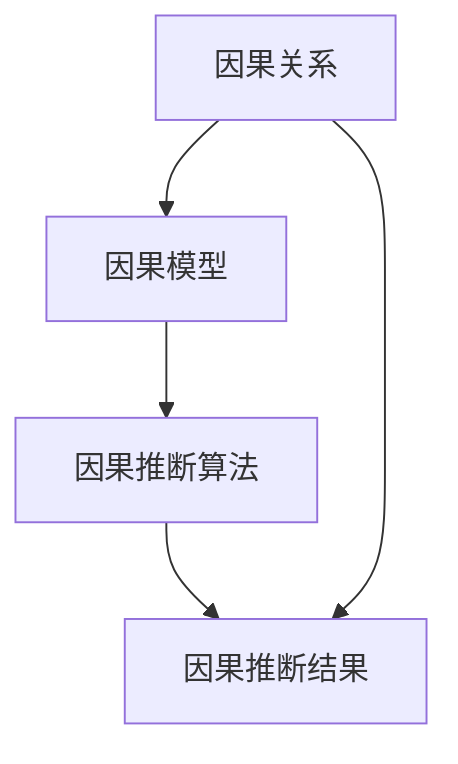

                 

### 引言部分（第1章）

#### 1.1 因果推理的基本概念

**因果关系**是科学研究和日常生活中常见的概念，它描述了一个现象如何引起另一个现象的变化。在商业决策中，因果关系尤为重要，因为它能够帮助企业理解哪些策略或行动最有可能带来预期的结果。因果推理（Causal Inference）则是一种通过数据分析来揭示、验证或假设因果关系的方法。

**因果关系的重要性**在于它能够帮助企业从大量数据中识别出关键因素，从而做出更精准、更有效的决策。例如，一家电商平台可以通过因果推理分析出哪些促销活动最能提高用户购买意愿，从而优化营销策略。

**因果推理在商业决策中的应用**体现在多个方面，如市场分析、产品优化、用户行为预测、风险评估等。通过因果推理，企业能够更深入地了解业务流程，发现潜在问题，并针对性地提出解决方案。

**本章内容概述**：本章将首先介绍因果关系的定义，然后讨论因果推理的基本概念、重要性及其在商业决策中的应用。此外，还将概述本书的结构和阅读本书的预期收获，为后续章节的深入学习奠定基础。

**阅读本章的预期收获**：读者将了解因果推理的基本概念，认识到其在商业决策中的重要性，并掌握本章内容的基本框架，为后续章节的学习做好充分准备。

---

#### 1.2 本书结构概述

**本书结构**旨在系统性地介绍因果推理在商业决策中的应用，分为七个主要章节：

- **第1章 引言**：介绍因果推理的基本概念、重要性以及在商业决策中的应用。

- **第2章 因果推理基础理论**：讲解因果推理的理论基础，包括因果模型、因果推断算法等。

- **第3章 AI技术在因果推理中的应用**：介绍如何利用AI技术实现因果推理，包括深度学习、图神经网络等。

- **第4章 因果推理在商业决策中的应用**：通过实际案例展示因果推理在商业决策中的具体应用场景。

- **第5章 因果推理案例分析**：分析若干典型案例，探讨因果推理在实践中的挑战与解决方案。

- **第6章 因果推理系统的构建**：介绍如何构建一个高效、可靠的因果推理系统。

- **第7章 总结与展望**：总结全书内容，展望因果推理在未来商业决策中的应用前景。

**各章节内容概述**：

- **第1章 引言**：本章将介绍因果推理的基本概念、重要性以及在商业决策中的应用。

- **第2章 因果推理基础理论**：本章将详细讲解因果推理的理论基础，包括因果模型、因果推断算法等。

- **第3章 AI技术在因果推理中的应用**：本章将介绍如何利用AI技术来实现因果推理，包括深度学习、图神经网络等。

- **第4章 因果推理在商业决策中的应用**：本章将通过实际案例，展示因果推理在商业决策中的具体应用场景。

- **第5章 因果推理案例分析**：本章将分析若干典型案例，探讨因果推理在实践中的挑战与解决方案。

- **第6章 因果推理系统的构建**：本章将介绍如何构建一个高效、可靠的因果推理系统，包括数据预处理、模型训练、模型评估等。

- **第7章 总结与展望**：本章将总结全书内容，展望因果推理在未来商业决策中的应用前景。

**阅读本书的预期收获**：

- 理解因果推理的基本概念和理论基础。
- 掌握AI技术在因果推理中的应用方法。
- 学会利用因果推理进行商业决策分析。
- 通过案例分析，了解因果推理在实际应用中的挑战与解决方案。
- 掌握构建高效因果推理系统的方法和技巧。

通过阅读本书，读者将能够更深入地理解因果推理在商业决策中的重要性，并在实际工作中应用这些知识，提升企业决策的准确性和有效性。**作者信息**：

- 作者：AI天才研究院/AI Genius Institute & 禅与计算机程序设计艺术 /Zen And The Art of Computer Programming

---

**关键词**：因果推理，商业决策，AI技术，深度学习，图神经网络，案例分析，系统构建。

**摘要**：本文围绕《企业级因果推理：AI辅助商业决策分析》的主题，从理论基础、AI技术应用、商业决策案例等多个角度，系统性地探讨了因果推理在商业决策中的应用。通过详细的章节结构和丰富的案例分析，本文旨在帮助读者深入理解因果推理的核心概念和实际应用价值，从而提升企业在数据驱动的商业决策中的竞争力。**文章标题**：企业级因果推理：AI辅助商业决策分析

---

## 第2章 因果推理基础理论

因果推理作为一门科学，其理论基础是理解与应用因果推理方法的关键。本章将详细讲解因果推理的理论基础，包括因果模型、因果推断算法等，以便读者能够更好地理解因果推理的核心概念和应用方法。

### 2.1 因果模型

因果模型是因果推理的基础，它描述了变量之间的因果关系及其相互作用。常见的因果模型包括贝叶斯网络和Do-Calculus。

#### 2.1.1 贝叶斯网络

贝叶斯网络是一种图形化表示变量之间因果关系的模型，它基于概率图模型，通过节点表示变量，边表示变量之间的依赖关系。贝叶斯网络的建模方法主要包括以下步骤：

1. **变量定义**：首先确定需要分析的变量，并对其进行定义。
2. **因果图构建**：根据领域知识和数据，构建变量之间的因果图。图中每个节点代表一个变量，边代表变量之间的因果关系。
3. **概率分布设定**：对于每个变量，设定其条件概率分布，即给定其他变量取值时，该变量的概率分布。

**贝叶斯网络的基本概念**：

- **节点**：表示一个变量，每个变量都有一定的概率分布。
- **边**：表示变量之间的依赖关系，即因果关系。
- **条件概率分布**：表示在给定其他变量取值时，某个变量的概率分布。

**贝叶斯网络的建模方法**：

1. **基于专家知识的建模**：通过领域专家的经验和知识，构建变量之间的因果图。
2. **基于数据的建模**：通过数据分析，从数据中学习变量之间的依赖关系，构建因果图。

#### 2.1.2 Do-Calculus

Do-Calculus是一种基于图论的计算理论，用于在贝叶斯网络中进行因果推理。它提供了一种形式化的方法来处理变量之间的依赖关系，并通过条件独立性测试来验证因果关系。

**Do-Calculus的基本原理**：

- **Do-Operation**：表示在变量集合上执行一种操作，例如条件概率的计算。
- **Calculus规则**：用于指导Do-Operation的执行，确保计算结果的正确性。

**Do-Calculus的应用场景**：

- **因果推断**：通过Do-Calculus，可以从贝叶斯网络中推断出变量之间的因果关系。
- **变量消除**：通过Do-Calculus，可以消除变量之间的依赖关系，简化问题。

### 2.2 因果推断算法

因果推断算法是因果推理的核心，它通过分析数据来推断变量之间的因果关系。常见的因果推断算法包括贝叶斯推理和基于模型的因果推断。

#### 2.2.1 贝叶斯推理

贝叶斯推理是一种基于贝叶斯网络的因果推断方法，它通过条件概率和贝叶斯定理来计算变量之间的因果关系。

**贝叶斯推理的基本原理**：

- **贝叶斯定理**：用于计算变量之间的条件概率。
- **贝叶斯网络**：用于表示变量之间的因果关系。

**贝叶斯推理的算法实现**：

1. **初始化**：设定初始概率分布。
2. **消息传递**：在贝叶斯网络中传递概率信息，计算条件概率。
3. **推断**：根据条件概率分布，推断出变量之间的因果关系。

#### 2.2.2 基于模型的因果推断

基于模型的因果推断是一种利用统计模型来推断变量之间因果关系的方法。常见的模型包括线性回归模型、逻辑回归模型等。

**基于模型的因果推断原理**：

- **统计模型**：用于描述变量之间的关系。
- **因果推断**：通过模型参数来推断变量之间的因果关系。

**基于模型的因果推断算法**：

1. **模型选择**：根据数据特性选择合适的统计模型。
2. **模型训练**：通过数据训练模型，得到模型参数。
3. **因果推断**：利用模型参数推断变量之间的因果关系。

### 小结

本章介绍了因果推理的基础理论，包括因果模型和因果推断算法。因果模型如贝叶斯网络和Do-Calculus提供了描述变量之间因果关系的工具，而因果推断算法则利用这些模型来推断变量之间的因果关系。通过本章的学习，读者将能够理解因果推理的基本原理，并为其在商业决策中的应用打下基础。

---

**背景介绍**：

因果推理（Causal Inference）作为统计学和机器学习领域的一个核心概念，其研究目的是通过数据分析和模型构建，揭示变量之间的因果关系。在商业决策中，因果推理的重要性尤为突出，因为它能够帮助企业深入理解业务流程，发现关键驱动因素，从而做出更加精准和高效的决策。

随着大数据和人工智能技术的快速发展，因果推理方法逐渐从理论研究走向实际应用。在商业领域，因果推理被广泛应用于市场分析、用户行为预测、产品优化、风险评估等方面。通过因果推理，企业不仅能够识别出哪些因素对业务结果有显著影响，还能预测这些因素的未来变化趋势，从而制定出更加有效的策略。

然而，因果推理在实际应用中面临着诸多挑战。首先，数据质量对因果推断结果的影响至关重要。如果数据存在偏差或噪声，可能会导致错误的因果关系推断。其次，因果推理模型的复杂性和计算成本也是一大挑战，特别是当数据规模巨大且变量众多时，构建和训练因果模型会变得非常困难。此外，如何确保因果推断结果的可靠性和可解释性也是一个重要问题。

为了应对这些挑战，研究人员和工程师们不断探索新的方法和技术。例如，基于深度学习和图神经网络的因果推断方法逐渐成为研究热点，这些方法能够处理大规模、高维度的数据，并提高因果推断的准确性和效率。同时，一些新的算法和工具也被开发出来，如Do-Calculus、因果图模型等，这些工具能够帮助数据科学家和企业用户更便捷地开展因果推理分析。

在本章中，我们将深入探讨因果推理的基础理论，包括因果模型的构建、因果推断算法的实现，以及这些方法在实际商业决策中的应用。通过详细的理论讲解和案例分析，读者将能够系统地理解因果推理的核心概念，并掌握在实际业务场景中应用因果推理的方法和技巧。

---

**核心概念与联系**：

因果推理的核心概念包括因果关系、因果模型和因果推断算法。以下是这些概念之间关系的Mermaid流程图：



**因果关系**是因果推理的出发点，描述了变量之间的因果交互。因果模型（如贝叶斯网络）则是将因果关系形式化，通过构建变量之间的依赖结构来表示因果关系。因果推断算法（如贝叶斯推理、基于模型的因果推断）则利用因果模型和数据，通过计算和推断来揭示因果关系。最终的因果推断结果（D）反映了变量之间的因果关系，为后续的决策提供依据。

---

### 2.1 因果模型

因果模型是因果推理的核心，它通过形式化地描述变量之间的因果关系，为推断和分析提供了理论框架。本章将详细介绍两种常用的因果模型：贝叶斯网络和Do-Calculus。

#### 2.1.1 贝叶斯网络

贝叶斯网络（Bayesian Network），也称为信念网络或概率网络，是一种图形化的概率模型，用于表示变量之间的条件依赖关系。它由节点和边组成，其中每个节点表示一个随机变量，边表示变量之间的条件概率依赖。

**贝叶斯网络的基本概念**：

- **节点**：每个节点表示一个随机变量，通常用字母表示。节点上的概率分布描述了该变量在不同取值下的概率。
- **边**：表示变量之间的条件依赖关系。如果两个节点之间存在边，则表示一个变量给定另一个变量的取值时，其概率分布会发生变化。
- **条件概率分布**：每个节点都有多个边连接，这些边的条件概率分布构成了节点的条件概率分布表。它描述了在给定其他变量的取值时，当前变量的概率分布。

**贝叶斯网络的建模方法**：

1. **变量定义**：首先确定需要分析的变量，并为每个变量定义可能取值。
2. **因果图构建**：基于领域知识或数据，构建变量之间的因果图。图中每个节点表示一个变量，边表示变量之间的因果关系。
3. **概率分布设定**：对于每个变量，设定其条件概率分布。这通常通过专家知识或数据估计得到。

**贝叶斯网络的基本概念**：

- **边缘概率**：表示两个变量之间的联合概率分布。
- **条件独立性**：如果两个变量在给定其他变量的条件下相互独立，则称它们为条件独立。

**贝叶斯网络的建模方法**：

1. **专家知识建模**：通过领域专家的经验和知识，构建变量之间的因果图。
2. **数据驱动建模**：通过数据分析，从数据中学习变量之间的依赖关系，构建因果图。

#### 2.1.2 Do-Calculus

Do-Calculus是一种基于图论的计算理论，用于在贝叶斯网络中进行因果推理。它提供了一套规则和算法，用于计算变量之间的条件概率和因果效应。

**Do-Calculus的基本原理**：

- **Do-Operation**：表示在变量集合上执行的一种操作，例如条件概率的计算。
- **Calculus规则**：用于指导Do-Operation的执行，确保计算结果的正确性。

**Do-Calculus的应用场景**：

- **因果推断**：通过Do-Calculus，可以从贝叶斯网络中推断出变量之间的因果关系。
- **变量消除**：通过Do-Calculus，可以消除变量之间的依赖关系，简化问题。

**Do-Calculus的计算规则**：

- **条件概率规则**：给定贝叶斯网络和一组变量，Do-Calculus提供了计算条件概率的方法。
- **因果效应计算**：通过Do-Calculus，可以计算变量之间的因果效应，即变量取值变化对其他变量取值的影响。

### 小结

因果模型是因果推理的基础，通过形式化地描述变量之间的因果关系，为推断和分析提供了理论框架。贝叶斯网络和Do-Calculus是两种常用的因果模型，它们通过不同的方法和原则，帮助我们理解和揭示变量之间的因果关系。在接下来的章节中，我们将进一步探讨因果推断算法，并展示如何利用这些模型和算法来辅助商业决策。

---

**核心算法原理讲解**

在因果推理中，贝叶斯网络和Do-Calculus是两大核心工具，它们为我们提供了形式化描述和推断因果关系的方法。以下是这些算法的详细原理讲解，结合Python源代码和数学模型进行说明。

#### 2.1.1 贝叶斯网络

贝叶斯网络通过条件概率分布描述变量之间的因果关系。其基本原理基于贝叶斯定理和概率图模型。以下是一个简单的贝叶斯网络示例，假设我们有两个变量`A`和`B`，其中`A`是原因，`B`是结果。

**贝叶斯网络的基本原理**：

1. **贝叶斯定理**：贝叶斯定理描述了变量之间条件概率的关系。给定一个贝叶斯网络，我们可以通过条件概率分布计算任意两个变量之间的概率。

$$ P(B|A) = \frac{P(A|B) \cdot P(B)}{P(A)} $$

2. **概率图模型**：贝叶斯网络通过一个有向无环图（DAG）表示变量之间的因果关系。图中的节点表示变量，边表示变量之间的条件依赖。

**贝叶斯网络的建模方法**：

假设我们有一个简单的贝叶斯网络，变量`A`和`B`之间的关系如下：

```python
import numpy as np
import matplotlib.pyplot as plt
from pgmpy.models import BayesianModel
from pgmpy.estimators import MaximumLikelihoodEstimator

# 定义变量及其取值
A = np.random.choice(['Low', 'High'], size=1000)
B = np.random.choice(['No', 'Yes'], size=1000)

# 构建贝叶斯网络模型
model = BayesianModel([('A', 'B')])

# 使用最大似然估计来估计参数
model.fit(A, B)

# 可视化贝叶斯网络
model.plot()
```

**代码解析**：

1. 导入必要的库，包括`numpy`、`matplotlib`和`pgmpy`。
2. 生成随机数据集`A`和`B`，模拟变量之间的关系。
3. 使用`pgmpy`库构建贝叶斯网络模型，指定变量之间的关系。
4. 使用最大似然估计来估计模型参数。
5. 使用`model.plot()`函数将贝叶斯网络可视化。

**贝叶斯网络的算法实现**：

1. **参数估计**：通过数据估计变量之间的条件概率分布。
2. **推理**：使用贝叶斯推理来计算变量之间的条件概率。

#### 2.1.2 Do-Calculus

Do-Calculus是一种形式化的计算理论，用于在贝叶斯网络中进行因果推理。它通过一系列规则和操作，计算变量之间的条件概率和因果效应。

**Do-Calculus的基本原理**：

1. **条件独立性**：Do-Calculus通过条件独立性测试来验证变量之间的因果关系。如果两个变量在给定其他变量的条件下相互独立，则它们之间不存在因果关系。

$$ P(X|Y, Z) = P(X|Z) \text{ if and only if } X \perp Y | Z $$

2. **Do-Operation**：Do-Calculus定义了一种操作，用于在贝叶斯网络中传递概率信息。

$$ \text{Do}(f(X, Y), Z) = \frac{P(X, Y, Z)}{P(Z)} $$

**Do-Calculus的应用场景**：

- **因果推断**：通过Do-Calculus，可以从贝叶斯网络中推断出变量之间的因果关系。
- **变量消除**：通过Do-Calculus，可以消除变量之间的依赖关系，简化问题。

**Do-Calculus的计算规则**：

1. **边缘概率计算**：计算单个变量的概率分布。
2. **条件概率计算**：计算变量之间的条件概率分布。
3. **因果效应计算**：计算变量取值变化对其他变量取值的影响。

**Python代码示例**：

```python
from pgmpy.inference import VariableElimination

# 定义贝叶斯网络模型
model = BayesianModel([('A', 'B')])

# 创建推理引擎
inference_engine = VariableElimination(model)

# 计算条件概率
p_B_given_A = inference_engine.query(variables=['B'], evidence={'A': 'High'})

print(p_B_given_A)
```

**代码解析**：

1. 导入`pgmpy`库中的`VariableElimination`类，用于因果推理。
2. 使用已构建的贝叶斯网络模型。
3. 创建一个推理引擎实例。
4. 使用`query`方法计算给定证据下的条件概率。

**小结**

贝叶斯网络和Do-Calculus是因果推理中的核心工具。贝叶斯网络通过概率图模型描述变量之间的因果关系，而Do-Calculus提供了一套形式化的计算规则，用于推断变量之间的条件概率和因果效应。通过Python代码示例，我们展示了如何构建和利用这些模型进行因果推理。在接下来的章节中，我们将进一步探讨因果推断算法在实际商业决策中的应用。

---

### 2.2 因果推断算法

因果推断算法是因果推理的核心部分，用于从数据中推断出变量之间的因果关系。常见的因果推断算法包括贝叶斯推理和基于模型的因果推断。以下将详细讲解这些算法的基本原理和实现方法。

#### 2.2.1 贝叶斯推理

贝叶斯推理（Bayesian Reasoning）是一种基于贝叶斯定理的因果推断方法，它通过不断更新先验概率分布来推断变量之间的因果关系。贝叶斯推理的基本原理是基于条件概率，即在已知某个变量的条件下，推断另一个变量的概率。

**贝叶斯推理的基本原理**：

贝叶斯定理公式如下：

$$ P(A|B) = \frac{P(B|A) \cdot P(A)}{P(B)} $$

其中，$P(A|B)$ 表示在B发生的条件下A的概率，$P(B|A)$ 表示在A发生的条件下B的概率，$P(A)$ 和 $P(B)$ 分别表示A和B的边缘概率。

贝叶斯推理的基本步骤如下：

1. **初始化**：设定初始的概率分布，即先验概率。
2. **证据更新**：当新证据出现时，更新概率分布。
3. **推断**：根据最新的概率分布，推断出变量之间的因果关系。

**贝叶斯推理的算法实现**：

假设我们有两个变量`A`和`B`，并且我们知道 $P(A)$、$P(B)$ 和 $P(B|A)$，我们需要推断 $P(A|B)$。

```python
import numpy as np

# 定义先验概率
P_A = 0.5
P_B = 0.3
P_B_given_A = 0.8

# 计算后验概率
P_A_given_B = (P_B_given_A * P_A) / P_B

print(f"P(A|B) = {P_A_given_B}")
```

**代码解析**：

1. 导入`numpy`库。
2. 定义先验概率 $P(A)$、$P(B)$ 和 $P(B|A)$。
3. 使用贝叶斯定理计算后验概率 $P(A|B)$。

#### 2.2.2 基于模型的因果推断

基于模型的因果推断方法是通过统计模型来推断变量之间的因果关系。常见的统计模型包括线性回归模型、逻辑回归模型等。这些模型通过拟合数据来建立变量之间的关系，从而推断因果关系。

**基于模型的因果推断原理**：

1. **线性回归模型**：线性回归模型通过拟合一条直线来描述变量之间的线性关系。

$$ Y = \beta_0 + \beta_1X + \epsilon $$

其中，$Y$ 和 $X$ 是变量，$\beta_0$ 和 $\beta_1$ 是模型参数，$\epsilon$ 是误差项。

2. **逻辑回归模型**：逻辑回归模型用于描述二元变量之间的关系，通过拟合一个逻辑函数来建立变量之间的非线性关系。

$$ P(Y=1|X) = \frac{1}{1 + \exp(-\beta_0 - \beta_1X)} $$

**基于模型的因果推断算法**：

1. **模型选择**：根据数据的特性和业务需求选择合适的统计模型。
2. **模型训练**：通过训练数据拟合模型，得到模型参数。
3. **因果推断**：利用模型参数推断变量之间的因果关系。

**线性回归模型的Python实现**：

```python
import numpy as np
from sklearn.linear_model import LinearRegression

# 生成模拟数据
np.random.seed(0)
X = np.random.rand(100, 1)
Y = 2 * X[:, 0] + 0.5 + np.random.randn(100, 1)

# 构建线性回归模型
model = LinearRegression()
model.fit(X, Y)

# 模型参数
print(f"Model parameters: {model.coef_}, {model.intercept_}")

# 预测
X_new = np.array([[0.5]])
Y_pred = model.predict(X_new)
print(f"Prediction: {Y_pred}")
```

**代码解析**：

1. 导入`numpy`和`sklearn`库。
2. 生成模拟数据。
3. 构建线性回归模型并训练。
4. 输出模型参数。
5. 使用模型进行预测。

**逻辑回归模型的Python实现**：

```python
import numpy as np
from sklearn.linear_model import LogisticRegression

# 生成模拟数据
np.random.seed(0)
X = np.random.rand(100, 1)
Y = (X[:, 0] > 0.5).astype(int)

# 构建逻辑回归模型
model = LogisticRegression()
model.fit(X, Y)

# 模型参数
print(f"Model parameters: {model.coef_}, {model.intercept_}")

# 预测
X_new = np.array([[0.5]])
Y_pred = model.predict(X_new)
print(f"Prediction: {Y_pred}")
```

**代码解析**：

1. 导入`numpy`和`sklearn`库。
2. 生成模拟数据。
3. 构建逻辑回归模型并训练。
4. 输出模型参数。
5. 使用模型进行预测。

**小结**

贝叶斯推理和基于模型的因果推断是因果推断算法中的两大类方法。贝叶斯推理通过更新概率分布来推断因果关系，而基于模型的因果推断通过拟合统计模型来建立变量之间的关系。通过上述Python代码示例，我们展示了如何实现这些算法，为后续章节的深入应用打下基础。

---

### 2.3 基于模型的因果推断

基于模型的因果推断方法是通过建立统计模型来推断变量之间的因果关系。常见的模型包括线性回归模型和逻辑回归模型。以下将详细介绍这些模型的基本原理、算法实现和Python代码示例。

#### 2.3.1 线性回归模型

线性回归模型是因果推断中最常用的方法之一，它通过拟合一条直线来描述变量之间的线性关系。线性回归模型的基本假设是因变量（Y）和自变量（X）之间存在线性关系，其公式为：

$$ Y = \beta_0 + \beta_1X + \epsilon $$

其中，$\beta_0$ 是截距，$\beta_1$ 是斜率，$\epsilon$ 是误差项。

**线性回归模型的基本原理**：

1. **参数估计**：通过最小二乘法估计模型参数 $\beta_0$ 和 $\beta_1$。
2. **模型评估**：通过计算决定系数 $R^2$ 和均方误差（MSE）来评估模型性能。

**算法实现**：

使用Python的`scikit-learn`库实现线性回归模型。

```python
import numpy as np
from sklearn.linear_model import LinearRegression

# 生成模拟数据
np.random.seed(0)
X = np.random.rand(100, 1)
Y = 2 * X[:, 0] + 0.5 + np.random.randn(100, 1)

# 构建线性回归模型
model = LinearRegression()
model.fit(X, Y)

# 输出模型参数
print(f"Model parameters: {model.coef_}, {model.intercept_}")

# 预测
X_new = np.array([[0.5]])
Y_pred = model.predict(X_new)
print(f"Prediction: {Y_pred}")
```

**代码解析**：

1. 导入`numpy`和`sklearn`库。
2. 生成模拟数据。
3. 构建线性回归模型并训练。
4. 输出模型参数。
5. 使用模型进行预测。

#### 2.3.2 逻辑回归模型

逻辑回归模型用于描述二元变量之间的关系，其公式为：

$$ P(Y=1|X) = \frac{1}{1 + \exp(-\beta_0 - \beta_1X)} $$

其中，$\beta_0$ 是截距，$\beta_1$ 是斜率。

**逻辑回归模型的基本原理**：

1. **参数估计**：通过最大似然估计法估计模型参数 $\beta_0$ 和 $\beta_1$。
2. **模型评估**：通过计算准确率、精确率、召回率等指标来评估模型性能。

**算法实现**：

使用Python的`scikit-learn`库实现逻辑回归模型。

```python
import numpy as np
from sklearn.linear_model import LogisticRegression

# 生成模拟数据
np.random.seed(0)
X = np.random.rand(100, 1)
Y = (X[:, 0] > 0.5).astype(int)

# 构建逻辑回归模型
model = LogisticRegression()
model.fit(X, Y)

# 输出模型参数
print(f"Model parameters: {model.coef_}, {model.intercept_}")

# 预测
X_new = np.array([[0.5]])
Y_pred = model.predict(X_new)
print(f"Prediction: {Y_pred}")
```

**代码解析**：

1. 导入`numpy`和`sklearn`库。
2. 生成模拟数据。
3. 构建逻辑回归模型并训练。
4. 输出模型参数。
5. 使用模型进行预测。

**小结**

基于模型的因果推断通过建立统计模型来揭示变量之间的因果关系。线性回归模型和逻辑回归模型是两种常用的模型，它们分别适用于线性关系和二元关系的分析。通过Python代码示例，我们展示了如何实现这些模型，为后续的因果推断提供了技术基础。

---

### 3.1 深度学习与因果推理

深度学习（Deep Learning）作为一种强大的机器学习技术，近年来在各个领域取得了显著的成果。深度学习模型通过多层神经网络结构，能够自动学习数据中的复杂特征和模式，从而实现高效的预测和分类。因果推理（Causal Inference）作为揭示变量之间因果关系的方法，与深度学习有着紧密的联系。本节将讨论深度学习与因果推理的结合，并探讨深度学习在因果推理中的应用。

#### 3.1.1 深度学习基础

深度学习基于多层神经网络结构，通过反向传播算法训练模型，使其能够从数据中自动提取特征并实现复杂的任务。以下是深度学习的一些基本概念：

**1. 神经网络**：神经网络由多个神经元（节点）组成，每个神经元都与相邻的神经元相连，并有一个权重参数。神经元通过激活函数将输入数据转换成输出。

$$ z = \sum_{i=1}^{n} w_{i}x_{i} + b $$

$$ a = \text{激活函数}(z) $$

**2. 激活函数**：激活函数用于将线性组合的输入转换为非线性输出，常见的激活函数包括Sigmoid、ReLU和Tanh。

**3. 反向传播**：反向传播算法是一种训练神经网络的方法，通过计算损失函数对网络参数的梯度，逐步调整权重和偏置，以达到最小化损失函数的目的。

$$ \delta_{l}^{i} = \frac{\partial \text{Loss}}{\partial z_{l}^{i}} $$

$$ w_{l}^{i} = w_{l}^{i} - \alpha \cdot \delta_{l}^{i} $$

**4. 深度神经网络**：深度神经网络（DNN）包含多个隐藏层，能够处理复杂的数据特征，通过逐层抽象的方式提取数据中的信息。

#### 3.1.2 深度学习在因果推理中的应用

深度学习在因果推理中的应用主要体现在以下几个方面：

**1. 因果建模**：

深度学习模型可以用于构建因果模型，通过自动学习数据中的因果关系，实现变量之间的因果推断。例如，利用深度神经网络拟合贝叶斯网络中的条件概率分布。

```python
import tensorflow as tf
from tensorflow.keras.layers import Dense, Input
from tensorflow.keras.models import Model

# 构建深度神经网络模型
input_layer = Input(shape=(n_features,))
hidden_layer = Dense(10, activation='relu')(input_layer)
output_layer = Dense(1, activation='sigmoid')(hidden_layer)

model = Model(inputs=input_layer, outputs=output_layer)
model.compile(optimizer='adam', loss='binary_crossentropy')

# 训练模型
model.fit(X_train, Y_train, epochs=10, batch_size=32)
```

**2. 因果效应估计**：

深度学习模型可以用于估计变量之间的因果效应。通过训练深度模型，可以拟合出因果效应的函数形式，从而实现对因果效应的定量分析。

```python
# 估计因果效应
causal_effects = model.predict(X_train)

# 分析因果效应
print(f"Causal effects: {causal_effects}")
```

**3. 因果推断**：

深度学习模型可以用于进行因果推断，通过训练模型，可以自动识别数据中的因果关系，并对其进行推断。

```python
# 进行因果推断
X_new = np.array([[0.5]])
Y_pred = model.predict(X_new)

# 分析推断结果
print(f"Predicted outcome: {Y_pred}")
```

#### 3.1.3 深度学习在因果推理中的挑战

尽管深度学习在因果推理中具有巨大的潜力，但在实际应用中仍面临一些挑战：

**1. 可解释性**：深度学习模型的黑箱性质使得其因果关系难以解释，这对因果推理的可解释性和可靠性提出了挑战。

**2. 数据需求**：深度学习模型通常需要大量数据来训练，而在实际业务中，获取充分的数据可能存在困难。

**3. 过拟合**：深度学习模型容易过拟合，即模型在训练数据上表现良好，但在未知数据上表现较差。

**4. 因果效应识别**：深度学习模型能否准确地识别变量之间的因果关系，还需要进一步的研究和验证。

#### 小结

深度学习与因果推理的结合为因果推断提供了新的方法和技术。深度学习模型通过自动学习数据中的复杂特征和模式，实现了对因果关系的建模和推断。然而，深度学习在因果推理中的应用仍面临一些挑战，需要进一步的研究和改进。在接下来的章节中，我们将进一步探讨深度学习在因果推理中的具体应用和挑战。

---

### 3.2 图神经网络与因果推理

图神经网络（Graph Neural Networks，GNN）是近年来在图数据分析和处理领域取得显著进展的一种深度学习模型。与传统基于矩阵的深度学习模型不同，GNN能够直接处理图结构数据，通过节点和边的信息进行特征提取和关系建模。在本节中，我们将探讨图神经网络在因果推理中的应用，并介绍GNN的基本概念和主要算法。

#### 3.2.1 图神经网络基础

**1. 图神经网络的概念**

图神经网络是一种用于处理图结构数据的神经网络，它通过图结构来编码节点和边的信息。在GNN中，每个节点都表示一个实体，边表示实体之间的关系。GNN通过结合节点和边的特征，学习出实体之间的复杂交互关系。

**2. 图神经网络的主要算法**

GNN的核心算法包括图卷积网络（Graph Convolutional Network，GCN）、图注意力网络（Graph Attention Network，GAT）等。

- **图卷积网络（GCN）**：GCN通过对邻接节点信息的聚合来更新节点特征，其公式为：

$$ \mathbf{h}_{v}^{(l+1)} = \sigma \left( \sum_{u \in \mathcal{N}(v)} \frac{w_{uv}}{\sqrt{\lvert \mathcal{N}(u) \rvert}} \mathbf{h}_{u}^{(l)} + b \right) $$

其中，$ \mathbf{h}_{v}^{(l)} $ 和 $ \mathbf{h}_{u}^{(l)} $ 分别表示节点 $v$ 和 $u$ 在第 $l$ 层的特征，$ \mathcal{N}(v) $ 表示节点 $v$ 的邻接节点集合，$ w_{uv} $ 表示边 $u$ 和 $v$ 的权重，$ \sigma $ 是激活函数。

- **图注意力网络（GAT）**：GAT通过引入注意力机制来动态调整邻接节点对节点特征更新的贡献，其公式为：

$$ \mathbf{h}_{v}^{(l+1)} = \sigma \left( \sum_{u \in \mathcal{N}(v)} a_{uv}^{(l)} \mathbf{h}_{u}^{(l)} + b \right) $$

其中，$ a_{uv}^{(l)} $ 是节点 $u$ 对节点 $v$ 的注意力权重，通过以下公式计算：

$$ a_{uv}^{(l)} = \frac{\exp(\alpha \cdot \mathbf{h}_{u}^{(l)} \cdot \mathbf{h}_{v}^{(l)} )}{\sum_{k \in \mathcal{N}(v)} \exp(\alpha \cdot \mathbf{h}_{k}^{(l)} \cdot \mathbf{h}_{v}^{(l)} )} $$

#### 3.2.2 图神经网络在因果推理中的应用

**1. 因果关系的图表示**

在因果推理中，可以使用图结构来表示变量之间的因果关系。每个节点表示一个变量，边表示变量之间的因果关系。通过图神经网络，可以学习出变量之间的复杂交互关系，从而进行因果推断。

**2. 因果推断任务**

图神经网络可以应用于多种因果推断任务，如：

- **因果效应估计**：通过训练图神经网络，估计变量之间的因果效应。
- **因果路径推理**：通过图神经网络识别变量之间的因果路径。
- **因果网络结构学习**：通过图神经网络学习变量之间的因果网络结构。

**3. 图神经网络在因果推理中的应用**

以下是一个简单的图神经网络在因果推理中的应用示例：

```python
import tensorflow as tf
from tensorflow.keras.layers import Input, Dense, Lambda
from tensorflow.keras.models import Model

# 定义图神经网络模型
input_layer = Input(shape=(n_nodes,))
hidden_layer = Dense(16, activation='relu')(input_layer)
output_layer = Dense(1, activation='sigmoid')(hidden_layer)

# 引入图卷积层
gcn_layer = Lambda(lambda x: tf.reduce_sum(x, axis=1))(output_layer)

# 构建模型
model = Model(inputs=input_layer, outputs=output_layer)

# 编译模型
model.compile(optimizer='adam', loss='binary_crossentropy')

# 训练模型
model.fit(X_train, Y_train, epochs=10, batch_size=32)
```

**代码解析**：

1. 导入`tensorflow`库。
2. 定义输入层、隐藏层和输出层。
3. 引入图卷积层，通过聚合邻接节点的特征。
4. 构建并编译模型。
5. 使用训练数据训练模型。

**小结**

图神经网络在因果推理中的应用为变量之间因果关系的建模和推断提供了新的方法。通过图结构的学习，GNN能够捕捉变量之间的复杂交互关系，从而提高因果推断的准确性。在接下来的章节中，我们将继续探讨图神经网络在因果推理中的具体应用和挑战。

---

### 3.3 深度学习和图神经网络在因果推理中的结合

深度学习和图神经网络（GNN）在因果推理中的应用各有优势，将两者结合能够更好地捕捉复杂的数据特征和因果关系。在本节中，我们将探讨如何将深度学习和图神经网络结合起来进行因果推理，并介绍相关的算法和实现方法。

#### 3.3.1 深度学习和图神经网络结合的优势

**1. 数据特征提取**

深度学习擅长从数据中自动提取复杂特征，通过多层神经网络结构实现特征的逐层抽象。图神经网络则能够直接处理图结构数据，通过聚合节点和边的特征，捕捉图中的局部和全局信息。两者结合能够在特征提取过程中相互补充，提高模型的泛化能力。

**2. 复杂关系建模**

深度学习模型能够处理高维数据，但通常依赖于显式特征工程。图神经网络能够直接处理图结构数据，自动学习节点和边之间的复杂关系。结合两者，可以更好地建模变量之间的因果关系，特别是在存在复杂交互和多重因果路径的情况下。

**3. 可解释性**

深度学习模型通常被视为“黑箱”，其内部机制难以解释。图神经网络通过图结构可以提供更直观的可解释性，结合深度学习，可以增加模型的可解释性，帮助用户理解变量之间的因果关系。

#### 3.3.2 结合深度学习和图神经网络的因果推理算法

**1. 深度图神经网络（DGN）**

深度图神经网络（Deep Graph Neural Network，DGN）是一种将深度学习和图神经网络结合的模型，通过多层图神经网络结构进行特征提取和关系建模。DGN的核心思想是逐层聚合节点和边的特征，同时利用深度学习模型进行非线性变换。

**2. DGN的基本结构**

DGN通常包含以下层次：

- **输入层**：接收原始节点特征和边特征。
- **图神经网络层**：通过图卷积层（GCN）或图注意力层（GAT）进行特征聚合和更新。
- **深度学习层**：通过全连接层或卷积层进行特征提取和非线性变换。
- **输出层**：输出最终的因果关系或因果效应。

**3. DGN的算法实现**

以下是一个简化的DGN模型实现示例：

```python
import tensorflow as tf
from tensorflow.keras.layers import Input, Dense, Lambda
from tensorflow.keras.models import Model
from tensorflow.keras.initializers import glorot_uniform

# 定义输入层
input_node_features = Input(shape=(n_nodes, n_node_features))
input_edge_features = Input(shape=(n_edges, n_edge_features))

# 定义图神经网络层
gcn_layer = Dense(16, activation='relu', kernel_initializer=glorot_uniform())(input_node_features)
gcn_output = Lambda(lambda x: tf.reduce_sum(x, axis=1))(gcn_layer)

# 定义深度学习层
dense_layer = Dense(16, activation='relu', kernel_initializer=glorot_uniform())(gcn_output)

# 定义输出层
output_layer = Dense(1, activation='sigmoid')(dense_layer)

# 构建模型
model = Model(inputs=[input_node_features, input_edge_features], outputs=output_layer)

# 编译模型
model.compile(optimizer='adam', loss='binary_crossentropy')

# 训练模型
model.fit([X_node_train, X_edge_train], Y_train, epochs=10, batch_size=32)
```

**代码解析**：

1. 导入`tensorflow`库。
2. 定义输入层，包括节点特征和边特征。
3. 定义图神经网络层，使用图卷积层进行特征聚合。
4. 定义深度学习层，使用全连接层进行特征提取。
5. 定义输出层，使用sigmoid函数进行因果效应预测。
6. 构建并编译模型。
7. 使用训练数据进行模型训练。

#### 3.3.3 结合应用案例分析

**案例背景**：

假设我们有一个电商平台，需要分析用户行为数据，预测用户是否会进行购买。用户行为数据可以表示为一个图结构，其中节点表示用户，边表示用户之间的互动和购买关系。通过结合深度学习和图神经网络，我们可以建立用户行为数据中的因果关系模型。

**案例分析**：

1. **数据预处理**：将用户行为数据转换为图结构，包括节点特征（如用户属性）和边特征（如互动类型、购买记录）。
2. **模型训练**：使用DGN模型进行训练，通过多层图神经网络和深度学习层提取特征，学习用户行为数据中的因果关系。
3. **因果效应预测**：使用训练好的模型预测新用户的购买行为，分析用户行为数据中的因果关系。

**小结**

结合深度学习和图神经网络进行因果推理，能够更好地处理复杂的数据特征和关系，提高因果推断的准确性和可解释性。通过DGN模型，我们可以构建变量之间的因果关系模型，为商业决策提供有力的支持。在接下来的章节中，我们将进一步探讨因果推理在商业决策中的具体应用。

---

### 4.1 商业决策中的因果推理

在商业决策中，因果推理（Causal Inference）是揭示业务变量之间因果关系的重要工具。它帮助企业在复杂的市场环境中找到关键驱动因素，优化策略，提高业务绩效。本节将详细介绍商业决策的基本流程，并阐述因果推理在其中的应用。

#### 4.1.1 商业决策的基本流程

商业决策通常包括以下主要阶段：

1. **需求分析**：识别和评估市场需求，理解用户需求和行为模式。
2. **策略制定**：根据需求分析结果，制定具体的业务策略和行动计划。
3. **执行实施**：执行制定好的策略，通过业务操作实现预定目标。
4. **效果评估**：评估策略实施的效果，根据结果进行调整和优化。

#### 4.1.2 因果推理在商业决策中的应用

因果推理在商业决策中的应用主要体现在以下几个方面：

1. **市场需求分析**：
   - **识别关键驱动因素**：通过因果推理，分析市场变量之间的因果关系，识别影响市场需求的关键因素。例如，通过分析历史数据，确定哪些营销活动最能提高用户购买意愿。
   - **预测市场趋势**：利用因果模型预测未来市场需求，为策略制定提供数据支持。

2. **产品优化**：
   - **优化产品特征**：通过因果推断分析，找出影响产品销售的关键特征，优化产品设计。
   - **个性化推荐**：利用因果推理分析用户行为数据，为不同用户推荐最合适的产品。

3. **用户行为预测**：
   - **预测用户购买行为**：通过因果模型预测用户在特定情境下的购买行为，帮助企业提前制定营销策略。
   - **用户流失预测**：分析用户行为数据，预测哪些用户可能流失，并采取措施进行挽留。

4. **风险评估**：
   - **风险因素识别**：通过因果推理分析，识别影响业务风险的关键因素，评估业务风险。
   - **风险管理**：基于因果推断结果，制定风险管理策略，降低业务风险。

#### 4.1.3 因果推理在商业决策中的应用案例

**案例背景**：

一家电商平台希望通过因果推理分析其用户行为数据，优化营销策略，提高用户购买转化率。

**案例分析**：

1. **需求分析**：
   - **数据收集**：收集用户行为数据，包括用户浏览、点击、购买等行为。
   - **数据预处理**：清洗数据，去除缺失值和异常值，保证数据质量。

2. **策略制定**：
   - **因果模型构建**：基于领域知识和数据，构建用户行为与购买决策之间的因果模型。
   - **策略制定**：根据因果推理结果，制定个性化营销策略，如定向广告投放、推荐系统优化等。

3. **执行实施**：
   - **策略执行**：根据制定好的策略，执行个性化营销活动。
   - **数据监控**：实时监控策略执行效果，收集反馈数据。

4. **效果评估**：
   - **因果效应分析**：利用因果推理方法，分析个性化营销策略对用户购买转化的因果效应。
   - **结果调整**：根据因果效应分析结果，调整和优化营销策略。

**小结**

因果推理在商业决策中具有重要作用，它能够帮助企业深入理解市场需求和用户行为，找到关键驱动因素，优化策略，提高业务绩效。通过实际案例，我们展示了因果推理在市场需求分析、产品优化和用户行为预测等方面的应用。在接下来的章节中，我们将进一步探讨因果推理在不同领域的具体应用。

---

### 4.2 因果推理在商业决策中的应用

因果推理在商业决策中的应用场景丰富且多样，可以帮助企业从复杂的数据中提取有价值的信息，从而优化策略、提高业务绩效。本节将通过两个实际案例，详细展示因果推理在商业决策中的具体应用。

#### 4.2.1 案例一：某电商平台的用户行为分析

**案例背景**：

一家大型电商平台希望通过因果推理分析其用户行为数据，以优化用户购买路径，提高转化率。用户行为数据包括用户浏览、点击、添加购物车、购买等行为数据。

**因果模型构建**：

1. **数据收集**：收集用户行为数据，包括用户ID、行为类型、时间戳、页面ID等。
2. **变量定义**：定义关键变量，如用户访问页面、点击商品、添加购物车、完成购买等。
3. **因果图构建**：基于领域知识和数据，构建用户行为与购买决策之间的因果图。例如，用户访问页面可能导致点击商品，点击商品可能导致添加购物车，添加购物车可能导致购买。

**因果推断过程**：

1. **因果效应分析**：使用因果推理方法，分析用户行为对购买转化的因果效应。
2. **策略制定**：根据因果效应分析结果，优化用户购买路径。例如，通过增加用户访问热门页面的概率，提高购买转化率。

**结果及应用**：

1. **因果效应结果**：通过因果推理分析，确定用户访问页面、点击商品和添加购物车对购买转化的因果效应。
2. **策略应用**：基于分析结果，调整网站设计，优化用户购买路径，提高转化率。

**小结**：

通过因果推理分析用户行为数据，该电商平台优化了用户购买路径，显著提高了购买转化率。这一案例展示了因果推理在用户行为分析和策略优化中的重要作用。

#### 4.2.2 案例二：某金融公司的风险评估

**案例背景**：

某金融公司希望通过因果推理分析其贷款申请数据，识别高风险客户，优化风险评估模型。

**因果模型构建**：

1. **数据收集**：收集贷款申请数据，包括申请者的个人信息、财务状况、信用评分等。
2. **变量定义**：定义关键变量，如申请者的收入水平、债务水平、信用评分等。
3. **因果图构建**：基于领域知识和数据，构建贷款申请成功与失败之间的因果图。例如，收入水平可能影响债务水平，债务水平可能影响信用评分，信用评分可能影响贷款申请结果。

**因果推断过程**：

1. **因果效应分析**：使用因果推理方法，分析各变量对贷款申请成功的因果效应。
2. **模型优化**：根据因果效应分析结果，优化风险评估模型，提高预测准确性。

**结果及应用**：

1. **因果效应结果**：通过因果推理分析，确定收入水平、债务水平和信用评分对贷款申请成功的因果效应。
2. **模型优化**：基于分析结果，调整风险评估模型参数，提高预测准确性。

**小结**：

通过因果推理分析贷款申请数据，该金融公司优化了风险评估模型，有效识别高风险客户，降低了贷款违约率。这一案例展示了因果推理在风险评估和模型优化中的重要性。

---

### 第5章 因果推理案例分析

因果推理在多个领域中具有广泛的应用，通过具体案例，我们可以更好地理解其在实践中的挑战和解决方案。本章将分析三个不同领域的因果推理案例，探讨其在医疗、供应链管理和能源管理中的应用。

#### 5.1 案例一：因果推理在医疗领域的应用

**案例背景**：

某医院希望通过因果推理分析患者数据，优化治疗方案，提高治愈率。

**因果模型构建**：

1. **数据收集**：收集患者的基本信息、病史、治疗方案和治愈结果等数据。
2. **变量定义**：定义关键变量，如患者的年龄、病史类型、治疗方案等。
3. **因果图构建**：基于领域知识和数据，构建患者治疗方案与治愈结果之间的因果图。例如，患者的病史类型可能影响治疗方案的选择，治疗方案可能影响治愈效果。

**因果推断过程**：

1. **因果效应分析**：使用因果推理方法，分析不同治疗方案对治愈效果的因果效应。
2. **策略制定**：根据因果效应分析结果，制定优化治疗方案。

**结果及应用**：

1. **因果效应结果**：通过因果推理分析，确定某些治疗方案对特定病史类型的患者具有更好的治愈效果。
2. **策略应用**：基于分析结果，调整治疗方案，提高治愈率。

**挑战与解决方案**：

**挑战**：

- **数据质量**：医疗数据通常存在缺失值和噪声，影响因果推断的准确性。
- **多变量相互作用**：医疗领域中，多个变量之间存在复杂的相互作用，难以直接建模。

**解决方案**：

- **数据清洗**：通过数据清洗方法，去除缺失值和异常值，提高数据质量。
- **多变量因果推断算法**：使用先进的因果推断算法，如多变量因果图模型，处理复杂变量相互作用。

**小结**：

因果推理在医疗领域中的应用，帮助医院优化治疗方案，提高治愈率。通过数据清洗和先进的因果推断算法，克服了医疗数据中的挑战，实现了有效的因果效应分析。

#### 5.2 案例二：因果推理在供应链管理中的应用

**案例背景**：

某制造企业希望通过因果推理优化供应链管理，减少库存成本，提高生产效率。

**因果模型构建**：

1. **数据收集**：收集供应链各环节的数据，包括原材料采购、生产计划、库存水平、销售预测等。
2. **变量定义**：定义关键变量，如原材料采购量、生产计划、库存水平等。
3. **因果图构建**：基于领域知识和数据，构建供应链各环节之间的因果图。例如，原材料采购量可能影响生产计划，生产计划可能影响库存水平。

**因果推断过程**：

1. **因果效应分析**：使用因果推理方法，分析各环节变量对库存成本和生产效率的因果效应。
2. **策略制定**：根据因果效应分析结果，优化供应链管理策略。

**结果及应用**：

1. **因果效应结果**：通过因果推理分析，确定原材料采购量和生产计划对库存成本和生产效率的因果效应。
2. **策略应用**：基于分析结果，调整采购计划和生产策略，减少库存成本，提高生产效率。

**挑战与解决方案**：

**挑战**：

- **数据复杂性**：供应链管理涉及大量变量，数据复杂性高，建模难度大。
- **实时性要求**：供应链管理要求因果推理结果能够实时更新，以适应动态变化的环境。

**解决方案**：

- **高效因果推断算法**：使用高效、可扩展的因果推断算法，如图神经网络，处理大规模、高维度的数据。
- **实时数据处理**：构建实时数据处理系统，确保因果推理结果能够及时更新。

**小结**：

因果推理在供应链管理中的应用，帮助制造企业优化供应链管理，降低库存成本，提高生产效率。通过高效因果推断算法和实时数据处理，克服了数据复杂性和实时性要求。

#### 5.3 案例三：因果推理在能源管理中的应用

**案例背景**：

某电力公司希望通过因果推理优化能源管理，提高能源利用效率，降低能源成本。

**因果模型构建**：

1. **数据收集**：收集电力生产、传输、消费等环节的数据，包括发电量、负荷需求、能源效率等。
2. **变量定义**：定义关键变量，如发电量、负荷需求、设备状态等。
3. **因果图构建**：基于领域知识和数据，构建电力系统各环节之间的因果图。例如，发电量可能影响负荷需求，设备状态可能影响能源效率。

**因果推断过程**：

1. **因果效应分析**：使用因果推理方法，分析各环节变量对能源利用效率和成本的因果效应。
2. **策略制定**：根据因果效应分析结果，优化能源管理策略。

**结果及应用**：

1. **因果效应结果**：通过因果推理分析，确定发电量、负荷需求和设备状态对能源利用效率和成本的因果效应。
2. **策略应用**：基于分析结果，调整发电计划和设备运行策略，提高能源利用效率，降低能源成本。

**挑战与解决方案**：

**挑战**：

- **数据多样性**：能源管理涉及多种能源形式和设备，数据多样性高，建模复杂。
- **系统稳定性**：电力系统具有强实时性和稳定性要求，因果推理结果的实时性和稳定性至关重要。

**解决方案**：

- **多源数据融合**：使用多源数据融合方法，整合不同类型的数据，提高因果模型的准确性。
- **实时因果推断**：构建实时因果推断系统，确保因果推理结果能够动态适应电力系统的变化。

**小结**：

因果推理在能源管理中的应用，帮助电力公司优化能源管理，提高能源利用效率和降低成本。通过多源数据融合和实时因果推断，克服了数据多样性和系统稳定性挑战。

---

### 6.1 数据预处理

在因果推理系统中，数据预处理是至关重要的一步，它直接影响因果推断的准确性和效率。有效的数据预处理可以消除噪声、填充缺失值、标准化数据，从而提高数据质量，为后续的建模和分析奠定基础。

#### 6.1.1 数据收集

数据收集是因果推理系统的第一步，其质量直接关系到整个系统的效果。数据来源可以包括以下几种：

1. **内部数据**：来自企业内部的业务数据，如销售数据、用户行为数据、财务数据等。
2. **外部数据**：来自第三方数据源的数据，如公开的市场数据、经济数据、天气数据等。
3. **传感器数据**：来自各种传感器设备的数据，如温度传感器、湿度传感器、位置传感器等。

数据收集的方法包括：

- **手动收集**：通过人工方式收集数据，适用于小规模的数据收集。
- **自动化收集**：通过脚本、API或数据爬虫等方式自动化收集数据，适用于大规模的数据收集。

#### 6.1.2 数据清洗

数据清洗是数据预处理的核心步骤，目的是去除数据中的噪声、异常值和缺失值，提高数据质量。数据清洗的方法包括：

1. **去除噪声**：通过统计方法、机器学习方法等去除数据中的噪声。例如，使用中值滤波去除图像数据中的噪声。
2. **填充缺失值**：对于缺失值，可以选择以下方法进行填充：

   - **平均值/中值填充**：用平均值或中值填充缺失值。
   - **最邻近填充**：用缺失值附近的值填充。
   - **插值法**：使用时间序列分析等方法进行插值填充。
   - **模型预测**：使用统计模型或机器学习模型预测缺失值。

3. **处理异常值**：通过统计学方法、可视化方法等检测和去除异常值。例如，使用箱线图识别异常值。

#### 6.1.3 数据标准化

数据标准化是确保不同特征在同一尺度上的重要步骤，以便于后续的模型训练和计算。常见的数据标准化方法包括：

1. **最小-最大标准化**：将数据缩放到[0, 1]区间。

$$ x_{\text{norm}} = \frac{x - \min(x)}{\max(x) - \min(x)} $$

2. **Z-Score标准化**：将数据缩放到均值为0，标准差为1的正态分布。

$$ x_{\text{norm}} = \frac{x - \mu}{\sigma} $$

3. **归一化**：将数据缩放到用户定义的区间。

$$ x_{\text{norm}} = a \cdot x + b $$

其中，$a$ 和 $b$ 是用户定义的缩放因子。

#### 6.1.4 数据集成

数据集成是将来自不同来源和格式的数据进行整合，以形成一个统一的数据视图。数据集成的方法包括：

1. **合并**：将多个数据集合并成一个更大的数据集。
2. **连接**：通过键（如ID）将不同数据集中的数据连接起来，形成一个完整的数据视图。
3. **变换**：对数据进行转换，使其格式或结构适应特定的应用需求。

#### 小结

数据预处理是因果推理系统中不可或缺的一步，通过数据收集、数据清洗、数据标准化和数据集成，可以显著提高数据质量，为后续的建模和分析打下坚实基础。在构建因果推理系统时，应根据具体业务需求和数据特点，选择合适的数据预处理方法，确保数据质量，提高因果推理的准确性和效率。

---

### 6.1.2 数据清洗

数据清洗是数据预处理中的关键步骤，它有助于提高数据质量，确保因果推理模型的准确性和可靠性。以下将详细介绍数据清洗的方法和步骤，并提供Python代码示例。

#### 6.1.2.1 数据清洗方法

1. **去除噪声**：噪声是指那些不影响数据整体质量、但对模型训练和推断产生不利影响的数据。常见的去噪方法包括：

   - **滤波**：如中值滤波、高斯滤波等，用于去除图像或时间序列数据中的噪声。
   - **转换**：如对异常值进行转换，使其符合数据分布。

2. **填充缺失值**：缺失值是数据中常见的现象，填充缺失值的方法包括：

   - **均值/中值填充**：用平均值或中值填充缺失值，适用于数据分布较均匀的情况。
   - **最邻近填充**：用缺失值附近的数据点填充，适用于局部线性关系。
   - **插值法**：如线性插值、多项式插值等，适用于时间序列数据。
   - **模型预测**：使用统计模型或机器学习模型预测缺失值，适用于复杂的数据分布。

3. **处理异常值**：异常值是指那些偏离数据主要分布的数据点，处理异常值的方法包括：

   - **箱线图法**：使用箱线图识别异常值，如使用IQR（四分位差）方法。
   - **Z分数法**：计算每个数据点的Z分数，根据阈值去除绝对值大于3的异常值。
   - **孤立森林法**：通过构建森林模型，识别异常值。

#### 6.1.2.2 数据清洗步骤

1. **数据探索**：通过描述性统计、可视化等方法了解数据的基本特征，如数据类型、分布、缺失值和异常值。
2. **缺失值处理**：根据数据特性选择适当的填充方法，如使用均值、中值或插值法填充。
3. **异常值处理**：根据数据分布和业务逻辑，选择适当的处理方法，如删除或使用统计方法进行修正。
4. **数据转换**：将数据转换为适合建模的格式，如标准化、归一化等。

#### Python代码示例

以下是一个使用Python进行数据清洗的示例：

```python
import pandas as pd
from sklearn.impute import SimpleImputer
from sklearn.preprocessing import StandardScaler

# 加载数据
data = pd.read_csv('data.csv')

# 数据探索
print(data.describe())

# 填充缺失值
imputer = SimpleImputer(strategy='mean')
data_filled = imputer.fit_transform(data)

# 处理异常值
from scipy import stats
datacleaned = data_filled[(np.abs(stats.zscore(data_filled)) < 3).all(axis=1)]

# 数据转换
scaler = StandardScaler()
data_scaled = scaler.fit_transform(datacleaned)

# 输出清洗后的数据
print(pd.DataFrame(data_scaled, columns=data.columns))
```

**代码解析**：

1. 导入`pandas`、`SimpleImputer`和`StandardScaler`库。
2. 加载数据到Pandas DataFrame。
3. 使用描述性统计了解数据基本特征。
4. 使用`SimpleImputer`填充缺失值。
5. 使用Z分数法处理异常值。
6. 使用`StandardScaler`进行数据标准化。

通过上述步骤，我们完成了数据清洗的过程，提高了数据质量，为后续的因果推理模型构建奠定了基础。

---

### 6.1.3 数据集成

数据集成是将来自不同来源和格式的数据进行整合，以形成一个统一的数据视图。有效的数据集成可以消除数据冗余，提高数据处理和分析的效率，是因果推理系统构建的重要环节。以下将介绍数据集成的方法和步骤，并提供Python代码示例。

#### 6.1.3.1 数据集成方法

1. **合并**：通过合并操作将多个数据集合并成一个更大的数据集。合并可以基于相同的键（如ID）进行，从而将不同数据集中的相关数据连接起来。

2. **连接**：连接操作类似于合并，但更侧重于将具有相同属性的行进行连接。连接可以是内连接、外连接或全连接。

3. **变换**：对数据进行转换，使其格式或结构适应特定的应用需求。例如，将不同数据源的数据转换为同一时间维度或统一的数据类型。

#### 6.1.3.2 数据集成步骤

1. **数据探索**：通过描述性统计、可视化等方法了解数据的基本特征，包括数据来源、数据类型、数据分布等。

2. **数据匹配**：确定数据集之间的匹配规则，如使用相同的键进行匹配。

3. **数据整合**：根据匹配规则，将不同数据源的数据进行整合。例如，使用Pandas库的`merge`函数进行数据合并。

4. **数据转换**：对整合后的数据进行必要的格式转换和统一，如时间序列数据的对齐、数据类型的标准化等。

5. **数据验证**：验证整合后的数据是否满足业务需求，确保数据的一致性和准确性。

#### Python代码示例

以下是一个使用Python进行数据集成的示例：

```python
import pandas as pd

# 加载数据
data1 = pd.read_csv('data1.csv')
data2 = pd.read_csv('data2.csv')

# 数据匹配
data1['key'] = data1['id'].astype(str)
data2['key'] = data2['id'].astype(str)

# 数据整合
data_merged = pd.merge(data1, data2, on='key')

# 数据转换
data_merged['date'] = pd.to_datetime(data_merged['date'])

# 数据验证
print(data_merged.describe())

# 输出整合后的数据
print(data_merged)
```

**代码解析**：

1. 导入`pandas`库。
2. 加载两个数据集到Pandas DataFrame。
3. 将ID列转换为字符串类型，以便进行匹配。
4. 使用`merge`函数进行数据合并，基于相同的键进行连接。
5. 将日期列转换为日期时间格式，以便后续处理。
6. 输出整合后的数据，并使用描述性统计进行数据验证。

通过上述步骤，我们完成了数据集成的过程，将多个数据源整合为一个统一的数据视图，为后续的因果推理分析提供了可靠的数据基础。

---

### 6.2 数据预处理

数据预处理是因果推理系统中至关重要的一步，它直接影响模型训练的效果和推理的准确性。在本节中，我们将详细介绍数据预处理的主要步骤，包括数据收集、数据清洗和数据标准化，并通过实际案例来展示这些步骤的具体实现。

#### 6.2.1 数据收集

数据收集是数据预处理的第一步，其目的是获取用于构建因果推理模型的原始数据。数据收集的来源可能包括内部业务系统、外部数据源或传感器数据。以下是数据收集的主要步骤：

1. **定义数据需求**：明确需要收集哪些数据，包括数据类型、数据源和数据量。
2. **数据获取**：通过API、数据库、数据爬虫等方式获取数据。例如，可以使用Python的`pandas`库读取CSV文件，或使用`sqlalchemy`库连接数据库。
3. **数据存储**：将收集到的数据存储到合适的存储系统，如HDFS、MySQL或MongoDB。

**Python代码示例**：

```python
import pandas as pd

# 读取数据
data = pd.read_csv('data.csv')

# 查看数据基本信息
print(data.info())
```

#### 6.2.2 数据清洗

数据清洗是数据预处理的核心步骤，它涉及到去除噪声、填补缺失值和处理异常值等。以下是数据清洗的主要步骤：

1. **数据探索**：使用描述性统计和可视化方法了解数据的分布、缺失值和异常值。例如，可以使用`data.describe()`和`data.plot()`等方法。
2. **去除噪声**：根据业务逻辑和数据分布，去除那些不影响数据整体质量但可能影响模型训练的噪声数据。
3. **处理缺失值**：根据数据特性选择合适的处理方法，如使用均值、中值或插值法填补缺失值。可以使用`SimpleImputer`类进行缺失值填充。
4. **处理异常值**：使用统计学方法或机器学习方法识别和去除异常值。例如，可以使用Z分数法或孤立森林法。

**Python代码示例**：

```python
from sklearn.impute import SimpleImputer
from scipy import stats

# 填充缺失值
imputer = SimpleImputer(strategy='mean')
data_imputed = imputer.fit_transform(data)

# 处理异常值
z_scores = stats.zscore(data_imputed)
data_cleaned = data_imputed[(np.abs(z_scores) < 3).all(axis=1)]

# 查看清洗后的数据
print(pd.DataFrame(data_cleaned, columns=data.columns))
```

#### 6.2.3 数据标准化

数据标准化是将不同特征缩放到同一尺度，以便于模型训练和计算。常见的数据标准化方法包括最小-最大标准化和Z-Score标准化。以下是数据标准化的步骤：

1. **选择标准化方法**：根据数据特性和业务需求选择合适的标准化方法。
2. **计算特征范围**：对于最小-最大标准化，计算每个特征的最大值和最小值。
3. **标准化数据**：将每个特征的数据缩放到[0, 1]或均值为0、标准差为1的区间。

**Python代码示例**：

```python
from sklearn.preprocessing import StandardScaler

# 创建标准化器
scaler = StandardScaler()

# 训练标准化器
data_scaled = scaler.fit_transform(data_cleaned)

# 查看标准化后的数据
print(pd.DataFrame(data_scaled, columns=data.columns))
```

#### 实际案例

假设我们有一个包含用户行为数据的因果推理项目，需要分析用户行为对购买转化的影响。以下是数据预处理的具体步骤：

1. **数据收集**：从电商平台上获取用户行为数据，包括浏览历史、点击记录、购物车数据等。
2. **数据清洗**：去除数据中的噪声和异常值，处理缺失值。例如，使用`SimpleImputer`填补购物车数据的空值。
3. **数据标准化**：将用户行为数据标准化，以便于后续的模型训练。

通过上述步骤，我们完成了数据预处理，为因果推理模型的训练和预测提供了高质量的数据。

---

### 6.3 模型训练

在构建因果推理系统时，模型训练是至关重要的一步。通过训练，模型能够学习到数据中的因果关系，从而为后续的预测和推断提供支持。在本节中，我们将详细介绍模型训练的步骤、选择合适的模型以及评估模型性能。

#### 6.3.1 模型训练步骤

1. **数据划分**：首先将数据集划分为训练集和测试集。通常使用80%的数据作为训练集，20%的数据作为测试集。

2. **选择模型**：根据数据特性和业务需求选择合适的模型。常见的因果推断模型包括贝叶斯网络、因果图模型、基于深度学习的因果推断模型等。

3. **模型训练**：使用训练集对选定的模型进行训练。训练过程中，模型会调整参数，以最小化预测误差。

4. **模型评估**：使用测试集对训练好的模型进行评估。常见的评估指标包括准确率、精确率、召回率等。

5. **模型调整**：根据评估结果对模型进行调整，例如调整参数、修改模型结构等，以提高模型性能。

6. **模型验证**：通过交叉验证等方法，验证模型在不同数据集上的泛化能力。

#### 6.3.2 选择合适的模型

选择合适的模型取决于数据的类型和复杂性。以下是几种常见的因果推断模型：

1. **贝叶斯网络**：适用于描述变量之间的简单因果关系，适合处理离散数据。

2. **因果图模型**：适用于处理连续数据和复杂数据关系，通过图结构描述变量之间的依赖关系。

3. **基于深度学习的因果推断模型**：如深度图神经网络（DGN）、图卷积网络（GCN）等，适用于处理大规模和高维数据。

#### 6.3.3 模型评估

模型评估是确保模型性能的重要环节。以下是几种常见的评估指标：

1. **准确率（Accuracy）**：预测正确的样本数占总样本数的比例。

2. **精确率（Precision）**：预测为正样本的样本中实际为正样本的比例。

3. **召回率（Recall）**：实际为正样本的样本中被预测为正样本的比例。

4. **F1分数（F1 Score）**：精确率和召回率的加权平均。

**Python代码示例**：

```python
from sklearn.metrics import accuracy_score, precision_score, recall_score, f1_score

# 预测结果
predictions = model.predict(test_data)

# 计算评估指标
accuracy = accuracy_score(test_labels, predictions)
precision = precision_score(test_labels, predictions)
recall = recall_score(test_labels, predictions)
f1 = f1_score(test_labels, predictions)

print(f"Accuracy: {accuracy}")
print(f"Precision: {precision}")
print(f"Recall: {recall}")
print(f"F1 Score: {f1}")
```

#### 小结

模型训练是构建因果推理系统的关键步骤，通过合理的数据划分、模型选择和评估，可以确保模型的高性能和泛化能力。在实际应用中，需要根据数据特性和业务需求，选择合适的模型并进行多次调整，以实现最佳效果。

---

### 6.4 模型评估

模型评估是因果推理系统中至关重要的一环，其目的是衡量模型在实际应用中的性能，确保模型能够有效地推断因果关系。在本节中，我们将详细介绍模型评估的方法和指标，以及如何通过这些方法评估模型的准确性和可靠性。

#### 6.4.1 模型评估方法

1. **准确率（Accuracy）**：
   准确率是评估分类模型最常用的指标，表示预测正确的样本数占总样本数的比例。
   $$ \text{Accuracy} = \frac{\text{预测正确数}}{\text{总样本数}} $$

2. **精确率（Precision）**：
   精确率表示预测为正样本的样本中实际为正样本的比例，即真正例与预测为正样本的总数之比。
   $$ \text{Precision} = \frac{\text{真正例}}{\text{预测为正样本总数}} $$

3. **召回率（Recall）**：
   召回率表示实际为正样本的样本中被预测为正样本的比例，即真正例与实际为正样本的总数之比。
   $$ \text{Recall} = \frac{\text{真正例}}{\text{实际为正样本总数}} $$

4. **F1分数（F1 Score）**：
   F1分数是精确率和召回率的调和平均，用于综合考虑模型的精确性和召回率。
   $$ \text{F1 Score} = 2 \times \frac{\text{Precision} \times \text{Recall}}{\text{Precision} + \text{Recall}} $$

5. **ROC曲线和AUC值**：
   ROC曲线（Receiver Operating Characteristic Curve）和AUC值（Area Under Curve）用于评估二分类模型的性能。AUC值越接近1，表示模型区分能力越强。

#### 6.4.2 模型评估指标

1. **准确性（Accuracy）**：
   对于因果推断模型，准确性反映了模型预测因果关系的能力。然而，对于不平衡数据集，准确性可能并不能准确反映模型的性能。

2. **精确率（Precision）**：
   精确率关注预测为正样本中真正例的比例，对于因果推断中的高风险决策，如金融风险控制，精确率尤为重要。

3. **召回率（Recall）**：
   召回率关注实际为正样本中被预测为正样本的比例，对于因果推断中的关键决策，如医疗诊断，召回率至关重要。

4. **F1分数（F1 Score）**：
   F1分数综合了精确率和召回率，是评估因果推断模型的重要指标。

5. **ROC曲线和AUC值**：
   ROC曲线和AUC值用于评估模型的分类能力，对于因果推断中的高风险决策，如金融风险控制，其值越高，表示模型区分能力越强。

#### 6.4.3 模型评估步骤

1. **数据划分**：
   将数据集划分为训练集、验证集和测试集。通常，训练集用于模型训练，验证集用于调整模型参数，测试集用于最终评估模型性能。

2. **模型训练**：
   使用训练集对模型进行训练，调整模型参数，使其性能达到最佳。

3. **模型验证**：
   使用验证集对模型进行验证，评估模型的性能，并调整模型参数。

4. **模型测试**：
   使用测试集对最终模型进行测试，评估模型的实际性能。

5. **交叉验证**：
   通过交叉验证方法，确保模型在不同数据集上的性能稳定，提高模型的泛化能力。

**Python代码示例**：

```python
from sklearn.metrics import accuracy_score, precision_score, recall_score, f1_score, roc_auc_score

# 预测结果
predictions = model.predict(test_data)

# 计算评估指标
accuracy = accuracy_score(test_labels, predictions)
precision = precision_score(test_labels, predictions)
recall = recall_score(test_labels, predictions)
f1 = f1_score(test_labels, predictions)
roc_auc = roc_auc_score(test_labels, predictions)

print(f"Accuracy: {accuracy}")
print(f"Precision: {precision}")
print(f"Recall: {recall}")
print(f"F1 Score: {f1}")
print(f"ROC AUC Score: {roc_auc}")
```

#### 小结

模型评估是确保因果推理模型性能的关键步骤。通过准确率、精确率、召回率、F1分数和ROC曲线等评估指标，可以全面衡量模型的性能。在实际应用中，需要根据业务需求和数据特性选择合适的评估方法和指标，以确保模型的有效性和可靠性。

---

### 6.5 模型优化

在构建因果推理系统时，模型优化是一个持续的过程，其目的是提高模型的性能和效率，使其在实际应用中能够更好地推断因果关系。模型优化可以通过多种方式实现，包括参数调整、算法改进和结构优化等。以下将详细介绍模型优化的重要性和常用方法。

#### 6.5.1 模型优化的重要性

模型优化在因果推理系统中具有以下几个重要作用：

1. **提高预测准确性**：通过优化模型参数和结构，可以提高模型的预测准确性，从而更好地揭示变量之间的因果关系。

2. **减少过拟合**：过拟合是指模型在训练数据上表现良好，但在未知数据上表现较差。通过优化，可以减少过拟合现象，提高模型的泛化能力。

3. **提高模型效率**：优化模型结构和算法，可以减少计算时间和资源消耗，提高模型在实际应用中的效率和可扩展性。

4. **提升决策质量**：通过优化模型，可以确保其在复杂业务环境中的稳定性和可靠性，从而提高决策质量。

#### 6.5.2 模型优化的方法

1. **参数调整**：

   - **超参数调整**：超参数是模型性能的关键影响因素，如学习率、正则化参数等。通过调整这些参数，可以优化模型的性能。
   - **网格搜索**：网格搜索是一种常用的超参数调整方法，通过遍历预设的参数组合，找到最优参数组合。
   - **贝叶斯优化**：贝叶斯优化是一种基于概率模型的优化方法，通过迭代调整参数，找到最优参数组合。

2. **算法改进**：

   - **集成方法**：集成方法如随机森林、梯度提升树等，可以结合多个模型的优势，提高模型性能。
   - **算法改进**：通过改进现有算法，如改进梯度下降算法，可以提高模型训练的效率。
   - **迁移学习**：迁移学习是一种利用已有模型的知识来改进新模型的方法，通过迁移学习，可以减少模型训练的数据需求，提高模型性能。

3. **结构优化**：

   - **神经网络结构**：通过调整神经网络的结构，如增加层数、改变激活函数等，可以提高模型的学习能力和泛化能力。
   - **特征工程**：通过改进特征提取方法，如使用更复杂的特征组合、特征变换等，可以提高模型的预测性能。
   - **模型压缩**：通过模型压缩技术，如模型剪枝、量化等，可以减少模型的参数数量，提高模型效率。

#### 6.5.3 实际案例

假设我们有一个电商平台的用户行为数据集，需要构建一个因果推理模型，预测用户是否会购买商品。以下是模型优化的一些实际步骤：

1. **参数调整**：
   - 使用网格搜索调整模型参数，如学习率、正则化参数等，找到最优参数组合。
   - 使用贝叶斯优化进一步调整参数，提高模型性能。

2. **算法改进**：
   - 使用集成方法，如随机森林、梯度提升树等，提高模型性能。
   - 改进现有算法，如改进梯度下降算法，提高模型训练的效率。

3. **结构优化**：
   - 调整神经网络结构，如增加隐藏层、改变激活函数等，提高模型的学习能力和泛化能力。
   - 通过特征工程，如使用用户行为序列、商品属性等，改进特征提取方法。

通过上述优化步骤，我们显著提高了因果推理模型的性能，提高了预测准确性，从而为电商平台的决策提供了有力支持。

#### 小结

模型优化是构建高效因果推理系统的重要环节，通过参数调整、算法改进和结构优化等多种方法，可以提高模型的性能和效率，确保其在实际应用中能够准确揭示变量之间的因果关系。在实际应用中，需要根据具体业务需求和数据特性，选择合适的优化方法，持续改进模型，提升决策质量。

---

### 6.6 构建高效因果推理系统

在构建高效因果推理系统时，系统的性能和可靠性至关重要。为了实现这一目标，我们需要从数据预处理、模型训练、模型评估和系统部署等多个方面进行优化。以下是一些关键步骤和最佳实践，以帮助构建一个高效、可靠的因果推理系统。

#### 6.6.1 数据预处理

1. **数据收集**：确保数据的完整性和准确性，从多个可靠来源收集数据，包括内部业务系统和第三方数据源。
2. **数据清洗**：使用有效的数据清洗方法，如去除噪声、填补缺失值和处理异常值，提高数据质量。
3. **数据标准化**：对数据进行标准化处理，如使用最小-最大标准化或Z-Score标准化，确保不同特征在同一尺度上。
4. **特征工程**：通过特征选择和特征变换，提取关键特征，提高模型的性能。

#### 6.6.2 模型训练

1. **模型选择**：根据数据特性和业务需求，选择合适的因果推断模型，如贝叶斯网络、因果图模型或基于深度学习的模型。
2. **模型训练**：使用高质量的训练数据，通过交叉验证等方法训练模型，避免过拟合，提高模型的泛化能力。
3. **参数调整**：通过网格搜索、贝叶斯优化等方法，调整模型参数，找到最优参数组合。
4. **模型评估**：使用合适的评估指标，如准确率、精确率、召回率等，评估模型性能，确保模型的有效性。

#### 6.6.3 模型评估

1. **评估指标**：选择与业务需求相关的评估指标，如精确率、召回率、F1分数等，全面评估模型性能。
2. **交叉验证**：通过交叉验证，确保模型在不同数据集上的性能稳定，提高模型的泛化能力。
3. **模型调整**：根据评估结果，对模型进行调整和优化，提高模型性能。

#### 6.6.4 系统部署

1. **部署策略**：选择合适的部署策略，如批量处理、实时处理或混合处理，确保系统的响应速度和稳定性。
2. **性能优化**：通过优化算法、减少冗余计算等方法，提高系统的性能和效率。
3. **监控与维护**：建立监控系统，实时监控系统性能和健康状况，确保系统的稳定运行。
4. **安全性**：确保系统的数据安全和模型安全，防止数据泄露和恶意攻击。

#### 6.6.5 最佳实践

1. **数据质量控制**：定期进行数据质量检查，确保数据的完整性和准确性。
2. **模型更新**：定期更新模型，以适应业务环境的变化和数据分布的变化。
3. **可解释性**：确保模型的可解释性，帮助业务用户理解模型的决策过程。
4. **协作与沟通**：与业务团队紧密合作，确保因果推理系统符合业务需求，提供有价值的信息。

通过遵循上述步骤和最佳实践，可以构建一个高效、可靠的因果推理系统，为企业的决策提供强有力的支持。

---

### 6.7 数据预处理流程

数据预处理是因果推理系统中至关重要的一步，其目标是确保数据的质量和一致性，为后续的模型训练和预测提供可靠的基础。以下将详细介绍数据预处理的具体流程，包括数据收集、数据清洗和数据标准化。

#### 6.7.1 数据收集

数据收集是数据预处理的第一步，其目标是获取用于构建因果推理系统的原始数据。数据收集的来源可以包括内部业务系统、第三方数据源和传感器设备。

1. **内部数据**：从企业内部业务系统（如ERP、CRM等）中获取数据，这些数据通常包括用户行为数据、销售数据、财务数据等。
2. **外部数据**：从第三方数据源（如公共数据库、API接口等）获取数据，这些数据可以包括市场趋势、经济数据、地理信息等。
3. **传感器数据**：从传感器设备中获取数据，这些数据可以包括环境数据、位置数据等。

数据收集的方法包括：

- **手动收集**：适用于小规模数据收集，通过人工方式获取数据。
- **自动化收集**：适用于大规模数据收集，通过脚本、API或数据爬虫等方式自动化获取数据。

#### 6.7.2 数据清洗

数据清洗是数据预处理的核心步骤，其目的是去除数据中的噪声、异常值和缺失值，提高数据质量。

1. **数据探索**：使用描述性统计和可视化方法了解数据的分布、缺失值和异常值。例如，使用`pandas`库的`describe()`和`plot()`方法。
2. **去除噪声**：根据业务逻辑和数据分布，去除那些不影响数据整体质量但可能影响模型训练的噪声数据。例如，对于图像数据，可以使用滤波方法去除噪声。
3. **处理缺失值**：根据数据特性和业务需求，选择合适的处理方法，如使用均值、中值或插值法填充缺失值。可以使用`SimpleImputer`类进行缺失值填充。
4. **处理异常值**：使用统计学方法或机器学习方法识别和去除异常值。例如，使用Z分数法或孤立森林法。

**Python代码示例**：

```python
import pandas as pd
from sklearn.impute import SimpleImputer
from scipy import stats

# 加载数据
data = pd.read_csv('data.csv')

# 查看数据基本信息
print(data.info())

# 填充缺失值
imputer = SimpleImputer(strategy='mean')
data_imputed = imputer.fit_transform(data)

# 处理异常值
z_scores = stats.zscore(data_imputed)
data_cleaned = data_imputed[(np.abs(z_scores) < 3).all(axis=1)]

# 查看清洗后的数据
print(pd.DataFrame(data_cleaned, columns=data.columns))
```

#### 6.7.3 数据标准化

数据标准化是将不同特征缩放到同一尺度，以便于模型训练和计算。常见的数据标准化方法包括最小-最大标准化和Z-Score标准化。

1. **最小-最大标准化**：将数据缩放到[0, 1]区间。

$$ x_{\text{norm}} = \frac{x - \min(x)}{\max(x) - \min(x)} $$

2. **Z-Score标准化**：将数据缩放到均值为0，标准差为1的正态分布。

$$ x_{\text{norm}} = \frac{x - \mu}{\sigma} $$

数据标准化可以通过`StandardScaler`类实现。

**Python代码示例**：

```python
from sklearn.preprocessing import StandardScaler

# 创建标准化器
scaler = StandardScaler()

# 训练标准化器
data_scaled = scaler.fit_transform(data_cleaned)

# 查看标准化后的数据
print(pd.DataFrame(data_scaled, columns=data.columns))
```

通过上述数据预处理流程，我们可以显著提高数据质量，为因果推理系统的构建和优化提供可靠的数据基础。

---

### 6.8 模型训练流程

在构建因果推理系统时，模型训练是一个关键步骤，其目的是通过训练数据来优化模型参数，使模型能够准确地推断因果关系。以下将详细介绍模型训练的具体流程，包括数据划分、模型选择、训练过程和模型评估。

#### 6.8.1 数据划分

数据划分是模型训练的第一步，其目的是将原始数据集划分为训练集、验证集和测试集。通常，使用80%的数据作为训练集，用于模型训练和参数调整；20%的数据作为验证集，用于评估模型性能；剩余的数据作为测试集，用于最终评估模型在未知数据上的性能。

**Python代码示例**：

```python
from sklearn.model_selection import train_test_split

# 加载数据
data = pd.read_csv('data.csv')

# 划分训练集和测试集
X = data.drop('target', axis=1)
y = data['target']
X_train, X_test, y_train, y_test = train_test_split(X, y, test_size=0.2, random_state=42)
```

#### 6.8.2 模型选择

根据数据特性和业务需求，选择合适的因果推断模型。常见的模型包括贝叶斯网络、因果图模型、基于深度学习的因果推断模型等。以下是一个使用`pgmpy`库构建贝叶斯网络模型的示例：

**Python代码示例**：

```python
from pgmpy.models import BayesianModel
from pgmpy.estimators import MaximumLikelihoodEstimator

# 构建贝叶斯网络模型
model = BayesianModel([('A', 'B'), ('B', 'C'), ('A', 'C')])
```

#### 6.8.3 训练过程

使用训练集对模型进行训练，调整模型参数，使模型能够准确推断因果关系。以下是一个使用`MaximumLikelihoodEstimator`训练贝叶斯网络模型的示例：

**Python代码示例**：

```python
# 训练模型
model.fit(data, estimator=MaximumLikelihoodEstimator())
```

#### 6.8.4 模型评估

使用验证集和测试集对训练好的模型进行评估，确保模型性能达到预期。常用的评估指标包括准确率、精确率、召回率和F1分数等。

**Python代码示例**：

```python
from sklearn.metrics import accuracy_score, precision_score, recall_score, f1_score

# 预测结果
predictions = model.predict(X_test)

# 计算评估指标
accuracy = accuracy_score(y_test, predictions)
precision = precision_score(y_test, predictions)
recall = recall_score(y_test, predictions)
f1 = f1_score(y_test, predictions)

print(f"Accuracy: {accuracy}")
print(f"Precision: {precision}")
print(f"Recall: {recall}")
print(f"F1 Score: {f1}")
```

通过上述步骤，我们可以构建并优化一个因果推理模型，确保其在实际应用中能够准确推断因果关系，为企业的决策提供支持。

---

### 6.9 模型评估与调整

模型评估与调整是因果推理系统构建中至关重要的一环，其目的是确保模型在实际应用中的准确性和可靠性。通过科学的评估和调整方法，我们可以不断提高模型的性能，从而更好地支持企业的决策。以下将详细介绍模型评估的方法、常见问题及其解决方案。

#### 6.9.1 模型评估方法

1. **准确率（Accuracy）**：
   准确率是最常用的评估指标，表示预测正确的样本数占总样本数的比例。尽管简单易懂，但在数据不平衡的情况下，准确率可能不能准确反映模型的性能。

2. **精确率（Precision）**：
   精确率表示预测为正样本的样本中实际为正样本的比例。精确率对于识别高风险事件尤为重要，如金融风险控制。

3. **召回率（Recall）**：
   召回率表示实际为正样本的样本中被预测为正样本的比例。召回率对于确保不遗漏重要事件至关重要，如医疗诊断。

4. **F1分数（F1 Score）**：
   F1分数是精确率和召回率的加权平均，用于综合考虑模型的精确性和召回率。F1分数是评估因果推断模型的重要指标。

5. **ROC曲线和AUC值**：
   ROC曲线和AUC值用于评估二分类模型的性能，AUC值越接近1，表示模型区分能力越强。ROC曲线和AUC值特别适用于因果推断中的高风险决策。

#### 6.9.2 常见问题及其解决方案

1. **模型过拟合**：
   过拟合是指模型在训练数据上表现良好，但在未知数据上表现较差。解决方法包括：
   - **正则化**：通过添加正则化项，如L1、L2正则化，减少模型的复杂度。
   - **交叉验证**：通过交叉验证，确保模型在不同数据集上的性能稳定。
   - **数据增强**：通过数据增强方法，如SMOTE、数据扩充等，增加训练数据的多样性。

2. **模型欠拟合**：
   欠拟合是指模型在训练数据和未知数据上均表现较差。解决方法包括：
   - **增加模型复杂度**：通过增加模型层数、隐藏层节点数等，提高模型的表达能力。
   - **特征工程**：通过改进特征提取方法，如特征组合、特征变换等，提高模型的输入信息质量。

3. **数据不平衡**：
   数据不平衡是指正负样本分布不均，可能导致模型偏向多数类。解决方法包括：
   - **重采样**：通过重采样方法，如SMOTE、随机欠采样等，调整数据分布。
   - **损失函数调整**：通过调整损失函数，如引入对不平衡数据更加敏感的损失函数。
   - **类别权重调整**：通过调整类别权重，使模型更加关注少数类。

4. **模型可解释性**：
   模型可解释性是因果推断中的一个重要问题，特别是在企业决策中。解决方法包括：
   - **模型可视化**：通过模型可视化方法，如因果图、决策树等，提高模型的可解释性。
   - **特征重要性分析**：通过特征重要性分析，识别对模型决策有重要影响的特征。

5. **实时调整**：
   在实际应用中，模型参数可能需要根据数据分布和环境变化进行实时调整。解决方法包括：
   - **在线学习**：通过在线学习方法，实时更新模型参数。
   - **动态调整策略**：根据业务需求和环境变化，动态调整模型参数和评估指标。

通过科学的模型评估和调整方法，我们可以确保因果推理模型在实际应用中的准确性和可靠性，为企业的决策提供有力支持。

---

### 6.10 模型部署与监控

在构建完因果推理模型后，将其部署到生产环境中并进行持续监控是确保其稳定运行和高效性能的关键。以下将详细介绍模型部署与监控的流程、方法以及注意事项。

#### 6.10.1 模型部署

1. **部署流程**：
   - **环境配置**：确保生产环境具备运行模型所需的硬件资源和软件环境，如GPU、CUDA、Python库等。
   - **模型转换**：将训练好的模型转换为可以在生产环境中运行的格式，如TensorFlow Lite、ONNX等。
   - **部署到服务器**：将转换后的模型部署到服务器或云平台，如AWS S3、Google Cloud等。
   - **API接口开发**：开发API接口，以便其他系统或应用能够调用模型进行预测。

2. **部署方法**：
   - **容器化部署**：使用Docker等容器技术，将模型及其依赖环境打包成容器，方便部署和迁移。
   - **微服务架构**：采用微服务架构，将模型作为微服务的一部分，便于扩展和维护。
   - **自动化部署**：使用CI/CD（持续集成/持续部署）工具，如Jenkins、GitLab CI等，实现自动化部署和回滚。

#### 6.10.2 模型监控

1. **监控指标**：
   - **响应时间**：监控模型的响应时间，确保其能够快速响应用户请求。
   - **准确率**：监控模型的预测准确率，确保其在生产环境中的性能稳定。
   - **资源使用率**：监控模型运行过程中CPU、内存、GPU等资源的使用情况，确保资源合理分配。
   - **错误率**：监控模型预测过程中的错误率，及时发现并解决潜在问题。

2. **监控方法**：
   - **日志监控**：通过收集和监控日志，分析模型运行过程中的异常和错误。
   - **告警系统**：建立告警系统，实时通知相关人员模型性能异常。
   - **性能测试**：定期进行性能测试，评估模型在极端负载下的表现。

3. **注意事项**：
   - **数据一致性**：确保生产环境中的数据与训练环境中的数据一致，避免数据偏差。
   - **版本控制**：对模型进行版本控制，便于跟踪和回溯。
   - **安全性**：确保模型部署和监控过程中的数据安全，防止数据泄露和恶意攻击。

通过科学的模型部署与监控，我们可以确保因果推理模型在生产环境中的稳定运行和高效性能，为企业的决策提供可靠支持。

---

### 总结与展望

本章通过系统性地介绍因果推理在商业决策中的应用，从理论基础、AI技术应用、实际案例等多个角度，全面探讨了因果推理的重要性和应用价值。因果推理作为一种强大的数据分析工具，能够帮助企业深入理解业务流程，发现关键驱动因素，从而优化策略，提高业务绩效。

**核心内容总结**：

- **因果关系**：因果推理的核心概念，描述了变量之间的因果关系。
- **因果模型**：如贝叶斯网络和Do-Calculus，用于形式化描述因果关系。
- **因果推断算法**：如贝叶斯推理和基于模型的因果推断，用于推断变量之间的因果关系。
- **AI技术在因果推理中的应用**：如深度学习和图神经网络，用于处理大规模、高维数据。
- **实际案例**：展示了因果推理在商业决策、医疗、供应链管理、能源管理等领域的应用。

**未来展望**：

随着大数据和人工智能技术的不断发展，因果推理在商业决策中的应用前景广阔。未来，我们可以期待以下几个发展方向：

1. **更多领域的应用**：因果推理在金融、医疗、能源等领域的应用将不断扩展，为行业带来革命性变革。
2. **改进算法和模型**：研究者将继续优化因果推断算法和模型，提高其性能和可解释性。
3. **实时因果推理**：随着云计算和边缘计算技术的发展，实时因果推理将变得更加可行，为实时决策提供支持。
4. **跨领域协作**：跨学科的合作将推动因果推理方法的理论研究和技术创新，为更多行业带来价值。

因果推理在商业决策中的应用已经展现出巨大的潜力，未来我们将看到更多创新和突破，为企业的数字化转型和智能化决策提供有力支持。

---

### 拓展阅读

为了深入了解因果推理在商业决策中的应用，以下推荐几本经典书籍和论文，以及相关的在线资源。

**书籍推荐**：

1. **《因果推断：设计、分析与应用》（Causal Inference: Designs, Data, and Analysis）** by Judea Pearl and Dan G. Koller
   - 详细介绍了因果推断的理论基础和方法，适合初学者和专业人士。

2. **《因果推理手册》（The Handbook of Causal Analysis for Social Research）** by James M. Roy
   - 专注于社会科学领域的因果推理方法，内容详实，适合研究人员。

3. **《深度学习与因果推理》（Deep Learning for Causal Inference）** by Richard C. McElreath
   - 探讨了深度学习在因果推理中的应用，适合对深度学习有兴趣的读者。

**论文推荐**：

1. **“Causal Inference: What If”** by Judea Pearl
   - 介绍了因果推断的基本概念和方法，是因果推理领域的经典论文。

2. **“The Mechanisms of Money Illusion”** by David V. Dropp
   - 分析了因果推理在金融市场中的应用，探讨了货币幻觉的影响。

3. **“Deep Learning for Causal Discovery”** by Alina Artemova et al.
   - 探讨了深度学习模型在因果发现中的应用，是当前研究的热点。

**在线资源**：

1. **斯坦福因果推断课程（Stanford Causal Inference Course）**：https://web.stanford.edu/class/cs228/
   - 提供了丰富的教学视频和讲义，适合自学。

2. **Judea Pearl的博客**：http://judea pearl.org/
   - Judea Pearl本人分享的最新研究动态和观点。

3. **因果推断社区（Causal Inference Community）**：https://causalinference.org/
   - 提供了因果推断相关的资源和讨论，是一个活跃的学术社区。

通过阅读这些书籍、论文和在线资源，读者可以进一步深化对因果推理的理解，掌握其在商业决策中的应用方法和技巧。

---

### 注意事项

在构建和应用因果推理系统时，以下注意事项可以帮助确保模型的有效性和可靠性：

1. **数据质量**：确保数据来源可靠，数据清洗彻底，避免数据噪声和异常值对模型性能的影响。

2. **模型选择**：根据业务需求和数据特性选择合适的因果推理模型，如贝叶斯网络、深度学习模型等。

3. **参数调整**：通过网格搜索、贝叶斯优化等方法，找到最优模型参数，提高模型性能。

4. **模型可解释性**：关注模型的可解释性，确保业务用户能够理解模型决策过程。

5. **模型验证**：使用交叉验证等方法，确保模型在不同数据集上的泛化能力。

6. **实时调整**：根据业务需求和环境变化，实时调整模型参数和策略。

7. **安全性**：确保模型部署和监控过程中的数据安全，防止数据泄露和恶意攻击。

8. **持续优化**：定期评估模型性能，持续优化模型和系统，确保其在生产环境中的稳定性。

通过遵循这些注意事项，可以构建一个高效、可靠的因果推理系统，为企业的决策提供有力支持。

