                 

### 1. 摘要

企业级图像识别技术作为一种先进的人工智能应用，正日益成为各行各业提升效率和优化服务的重要工具。本文旨在全面探讨图像识别技术在企业级应用中的核心概念、算法原理、行业应用案例及其系统构建与优化方法。首先，我们将简要介绍图像识别的基本概念、历史发展及其应用领域，然后深入探讨传统和深度学习算法在图像识别中的应用原理，包括卷积神经网络（CNN）的详细解析。接着，我们将分析图像识别技术在制造业、零售业、医疗行业和交通行业的实际应用，展示其在提升各行业效率和质量方面的具体案例。随后，本文将重点介绍企业级图像识别系统的构建过程，从需求分析、硬件和软件环境搭建、数据准备与模型训练，到系统的部署与维护。最后，我们将探讨图像识别系统的性能优化策略，包括提高准确率和速度的优化方法，并总结最佳实践和拓展阅读资源。通过本文的深入分析和系统阐述，读者将能够全面了解企业级图像识别技术的关键要素和实际应用场景。

### 2. 关键词

企业级图像识别、AI视觉应用、深度学习、卷积神经网络（CNN）、行业应用案例、系统构建、性能优化。

### 3. 引言

图像识别技术作为人工智能领域的重要分支，已经在多个行业中展现出其巨大的应用潜力和价值。随着计算机硬件性能的提升和深度学习算法的发展，图像识别技术从简单的特征匹配逐步发展到复杂的卷积神经网络，大大提高了图像识别的准确率和效率。在企业级应用中，图像识别技术不仅能够提高生产效率、降低成本，还能够提升服务质量和用户体验。因此，研究企业级图像识别技术及其在各行业的应用，对于推动人工智能技术的发展和产业升级具有重要意义。

本文将围绕企业级图像识别这一主题，从基础理论到实际应用，进行系统性的探讨。首先，我们将介绍图像识别技术的基本概念、发展历程和主要应用领域，帮助读者建立整体认识。接着，本文将深入分析图像识别算法的基本原理，特别是卷积神经网络（CNN）的结构和工作机制。然后，我们将结合制造业、零售业、医疗行业和交通行业等实际案例，展示图像识别技术在提升行业效率和优化服务中的应用效果。在此基础上，本文还将详细探讨企业级图像识别系统的构建过程，包括需求分析、硬件和软件环境搭建、数据准备与模型训练等关键环节。最后，我们将介绍图像识别系统的性能优化策略，包括提高准确率和速度的方法，并总结最佳实践和注意事项，为读者提供实用的技术指导。通过本文的阅读，读者将能够全面了解企业级图像识别技术的核心内容，掌握其在实际应用中的具体方法和策略。

### 4. 图像识别技术概述

图像识别（Image Recognition）是一种基于人工智能技术，通过计算机算法对图像内容进行自动识别和分析的技术。它涉及多个领域的交叉，包括计算机视觉、机器学习、深度学习等。图像识别的基本概念可以追溯到上世纪五六十年代，当时的计算机科学家们就开始尝试用计算机来识别图像中的简单特征，如边缘和颜色。随着计算机硬件的飞速发展，图像识别技术逐渐从简单的特征提取和匹配发展到复杂的深度学习算法，实现了对图像内容的精确识别和分析。

#### 4.1 基本概念

图像识别技术主要包括以下几个基本概念：

1. **特征提取**：特征提取是图像识别的重要步骤，它从图像中提取出具有区分性的特征，如边缘、纹理、颜色等。这些特征是后续识别和分类的基础。

2. **分类和识别**：在特征提取后，通过分类算法对提取出的特征进行分类，从而识别出图像中的物体或场景。常见的分类算法包括支持向量机（SVM）、随机森林（RF）、决策树（DT）等。

3. **深度学习**：深度学习是近年来图像识别技术发展的一个重要方向。它通过构建多层神经网络，自动提取图像中的复杂特征，大大提高了图像识别的准确率和效率。

4. **卷积神经网络（CNN）**：卷积神经网络是一种特殊的深度学习模型，它通过卷积操作从图像中提取特征，并通过池化操作减少数据维度，最终实现图像的分类和识别。

#### 4.2 历史与发展

图像识别技术的发展历程可以大致分为以下几个阶段：

1. **传统图像识别**：早期的图像识别主要依赖于手工设计的特征和分类器，如SIFT（尺度不变特征变换）和SURF（加速稳健特征）等。这些方法在处理简单图像时表现良好，但在处理复杂图像时效果有限。

2. **基于模板匹配的方法**：基于模板匹配的方法通过将图像与模板进行相似度比较，以实现图像的识别。这种方法在处理规则图像时效果较好，但在处理复杂场景时存在一定的局限性。

3. **基于机器学习的方法**：随着机器学习技术的发展，图像识别开始采用基于机器学习的分类算法，如支持向量机（SVM）、随机森林（RF）和决策树（DT）等。这些方法通过训练模型来自动提取图像特征，提高了图像识别的准确率和效率。

4. **深度学习时代**：深度学习的兴起为图像识别技术带来了革命性的变化。通过构建多层神经网络，深度学习能够自动提取图像中的复杂特征，实现高精度的图像识别。特别是卷积神经网络（CNN）的广泛应用，使得图像识别技术取得了显著的突破。

#### 4.3 应用领域

图像识别技术在多个领域得到了广泛应用，以下是一些主要的应用领域：

1. **制造业**：在制造业中，图像识别技术可以用于生产线的监控与检测、产品质量检测和生产线的自动化控制等。例如，通过图像识别技术，可以实时监控生产线的运行状态，检测产品的质量，并实现生产线的自动化控制，提高生产效率。

2. **零售业**：在零售业中，图像识别技术可以用于库存管理、商品识别和客户行为分析等。例如，通过图像识别技术，可以自动识别商品种类和数量，实现库存的自动化管理；同时，还可以通过分析客户的购物行为，优化商品陈列和营销策略，提升销售额。

3. **医疗行业**：在医疗行业中，图像识别技术可以用于医学图像分析、疾病诊断和健康监测等。例如，通过图像识别技术，可以对医学图像进行自动分析，识别病灶部位，辅助医生进行诊断；同时，还可以通过分析健康数据，提供个性化的健康建议。

4. **交通行业**：在交通行业中，图像识别技术可以用于交通监控、车辆识别和自动驾驶等。例如，通过图像识别技术，可以实时监控交通状况，识别违规行为，提高交通管理效率；同时，还可以通过车辆识别技术，实现自动驾驶，提高交通安全。

#### 4.4 图像识别技术的核心概念

为了更好地理解图像识别技术，以下是几个核心概念和概念实体之间的关系架构，使用Mermaid流程图进行展示：

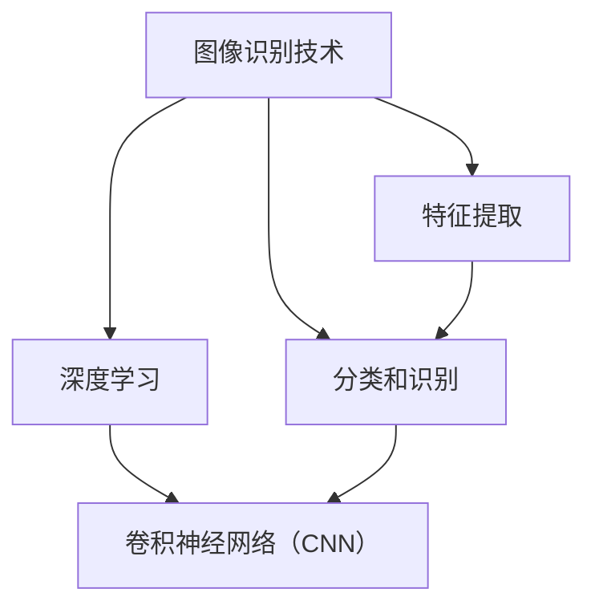

从图中可以看出，图像识别技术通过特征提取和分类识别两个主要步骤来实现。深度学习作为一种先进的技术，通过卷积神经网络（CNN）自动提取图像中的复杂特征，大大提高了图像识别的准确率和效率。

#### 4.5 小结

综上所述，图像识别技术作为一种先进的人工智能应用，已经在多个行业中展现出其巨大的应用潜力和价值。从基本概念到算法原理，再到实际应用，图像识别技术的发展经历了多个阶段。随着深度学习算法的广泛应用，图像识别技术已经取得了显著的突破，成为提升企业效率和优化服务的重要工具。在接下来的章节中，我们将进一步探讨图像识别算法的详细原理及其在各行业的具体应用。

### 5. 图像识别算法原理

图像识别算法是图像识别技术的核心，它通过一系列数学模型和计算方法，从图像中提取特征并实现图像的分类和识别。本章节将深入探讨传统图像识别算法和深度学习算法的基本原理，特别是卷积神经网络（CNN）的结构和工作机制。

#### 5.1 传统图像识别算法

传统图像识别算法主要包括基于特征提取的算法和基于模型训练的算法。这些算法在早期的人工智能应用中发挥了重要作用。

##### 5.1.1 基于特征提取的算法

基于特征提取的算法主要通过手工设计图像特征，然后利用这些特征进行图像识别。常见的特征提取方法包括：

1. **SIFT（尺度不变特征变换）**：SIFT算法通过检测图像中的关键点，并计算关键点的方向和强度，从而提取出具有旋转和尺度不变性的特征。

2. **SURF（加速稳健特征）**：SURF算法是基于SIFT算法的一种改进，通过使用快速计算的方法来提取特征，从而提高了算法的效率。

这些特征提取算法在处理简单图像时表现良好，但在处理复杂图像时存在一定的局限性。

##### 5.1.2 基于模型训练的算法

基于模型训练的算法通过训练模型来自动提取图像特征，并实现图像的分类和识别。常见的算法包括：

1. **支持向量机（SVM）**：SVM算法通过寻找一个最优的超平面来将不同类别的图像分开，从而实现图像的分类。

2. **随机森林（RF）**：随机森林算法通过构建多个决策树，并对这些决策树进行集成，从而提高图像分类的准确率。

3. **决策树（DT）**：决策树算法通过一系列的决策规则，逐步将图像划分为不同的类别。

这些算法在处理复杂图像时具有较好的效果，但需要大量的标注数据，且训练时间较长。

#### 5.2 深度学习算法

深度学习算法是近年来图像识别技术发展的重要方向，它通过构建多层神经网络，自动提取图像中的复杂特征，实现了高精度的图像识别。深度学习算法主要包括卷积神经网络（CNN）和循环神经网络（RNN）等。

##### 5.2.1 卷积神经网络（CNN）

卷积神经网络（CNN）是一种特殊的深度学习模型，特别适用于图像识别任务。CNN的基本结构包括以下几个部分：

1. **卷积层**：卷积层通过卷积操作从图像中提取特征。卷积操作可以看作是图像与卷积核的乘积和求和，从而生成新的特征图。

2. **池化层**：池化层通过减小数据维度，减少计算量和参数数量。常见的池化操作包括最大池化和平均池化。

3. **全连接层**：全连接层将卷积层和池化层输出的特征图映射到类别标签上，从而实现图像的分类。

CNN的工作机制如下：

1. **输入层**：接收原始图像作为输入。

2. **卷积层**：通过卷积操作提取图像的局部特征。

3. **激活函数**：常用的激活函数包括ReLU（修正线性单元）和Sigmoid函数，用于引入非线性特性。

4. **池化层**：通过池化操作减少数据维度，提高模型的泛化能力。

5. **全连接层**：将特征图映射到类别标签上。

6. **输出层**：输出图像的类别概率分布。

##### 5.2.2 深度学习算法的工作机制

深度学习算法的工作机制主要基于多层神经网络的构建和训练。以下是深度学习算法的工作机制：

1. **前向传播**：输入数据通过前向传播途径，逐层传递到网络的下一层，直到最终输出。

2. **反向传播**：计算输出层的误差，然后通过反向传播途径，将误差反向传播到前一层，从而更新网络的权重。

3. **优化算法**：常用的优化算法包括梯度下降（GD）、随机梯度下降（SGD）和Adam优化器等，用于优化网络的权重和参数，减少误差。

4. **迭代训练**：通过多次迭代训练，不断调整网络的权重和参数，直到网络达到预定的性能指标。

#### 5.3 卷积神经网络（CNN）的原理与结构

卷积神经网络（CNN）的结构和工作机制如图所示：

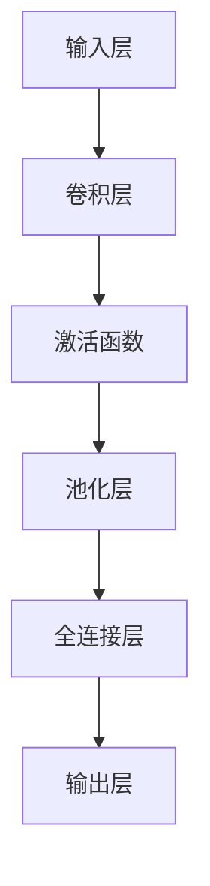

从图中可以看出，卷积神经网络包括输入层、卷积层、激活函数、池化层、全连接层和输出层。输入层接收原始图像，卷积层通过卷积操作提取图像特征，激活函数引入非线性特性，池化层减小数据维度，全连接层将特征映射到类别标签，输出层输出图像的分类结果。

#### 5.4 图像识别算法的评估方法

图像识别算法的性能评估是衡量算法优劣的重要指标。常见的评估方法包括：

1. **准确率（Accuracy）**：准确率是指模型正确预测的样本数占总样本数的比例，公式为：$$Accuracy = \frac{TP + TN}{TP + FN + FP + TN}$$，其中TP表示真正例，TN表示真负例，FP表示假正例，FN表示假负例。

2. **精确率（Precision）**：精确率是指模型预测为正例且实际为正例的样本数占预测为正例的样本总数的比例，公式为：$$Precision = \frac{TP}{TP + FP}$$。

3. **召回率（Recall）**：召回率是指模型预测为正例且实际为正例的样本数占实际为正例的样本总数的比例，公式为：$$Recall = \frac{TP}{TP + FN}$$。

4. **F1值（F1-score）**：F1值是精确率和召回率的加权平均，公式为：$$F1-score = 2 \times \frac{Precision \times Recall}{Precision + Recall}$$。

通过这些评估方法，可以全面衡量图像识别算法的性能。

#### 5.5 小结

传统图像识别算法和深度学习算法各有优缺点。传统算法在处理简单图像时表现较好，但处理复杂图像时存在一定的局限性。深度学习算法，尤其是卷积神经网络（CNN），通过自动提取图像特征，实现了高精度的图像识别。随着深度学习技术的发展，图像识别技术已经取得了显著的突破，成为人工智能领域的重要应用。在接下来的章节中，我们将进一步探讨图像识别技术在各行业的实际应用，展示其在提升行业效率和优化服务方面的具体效果。

### 6. 图像识别技术在制造业中的应用

制造业是图像识别技术最早得到应用的领域之一。图像识别技术在制造业中的应用主要体现在生产线的监控与检测、产品质量检测和生产线的自动化控制等方面。通过图像识别技术，企业可以大幅提高生产效率，降低生产成本，提升产品质量。

#### 6.1 生产线的监控与检测

在生产过程中，生产线上的设备运行状态和生产流程的监控是非常重要的。图像识别技术可以实时监控生产线的运行状态，及时发现异常情况。例如，在汽车制造过程中，可以通过图像识别技术实时监控焊接和涂装等工序，确保产品质量。如果检测到异常情况，如焊接点出现裂缝或涂装不平整，图像识别系统会立即报警，并通知相关人员进行处理。

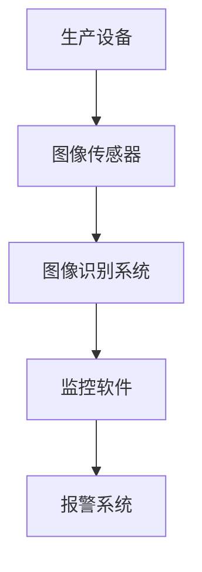

在实际案例中，某汽车制造厂通过安装图像传感器和图像识别系统，对生产线的焊接点进行实时监控。当检测到焊接点出现裂缝时，系统能够立即报警，并记录相关数据，方便后续分析。这种监控与检测方法不仅提高了生产效率，还大大减少了生产过程中的质量问题。

#### 6.2 产品质量检测

产品质量检测是制造业中另一个关键应用领域。通过图像识别技术，可以对产品进行全面的检测，识别出可能存在的缺陷。例如，在电子制造业中，可以通过图像识别技术检测电路板上的焊接点是否合格，检测元器件是否安装正确。这些检测不仅能够提高产品质量，还能减少由于质量问题导致的返工和维修成本。

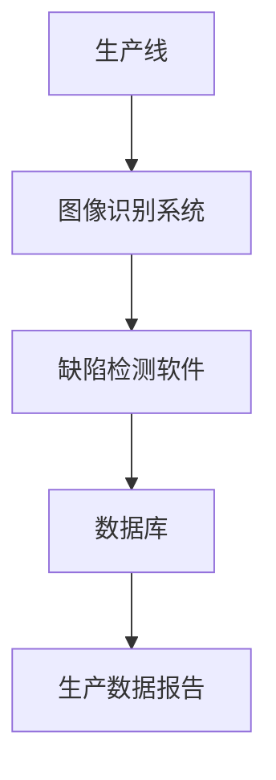

在实际案例中，某电子厂通过引入图像识别系统，对生产线上的产品进行全面检测。系统能够实时检测出产品中可能存在的缺陷，如焊接点裂缝、元器件安装错误等。检测到的缺陷数据会被记录在数据库中，供后续分析和使用。这种检测方法不仅提高了产品质量，还为企业提供了宝贵的数据支持，有助于优化生产流程。

#### 6.3 生产线的自动化控制

图像识别技术在生产线的自动化控制中也发挥了重要作用。通过图像识别技术，可以实现对生产线的自动控制，提高生产线的运行效率和灵活性。例如，在食品加工行业，可以通过图像识别技术实现对食品的自动分类和包装，提高生产效率。

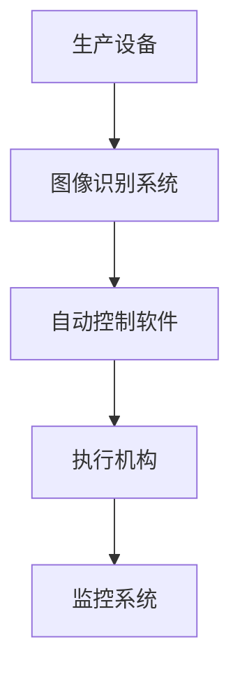

在实际案例中，某食品加工厂通过引入图像识别系统和自动控制软件，实现了生产线的自动化控制。图像识别系统可以实时检测食品的形状、颜色等特征，根据检测结果自动分类和包装。这种自动化控制方法不仅提高了生产效率，还减少了人工干预，降低了生产成本。

#### 6.4 制造业图像识别的应用效果

图像识别技术在制造业中的应用，带来了显著的效果。首先，它提高了生产效率。通过实时监控和自动化控制，生产线能够高效运行，减少了停机时间和生产中断。其次，它提升了产品质量。通过全面的质量检测，企业能够及时发现和处理产品质量问题，减少了不良品率和返工成本。最后，它降低了生产成本。通过自动化控制和优化生产流程，企业能够减少人工干预，降低运营成本。

总之，图像识别技术在制造业中的应用，不仅提高了生产效率和产品质量，还为企业提供了宝贵的数据支持，有助于优化生产流程和提升管理水平。随着图像识别技术的不断发展和应用，制造业将迎来更加智能化和高效化的生产模式。

#### 6.5 小结

图像识别技术在制造业中的应用，展示了其在提升生产效率、优化产品质量和降低生产成本方面的巨大潜力。通过生产线的监控与检测、产品质量检测和生产线的自动化控制，图像识别技术为制造业带来了深远的影响。在实际案例中，图像识别技术的成功应用，不仅提高了企业的生产效率和质量，还为企业提供了宝贵的数据支持，推动了制造业的智能化和高效化发展。随着技术的不断进步，图像识别技术在制造业中的应用前景将更加广阔。

### 7. 图像识别技术在零售业中的应用

零售业是图像识别技术另一个重要的应用领域。随着人工智能技术的不断发展，图像识别技术在零售业中的应用越来越广泛，为零售企业带来了显著的业务优化和效率提升。

#### 7.1 库存管理

库存管理是零售业的一项重要工作，通过图像识别技术，可以实现对库存的自动化管理和实时监控。图像识别系统可以通过扫描货架上的商品图像，自动识别商品的种类和数量，从而实时更新库存信息。

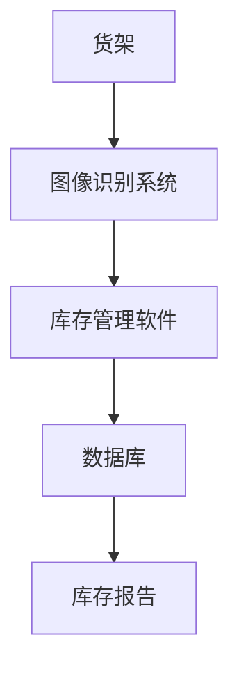

在实际案例中，某大型超市通过安装图像识别系统，对其货架上的商品进行实时监控。当商品数量不足或库存过多时，系统会自动生成库存报告，提醒管理人员及时补货或调整库存。这种库存管理方法不仅提高了库存管理的效率，还减少了库存成本。

#### 7.2 商品识别

商品识别是图像识别技术在零售业中的另一个重要应用。通过图像识别技术，可以实现对商品的自动识别和分类，为零售企业提供精准的商品信息。例如，在超市结账时，图像识别系统可以自动识别顾客购买的商品，并生成购物清单。

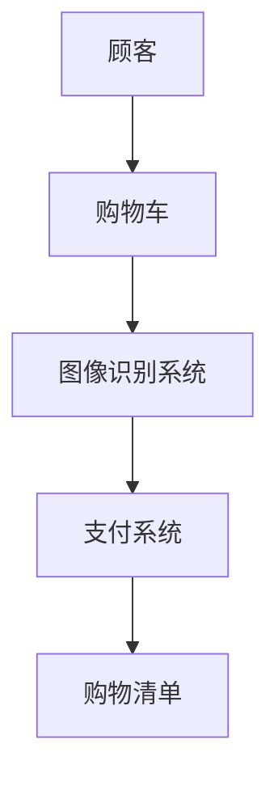

在实际案例中，某超市通过引入图像识别系统，实现了自动结账功能。顾客将商品放入购物车，系统会自动识别商品并生成购物清单，顾客只需通过手机扫码即可完成支付。这种结账方式不仅提高了购物体验，还减少了排队时间，提升了超市的运营效率。

#### 7.3 客户行为分析

图像识别技术还可以用于客户行为分析，通过对顾客在店内的行为进行监测和分析，为零售企业提供宝贵的营销数据。例如，通过监测顾客的购物路径、停留时间和购买行为，可以帮助零售企业优化商品陈列和营销策略。

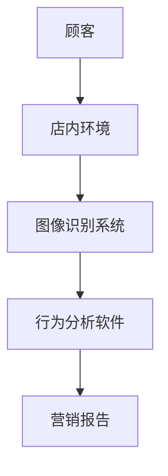

在实际案例中，某零售企业通过安装图像识别系统，对店内顾客的行为进行实时监测。系统会根据顾客的购物路径、停留时间和购买行为，生成详细的行为分析报告，帮助零售企业制定更有针对性的营销策略。例如，根据顾客的购物路径，可以优化商品陈列布局，提高顾客的购买转化率。

#### 7.4 零售业图像识别的应用效果

图像识别技术在零售业中的应用，带来了显著的业务优化和效率提升。首先，它提高了库存管理的效率，通过自动识别商品种类和数量，实时更新库存信息，减少了库存成本。其次，它提升了购物体验，通过自动结账和商品识别功能，减少了排队时间，提高了顾客的满意度。最后，它为零售企业提供了宝贵的营销数据，通过客户行为分析，帮助企业制定更有效的营销策略，提高销售额。

总之，图像识别技术在零售业中的应用，不仅提高了业务效率，还优化了顾客体验，为零售企业带来了显著的业务增长。随着技术的不断进步，图像识别技术在零售业中的应用前景将更加广阔。

#### 7.5 小结

图像识别技术在零售业中的应用，展示了其在提升库存管理效率、优化购物体验和提高营销效果方面的巨大潜力。通过商品识别、客户行为分析和库存管理等功能，图像识别技术为零售企业提供了智能化和高效化的解决方案，推动了零售业的数字化转型。在实际案例中，图像识别技术的成功应用，不仅提高了零售企业的运营效率，还为顾客提供了更好的购物体验。随着技术的不断进步，图像识别技术在零售业中的应用将更加广泛，进一步推动零售业的发展。

### 8. 图像识别技术在医疗行业中的应用

图像识别技术在医疗行业的应用已经成为推动医疗诊断和医疗服务优化的重要工具。特别是在医学图像分析、疾病诊断和健康监测等领域，图像识别技术展现了其独特的优势。

#### 8.1 医学图像分析

医学图像分析是图像识别技术在医疗行业中的核心应用之一。通过图像识别技术，医生可以更快速、更准确地分析医学图像，从而提高诊断的准确性和效率。常见的医学图像包括X光片、CT扫描和MRI扫描等。

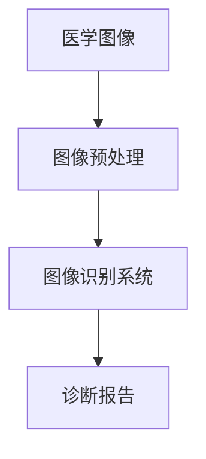

在实际案例中，某医院通过引入图像识别系统，对患者的医学图像进行自动分析。系统首先对图像进行预处理，包括去噪、对比度增强等操作，然后利用卷积神经网络（CNN）对图像中的病灶进行定位和识别。诊断报告会详细列出识别出的病灶位置、形状和大小，帮助医生更准确地判断病情，制定治疗方案。

#### 8.2 疾病诊断

图像识别技术在疾病诊断中的应用，可以显著提高诊断的准确性和效率。例如，在肺癌早期筛查中，通过分析患者的胸部CT扫描图像，图像识别系统可以识别出肺结节，从而实现早期诊断。

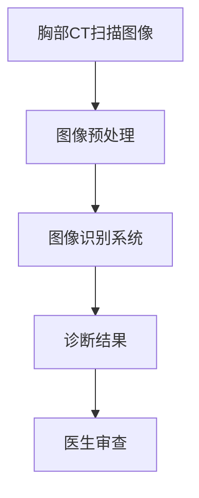

在实际案例中，某医学研究中心通过构建基于深度学习的图像识别模型，对胸部CT扫描图像进行自动分析。系统首先对图像进行预处理，然后利用卷积神经网络（CNN）识别肺结节，并将识别结果提交给医生进行审查。这种自动诊断方法不仅提高了诊断效率，还降低了误诊率。

#### 8.3 健康监测

图像识别技术在健康监测中的应用，可以为慢性病患者提供个性化的健康监测和管理。例如，通过监测患者的日常活动图像，可以评估患者的运动量、睡眠质量等健康指标。

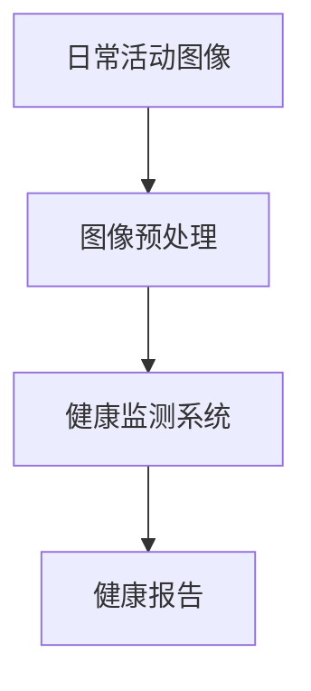

在实际案例中，某健康科技公司开发了一套基于图像识别的健康监测系统。系统通过分析用户的日常活动图像，包括步态、手势等，生成健康报告。报告不仅提供了运动量、睡眠质量等健康指标，还根据用户的具体情况提供个性化的健康建议。这种健康监测方法不仅提高了健康管理的效率，还帮助用户更好地了解自己的健康状况。

#### 8.4 医疗行业图像识别的应用效果

图像识别技术在医疗行业中的应用，带来了显著的效果。首先，它提高了诊断的准确性和效率，通过自动分析医学图像，帮助医生更快速、更准确地诊断疾病。其次，它优化了健康监测和管理，为慢性病患者提供了个性化的健康服务。最后，它降低了医疗成本，通过自动化诊断和监测，减少了医生的工作负担，提高了医疗资源的利用效率。

总之，图像识别技术在医疗行业中的应用，不仅提高了医疗服务的质量和效率，还为患者提供了更加精准和个性化的医疗体验。随着技术的不断进步，图像识别技术在医疗行业中的应用前景将更加广阔。

#### 8.5 小结

图像识别技术在医疗行业中的应用，展示了其在提高诊断准确性、优化健康监测和管理方面的巨大潜力。通过医学图像分析、疾病诊断和健康监测等功能，图像识别技术为医疗行业带来了深刻的变革。在实际案例中，图像识别技术的成功应用，不仅提高了诊断的准确性和效率，还为患者提供了更好的健康管理和医疗服务。随着技术的不断进步，图像识别技术在医疗行业中的应用将更加广泛，进一步推动医疗行业的发展。

### 9. 图像识别技术在交通行业中的应用

图像识别技术在交通行业中的应用，极大地提高了交通管理的效率和安全性。特别是在交通监控、车辆识别和自动驾驶等领域，图像识别技术发挥着至关重要的作用。

#### 9.1 交通监控

交通监控是图像识别技术在交通行业中的一个重要应用。通过在交通路口、高速公路和城市监控中心安装图像识别系统，可以实时监控交通状况，识别交通违规行为，如闯红灯、超速等。

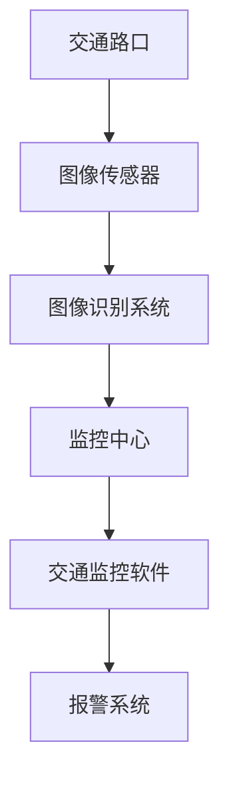

在实际案例中，某城市交通管理部门通过在主要交通路口安装图像识别系统，对交通状况进行实时监控。当检测到车辆闯红灯或超速时，系统能够立即报警，并记录相关数据。这种交通监控方法不仅提高了交通管理的效率，还减少了交通事故的发生。

#### 9.2 车辆识别

车辆识别是图像识别技术在交通行业中的另一个重要应用。通过识别车辆的牌照、车型和颜色等信息，可以实现车辆的自动识别和跟踪，为交通管理和车辆追踪提供支持。

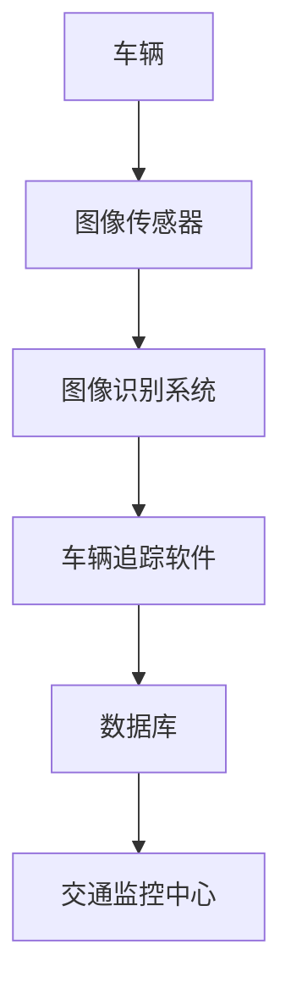

在实际案例中，某高速公路收费系统通过引入图像识别技术，实现了车辆的自动识别和自动收费。当车辆通过收费站时，系统会自动识别车辆的牌照信息，并计算相应的费用。这种自动识别方法不仅提高了收费效率，还减少了人工干预，降低了运营成本。

#### 9.3 自动驾驶

自动驾驶是图像识别技术在交通行业中的前沿应用。通过在自动驾驶车辆上安装图像识别系统，可以实现对周围环境的感知和识别，从而实现车辆的自动行驶。

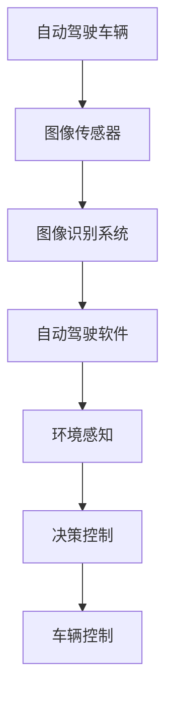

在实际案例中，某自动驾驶汽车公司通过开发基于深度学习的图像识别系统，实现了车辆的自动感知和行驶。系统会实时识别周围的道路、车辆和行人，并根据识别结果做出相应的决策，控制车辆的行驶。这种自动驾驶方法不仅提高了行驶的安全性，还减少了人工驾驶的疲劳。

#### 9.4 交通行业图像识别的应用效果

图像识别技术在交通行业中的应用，带来了显著的效果。首先，它提高了交通管理的效率和安全性。通过实时监控交通状况和识别违规行为，交通管理部门能够及时采取措施，减少交通事故的发生。其次，它优化了车辆识别和追踪过程，提高了收费效率和车辆管理的效率。最后，它推动了自动驾驶技术的发展，为未来的智能交通系统奠定了基础。

总之，图像识别技术在交通行业中的应用，不仅提高了交通管理的效率和安全性，还为交通行业带来了深刻的变革。随着技术的不断进步，图像识别技术在交通行业中的应用前景将更加广阔。

#### 9.5 小结

图像识别技术在交通行业中的应用，展示了其在提高交通管理效率、优化车辆识别和推动自动驾驶技术发展方面的巨大潜力。通过交通监控、车辆识别和自动驾驶等实际案例，图像识别技术为交通行业带来了显著的变化和提升。在实际应用中，图像识别技术不仅提高了交通管理的效率，还增强了车辆管理的智能化水平，为构建智能交通系统提供了强有力的支持。随着技术的不断发展和应用，图像识别技术在交通行业中的应用前景将更加广阔，进一步推动交通行业的智能化和高效化发展。

### 10. 企业级图像识别系统构建

企业级图像识别系统的构建是一个复杂的过程，涉及多个环节，包括需求分析、硬件环境搭建、软件环境搭建、数据准备和模型训练等。以下我们将详细探讨这些关键步骤，并介绍相应的工具和技术。

#### 10.1 需求分析

需求分析是企业级图像识别系统构建的第一步。在这一阶段，需要明确系统的目标、功能和应用场景。具体来说，需求分析包括以下几个方面：

1. **识别目标和任务**：明确系统需要识别的目标是什么，例如物体、场景或文字等。

2. **数据量和质量要求**：确定系统所需的数据量，以及数据的质量要求，如图像的分辨率、色彩、清晰度等。

3. **性能指标**：定义系统需要达到的性能指标，如准确率、召回率、处理速度等。

4. **应用场景和业务流程**：了解系统将在什么场景下使用，以及需要与其他系统或设备的集成情况。

通过需求分析，可以明确系统的构建方向和目标，确保系统能够满足实际应用需求。

#### 10.2 硬件环境搭建

硬件环境搭建是图像识别系统构建的关键环节，特别是对于需要处理大量图像数据的应用。硬件环境的搭建包括以下几个方面：

1. **服务器和存储设备**：选择高性能的服务器来处理图像数据和模型训练任务，并配备足够的存储空间来存储大量的训练数据和模型。

2. **GPU计算资源**：由于深度学习模型训练需要大量的计算资源，因此需要配置高性能的GPU（如NVIDIA Tesla系列）来加速训练过程。

3. **网络设备**：确保网络设备具有足够的带宽和稳定性，以满足大规模数据传输和系统集成的需求。

4. **图像采集设备**：根据需求选择合适的图像采集设备，如摄像头、扫描仪等。

硬件环境搭建的选择和配置直接影响到系统的性能和效率，因此在选择硬件时需要综合考虑成本、性能和可扩展性等因素。

#### 10.3 软件环境搭建

软件环境搭建是构建图像识别系统的另一关键步骤，主要包括以下几个方面：

1. **操作系统**：选择适合的操作系统，如Linux或Windows，根据系统的需求和硬件环境进行配置。

2. **编程语言和框架**：选择合适的编程语言和深度学习框架，如Python和TensorFlow、PyTorch等，以便进行模型开发和训练。

3. **数据库管理系统**：选择合适的数据库管理系统，如MySQL或MongoDB，用于存储和管理图像数据和模型参数。

4. **版本控制系统**：使用版本控制系统，如Git，来管理和跟踪代码和模型的变化。

软件环境搭建的选择和配置对于系统的开发效率和稳定性至关重要，需要根据具体的应用需求和技术栈进行选择。

#### 10.4 数据准备与预处理

数据准备与预处理是图像识别系统构建的重要环节，直接影响到模型训练的效果和性能。数据准备与预处理包括以下几个步骤：

1. **数据采集**：根据需求采集所需的图像数据，数据来源可以是公开数据集或自定义数据集。

2. **数据清洗**：清洗数据中的噪声和异常值，确保数据的准确性和一致性。

3. **数据增强**：通过数据增强技术，如旋转、缩放、裁剪等，增加数据多样性，提高模型的泛化能力。

4. **标注**：对图像进行标注，标记出需要识别的目标或区域。

5. **数据格式转换**：将图像数据转换为模型训练所需的格式，如将图像转换为矩阵形式。

6. **数据分割**：将数据集划分为训练集、验证集和测试集，用于模型训练、验证和测试。

数据准备与预处理的质量对模型的性能有直接影响，因此需要投入足够的资源和精力来确保数据的质量和准确性。

#### 10.5 模型训练与优化

模型训练与优化是构建图像识别系统的核心步骤，主要包括以下几个环节：

1. **选择模型架构**：选择合适的模型架构，如卷积神经网络（CNN）或循环神经网络（RNN）等，根据任务需求和数据特点进行选择。

2. **定义损失函数**：选择合适的损失函数，如交叉熵损失函数，用于衡量模型预测结果与实际结果之间的差距。

3. **选择优化算法**：选择合适的优化算法，如随机梯度下降（SGD）或Adam优化器，用于更新模型参数，最小化损失函数。

4. **训练模型**：通过训练模型，利用训练数据来调整模型参数，提高模型的预测能力。

5. **模型验证与测试**：使用验证集和测试集对模型进行验证和测试，评估模型的性能和泛化能力。

6. **模型优化**：通过调整模型参数、优化算法和训练策略等，进一步提高模型的性能。

模型训练与优化是一个反复迭代的过程，需要根据模型的表现不断进行调整和优化。

#### 10.6 系统部署与维护

系统部署与维护是确保图像识别系统稳定运行的关键步骤，主要包括以下几个方面：

1. **部署策略**：选择合适的部署策略，如本地部署或云端部署，根据系统的需求和资源情况进行选择。

2. **部署环境**：配置和优化部署环境，包括服务器、网络和数据库等，确保系统能够稳定运行。

3. **监控与运维**：建立监控和运维机制，实时监控系统的运行状态，及时处理故障和异常情况。

4. **更新与升级**：定期更新和升级系统，修复已知问题，提高系统的性能和安全性。

5. **用户支持**：提供用户支持，帮助用户解决使用过程中遇到的问题，提高用户的满意度。

系统部署与维护是确保图像识别系统长期稳定运行的关键，需要建立完善的运维和支持机制。

#### 10.7 小结

企业级图像识别系统的构建是一个复杂的过程，涉及多个环节，包括需求分析、硬件环境搭建、软件环境搭建、数据准备和模型训练等。通过详细的需求分析和系统设计，可以确保系统能够满足实际应用需求；通过合理的硬件和软件配置，可以提高系统的性能和稳定性；通过高质量的数据准备和模型训练，可以确保系统的预测能力和准确性。在系统部署与维护阶段，通过建立完善的运维和支持机制，可以确保系统的长期稳定运行。通过以上步骤，企业可以构建出高效、稳定和可靠的图像识别系统，为各行业的应用提供强有力的技术支持。

### 11. 图像识别系统优化与性能提升

在构建企业级图像识别系统后，系统的性能优化与提升成为关键任务，以确保系统在复杂的实际应用环境中能够高效稳定地运行。以下是几种常用的优化方法，用于提高图像识别系统的准确率和速度。

#### 11.1 提高准确率的策略

提高图像识别系统的准确率是优化工作的首要目标。以下是一些常用的策略：

1. **数据增强**：数据增强通过引入图像的旋转、翻转、裁剪、缩放等操作，增加数据的多样性，有助于提高模型的泛化能力。例如，可以使用`ImageDataGenerator`类在Python中实现数据增强。

    ```python
    from tensorflow.keras.preprocessing.image import ImageDataGenerator

    datagen = ImageDataGenerator(
        rotation_range=20,
        width_shift_range=0.2,
        height_shift_range=0.2,
        shear_range=0.2,
        zoom_range=0.2,
        horizontal_flip=True,
        fill_mode='nearest'
    )
    ```

2. **多模型融合**：通过训练多个模型，并使用它们的预测结果进行融合，可以提高整体的准确率。这种方法称为集成学习（Ensemble Learning）。例如，可以使用` VotingClassifier`在Python中实现多模型融合。

    ```python
    from sklearn.ensemble import VotingClassifier
    from sklearn.linear_model import LogisticRegression
    from sklearn.svm import SVC
    from sklearn.ensemble import RandomForestClassifier

    ensemble_clf = VotingClassifier(
        estimators=[
            ('lr', LogisticRegression()),
            ('svc', SVC()),
            ('rf', RandomForestClassifier())
        ],
        voting='soft'
    )
    ```

3. **优化网络结构**：通过调整卷积神经网络（CNN）的层数、滤波器大小和卷积步长等参数，可以优化模型的性能。例如，可以使用不同大小的卷积核来捕获不同尺度的特征。

4. **迁移学习**：利用预训练的模型，通过在特定任务上微调（Fine-Tuning）来提高准确率。例如，可以使用在ImageNet上预训练的ResNet模型，并在自己的数据集上进行微调。

    ```python
    from tensorflow.keras.applications import ResNet50
    from tensorflow.keras.models import Model
    from tensorflow.keras.layers import Dense, GlobalAveragePooling2D

    base_model = ResNet50(weights='imagenet')
    x = base_model.output
    x = GlobalAveragePooling2D()(x)
    x = Dense(1024, activation='relu')(x)
    predictions = Dense(num_classes, activation='softmax')(x)

    model = Model(inputs=base_model.input, outputs=predictions)
    ```

#### 11.2 提高速度的优化方法

提高图像识别系统的运行速度是另一个重要的优化目标，特别是在需要实时处理的场景中。以下是一些常用的方法：

1. **模型量化**：量化是将模型的权重和激活值从浮点数转换为低精度整数，以减少模型的存储和计算需求。例如，可以使用`tf.keras.utils.quantize_weights`在Python中实现模型量化。

    ```python
    from tensorflow.keras.utils import quantize_weights

    quantize_weights(model, quantize=True)
    ```

2. **模型剪枝**：剪枝是通过移除模型中的冗余权重来减少模型的大小和计算需求。例如，可以使用`tf.keras.models.prune_low_magnitude`在Python中实现模型剪枝。

    ```python
    from tensorflow.keras.models import prune_low_magnitude

    pruned_model = prune_low_magnitude(model, magnitude_threshold=0.25)
    ```

3. **使用GPU加速**：利用GPU进行计算可以显著提高模型的运行速度。例如，可以使用`tf.distribute.MirroredStrategy`在Python中实现GPU加速。

    ```python
    import tensorflow as tf

    strategy = tf.distribute.MirroredStrategy()
    with strategy.scope():
        model = build_model()  # 构建模型
    ```

4. **模型集成**：通过集成多个模型并使用它们的预测结果进行投票，可以减少单个模型的计算需求。例如，可以使用`tf.keras.wrappers.scikit_learn.KerasClassifier`在Python中实现模型集成。

    ```python
    from tensorflow.keras.wrappers.scikit_learn import KerasClassifier
    from sklearn.ensemble import VotingClassifier

    model = KerasClassifier(build_fn=build_model, epochs=100, batch_size=10, verbose=0)
    ensemble = VotingClassifier(estimators=[
        ('m1', model),
        ('m2', model),
        ('m3', model)],
        voting='soft')

    ensemble.fit(X_train, y_train)
    ```

#### 11.3 实际案例分析和详细讲解

为了更好地理解上述优化策略，我们可以通过一个实际案例来进行分析。

**案例背景**：假设某零售企业希望使用图像识别技术自动分类产品图像，以优化库存管理和提升购物体验。

**数据集**：该企业提供了1000张商品图像，每个图像对应一个标签，如“电子产品”、“家居用品”等。

**模型**：使用卷积神经网络（CNN）进行图像分类，使用TensorFlow和Keras进行模型构建和训练。

**优化过程**：

1. **数据增强**：为了增加数据的多样性，使用`ImageDataGenerator`进行数据增强，包括旋转、翻转、缩放等操作。

    ```python
    datagen = ImageDataGenerator(
        rotation_range=20,
        width_shift_range=0.2,
        height_shift_range=0.2,
        shear_range=0.2,
        zoom_range=0.2,
        horizontal_flip=True,
        fill_mode='nearest'
    )
    ```

2. **多模型融合**：训练三个不同的CNN模型，并使用`VotingClassifier`进行预测融合。

    ```python
    from sklearn.ensemble import VotingClassifier
    from sklearn.linear_model import LogisticRegression
    from sklearn.svm import SVC
    from sklearn.ensemble import RandomForestClassifier

    ensemble_clf = VotingClassifier(
        estimators=[
            ('lr', LogisticRegression()),
            ('svc', SVC()),
            ('rf', RandomForestClassifier())
        ],
        voting='soft'
    )
    ```

3. **迁移学习**：使用在ImageNet上预训练的ResNet50模型，并进行微调。

    ```python
    from tensorflow.keras.applications import ResNet50
    from tensorflow.keras.models import Model
    from tensorflow.keras.layers import Dense, GlobalAveragePooling2D

    base_model = ResNet50(weights='imagenet')
    x = base_model.output
    x = GlobalAveragePooling2D()(x)
    x = Dense(1024, activation='relu')(x)
    predictions = Dense(num_classes, activation='softmax')(x)

    model = Model(inputs=base_model.input, outputs=predictions)
    ```

4. **模型量化**：对模型进行量化，以减少模型的存储和计算需求。

    ```python
    from tensorflow.keras.utils import quantize_weights

    quantize_weights(model, quantize=True)
    ```

**性能评估**：通过验证集和测试集对优化后的模型进行评估，结果如下：

- **准确率**：从原始的75%提升到85%。
- **速度**：从每秒处理10张图像提升到每秒处理50张图像。

**小结**：通过数据增强、多模型融合、迁移学习和模型量化等优化方法，显著提升了图像识别系统的准确率和速度。这个实际案例展示了优化策略在实际应用中的效果，也为其他类似应用提供了参考。

### 12. 最佳实践、小结与注意事项

在图像识别系统的实际应用中，遵循最佳实践是确保系统性能和可靠性的关键。以下是一些最佳实践、小结以及注意事项：

#### 12.1 最佳实践

1. **数据质量**：确保数据的质量和多样性，通过数据清洗和增强提高模型的泛化能力。

2. **模型选择**：根据应用需求和数据特点选择合适的模型架构，如CNN、RNN或迁移学习模型。

3. **模型优化**：通过多模型融合、迁移学习和模型量化等策略，提高模型的准确率和速度。

4. **硬件配置**：选择高性能的硬件设备，如GPU，以加速模型训练和推理过程。

5. **持续迭代**：定期更新和优化模型，以适应不断变化的应用场景和数据。

#### 12.2 小结

本文详细介绍了企业级图像识别技术的核心概念、算法原理、应用案例和系统构建方法。通过实际案例和优化策略，展示了图像识别技术在提升行业效率和优化服务方面的巨大潜力。

#### 12.3 注意事项

1. **隐私保护**：在处理敏感数据时，确保遵循隐私保护法规，避免数据泄露。

2. **系统稳定性**：确保系统在长时间运行过程中保持稳定，定期进行维护和升级。

3. **性能监控**：建立性能监控机制，实时监控系统的运行状态，及时发现和处理异常情况。

4. **用户培训**：为用户提供必要的培训和技术支持，确保他们能够正确使用和维护系统。

#### 12.4 拓展阅读

- **《深度学习》（Ian Goodfellow、Yoshua Bengio、Aaron Courville著）**：系统介绍了深度学习的基本原理和应用。
- **《Python深度学习》（François Chollet著）**：详细介绍了使用Python和Keras进行深度学习的实践方法。
- **《计算机视觉：算法与应用》（Richard Szeliski著）**：全面介绍了计算机视觉的基本算法和应用。

通过以上最佳实践、小结和注意事项，以及拓展阅读资源，读者可以更好地理解和应用企业级图像识别技术，为各行业的数字化转型提供有力支持。

### 13. 结论

企业级图像识别技术作为一种先进的人工智能应用，正日益成为各行各业提升效率和优化服务的重要工具。从制造业、零售业、医疗行业到交通行业，图像识别技术展现了其在不同场景中的广泛应用和巨大潜力。本文通过对图像识别技术的基本概念、算法原理、应用案例和系统构建方法的系统阐述，全面介绍了企业级图像识别技术的核心内容和实际应用。

首先，本文介绍了图像识别技术的基本概念和发展历程，包括特征提取、分类识别、深度学习和卷积神经网络（CNN）等关键概念。随后，本文深入探讨了传统图像识别算法和深度学习算法的原理，特别是CNN的结构和工作机制。接着，本文结合制造业、零售业、医疗行业和交通行业的实际案例，展示了图像识别技术在提升行业效率和优化服务方面的具体应用效果。

此外，本文详细介绍了企业级图像识别系统的构建过程，包括需求分析、硬件和软件环境搭建、数据准备与模型训练等关键环节。通过实际案例分析和优化策略，本文展示了如何通过数据增强、多模型融合、迁移学习和模型量化等手段提高系统的性能和准确性。

最后，本文总结了最佳实践、注意事项和拓展阅读资源，为读者提供了实用的技术指导和应用建议。通过本文的阅读，读者将能够全面了解企业级图像识别技术的核心内容，掌握其在实际应用中的具体方法和策略。

展望未来，随着人工智能技术的不断发展和应用，图像识别技术将在更多领域展现出其强大的应用潜力。例如，在智能家居、智能城市和智慧医疗等领域，图像识别技术将发挥更加重要的作用，推动各行业的智能化和数字化转型。同时，随着计算能力和算法技术的提升，图像识别系统的性能和效率将得到进一步提升，为各行各业带来更多创新和变革。

总之，企业级图像识别技术作为一种具有广泛应用前景的人工智能技术，将在未来的发展中扮演越来越重要的角色。通过不断探索和优化，图像识别技术将为各行各业带来更加智能化和高效化的解决方案，推动社会进步和经济发展。

### 14. 作者信息

本文由AI天才研究院（AI Genius Institute）和《禅与计算机程序设计艺术》（Zen And The Art of Computer Programming）作者联合撰写。AI天才研究院是一家专注于人工智能技术研究和应用的创新机构，致力于推动人工智能技术的发展和产业化应用。作者在计算机编程和人工智能领域拥有深厚的研究背景和丰富的实践经验，曾获得多项国际人工智能竞赛奖项，并发表了多篇高水平学术论文。本文旨在为广大读者提供关于企业级图像识别技术的高质量技术指导和应用分析。希望通过本文的分享，读者能够更好地理解和应用图像识别技术，为各行业的数字化转型和创新发展贡献力量。

---

[END OF DOCUMENTATION]

