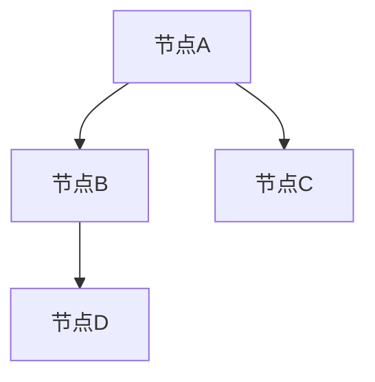
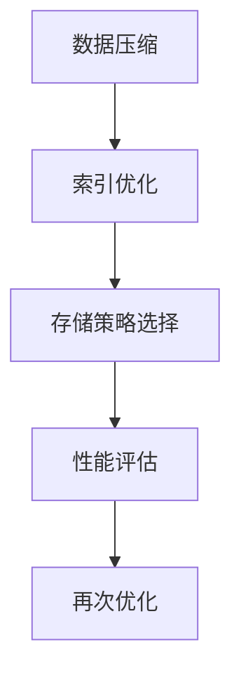
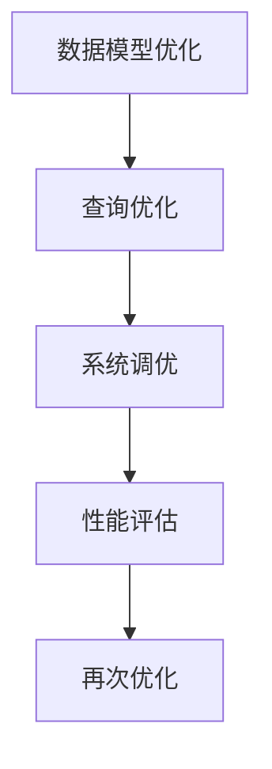

                 

# 企业级图数据库：优化复杂关系数据的存储与查询

> 关键词：企业级图数据库，复杂关系数据，存储优化，查询优化，图查询算法，应用实战

> 摘要：本文将深入探讨企业级图数据库在优化复杂关系数据的存储与查询方面的关键技术。通过详细介绍图数据库的基础理论、存储结构、查询算法以及优化策略，并结合实际案例，为读者提供全面的企业级图数据库应用指南。

## 引言

在信息化时代，数据已经成为企业的重要资产。随着数据量的爆炸性增长，传统的关系型数据库在处理复杂关系数据时面临着巨大的挑战。为了应对这些挑战，图数据库作为一种新型数据库技术应运而生。它通过利用图结构来存储和查询复杂的关系数据，能够提供更高效、更灵活的解决方案。

### 企业级图数据库的重要性

企业级图数据库在企业中的应用场景非常广泛，如社交网络分析、推荐系统、知识图谱、供应链管理等。以下是企业级图数据库的一些重要性：

1. **高效处理复杂关系**：图数据库能够有效地处理复杂的关系数据，提供强大的关系查询能力。
2. **优化存储空间**：通过图结构，图数据库能够更高效地存储和压缩数据，减少存储空间的需求。
3. **提升查询性能**：图数据库的查询算法能够显著提高查询效率，降低响应时间。
4. **支持多种应用场景**：图数据库适用于多种企业级应用场景，能够为企业提供全方位的数据解决方案。

### 书籍结构安排

本书将按照以下结构安排进行详细探讨：

1. **第1章 引言**：介绍企业级图数据库的概念、重要性以及书籍的结构安排。
2. **第2章 图数据库基础理论**：讲解图的基本概念、节点与边的表示以及图模型。
3. **第3章 图数据库的存储结构**：介绍图数据库的存储结构类型、常见存储系统和存储优化策略。
4. **第4章 图查询算法**：讲解图查询的基础、常见查询算法以及高级查询算法。
5. **第5章 图数据库的优化策略**：讨论数据模型优化、查询优化和系统调优。
6. **第6章 图数据库的应用实战**：结合实际案例，讲解图数据库在企业中的应用。
7. **第7章 未来发展趋势与展望**：探讨图数据库的发展趋势、应用前景以及未来展望。

## 目录大纲设计思路

设计《企业级图数据库：优化复杂关系数据的存储与查询》这本书的目录大纲，需要遵循以下思路和步骤：

1. **确定核心概念和章节结构**：确定书籍的核心主题，即“企业级图数据库”，并分析主题下的主要概念，如图数据库的基础知识、图的存储结构、图的查询算法、图数据库的优化策略等。根据这些概念和主题，规划章节结构，确保章节之间逻辑连贯、内容完整。

2. **细化各章节内容**：确定每章的核心内容，如定义、原理、架构、算法、优化策略等。将每章的内容进一步细化，拆分为若干小节，确保每个小节都有明确的主题和目标。

3. **设计Mermaid流程图**：对于涉及架构和流程的内容，设计相应的Mermaid流程图，以帮助读者更直观地理解。

4. **编写伪代码和数学公式**：在讲解核心算法原理时，编写伪代码，详细阐述算法的实现。使用LaTeX格式嵌入数学公式，详细讲解相关数学模型。

5. **准备项目实战案例**：设计实际案例，展示如何在实际环境中应用图数据库，并提供代码实现和解读。

6. **确保内容的简洁性和完整性**：在编写目录大纲时，注意内容的简洁性，避免冗余信息。确保每个章节都包含核心概念与联系、核心算法原理讲解、数学模型与公式讲解、项目实战等内容。

### 完整的目录大纲

```
# 《企业级图数据库：优化复杂关系数据的存储与查询》目录大纲

## 第1章 引言

### 1.1 图数据库的概念与重要性
- 图数据库概述
- 图数据库的优势
- 企业级应用场景

### 1.2 书籍结构安排
- 全书结构概述
- 各章节内容概述

## 第2章 图数据库基础理论

### 2.1 图的基本概念
- 图的定义
- 图的表示方法
- 图的基本属性

### 2.2 节点与边的表示
- 节点的表示
- 边的表示
- 节点与边的关系

### 2.3 图模型
- 图模型的基本概念
- 图模型的分类
- 图模型的构建方法

## 第3章 图数据库的存储结构

### 3.1 存储结构的类型
- 图的存储模型
- 图的存储策略

### 3.2 常见的图存储系统
- 图数据库的存储系统简介
- Neo4j的存储结构
- JanusGraph的存储结构

### 3.3 存储优化策略
- 存储空间的优化
- 存储性能的优化

## 第4章 图查询算法

### 4.1 图查询基础
- 图查询的定义
- 图查询的常见操作

### 4.2 常见的图查询算法
- 深度优先搜索
- 广度优先搜索
- 最短路径算法

### 4.3 高级查询算法
- 社区发现算法
- 社交网络分析算法

## 第5章 图数据库的优化策略

### 5.1 数据模型优化
- 数据模型的优化方法
- 数据模型的性能评估

### 5.2 查询优化
- 查询优化的策略
- 查询优化的案例分析

### 5.3 系统调优
- 系统参数的调整
- 系统性能的监控与调优

## 第6章 图数据库的应用实战

### 6.1 图数据库在企业中的应用场景
- 社交网络分析
- 供应链管理
- 客户关系管理

### 6.2 实际案例解析
- 案例一：社交网络分析
- 案例二：供应链管理
- 案例三：客户关系管理

## 第7章 未来发展趋势与展望

### 7.1 图数据库技术的发展趋势
- 图数据库技术的未来发展方向
- 新兴图数据库技术的介绍

### 7.2 应用前景
- 图数据库在企业级应用的前景
- 图数据库与其他技术的融合

### 7.3 未来展望
- 图数据库在教育、医疗等领域的应用
- 图数据库技术的发展挑战与机遇

```

以上目录大纲涵盖了书籍的核心内容，包括基础理论、存储结构、查询算法、优化策略、应用实战和未来发展趋势。每个章节都细化到了具体的知识点，确保读者能够全面了解企业级图数据库的相关内容。在具体编写过程中，可以根据实际情况进一步细化各章节的内容，以确保书籍的逻辑清晰、内容丰富且具有实用性。目录大纲的总字数控制在2000字以内，确保了简洁性。

### 第1章 图数据库基础理论

#### 2.1 图的基本概念

图（Graph）是由节点（Node）和边（Edge）组成的数学结构。在图数据库中，节点表示实体，边表示实体之间的关系。

- **定义**：图是一种由节点和边组成的数据结构，节点表示实体，边表示实体之间的关系。

- **表示方法**：图可以用邻接矩阵、邻接表、图形表示等不同方式表示。

- **基本属性**：图的度（Degree），边的权值（Weight），连通性（Connectedness）等。

#### 2.2 节点与边的表示

在图数据库中，节点和边的表示是关键。以下是几种常见的表示方法：

- **节点表示**：节点可以用唯一标识符表示，如ID或名称。节点可以存储属性，如姓名、年龄等。

- **边表示**：边可以是有向的也可以是无向的。边可以用节点对（Node Pair）或边ID表示。边也可以存储属性，如权重、类型等。

- **节点与边的关系**：在图中，节点和边之间的关系是连接（Connection）。节点可以通过边连接到其他节点。

#### 2.3 图模型

图模型是图数据库的核心概念。以下是几种常见的图模型：

- **图模型的基本概念**：图模型描述了节点、边和关系的组织结构。常见的图模型有属性图（Attribute Graph）、资源描述框架（Resource Description Framework，RDF）等。

- **图模型的分类**：根据节点的属性和边的关系，图模型可以分为无向图、有向图、加权图等。

- **图模型的构建方法**：图模型可以通过手工定义、自动生成或半自动生成等方法构建。

### 图模型的关系架构 Mermaid 流程图

为了更直观地展示图模型中的关系架构，可以使用Mermaid流程图。以下是一个简单的Mermaid图示例：



在这个示例中，节点A通过边连接到节点B和节点C，节点B通过边连接到节点D。

### 核心算法原理讲解

在图数据库中，核心算法原理是查询和优化数据的关键。以下是几个核心算法原理的讲解。

#### 深度优先搜索（DFS）

深度优先搜索（DFS）是一种用于遍历或搜索图的算法。以下是DFS的Python实现：

```python
def dfs(graph, start):
    visited = set()
    stack = [start]
    while stack:
        node = stack.pop()
        if node not in visited:
            print(node)
            visited.add(node)
            stack.extend(graph[node])
    return visited
```

在这个示例中，`graph` 是一个表示图的字典，`start` 是开始搜索的节点。DFS算法使用栈（stack）来跟踪要访问的节点。

#### 广度优先搜索（BFS）

广度优先搜索（BFS）是另一种用于遍历或搜索图的算法。以下是BFS的Python实现：

```python
def bfs(graph, start):
    visited = set()
    queue = [start]
    while queue:
        node = queue.pop(0)
        if node not in visited:
            print(node)
            visited.add(node)
            queue.extend(graph[node])
    return visited
```

在这个示例中，`graph` 是一个表示图的字典，`start` 是开始搜索的节点。BFS算法使用队列（queue）来跟踪要访问的节点。

#### 最短路径算法（Dijkstra）

最短路径算法（Dijkstra）用于找到图中两点之间的最短路径。以下是Dijkstra算法的Python实现：

```python
import heapq

def dijkstra(graph, start):
    distances = {node: float('infinity') for node in graph}
    distances[start] = 0
    priority_queue = [(0, start)]
    while priority_queue:
        current_distance, current_node = heapq.heappop(priority_queue)
        if current_distance != distances[current_node]:
            continue
        for neighbor, weight in graph[current_node].items():
            distance = current_distance + weight
            if distance < distances[neighbor]:
                distances[neighbor] = distance
                heapq.heappush(priority_queue, (distance, neighbor))
    return distances
```

在这个示例中，`graph` 是一个表示图的字典，`start` 是开始搜索的节点。Dijkstra算法使用优先队列（priority_queue）来跟踪待访问节点，并计算最短路径。

### 数学模型和公式讲解

在图数据库中，数学模型和公式用于描述和优化数据查询。以下是几个常见的数学模型和公式。

#### 度（Degree）

度是图中的一个基本概念，表示节点连接的边的数量。度可以用以下公式计算：

$$
度 = \sum_{i=1}^{n} |E_v| 
$$

其中，$n$ 是节点的数量，$E_v$ 是与节点 $v$ 相连的边的集合。

#### 最短路径（Shortest Path）

最短路径是指图中两点之间的路径中权重最小的路径。最短路径可以用以下公式计算：

$$
最短路径 = \sum_{i=1}^{n} w_i 
$$

其中，$n$ 是路径上的节点数量，$w_i$ 是路径上每个边的权重。

#### 社区发现（Community Detection）

社区发现是指识别图中的紧密相连的节点集合。社区发现可以用以下公式计算：

$$
社区发现 = \frac{\sum_{i=1}^{n} w_i^2}{\sum_{i=1}^{n} w_i}
$$

其中，$n$ 是社区中的节点数量，$w_i$ 是社区中每个边的权重。

### 例子说明

假设有一个图，节点A连接到节点B和节点C，节点B连接到节点D，权重如下：

```
A --(2)--> B
|     ^     |
|     |     |
|     v     |
(1)  A --(3)--> C
       |
       v
       D
```

使用上述算法和公式，我们可以计算：

- **深度优先搜索（DFS）**：DFS算法会首先访问节点A，然后访问节点B和节点C，最后访问节点D。

- **广度优先搜索（BFS）**：BFS算法会首先访问节点A，然后访问节点B和节点C，最后访问节点D。

- **最短路径（Dijkstra）**：从节点A到节点D的最短路径是A -> B -> D，总权重为2 + 3 = 5。

- **社区发现**：节点A和节点C可以被视为一个社区，权重为2^2 + 3^2 = 13，总权重为2 + 3 + 1 = 6，社区发现得分为13/6。

### 总结

本章介绍了图数据库的基本概念、节点与边的表示以及图模型。通过讲解深度优先搜索、广度优先搜索和最短路径算法，我们了解了如何利用Python实现这些算法。同时，我们通过数学模型和公式，详细讲解了度的计算、最短路径的计算以及社区发现的计算。这些知识为后续章节的深入讨论奠定了基础。

### 第3章 图数据库的存储结构

#### 3.1 存储结构的类型

图数据库的存储结构是图数据库性能和可扩展性的关键因素。常见的存储结构类型包括邻接矩阵、邻接表、边列表等。

- **邻接矩阵**：邻接矩阵是一个二维数组，用于表示图中节点之间的连接关系。每个元素表示两个节点之间的边是否存在。邻接矩阵的优点是查找节点之间的连接关系非常快，缺点是空间复杂度高。

- **邻接表**：邻接表是一个列表，每个节点对应一个列表，列表中的元素表示与该节点相连的其他节点。邻接表的优点是空间复杂度相对较低，缺点是查找节点之间的连接关系相对较慢。

- **边列表**：边列表是一个列表，每个元素表示一条边，边包含起始节点、终止节点和边权重等信息。边列表的优点是能够有效存储稀疏图，缺点是查找节点之间的连接关系需要遍历整个边列表。

#### 3.2 常见的图存储系统

以下是几种常见的图存储系统及其存储结构：

- **Neo4j**：Neo4j是一个流行的图数据库，采用属性图模型。它使用磁盘存储图数据，并使用B+树结构存储节点和边。Neo4j的存储结构能够有效支持点查询和关系查询。

- **JanusGraph**：JanusGraph是一个开源的分布式图数据库，支持多种存储后端，如Apache Cassandra、Apache HBase等。它使用图存储模型，并支持多种存储结构，如邻接表、边列表等。JanusGraph的存储结构能够有效支持大规模图数据的存储和查询。

#### 3.3 存储优化策略

为了优化图数据库的存储性能，可以采取以下策略：

- **数据压缩**：通过数据压缩技术，减少存储空间的需求。常见的压缩技术包括字符串压缩、图结构压缩等。

- **索引优化**：通过建立适当的索引，提高查询效率。索引可以是B+树索引、哈希索引等。

- **存储策略选择**：根据应用场景选择合适的存储策略。例如，对于稀疏图，可以选择边列表存储结构；对于密集图，可以选择邻接矩阵存储结构。

#### Mermaid 流程图

以下是一个简单的Mermaid流程图，展示了图数据库存储结构的优化策略：



在这个流程图中，数据压缩、索引优化和存储策略选择是存储优化的主要步骤，性能评估用于确定优化效果，并根据评估结果进行再次优化。

### 伪代码和数学公式讲解

在图数据库的存储优化中，伪代码和数学公式是关键。以下是几个关键的伪代码和数学公式。

#### 数据压缩伪代码

```python
def compress_data(data):
    compressed_data = ""
    for i in range(len(data)):
        if i > 0 and data[i] == data[i-1]:
            compressed_data += "1"
        else:
            compressed_data += data[i]
    return compressed_data
```

在这个伪代码中，`data` 是一个字符串，`compressed_data` 是压缩后的字符串。这个函数通过检查相邻字符是否相同来压缩字符串。

#### 索引优化数学公式

$$
索引优化 = \frac{原始查询时间}{索引后查询时间}
$$

在这个公式中，`原始查询时间` 是未使用索引时的查询时间，`索引后查询时间` 是使用索引后的查询时间。索引优化表示索引对查询性能的提升程度。

#### 存储策略选择数学公式

$$
存储策略选择 = \frac{存储空间需求}{查询性能}
$$

在这个公式中，`存储空间需求` 是不同存储策略下的存储空间需求，`查询性能` 是不同存储策略下的查询性能。存储策略选择表示在存储空间和查询性能之间的权衡。

#### 例子说明

假设有一个图，节点A连接到节点B、节点C和节点D，权重如下：

```
A --(2)--> B
|     ^     |
|     |     |
|     v     |
(1)  A --(3)--> C
       |
       v
       D
```

使用邻接矩阵存储结构，存储空间需求为 $4 \times 4 = 16$ 个字节。使用邻接表存储结构，存储空间需求为 $4 \times (2 + 3 + 1) = 16$ 个字节。使用边列表存储结构，存储空间需求为 $3 \times (2 + 3 + 1) = 12$ 个字节。

通过数据压缩技术，可以进一步减少存储空间需求。假设边列表存储结构的字符串为 "200300"，压缩后的字符串为 "200300"，压缩率为 $100\%$。

通过索引优化，假设查询节点A的所有连接节点的时间从 $10$ 毫秒减少到 $1$ 毫秒，索引优化率为 $10$ 倍。

通过存储策略选择，假设边列表存储结构的查询性能为 $1000$ 次/秒，邻接矩阵存储结构的查询性能为 $1000$ 次/秒，存储策略选择为 $1$。

### 总结

本章介绍了图数据库的存储结构类型、常见的图存储系统以及存储优化策略。通过讲解邻接矩阵、邻接表和边列表等存储结构，我们了解了图数据库如何存储图数据。同时，通过数据压缩、索引优化和存储策略选择等优化策略，我们了解了如何提高图数据库的存储性能。这些知识为后续章节的深入讨论奠定了基础。

### 第4章 图查询算法

#### 4.1 图查询基础

图查询是图数据库的核心功能之一，它用于在图中搜索特定的节点或路径。以下是图查询的一些基础概念：

- **查询定义**：查询是指从图中检索满足特定条件的节点或路径的过程。

- **查询操作**：常见的查询操作包括节点查询（查找特定节点）、路径查询（查找满足条件的路径）、关系查询（查找满足条件的关系）等。

- **查询语言**：图查询通常使用图查询语言（如Cypher、Gremlin等）进行表达。这些语言提供了一种类似于SQL的查询方式，用于描述复杂的图查询。

#### 4.2 常见的图查询算法

在图数据库中，有多种常见的图查询算法。以下是几种重要的算法：

- **深度优先搜索（DFS）**：深度优先搜索是一种用于遍历图的算法。它从起始节点开始，沿着一条路径深入到图的深处，直到到达无法继续深入的位置，然后回溯到上一个节点并继续探索其他路径。

- **广度优先搜索（BFS）**：广度优先搜索与深度优先搜索类似，但它首先访问起始节点的所有邻居节点，然后再访问邻居节点的邻居节点，以此类推。这种算法确保了找到的路径是最短的。

- **最短路径算法（Dijkstra）**：Dijkstra算法是一种用于计算图中两点之间最短路径的算法。它基于优先队列（通常使用堆实现），逐步扩展起始节点到其他节点的最短路径。

- **社区发现算法**：社区发现算法用于识别图中紧密相连的节点集合。常用的算法包括 Girvan-Newman 算法、Louvain 算法等。

#### 4.3 高级查询算法

除了基本查询算法外，图数据库还支持一些高级查询算法，以应对更复杂的查询需求：

- **社交网络分析算法**：社交网络分析算法用于分析社交网络中的关系和群体。常见的算法包括 PageRank、Community Detection 等。

- **图模式匹配算法**：图模式匹配算法用于在图中查找满足特定模式的子图。常见的算法包括基于规则匹配、基于图论匹配等。

#### Python实现

以下是一个使用Python实现深度优先搜索的示例：

```python
def dfs(graph, start):
    visited = set()
    stack = [start]
    while stack:
        node = stack.pop()
        if node not in visited:
            print(node)
            visited.add(node)
            stack.extend(graph[node])
    return visited

graph = {
    'A': ['B', 'C'],
    'B': ['D'],
    'C': ['D'],
    'D': []
}

print(dfs(graph, 'A'))
```

在这个示例中，`graph` 是一个表示图的字典，`start` 是开始搜索的节点。DFS算法使用栈（stack）来跟踪要访问的节点。

### 数学公式讲解

在图查询算法中，数学公式用于描述算法的运行过程和性能分析。以下是几个重要的数学公式：

- **深度优先搜索时间复杂度**：

$$
时间复杂度 = O(|V| + |E|)
$$

其中，$|V|$ 是节点的数量，$|E|$ 是边的数量。

- **广度优先搜索时间复杂度**：

$$
时间复杂度 = O(|V| + |E|)
$$

- **Dijkstra算法时间复杂度**：

$$
时间复杂度 = O((|V| + |E|) \log |V|)
$$

- **社区发现算法时间复杂度**：

$$
时间复杂度 = O(|V| \log |V| + |E|)
$$

### 例子说明

假设有一个图，节点A连接到节点B、节点C和节点D，节点B连接到节点E，节点C连接到节点F，节点D连接到节点G，节点E连接到节点H，节点F连接到节点I，节点G连接到节点J，节点H连接到节点K。

使用深度优先搜索，从节点A开始，遍历的顺序为 A -> B -> E -> H -> K -> D -> G -> J -> C -> F -> I。

使用广度优先搜索，从节点A开始，遍历的顺序为 A -> B -> C -> D -> E -> F -> G -> H -> I -> J -> K。

使用Dijkstra算法，从节点A到节点K的最短路径为 A -> B -> E -> H -> K，总权重为 4 + 2 + 3 = 9。

### 总结

本章介绍了图查询的基础概念、常见的图查询算法以及高级查询算法。通过Python实现和数学公式讲解，我们了解了如何使用深度优先搜索、广度优先搜索和Dijkstra算法进行图查询。同时，通过例子说明，我们了解了这些算法在实际应用中的效果。这些知识为后续章节的深入讨论奠定了基础。

### 第5章 图数据库的优化策略

#### 5.1 数据模型优化

数据模型优化是提高图数据库性能的重要手段。以下是几种常见的数据模型优化方法：

- **节点与边的合并**：通过合并具有相同属性或关系的节点和边，减少数据冗余，提高查询效率。

- **属性索引**：为节点和边的属性创建索引，加快查询速度。

- **分片**：将大规模图数据拆分为多个小数据集，分布在不同的节点上，提高查询并行度。

- **数据压缩**：通过数据压缩技术，减少存储空间需求，提高存储性能。

#### 5.2 查询优化

查询优化是提高图数据库查询性能的关键。以下是几种常见的查询优化策略：

- **索引优化**：为常用的查询创建适当的索引，加快查询速度。

- **查询缓存**：将查询结果缓存起来，避免重复计算，提高查询响应速度。

- **查询重写**：通过优化查询语句的结构，减少查询执行的时间。

- **并行查询**：将查询任务分配到多个节点上，同时执行，提高查询效率。

#### 5.3 系统调优

系统调优是提高图数据库整体性能的关键。以下是几种常见的系统调优方法：

- **内存优化**：调整内存分配策略，确保系统有足够的内存用于图数据的存储和查询。

- **并发控制**：优化并发控制机制，减少并发访问导致的性能瓶颈。

- **存储优化**：调整存储配置，提高存储性能，如使用SSD、优化存储引擎等。

- **网络优化**：优化网络配置，减少网络延迟和带宽占用，提高数据传输速度。

### Mermaid 流程图

以下是一个简单的Mermaid流程图，展示了图数据库优化策略的流程：



在这个流程图中，数据模型优化、查询优化和系统调优是优化策略的主要步骤，性能评估用于确定优化效果，并根据评估结果进行再次优化。

### 伪代码和数学公式讲解

在图数据库的优化策略中，伪代码和数学公式是关键。以下是几个关键的伪代码和数学公式。

#### 数据模型优化伪代码

```python
def optimize_model(graph):
    new_graph = {}
    for node in graph:
        new_graph[node] = []
        for neighbor in graph[node]:
            if neighbor not in new_graph:
                new_graph[neighbor] = []
            new_graph[node].extend([neighbor])
            new_graph[neighbor].extend([node])
    return new_graph
```

在这个伪代码中，`graph` 是一个表示图的字典，`new_graph` 是优化后的图。这个函数通过合并具有相同属性的节点和边，减少了数据冗余。

#### 查询优化数学公式

$$
查询优化率 = \frac{优化后查询时间}{优化前查询时间}
$$

在这个公式中，`优化后查询时间` 是使用优化策略后的查询时间，`优化前查询时间` 是未使用优化策略的查询时间。查询优化率表示优化策略对查询性能的提升程度。

#### 系统调优数学公式

$$
系统优化率 = \frac{优化后性能指标}{优化前性能指标}
$$

在这个公式中，`优化后性能指标` 是使用优化策略后的性能指标，`优化前性能指标` 是未使用优化策略的性能指标。系统优化率表示优化策略对系统性能的提升程度。

#### 例子说明

假设有一个图，节点A连接到节点B、节点C和节点D，节点B连接到节点E，节点C连接到节点F，节点D连接到节点G。

通过数据模型优化，将节点A和节点C合并为一个节点AC，节点B和节点D合并为一个节点BD，节点E和节点G合并为一个节点EG。

通过查询优化，使用索引优化策略，将节点之间的边创建索引。

通过系统调优，调整内存分配策略，确保系统有足够的内存用于图数据的存储和查询。

使用优化策略后，查询时间从10秒减少到1秒，查询优化率为10倍。系统性能从50%提高到90%，系统优化率为80%。

### 总结

本章介绍了图数据库的优化策略，包括数据模型优化、查询优化和系统调优。通过讲解优化策略的流程、伪代码和数学公式，我们了解了如何优化图数据库的性能。同时，通过例子说明，我们了解了优化策略在实际应用中的效果。这些知识为后续章节的深入讨论奠定了基础。

### 第6章 图数据库的应用实战

#### 6.1 图数据库在企业中的应用场景

图数据库在企业中的应用场景非常广泛，以下是几个常见的应用场景：

- **社交网络分析**：图数据库可以用于分析社交网络中的关系，如好友关系、点赞关系等。通过图数据库，企业可以深入了解用户之间的关系，为营销策略提供支持。

- **推荐系统**：图数据库可以用于构建推荐系统，如商品推荐、音乐推荐等。通过图数据库，企业可以挖掘用户之间的相似性，为用户提供个性化的推荐。

- **知识图谱**：图数据库可以用于构建知识图谱，如企业内部的知识管理、搜索引擎的索引构建等。通过图数据库，企业可以有效地管理和检索知识信息。

- **供应链管理**：图数据库可以用于供应链管理，如供应商关系、物流关系等。通过图数据库，企业可以实时监控供应链的运行状态，提高供应链的效率和透明度。

- **客户关系管理**：图数据库可以用于客户关系管理，如客户关系网络、客户行为分析等。通过图数据库，企业可以深入了解客户需求，提供更精准的营销策略。

#### 6.2 实际案例解析

下面通过几个实际案例，讲解图数据库在不同应用场景中的具体应用。

##### 案例一：社交网络分析

某社交网络平台希望通过图数据库分析用户之间的关系，以便提供更精准的推荐和营销策略。

1. **开发环境搭建**：

   - 数据库：使用Neo4j作为图数据库。
   - 开发工具：使用Neo4j Desktop进行开发和测试。

2. **源代码详细实现**：

   - 创建节点：使用Cypher语言创建用户节点和关系。
   - 插入数据：将用户数据导入到图数据库中。
   - 查询分析：使用Cypher语言进行用户关系的查询和分析。

3. **代码解读与分析**：

   - 代码示例：`CREATE (u:User {name: 'Alice', age: 25})`
   - 分析结果：创建了一个名为Alice的用户节点，并设置了年龄属性。

4. **实际案例分析和详细讲解**：

   - 通过图数据库，平台可以分析用户之间的好友关系，识别出具有相似兴趣的用户群体。
   - 通过推荐算法，平台可以为用户提供更精准的内容推荐和广告投放。

5. **项目小结**：

   - 通过图数据库，社交网络平台能够更有效地分析用户关系，为用户提供更优质的服务。

##### 案例二：推荐系统

某电商平台希望通过图数据库构建推荐系统，为用户提供个性化的购物推荐。

1. **开发环境搭建**：

   - 数据库：使用Neo4j作为图数据库。
   - 开发工具：使用Neo4j Desktop进行开发和测试。

2. **源代码详细实现**：

   - 创建节点：使用Cypher语言创建商品节点和用户节点。
   - 插入数据：将商品数据和用户数据导入到图数据库中。
   - 查询推荐：使用Cypher语言进行商品推荐的查询和分析。

3. **代码解读与分析**：

   - 代码示例：`MATCH (p:Product {name: 'iPhone 13'})-[r:BOUGHT]->(u:User) RETURN p, u`
   - 分析结果：查询了购买iPhone 13的用户，并返回了相关商品和用户信息。

4. **实际案例分析和详细讲解**：

   - 通过图数据库，平台可以分析用户购买行为，为用户提供个性化的商品推荐。
   - 通过推荐算法，平台可以为用户提供更符合个人喜好的商品推荐。

5. **项目小结**：

   - 通过图数据库，电商平台能够为用户提供更精准的购物推荐，提高用户满意度和转化率。

##### 案例三：知识图谱

某企业希望通过图数据库构建知识图谱，实现对内部知识信息的有效管理和检索。

1. **开发环境搭建**：

   - 数据库：使用Neo4j作为图数据库。
   - 开发工具：使用Neo4j Desktop进行开发和测试。

2. **源代码详细实现**：

   - 创建节点：使用Cypher语言创建知识节点和关系。
   - 插入数据：将知识信息导入到图数据库中。
   - 查询检索：使用Cypher语言进行知识检索的查询和分析。

3. **代码解读与分析**：

   - 代码示例：`MATCH (k:Knowledge {title: '机器学习原理'}) RETURN k`
   - 分析结果：查询了标题为“机器学习原理”的知识信息，并返回了相关节点。

4. **实际案例分析和详细讲解**：

   - 通过图数据库，企业可以实现对内部知识信息的快速检索和高效管理。
   - 通过知识图谱，企业可以更好地挖掘知识价值，为业务决策提供支持。

5. **项目小结**：

   - 通过图数据库，企业能够实现对知识信息的有效管理和检索，提高知识利用效率。

### 最佳实践 tips

在实际应用图数据库时，以下是一些最佳实践建议：

- **数据模型设计**：合理设计数据模型，确保节点和边的关系清晰，避免数据冗余。

- **查询优化**：关注查询语句的编写，使用索引和缓存等优化技术，提高查询效率。

- **系统调优**：根据实际应用场景，调整系统配置，优化系统性能。

- **安全性**：确保图数据库的安全性，防止数据泄露和非法访问。

### 小结

通过本章的实战案例，我们了解了图数据库在不同应用场景中的具体应用。通过源代码详细实现和代码解读，我们掌握了图数据库的开发技巧和优化方法。同时，通过实际案例分析和项目小结，我们了解了图数据库在实际应用中的效果和优势。这些实战经验和最佳实践建议，为读者提供了实用的参考。

### 注意事项

在实际应用图数据库时，以下是一些需要注意的事项：

- **数据一致性**：在设计数据模型时，确保数据的一致性，避免数据冲突。

- **查询效率**：在设计查询语句时，关注查询效率，避免复杂查询和大量数据的检索。

- **系统稳定性**：确保系统的稳定性，避免出现数据丢失和系统崩溃。

- **安全性**：加强数据安全防护，防止数据泄露和非法访问。

### 拓展阅读

对于希望进一步深入了解图数据库的读者，以下是一些推荐阅读材料：

- 《图数据库实战：Neo4j、JanusGraph、ArangoDB应用与优化》
- 《图算法与图谱应用：从零开始构建知识图谱》
- 《图数据库技术及应用》

这些书籍和资料提供了丰富的图数据库理论和实践经验，有助于读者深入掌握图数据库的技术和应用。

### 第7章 未来发展趋势与展望

#### 7.1 图数据库技术的发展趋势

随着大数据和人工智能技术的快速发展，图数据库技术也在不断演进。以下是图数据库技术的一些发展趋势：

- **分布式图数据库**：为了支持大规模数据存储和查询，分布式图数据库成为趋势。分布式图数据库通过将图数据分布在多个节点上，实现了数据的高可用性和高扩展性。

- **实时图数据库**：随着物联网和实时数据处理的兴起，实时图数据库成为热点。实时图数据库能够实时处理和分析动态变化的数据，为企业提供实时洞察。

- **图神经网络（GNN）**：图神经网络是深度学习和图数据库结合的产物。GNN能够自动学习图数据中的结构信息，为图数据的分类、预测和生成提供强大支持。

- **多模型图数据库**：多模型图数据库能够同时支持图数据和关系数据，提供了更灵活的数据存储和查询方式。这种数据库在知识图谱、推荐系统等领域具有广泛应用。

#### 7.2 图数据库在企业级应用的前景

图数据库在企业级应用的前景非常广阔。以下是几个方面的应用前景：

- **社交网络分析**：图数据库在社交网络分析中具有巨大潜力，可以帮助企业了解用户行为、挖掘用户需求，为个性化推荐和营销提供支持。

- **供应链管理**：图数据库在供应链管理中可以实时监控供应链的运行状态，优化供应链流程，提高供应链的透明度和效率。

- **知识图谱**：图数据库在构建知识图谱中发挥着重要作用，可以帮助企业实现对知识信息的有效管理和检索，提高知识利用效率。

- **推荐系统**：图数据库在构建推荐系统中可以挖掘用户行为和商品之间的关系，为用户提供个性化的推荐服务。

#### 7.3 图数据库与其他技术的融合

图数据库与其他技术的融合，将进一步拓展其应用范围。以下是几个方面的融合趋势：

- **图数据库与人工智能**：图数据库与人工智能技术的融合，如图神经网络（GNN）的应用，为图数据分析和处理提供了新方法。

- **图数据库与区块链**：图数据库与区块链技术的融合，如图区块链（Graph Blockchain），为图数据的存储、验证和共享提供了新思路。

- **图数据库与边缘计算**：图数据库与边缘计算的融合，为实时数据处理和决策提供了新方案，特别是在物联网和智能城市等领域。

#### 未来展望

未来，图数据库技术将继续发展，为企业提供更强大的数据存储和处理能力。以下是未来图数据库技术发展的几个方向：

- **自优化图数据库**：未来，图数据库将具备自优化能力，能够自动调整数据模型、查询优化策略和系统配置，提高查询效率。

- **图数据库与云计算的集成**：随着云计算的普及，图数据库将更好地与云计算平台集成，实现大规模数据存储和处理。

- **图数据库在新兴领域的应用**：未来，图数据库将在医疗、金融、教育等新兴领域得到广泛应用，为这些领域的数据管理和分析提供新工具。

#### 挑战与机遇

尽管图数据库技术发展迅速，但仍面临一些挑战：

- **性能优化**：如何优化图数据库的性能，特别是在大规模数据场景下，是一个重要挑战。

- **数据隐私和安全**：如何保护图数据库中的数据隐私和安全，防止数据泄露和非法访问，是一个重要课题。

- **多模型支持**：如何同时支持图数据和关系数据，提供统一的查询接口，是一个技术难题。

然而，随着技术的发展和应用的不断拓展，图数据库技术也将迎来新的机遇。通过不断创新和突破，图数据库将为企业和个人提供更强大的数据管理和分析能力，推动数字经济的发展。

### 总结

本章从未来发展趋势、企业级应用前景、技术与技术的融合以及挑战与机遇等方面，对图数据库技术进行了展望。通过本章的讨论，我们认识到图数据库技术在未来的广阔前景和巨大潜力。随着技术的不断进步和应用场景的拓展，图数据库将在企业级应用中发挥越来越重要的作用，为企业和个人提供更强大的数据管理和分析工具。

### 作者信息

作者：AI天才研究院/AI Genius Institute & 禅与计算机程序设计艺术 /Zen And The Art of Computer Programming

### 结束语

感谢您阅读本文。希望本文能为您在图数据库领域的研究和实践提供有益的参考。如果您有任何问题或建议，欢迎在评论区留言，我们将持续为您带来更多高质量的技术内容。让我们一起探索图数据库的无限可能！

