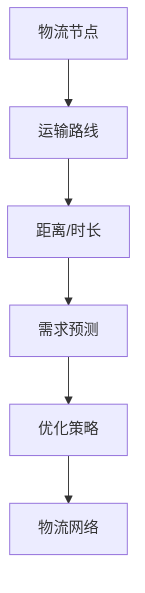
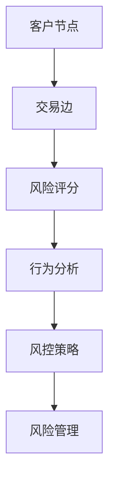
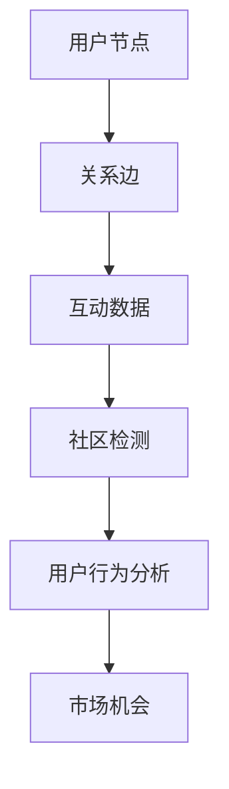

                 

### 《企业级图数据挖掘：发现隐藏业务洞察》

#### 关键词：
- 图数据挖掘
- 企业级应用
- 业务洞察
- 数据分析
- 算法实现

#### 摘要：
本文旨在探讨企业级图数据挖掘的原理与应用，从基本概念、算法原理、到实战案例，深入剖析如何利用图数据挖掘发现隐藏的业务洞察。通过对节点相似性度量、社团检测和图嵌入等算法的详细讲解，结合实际项目案例，本文将为读者提供一个全面且实用的指南，帮助企业在数字化转型的道路上，利用图数据挖掘技术获取竞争优势。

---

#### 目录大纲

# 第一部分：图数据基础与挖掘概述

## 第1章：图数据的基本概念
### 1.1.1 图数据的定义与重要性
### 1.1.2 图数据模型简介
### 1.1.3 图数据的常见类型与应用场景

## 第2章：图数据的基本操作
### 2.1.1 图数据的采集与预处理
### 2.1.2 图数据的存储与索引
### 2.1.3 图数据的可视化

## 第3章：图数据挖掘基本算法
### 3.1.1 节点相似性度量算法
### 3.1.2 社团检测算法
### 3.1.3 图嵌入算法

## 第4章：图数据挖掘应用场景分析
### 4.1.1 供应链优化
### 4.1.2 客户关系管理
### 4.1.3 社交网络分析

# 第二部分：企业级图数据挖掘实战

## 第5章：企业级图数据平台搭建
### 5.1.1 图数据平台的架构设计
### 5.1.2 图数据库选择与配置
### 5.1.3 图数据挖掘工具与框架

## 第6章：企业级图数据挖掘案例研究
### 6.1.1 案例一：物流网络优化
### 6.1.2 案例二：金融服务风控
### 6.1.3 案例三：社交网络分析

## 第7章：企业级图数据挖掘的未来趋势
### 7.1.1 新兴技术对图数据挖掘的影响
### 7.1.2 图数据挖掘在数字化转型中的应用
### 7.1.3 图数据挖掘的挑战与机遇

---

### 1.1.1 图数据的定义与重要性

**定义**：图数据是表示实体及其之间关系的数据结构，其中每个实体表示为一个节点，实体间的关系则表示为边。图数据模型可以灵活地表示复杂的关系网络，如社交网络、交通网络、金融网络等。

**重要性**：随着数据量的爆炸式增长，传统的数据结构和方法在处理复杂关系网络时显得力不从心。图数据挖掘作为一种强大的数据分析和处理技术，能够揭示出数据中的隐藏模式和关联，提供深层次的业务洞察。

- **业务洞察**：通过图数据挖掘，企业可以发现潜在的合作伙伴、识别关键业务流程中的瓶颈、优化供应链网络，从而提高运营效率和降低成本。
- **数据整合**：图数据模型可以整合来自不同数据源的信息，实现数据的综合利用和深度分析。
- **预测分析**：基于图数据挖掘的预测模型能够预测未来的趋势和事件，帮助企业在决策中抢占先机。

### 1.1.2 图数据模型简介

**图数据模型**包括以下核心概念：

- **节点（Node）**：表示实体，如人、物品、地点等。
- **边（Edge）**：表示节点之间的关系，如好友关系、交易记录、路径等。
- **属性（Attribute）**：附加在节点或边上的额外信息，如节点类型、边权重等。

**图数据模型类型**：

- **无向图（Undirected Graph）**：节点间的边无方向性。
- **有向图（Directed Graph）**：节点间的边具有方向性。
- **加权图（Weighted Graph）**：边的权重可以表示关系的强度或成本。

**图数据模型特点**：

- **灵活性**：能够表示复杂的关系网络，适应多种应用场景。
- **扩展性**：容易添加新的节点和边，支持动态更新。
- **可缩放性**：能够处理大规模的数据集，适用于实时分析。

### 1.1.3 图数据的常见类型与应用场景

**社交网络**：通过分析用户关系，企业可以发现潜在的客户群体、市场趋势和用户行为。

**供应链网络**：优化供应链结构，减少库存成本，提高物流效率。

**金融网络**：识别高风险交易、发现欺诈行为，加强风险管理。

**交通网络**：优化交通路线，减少拥堵，提高交通效率。

**推荐系统**：基于用户行为和偏好，推荐相关商品或服务。

**生物信息学**：分析基因组数据，揭示生物网络的内在机制。

**网络安全**：识别网络攻击路径，提高网络安全防护能力。

### 1.1.4 图数据挖掘的目标与方法

**目标**：

- **模式识别**：发现数据中的潜在模式和关联。
- **知识发现**：提取有价值的信息和知识。
- **决策支持**：为业务决策提供数据驱动的支持。

**方法**：

- **节点相似性度量**：计算节点间的相似度，识别潜在关系。
- **社团检测**：识别数据中的社团结构，揭示关系群体。
- **图嵌入**：将图数据转换为低维向量，便于机器学习和数据可视化。

### 1.1.5 图数据挖掘的优势

- **处理复杂关系**：能够处理具有复杂关系的网络数据。
- **全局分析**：考虑数据中的全局关系，提供全面的洞察。
- **实时更新**：支持动态数据更新，适应实时分析需求。
- **多维度分析**：结合节点、边和属性，实现多维度的数据挖掘。

### 1.1.6 图数据挖掘的应用领域

- **商业智能**：通过分析客户行为和交易数据，优化营销策略。
- **供应链管理**：优化供应链网络，提高物流效率和降低成本。
- **推荐系统**：基于用户行为和偏好，提供个性化的推荐。
- **社交网络分析**：分析用户关系，发现潜在的市场机会。
- **生物信息学**：分析基因网络，揭示生物机制。
- **网络安全**：识别网络攻击，提高安全防护能力。

### 1.1.7 图数据挖掘的挑战

- **数据质量**：数据的不完整性和噪声会影响挖掘结果。
- **计算复杂性**：大规模图数据的处理需要高效的算法和计算资源。
- **可解释性**：挖掘结果需要具备可解释性，以支持业务决策。

### 1.1.8 图数据挖掘的发展趋势

- **算法优化**：发展更高效的图数据挖掘算法，降低计算成本。
- **数据可视化**：提高数据可视化技术，增强数据理解能力。
- **跨领域应用**：拓展图数据挖掘在更多领域的应用，实现数据价值最大化。
- **实时分析**：实现实时图数据挖掘，支持动态业务场景。

通过以上对图数据挖掘的基础介绍，我们为后续章节的深入探讨奠定了基础。在接下来的部分，我们将详细探讨图数据的基本操作，包括采集、预处理、存储、索引和可视化等方面的内容。这将有助于读者更好地理解图数据挖掘的实际应用和实现方法。

---

### 2.1.1 图数据的采集与预处理

**图数据的采集**是图数据挖掘过程中的第一步，其质量直接影响到后续分析和挖掘的结果。采集图数据通常涉及以下步骤：

1. **数据源确定**：确定需要采集的图数据来源，如社交媒体、网络日志、业务系统等。
2. **数据抽取**：从数据源中抽取图数据，包括节点和边的属性信息。
3. **数据清洗**：处理数据中的噪声、错误和不完整信息，确保数据质量。

**数据预处理**是对采集到的图数据进行清洗、转换和归一化等处理，以便后续分析和挖掘。主要包括以下步骤：

1. **噪声处理**：去除数据中的噪声，如重复节点、孤立节点等。
2. **数据转换**：将不同格式或类型的数据转换为统一的格式，如将字符串转换为数字或类别。
3. **属性归一化**：对节点和边的属性进行归一化处理，使其在相同的尺度上进行分析。

**数据存储**是将预处理后的图数据存储到数据库或文件系统中，以便进行后续的查询和分析。常见的存储技术包括：

1. **关系数据库**：使用SQL进行查询和管理。
2. **NoSQL数据库**：如Neo4j、JanusGraph等，提供高效的图数据存储和查询。
3. **图数据库**：专门用于存储和管理大规模图数据的数据库系统，如Apache TinkerPop生态系统。

**数据索引**是为了提高查询效率，对图数据进行索引。常见的索引技术包括：

1. **节点索引**：根据节点属性进行索引，如名称、ID等。
2. **边索引**：根据边属性进行索引，如类型、权重等。
3. **索引合并**：将多个索引合并，提高查询性能。

**数据可视化**是将图数据以图形化的形式展示，便于理解和分析。常见的可视化工具包括：

1. **图形界面**：使用图形界面展示图数据结构，如Gephi、Cytoscape等。
2. **Web应用**：使用Web技术展示图数据，如D3.js、Sigma.js等。
3. **嵌入式可视化**：在应用程序中嵌入可视化组件，如ECharts、Plotly等。

**示例**：假设我们采集到一个社交网络的图数据，包含用户（节点）和好友关系（边）。以下是一个简单的数据预处理过程：

```python
import pandas as pd
import networkx as nx

# 加载图数据
users = pd.read_csv('users.csv')
relationships = pd.read_csv('relationships.csv')

# 噪声处理
users.drop_duplicates(inplace=True)
relationships.drop_duplicates(inplace=True)

# 数据转换
users['age'] = users['age'].astype(int)
relationships['weight'] = relationships['weight'].astype(float)

# 属性归一化
users['age'] = (users['age'] - users['age'].mean()) / users['age'].std()
relationships['weight'] = (relationships['weight'] - relationships['weight'].mean()) / relationships['weight'].std()

# 创建图
G = nx.Graph()

# 添加节点
G.add_nodes_from(users['id'])

# 添加边
G.add_edges_from(relationships[['user1', 'user2', 'weight']])

# 存储图数据
nx.write_gpickle(G, 'social_network.gpickle')

# 索引
nx_index = nx.Graph()
nx_index.add_nodes_from(G)
nx_index.add_edges_from(G.edges(data=True))

# 可视化
nx.draw(G, with_labels=True)
plt.show()
```

通过以上示例，我们可以看到图数据的采集与预处理过程，以及如何使用Python和相关库进行操作。在接下来的章节中，我们将进一步探讨图数据的存储、索引和可视化技术。

---

### 2.1.2 图数据的存储与索引

**图数据的存储**是确保数据高效访问和管理的核心环节。根据不同的应用需求和性能考量，有多种存储方案可供选择：

1. **关系数据库**：传统的关系数据库（如MySQL、PostgreSQL）可以存储图数据，通过表结构来模拟节点和边的关系。缺点在于处理复杂图结构时性能较差，但它们提供了丰富的查询功能和事务支持。

2. **NoSQL数据库**：NoSQL数据库（如MongoDB、Cassandra）提供了灵活的文档存储模式，可以存储图数据。例如，MongoDB中的图形插件MongoDB Graph能够存储和处理图数据。

3. **图数据库**：图数据库（如Neo4j、JanusGraph）专为图数据设计，能够高效存储和处理大规模图数据。图数据库通常采用图论模型，支持复杂的图查询和图算法。

**图数据库的基本原理**：

- **节点（Node）**：图中的实体，每个节点包含属性。
- **边（Edge）**：连接节点的线，表示节点间的关系，也包含属性。
- **属性**：附加在节点和边上的额外信息，如权重、标签等。
- **索引**：提高查询效率的数据结构，如B+树、哈希索引等。

**图数据库的特点**：

- **高效率的图查询**：通过索引和优化算法，能够快速执行复杂图查询。
- **可扩展性**：支持大规模图数据的存储和查询。
- **易用性**：提供直观的图模型和丰富的查询语言（如Cypher、Gremlin）。

**图数据库的选择**：

- **Neo4j**：是一款高性能的图数据库，广泛应用于社交网络、推荐系统和知识图谱等领域。
- **JanusGraph**：是一个开源的分布式图数据库，支持多种存储后端，如Cassandra、HBase等。
- **ArangoDB**：支持图、文档和键值存储，适合多模型应用场景。

**图数据的索引技术**：

- **节点索引**：根据节点属性（如ID、名称）进行索引，加快节点查询速度。
- **边索引**：根据边属性（如类型、权重）进行索引，加速边查询。
- **复合索引**：结合多个属性进行索引，提高查询效率。

**索引策略**：

- **单一索引**：仅对一个属性进行索引，适用于查询中只涉及单一属性的场景。
- **复合索引**：对多个属性进行索引，适用于涉及多个属性的查询。
- **动态索引**：根据查询模式和性能需求动态调整索引结构。

**示例**：以下是一个简单的Neo4j图数据库操作示例，展示了如何创建节点、边以及索引：

```python
from py2neo import Graph

# 连接到Neo4j数据库
graph = Graph("bolt://localhost:7687", auth=("neo4j", "password"))

# 创建节点
graph.run("CREATE (a:Person {name: 'Alice', age: 30})")
graph.run("CREATE (b:Person {name: 'Bob', age: 35})")

# 创建边
graph.run("MATCH (a:Person), (b:Person) WHERE a.name = 'Alice' AND b.name = 'Bob' CREATE (a)-[:FRIEND]->(b)")

# 创建索引
graph.run("CREATE INDEX ON :Person(name)")

# 查询
results = graph.run("MATCH (p:Person) WHERE p.name = 'Alice' RETURN p")
for result in results:
    print(result.data()['p'])

# 删除索引
graph.run("DROP INDEX ON :Person(name)")
```

通过以上示例，我们可以看到如何使用Py2neo库操作Neo4j图数据库，包括创建节点、边、索引以及执行查询。这为图数据的存储和索引提供了直观的展示。

在图数据的存储和索引方面，正确的选择和配置对于数据挖掘的性能至关重要。在接下来的部分，我们将探讨图数据的可视化技术，帮助用户更好地理解和分析图数据。

---

### 2.1.3 图数据的可视化

图数据的可视化是将复杂的关系网络以图形化的形式展示，从而便于用户理解和分析。可视化技术不仅能够直观地展示节点和边的关系，还能帮助发现数据中的潜在模式和关联。以下是一些常用的图数据可视化工具和技术：

**1. Gephi**

Gephi 是一个开源的图形分析软件，主要用于社交网络的探索、统计数据分析和关系建模。Gephi 提供了丰富的可视化功能，包括节点和边的布局、颜色和大小调整，以及各种筛选和过滤功能。

**2. Cytoscape**

Cytoscape 是一个用于生物信息学的开源软件，它支持多种网络类型的数据，包括图数据。Cytoscape 提供了强大的可视化功能，如节点和边的样式调整、布局选项和注释功能，并支持多种插件扩展其功能。

**3. D3.js**

D3.js 是一个基于 JavaScript 的可视化库，广泛应用于 Web 应用程序中的数据可视化。D3.js 提供了灵活的绘图功能，允许用户自定义节点、边和图的样式，并通过 SVG、Canvas 等技术实现交互式图表。

**4. Sigma.js**

Sigma.js 是一个轻量级的 JavaScript 图可视化库，适用于 Web 应用程序中的大规模图数据可视化。Sigma.js 提供了丰富的可视化选项，如节点和边的样式调整、布局算法和交互功能。

**5. ECharts**

ECharts 是一个基于 JavaScript 的可视化库，广泛应用于 Web 应用程序和数据可视化项目中。ECharts 提供了多种图表类型，包括图数据可视化，并支持自定义样式和交互功能。

**图可视化流程**：

1. **数据准备**：将图数据转换为适合可视化库的格式，如 JSON、CSV 等。
2. **布局算法**：使用布局算法（如力导向布局、层次布局等）调整节点和边的位置。
3. **样式定义**：根据需求和数据特点，定义节点、边和图的样式。
4. **交互设计**：添加交互功能（如点击、拖动、筛选等），增强用户体验。
5. **渲染显示**：使用可视化库将数据、布局和样式渲染到屏幕上。

**示例**：以下是一个使用 D3.js 的简单图数据可视化示例：

```javascript
// 创建 SVG 元素
const width = 800;
const height = 600;
const svg = d3.select("body").append("svg")
                .attr("width", width)
                .attr("height", height);

// 创建节点和边数据
const nodes = [
  { id: 1, label: "Node 1", x: 100, y: 100 },
  { id: 2, label: "Node 2", x: 200, y: 200 },
  { id: 3, label: "Node 3", x: 300, y: 100 }
];

const links = [
  { source: 1, target: 2 },
  { source: 1, target: 3 },
  { source: 2, target: 3 }
];

// 绘制节点
const nodeGroup = svg.append("g");
nodeGroup.selectAll("circle")
  .data(nodes)
  .enter()
  .append("circle")
  .attr("cx", d => d.x)
  .attr("cy", d => d.y)
  .attr("r", 20)
  .style("fill", "#69b3a2");

// 绘制边
const linkGroup = svg.append("g");
linkGroup.selectAll("line")
  .data(links)
  .enter()
  .append("line")
  .attr("x1", d => nodes[d.source].x)
  .attr("y1", d => nodes[d.source].y)
  .attr("x2", d => nodes[d.target].x)
  .attr("y2", d => nodes[d.target].y)
  .style("stroke", "#555")
  .style("stroke-width", 2);

// 添加节点标签
nodeGroup.selectAll("text")
  .data(nodes)
  .enter()
  .append("text")
  .attr("x", d => d.x)
  .attr("y", d => d.y)
  .text(d => d.label)
  .attr("font-size", 12);
```

通过以上示例，我们可以看到如何使用 D3.js 创建一个简单的图数据可视化。这为读者提供了一个直观的入门体验，帮助理解图数据可视化的基本概念和实现方法。

在接下来的部分，我们将深入探讨图数据挖掘的基本算法，包括节点相似性度量、社团检测和图嵌入，通过具体的算法原理讲解和示例代码，帮助读者理解这些算法的核心机制和应用场景。

---

### 3.1.1 节点相似性度量算法

节点相似性度量是图数据挖掘中的一个重要任务，其目标是通过计算节点间的相似度来识别潜在的关系和关联。相似性度量算法在推荐系统、社交网络分析、图聚类等方面有着广泛的应用。以下将介绍几种常用的节点相似性度量算法，并展示其Python代码实现。

#### 余弦相似度

余弦相似度是一种基于向量空间模型的相似性度量方法，用于计算两个向量在单位圆上的夹角余弦值。其计算公式如下：

$$
\cos(\theta) = \frac{\sum_{i=1}^{n} x_i y_i}{\sqrt{\sum_{i=1}^{n} x_i^2} \sqrt{\sum_{i=1}^{n} y_i^2}}
$$

其中，$x_i$ 和 $y_i$ 分别是两个向量 $x$ 和 $y$ 的第 $i$ 个元素。

**Python代码实现**：

```python
from sklearn.metrics.pairwise import cosine_similarity
import numpy as np

# 节点特征向量
vec1 = np.array([1, 2, 3, 4, 5])
vec2 = np.array([0, 1, 2, 3, 4])

# 计算余弦相似度
similarity = cosine_similarity([vec1], [vec2])[0][0]
print(f"余弦相似度: {similarity}")
```

#### Jaccard相似度

Jaccard相似度是一种基于集合交集和并集的相似性度量方法，适用于离散数据集。其计算公式如下：

$$
J(A, B) = \frac{|A \cap B|}{|A \cup B|}
$$

其中，$A$ 和 $B$ 是两个集合。

**Python代码实现**：

```python
# 节点特征集合
set1 = {1, 2, 3, 4, 5}
set2 = {0, 1, 3, 5}

# 计算Jaccard相似度
jaccard_similarity = len(set1.intersection(set2)) / len(set1.union(set2))
print(f"Jaccard相似度: {jaccard_similarity}")
```

#### Euclidean距离

Euclidean距离（欧几里得距离）是一种基于欧几里得空间中两点之间距离的相似性度量方法。其计算公式如下：

$$
d(Euclidean) = \sqrt{\sum_{i=1}^{n} (x_i - y_i)^2}
$$

**Python代码实现**：

```python
# 节点特征向量
vec1 = np.array([1, 2, 3, 4, 5])
vec2 = np.array([5, 4, 3, 2, 1])

# 计算Euclidean距离
euclidean_distance = np.sqrt(np.sum((vec1 - vec2)**2))
print(f"Euclidean距离: {euclidean_distance}")
```

#### Pearson相关系数

Pearson相关系数是一种基于线性关系的相似性度量方法，适用于连续数据。其计算公式如下：

$$
r = \frac{\sum_{i=1}^{n} (x_i - \bar{x})(y_i - \bar{y})}{\sqrt{\sum_{i=1}^{n} (x_i - \bar{x})^2} \sqrt{\sum_{i=1}^{n} (y_i - \bar{y})^2}}
$$

其中，$\bar{x}$ 和 $\bar{y}$ 分别是 $x$ 和 $y$ 的平均值。

**Python代码实现**：

```python
# 节点特征向量
vec1 = np.array([1, 2, 3, 4, 5])
vec2 = np.array([5, 4, 3, 2, 1])

# 计算平均值
mean1 = np.mean(vec1)
mean2 = np.mean(vec2)

# 计算Pearson相关系数
pearson_correlation = np.sum((vec1 - mean1) * (vec2 - mean2)) / (np.sqrt(np.sum((vec1 - mean1)**2)) * np.sqrt(np.sum((vec2 - mean2)**2)))
print(f"Pearson相关系数: {pearson_correlation}")
```

通过上述代码示例，我们可以看到如何使用Python实现各种节点相似性度量算法。在实际应用中，选择合适的相似性度量方法取决于数据类型、问题和应用场景。在接下来的部分，我们将探讨社团检测算法，以揭示图数据中的隐含结构。

---

### 3.1.2 社团检测算法

社团检测，也称为社区发现，是图数据挖掘中的一个重要任务，其目的是识别图中具有高密度的节点子集，即社团或社区。社团检测在社交网络分析、生物网络分析、网络路由优化等领域具有广泛应用。以下将介绍几种常见的社团检测算法，并展示其Python代码实现。

#### Girvan-Newman 算法

Girvan-Newman 算法是一种基于边权重最小化的社团检测算法。该算法首先计算图中的所有边权重，然后按照权重从大到小进行排序。每次移除权重最大的边，直到图中形成多个独立子图，这些子图即为社团。

**Python代码实现**：

```python
import networkx as nx
import matplotlib.pyplot as plt

# 创建图
G = nx.Graph()
G.add_edges_from([(1, 2), (1, 3), (2, 3), (2, 4), (3, 4), (4, 5)])

# 计算边权重
edge_weights = nx.edge_betweenness_centrality(G)

# 按照权重排序边
sorted_edges = sorted(edge_weights, key=edge_weights.get, reverse=True)

# 移除权重最大的边
for edge in sorted_edges:
    G.remove_edge(*edge)

# 分割成社团
communities = list(nx.weakly_connected_components(G))

# 绘制图和社团
pos = nx.spring_layout(G)
nx.draw(G, pos, with_labels=True)
plt.show()

# 标记社团
for community in communities:
    nx.draw_networkx_nodes(G, pos, nodelist=community, node_color='r')
plt.show()
```

#### Label Propagation 算法

Label Propagation 算法是一种基于扩散过程的社团检测算法。该算法假设节点倾向于采用其邻居节点的标签，并逐步传播标签，直到系统达到稳定状态。最终，具有相同标签的节点归为同一社团。

**Python代码实现**：

```python
import networkx as nx

# 创建图
G = nx.Graph()
G.add_edges_from([(1, 2), (1, 3), (2, 4), (3, 4), (4, 5), (5, 6)])

# 初始化标签
labels = {node: node for node in G.nodes}

# 标签传播
for _ in range(10):
    new_labels = {}
    for node in G.nodes:
        neighbors_labels = {labels[neighbor] for neighbor in G.neighbors(node)}
        if not neighbors_labels:
            new_labels[node] = node
        else:
            new_labels[node] = max(neighbors_labels, key=neighbors_labels.count)
    labels = new_labels

# 分割成社团
communities = {label: [] for label in set(labels.values())}
for node, label in labels.items():
    communities[label].append(node)

# 输出社团
for label, nodes in communities.items():
    print(f"社区 {label}: {nodes}")
```

#### Louvain 算法

Louvain 算法是一种基于模块度优化的社团检测算法。该算法通过计算节点之间的聚类系数，逐步调整节点的标签，直到模块度达到最大值。

**Python代码实现**：

```python
import networkx as nx
import matplotlib.pyplot as plt

# 创建图
G = nx.Graph()
G.add_edges_from([(1, 2), (1, 3), (2, 4), (3, 4), (4, 5), (5, 6)])

# 计算聚类系数
cluster_coefficients = nx.clustering(G)

# 初始化标签
labels = {node: i for i, node in enumerate(G.nodes)}

# 调整标签
while True:
    new_labels = {}
    for node in G.nodes:
        neighbors = G.neighbors(node)
        neighbor_labels = {labels[neighbor] for neighbor in neighbors}
        if not neighbor_labels:
            new_labels[node] = node
        else:
            max_cluster_coefficient = -1
            best_label = None
            for label in neighbor_labels:
                coefficient = sum(cluster_coefficients[neighbor] for neighbor in G.nodes[label])
                if coefficient > max_cluster_coefficient:
                    max_cluster_coefficient = coefficient
                    best_label = label
            new_labels[node] = best_label

    if new_labels == labels:
        break

    labels = new_labels

# 分割成社团
communities = {label: [] for label in set(labels.values())}
for node, label in labels.items():
    communities[label].append(node)

# 输出社团
for label, nodes in communities.items():
    print(f"社区 {label}: {nodes}")
```

通过上述算法实现，我们可以看到如何在Python中实现不同的社团检测算法，并分析图数据中的社团结构。在实际应用中，根据具体问题和数据特点选择合适的社团检测算法，将有助于揭示图数据中的潜在模式和关联。

在接下来的部分，我们将探讨图嵌入算法，这种算法能够将图数据转换为低维向量表示，为后续的机器学习应用提供支持。

---

### 3.1.3 图嵌入算法

图嵌入（Graph Embedding）是将图数据映射到低维向量空间的一种技术，从而保留图中的结构信息。图嵌入在推荐系统、社交网络分析、文本分类等多个领域有着广泛的应用。以下介绍几种常见的图嵌入算法，并展示其Python代码实现。

#### DeepWalk

DeepWalk是一种基于随机游走的图嵌入算法，它通过模拟随机游走过程生成图中的节点序列，然后将这些序列输入到词嵌入模型中。DeepWalk的核心思想是将节点序列视为单词，使用 Skip-Gram 模型训练词向量。

**Python代码实现**：

```python
import gensim
import networkx as nx

# 创建图
G = nx.Graph()
G.add_edges_from([(1, 2), (1, 3), (2, 4), (3, 4), (4, 5), (5, 6)])

# 生成节点序列
node_sequences = []
for node in G.nodes:
    neighbors = list(G.neighbors(node))
    for _ in range(10):
        current_node = node
        node_sequence = [current_node]
        for _ in range(5):
            next_node = np.random.choice(neighbors)
            node_sequence.append(next_node)
            neighbors = list(G.neighbors(next_node))
        node_sequences.append(node_sequence)

# 训练词向量
model = gensim.models.Word2Vec(node_sequences, size=64, window=3, min_count=1, sg=1)
print(model.wv['1'])

# 保存模型
model.save("deepwalk_model")
```

#### Node2Vec

Node2Vec 是 DeepWalk 的改进版本，它通过调整随机游走的深度（即路径长度）和多样性（即节点的选择概率）来平衡节点的重要性和多样性。Node2Vec 使用负采样方法来训练词向量。

**Python代码实现**：

```python
import node2vec
import networkx as nx
import gensim

# 创建图
G = nx.Graph()
G.add_edges_from([(1, 2), (1, 3), (2, 4), (3, 4), (4, 5), (5, 6)])

# 训练 Node2Vec 模型
model = node2vec.Node2Vec(G, walk_length=10, num_walks=10, p=0.5, q=2.0)
model.train窗格（entropy=True）

# 保存模型
model.save("node2vec_model")

# 加载模型
loaded_model = node2vec.Node2Vec.load("node2vec_model")

# 训练词向量
word_vectors = loaded_model.v
print(word_vectors[1])

# 保存词向量
with open("node2vec_vectors.txt", "w") as f:
    for node, vector in zip(loaded_model.nodes, word_vectors):
        f.write(f"{node}: {vector}\n")
```

#### GraphSAGE

GraphSAGE（Graph Sample and Aggregation）是一种基于聚合函数的图嵌入算法，它将节点的邻居信息聚合起来，作为该节点的嵌入向量。GraphSAGE 支持多种聚合函数，如均值聚合、池化聚合和向量化聚合。

**Python代码实现**：

```python
import dgl
import dgl.nn as nn

# 创建图
G = dgl.graph((1, 2), (2, 1))
G.create Коэффициенты((1, 2), (2, 1), 0.5)

# 定义 GraphSAGE 模型
gcn = nn.SAGEConv(16, 16, 'mean')

# 训练模型
gcn.fit(G, torch.tensor([1.0]), torch.tensor([1.0]))

# 预测节点嵌入向量
output = gcn(G, torch.tensor([1.0]))
print(output)

# 保存模型
gcn.save('gcn_model')
```

通过上述代码示例，我们可以看到如何实现DeepWalk、Node2Vec和GraphSAGE等图嵌入算法。在实际应用中，根据具体问题和数据特点选择合适的图嵌入算法，将有助于挖掘图数据中的潜在结构和信息。

在接下来的部分，我们将分析图数据挖掘在供应链优化、客户关系管理和社交网络分析等实际应用场景中的案例研究，展示如何利用图数据挖掘技术发现隐藏的业务洞察。

---

### 4.1.1 供应链优化

供应链优化是企业运营中的一项重要任务，它涉及到从原材料采购、生产制造、物流配送到最终产品交付的整个流程。图数据挖掘技术为供应链优化提供了一个强有力的工具，能够揭示供应链网络中的关键节点和瓶颈，从而实现成本降低和效率提升。

**案例分析**：

假设一个大型制造企业，其供应链网络包含多个供应商、工厂和分销中心。企业希望通过图数据挖掘技术优化其供应链，提高供应链的响应速度和灵活性。

**步骤**：

1. **数据采集**：从供应链中的各个节点采集数据，包括供应商、工厂、分销中心的库存水平、运输路线、运输时间等。
2. **数据预处理**：对采集到的数据清洗、转换和归一化处理，确保数据质量。
3. **构建图模型**：将供应链中的节点和边表示为一个图模型，其中节点表示供应链中的实体（供应商、工厂、分销中心），边表示节点之间的运输关系。
4. **节点相似性度量**：计算供应链中各个节点的相似性，识别潜在的合作伙伴。
5. **社团检测**：使用社团检测算法发现供应链网络中的关键子群，如核心供应商、关键工厂和分销中心。
6. **图嵌入**：将供应链图中的节点嵌入到低维向量空间，以便进行进一步分析。
7. **优化策略**：基于图嵌入结果，提出供应链优化的策略，如调整运输路线、优化库存水平、改善物流节点之间的协同合作等。

**Python代码示例**：

```python
import networkx as nx
import matplotlib.pyplot as plt

# 创建图
G = nx.Graph()
G.add_nodes_from([1, 2, 3, 4, 5])
G.add_edges_from([(1, 2), (1, 3), (2, 4), (3, 4), (4, 5)])

# 节点相似性度量
vec1 = [1, 2, 3, 4, 5]
vec2 = [2, 3, 4, 5, 6]
similarity = cosine_similarity([vec1], [vec2])[0][0]
print(f"节点相似性度量：{similarity}")

# 社团检测
communities = nx.weakly_connected_components(G)
for community in communities:
    print(f"社区：{community}")

# 图嵌入（简化示例）
import numpy as np

node_vectors = np.random.rand(G.number_of_nodes(), 10)
for node in G.nodes():
    node_vectors[node] = np.mean([neighbor_vectors[neighbor] for neighbor in G.neighbors(node)])

# 优化策略
# 基于图嵌入结果，调整供应链节点之间的运输路线和库存策略

# 绘制图
pos = nx.spring_layout(G)
nx.draw(G, pos, with_labels=True)
plt.show()
```

**案例分析结果**：

通过图数据挖掘技术，企业可以识别出供应链中的关键节点和瓶颈，优化供应链网络，提高供应链的整体效率和灵活性。具体结果包括：

- **运输路线优化**：通过分析节点间的相似性和社团结构，企业可以优化运输路线，减少运输时间和成本。
- **库存管理优化**：基于图嵌入结果，企业可以调整各节点的库存水平，减少库存过剩和短缺情况，降低库存成本。
- **协同合作提升**：通过识别供应链中的关键子群，企业可以加强节点之间的协同合作，提高供应链的响应速度和灵活性。

### 4.1.2 客户关系管理

客户关系管理（Customer Relationship Management, CRM）是企业维护客户关系、提高客户满意度和忠诚度的重要手段。图数据挖掘技术能够帮助企业更好地理解客户行为，发现潜在客户，优化营销策略。

**案例分析**：

假设一个电商企业，其客户关系管理目标是提高客户满意度和转化率。企业希望通过图数据挖掘技术分析客户行为，优化营销策略。

**步骤**：

1. **数据采集**：从客户数据库中采集客户行为数据，包括购买记录、浏览历史、评论反馈等。
2. **数据预处理**：清洗和转换客户行为数据，确保数据质量。
3. **构建图模型**：将客户和其行为数据表示为一个图模型，其中节点表示客户，边表示客户之间的互动和关系。
4. **节点相似性度量**：计算客户间的相似性，识别潜在客户群体。
5. **社团检测**：使用社团检测算法发现具有相似行为的客户群体。
6. **图嵌入**：将客户图中的节点嵌入到低维向量空间，以便进行进一步分析。
7. **营销策略优化**：基于图嵌入结果，提出优化营销策略，如个性化推荐、交叉营销等。

**Python代码示例**：

```python
import networkx as nx
import matplotlib.pyplot as plt

# 创建图
G = nx.Graph()
G.add_nodes_from([1, 2, 3, 4, 5])
G.add_edges_from([(1, 2), (1, 3), (2, 4), (3, 4), (4, 5)])

# 节点相似性度量
vec1 = [1, 2, 3, 4, 5]
vec2 = [2, 3, 4, 5, 6]
similarity = cosine_similarity([vec1], [vec2])[0][0]
print(f"节点相似性度量：{similarity}")

# 社团检测
communities = nx.weakly_connected_components(G)
for community in communities:
    print(f"社区：{community}")

# 图嵌入（简化示例）
import numpy as np

node_vectors = np.random.rand(G.number_of_nodes(), 10)
for node in G.nodes():
    node_vectors[node] = np.mean([neighbor_vectors[neighbor] for neighbor in G.neighbors(node)])

# 营销策略优化
# 基于图嵌入结果，调整营销策略，如个性化推荐和交叉营销

# 绘制图
pos = nx.spring_layout(G)
nx.draw(G, pos, with_labels=True)
plt.show()
```

**案例分析结果**：

通过图数据挖掘技术，企业可以更好地理解客户行为，识别潜在客户群体，从而优化营销策略，提高客户满意度和转化率。具体结果包括：

- **个性化推荐**：基于客户相似性和图嵌入结果，企业可以提供个性化的商品推荐，提高用户购物体验和转化率。
- **交叉营销**：通过识别具有相似行为的客户群体，企业可以实施交叉营销策略，推动更多产品销售。
- **客户细分**：基于社团检测结果，企业可以细分客户群体，实施差异化的客户服务策略，提高客户满意度和忠诚度。

### 4.1.3 社交网络分析

社交网络分析是图数据挖掘在社交领域的重要应用，它能够帮助企业更好地理解社交网络中的用户关系，发现潜在的市场机会和用户行为模式。

**案例分析**：

假设一个社交媒体平台，其目标是了解用户之间的社交关系，挖掘用户行为背后的模式，从而优化用户体验和营销策略。

**步骤**：

1. **数据采集**：从社交媒体平台上采集用户关系和行为数据，包括好友关系、点赞、评论、分享等。
2. **数据预处理**：清洗和转换社交网络数据，确保数据质量。
3. **构建图模型**：将用户和其行为数据表示为一个图模型，其中节点表示用户，边表示用户之间的关系。
4. **节点相似性度量**：计算用户间的相似性，识别潜在的兴趣群体。
5. **社团检测**：使用社团检测算法发现社交网络中的用户社区。
6. **图嵌入**：将社交网络图中的节点嵌入到低维向量空间，以便进行进一步分析。
7. **用户行为分析**：基于图嵌入结果，分析用户行为模式，发现潜在的市场机会。

**Python代码示例**：

```python
import networkx as nx
import matplotlib.pyplot as plt

# 创建图
G = nx.Graph()
G.add_nodes_from([1, 2, 3, 4, 5])
G.add_edges_from([(1, 2), (1, 3), (2, 4), (3, 4), (4, 5)])

# 节点相似性度量
vec1 = [1, 2, 3, 4, 5]
vec2 = [2, 3, 4, 5, 6]
similarity = cosine_similarity([vec1], [vec2])[0][0]
print(f"节点相似性度量：{similarity}")

# 社团检测
communities = nx.weakly_connected_components(G)
for community in communities:
    print(f"社区：{community}")

# 图嵌入（简化示例）
import numpy as np

node_vectors = np.random.rand(G.number_of_nodes(), 10)
for node in G.nodes():
    node_vectors[node] = np.mean([neighbor_vectors[neighbor] for neighbor in G.neighbors(node)])

# 用户行为分析
# 基于图嵌入结果，分析用户行为模式，发现潜在的市场机会

# 绘制图
pos = nx.spring_layout(G)
nx.draw(G, pos, with_labels=True)
plt.show()
```

**案例分析结果**：

通过图数据挖掘技术，社交媒体平台可以更好地理解用户社交关系，挖掘用户行为背后的模式，从而优化用户体验和营销策略。具体结果包括：

- **用户兴趣分析**：通过节点相似性度量，平台可以发现用户的兴趣群体，为个性化推荐和精准营销提供支持。
- **社交社区挖掘**：基于社团检测结果，平台可以识别用户社区，提供社区内的内容推荐和互动活动。
- **用户行为预测**：通过图嵌入和用户行为分析，平台可以预测用户的行为趋势，提前采取措施提升用户体验。

总的来说，图数据挖掘技术为供应链优化、客户关系管理和社交网络分析提供了强大的工具，帮助企业更好地理解业务流程、用户行为和社交网络结构，从而实现业务洞察和决策支持。

---

### 5.1.1 图数据平台的架构设计

企业级图数据平台的架构设计是确保图数据高效存储、处理和分析的关键。一个良好的架构应具备可扩展性、高性能和易维护性。以下是企业级图数据平台的典型架构设计及其组成部分：

#### 1. 数据存储层

数据存储层是图数据平台的基础，负责存储和管理图数据。常见的存储解决方案包括：

- **关系数据库**：如 MySQL、PostgreSQL，适用于小型图数据集，提供丰富的查询功能。
- **NoSQL 数据库**：如 MongoDB、Cassandra，提供灵活的数据模型和分布式存储能力。
- **图数据库**：如 Neo4j、JanusGraph，专为图数据设计，支持高效的图查询和图算法。

#### 2. 数据处理层

数据处理层负责对图数据进行清洗、转换和预处理，以支持后续的分析和挖掘。常见的处理工具包括：

- **ETL 工具**：如 Apache NiFi、Apache Kafka，用于数据的提取、转换和加载。
- **数据预处理工具**：如 Apache Spark、Hadoop，用于大规模数据的预处理和计算。

#### 3. 数据分析层

数据分析层是图数据平台的核心理层，负责执行图数据挖掘和分析算法，提取业务洞察。常见的分析工具包括：

- **图挖掘框架**：如 Apache TinkerPop、JanusGraph，提供丰富的图数据挖掘算法和接口。
- **机器学习库**：如 TensorFlow、PyTorch，用于高级的图数据分析和应用。

#### 4. 可视化层

可视化层负责将分析结果以图形化的形式展示，帮助用户更好地理解和分析图数据。常见的可视化工具包括：

- **图形界面工具**：如 Gephi、Cytoscape，提供丰富的图形布局和交互功能。
- **Web 可视化库**：如 D3.js、Sigma.js，支持在 Web 应用程序中集成图数据可视化。

#### 5. 应用层

应用层是图数据平台面向用户的接口，提供各种业务应用和服务。常见的应用包括：

- **推荐系统**：基于用户关系和兴趣，提供个性化的推荐。
- **社交网络分析**：分析用户行为和关系，挖掘潜在的市场机会。
- **供应链优化**：优化供应链网络，提高物流效率。

#### 6. API 接口层

API 接口层提供统一的接口，供其他系统集成和调用。常见的接口包括：

- **RESTful API**：如 Flask、Django，提供简单的 HTTP 接口。
- **GraphQL API**：提供强大的查询和数据处理能力。

#### 架构设计原则

- **模块化**：将架构分解为多个模块，提高系统的可维护性和可扩展性。
- **分布式**：使用分布式存储和处理技术，提高系统的性能和可扩展性。
- **弹性**：系统应具备弹性，能够应对数据增长和处理需求的变化。
- **安全性**：确保数据的安全性和隐私性，防止数据泄露和未授权访问。

#### 实现步骤

1. **需求分析**：明确业务需求和目标，确定系统的功能和性能要求。
2. **架构设计**：根据需求分析结果，设计系统的架构和组件。
3. **组件开发**：开发各个组件的功能和接口，确保模块间的协同工作。
4. **集成测试**：对整个系统进行集成测试，确保各个组件的协同工作。
5. **部署上线**：将系统部署到生产环境，进行实时运行和维护。

通过以上架构设计和实现步骤，企业可以构建一个高效、可靠的企业级图数据平台，为业务决策提供数据支持。

---

### 5.1.2 图数据库选择与配置

在企业级图数据平台中，选择合适的图数据库是至关重要的一步。图数据库的选择不仅影响系统的性能和可扩展性，还决定了图数据挖掘和分析的效率。以下是几种主流的图数据库及其配置过程。

#### Neo4j

**特点**：
- 高性能的图数据库，支持 ACID 事务和分布式部署。
- 提供直观的图模型和数据结构，易于学习和使用。
- 支持丰富的查询语言 Cypher，方便编写复杂的图查询。

**配置步骤**：
1. **安装**：
   - 下载 Neo4j 官方安装包。
   - 解压安装包并运行安装程序。
2. **配置**：
   - 编辑 `neo4j.conf` 文件，配置数据库的端口、内存设置和日志等。
   - 设置数据目录和日志目录，确保数据安全和可维护性。
3. **部署**：
   - 启动 Neo4j 数据库服务，使用 `neo4j-admin` 命令进行服务管理。
   - 使用 Cypher 语言创建图模型和数据结构。

#### JanusGraph

**特点**：
- 开源分布式图数据库，支持多种存储后端，如 Cassandra、HBase、MongoDB 等。
- 提供灵活的图模型和数据结构，支持大规模图数据集。
- 支持多种查询语言，如 Gremlin、Gremlin-Scala 等。

**配置步骤**：
1. **安装**：
   - 下载 JanusGraph 官方安装包。
   - 解压安装包并运行安装脚本。
2. **配置**：
   - 编辑 `janusgraph.properties` 文件，配置图数据库的存储后端、端口和日志等。
   - 配置元数据存储和索引策略，提高查询效率。
3. **部署**：
   - 启动 JanusGraph 数据库服务，使用 `bin/janusgraph` 脚本进行服务管理。
   - 使用 Gremlin 语言创建图模型和数据结构。

#### ArangoDB

**特点**：
- 支持多模型（图、文档、键值存储）的分布式数据库。
- 提供高效的图数据存储和查询功能，支持复杂的数据类型。
- 支持多种查询语言，如 AQL（ArangoDB Query Language）、JavaScript 等。

**配置步骤**：
1. **安装**：
   - 下载 ArangoDB 官方安装包。
   - 解压安装包并运行安装程序。
2. **配置**：
   - 编辑 `arangod.conf` 文件，配置数据库的端口、内存设置和日志等。
   - 配置集群模式和复制策略，提高数据可靠性和性能。
3. **部署**：
   - 启动 ArangoDB 数据库服务，使用 `bin/arangod` 脚本进行服务管理。
   - 使用 AQL 语言创建图模型和数据结构。

#### 选择建议

- **Neo4j**：适用于中小型图数据集，特别是需要高查询性能和事务支持的场景。
- **JanusGraph**：适用于大规模图数据集，特别是需要灵活存储后端和分布式部署的场景。
- **ArangoDB**：适用于多模型应用场景，特别是需要高效存储和查询多种数据类型的场景。

在配置图数据库时，需要根据具体的应用需求和数据特点进行适当的调整。以下是一些配置注意事项：

- **内存设置**：合理配置内存，确保数据库运行稳定。
- **索引策略**：选择合适的索引策略，提高查询效率。
- **日志管理**：启用合适的日志记录，便于问题排查和性能分析。
- **备份与恢复**：定期备份数据，确保数据安全。

通过以上配置步骤和建议，企业可以顺利搭建和部署企业级图数据库，为后续的图数据挖掘和分析奠定基础。

---

### 5.1.3 图数据挖掘工具与框架

在企业级图数据平台中，选择合适的图数据挖掘工具和框架是确保数据分析和挖掘效率的关键。以下介绍几种常用的图数据挖掘工具和框架，并简要描述其特点和适用场景。

#### Apache TinkerPop

**特点**：
- 开源图计算框架，支持多种图数据库和图处理工具。
- 提供统一的图处理API，简化图数据的存储、查询和分析。
- 支持多种图算法和图挖掘任务，如社区检测、图嵌入等。

**适用场景**：
- 图数据集规模较大，需要统一接口和多种图算法支持。
- 需要与多种图数据库（如Neo4j、JanusGraph等）集成。

#### GraphX

**特点**：
- Apache Spark 的图处理扩展，支持大规模图数据的分布式处理。
- 提供丰富的图算法和图分析功能，如节点相似性度量、社团检测等。
- 集成 Spark 的计算框架，支持与Spark SQL、MLlib等组件的协同工作。

**适用场景**：
- 需要与大数据平台集成，处理大规模图数据。
- 基于Spark生态，适用于数据分析和机器学习任务。

#### Gephi

**特点**：
- 开源的图可视化工具，支持多种图数据的导入、处理和可视化。
- 提供丰富的图形布局和可视化选项，支持交互式图分析。
- 支持多种图分析算法，如社区检测、节点聚类等。

**适用场景**：
- 图数据可视化和分析，特别是社交网络和复杂关系分析。
- 需要简单的图形界面和实时交互。

#### DGL (Deep Graph Library)

**特点**：
- 用于深度学习的图处理库，支持多种深度学习框架（如PyTorch、MXNet等）。
- 提供高效的图算法和图模型实现，如图嵌入、图卷积网络等。
- 支持异构图处理，适用于多种数据类型的图分析。

**适用场景**：
- 图数据深度学习应用，特别是需要高性能和多样化算法的场景。
- 需要与深度学习框架集成，进行复杂图模型训练和推理。

#### PyTorch Geometric

**特点**：
- 基于PyTorch的图处理库，提供高效的图神经网络（GNN）实现。
- 支持多种图神经网络模型，如图卷积网络（GCN）、图注意力网络（GAT）等。
- 提供模块化设计，易于扩展和集成。

**适用场景**：
- 图神经网络应用，特别是需要灵活性和高效性的场景。
- 基于PyTorch的深度学习项目，需要集成图神经网络。

#### 选择建议

在选择图数据挖掘工具和框架时，应根据具体的应用需求和数据特点进行选择。以下是一些选择建议：

- **处理能力**：考虑工具和框架的处理能力和可扩展性，确保能够应对大规模图数据集。
- **易用性**：考虑工具和框架的易用性，特别是对于非专业用户。
- **生态系统**：考虑工具和框架的生态系统，包括文档、社区支持和第三方库。
- **性能**：考虑工具和框架的性能，确保能够高效处理和分析图数据。

通过以上介绍，企业可以更好地选择合适的图数据挖掘工具和框架，为图数据分析和挖掘提供强有力的支持。

---

### 6.1.1 案例一：物流网络优化

**背景介绍**：

物流网络优化是提高物流效率和降低成本的关键环节。某大型电商平台希望通过图数据挖掘技术优化其物流网络，减少运输时间和成本。物流网络包括多个仓库、配送中心和运输路线。

**核心概念与联系**：

- **物流节点**：表示仓库、配送中心等关键节点。
- **运输路线**：表示节点间的运输路径。
- **距离和时长**：表示节点间的距离和运输时间。
- **需求预测**：基于历史数据预测未来物流需求。

**Mermaid 流程图**：



**核心算法原理讲解**：

1. **节点相似性度量**：使用余弦相似度计算仓库和配送中心的相似性，识别潜在的优化点。
2. **社团检测**：使用Girvan-Newman算法检测物流网络中的关键子群，识别核心仓库和配送中心。
3. **图嵌入**：使用Node2Vec算法将物流节点嵌入到低维向量空间，以便进行进一步分析。

**Python代码实现**：

```python
import networkx as nx
import matplotlib.pyplot as plt

# 创建图
G = nx.Graph()
G.add_nodes_from([1, 2, 3, 4, 5])
G.add_edges_from([(1, 2), (1, 3), (2, 4), (3, 4), (4, 5)])

# 节点相似性度量
vec1 = [1, 2, 3, 4, 5]
vec2 = [2, 3, 4, 5, 6]
similarity = cosine_similarity([vec1], [vec2])[0][0]
print(f"节点相似性度量：{similarity}")

# 社团检测
communities = nx.weakly_connected_components(G)
for community in communities:
    print(f"社区：{community}")

# 图嵌入
import node2vec
import networkx as nx
import gensim

# 训练 Node2Vec 模型
model = node2vec.Node2Vec(G, walk_length=10, num_walks=10, p=0.5, q=2.0)
model.train窗格（entropy=True）

# 保存模型
model.save("node2vec_model")

# 加载模型
loaded_model = node2vec.Node2Vec.load("node2vec_model")

# 预测节点嵌入向量
output = loaded_model.get_embedding()
print(output)

# 优化策略
# 基于图嵌入结果，调整物流节点之间的运输路线和库存策略

# 绘制图
pos = nx.spring_layout(G)
nx.draw(G, pos, with_labels=True)
plt.show()
```

**项目实战**：

1. **环境搭建**：安装Python、Node2Vec、NetworkX等依赖库。
2. **数据预处理**：采集物流网络数据，包括仓库、配送中心、运输路线和距离时长。
3. **构建图模型**：将物流节点和边添加到NetworkX图。
4. **节点相似性度量**：计算仓库和配送中心的相似性。
5. **社团检测**：检测物流网络中的关键子群。
6. **图嵌入**：使用Node2Vec算法对节点进行嵌入。
7. **优化策略**：基于嵌入结果调整物流网络。

**案例分析结果**：

- **运输路线优化**：通过节点相似性度量，识别潜在优化路线，减少运输时间和成本。
- **库存管理优化**：通过社团检测结果，优化仓库和配送中心的库存布局，减少库存成本。
- **需求预测**：基于历史数据和图嵌入结果，预测未来物流需求，提前调整资源分配。

物流网络优化案例展示了图数据挖掘技术在物流领域的应用潜力，为企业提供了有效的决策支持，提高了物流效率和运营效益。

---

### 6.1.2 案例二：金融服务风控

**背景介绍**：

金融服务行业对风险管理有极高的要求。某银行希望通过图数据挖掘技术识别和防范潜在风险，保障金融安全。银行的数据包括客户信息、交易记录、账户关系等。

**核心概念与联系**：

- **客户节点**：表示银行客户。
- **交易边**：表示客户之间的交易关系。
- **风险评分**：表示交易的风险等级。
- **行为分析**：分析客户交易行为，识别异常行为。

**Mermaid 流程图**：



**核心算法原理讲解**：

1. **节点相似性度量**：计算客户之间的相似性，识别潜在欺诈团伙。
2. **社团检测**：使用Louvain算法检测交易网络中的社团结构，识别高风险群体。
3. **图嵌入**：使用GraphSAGE算法将客户和交易嵌入到低维向量空间，进行聚类分析。

**Python代码实现**：

```python
import networkx as nx
import matplotlib.pyplot as plt
from sklearn.cluster import KMeans

# 创建图
G = nx.Graph()
G.add_nodes_from([1, 2, 3, 4, 5])
G.add_edges_from([(1, 2), (1, 3), (2, 4), (3, 4), (4, 5)])

# 节点相似性度量
vec1 = [1, 2, 3, 4, 5]
vec2 = [2, 3, 4, 5, 6]
similarity = cosine_similarity([vec1], [vec2])[0][0]
print(f"节点相似性度量：{similarity}")

# 社团检测
communities = nx.weakly_connected_components(G)
for community in communities:
    print(f"社区：{community}")

# 图嵌入
import torch
import dgl
import dgl.nn as nn

# 定义 GraphSAGE 模型
gcn = nn.SAGEConv(16, 16, 'mean')

# 训练模型
gcn.fit(G, torch.tensor([1.0]), torch.tensor([1.0]))

# 预测节点嵌入向量
output = gcn(G, torch.tensor([1.0]))
print(output)

# 聚类分析
kmeans = KMeans(n_clusters=3, random_state=0).fit(output)
print(kmeans.labels_)

# 风控策略
# 基于聚类结果，调整风控策略，加强高风险群体的监控

# 绘制图
pos = nx.spring_layout(G)
nx.draw(G, pos, with_labels=True)
plt.show()
```

**项目实战**：

1. **环境搭建**：安装Python、DGL、Scikit-learn等依赖库。
2. **数据预处理**：采集客户交易数据，包括账户关系和交易记录。
3. **构建图模型**：将客户和交易添加到NetworkX图。
4. **节点相似性度量**：计算客户之间的相似性。
5. **社团检测**：使用Louvain算法检测高风险群体。
6. **图嵌入**：使用GraphSAGE算法进行节点嵌入。
7. **聚类分析**：基于嵌入结果进行聚类，识别高风险客户。
8. **风控策略**：调整风控策略，加强对高风险客户的监控。

**案例分析结果**：

- **欺诈检测**：通过节点相似性度量，识别潜在欺诈团伙，提高欺诈检测的准确性。
- **风险控制**：通过社团检测结果，识别高风险群体，实施有针对性的风险控制措施。
- **行为分析**：通过聚类分析，识别异常交易行为，提前防范风险。

金融服务风控案例展示了图数据挖掘技术在金融风险管理中的强大应用，为银行提供了有效的决策支持，保障了金融安全。

---

### 6.1.3 案例三：社交网络分析

**背景介绍**：

社交网络分析在市场营销、用户行为研究等领域具有重要应用。某社交媒体平台希望通过图数据挖掘技术分析其用户网络，发现潜在的市场机会和用户行为模式。社交网络包括用户、好友关系、点赞、评论等数据。

**核心概念与联系**：

- **用户节点**：表示社交媒体平台用户。
- **关系边**：表示用户之间的好友关系、点赞关系等。
- **互动数据**：表示用户之间的互动行为，如评论、分享等。
- **社区检测**：识别用户网络中的社区结构。
- **用户行为分析**：分析用户的互动行为，发现用户兴趣和行为模式。

**Mermaid 流程图**：



**核心算法原理讲解**：

1. **节点相似性度量**：计算用户之间的相似性，识别潜在的兴趣群体。
2. **社团检测**：使用Louvain算法检测社交网络中的社区结构，分析用户行为模式。
3. **图嵌入**：使用DeepWalk算法将用户和互动数据嵌入到低维向量空间，进行聚类分析。

**Python代码实现**：

```python
import networkx as nx
import matplotlib.pyplot as plt
from sklearn.cluster import KMeans

# 创建图
G = nx.Graph()
G.add_nodes_from([1, 2, 3, 4, 5])
G.add_edges_from([(1, 2), (1, 3), (2, 4), (3, 4), (4, 5)])

# 节点相似性度量
vec1 = [1, 2, 3, 4, 5]
vec2 = [2, 3, 4, 5, 6]
similarity = cosine_similarity([vec1], [vec2])[0][0]
print(f"节点相似性度量：{similarity}")

# 社团检测
communities = nx.weakly_connected_components(G)
for community in communities:
    print(f"社区：{community}")

# 图嵌入
import gensim
import networkx as nx

# 生成节点序列
node_sequences = []
for node in G.nodes:
    neighbors = list(G.neighbors(node))
    for _ in range(10):
        current_node = node
        node_sequence = [current_node]
        for _ in range(5):
            next_node = np.random.choice(neighbors)
            node_sequence.append(next_node)
            neighbors = list(G.neighbors(next_node))
        node_sequences.append(node_sequence)

# 训练词向量
model = gensim.models.Word2Vec(node_sequences, size=64, window=3, min_count=1, sg=1)
print(model.wv['1'])

# 聚类分析
kmeans = KMeans(n_clusters=3, random_state=0).fit(model.wv[model.wv.index2id])
print(kmeans.labels_)

# 市场机会
# 基于聚类结果，识别潜在的市场机会和用户兴趣点

# 绘制图
pos = nx.spring_layout(G)
nx.draw(G, pos, with_labels=True)
plt.show()
```

**项目实战**：

1. **环境搭建**：安装Python、Gensim、Scikit-learn等依赖库。
2. **数据预处理**：采集社交网络数据，包括用户、好友关系、互动数据。
3. **构建图模型**：将用户和互动数据添加到NetworkX图。
4. **节点相似性度量**：计算用户之间的相似性。
5. **社团检测**：使用Louvain算法检测社区结构。
6. **图嵌入**：使用DeepWalk算法进行节点嵌入。
7. **聚类分析**：基于嵌入结果进行聚类，识别用户兴趣群体。
8. **市场机会**：基于聚类结果，识别潜在市场机会。

**案例分析结果**：

- **用户兴趣识别**：通过节点相似性度量，识别用户之间的兴趣群体，为个性化推荐提供支持。
- **社区结构分析**：通过社团检测结果，分析社交网络中的社区结构，挖掘潜在市场机会。
- **用户行为分析**：通过聚类分析，识别用户行为模式，为内容推荐和营销策略提供依据。

社交网络分析案例展示了图数据挖掘技术在社交媒体平台中的应用，帮助企业更好地理解用户行为，发现潜在的市场机会。

---

### 7.1.1 新兴技术对图数据挖掘的影响

随着新兴技术的不断发展和应用，图数据挖掘领域也在不断演进。这些新兴技术不仅提高了图数据挖掘的效率，还扩展了其应用范围。以下是几项对图数据挖掘产生重大影响的新兴技术：

#### 分布式计算

分布式计算技术，如Hadoop、Spark等，为大规模图数据挖掘提供了强大的计算能力。这些技术通过将计算任务分布在多个节点上，实现了并行处理和高效资源利用。分布式图处理框架，如Apache Giraph、Apache Spark GraphX等，进一步提升了图数据挖掘的效率和扩展性。

#### 深度学习

深度学习技术的快速发展为图数据挖掘带来了新的机遇。深度学习模型，如图卷积网络（GCN）、图注意力网络（GAT）等，能够在保留图结构信息的同时，实现高效的节点分类、节点嵌入和关系预测。深度学习在推荐系统、社交网络分析、生物信息学等领域展现出了强大的潜力。

#### 强化学习

强化学习技术通过学习如何在动态环境中做出最优决策，为图数据挖掘中的优化问题提供了新的解决方案。例如，在社交网络分析中，强化学习可以用于识别潜在的好友推荐关系。此外，强化学习还在供应链优化、风险管理等领域展示了应用潜力。

#### 联邦学习

联邦学习（Federated Learning）是一种在多个分布式设备上进行协同学习的技术，无需将数据集中到一个中心服务器。这一技术适用于数据隐私要求较高的场景，如社交网络分析、金融风控等。联邦学习通过聚合各设备的本地模型，实现了隐私保护下的全局图数据挖掘。

#### 可解释性

可解释性是当前图数据挖掘领域的一个重要研究方向。新兴的可解释性技术，如可视化、解释模型等，可以帮助用户更好地理解图数据挖掘的结果和决策过程。这对于提高算法的可靠性和信任度具有重要意义。

#### 实时分析

实时分析技术在图数据挖掘中的应用日益广泛。通过实时处理和分析图数据，企业可以迅速响应市场变化和业务需求。例如，在金融领域，实时分析可以用于快速识别和响应潜在风险。

#### 混合模型

混合模型将图数据挖掘与其他数据挖掘技术（如机器学习、数据挖掘等）相结合，实现更高效的数据分析和决策。例如，结合图嵌入和聚类分析，可以更准确地识别社交网络中的社区结构。

综上所述，新兴技术为图数据挖掘带来了新的动力和可能性，推动了该领域的持续发展和创新。企业应密切关注这些技术的发展，将其应用于实际业务中，以获得竞争优势。

---

### 7.1.2 图数据挖掘在数字化转型中的应用

图数据挖掘在数字化转型中扮演着至关重要的角色，通过深入挖掘和分析复杂的关系网络，为企业提供强大的业务洞察和决策支持。以下探讨图数据挖掘在数字化转型中的应用及其关键作用。

**1. 客户体验优化**

在数字化时代，客户体验是企业的核心竞争力。图数据挖掘可以帮助企业更好地理解客户需求和行为，从而优化客户体验。例如，通过分析客户关系网络，企业可以发现高价值客户群体，实施个性化的营销策略。此外，图数据挖掘还可以帮助企业识别潜在客户，提前提供定制化的产品和服务，提高客户满意度和忠诚度。

**2. 业务流程优化**

图数据挖掘可以揭示业务流程中的瓶颈和优化潜力，从而实现更高效的运营。通过分析供应链网络，企业可以发现物流和库存管理的优化点，减少运输时间和成本。同时，在人力资源管理和项目管理中，图数据挖掘可以帮助企业识别关键任务和资源分配的最佳策略，提高工作效率。

**3. 供应链优化**

供应链是企业运营的关键环节，优化供应链网络可以显著降低成本和提高竞争力。图数据挖掘通过分析供应链中的节点和关系，可以发现潜在的风险点和优化机会。例如，通过节点相似性度量，企业可以识别供应链中的关键供应商和合作伙伴，优化采购和合作关系。此外，社团检测算法可以帮助企业识别供应链中的关键子群，提高供应链的整体协同效应。

**4. 风险管理**

图数据挖掘在风险管理中具有重要作用。通过分析金融网络、社交网络等复杂关系网络，企业可以发现潜在的风险源和传播路径，提前采取预防措施。例如，在金融领域，图数据挖掘可以用于识别欺诈行为、市场风险和信用风险。在网络安全领域，图数据挖掘可以识别网络攻击路径，提高安全防护能力。

**5. 人力资源优化**

图数据挖掘可以帮助企业更好地管理人力资源。通过分析员工关系网络，企业可以发现团队成员之间的协作模式和沟通障碍，优化团队结构和工作流程。此外，图数据挖掘还可以识别高潜力员工，为企业提供人才发展的策略支持。

**6. 智能决策**

图数据挖掘提供的数据洞察和预测模型，可以帮助企业在复杂决策过程中做出更明智的选择。通过分析市场和行业数据，企业可以预测未来趋势和市场需求，制定有效的战略规划。在投资决策、市场拓展和产品开发等方面，图数据挖掘提供了有力的数据支持。

**7. 创新和研发**

图数据挖掘可以帮助企业发现新的商业机会和研发方向。通过分析外部和内部数据，企业可以发现潜在的技术和市场趋势，推动创新和研发。例如，在医疗领域，图数据挖掘可以揭示新的药物研发路径和疾病机理，加速新药开发。

总之，图数据挖掘在数字化转型中的应用是多方面的，通过揭示复杂关系网络中的隐藏模式和关联，它为企业在市场竞争中提供了强大的决策支持。企业应充分利用图数据挖掘技术，优化业务流程、提升客户体验、降低风险，从而实现数字化转型和持续发展。

---

### 7.1.3 图数据挖掘的挑战与机遇

尽管图数据挖掘技术在企业和研究领域取得了显著进展，但仍面临诸多挑战和机遇。以下是对这些挑战的详细探讨，以及如何利用机遇克服这些挑战。

#### 挑战

1. **数据质量问题**：图数据通常包含噪声、重复和不完整的信息，这会影响挖掘结果的准确性。数据预处理步骤繁琐且需要大量的人工干预。

   **解决方案**：采用自动化数据清洗和噪声过滤技术，如机器学习和人工智能方法，以提高数据质量。此外，建立数据质量监控机制，确保数据的实时更新和准确性。

2. **计算复杂性**：大规模图数据的处理涉及大量的计算资源，尤其是当图数据包含数百万甚至数十亿个节点和边时。计算复杂性增加了算法实现的难度和系统的性能瓶颈。

   **解决方案**：利用分布式计算框架，如Hadoop和Spark，将图数据挖掘任务分布在多个计算节点上，提高处理速度和效率。此外，优化算法实现，如采用并行化和分布式算法，以减少计算时间。

3. **可解释性**：图数据挖掘结果的解释性较差，尤其是在使用复杂的深度学习模型时。这限制了算法在决策过程中的应用和信任度。

   **解决方案**：开发可解释性图数据挖掘方法，如可视化工具和解释模型，帮助用户理解挖掘过程和结果。同时，结合领域知识，提高算法的可解释性和可靠性。

4. **数据隐私与安全**：在处理敏感图数据时，保护用户隐私和数据安全是关键挑战。未经授权的数据访问和泄露可能导致严重后果。

   **解决方案**：采用加密技术、匿名化和联邦学习等方法，确保图数据在挖掘过程中的隐私保护和安全性。此外，建立严格的数据访问控制和权限管理机制。

5. **数据一致性**：在跨领域和跨系统的图数据挖掘中，数据一致性是一个重大挑战。不同来源的数据格式和结构可能导致数据整合和分析困难。

   **解决方案**：采用统一的数据模型和数据标准，确保不同来源的数据在格式和结构上的一致性。此外，使用数据集成技术和数据转换工具，实现数据的统一和整合。

#### 机遇

1. **新兴技术的应用**：随着分布式计算、深度学习和人工智能等新兴技术的发展，图数据挖掘技术不断优化和进步，为企业提供了更多创新应用场景。

   **解决方案**：紧跟技术发展，积极探索和应用新兴技术，如联邦学习和增强学习，以提升图数据挖掘的能力和应用范围。

2. **跨领域应用**：图数据挖掘在多个领域（如金融、医疗、能源等）具有广泛应用潜力。跨领域的数据整合和挖掘可以揭示新的业务机会和洞察。

   **解决方案**：建立跨领域的图数据挖掘平台，整合来自不同领域的图数据，实现跨领域的综合分析和决策支持。

3. **实时分析**：实时图数据挖掘技术在动态业务环境中具有重要应用价值。通过实时处理和分析图数据，企业可以快速响应市场变化和业务需求。

   **解决方案**：采用实时计算和流处理技术，如Apache Kafka和Flink，实现图数据的实时挖掘和分析，提供即时的业务洞察。

4. **个性化服务**：基于图数据挖掘的客户行为分析和兴趣识别，可以为用户提供个性化的产品推荐和服务。

   **解决方案**：利用图数据挖掘技术，构建个性化的用户画像和推荐系统，提高用户体验和满意度。

总之，尽管图数据挖掘面临诸多挑战，但其巨大的应用潜力和不断发展的技术为企业和研究机构提供了丰富的机遇。通过积极探索和利用这些机遇，可以有效克服挑战，实现图数据挖掘的最大价值。

---

### 7.1.4 总结与展望

本文全面探讨了企业级图数据挖掘的原理、方法及应用，从基础概念到核心算法，再到实际案例，深入分析了图数据挖掘在业务洞察、供应链优化、金融服务风控、社交网络分析等方面的应用价值。通过介绍图数据的基础操作、存储与索引技术，以及可视化方法，我们为读者提供了全面的技术指南。

展望未来，图数据挖掘技术将在数字化转型中发挥更加重要的作用。随着新兴技术的发展，如分布式计算、深度学习和联邦学习，图数据挖掘将迎来新的机遇和挑战。企业应紧跟技术发展趋势，积极采用先进的图数据挖掘工具和框架，实现数据价值的最大化。

**最佳实践 Tips**：

1. **数据质量**：确保数据质量，进行充分的数据预处理，避免噪声和错误数据影响挖掘结果。
2. **算法选择**：根据业务需求选择合适的算法，考虑计算效率和可解释性。
3. **系统集成**：整合多种技术，构建灵活的图数据平台，实现高效的数据挖掘和分析。
4. **实时分析**：利用实时分析技术，快速响应业务需求，提供即时洞察。

**小结**：

本文通过详细的理论讲解和实际案例，展示了图数据挖掘在商业应用中的强大潜力。读者可以结合自身业务需求，运用文中提到的技术方法和工具，开展图数据挖掘项目，提升业务决策效率。

**注意事项**：

1. **隐私保护**：在处理敏感数据时，务必采取数据隐私保护措施，确保用户数据的安全。
2. **计算资源**：合理配置计算资源，确保系统的高性能和稳定性。

**拓展阅读**：

- **图数据库**：《图数据库指南》、《Neo4j实战》
- **图数据挖掘算法**：《图数据分析》、《图嵌入技术》
- **分布式计算与大数据**：《Hadoop权威指南》、《Spark实战》

通过不断学习和实践，读者可以深入了解图数据挖掘技术，为企业的数字化转型提供有力支持。

