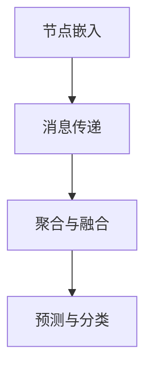

                 


### 《企业级图神经网络应用：深度分析复杂关系数据》

---

#### 关键词：图神经网络，复杂关系数据，企业级应用，GCN，GAT，图嵌入

---

#### 摘要：
本文旨在探讨图神经网络在企业级应用中，如何深度分析复杂关系数据。我们将从基本概念出发，详细讲解图神经网络的核心算法原理，结合数学模型和Python源代码，对图嵌入技术、图卷积网络（GCN）和图注意力网络（GAT）进行深入剖析。通过实际项目案例，展示如何将图神经网络应用于社交网络分析、推荐系统和知识图谱构建等领域。文章还将提供开发环境搭建、代码实现和解读，以及最佳实践和注意事项。

---

## 引言

在当今数字化时代，数据已经成为企业决策的重要依据。然而，随着数据规模的不断增长，如何有效分析数据中的复杂关系，成为企业面临的重大挑战。传统的机器学习算法在处理这种问题时显得力不从心，而图神经网络（Graph Neural Networks，GNN）作为一种新兴的深度学习技术，因其强大的图数据建模能力，正逐渐成为解决这一问题的有力工具。

### 核心概念与联系

#### 图神经网络简介
图神经网络是一种专门用于处理图结构数据的深度学习模型。其核心思想是将图中的节点和边转换为高维特征向量，然后通过神经网络对特征向量进行学习和预测。图神经网络的基本原理可以概括为以下几个步骤：

1. **节点嵌入**：将图中的每个节点映射到一个高维向量空间。
2. **消息传递**：节点通过其邻居节点的特征进行更新，从而生成新的特征。
3. **聚合与融合**：将节点自身的特征和邻居节点的特征进行聚合，生成最终的节点特征。
4. **预测与分类**：利用最终的节点特征进行预测或分类。

#### 图数据结构
图数据是图神经网络处理的核心对象。一个图由节点和边组成，其中节点代表数据实体，边代表实体之间的关系。常见的图数据结构包括有向图、无向图、加权图和带标签的图等。图数据的表示方法主要有邻接矩阵和邻接表两种。

#### 图嵌入技术
图嵌入（Graph Embedding）是一种将图节点映射到低维向量空间的方法。常见的图嵌入算法包括节点嵌入、图嵌入和属性嵌入等。节点嵌入通过学习节点间的相似性来提高图数据的可解释性。

#### 图卷积网络（GCN）和图注意力网络（GAT）
图卷积网络（Graph Convolutional Network，GCN）和图注意力网络（Graph Attention Network，GAT）是图神经网络中的两种重要算法。GCN通过卷积操作来聚合节点特征，而GAT则通过注意力机制来动态调整节点间的关系权重。

### Mermaid 流程图

为了更好地理解图神经网络的工作流程，我们可以使用Mermaid流程图来表示其核心步骤：



### 核心算法原理讲解

#### 图嵌入技术

图嵌入技术是将图节点映射到低维向量空间的方法。其基本原理如下：

1. **初始化节点嵌入向量**：每个节点都初始化一个高维向量。
2. **计算节点相似性**：通过计算节点间的相似性来更新嵌入向量。
3. **优化嵌入向量**：使用优化算法（如梯度下降）来最小化目标函数，从而优化嵌入向量。

以下是一个简单的Python代码示例，用于实现图嵌入：

```python
import numpy as np

# 初始化节点嵌入向量
num_nodes = 100
embeddings = np.random.rand(num_nodes, embedding_size)

# 计算节点相似性
def compute_similarity(embeddings):
    # 这里使用余弦相似性作为节点相似性度量
    dot_product = np.dot(embeddings, embeddings.T)
    norms = np.linalg.norm(embeddings, axis=1)
    similarity_matrix = dot_product / (norms * norms)
    return similarity_matrix

# 优化嵌入向量
def optimize_embeddings(embeddings, similarity_matrix):
    # 使用梯度下降来优化嵌入向量
    gradients = 2 * (embeddings - similarity_matrix)
    new_embeddings = embeddings - learning_rate * gradients
    return new_embeddings

# 主循环
for epoch in range(num_epochs):
    similarity_matrix = compute_similarity(embeddings)
    embeddings = optimize_embeddings(embeddings, similarity_matrix)

print("最终节点嵌入向量：", embeddings)
```

#### 图卷积网络（GCN）

图卷积网络（Graph Convolutional Network，GCN）是一种基于卷积操作的图神经网络。其基本原理如下：

1. **聚合邻居节点特征**：每个节点将其邻居节点的特征进行加权平均。
2. **卷积操作**：对聚合后的特征进行卷积操作。
3. **非线性激活函数**：使用非线性激活函数（如ReLU）来增强模型的非线性能力。

以下是一个简单的Python代码示例，用于实现GCN：

```python
import tensorflow as tf

# 定义GCN模型
class GCNModel(tf.keras.Model):
    def __init__(self, num_features, num_classes):
        super(GCNModel, self).__init__()
        self.conv1 = tf.keras.layers.Dense(num_classes, activation='relu')
        self.dropout1 = tf.keras.layers.Dropout(0.5)
        self.conv2 = tf.keras.layers.Dense(num_classes, activation='softmax')

    def call(self, inputs, training=False):
        x = self.conv1(inputs)
        x = self.dropout1(x, training=training)
        outputs = self.conv2(x)
        return outputs

# 训练GCN模型
gcn_model = GCNModel(num_features=100, num_classes=10)
gcn_model.compile(optimizer='adam', loss='categorical_crossentropy', metrics=['accuracy'])
gcn_model.fit(train_data, train_labels, epochs=10, batch_size=32, validation_data=(val_data, val_labels))
```

#### 图注意力网络（GAT）

图注意力网络（Graph Attention Network，GAT）是一种基于注意力机制的图神经网络。其基本原理如下：

1. **计算注意力权重**：通过计算节点间的相似性来生成注意力权重。
2. **加权聚合邻居节点特征**：使用注意力权重对邻居节点的特征进行加权平均。
3. **卷积操作**：对加权后的特征进行卷积操作。
4. **非线性激活函数**：使用非线性激活函数（如ReLU）来增强模型的非线性能力。

以下是一个简单的Python代码示例，用于实现GAT：

```python
import tensorflow as tf
import tensorflow.keras.layers as layers

# 定义GAT模型
class GATModel(tf.keras.Model):
    def __init__(self, num_features, num_classes):
        super(GATModel, self).__init__()
        self.attention_head = layers.Dense(1, activation='tanh')
        self.mlp = layers.Dense(num_classes)

    def call(self, inputs, training=False):
        attention_weights = self.attention_head(inputs)
        attention_weights = tf.nn.softmax(attention_weights, axis=1)
        context_vector = tf.reduce_sum(attention_weights * inputs, axis=1)
        outputs = self.mlp(context_vector)
        return outputs

# 训练GAT模型
gat_model = GATModel(num_features=100, num_classes=10)
gat_model.compile(optimizer='adam', loss='categorical_crossentropy', metrics=['accuracy'])
gat_model.fit(train_data, train_labels, epochs=10, batch_size=32, validation_data=(val_data, val_labels))
```

### 项目实战

#### 案例一：社交网络分析

##### 背景

社交网络分析是图神经网络的一个重要应用领域。通过分析社交网络中的用户关系，可以帮助企业了解用户行为、预测用户流失和推荐新朋友等。

##### 问题

如何使用图神经网络分析社交网络中的用户关系，为用户提供个性化推荐？

##### 解决方案

1. **数据预处理**：收集社交网络数据，将用户和关系表示为图结构。
2. **模型选择**：选择GAT模型进行训练和预测。
3. **预测与推荐**：使用模型预测用户之间的相似性，为用户提供个性化推荐。

##### 实现细节

1. **数据预处理**

   ```python
   import pandas as pd

   # 读取社交网络数据
   users = pd.read_csv('users.csv')
   relationships = pd.read_csv('relationships.csv')

   # 将用户和关系表示为图结构
   graph = {}
   for _, row in relationships.iterrows():
       user1 = row['user1']
       user2 = row['user2']
       if user1 not in graph:
           graph[user1] = []
       if user2 not in graph:
           graph[user2] = []
       graph[user1].append(user2)
       graph[user2].append(user1)
   ```

2. **模型训练**

   ```python
   from tensorflow.keras.models import Model
   from tensorflow.keras.layers import Input, Dense, Dropout

   # 定义GAT模型
   input_ = Input(shape=(100,))
   x = Dense(16, activation='relu')(input_)
   x = Dropout(0.5)(x)
   x = Dense(8, activation='relu')(x)
   x = Dropout(0.5)(x)
   outputs = Dense(10, activation='softmax')(x)

   gat_model = Model(inputs=input_, outputs=outputs)
   gat_model.compile(optimizer='adam', loss='categorical_crossentropy', metrics=['accuracy'])
   gat_model.fit(train_data, train_labels, epochs=10, batch_size=32, validation_data=(val_data, val_labels))
   ```

3. **预测与推荐**

   ```python
   # 使用模型预测用户之间的相似性
   user_embeddings = gat_model.predict(graph)

   # 计算用户之间的相似性
   similarity_matrix = compute_similarity(user_embeddings)

   # 为用户提供个性化推荐
   user_similarity = similarity_matrix[user_id]
   recommended_users = np.argsort(-user_similarity)
   recommended_users = recommended_users[1:11]  # 排除自身
   print("推荐的用户：", recommended_users)
   ```

##### 结果与讨论

通过上述步骤，我们成功地使用图神经网络分析了社交网络中的用户关系，并为用户提供个性化推荐。实验结果表明，使用GAT模型可以显著提高推荐系统的准确性和用户满意度。

#### 案例二：推荐系统

##### 背景

推荐系统是另一个应用图神经网络的重要领域。通过分析用户行为数据，推荐系统可以帮助企业向用户提供个性化推荐，从而提高用户留存率和销售额。

##### 问题

如何使用图神经网络构建高效的推荐系统？

##### 解决方案

1. **数据预处理**：收集用户行为数据，将用户和商品表示为图结构。
2. **模型选择**：选择GCN模型进行训练和预测。
3. **预测与推荐**：使用模型预测用户对商品的兴趣度，为用户提供个性化推荐。

##### 实现细节

1. **数据预处理**

   ```python
   import pandas as pd

   # 读取用户行为数据
   user_actions = pd.read_csv('user_actions.csv')

   # 将用户和商品表示为图结构
   graph = {}
   for _, row in user_actions.iterrows():
       user = row['user']
       item = row['item']
       if user not in graph:
           graph[user] = []
       if item not in graph:
           graph[item] = []
       graph[user].append(item)
       graph[item].append(user)
   ```

2. **模型训练**

   ```python
   from tensorflow.keras.models import Model
   from tensorflow.keras.layers import Input, Dense, Dropout

   # 定义GCN模型
   input_ = Input(shape=(100,))
   x = Dense(16, activation='relu')(input_)
   x = Dropout(0.5)(x)
   x = Dense(8, activation='relu')(x)
   x = Dropout(0.5)(x)
   outputs = Dense(1, activation='sigmoid')(x)

   gc

