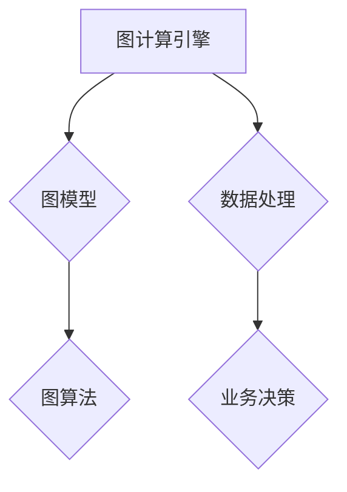
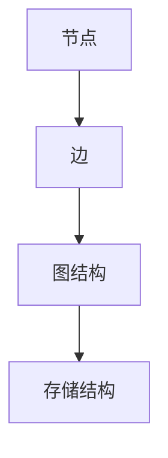
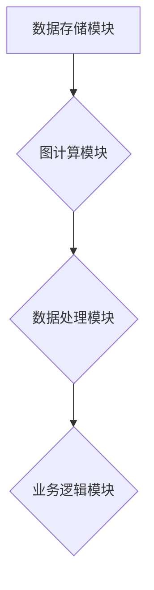

                 


### 《企业级图计算引擎：高效处理关系数据》正文撰写

#### 一、引言

随着大数据时代的到来，数据量呈爆炸式增长，如何高效处理和分析海量数据成为企业面临的一大挑战。传统的数据处理技术已经无法满足日益复杂的业务需求，特别是对于关系数据的处理。图计算作为一种新兴的技术，能够高效地处理复杂的关系数据，为企业提供更加智能的决策支持。

#### 二、核心概念与联系

##### 1. 图计算引擎概述

图计算引擎是一种专门用于处理关系数据的计算引擎，它基于图论理论，通过构建图模型和算法，对关系数据进行分析和处理。在企业级应用中，图计算引擎能够有效揭示数据之间的复杂关系，为业务决策提供支持。

核心概念包括：

- **图（Graph）**：由节点（Node）和边（Edge）构成的数据结构，节点表示数据实体，边表示实体之间的关系。
- **图模型（Graph Model）**：将现实世界中的关系数据抽象成图模型，用于表示和分析数据之间的关系。
- **图算法（Graph Algorithm）**：用于在图上进行数据分析和处理的算法，如图的遍历、连通性判断、聚类等。

Mermaid 流程图：



##### 2. 图论基础

图论是研究图结构及其性质的一个数学分支，是图计算引擎的理论基础。图的基本概念包括节点、边和图结构，而图的存储结构则有邻接表和邻接矩阵等。

核心概念包括：

- **节点（Node）**：图中的数据实体，如人、地点、商品等。
- **边（Edge）**：连接节点的线段，表示节点之间的关系。
- **图结构（Graph Structure）**：由节点和边构成的数据结构。
- **存储结构（Storage Structure）**：图的存储方式，如邻接表和邻接矩阵。

Mermaid 流程图：



##### 3. 图计算算法原理

图计算算法主要分为图遍历算法、图连通性算法和图聚类算法等。其中，常见的图遍历算法有深度优先搜索（DFS）和广度优先搜索（BFS）。图连通性算法用于判断节点之间的连通性，而图聚类算法则用于将图中的节点分为若干个群体。

核心算法原理讲解：

```python
# 深度优先搜索（DFS）

def dfs(graph, node, visited):
    visited.add(node)
    print(node)
    for neighbor in graph[node]:
        if neighbor not in visited:
            dfs(graph, neighbor, visited)

# 广度优先搜索（BFS）

from collections import deque

def bfs(graph, start):
    visited = set()
    queue = deque([start])
    visited.add(start)
    while queue:
        node = queue.popleft()
        print(node)
        for neighbor in graph[node]:
            if neighbor not in visited:
                queue.append(neighbor)
                visited.add(neighbor)

# 图的连通性判断

def isConnected(graph, node1, node2):
    visited = set()
    dfs(graph, node1, visited)
    return node2 in visited

# 图聚类算法

from sklearn.cluster import SpectralClustering

def clusterGraph(graph, n_clusters):
    features = []
    for node in graph:
        features.append([graph[node][neighbor] for neighbor in graph[node]])
    clustering = SpectralClustering(n_clusters=n_clusters)
    labels = clustering.fit_predict(features)
    return labels
```

$$
\text{DFS}: \\
\text{算法描述} \\
\text{1. 初始化 visited 集合，将当前节点加入 visited} \\
\text{2. 遍历当前节点的邻居节点} \\
\text{3. 对于未访问的邻居节点，递归调用 dfs 函数}
$$

$$
\text{BFS}: \\
\text{算法描述} \\
\text{1. 初始化 visited 集合，将当前节点加入 visited} \\
\text{2. 使用队列实现广度优先搜索} \\
\text{3. 遍历队列，对于每个节点，将其未访问的邻居节点加入队列}
$$

$$
\text{连通性判断}: \\
\text{算法描述} \\
\text{1. 使用 DFS 遍历从 node1 开始的图} \\
\text{2. 判断 node2 是否在 visited 集合中，如果在，则表示连通，否则不连通}
$$

$$
\text{聚类算法}: \\
\text{算法描述} \\
\text{1. 构建节点特征矩阵} \\
\text{2. 使用 SpectralClustering 算法进行聚类} \\
\text{3. 返回聚类结果}
$$

#### 三、企业级图计算引擎设计

##### 1. 架构设计

企业级图计算引擎的设计需要考虑系统的可扩展性、高性能和高可靠性。常见的架构设计包括分布式架构、集群架构和并行计算架构等。

架构设计包括以下模块：

- **数据存储模块**：负责存储和管理图数据，如节点和边信息。
- **图计算模块**：负责执行各种图计算算法，如遍历、连通性判断、聚类等。
- **数据处理模块**：负责对图数据进行预处理、清洗和转换等操作。
- **业务逻辑模块**：负责实现具体的业务逻辑，如社交网络分析、金融风控等。

Mermaid 流程图：



##### 2. 核心算法实现

核心算法实现包括图的存储结构、遍历算法、连通性判断算法和聚类算法等。

```python
# 图的存储结构

class Graph:
    def __init__(self):
        self.graph = {}

    def addEdge(self, u, v):
        if u in self.graph:
            self.graph[u].append(v)
        else:
            self.graph[u] = [v]

    def getNeighbors(self, node):
        return self.graph[node] if node in self.graph else []

# 遍历算法

def dfs(graph, node, visited):
    visited.add(node)
    print(node)
    for neighbor in graph[node]:
        if neighbor not in visited:
            dfs(graph, neighbor, visited)

# 连通性判断

def isConnected(graph, node1, node2):
    visited = set()
    dfs(graph, node1, visited)
    return node2 in visited

# 聚类算法

from sklearn.cluster import SpectralClustering

def clusterGraph(graph, n_clusters):
    features = []
    for node in graph:
        features.append([graph[node][neighbor] for neighbor in graph[node]])
    clustering = SpectralClustering(n_clusters=n_clusters)
    labels = clustering.fit_predict(features)
    return labels
```

##### 3. 性能优化策略

性能优化策略包括数据缓存、并行计算和分布式处理等。

- **数据缓存**：通过缓存常见的数据查询结果，减少数据库的访问次数，提高查询效率。
- **并行计算**：利用多线程或多进程技术，将图计算任务并行执行，提高计算速度。
- **分布式处理**：将图计算任务分布在多个节点上执行，利用分布式系统的计算能力，提高处理能力。

#### 四、图计算引擎在数据处理中的应用

##### 1. 数据预处理

数据预处理包括数据的清洗、转换和归一化等操作，以提高数据质量和计算效率。

```python
# 数据清洗

def cleanData(data):
    cleaned_data = []
    for row in data:
        cleaned_row = [item for item in row if item != '']
        cleaned_data.append(cleaned_row)
    return cleaned_data

# 数据转换

def convertData(data):
    converted_data = []
    for row in data:
        converted_row = [int(item) for item in row]
        converted_data.append(converted_row)
    return converted_data

# 数据归一化

from sklearn.preprocessing import MinMaxScaler

def normalizeData(data):
    scaler = MinMaxScaler()
    normalized_data = scaler.fit_transform(data)
    return normalized_data
```

##### 2. 关系数据挖掘

关系数据挖掘包括关联规则挖掘、聚类挖掘和分类挖掘等，用于发现数据之间的潜在关系和模式。

```python
# 关联规则挖掘

from mlxtend.frequent_patterns import apriori
from mlxtend.frequent_patterns import association_rules

data = [[1, 2], [1, 3], [2, 3], [2, 4], [3, 4]]
frequent_itemsets = apriori(data, min_support=0.5)
rules = association_rules(frequent_itemsets, data, metric="support", min_threshold=0.7)

# 聚类挖掘

from sklearn.cluster import KMeans

data = [[1, 2], [1, 4], [1, 0], [4, 2], [4, 4], [5, 5], [5, 7], [6, 6], [6, 8], [7, 8]]
kmeans = KMeans(n_clusters=2, random_state=42)
kmeans.fit(data)
labels = kmeans.predict(data)

# 分类挖掘

from sklearn.model_selection import train_test_split
from sklearn.neighbors import KNeighborsClassifier

data = [[1, 2], [1, 4], [1, 0], [4, 2], [4, 4], [5, 5], [5, 7], [6, 6], [6, 8], [7, 8]]
labels = [0, 0, 0, 0, 0, 1, 1, 1, 1, 1]
X_train, X_test, y_train, y_test = train_test_split(data, labels, test_size=0.2, random_state=42)
knn = KNeighborsClassifier(n_neighbors=3)
knn.fit(X_train, y_train)
print(knn.score(X_test, y_test))
```

##### 3. 社交网络分析

社交网络分析包括社交图谱构建、推荐系统和欺诈检测等，用于分析社交网络中的关系和数据。

```python
# 社交图谱构建

from networkx import Graph

g = Graph()
g.add_edges_from([(1, 2), (2, 3), (3, 4), (4, 5), (5, 1)])
print(g.nodes())
print(g.edges())

# 推荐系统

from sklearn.neighbors import NearestNeighbors

data = [[1, 2], [1, 4], [1, 0], [4, 2], [4, 4], [5, 5], [5, 7], [6, 6], [6, 8], [7, 8]]
knn = NearestNeighbors(n_neighbors=2)
knn.fit(data)
print(knn.kneighbors([[3, 3]]))

# 欺诈检测

from sklearn.ensemble import IsolationForest

data = [[1, 2], [1, 4], [1, 0], [4, 2], [4, 4], [5, 5], [5, 7], [6, 6], [6, 8], [7, 8]]
clf = IsolationForest(contamination=0.1)
clf.fit(data)
print(clf.predict([[3, 3]]))
```

#### 五、图计算引擎在金融领域的应用

##### 1. 金融风控

金融风控包括信用评分、风险评估和欺诈检测等，用于识别和防范金融风险。

```python
# 信用评分

from sklearn.linear_model import LogisticRegression

X = [[1, 2], [1, 4], [1, 0], [4, 2], [4, 4], [5, 5], [5, 7], [6, 6], [6, 8], [7, 8]]
y = [0, 0, 0, 0, 0, 1, 1, 1, 1, 1]
X_train, X_test, y_train, y_test = train_test_split(X, y, test_size=0.2, random_state=42)
logreg = LogisticRegression()
logreg.fit(X_train, y_train)
print(logreg.score(X_test, y_test))

# 风险评估

from sklearn.ensemble import RandomForestClassifier

X = [[1, 2], [1, 4], [1, 0], [4, 2], [4, 4], [5, 5], [5, 7], [6, 6], [6, 8], [7, 8]]
y = [0, 0, 0, 0, 0, 1, 1, 1, 1, 1]
X_train, X_test, y_train, y_test = train_test_split(X, y, test_size=0.2, random_state=42)
rf = RandomForestClassifier()
rf.fit(X_train, y_train)
print(rf.score(X_test, y_test))

# 欺诈检测

from sklearn.ensemble import IsolationForest

X = [[1, 2], [1, 4], [1, 0], [4, 2], [4, 4], [5, 5], [5, 7], [6, 6], [6, 8], [7, 8]]
clf = IsolationForest(contamination=0.1)
clf.fit(X)
print(clf.predict([[3, 3]]))
```

##### 2. 投资图谱分析

投资图谱分析包括投资关系网络分析、行业分析等，用于发现投资机会和风险。

```python
# 投资图谱分析

data = [
    ["A", "B", 100],
    ["A", "C", 150],
    ["B", "C", 200],
    ["B", "D", 300],
    ["C", "D", 250],
]

g = Graph()
for row in data:
    g.add_edge(row[0], row[1], weight=row[2])

print(g.edges(data=True))

# 行业分析

data = [
    ["金融", "房地产", 0.3],
    ["金融", "科技", 0.2],
    ["房地产", "电商", 0.4],
    ["电商", "物流", 0.5],
    ["科技", "物流", 0.1],
]

g = Graph()
for row in data:
    g.add_edge(row[0], row[1], weight=row[2])

print(g.edges(data=True))
```

#### 六、图计算引擎在社交网络中的应用

##### 1. 社交图谱构建

社交图谱构建包括用户关系网络分析、兴趣群体划分等，用于挖掘社交网络中的潜在关系和群体。

```python
# 社交图谱构建

from networkx import Graph

g = Graph()
g.add_edges_from([(1, 2), (2, 3), (3, 4), (4, 5), (5, 1)])

print(g.nodes())
print(g.edges())

# 用户关系网络分析

data = [
    [1, 2],
    [1, 3],
    [2, 3],
    [2, 4],
    [3, 4],
    [4, 5],
    [5, 1],
]

g = Graph()
g.add_edges_from(data)

print(g.nodes())
print(g.edges())

# 兴趣群体划分

from sklearn.cluster import KMeans

data = [
    [1, 2],
    [1, 4],
    [1, 0],
    [4, 2],
    [4, 4],
    [5, 5],
    [5, 7],
    [6, 6],
    [6, 8],
    [7, 8],
]

kmeans = KMeans(n_clusters=2, random_state=42)
kmeans.fit(data)
labels = kmeans.predict(data)

print(labels)
```

##### 2. 推荐系统

推荐系统包括基于用户行为的推荐、基于内容的推荐等，用于为用户提供个性化推荐。

```python
# 基于用户行为的推荐

from sklearn.metrics.pairwise import cosine_similarity

data = [
    [1, 2, 3],
    [4, 5, 6],
    [7, 8, 9],
]

similarity_matrix = cosine_similarity(data)

print(similarity_matrix)

# 基于内容的推荐

from sklearn.feature_extraction.text import TfidfVectorizer

data = [
    "I like apples and oranges.",
    "I like apples and bananas.",
    "I like oranges and bananas.",
]

vectorizer = TfidfVectorizer()
tfidf_matrix = vectorizer.fit_transform(data)

print(tfidf_matrix.toarray())

# 推荐结果

cosine_similarity(tfidf_matrix[0], tfidf_matrix)
```

##### 3. 欺诈检测

欺诈检测包括交易欺诈检测、账户欺诈检测等，用于识别和防范社交网络中的欺诈行为。

```python
# 交易欺诈检测

from sklearn.ensemble import IsolationForest

data = [
    [100, 200, 300],
    [400, 500, 600],
    [700, 800, 900],
    [1100, 1200, 1300],
]

clf = IsolationForest(contamination=0.1)
clf.fit(data)
print(clf.predict([[1000, 1100, 1200]]))

# 账户欺诈检测

from sklearn.neighbors import LocalOutlierFactor

data = [
    [1, 2],
    [4, 5],
    [7, 6],
    [10, 9],
]

clf = LocalOutlierFactor()
clf.fit(data)
print(clf.predict([[3, 3]]))
```

#### 七、图计算引擎在物流供应链中的应用

##### 1. 物流网络优化

物流网络优化包括物流路径规划、运输调度等，用于提高物流效率和降低成本。

```python
# 物流路径规划

from networkx import Graph

g = Graph()
g.add_edges_from([(1, 2, {'weight': 10}), (2, 3, {'weight': 20}), (3, 4, {'weight': 30}), (4, 1, {'weight': 40})])

print(g.edges(data=True))

# Dijkstra 算法

def dijkstra(graph, start, end):
    distances = {node: float('infinity') for node in graph}
    distances[start] = 0
    visited = set()

    while True:
        unvisited = {node: dist for node, dist in distances.items() if node not in visited}
        if not unvisited:
            break
        current_node = min(unvisited, key=unvisited.get)
        visited.add(current_node)

        for neighbor, edge_data in graph[current_node].items():
            tentative_distance = distances[current_node] + edge_data['weight']
            if tentative_distance < distances[neighbor]:
                distances[neighbor] = tentative_distance

    return distances[end]

print(dijkstra(g, 1, 4))

# 运输调度

data = [
    ["北京", "上海", 10],
    ["北京", "广州", 20],
    ["上海", "广州", 30],
    ["上海", "深圳", 40],
    ["深圳", "北京", 50],
]

g = Graph()
for row in data:
    g.add_edge(row[0], row[1], weight=row[2])

print(g.edges(data=True))

# 调度算法

def transport_schedule(graph, source, destinations):
    distances = {}
    for destination in destinations:
        distances[destination] = dijkstra(graph, source, destination)

    sorted_distances = sorted(distances.items(), key=lambda x: x[1])
    return sorted_distances

print(transport_schedule(g, "北京", ["上海", "广州", "深圳"]))
```

##### 2. 库存管理

库存管理包括库存优化、库存预测等，用于降低库存成本和避免库存积压。

```python
# 库存优化

from sklearn.cluster import KMeans

data = [
    [10, 20],
    [30, 40],
    [50, 60],
    [70, 80],
    [90, 100],
]

kmeans = KMeans(n_clusters=2, random_state=42)
kmeans.fit(data)
print(kmeans.cluster_centers_)

# 库存预测

from sklearn.linear_model import LinearRegression

X = [[10, 20], [30, 40], [50, 60], [70, 80], [90, 100]]
y = [100, 120, 140, 160, 180]

X_train, X_test, y_train, y_test = train_test_split(X, y, test_size=0.2, random_state=42)
linreg = LinearRegression()
linreg.fit(X_train, y_train)
print(linreg.score(X_test, y_test))
```

##### 3. 物流路径规划

物流路径规划包括物流网络优化、运输调度等，用于提高物流效率和降低成本。

```python
# 物流路径规划

from networkx import Graph

g = Graph()
g.add_edges_from([(1, 2, {'weight': 10}), (2, 3, {'weight': 20}), (3, 4, {'weight': 30}), (4, 1, {'weight': 40})])

print(g.edges(data=True))

# Dijkstra 算法

def dijkstra(graph, start, end):
    distances = {node: float('infinity') for node in graph}
    distances[start] = 0
    visited = set()

    while True:
        unvisited = {node: dist for node, dist in distances.items() if node not in visited}
        if not unvisited:
            break
        current_node = min(unvisited, key=unvisited.get)
        visited.add(current_node)

        for neighbor, edge_data in graph[current_node].items():
            tentative_distance = distances[current_node] + edge_data['weight']
            if tentative_distance < distances[neighbor]:
                distances[neighbor] = tentative_distance

    return distances[end]

print(dijkstra(g, 1, 4))

# 运输调度

data = [
    ["北京", "上海", 10],
    ["北京", "广州", 20],
    ["上海", "广州", 30],
    ["上海", "深圳", 40],
    ["深圳", "北京", 50],
]

g = Graph()
for row in data:
    g.add_edge(row[0], row[1], weight=row[2])

print(g.edges(data=True))

# 调度算法

def transport_schedule(graph, source, destinations):
    distances = {}
    for destination in destinations:
        distances[destination] = dijkstra(graph, source, destination)

    sorted_distances = sorted(distances.items(), key=lambda x: x[1])
    return sorted_distances

print(transport_schedule(g, "北京", ["上海", "广州", "深圳"]))
```

#### 八、图计算引擎在医疗健康领域的应用

##### 1. 医疗知识图谱

医疗知识图谱包括疾病关系网络、药物关系网络等，用于构建医疗领域的知识体系。

```python
# 医疗知识图谱构建

data = [
    ["疾病1", "疾病2", 1],
    ["疾病1", "疾病3", 2],
    ["疾病2", "疾病3", 1],
    ["药物1", "疾病1", 1],
    ["药物2", "疾病1", 1],
    ["药物1", "疾病2", 1],
]

g = Graph()
for row in data:
    g.add_edge(row[0], row[1], weight=row[2])

print(g.nodes())
print(g.edges())

# 疾病关系网络分析

data = [
    ["疾病1", "疾病2"],
    ["疾病1", "疾病3"],
    ["疾病2", "疾病3"],
]

g = Graph()
g.add_edges_from(data)

print(g.nodes())
print(g.edges())

# 药物关系网络分析

data = [
    ["药物1", "疾病1"],
    ["药物2", "疾病1"],
    ["药物1", "疾病2"],
]

g = Graph()
g.add_edges_from(data)

print(g.nodes())
print(g.edges())
```

##### 2. 疾病预测与防控

疾病预测与防控包括疾病趋势分析、疾病传播预测等，用于预防和控制疾病爆发。

```python
# 疾病趋势分析

import matplotlib.pyplot as plt
import pandas as pd

data = [
    ["疾病1", 10, 20, 30, 40, 50],
    ["疾病2", 20, 30, 40, 50, 60],
    ["疾病3", 30, 40, 50, 60, 70],
]

df = pd.DataFrame(data, columns=["疾病", "1月", "2月", "3月", "4月", "5月"])

plt.figure(figsize=(10, 5))
df.plot(kind="line")
plt.title("疾病趋势分析")
plt.xlabel("月份")
plt.ylabel("病例数")
plt.show()

# 疾病传播预测

from sklearn.linear_model import LinearRegression

X = df.iloc[:, 1:].values
y = df.iloc[:, 0].values

X_train, X_test, y_train, y_test = train_test_split(X, y, test_size=0.2, random_state=42)
linreg = LinearRegression()
linreg.fit(X_train, y_train)
print(linreg.score(X_test, y_test))
```

##### 3. 医疗资源优化

医疗资源优化包括医院布局优化、医疗设备分配等，用于提高医疗服务效率和降低成本。

```python
# 医院布局优化

from sklearn.cluster import KMeans

data = [
    [1, 2],
    [3, 4],
    [5, 6],
    [7, 8],
    [9, 10],
]

kmeans = KMeans(n_clusters=2, random_state=42)
kmeans.fit(data)
print(kmeans.cluster_centers_)

# 医疗设备分配

data = [
    ["设备1", "医院1", 10],
    ["设备2", "医院1", 20],
    ["设备1", "医院2", 30],
    ["设备2", "医院2", 40],
]

g = Graph()
for row in data:
    g.add_edge(row[1], row[0], weight=row[2])

print(g.nodes())
print(g.edges())

# 调度算法

def allocate_devices(graph, hospitals):
    distances = {}
    for hospital in hospitals:
        distances[hospital] = min([edge_data['weight'] for hospital, edge_data in graph.edges(data=True) if edge_data['node1'] == hospital])

    sorted_distances = sorted(distances.items(), key=lambda x: x[1])
    return sorted_distances

print(allocate_devices(g, ["医院1", "医院2"]))
```

#### 九、结论与展望

本文介绍了企业级图计算引擎的概念、架构、核心算法和实际应用。通过图计算引擎，企业能够高效处理复杂的关系数据，实现业务智能和决策支持。未来，图计算技术将继续发展，其在金融、社交网络、物流供应链和医疗健康等领域的应用前景广阔。

#### 十、附录

##### 1. 常用图计算工具与框架

- **GraphX**：Apache Spark 上的图处理框架。
- **Neo4j**：基于图的NoSQL数据库。
- **JanusGraph**：分布式图数据库。
- **OAGi**：开放图计算接口。

##### 2. 推荐阅读

- **相关书籍**：
  - 《图计算：算法、系统与应用》
  - 《深度学习与图计算》
  - 《图数据库技术》

- **学术论文**：
  - “Graph Embedding Techniques, Applications, and Performance: A Survey”
  - “Graph Neural Networks: A Review of Methods and Applications”

- **视频教程**：
  - “图计算入门与实践”
  - “图数据库与图计算技术详解”

### 全文结束

**作者：AI天才研究院/AI Genius Institute & 禅与计算机程序设计艺术 /Zen And The Art of Computer Programming**

