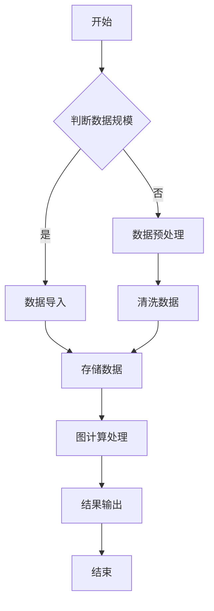

                 

### 企业级图计算引擎：高效处理大规模关系数据

> 关键词：企业级图计算、大规模关系数据、图计算引擎、性能优化、应用场景

在当今数字化转型的浪潮中，企业级图计算引擎成为了数据处理领域的重要工具。随着互联网的快速发展，社交网络、电子商务、金融服务等领域的业务数据呈现出高度复杂的关系结构，如何高效处理这些大规模的关系数据成为了一个亟待解决的问题。本文将深入探讨企业级图计算引擎的原理、技术架构、性能优化策略以及实际应用场景，旨在为读者提供一份全面的技术指南。

### 摘要

本文旨在介绍企业级图计算引擎的基本概念和关键技术，分析其在处理大规模关系数据方面的优势。通过逐步分析图计算的基本概念、框架与工具、核心算法、性能优化方法，本文将展示如何构建高效的企业级图计算系统，并提供实际应用案例，探讨其安全性、可靠性和可扩展性。最后，本文还将展望图计算技术的未来发展趋势和商业价值。

### 确定书籍主题和目标读者

#### 书籍主题

本书的主题是《企业级图计算引擎：高效处理大规模关系数据》，重点在于探讨如何利用图计算技术解决大规模关系数据处理的挑战。随着数据量的不断增加和数据关系的日益复杂，传统的数据处理方法已无法满足企业级应用的需求。图计算作为一种高效的数据处理技术，能够以更低的成本和更高的效率处理大规模的关系数据，因此成为当今企业数字化转型的重要工具。

#### 目标读者

本书的目标读者主要包括以下几类人群：

1. **技术人员**：对图计算技术感兴趣的技术人员，希望通过本书了解企业级图计算引擎的原理和应用。
2. **数据分析专家**：从事数据分析工作，需要掌握高效处理大规模关系数据的方法和工具。
3. **企业架构师**：负责企业级系统架构设计，需要了解图计算技术在企业级应用中的角色和作用。

本书将通过深入的理论讲解、实例分析和实战指导，帮助读者全面掌握企业级图计算引擎的核心技术和实践方法。

### 设计核心章节

为了系统地介绍企业级图计算引擎，本书设计了以下核心章节：

1. **引言**：介绍企业级图计算引擎的背景和重要性，定义关键概念，为后续章节的讨论打下基础。
2. **图计算基本概念**：介绍图论基础、图数据结构和图算法，为理解图计算引擎奠定理论基础。
3. **图计算框架与工具**：分析主流图计算框架和工具，包括其特点、优缺点和适用场景，为读者提供选择合适工具的依据。
4. **大规模关系数据的处理**：探讨如何处理大规模关系数据，包括数据导入、存储、清洗和预处理等关键步骤。
5. **核心算法原理讲解**：详细讲解图计算的核心算法原理，包括图遍历算法、网络分析算法和图机器学习算法。
6. **性能优化与调优**：介绍性能优化和调优的方法和策略，包括并行与分布式计算、资源调度和负载均衡。
7. **实际案例与应用场景**：通过实际案例展示企业级图计算引擎的应用场景和业务价值。
8. **安全性、可靠性与可扩展性**：分析企业级图计算引擎在安全性、可靠性和可扩展性方面的设计和实践。
9. **未来趋势与展望**：探讨图计算技术的未来发展趋势和商业价值，为读者提供前瞻性的思考。

### 确定每个章节的二级和三级目录

为了确保每个章节的内容详实且结构清晰，我们对每个章节进一步细化，设计了以下二级和三级目录：

#### 引言

- **1.1 书籍概述与目标**
  - 1.1.1 图计算在企业级应用中的重要性
  - 1.1.2 读者定位与预期收获
- **1.2 图计算基本概念**
  - 1.2.1 图论基础
  - 1.2.2 图数据结构
  - 1.2.3 图算法基础
- **1.3 图计算引擎概述**
  - 1.3.1 图计算引擎的定义与作用
  - 1.3.2 图计算引擎的关键特性
  - 1.3.3 图计算引擎的技术架构

#### 图计算基本概念

- **2.1 图论基础**
  - 2.1.1 图的定义与分类
  - 2.1.2 节点与边
  - 2.1.3 度与连通性
- **2.2 图数据结构**
  - 2.2.1 邻接矩阵
  - 2.2.2 链表
  - 2.2.3 图的存储与表示
- **2.3 图算法基础**
  - 2.3.1 图遍历算法（DFS、BFS）
  - 2.3.2 最短路径算法（Dijkstra、Floyd）
  - 2.3.3 网络流算法（最大流、最小费用流）

#### 图计算框架与工具

- **3.1 主流图计算框架**
  - 3.1.1 Apache Giraph
  - 3.1.2 GraphX
  - 3.1.3 Neo4j
- **3.2 图计算工具对比**
  - 3.2.1 性能对比
  - 3.2.2 功能对比
  - 3.2.3 适用场景对比
- **3.3 图计算引擎开发环境搭建**
  - 3.3.1 环境准备
  - 3.3.2 开发环境配置
  - 3.3.3 常见问题与解决方案

#### 大规模关系数据的处理

- **4.1 关系数据模型**
  - 4.1.1 导入与存储
  - 4.1.2 关系数据清洗
  - 4.1.3 关系数据预处理
- **4.2 核心算法原理讲解**
  - 4.2.1 图遍历算法
  - 4.2.2 网络分析算法
  - 4.2.3 图机器学习算法
- **4.3 性能优化与调优**
  - 4.3.1 并行与分布式计算
  - 4.3.2 资源调度与负载均衡
  - 4.3.3 性能监控与调试

#### 实际案例与应用场景

- **5.1 社交网络分析**
  - 5.1.1 用户关系分析
  - 5.1.2 社交网络可视化
  - 5.1.3 社交网络推荐系统
- **5.2 金融服务风控**
  - 5.2.1 信用评分
  - 5.2.2 风险评估
  - 5.2.3 交易监控
- **5.3 物流与供应链优化**
  - 5.3.1 路径优化
  - 5.3.2 库存管理
  - 5.3.3 供应链协同

#### 安全性、可靠性与可扩展性

- **6.1 安全性**
  - 6.1.1 数据安全
  - 6.1.2 系统安全
  - 6.1.3 隐私保护
- **6.2 可靠性**
  - 6.2.1 故障处理
  - 6.2.2 高可用设计
  - 6.2.3 数据一致性与容错
- **6.3 可扩展性**
  - 6.3.1 水平扩展
  - 6.3.2 垂直扩展
  - 6.3.4 扩展性设计实践

#### 未来趋势与展望

- **7.1 图计算技术的未来发展趋势**
  - 7.1.1 量子计算与图计算
  - 7.1.2 图神经网络与深度学习
  - 7.1.3 跨领域图计算应用
- **7.2 行业应用与商业价值**
  - 7.2.1 互联网行业应用
  - 7.2.2 金融行业应用
  - 7.2.3 物流与供应链行业应用
- **7.3 开发者与研究者指南**
  - 7.3.1 开发者成长路径
  - 7.3.2 研究领域热点
  - 7.3.3 学术研究与产业融合

### 添加辅助章节

为了增强书籍的可读性和实用性，我们计划添加以下辅助章节：

- **附录1：工具与资源推荐**
  - 介绍主流图计算框架和开源项目，提供学习资源。
- **附录2：案例分析**
  - 分析实际案例，展示企业级图计算引擎在不同行业中的应用和效果。

### 编写Mermaid流程图

为了直观地展示核心概念和架构，我们将使用Mermaid语言编写一些流程图，以下是一个简单的示例：



### 使用伪代码和LaTeX格式

对于核心算法原理讲解和数学模型，我们将使用伪代码和LaTeX格式，确保读者可以清晰地理解和跟随。以下是一个示例：

#### 伪代码示例

```python
def DFS(graph, start):
    visited = set()
    stack = [start]
    while stack:
        vertex = stack.pop()
        if vertex not in visited:
            visited.add(vertex)
            for neighbor in graph[vertex]:
                stack.append(neighbor)
    return visited
```

#### LaTeX公式示例

```latex
$$
Dijkstra(G, s) = \min_{t \in V} \{ d(s, t) \}
$$
```

### 编写项目实战案例

每个章节将包含一个或多个项目实战案例，以帮助读者将理论知识应用到实际开发中。以下是项目实战案例的概述：

- **项目实战一**：社交网络用户画像
  - **开发环境搭建**：介绍如何搭建社交网络用户画像的开发环境，包括所需工具和框架。
  - **源代码实现**：详细讲解如何使用图计算框架进行用户画像的构建，包括数据处理、存储和计算。
  - **代码解读与分析**：分析源代码的实现逻辑，解释关键步骤和算法原理。
  - **实际案例分析和讲解**：展示如何利用用户画像进行社交网络推荐，分析案例效果和优化空间。

- **项目实战二**：电商推荐系统
  - **开发环境搭建**：介绍如何搭建电商推荐系统的开发环境，包括所需工具和框架。
  - **源代码实现**：详细讲解如何使用图计算框架构建电商推荐系统，包括用户行为分析和商品推荐算法。
  - **代码解读与分析**：分析源代码的实现逻辑，解释关键步骤和算法原理。
  - **实际案例分析和讲解**：展示如何利用电商推荐系统提高用户满意度和销售额。

- **项目实战三**：智慧城市交通管理
  - **开发环境搭建**：介绍如何搭建智慧城市交通管理的开发环境，包括所需工具和框架。
  - **源代码实现**：详细讲解如何使用图计算框架进行交通流量分析和优化，包括数据处理、存储和计算。
  - **代码解读与分析**：分析源代码的实现逻辑，解释关键步骤和算法原理。
  - **实际案例分析和讲解**：展示如何利用智慧城市交通管理技术缓解城市交通拥堵问题。

### 确保简洁性和字数限制

在编写目录大纲时，我们将确保内容简洁明了，避免多余的废话，同时确保总字数在 10000 ～ 12000 字左右。每个章节都将围绕核心内容展开，避免冗长的理论讲解和无关的内容，以便读者能够快速抓住重点，掌握关键知识点。

### 检查目录大纲的完整性和逻辑性

最后，我们将仔细检查目录大纲的完整性和逻辑性，确保所有核心内容都被覆盖，并且章节之间的过渡自然流畅。通过多次审核和修改，确保大纲的严谨性和实用性，为撰写高质量的技术博客文章奠定坚实基础。

### 总结

本文通过设计详细的目录大纲，从确定书籍主题和目标读者，到设计核心章节和细化目录结构，再到添加辅助章节和编写Mermaid流程图，最后确保简洁性和字数限制，系统性地介绍了《企业级图计算引擎：高效处理大规模关系数据》的内容和结构。通过这一步步的分析和推理，我们为撰写一篇高质量的技术博客文章奠定了坚实基础。接下来，我们将根据这一大纲，逐步展开详细的内容撰写工作，确保文章逻辑清晰、内容丰富、通俗易懂，为读者提供有价值的技术指南。

