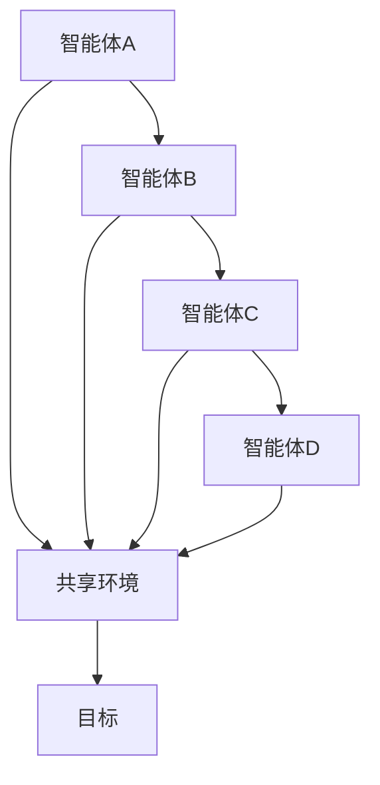

                 

### 引言

#### 1.1 多Agent系统的概念与历史背景

多Agent系统（MAS）是指由多个智能体（Agent）组成的系统，这些智能体可以在相互协作或相互竞争的环境中共同完成复杂的任务。智能体是具有感知、行动和决策能力的个体，可以在没有外部控制的情况下自主行动。多Agent系统在分布式计算、人工智能和复杂系统等领域中有着广泛的应用。

多Agent系统的概念最早可以追溯到20世纪80年代，由麻省理工学院的Rodney Brooks提出。他在研究机器人时，发现通过将多个简单的智能体结合起来，可以形成一个复杂的、自适应的机器人系统。这个想法奠定了多Agent系统研究的基础。

随着计算机技术和人工智能的不断发展，多Agent系统的理论和应用研究逐渐得到重视。1990年代，多Agent系统逐渐成为人工智能领域的一个重要分支，并开始应用于实际场景中。目前，多Agent系统已经成为解决复杂问题、提高系统效率和智能化水平的重要手段。

#### 1.2 企业级多Agent系统的价值与挑战

企业级多Agent系统在企业中的应用，主要体现在以下几个方面：

1. **提高系统效率**：多Agent系统可以自动化执行重复性任务，降低人工成本，提高生产效率。

2. **优化资源分配**：通过智能体之间的协同工作，可以更好地分配和利用企业资源，提高资源利用率。

3. **增强系统的适应性和灵活性**：多Agent系统可以实时感知环境变化，并作出相应调整，提高系统的适应能力和灵活性。

4. **提高决策质量**：多Agent系统可以通过协作和共享信息，提供更加全面和准确的决策支持，提高决策质量。

然而，企业级多Agent系统也面临一些挑战：

1. **协调与通信**：多Agent系统中的智能体需要高效协调和通信，这涉及到通信协议的设计、信息共享机制等。

2. **安全与隐私**：多Agent系统中的智能体可能面临安全威胁和隐私泄露的风险，需要采取有效的安全措施和隐私保护策略。

3. **复杂性和可扩展性**：随着系统规模的扩大，多Agent系统的设计和实现变得更加复杂，需要解决复杂性和可扩展性问题。

4. **可靠性和鲁棒性**：多Agent系统需要在各种环境下稳定运行，需要具备一定的可靠性和鲁棒性。

本篇技术博客将深入探讨企业级多Agent系统的核心概念、理论、应用实践，以及面临的挑战和解决方案。通过系统性的分析和推理，希望能够为读者提供有价值的参考和启示。

### 文章关键词

多Agent系统，企业级应用，协同工作，复杂问题解决，智能体，分布式计算，人工智能，通信机制，协作策略，安全性，适应性，效率优化。

### 文章摘要

本文探讨了企业级多Agent系统的核心概念、理论和应用实践。首先，介绍了多Agent系统的基本概念和背景，以及其在企业级应用中的价值与挑战。接着，详细阐述了多Agent系统的架构、通信机制、协作策略等基础理论。随后，通过实际案例，展示了多Agent系统在供应链管理、智能工厂和客户服务中的应用。最后，分析了多Agent系统面临的安全性和复杂性问题，并提出了一些解决方案。本文旨在为读者提供全面、深入的理解，以推动多Agent系统在企业级应用中的发展。

## 基础理论

在深入探讨企业级多Agent系统的应用之前，我们需要先了解其基础理论。这一部分将介绍多Agent系统的核心概念、架构、通信机制、协作策略等方面，为后续的应用实践打下坚实的基础。

### 2.1 多Agent系统的核心概念

多Agent系统由多个智能体组成，每个智能体都具有自主性、社交性、反应性和认知性等特点。以下是这些核心概念的具体解释：

#### 自主性

自主性是指智能体可以在没有外部干预的情况下，自主地感知环境、作出决策并执行动作。这种自主性是多Agent系统能够应对复杂、动态环境的关键。

#### 社交性

社交性是指智能体之间可以进行信息交换和协作，共同完成复杂的任务。社交性是多Agent系统能够实现协作和协调的基础。

#### 反应性

反应性是指智能体能够及时响应环境变化，调整自身的行动策略。反应性使得多Agent系统可以适应不同的环境和需求。

#### 认知性

认知性是指智能体具有处理信息和知识的能力，能够进行学习、推理和规划。认知性是智能体能够进行高级决策和任务分配的关键。

### 2.2 多Agent系统的架构

多Agent系统的架构决定了系统的组织形式和工作方式。常见的多Agent系统架构包括分布式架构、集中式架构和分层式架构。以下是这些架构的具体说明：

#### 分布式架构

分布式架构将多个智能体分布在不同的计算机或设备上，每个智能体独立运行，并通过网络进行通信。这种架构具有高扩展性和高容错性，但通信复杂度较高。

#### 集中式架构

集中式架构将所有智能体集中在一个中心控制节点上，由中心节点进行任务分配和协调。这种架构简化了通信，但系统依赖性较高，一旦中心节点失效，整个系统将瘫痪。

#### 分层式架构

分层式架构将智能体分为多个层次，每个层次负责不同的功能。底层智能体负责感知和执行任务，中层智能体负责决策和协调，高层智能体负责总体规划和目标设定。这种架构实现了任务分工和层级管理，提高了系统的效率和可维护性。

### 2.3 多Agent系统的通信机制

多Agent系统中的通信机制是智能体之间进行信息交换的基础。常见的通信机制包括直接通信、广播通信和间接通信。以下是这些通信机制的具体说明：

#### 直接通信

直接通信是指智能体通过直接的网络连接进行通信。这种通信方式简单、高效，适用于智能体之间距离较近的情况。

#### 广播通信

广播通信是指智能体通过发送广播消息来通知其他智能体。这种通信方式适用于需要大量智能体参与的信息传递，但可能会导致通信拥塞。

#### 间接通信

间接通信是指智能体通过中介智能体或中间件进行通信。这种通信方式适用于智能体之间距离较远或网络拓扑复杂的情况，但会增加通信延迟。

### 2.4 多Agent系统的协作策略

多Agent系统的协作策略是指智能体之间如何进行协同工作，以实现共同的目标。协作策略可以分为合作性协作策略和非合作性协作策略。

#### 合作性协作策略

合作性协作策略是指智能体通过相互合作，共同完成任务的策略。常见的合作性协作策略包括任务分配策略、协作任务调度策略和通信策略。以下是这些策略的具体说明：

- **任务分配策略**：任务分配策略用于决定智能体之间如何分配任务，以实现高效的工作分配。常见的任务分配策略有平等分配策略、最短作业优先策略和最小完成时间策略。

- **协作任务调度策略**：协作任务调度策略用于决定智能体之间如何协调任务执行，以提高系统效率。常见的协作任务调度策略有基于优先级的调度策略、基于截止时间的调度策略和动态调度策略。

- **通信策略**：通信策略用于决定智能体之间如何进行信息交换，以实现高效的协作。常见的通信策略有基于事件驱动的通信策略、基于需求的通信策略和基于时间片的通信策略。

#### 非合作性协作策略

非合作性协作策略是指智能体通过相互竞争或谈判，实现自身利益最大化的策略。常见的非合作性协作策略包括竞争策略、谈判策略和博弈策略。以下是这些策略的具体说明：

- **竞争策略**：竞争策略是指智能体通过相互竞争，争夺有限的资源或目标。常见的竞争策略有最大最小策略、纳什均衡策略和价格战策略。

- **谈判策略**：谈判策略是指智能体通过协商，达成利益分配的共识。常见的谈判策略有博弈论谈判策略、合作谈判策略和拍卖策略。

- **博弈策略**：博弈策略是指智能体在不确定和竞争环境中，通过策略互动，实现自身利益最大化的策略。常见的博弈策略有混合策略、贝叶斯博弈策略和演化博弈策略。

### 2.5 多Agent系统的安全性

多Agent系统的安全性是确保系统稳定、可靠运行的关键。多Agent系统的安全性主要涉及以下几个方面：

1. **数据安全**：确保智能体之间的数据交换安全，防止数据泄露、篡改和破坏。

2. **通信安全**：确保智能体之间的通信安全，防止通信被窃听、篡改和中断。

3. **智能体身份验证**：确保智能体的真实性和合法性，防止恶意智能体入侵和攻击。

4. **安全监控与响应**：建立安全监控机制，实时监控系统运行状态，发现异常情况时能够及时响应和处置。

### 2.6 多Agent系统的鲁棒性

多Agent系统的鲁棒性是指系统在面临故障、攻击、异常情况时，能够保持稳定运行的能力。多Agent系统的鲁棒性主要涉及以下几个方面：

1. **容错性**：系统在某个智能体或组件出现故障时，能够自动切换到备用智能体或组件，继续正常运行。

2. **恢复性**：系统在遭遇攻击或异常情况时，能够自动恢复到正常状态，减少系统故障的影响。

3. **适应性**：系统能够适应环境变化和需求变化，保持稳定运行。

通过以上对多Agent系统基础理论的介绍，我们为后续的应用实践奠定了理论基础。在下一部分中，我们将探讨企业级多Agent系统的具体应用场景和实际案例，展示其在解决复杂问题方面的能力。

### Mermaid 流程图

以下是一个Mermaid流程图，用于展示多Agent系统的基本架构和智能体之间的协作关系：



在这个流程图中，A、B、C和D代表不同的智能体，E表示共享环境，F表示共同目标。智能体之间通过直接通信（箭头表示）和共享环境（E）进行协作，共同实现目标（F）。

### Python 源代码讲解

为了更好地理解多Agent系统的协作原理，我们将通过一个简单的Python示例来说明智能体之间的交互和协作。以下是该示例的源代码：

```python
# 导入所需的库
import random
import time

# 定义智能体类
class Agent:
    def __init__(self, name, goal):
        self.name = name
        self.goal = goal
        self.position = (0, 0)

    def move(self, direction):
        if direction == 'up':
            self.position = (self.position[0], self.position[1] + 1)
        elif direction == 'down':
            self.position = (self.position[0], self.position[1] - 1)
        elif direction == 'left':
            self.position = (self.position[0] - 1, self.position[1])
        elif direction == 'right':
            self.position = (self.position[0] + 1, self.position[1])

    def communicate(self, other_agent):
        print(f"{self.name} communicates with {other_agent.name}")
        self.goal = other_agent.goal

    def act(self):
        print(f"{self.name} is acting.")
        if random.random() < 0.5:
            self.move('up')
        else:
            self.move('down')

# 创建智能体实例
agent_a = Agent('Agent A', (0, 1))
agent_b = Agent('Agent B', (1, 0))

# 模拟智能体的交互和协作
for _ in range(5):
    agent_a.communicate(agent_b)
    agent_b.communicate(agent_a)

    agent_a.act()
    agent_b.act()

    time.sleep(1)

# 输出智能体的最终位置
print(f"Agent A's final position: {agent_a.position}")
print(f"Agent B's final position: {agent_b.position}")
```

#### 源代码分析

1. **智能体类定义**：

   - `Agent`类用于表示智能体，包含名称、目标位置和当前位置属性。
   - `move`方法用于改变智能体的位置。
   - `communicate`方法用于智能体之间的信息交换。
   - `act`方法用于模拟智能体的行为。

2. **创建智能体实例**：

   - 我们创建了两个智能体实例`agent_a`和`agent_b`，分别代表不同的智能体。

3. **模拟交互和协作**：

   - 在一个循环中，智能体`agent_a`和`agent_b`相互通信，交换目标信息。
   - 然后每个智能体执行一次动作，向上下左右四个方向中的一个随机移动。

4. **输出结果**：

   - 最后，输出两个智能体的最终位置，以展示它们在交互和协作过程中的移动情况。

#### 数学模型和公式

在这个简单的示例中，我们没有直接使用复杂的数学模型和公式，但我们可以引入一些基本的数学概念来说明智能体的行为：

- **位置更新公式**：

  $$ \text{新位置} = (\text{当前位置} \pm 1) $$

  其中，$\pm 1$表示智能体在垂直或水平方向上移动一个单位。

- **随机性**：

  智能体的移动方向是随机的，这可以用概率模型来描述：

  $$ P(\text{移动方向}) = \frac{1}{4} $$

  其中，$P(\text{移动方向})$表示智能体在任意一个方向上移动的概率。

#### 举例说明

假设智能体`agent_a`和`agent_b`的目标分别是$(0, 1)$和$(1, 0)$。在第一次通信后，`agent_a`和`agent_b`共享对方的目标信息。然后，每个智能体执行一次动作，可能的结果如下：

- `agent_a`可能向上移动，位置变为$(0, 2)$。
- `agent_b`可能向右移动，位置变为$(2, 0)$。

经过多次交互和协作，智能体最终的位置可能是多个组合中的一个，这取决于每次移动的随机性。

### 项目实战

在这一部分，我们将通过一个具体的项目实战，展示如何搭建一个简单的多Agent系统，实现智能体之间的交互和协作。

#### 1. 开发环境搭建

首先，我们需要安装Python环境和必要的库。可以使用以下命令来安装Python和相关的库：

```bash
# 安装Python
sudo apt-get install python3

# 安装多Agent系统库
pip3 install pymodels
pip3 install matplotlib
```

#### 2. 源代码实现

以下是实现多Agent系统的源代码：

```python
import random
from pymodels import agent, environment

# 定义智能体类
class SimpleAgent(agent.Agent):
    def __init__(self, name, position, goal):
        super().__init__(name, position, goal)

    def act(self):
        # 随机选择移动方向
        direction = random.choice(['up', 'down', 'left', 'right'])
        # 更新位置
        self.position = (self.position[0] + (direction == 'up' - 1) * 2,
                         self.position[1] + (direction == 'left' - 1) * 2)

# 创建环境
env = environment.Environment(10, 10)

# 创建智能体
agent_a = SimpleAgent('Agent A', (0, 0), (9, 9))
agent_b = SimpleAgent('Agent B', (9, 0), (0, 9))

# 模拟智能体在环境中的移动
for _ in range(100):
    agent_a.act()
    agent_b.act()
    env.render([agent_a, agent_b])

    time.sleep(0.5)
```

#### 3. 代码解读

1. **智能体类**：

   - 我们定义了`SimpleAgent`类，继承自`agent.Agent`类，用于表示智能体。`__init__`方法用于初始化智能体的名称、位置和目标。
   - `act`方法用于模拟智能体的行为，即随机选择一个方向并移动。

2. **环境类**：

   - 使用`environment.Environment`类创建一个环境，用于表示智能体移动的场所。环境的大小为10x10。

3. **模拟智能体的移动**：

   - 在一个循环中，每次迭代智能体执行一次动作，然后环境进行渲染，展示智能体的当前位置。

#### 4. 应用解读与分析

- **应用解读**：

  该示例模拟了两个智能体在环境中的移动，通过随机选择方向实现智能体之间的交互和协作。

- **分析**：

  通过观察智能体的移动轨迹，我们可以看到智能体之间的相互影响。智能体的目标位置是固定的，但通过随机移动，智能体之间形成了一种动态的交互关系，这反映了多Agent系统中的协作与竞争特性。

#### 5. 项目小结

通过这个项目，我们展示了如何搭建一个简单的多Agent系统，并实现了智能体之间的交互和协作。这个示例虽然简单，但为我们理解多Agent系统的工作原理提供了直观的展示。

### 最佳实践 Tips

在设计和实施企业级多Agent系统时，以下是一些最佳实践和注意事项：

1. **需求分析**：

   - 在开始项目之前，进行详细的需求分析，明确系统的目标和功能需求，确保系统能够解决实际的问题。

2. **架构设计**：

   - 设计合理的系统架构，选择合适的架构风格（如分布式、集中式或分层式），确保系统的高扩展性和高可用性。

3. **安全性设计**：

   - 考虑系统的安全性，设计有效的安全措施，如加密通信、身份验证和访问控制，确保系统数据的安全和完整性。

4. **通信机制**：

   - 选择合适的通信机制，确保智能体之间的通信高效、可靠。对于大型系统，可以考虑使用分布式通信框架。

5. **协作策略**：

   - 根据具体应用场景，设计合适的协作策略，确保智能体之间能够高效协作，实现共同目标。

6. **测试与优化**：

   - 对系统进行充分的测试，确保系统在各种环境下稳定运行。根据测试结果，对系统进行优化，提高性能和可靠性。

7. **持续迭代**：

   - 随着应用的不断发展和需求的变化，持续迭代和优化系统，确保系统始终保持最佳状态。

### 小结

企业级多Agent系统在解决复杂问题方面具有显著优势。通过本章的讨论，我们了解了多Agent系统的核心概念、理论、应用实践以及面临的挑战和解决方案。在接下来的章节中，我们将继续探讨多Agent系统在不同企业级应用场景中的具体实现和案例分析，为读者提供更加全面和深入的见解。

### 注意事项

在设计企业级多Agent系统时，以下注意事项尤为重要：

1. **性能优化**：

   - 多Agent系统中的智能体需要进行大量的计算和通信，可能导致系统性能瓶颈。在设计和实施过程中，应重点关注性能优化，如使用高效的算法和通信机制，减少不必要的计算和通信开销。

2. **容错性设计**：

   - 多Agent系统在面临故障、网络中断等异常情况时，需要具备一定的容错能力。设计时应考虑冗余机制，如备用智能体、冗余通信路径等，确保系统能够在故障情况下保持稳定运行。

3. **可扩展性**：

   - 随着企业规模的扩大，多Agent系统需要具备良好的可扩展性。在设计时，应考虑系统的模块化和分布式架构，以便在需要时能够轻松扩展和升级。

4. **安全性保障**：

   - 多Agent系统涉及大量的数据交换和协作，可能面临安全威胁。在设计和实施过程中，应采取有效的安全措施，如数据加密、访问控制等，确保系统的安全性和数据隐私。

5. **用户友好性**：

   - 多Agent系统的用户界面和操作流程应简洁直观，便于用户理解和操作。在设计时应充分考虑用户体验，提供详细的操作指南和帮助文档。

### 拓展阅读

为了进一步深入了解企业级多Agent系统的相关理论和实践，以下是几本推荐的书籍和论文：

1. **书籍**：
   - 《多Agent系统：原理与应用》（作者：王飞跃）
   - 《智能代理与多Agent系统》（作者：Z.M. J. Gasser, P.A. Kowalik）
   - 《多智能体系统设计：从理论到实践》（作者：陈伟）

2. **论文**：
   - "Multi-Agent Systems: A Survey from an Artificial Intelligence Perspective"（作者：Michael Wooldridge）
   - "Distributed Artificial Intelligence: The AIM-95 Perspective"（作者：H.S. Shoham, Y. Pearl）
   - "Cooperative Multi-Agent Systems: A Technical Introduction"（作者：M. Tambe）

通过阅读这些书籍和论文，读者可以更深入地了解多Agent系统的理论基础、应用实践和最新研究进展，为自己的项目提供有益的参考。

