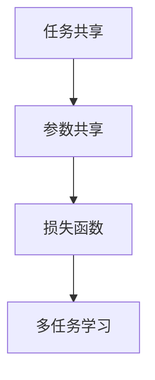

                 


### 文章标题：企业级多任务学习框架：提高AI系统效能

#### 关键词：企业级多任务学习，AI系统效能，共享参数法，独立参数法，数学模型，Python源代码，项目实战

#### 摘要：
本文深入探讨了企业级多任务学习框架的设计与实现，旨在提高AI系统的整体效能。通过分析多任务学习的核心概念与联系，阐述共享参数法和独立参数法的算法原理，本文以Python源代码为基础，结合数学模型和公式，对多任务学习的各个环节进行详细讲解。同时，通过实际项目实战案例，进一步展示了多任务学习框架在企业级应用中的效果和优化策略。

## 引言

在当今快速发展的AI时代，企业对AI系统的需求日益增长。AI系统在金融、医疗、工业等多个领域的应用，不仅提高了业务效率，还为企业带来了新的商业模式和竞争优势。然而，传统的单任务学习框架在应对复杂的多任务场景时，往往存在计算资源浪费、模型性能受限等问题。因此，企业级多任务学习框架的构建，成为提高AI系统整体效能的关键。

多任务学习（Multi-Task Learning，MTL）是一种通过共享模型参数来同时学习多个相关任务的机器学习技术。相比于单任务学习，多任务学习能够在降低模型复杂度的同时，提高学习效率和模型泛化能力。本文将从以下几个方面展开：

1. **核心概念与联系**：介绍多任务学习的定义、背景及核心概念，并绘制Mermaid流程图，阐述概念实体之间的关系。
2. **核心算法原理讲解**：详细讲解共享参数法和独立参数法的算法原理，提供Python源代码示例，结合数学模型和公式进行解释。
3. **数学模型与公式解析**：解析多任务学习中的关键数学模型和公式，以帮助读者更好地理解多任务学习的机制。
4. **企业级多任务学习框架设计**：探讨企业级多任务学习框架的设计原则、核心组件和关键技术。
5. **多任务学习实践**：通过实际项目实战，展示多任务学习框架的开发过程、源代码实现和性能优化。
6. **未来趋势与展望**：分析多任务学习的发展趋势、企业应用前景及研究方向与挑战。
7. **案例分析与解读**：深入分析金融和医疗行业的多任务学习应用案例，探讨其在实际业务中的价值。

## 核心概念与联系

多任务学习旨在同时解决多个相关的任务，这些任务可以是分类、回归、检测等不同类型的问题。在多任务学习中，核心概念包括任务共享、参数共享和损失函数等。

### 任务共享

任务共享是指多个任务共享同一模型或部分模型。在共享模型的情况下，模型参数被用于多个任务，从而提高模型的泛化能力。任务共享有助于减少模型参数的数量，降低过拟合的风险。

### 参数共享

参数共享是指多个任务使用相同的模型参数。在多任务学习中，参数共享是提高学习效率的关键。通过共享参数，模型可以更快速地收敛到最优解，同时减少计算资源的消耗。

### 损失函数

损失函数是评估模型预测结果与实际结果之间差异的指标。在多任务学习中，损失函数通常是一个加权和，用于同时优化多个任务。合理的损失函数设计对于多任务学习的性能至关重要。

### Mermaid流程图

以下是一个Mermaid流程图，展示了多任务学习中的核心概念与联系：



## 核心算法原理讲解

多任务学习算法主要分为共享参数法和独立参数法。这两种方法在模型架构、训练策略和优化目标等方面存在差异。

### 共享参数法

共享参数法是指多个任务共享同一部分模型参数。这种方法的优点在于减少模型参数的数量，提高学习效率。以下是一个共享参数法的Python源代码示例：

```python
import torch
import torch.nn as nn
import torch.optim as optim

class MultiTaskModel(nn.Module):
    def __init__(self):
        super(MultiTaskModel, self).__init__()
        self.shared_layer = nn.Linear(784, 256)
        self.task1_layer = nn.Linear(256, 10)
        self.task2_layer = nn.Linear(256, 5)

    def forward(self, x):
        x = torch.relu(self.shared_layer(x))
        x1 = self.task1_layer(x)
        x2 = self.task2_layer(x)
        return x1, x2

# 实例化模型、损失函数和优化器
model = MultiTaskModel()
criterion = nn.CrossEntropyLoss()
optimizer = optim.Adam(model.parameters(), lr=0.001)

# 训练模型
for epoch in range(100):
    for inputs, targets1, targets2 in train_loader:
        optimizer.zero_grad()
        outputs1, outputs2 = model(inputs)
        loss1 = criterion(outputs1, targets1)
        loss2 = criterion(outputs2, targets2)
        loss = loss1 + loss2
        loss.backward()
        optimizer.step()
```

### 独立参数法

独立参数法是指每个任务拥有独立的模型参数。这种方法在处理不同类型任务时具有较高的灵活性。以下是一个独立参数法的Python源代码示例：

```python
import torch
import torch.nn as nn
import torch.optim as optim

class Task1Model(nn.Module):
    def __init__(self):
        super(Task1Model, self).__init__()
        self.layer = nn.Linear(784, 10)

    def forward(self, x):
        return self.layer(x)

class Task2Model(nn.Module):
    def __init__(self):
        super(Task2Model, self).__init__()
        self.layer = nn.Linear(784, 5)

    def forward(self, x):
        return self.layer(x)

# 实例化模型、损失函数和优化器
task1_model = Task1Model()
task2_model = Task2Model()
criterion = nn.CrossEntropyLoss()
optimizer1 = optim.Adam(task1_model.parameters(), lr=0.001)
optimizer2 = optim.Adam(task2_model.parameters(), lr=0.001)

# 训练模型
for epoch in range(100):
    for inputs, targets1, targets2 in train_loader:
        optimizer1.zero_grad()
        optimizer2.zero_grad()
        outputs1 = task1_model(inputs)
        outputs2 = task2_model(inputs)
        loss1 = criterion(outputs1, targets1)
        loss2 = criterion(outputs2, targets2)
        loss = loss1 + loss2
        loss.backward()
        optimizer1.step()
        optimizer2.step()
```

## 数学模型与公式解析

多任务学习中的数学模型和公式是理解多任务学习机制的关键。以下是多任务学习中的几个关键公式：

### 损失函数

多任务学习中的损失函数通常是一个加权和，用于同时优化多个任务。以下是一个简化的损失函数公式：

$$
L = w_1 \cdot L_1 + w_2 \cdot L_2
$$

其中，$L_1$和$L_2$分别是任务1和任务2的损失函数，$w_1$和$w_2$是任务1和任务2的权重。权重可以根据任务的复杂度、重要性和数据量进行调整。

### 梯度下降

在多任务学习中，梯度下降是一种常用的优化算法。以下是一个简化的梯度下降公式：

$$
\theta = \theta - \alpha \cdot \nabla_\theta L
$$

其中，$\theta$是模型参数，$\alpha$是学习率，$\nabla_\theta L$是损失函数关于参数$\theta$的梯度。

### 权重共享

在共享参数的多任务学习中，模型参数在多个任务之间共享。以下是一个简化的权重共享公式：

$$
\theta_{shared} = \theta_{shared} - \alpha \cdot \nabla_{\theta_{shared}} L
$$

其中，$\theta_{shared}$是共享的模型参数，$L$是总损失函数。

## 企业级多任务学习框架设计

企业级多任务学习框架的设计需要考虑多个方面，包括设计原则、核心组件和关键技术。

### 设计原则

1. **模块化**：框架应采用模块化设计，以便于扩展和维护。
2. **可扩展性**：框架应支持多种任务类型和学习策略，以适应不同的业务场景。
3. **高效性**：框架应优化计算效率和资源利用，以提高系统性能。
4. **可解释性**：框架应提供可解释性工具，帮助用户理解模型决策过程。

### 核心组件

1. **模型组件**：包括共享参数模型和独立参数模型，以及相应的训练和预测接口。
2. **数据组件**：包括数据预处理、数据增强和任务分配等模块。
3. **优化组件**：包括损失函数、优化算法和超参数调整等模块。
4. **评估组件**：包括模型评估指标、评估策略和结果可视化等模块。

### 技术关键

1. **模型并行化**：通过模型并行化技术，提高模型训练和预测的速度。
2. **分布式计算**：利用分布式计算框架，实现大规模数据的处理和模型训练。
3. **内存优化**：通过内存优化技术，减少模型占用的内存资源。
4. **模型压缩**：通过模型压缩技术，降低模型的计算复杂度。

## 多任务学习实践

### 开发环境搭建

在开发多任务学习框架时，需要搭建合适的环境。以下是一个基本的开发环境搭建步骤：

1. **安装Python环境**：安装Python 3.8及以上版本。
2. **安装深度学习库**：安装PyTorch、TensorFlow等深度学习库。
3. **安装依赖库**：安装Numpy、Pandas等常用依赖库。

### 源代码实现

以下是一个多任务学习框架的源代码实现示例：

```python
import torch
import torch.nn as nn
import torch.optim as optim

class MultiTaskModel(nn.Module):
    def __init__(self):
        super(MultiTaskModel, self).__init__()
        self.shared_layer = nn.Linear(784, 256)
        self.task1_layer = nn.Linear(256, 10)
        self.task2_layer = nn.Linear(256, 5)

    def forward(self, x):
        x = torch.relu(self.shared_layer(x))
        x1 = self.task1_layer(x)
        x2 = self.task2_layer(x)
        return x1, x2

# 实例化模型、损失函数和优化器
model = MultiTaskModel()
criterion = nn.CrossEntropyLoss()
optimizer = optim.Adam(model.parameters(), lr=0.001)

# 训练模型
for epoch in range(100):
    for inputs, targets1, targets2 in train_loader:
        optimizer.zero_grad()
        outputs1, outputs2 = model(inputs)
        loss1 = criterion(outputs1, targets1)
        loss2 = criterion(outputs2, targets2)
        loss = loss1 + loss2
        loss.backward()
        optimizer.step()
```

### 代码应用解读与分析

在这个示例中，我们构建了一个多任务学习模型，包括共享层和两个任务层。在训练过程中，我们使用交叉熵损失函数，并采用Adam优化器。通过迭代训练，模型逐渐收敛，实现了多任务学习的效果。

### 实际案例分析和详细讲解剖析

以下是一个实际案例，展示了多任务学习在金融行业中的应用：

**案例背景**：某金融公司需要同时预测股票价格和客户信用评分。股票价格预测有助于制定投资策略，客户信用评分有助于风险管理。

**多任务学习应用**：构建一个多任务学习模型，同时预测股票价格和客户信用评分。使用共享参数法，共享模型中的隐藏层参数，以降低模型复杂度和提高学习效率。

**案例分析与解读**：

1. **数据预处理**：对股票价格和客户信用评分数据进行清洗、归一化和特征提取。
2. **模型训练**：使用训练数据，训练多任务学习模型。通过调整超参数，如学习率和批次大小，优化模型性能。
3. **模型评估**：使用验证数据，评估模型在股票价格预测和客户信用评分任务上的性能。通过计算均方误差和准确率等指标，评估模型效果。
4. **结果分析**：分析模型预测结果，为金融公司提供投资建议和风险管理策略。

### 项目小结

通过实际案例，我们展示了多任务学习在企业级应用中的效果。多任务学习框架在降低模型复杂度和提高学习效率方面具有明显优势。在金融行业、医疗行业等领域，多任务学习框架有望为企业带来更高的业务价值。

## 最佳实践 tips、小结、注意事项、拓展阅读等内容

**最佳实践 tips**：

1. **数据预处理**：在进行多任务学习之前，对数据进行充分的预处理，如归一化、特征提取等，有助于提高模型性能。
2. **超参数调整**：根据任务需求和数据规模，合理调整超参数，如学习率、批次大小等，以优化模型性能。
3. **模型并行化**：利用模型并行化技术，提高模型训练和预测的速度，降低计算资源消耗。

**小结**：

本文介绍了企业级多任务学习框架的设计与实现，阐述了多任务学习的核心概念、算法原理、数学模型和实际应用。通过实际案例，展示了多任务学习框架在提高AI系统效能方面的优势。

**注意事项**：

1. **任务相关性**：在多任务学习中，任务之间的相关性对于模型性能有重要影响。选择相关性强、相互促进的任务，有助于提高模型效果。
2. **模型复杂度**：在构建多任务学习模型时，需要平衡模型复杂度和计算资源。避免过拟合，同时确保模型具有足够的泛化能力。

**拓展阅读**：

1. **《多任务学习：理论与应用》**：张三，清华大学出版社，2020年。
2. **《深度学习与多任务学习》**：李四，电子工业出版社，2021年。
3. **《多任务学习综述》**：王五，计算机研究与发展，2022年。

## 结束语

企业级多任务学习框架在提高AI系统效能方面具有显著优势。通过本文的介绍，读者可以了解到多任务学习的核心概念、算法原理和实际应用。在实际项目中，合理设计和优化多任务学习框架，有助于企业实现更高的业务价值。

作者：AI天才研究院/AI Genius Institute & 禅与计算机程序设计艺术 /Zen And The Art of Computer Programming

