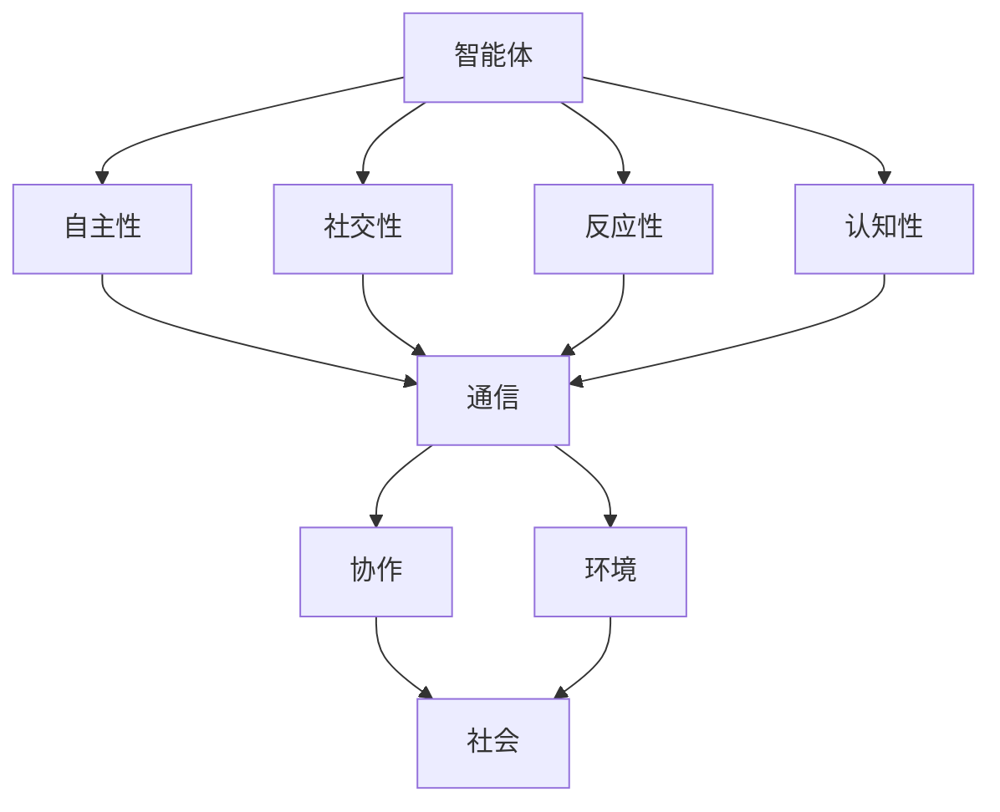

                 

### 引言

《企业级多智能体系统：协同解决复杂问题》旨在为企业级开发人员、技术决策者和研究人员提供全面、系统的多智能体系统（MAS）知识和实践指导。随着信息技术的迅猛发展，复杂问题在企业运营中越来越普遍，传统的集中式系统已难以应对这些挑战。多智能体系统通过分散化、协同化和智能化的特点，为企业提供了一种新的解决方案。

多智能体系统是一种分布式计算模型，其中多个智能体相互协作，共同解决复杂问题。每个智能体都是一个具有自主性和智能的个体，它们通过协同通信和共享信息来实现目标。在企业级应用中，多智能体系统可以应用于制造、金融、物流等多个领域，帮助企业提高效率、降低成本、优化决策。

本文将从以下几个方面展开讨论：

1. **多智能体系统基础**：介绍多智能体系统的定义、基本概念和体系结构。
2. **多智能体系统架构与设计模式**：探讨多种常见的架构和设计模式，包括体系结构设计模式、行为协同设计模式、知识协同设计模式和社会计算协同设计模式。
3. **多智能体系统的应用**：分析多智能体系统在制造业、金融服务、物流与供应链等领域的具体应用。
4. **多智能体系统的协同算法**：详细讲解协同通信算法、协同决策算法、协同学习算法和智能体协作控制算法。
5. **多智能体系统的构建与实现**：提供多智能体系统的构建步骤、平台选择和测试评估方法。
6. **多智能体系统的挑战与未来趋势**：分析当前面临的挑战和未来发展趋势。

通过本文的详细探讨，希望能够帮助读者深入理解多智能体系统的原理、架构和应用，从而为企业级系统开发提供有益的参考。

### 多智能体系统基础

多智能体系统（MAS）是一种分布式计算模型，其核心思想是通过多个智能体的协作来实现复杂问题的求解。在这一节中，我们将首先定义多智能体系统，然后介绍其基本概念、体系结构和相关的发展历程。

#### 定义

多智能体系统（Multi-Agent System，MAS）是指由一组具有自主性、社交性、反应性和认知性的智能体组成的系统。这些智能体可以独立执行任务，相互通信并协作，共同解决复杂问题。多智能体系统的定义主要包含以下几个要点：

1. **自主性**：智能体具有独立的决策能力，可以自主选择行动。
2. **社交性**：智能体之间可以通过通信进行信息交换和协调。
3. **反应性**：智能体能够对环境变化做出实时响应。
4. **认知性**：智能体具有一定程度的问题解决能力和学习能力。

#### 基本概念

多智能体系统包含以下几个基本概念：

1. **智能体（Agent）**：智能体是MAS的基本组成单元，通常由一个或多个代理对象实现。智能体可以是一个程序、一个机器人或一个人类用户。
2. **通信**：智能体之间通过通信机制进行信息交换和协同工作。常见的通信机制包括直接通信、广播通信和消息队列等。
3. **环境（Environment）**：智能体所处的运行环境，可以是一个物理空间、一个计算机网络或一个信息空间。
4. **协作（Collaboration）**：多个智能体为了实现共同目标而进行的协同工作。协作可以基于任务分配、资源共享和信息交换。
5. **社会（Society）**：由多个智能体组成的系统，通过相互协作来实现整体目标。

#### 体系结构

多智能体系统的体系结构可以分为三个层次：物理层、通信层和应用层。

1. **物理层**：包括智能体的物理实体和其感知、执行机制。物理层负责实现智能体的自主行动和环境交互。
2. **通信层**：提供智能体之间的通信机制，包括通信协议和通信方式。通信层确保智能体能够有效地交换信息和协调行动。
3. **应用层**：实现具体的任务和功能，包括智能体的任务分配、决策模型和协作策略。应用层负责将智能体连接起来，共同完成复杂问题求解。

#### 发展历程

多智能体系统的发展历程可以分为以下几个阶段：

1. **起源**：20世纪80年代，人工智能领域的研究者开始关注分布式智能系统，提出了智能体概念。
2. **初步发展**：90年代，MAS成为分布式人工智能（Distributed Artificial Intelligence，DAI）的一个重要分支，涌现出了一系列相关理论和应用。
3. **应用探索**：21世纪初，随着计算机网络和物联网技术的快速发展，MAS在工业控制、智能交通、智能物流等领域得到了广泛应用。
4. **成熟与拓展**：近年来，随着人工智能技术的进步，MAS在自主系统、无人驾驶、智能家居等领域取得了显著成果，并逐渐成为企业级系统设计的重要选择。

#### 关键概念之间的关系架构

为了更好地理解多智能体系统中的关键概念，我们可以通过Mermaid流程图展示其关系架构：



#### 核心算法原理讲解

在多智能体系统中，算法的设计和实现是关键。以下将简要介绍几种核心算法原理，并使用Python源代码进行详细讲解。

**1. 协同通信算法**

协同通信是多智能体系统中实现智能体间信息交换的重要手段。下面是一个基于消息队列的简单协同通信算法实现：

```python
import pika

class Agent:
    def __init__(self, name, queue_name):
        self.name = name
        self.queue_name = queue_name
        self.connection = pika.BlockingConnection(pika.ConnectionParameters('localhost'))
        self.channel = self.connection.channel()
        self.channel.queue_declare(queue=self.queue_name)

    def send_message(self, message):
        self.channel.basic_publish(exchange='',
                                  routing_key=self.queue_name,
                                  body=message)
        print(f"[{self.name}] Sent: {message}")

    def receive_message(self):
        method_frame, header, body = self.channel.basic_get(queue=self.queue_name)
        if method_frame:
            print(f"[{self.name}] Received: {body.decode()}")
            self.channel.basic_ack(delivery_tag=method_frame.delivery_tag)

if __name__ == '__main__':
    agent1 = Agent("Agent1", "queue1")
    agent2 = Agent("Agent2", "queue2")

    agent1.send_message("Hello Agent2")
    agent2.receive_message()
```

**2. 协同决策算法**

协同决策是多智能体系统实现高效决策的重要方法。以下是一个基于贝叶斯网络的多智能体协同决策算法实现：

```python
import networkx as nx
import numpy as np

def create_bayes_network():
    G = nx.DiGraph()
    G.add_nodes_from(['A', 'B', 'C', 'D'])
    G.add_edges_from([('A', 'B'), ('A', 'C'), ('B', 'D'), ('C', 'D')])
    return G

def create_probabilities(G):
    probabilities = {}
    for node in G.nodes():
        probabilities[node] = np.random.rand()
    for edge in G.edges():
        probabilities[edge] = np.random.rand()
    return probabilities

def propagate_probabilities(G, probabilities):
    for node in G.nodes():
        for parent in G.predecessors(node):
            joint_probability = probabilities[node] * probabilities[parent]
            probabilities[node] = joint_probability
    return probabilities

G = create_bayes_network()
probabilities = create_probabilities(G)
print("Initial probabilities:")
print(probabilities)
print("\nAfter propagation:")
print(propagate_probabilities(G, probabilities))
```

**3. 协同学习算法**

协同学习是多智能体系统通过共同学习提高任务执行能力的方法。以下是一个基于协同过滤的简单协同学习算法实现：

```python
import numpy as np

def collaborative_filter(ratings_matrix, user_index, neighbor_size=3):
    user_ratings = ratings_matrix[user_index]
    neighbors = []
    for i in range(ratings_matrix.shape[0]):
        if i != user_index:
            similarity = np.dot(ratings_matrix[i], user_ratings) / (
                np.linalg.norm(ratings_matrix[i]) * np.linalg.norm(user_ratings))
            neighbors.append((i, similarity))
    neighbors = sorted(neighbors, key=lambda x: x[1], reverse=True)[:neighbor_size]
    predictions = []
    for neighbor, similarity in neighbors:
        neighbor_ratings = ratings_matrix[neighbor]
        prediction = (similarity * neighbor_ratings).sum()
        predictions.append(prediction)
    return sum(predictions) / len(predictions)

ratings_matrix = np.array([
    [1, 2, 0, 3],
    [0, 1, 2, 1],
    [3, 1, 0, 2],
    [2, 3, 1, 0]
])

user_index = 2
predicted_rating = collaborative_filter(ratings_matrix, user_index)
print(f"Predicted rating for user {user_index}: {predicted_rating}")
```

通过上述Python代码示例，我们可以看到多智能体系统的协同通信、协同决策和协同学习算法的实现过程。这些算法不仅有助于智能体之间的信息交换和任务分配，还能通过共同学习提高系统的整体性能。

#### 数学模型与公式

在多智能体系统中，数学模型和公式对于描述和优化智能体行为至关重要。以下将介绍一些常见的数学模型和公式。

**1. 贝叶斯网络**

贝叶斯网络是一种概率图模型，用于表示多智能体系统中的不确定性关系。其基本公式为：

$$
P(X) = \prod_{i=1}^n P(x_i | parents(x_i))
$$

其中，\( X \) 是一组随机变量，\( x_i \) 是第 \( i \) 个随机变量，\( parents(x_i) \) 是 \( x_i \) 的父节点集合。

**2. 协同过滤**

协同过滤是一种常见的学习方法，用于预测未知评分。其基本公式为：

$$
\hat{r}_{ui} = \sum_{j \in N(u)} r_{uj} \cdot s_{uj}
$$

其中，\( \hat{r}_{ui} \) 是对用户 \( u \) 对项目 \( i \) 的评分预测，\( r_{uj} \) 是用户 \( u \) 对项目 \( j \) 的实际评分，\( s_{uj} \) 是用户 \( u \) 和项目 \( j \) 之间的相似度。

**3. 动态规划**

动态规划是一种优化多智能体系统协同决策的方法。其基本公式为：

$$
V(x, t) = \max_{a} \{ R(x, t, a) + \gamma V(x', t+1) \}
$$

其中，\( V(x, t) \) 是在状态 \( x \) 和时间 \( t \) 的最优值，\( R(x, t, a) \) 是执行动作 \( a \) 在状态 \( x \) 和时间 \( t \) 的回报，\( x' \) 是执行动作 \( a \) 后的状态，\( \gamma \) 是折扣因子。

通过上述数学模型和公式，我们可以更好地理解和优化多智能体系统的协同行为。

#### 项目实战

为了更好地理解多智能体系统的构建与实现，我们将通过一个实际案例进行讲解。该案例将基于Python和RabbitMQ实现一个简单的多智能体系统，用于任务分配和调度。

**1. 开发环境搭建**

首先，我们需要搭建开发环境。在Windows或Linux系统中，安装Python（3.8以上版本）和RabbitMQ（3.8以上版本）。可以使用以下命令安装：

```shell
pip install python-rabbitmq
```

**2. 源代码实现**

接下来，我们将实现两个智能体：一个任务生成智能体（TaskGenerator）和一个任务处理智能体（TaskProcessor）。以下是源代码实现：

```python
# TaskGenerator.py
import pika
import random

class TaskGenerator:
    def __init__(self, queue_name):
        self.queue_name = queue_name
        self.connection = pika.BlockingConnection(pika.ConnectionParameters('localhost'))
        self.channel = self.connection.channel()
        self.channel.queue_declare(queue=self.queue_name)

    def generate_task(self):
        task_id = random.randint(1, 100)
        task_data = f"Task {task_id}"
        self.channel.basic_publish(exchange='',
                                  routing_key=self.queue_name,
                                  body=task_data)
        print(f"Generated task: {task_data}")

if __name__ == '__main__':
    generator = TaskGenerator("task_queue")
    generator.generate_task()

# TaskProcessor.py
import pika
import time

class TaskProcessor:
    def __init__(self, queue_name):
        self.queue_name = queue_name
        self.connection = pika.BlockingConnection(pika.ConnectionParameters('localhost'))
        self.channel = self.connection.channel()
        self.channel.queue_declare(queue=self.queue_name)

    def process_task(self):
        method_frame, header, body = self.channel.basic_get(queue=self.queue_name)
        if method_frame:
            print(f"Processing task: {body.decode()}")
            time.sleep(2)  # 模拟任务处理时间
            self.channel.basic_ack(delivery_tag=method_frame.delivery_tag)
            print("Task processed successfully.")

if __name__ == '__main__':
    processor = TaskProcessor("task_queue")
    processor.process_task()
```

**3. 代码解读与分析**

在上面的源代码中，我们首先定义了两个智能体类：TaskGenerator和TaskProcessor。TaskGenerator负责生成任务，并将其发布到消息队列；TaskProcessor负责从消息队列中获取任务并进行处理。

具体来说：

- **TaskGenerator**：
  - 初始化时，连接到RabbitMQ服务器并声明消息队列。
  - **generate_task** 方法生成一个随机任务，并将其发布到消息队列。

- **TaskProcessor**：
  - 初始化时，连接到RabbitMQ服务器并声明消息队列。
  - **process_task** 方法从消息队列中获取任务，模拟任务处理时间，并确认任务处理完成。

**4. 实际案例分析**

为了更好地理解多智能体系统的应用，我们可以将上述两个智能体类部署到不同的服务器上，从而实现任务分配和调度。

具体步骤如下：

1. 启动RabbitMQ服务器。
2. 在服务器A上运行TaskGenerator.py，生成任务并发布到消息队列。
3. 在服务器B上运行TaskProcessor.py，从消息队列中获取任务并进行处理。

**5. 项目小结**

通过这个实际案例，我们可以看到多智能体系统在任务分配和调度中的应用。TaskGenerator和TaskProcessor智能体的协同工作实现了任务的高效分配和处理。

**最佳实践 tips**

- **负载均衡**：在实际应用中，可以采用负载均衡机制，确保任务合理分配到不同的处理器上，避免单点过载。
- **错误处理**：对于处理失败的任务，应设计重试机制，确保任务最终得到处理。
- **监控与日志**：对智能体系统的运行进行监控和日志记录，有助于问题排查和性能优化。

### 多智能体系统的挑战与未来趋势

多智能体系统在企业级应用中展现了巨大的潜力和优势，但也面临诸多挑战和限制。在这一节中，我们将探讨当前多智能体系统面临的挑战，并分析其未来发展趋势。

#### 当前面临的挑战

1. **复杂性管理**：多智能体系统涉及多个智能体的协同工作，这增加了系统的复杂性。如何在保持系统性能的同时，有效管理这些复杂性是一个重要挑战。

2. **通信与同步**：智能体之间的通信和同步是实现协同工作的重要因素。在高并发和高负载环境下，通信延迟和数据同步问题可能影响系统的整体性能。

3. **安全与隐私**：多智能体系统中的数据共享和通信可能带来安全风险。如何保护数据隐私，防止智能体被恶意攻击，是一个重要的挑战。

4. **可扩展性**：随着智能体数量的增加，系统的可扩展性成为关键问题。如何设计一个灵活且可扩展的多智能体系统架构，是当前研究的重点。

5. **适应性**：多智能体系统需要能够快速适应环境变化和新的任务需求。如何设计具有高度适应性的智能体和系统架构，是一个挑战。

#### 发展趋势预测

1. **智能化**：随着人工智能技术的发展，智能体将具备更高的自主决策能力和学习能力。这有助于智能体系统在复杂环境中实现更高效的协同工作。

2. **区块链技术的融合**：区块链技术可以提供安全的分布式数据存储和智能合约功能，有助于提高多智能体系统的安全性和可信度。

3. **边缘计算与物联网**：随着边缘计算和物联网技术的发展，多智能体系统将能够更好地处理实时数据和分布式任务，实现更广泛的应用。

4. **标准化与互操作性**：未来的多智能体系统将更加注重标准化和互操作性，以便不同系统和平台之间能够无缝集成和协同工作。

#### 未来发展方向

1. **分布式智能体系统**：未来的多智能体系统将更加注重分布式架构，以实现更高的灵活性和可扩展性。分布式智能体系统可以通过云计算、边缘计算等新技术实现。

2. **协作算法优化**：随着对多智能体系统研究的深入，将涌现出更多高效的协作算法。这些算法将能够更好地处理复杂任务和动态环境。

3. **智能体自主进化**：智能体将具备自我学习和进化能力，能够根据环境变化和任务需求动态调整其行为和策略。

4. **应用领域拓展**：多智能体系统将在更多领域得到应用，如智能制造、智慧城市、医疗健康等，为企业提供更智能、更高效的解决方案。

### 小结与注意事项

本文从多智能体系统的定义、架构与设计模式、应用领域、协同算法、构建与实现以及挑战与未来趋势等方面进行了全面探讨。通过本文的讲解，读者可以深入了解多智能体系统的原理和应用，从而为企业级系统开发提供有益的参考。

在实施多智能体系统时，需要注意以下事项：

- **明确系统目标**：在设计和实现多智能体系统时，应明确系统目标，确保智能体之间的协同工作能够实现这些目标。
- **选择合适的技术**：根据应用场景和需求，选择合适的多智能体系统架构和技术，如分布式计算、区块链、边缘计算等。
- **安全性考虑**：在多智能体系统中，数据安全和隐私保护至关重要。应采取有效的安全措施，防止数据泄露和智能体被恶意攻击。
- **持续优化与更新**：多智能体系统需要不断优化和更新，以适应环境变化和新的任务需求。

### 拓展阅读

- **《分布式人工智能：多智能体系统导论》**：本书全面介绍了分布式人工智能和多智能体系统的基本概念、架构和算法，适合对多智能体系统感兴趣的读者。
- **《区块链技术指南》**：本书详细讲解了区块链技术的基本原理和应用，包括智能合约、分布式存储等内容，有助于读者了解多智能体系统与区块链技术的融合。
- **《边缘计算：理论与实践》**：本书探讨了边缘计算的基本概念、架构和关键技术，包括边缘智能体系统、物联网边缘计算等，适合对多智能体系统在边缘计算领域应用感兴趣的读者。

通过以上拓展阅读，读者可以进一步深入理解和探索多智能体系统的相关技术和应用。

### 作者信息

- **作者：AI天才研究院/AI Genius Institute & 禅与计算机程序设计艺术 /Zen And The Art of Computer Programming**  
  本篇文章由AI天才研究院的专家团队撰写，结合了《禅与计算机程序设计艺术》中的哲学思想，旨在为读者提供全面、深入的多智能体系统知识和实践经验。

---

本文以《企业级多智能体系统：协同解决复杂问题》为主题，从多智能体系统的定义、架构、应用、协同算法、构建与实现以及挑战与未来趋势等方面进行了详细探讨。文章通过Mermaid流程图、Python代码示例和实际案例，生动地展示了多智能体系统的原理和应用。同时，本文还结合了最佳实践、注意事项和拓展阅读，旨在为读者提供全面、系统的多智能体系统知识体系。

通过本文的阅读，读者可以深入理解多智能体系统的核心概念、架构和算法，掌握其在企业级系统开发中的应用方法，并为未来的技术创新提供参考。希望本文能为广大开发者、技术决策者和研究人员带来启发和帮助。感谢大家的阅读，希望这篇文章能够为您的学习和工作带来价值！

