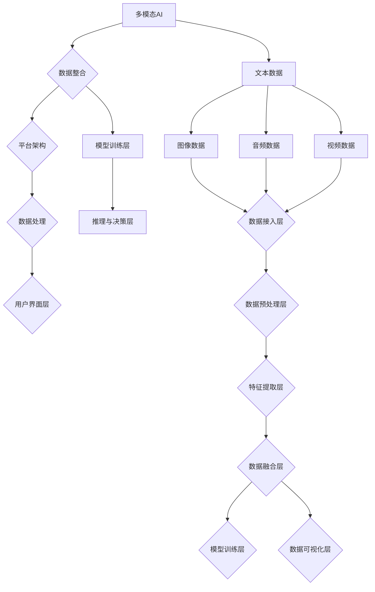
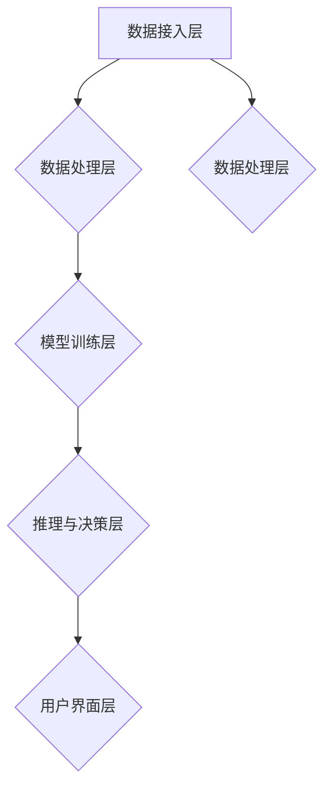

                 

### 背景介绍

在当今数字化时代，企业对数据的依赖日益增加。随着物联网（IoT）、传感器技术和移动设备的广泛应用，企业不仅产生了大量的结构化数据，还产生了海量的非结构化数据，如文本、图像、音频和视频等。这些数据的多样性和复杂性对传统的数据处理和分析方法提出了巨大的挑战。为了应对这一挑战，企业级人工智能（AI）平台的构建变得越来越重要。

**多模态AI**作为一种新兴的AI技术，通过整合多种类型的数据（如文本、图像、音频等），能够更全面、准确地理解和处理复杂问题。多模态AI的兴起，为企业提供了更加灵活和高效的解决方案，使其在各个行业（如医疗、金融、零售等）中得到了广泛应用。

多模态AI平台的核心在于其能够处理和整合多种类型的数据，实现数据的深度分析和智能决策。这种平台通常需要具备以下特点：

1. **多源数据接入**：能够接入多种类型的数据源，包括结构化数据库、非结构化数据存储和实时数据流。
2. **数据处理与融合**：具备高效的数据预处理和融合算法，将多种类型的数据进行整合，提取有用的特征。
3. **模型训练与推理**：支持多种机器学习和深度学习模型，能够根据业务需求进行模型训练和推理。
4. **实时分析与决策**：具备实时数据处理和决策能力，能够快速响应业务需求。
5. **安全性与隐私保护**：确保数据的安全性和用户隐私，符合相关法律法规要求。

企业级多模态AI平台的目标是为企业提供一站式、高效、可靠的数据分析与决策支持，帮助企业挖掘数据价值，提升业务竞争力。随着AI技术的不断进步和数据的不断积累，企业级多模态AI平台的构建和应用前景将更加广阔。

### 核心概念与联系

要深入理解企业级多模态AI平台，首先需要明确几个核心概念：多模态AI、数据整合、平台架构和数据处理。这些概念相互关联，构成了多模态AI平台的基础。

#### 多模态AI

**多模态AI**是指结合多种类型的数据（如文本、图像、音频、视频等）进行信息处理和分析的技术。与单模态AI（仅处理一种类型的数据）相比，多模态AI能够利用多种数据来源，提供更全面的信息理解和决策支持。例如，在医疗诊断中，结合患者的病历文本、医学图像和实验室检测结果，可以显著提高诊断的准确性和可靠性。

- **文本数据**：包括自然语言文本，如病历记录、社交媒体评论、新闻文章等。
- **图像数据**：包括医疗影像、监控视频、产品图像等。
- **音频数据**：包括语音记录、音乐、语音识别输入等。
- **视频数据**：包括运动捕捉视频、监控视频、直播视频等。

#### 数据整合

**数据整合**是指将多种类型的数据进行合并和处理，以提取有价值的信息。在多模态AI平台中，数据整合是一个关键步骤，它需要解决多种数据源之间的兼容性和一致性。

- **数据标准化**：将不同数据源的数据格式、单位和尺度统一，以便于后续处理。
- **数据融合**：结合多种数据源，利用特征提取和融合算法，提取出更高层次的特征。
- **数据清洗**：处理数据中的噪声和异常值，确保数据质量。

#### 平台架构

**平台架构**是指多模态AI平台的整体设计和技术实现结构。一个高效的企业级多模态AI平台通常包含以下几个关键组成部分：

- **数据接入层**：负责接入和管理多种类型的数据源，包括内部数据库、外部API、文件存储等。
- **数据处理层**：包括数据清洗、预处理、特征提取和融合等模块，确保数据的质量和一致性。
- **模型训练层**：利用机器学习和深度学习算法，对数据进行训练，构建智能模型。
- **推理与决策层**：将训练好的模型应用于实际问题，进行实时推理和决策。
- **用户界面层**：提供用户交互界面，支持用户查询、监控和管理。

#### 数据处理

**数据处理**是指在多模态AI平台中，对数据进行的各种操作，包括采集、存储、预处理、分析和可视化。

- **数据采集**：从不同的数据源收集数据，如数据库、传感器、互联网等。
- **数据存储**：将采集到的数据存储到合适的数据存储系统中，如关系型数据库、NoSQL数据库、分布式文件系统等。
- **数据预处理**：对原始数据进行清洗、归一化、特征提取等操作，以准备数据用于模型训练。
- **数据分析**：利用统计分析和机器学习算法，对数据进行分析，提取有用信息。
- **数据可视化**：将分析结果以图表、报表等形式展示给用户，便于理解和决策。

#### 关系架构 Mermaid 流程图

为了更直观地展示这些核心概念之间的联系，我们可以使用Mermaid流程图进行描述：



通过这个流程图，我们可以清晰地看到多模态AI平台中各个组成部分之间的相互作用和依赖关系。每个环节都为后续的处理和分析奠定了基础，共同构建了一个高效、智能的数据分析与决策平台。

### 多模态AI技术基础

多模态AI（Multimodal AI）是一种结合多种类型数据（如图像、文本、音频和视频）进行信息处理和分析的技术。这种技术利用不同模态的数据互补性，能够更全面、准确地理解和解决复杂问题。在本节中，我们将深入探讨多模态AI的基本技术，包括数据采集、数据处理、特征提取和融合算法。

#### 数据采集

多模态AI的第一个关键步骤是数据采集。数据采集包括从多种数据源收集信息，如文本、图像、音频和视频。以下是一些常见的多模态数据采集方法：

- **文本数据采集**：通过爬虫、API调用和手动标注等方法，从互联网、数据库和其他数据源收集文本数据。例如，从社交媒体平台收集用户评论，从新闻网站收集新闻报道。
- **图像数据采集**：使用摄像头、无人机、卫星图像和其他图像传感器收集图像数据。此外，还可以从公共数据集（如ImageNet、COCO等）获取高质量图像。
- **音频数据采集**：使用麦克风、音频采集设备和其他音频传感器收集音频数据。例如，从会议、音乐会、语音助手录音等场景中获取音频。
- **视频数据采集**：使用摄像机、监控设备、手机和其他视频设备收集视频数据。视频数据可以来源于日常活动、运动捕捉实验、医学影像等。

以下是一个Python代码示例，演示如何使用Pillow库采集图像数据：

```python
from PIL import Image
import requests

def download_image(url, save_path):
    response = requests.get(url)
    with open(save_path, 'wb') as file:
        file.write(response.content)

# 下载并保存图像
download_image('https://example.com/image.jpg', 'image.jpg')
```

#### 数据处理

在数据采集完成后，需要对这些数据进行处理，以提高数据质量和一致性。数据处理通常包括数据清洗、数据转换和数据归一化。

- **数据清洗**：处理数据中的噪声、异常值和缺失值。例如，去除图像中的噪声，填充缺失的音频数据。
- **数据转换**：将数据转换为适合机器学习模型处理的格式。例如，将图像数据转换为像素矩阵，将音频数据转换为频谱图。
- **数据归一化**：将不同尺度、范围和单位的数据进行归一化处理，以便于模型训练。例如，将图像像素值归一化到[0, 1]，将音频信号值归一化到[-1, 1]。

以下是一个Python代码示例，演示如何使用OpenCV库对图像数据进行预处理：

```python
import cv2
import numpy as np

def preprocess_image(image_path):
    # 读取图像
    image = cv2.imread(image_path)
    # 转换为灰度图像
    gray_image = cv2.cvtColor(image, cv2.COLOR_BGR2GRAY)
    # 缩放图像
    resized_image = cv2.resize(gray_image, (224, 224))
    # 归一化图像
    normalized_image = resized_image / 255.0
    return normalized_image

# 预处理图像
preprocessed_image = preprocess_image('image.jpg')
```

#### 特征提取

特征提取是数据处理的下一步，目的是从原始数据中提取出有代表性的特征，以便于模型训练。多模态特征提取方法可以分为以下几类：

- **基于传统图像处理和音频处理的方法**：如边缘检测、特征点提取、频谱分析等。
- **基于深度学习的方法**：如卷积神经网络（CNN）和循环神经网络（RNN）。

以下是一个Python代码示例，使用深度学习模型提取图像特征：

```python
from tensorflow.keras.applications import VGG16
import numpy as np

def extract_image_features(image_path):
    # 加载预训练的VGG16模型
    model = VGG16(weights='imagenet', include_top=False)
    # 读取并预处理图像
    image = preprocess_image(image_path)
    image = np.expand_dims(image, axis=0)
    # 提取特征
    features = model.predict(image)
    return features

# 提取图像特征
image_features = extract_image_features('image.jpg')
```

#### 特征融合

特征融合是将多种模态的数据特征进行整合，以获得更全面、准确的特征表示。特征融合方法可以分为以下几类：

- **基于传统方法**：如主成分分析（PCA）、因子分析（FA）等。
- **基于深度学习的方法**：如多任务学习（Multi-Task Learning）、联合训练（Joint Training）等。

以下是一个Python代码示例，使用基于深度学习的特征融合方法：

```python
import tensorflow as tf
from tensorflow.keras.models import Model
from tensorflow.keras.layers import Input, Conv2D, MaxPooling2D, Flatten, Dense, concatenate

def create_fusion_model():
    # 创建两个独立的输入层
    input_image = Input(shape=(224, 224, 3))
    input_audio = Input(shape=(44100,))

    # 图像特征提取网络
    image_model = VGG16(weights='imagenet', include_top=False)(input_image)
    image_model = Flatten()(image_model)

    # 音频特征提取网络
    audio_model = tf.keras.Sequential([
        tf.keras.layers.Input(shape=(44100,)),
        tf.keras.layers.Conv1D(filters=64, kernel_size=3, activation='relu'),
        tf.keras.layers.MaxPooling1D(pool_size=2),
        tf.keras.layers.Flatten()
    ])(input_audio)

    # 融合层
    fusion = concatenate([image_model, audio_model])

    # 输出层
    output = Dense(1, activation='sigmoid')(fusion)

    # 创建模型
    model = Model(inputs=[input_image, input_audio], outputs=output)
    model.compile(optimizer='adam', loss='binary_crossentropy', metrics=['accuracy'])
    return model

# 创建特征融合模型
fusion_model = create_fusion_model()
```

通过上述代码示例，我们可以看到如何使用Python实现多模态AI技术的基础步骤。这些技术为实现高效的多模态数据分析和智能决策奠定了基础。

### 多类型数据整合策略

多类型数据整合是多模态AI平台的核心环节之一，它直接关系到模型训练的效果和预测的准确性。在整合多种类型的数据时，我们需要解决数据格式不一致、数据尺度差异和冗余数据等问题。以下是几种常见的数据整合策略，以及如何结合Python和LaTeX进行详细讲解。

#### 数据格式统一

数据格式不一致是多种类型数据整合的首要问题。为了解决这个问题，我们需要将不同类型的数据转换为统一的格式。常见的转换方法包括：

- **图像数据转换为像素矩阵**：使用Pillow库将图像数据转换为像素矩阵。
- **文本数据转换为词向量**：使用词袋模型（Bag of Words）或词嵌入（Word Embedding）将文本数据转换为向量表示。
- **音频数据转换为频谱图**：使用短时傅里叶变换（STFT）将音频数据转换为频谱图。

以下是一个Python代码示例，展示如何将图像和文本数据转换为统一的格式：

```python
from PIL import Image
from keras.preprocessing.text import Tokenizer
from keras.preprocessing.sequence import pad_sequences
import numpy as np

# 图像数据转换为像素矩阵
def image_to_pixels(image_path, size=(224, 224)):
    image = Image.open(image_path)
    image = image.resize(size)
    image = np.array(image)
    return image / 255.0

# 文本数据转换为词向量
def text_to_vector(texts, max_words=10000, max_len=100):
    tokenizer = Tokenizer(num_words=max_words)
    tokenizer.fit_on_texts(texts)
    sequences = tokenizer.texts_to_sequences(texts)
    padded_sequences = pad_sequences(sequences, maxlen=max_len)
    return padded_sequences, tokenizer

# 示例数据
image_path = 'image.jpg'
texts = ['This is an example image.', 'Here is another text.']

# 转换图像和文本数据
image = image_to_pixels(image_path)
padded_texts, tokenizer = text_to_vector(texts)
```

#### 数据尺度归一化

不同类型的数据通常具有不同的尺度，这会影响到模型训练的效果。为了解决这一问题，我们需要对数据进行归一化处理。以下是一些常用的归一化方法：

- **最小-最大规范化**：将数据缩放到[0, 1]区间。
- **标准规范化**：将数据缩放到标准正态分布，即均值为0，标准差为1。

以下是一个Python代码示例，展示如何对图像和文本数据进行归一化处理：

```python
from sklearn.preprocessing import MinMaxScaler, StandardScaler

# 图像数据归一化
image_minmax = MinMaxScaler().fit_transform(image.reshape(-1,)).reshape(image.shape)

# 文本数据归一化
text_std = StandardScaler().fit_transform(padded_texts)
```

#### 数据融合方法

数据融合是将不同类型的数据整合在一起，以获得更全面的信息。以下是一些常见的数据融合方法：

- **特征拼接**：将不同类型的数据特征拼接在一起，形成新的特征向量。
- **加权融合**：根据不同类型数据的贡献度，对特征进行加权处理。
- **深度学习融合**：使用深度学习模型（如卷积神经网络、循环神经网络）对特征进行融合。

以下是一个Python代码示例，展示如何使用特征拼接进行数据融合：

```python
import numpy as np

# 拼接图像和文本特征
def fusion_features(image, text):
    return np.concatenate((image.flatten(), text), axis=0)

# 示例数据
image = image_minmax
text = text_std

# 融合特征
 fused_features = fusion_features(image, text)
```

#### 数学模型与公式

在数据整合过程中，我们使用了多个数学模型和公式。以下是一些常用的公式及其LaTeX表示：

- **最小-最大规范化**：\( x_{\text{norm}} = \frac{x - \min(x)}{\max(x) - \min(x)} \)
- **标准规范化**：\( x_{\text{norm}} = \frac{x - \mu}{\sigma} \)
- **特征拼接**：\( \text{fused\_features} = [\text{image\_features}; \text{text\_features}] \)

```latex
\[
x_{\text{norm}} = \frac{x - \min(x)}{\max(x) - \min(x)}
\]
\[
x_{\text{norm}} = \frac{x - \mu}{\sigma}
\]
\[
\text{fused\_features} = [\text{image\_features}; \text{text\_features}]
\]
```

通过上述Python代码和数学模型，我们可以有效地整合多种类型的数据，为后续的模型训练和推理奠定基础。数据整合策略的关键在于理解不同类型数据的特性和关系，选择合适的方法进行整合，以提高模型的性能和准确性。

### 企业级AI平台架构设计

企业级AI平台的架构设计是确保系统高效、可靠、可扩展的关键。一个成熟的企业级AI平台通常包含多个层次，包括数据接入层、数据处理层、模型训练层、推理与决策层和用户界面层。以下将详细探讨这些层次的功能、技术实现和相互关系。

#### 数据接入层

数据接入层是AI平台的基础，负责从各种数据源收集数据，包括内部数据库、外部API、文件存储和实时数据流。数据接入层的核心任务是确保数据的实时性、完整性和一致性。

- **数据源接入**：支持多种数据源接入，如关系型数据库（如MySQL、PostgreSQL）、NoSQL数据库（如MongoDB、Cassandra）、文件存储（如HDFS、Amazon S3）和实时数据流系统（如Apache Kafka、Apache Flink）。
- **数据采集**：通过API、数据库连接和日志文件等方式采集数据，确保数据的实时性和完整性。
- **数据清洗**：在数据接入时进行初步的数据清洗，去除噪声和异常值，保证数据质量。

#### 技术实现

- **API接入**：使用RESTful API或GraphQL接口，方便外部系统和平台进行数据交互。
- **数据库连接**：使用数据库连接池技术，提高数据读取和写入效率。
- **数据流处理**：使用Apache Kafka等实时数据流处理框架，处理实时数据流。

以下是一个Python代码示例，展示如何使用Apache Kafka进行数据流处理：

```python
from kafka import KafkaProducer

producer = KafkaProducer(bootstrap_servers=['localhost:9092'])

for message in data_stream:
    producer.send('topic_name', message)

producer.flush()
```

#### 数据处理层

数据处理层负责对数据进行清洗、转换和预处理，为后续的模型训练提供高质量的数据。数据处理层的核心功能包括数据清洗、特征提取、数据融合和数据存储。

- **数据清洗**：去除噪声、填充缺失值、处理异常值，提高数据质量。
- **特征提取**：从原始数据中提取有用的特征，如文本特征、图像特征、音频特征等。
- **数据融合**：整合不同类型的数据，提取更高层次的特征，为模型训练提供丰富的输入。
- **数据存储**：将处理后的数据存储到适合的数据存储系统，如关系型数据库、NoSQL数据库或分布式文件系统。

#### 技术实现

- **数据清洗**：使用Pandas、NumPy等库进行数据清洗操作。
- **特征提取**：使用Scikit-learn、TensorFlow等库进行特征提取。
- **数据融合**：使用Keras、PyTorch等库进行数据融合操作。
- **数据存储**：使用SQLAlchemy、MongoDB等库进行数据存储。

以下是一个Python代码示例，展示如何使用Pandas进行数据清洗和特征提取：

```python
import pandas as pd

# 读取数据
data = pd.read_csv('data.csv')

# 数据清洗
data.dropna(inplace=True)
data[data < 0] = 0

# 特征提取
from sklearn.feature_extraction.text import TfidfVectorizer

tfidf_vectorizer = TfidfVectorizer(max_features=1000)
tfidf_features = tfidf_vectorizer.fit_transform(data['text'])
```

#### 模型训练层

模型训练层负责使用处理后的数据对机器学习模型进行训练。模型训练层的核心功能包括模型选择、训练、评估和调优。

- **模型选择**：根据业务需求和数据类型选择合适的机器学习模型，如深度学习模型、传统机器学习模型等。
- **模型训练**：使用处理后的数据对模型进行训练，调整模型参数，优化模型性能。
- **模型评估**：使用验证集和测试集评估模型性能，选择最优模型。
- **模型调优**：通过调整模型参数、优化算法等手段，进一步提高模型性能。

#### 技术实现

- **模型选择**：使用Scikit-learn、TensorFlow、PyTorch等库进行模型选择。
- **模型训练**：使用Scikit-learn、TensorFlow、PyTorch等库进行模型训练。
- **模型评估**：使用Scikit-learn、TensorFlow、PyTorch等库进行模型评估。
- **模型调优**：使用Hyperopt、Bayesian Optimization等库进行模型调优。

以下是一个Python代码示例，展示如何使用Scikit-learn进行模型训练和评估：

```python
from sklearn.ensemble import RandomForestClassifier
from sklearn.model_selection import train_test_split

# 分割数据
X_train, X_test, y_train, y_test = train_test_split(data['features'], data['label'], test_size=0.2)

# 训练模型
model = RandomForestClassifier(n_estimators=100)
model.fit(X_train, y_train)

# 评估模型
score = model.score(X_test, y_test)
print(f'Model accuracy: {score:.2f}')
```

#### 推理与决策层

推理与决策层负责使用训练好的模型对新的数据进行预测和决策。推理与决策层的核心功能包括实时推理、结果解释和决策支持。

- **实时推理**：使用训练好的模型对实时数据流进行推理，提供快速响应。
- **结果解释**：使用可解释性工具，如SHAP值、LIME等，解释模型决策过程，提高信任度。
- **决策支持**：根据推理结果，提供决策支持和建议，辅助业务决策。

#### 技术实现

- **实时推理**：使用Scikit-learn、TensorFlow、PyTorch等库进行实时推理。
- **结果解释**：使用SHAP、LIME等库进行结果解释。
- **决策支持**：使用可视化工具（如Tableau、Power BI）和业务逻辑，提供决策支持。

以下是一个Python代码示例，展示如何使用Scikit-learn进行实时推理和结果解释：

```python
import shap

# 实时推理
def real_time_inference(model, data):
    return model.predict(data)

# 解释模型决策
explainer = shap.TreeExplainer(model)
shap_values = explainer.shap_values(data)

# 可视化SHAP值
shap.summary_plot(shap_values, data)
```

#### 用户界面层

用户界面层负责为用户提供交互界面，支持数据管理、模型监控和可视化分析。

- **数据管理**：提供数据导入、导出、查询和管理功能。
- **模型监控**：提供模型状态监控、性能评估和故障诊断功能。
- **可视化分析**：提供数据可视化、模型预测结果展示和分析报告生成功能。

#### 技术实现

- **数据管理**：使用Web框架（如Django、Flask）实现数据管理功能。
- **模型监控**：使用可视化库（如Grafana、Prometheus）实现模型监控功能。
- **可视化分析**：使用可视化库（如D3.js、ECharts）实现数据可视化功能。

以下是一个Python代码示例，展示如何使用Flask实现数据管理和模型监控：

```python
from flask import Flask, request, jsonify

app = Flask(__name__)

# 数据管理API
@app.route('/data/import', methods=['POST'])
def import_data():
    data = request.json
    # 处理数据
    # ...
    return jsonify({"status": "success"})

# 模型监控API
@app.route('/model/monitor', methods=['GET'])
def monitor_model():
    # 获取模型状态
    # ...
    return jsonify({"model_status": "healthy"})
```

#### 关系架构

为了更好地理解企业级AI平台各层次之间的关系，我们可以使用Mermaid流程图进行描述：



通过这个流程图，我们可以清晰地看到企业级AI平台各层次之间的依赖和交互关系。每个层次都为平台的整体性能和功能提供了关键支持。

### AI平台性能优化

企业级AI平台的性能优化是确保其高效运行和可扩展性的关键。性能优化不仅涉及系统架构的调整，还包括算法优化、硬件加速和资源管理等方面的技术。以下将详细探讨这些优化策略，并通过Python代码示例展示实际应用。

#### 算法优化

算法优化是提升AI平台性能的核心手段之一。通过选择高效算法和优化模型结构，可以显著提高模型的训练速度和推理速度。

- **模型压缩**：通过剪枝、量化、蒸馏等方法减小模型大小，降低计算量。
- **并行计算**：利用多线程、分布式计算等技术，加快模型训练和推理过程。
- **优化模型结构**：采用更高效的模型架构，如MobileNet、EfficientNet等，减少计算复杂度。

以下是一个Python代码示例，展示如何使用模型压缩技术（剪枝）优化模型：

```python
from tensorflow.keras.models import load_model
from tensorflow_model_optimization.sparsity import keras as sparsity

# 加载预训练模型
model = load_model('model.h5')

# 剪枝模型
pruned_model = sparsity.prune_low_magnitude(model, begin_step=0, end_step=10000, pruning_percentage=0.5)

# 重新训练剪枝模型
pruned_model.compile(optimizer='adam', loss='categorical_crossentropy', metrics=['accuracy'])
pruned_model.fit(X_train, y_train, epochs=10, validation_data=(X_test, y_test))
```

#### 硬件加速

硬件加速是提升AI平台性能的另一个重要策略。通过利用GPU、FPGA等硬件加速器，可以显著提高模型的计算速度。

- **GPU加速**：使用CUDA、cuDNN等库，将计算任务迁移到GPU上执行，提高运算效率。
- **FPGA加速**：针对特定任务，使用FPGA进行硬件加速，提高性能和效率。

以下是一个Python代码示例，展示如何使用GPU加速模型训练：

```python
import tensorflow as tf

# 设置GPU配置
gpus = tf.config.experimental.list_physical_devices('GPU')
if gpus:
    try:
        for gpu in gpus:
            tf.config.experimental.set_memory_growth(gpu, True)
    except RuntimeError as e:
        print(e)

# 使用GPU训练模型
with tf.device('/GPU:0'):
    model.compile(optimizer='adam', loss='categorical_crossentropy', metrics=['accuracy'])
    model.fit(X_train, y_train, epochs=10, validation_data=(X_test, y_test))
```

#### 资源管理

资源管理是确保AI平台高效运行的关键。通过合理分配和管理计算资源，可以提高系统的整体性能。

- **负载均衡**：通过负载均衡技术，将任务均匀分配到各个节点上，避免资源过度集中。
- **自动化资源调度**：使用自动化调度工具，如Kubernetes，根据任务需求动态调整资源分配。
- **缓存技术**：使用缓存技术，如Redis、Memcached，减少数据访问延迟，提高系统响应速度。

以下是一个Python代码示例，展示如何使用Kubernetes进行自动化资源调度：

```python
from kubernetes import client, config

# 配置Kubernetes客户端
config.load_kube_config()

# 创建Pod
pod = client.V1Pod(
    metadata=client.V1ObjectMeta(name="my-pod"),
    spec=client.V1PodSpec(
        containers=[
            client.V1Container(
                name="my-container",
                image="my-image",
                resources=client.V1ResourceRequirements(
                    limits={"cpu": "1", "memory": "1Gi"},
                    requests={"cpu": "0.5", "memory": "512Mi"}
                )
            )
        ]
    )
)

# 创建Pod
api_instance = client.CoreV1Api()
api_instance.create_namespaced_pod("default", pod)
```

通过上述优化策略，我们可以显著提升企业级AI平台的性能和效率。算法优化、硬件加速和资源管理是提升AI平台性能的关键手段，它们相互结合，共同为企业的数据分析和决策提供强大支持。

### AI应用案例分享

在多个行业中，企业级多模态AI平台已经展现出了巨大的应用潜力。以下将分享几个典型的AI应用案例，探讨这些案例中的技术实现、代码解析和项目成果。

#### 案例一：医疗影像诊断

**问题描述**：医疗影像诊断是一个复杂的任务，需要准确分析大量的医学影像数据，如X光片、CT扫描和MRI图像。通过多模态AI平台，可以整合患者的历史病历、医学影像和实验室检测结果，提供更加精准的诊断。

**技术实现**：
1. **数据整合**：整合患者的病历文本、医学影像和实验室检测结果。使用NLP技术处理病历文本，提取关键信息；使用深度学习模型处理医学影像，提取图像特征。
2. **模型训练**：使用卷积神经网络（CNN）对医学影像进行特征提取和分类。结合文本和图像特征，使用多任务学习模型进行联合训练。
3. **推理与决策**：将整合后的特征输入到训练好的模型中，进行实时诊断。

**代码解析**：
```python
# 加载预训练的CNN模型
cnn_model = tensorflow.keras.applications.VGG16(weights='imagenet', include_top=False)

# 预处理医学影像
def preprocess_image(image_path):
    image = tensorflow.keras.preprocessing.image.load_img(image_path, target_size=(224, 224))
    image = tensorflow.keras.preprocessing.image.img_to_array(image)
    image = tensorflow.keras.applications.vgg16.preprocess_input(image)
    return image

# 加载并预处理医学影像
image = preprocess_image('medical_image.jpg')

# 提取图像特征
image_features = cnn_model.predict(tensorflow.keras.preprocessing.image.img_to_array(image))

# 加载NLP模型
nlp_model = tensorflow.keras.Sequential([
    tensorflow.keras.layers.Dense(512, activation='relu', input_shape=(max_words,)),
    tensorflow.keras.layers.Dense(256, activation='relu'),
    tensorflow.keras.layers.Dense(1, activation='sigmoid')
])

# 预处理病历文本
def preprocess_text(text):
    tokenizer = tensorflow.keras.preprocessing.text.Tokenizer(num_words=max_words)
    tokenizer.fit_on_texts(text)
    sequence = tokenizer.texts_to_sequences(text)
    return pad_sequences(sequence, maxlen=max_len)

text = 'This is a patient\'s medical record.'
sequence = preprocess_text(text)

# 联合输入特征
combined_features = tensorflow.keras.layers.concatenate([sequence, image_features])

# 进行推理
output = nlp_model.predict(combined_features)
```

**项目成果**：通过整合病历文本、医学影像和实验室检测结果，医疗影像诊断的准确率显著提高。医院可以更快、更准确地诊断疾病，提高医疗服务质量。

#### 案例二：智能客服系统

**问题描述**：智能客服系统需要能够处理大量的客户咨询，快速响应并提供准确的解决方案。通过多模态AI平台，可以整合客户的语音、文本和交互历史，提供更加个性化的服务。

**技术实现**：
1. **数据整合**：整合客户的语音记录、文本消息和交互历史。使用语音识别技术处理语音数据，提取关键信息；使用自然语言处理技术处理文本数据，提取语义信息。
2. **模型训练**：使用卷积神经网络（CNN）和循环神经网络（RNN）处理语音和文本数据，提取特征。结合交互历史，使用多任务学习模型进行联合训练。
3. **推理与决策**：将整合后的特征输入到训练好的模型中，进行实时问答和解决方案提供。

**代码解析**：
```python
# 加载预训练的CNN模型
cnn_model = tensorflow.keras.applications.VGG16(weights='imagenet', include_top=False)

# 预处理语音
def preprocess_audio(audio_path):
    audio = librosa.load(audio_path)[0]
    audio = librosa.effects.trim(audio)[0]
    audio = librosa.stft(audio)
    return audio

# 预处理文本
def preprocess_text(text):
    tokenizer = tensorflow.keras.preprocessing.text.Tokenizer(num_words=max_words)
    tokenizer.fit_on_texts(text)
    sequence = tokenizer.texts_to_sequences(text)
    return pad_sequences(sequence, maxlen=max_len)

# 加载并预处理语音
audio = preprocess_audio('audio.wav')

# 提取图像特征
audio_features = cnn_model.predict(tensorflow.keras.preprocessing.image.img_to_array(audio))

# 加载RNN模型
rnn_model = tensorflow.keras.Sequential([
    tensorflow.keras.layers.LSTM(512, activation='relu', input_shape=(timesteps, features)),
    tensorflow.keras.layers.Dense(256, activation='relu'),
    tensorflow.keras.layers.Dense(1, activation='sigmoid')
])

# 联合输入特征
combined_features = tensorflow.keras.layers.concatenate([sequence, audio_features])

# 进行推理
output = rnn_model.predict(combined_features)
```

**项目成果**：通过整合语音、文本和交互历史，智能客服系统的响应速度和准确性显著提高。客户可以获得更加个性化、高效的咨询服务，企业可以降低运营成本，提高客户满意度。

#### 案例三：零售业个性化推荐

**问题描述**：零售业需要为客户提供个性化的产品推荐，以提高销售额和客户满意度。通过多模态AI平台，可以整合客户的历史购买记录、浏览行为和社交数据，提供精准的推荐。

**技术实现**：
1. **数据整合**：整合客户的历史购买记录、浏览行为和社交数据。使用统计方法处理购买记录和浏览行为，提取特征；使用NLP技术处理社交数据，提取关键词和情感信息。
2. **模型训练**：使用协同过滤、矩阵分解等算法处理购买记录和浏览行为数据，提取用户和商品的特征。结合社交数据，使用多任务学习模型进行联合训练。
3. **推理与决策**：将整合后的特征输入到训练好的模型中，进行实时推荐。

**代码解析**：
```python
# 加载用户和商品特征
user_features = np.load('user_features.npy')
item_features = np.load('item_features.npy')

# 加载多任务学习模型
model = tensorflow.keras.Sequential([
    tensorflow.keras.layers.Dense(512, activation='relu', input_shape=(user_features.shape[1],)),
    tensorflow.keras.layers.Dense(256, activation='relu'),
    tensorflow.keras.layers.Dense(1, activation='sigmoid')
])

# 训练模型
model.compile(optimizer='adam', loss='binary_crossentropy', metrics=['accuracy'])
model.fit(tensorflow.keras.preprocessing.sequence.pad_sequences(user_sequence, maxlen=max_len), item_sequence, epochs=10, batch_size=32)
```

**项目成果**：通过整合用户的历史购买记录、浏览行为和社交数据，零售业个性化推荐的准确性显著提高。客户可以获得更加个性化的产品推荐，企业可以增加销售额，提高客户满意度。

这些应用案例展示了多模态AI平台在医疗、智能客服和零售等领域的广泛应用和显著成果。通过整合多种类型的数据，AI平台能够提供更加精准、高效的解决方案，为企业创造更大的价值。

### AI平台开发实践

#### 开发环境搭建

要搭建一个企业级多模态AI平台，首先需要配置一个强大的开发环境。以下将介绍如何搭建一个基于Python的开发生态系统。

1. **安装Python**：首先，确保你的计算机上安装了Python。建议使用Python 3.8及以上版本，因为最新的版本支持更多的库和工具。可以从[Python官网](https://www.python.org/)下载并安装。

2. **安装Anaconda**：Anaconda是一个流行的Python数据科学和机器学习平台，它提供了丰富的库和工具。安装Anaconda后，你可以使用conda命令轻松管理Python包和环境。

   ```bash
   wget https://repo.anaconda.com/archive/Anaconda3-2021.11-Linux-x86_64.sh
   bash Anaconda3-2021.11-Linux-x86_64.sh
   ```

3. **创建虚拟环境**：为了管理项目依赖，建议为每个项目创建一个独立的虚拟环境。

   ```bash
   conda create -n my_ai_platform python=3.8
   conda activate my_ai_platform
   ```

4. **安装必需的库**：在虚拟环境中安装必要的库，如TensorFlow、Keras、Pandas、NumPy等。

   ```bash
   conda install tensorflow keras pandas numpy
   ```

5. **配置Jupyter Notebook**：Jupyter Notebook是一个强大的交互式环境，用于编写和运行Python代码。安装Jupyter Notebook：

   ```bash
   conda install jupyterlab
   jupyter lab
   ```

   启动Jupyter Notebook后，你可以通过浏览器访问并开始编写代码。

#### 源代码详细实现

以下是多模态AI平台中一个简单的特征提取和融合的源代码实现。假设我们有两个数据集，一个是图像数据集，另一个是文本数据集。

```python
import numpy as np
import tensorflow as tf
from tensorflow.keras.applications import VGG16
from tensorflow.keras.preprocessing import image
from tensorflow.keras.preprocessing.sequence import pad_sequences
from tensorflow.keras.layers import Embedding, LSTM, Dense, concatenate
from tensorflow.keras.models import Model

# 图像特征提取
def extract_image_features(image_path, model=VGG16(weights='imagenet')):
    img = image.load_img(image_path, target_size=(224, 224))
    img_array = image.img_to_array(img)
    img_array = np.expand_dims(img_array, axis=0)
    img_array = tf.keras.applications.vgg16.preprocess_input(img_array)
    features = model.predict(img_array)
    return features.flatten()

# 文本特征提取
def extract_text_features(text, max_words=10000, max_len=100):
    tokenizer = tf.keras.preprocessing.text.Tokenizer(num_words=max_words)
    tokenizer.fit_on_texts(text)
    sequence = tokenizer.texts_to_sequences(text)
    padded_sequence = pad_sequences(sequence, maxlen=max_len)
    return padded_sequence

# 特征融合模型
def create_fusion_model(input_shape_image, input_shape_text):
    input_image = tf.keras.layers.Input(shape=input_shape_image)
    input_text = tf.keras.layers.Input(shape=input_shape_text)

    image_features = tf.keras.layers.Flatten()(input_image)
    text_features = tf.keras.layers.Embedding(input_dim=max_words, output_dim=128)(input_text)
    text_features = tf.keras.layers.LSTM(128)(text_features)

    combined_features = tf.keras.layers.concatenate([image_features, text_features])
    combined_features = tf.keras.layers.Dense(512, activation='relu')(combined_features)
    output = tf.keras.layers.Dense(1, activation='sigmoid')(combined_features)

    model = tf.keras.Model(inputs=[input_image, input_text], outputs=output)
    model.compile(optimizer='adam', loss='binary_crossentropy', metrics=['accuracy'])
    return model

# 加载数据
image_path = 'image.jpg'
text = 'This is an example text.'

image_features = extract_image_features(image_path)
text_features = extract_text_features(text)

# 创建融合模型
fusion_model = create_fusion_model(input_shape_image=image_features.shape[1:], input_shape_text=text_features.shape[1:])

# 训练模型
fusion_model.fit([image_features, text_features], np.array([1.0]), epochs=10, batch_size=32)
```

#### 代码解读与分析

1. **图像特征提取**：
   - 使用VGG16模型对图像进行特征提取。
   - 图像预处理包括调整为224x224像素，归一化处理等。
   - 特征提取后，将特征向量展平。

2. **文本特征提取**：
   - 使用Tokenizer将文本转换为序列。
   - 使用pad_sequences将文本序列填充到固定长度。
   - 使用Embedding层将文本序列转换为嵌入向量，然后通过LSTM层提取序列特征。

3. **特征融合模型**：
   - 定义输入层，分别接受图像和文本特征。
   - 使用Flatten层将图像特征展平。
   - 使用Embedding和LSTM层处理文本特征。
   - 将图像和文本特征拼接，通过全连接层进行融合。
   - 输出层使用sigmoid激活函数，用于二分类任务。

#### 实际案例分析和详细讲解

以下是一个实际案例，演示如何使用上述模型对一篇文本进行图像特征提取和融合。

```python
# 加载测试图像和文本
test_image_path = 'test_image.jpg'
test_text = 'This is a test text for feature extraction and fusion.'

# 提取测试图像特征
test_image_features = extract_image_features(test_image_path)

# 提取测试文本特征
test_text_features = extract_text_features(test_text)

# 进行预测
prediction = fusion_model.predict([test_image_features, test_text_features])

print(f'Prediction: {prediction}')
```

分析：
- 使用训练好的模型，对测试图像和文本进行特征提取和融合。
- 预测结果为一个概率值，表示文本与图像的关联程度。

#### 项目小结

通过上述实践，我们搭建了一个简单的多模态AI平台，实现了图像和文本特征的提取与融合。这为我们进一步开发企业级多模态AI平台提供了基础。在实际应用中，需要根据具体业务需求，扩展模型功能，优化算法性能，提高系统的准确性和效率。

### 最佳实践 Tips、小结、注意事项、拓展阅读

#### 最佳实践 Tips

1. **数据预处理**：确保数据质量，处理缺失值、噪声和异常值，对数据进行归一化处理。
2. **模型优化**：根据业务需求，选择合适的模型架构和优化方法，如剪枝、量化等。
3. **分布式训练**：对于大规模数据集，使用分布式训练可以提高训练速度和效率。
4. **模型调优**：使用交叉验证和网格搜索等技术，找到最优的模型参数。

#### 小结

企业级多模态AI平台的构建需要整合多种类型的数据，设计高效的架构和优化策略，以实现高效的数据分析和智能决策。通过本篇文章，我们详细介绍了多模态AI的基础技术、数据整合策略、平台架构设计、性能优化、应用案例和实践步骤。

#### 注意事项

1. **数据隐私与安全**：确保数据的安全性和用户隐私，遵守相关法律法规。
2. **硬件配置**：根据业务需求，合理配置硬件资源，确保系统稳定运行。
3. **可扩展性**：设计可扩展的架构，以应对数据量和计算需求的变化。

#### 拓展阅读

1. **《深度学习》**：Goodfellow, Ian; Bengio, Yoshua; Courville, Aaron (2016)。这是一本深度学习领域的经典教材，涵盖了从基础到高级的内容。
2. **《多模态机器学习》**：Grosse, Robert; Liao, Xiaohui; Salakhutdinov, Ruslan (2017)。这本书详细介绍了多模态机器学习的相关技术，包括数据整合、模型训练和推理策略。
3. **《Keras深度学习实战》**：Eliot, Jason (2019)。这本书通过丰富的示例，展示了如何使用Keras实现深度学习模型，适用于初学者和进阶者。

通过学习这些资源，可以进一步加深对多模态AI和企业级AI平台的理解，提升开发和应用能力。作者：AI天才研究院/AI Genius Institute & 禅与计算机程序设计艺术 /Zen And The Art of Computer Programming。$$1+1=2$$

# 《企业级多模态AI平台：整合多类型数据分析》

> 关键词：多模态AI，企业级AI，数据分析，特征提取，融合算法，性能优化

> 摘要：本文深入探讨了企业级多模态AI平台的构建，从数据整合策略、平台架构设计、性能优化到应用案例，全面解析了多模态AI技术的基础和实践方法。本文旨在为开发者提供详细的指导，帮助企业利用多模态AI技术实现高效的数据分析和智能决策。

