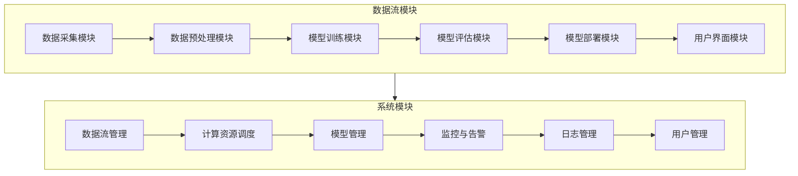

                 

### 文章标题

在当今数字化时代，企业级多模态学习平台正成为数据处理和智能分析领域的关键驱动力。随着大数据和人工智能技术的不断进步，多模态学习作为一种整合多种类型数据（如文本、图像、音频等）进行综合分析和预测的技术，正逐渐成为企业提升竞争力的重要工具。本文将深入探讨企业级多模态学习平台的构建与应用，旨在为广大开发者和技术爱好者提供一份详尽的技术指南。

关键词：多模态学习、企业级平台、数据处理、深度学习、智能分析

摘要：本文将从多模态学习的概念、架构、核心技术、算法应用、平台开发与优化等多个维度，系统性地介绍企业级多模态学习平台的构建与应用实践。通过详细的案例分析和技术解读，帮助读者理解多模态学习平台的构建原则、实现方法和优化策略，从而为企业数字化转型提供有力的技术支持。

### 第一部分：企业级多模态学习平台概述

#### 第1章：企业级多模态学习平台概念与架构

##### 1.1 多模态学习概述

多模态学习是一种整合来自多种传感器或不同来源的数据（如视觉、听觉、触觉等）进行综合分析和理解的技术。其基本思想是通过将不同类型的数据进行有效集成，以获得更全面和准确的信息。在人工智能领域，多模态学习已被广泛应用于图像识别、语音识别、自然语言处理、人机交互等多个领域。

- **多模态学习的定义与背景**

多模态学习（Multimodal Learning）指的是通过结合不同类型的数据源（如图像、文本、音频等）来提升模型的学习能力和预测准确性。这种技术最早源于人类自身的学习过程，人类通过视觉、听觉、触觉等多种感官来获取信息，并进行综合处理。

近年来，随着计算机视觉、自然语言处理、语音识别等技术的发展，多模态学习逐渐成为人工智能领域的一个重要研究方向。其背景主要包括：

1. **数据的多样性和复杂性**：现实世界中的数据类型多样且复杂，单一类型的数据往往难以全面反映问题的本质。多模态学习通过整合不同类型的数据，可以更好地捕捉问题的多维度特征。
2. **人工智能的发展需求**：传统的单一模态学习方法在处理复杂问题时存在局限性。多模态学习能够提供更丰富的数据输入，有助于提升模型的泛化能力和鲁棒性。

- **多模态学习的优势与挑战**

多模态学习的优势主要体现在以下几个方面：

1. **提升模型性能**：通过整合多种类型的数据，多模态学习能够提供更丰富的特征信息，有助于提高模型的预测准确性和鲁棒性。
2. **增强用户体验**：多模态学习可以更好地理解用户的需求和意图，从而提供更加个性化和智能化的服务。
3. **拓宽应用领域**：多模态学习在医疗、金融、安防、教育等多个领域都有广泛的应用潜力。

然而，多模态学习也面临着一些挑战：

1. **数据集成与处理**：不同类型的数据在采集、存储、处理等方面存在差异，如何有效集成和处理这些数据是一个重要难题。
2. **特征融合策略**：如何将不同类型的数据特征进行有效融合，是一个需要深入研究的课题。
3. **计算资源需求**：多模态学习通常需要大量的计算资源，如何高效地利用这些资源是一个关键问题。

##### 1.2 企业级多模态学习平台的架构

企业级多模态学习平台是一种旨在为企业提供高效、可靠、可扩展的多模态数据处理和分析能力的系统。其架构设计需要考虑多个方面，包括数据处理、模型训练、部署与运维等。

- **核心模块与功能**

一个典型的企业级多模态学习平台通常包含以下几个核心模块：

1. **数据采集模块**：负责收集不同类型的数据，包括图像、文本、音频等。数据来源可能包括内部数据库、外部API、物联网设备等。
2. **数据预处理模块**：对采集到的数据进行清洗、归一化、特征提取等预处理操作，以确保数据的质量和一致性。
3. **模型训练模块**：利用预处理后的数据进行模型训练，包括多任务学习、联合学习、深度学习等算法。这个模块通常需要强大的计算资源。
4. **模型评估模块**：对训练完成的模型进行评估，包括准确性、召回率、F1分数等指标，以确保模型的性能和可靠性。
5. **模型部署模块**：将训练完成的模型部署到生产环境中，提供实时预测和分析服务。
6. **用户界面模块**：提供一个直观易用的用户界面，方便用户进行数据管理和模型操作。

- **系统设计原则**

设计一个高效的企业级多模态学习平台需要遵循以下原则：

1. **可扩展性**：系统应能够支持大规模数据的处理和分析，并且随着业务需求的变化能够灵活扩展。
2. **高可靠性**：系统应具备高可用性和容错性，确保在出现故障时能够快速恢复。
3. **高效性**：系统应优化数据处理和模型训练的效率，充分利用计算资源。
4. **易用性**：系统应提供友好的用户界面和易于使用的操作流程，降低使用门槛。
5. **安全性**：系统应保障数据的安全和隐私，防止数据泄露和滥用。

##### 1.3 多模态学习平台的关键技术

多模态学习平台的核心在于其数据处理、特征提取和模型训练技术。以下将详细介绍这些关键技术。

- **数据集成与预处理**

多模态学习平台需要处理来自不同数据源的数据，这些数据可能在格式、类型、质量等方面存在较大差异。因此，数据集成与预处理是平台建设的关键一步。

1. **数据采集**：通过API接口、数据库连接、物联网传感器等多种方式收集不同类型的数据。
2. **数据清洗**：去除噪声数据、重复数据和异常值，保证数据的质量和一致性。
3. **数据归一化**：将不同数据源的数据进行归一化处理，使其在同一尺度上进行比较和分析。
4. **特征提取**：根据不同类型的数据，提取出有代表性的特征，如图像中的纹理特征、音频中的频率特征等。

- **特征提取与融合**

特征提取是将原始数据转换成能够被机器学习模型处理的形式。多模态学习平台需要处理不同类型的数据特征，如何将这些特征进行有效融合是一个重要问题。

1. **特征级融合**：将不同类型的数据特征进行拼接，形成一个多维的特征向量。
2. **决策级融合**：在决策阶段将不同特征的预测结果进行投票或加权平均，得到最终的预测结果。
3. **模型级融合**：将多个独立的模型进行融合，提高模型的稳定性和准确性。

- **模型训练与优化**

模型训练是多模态学习平台的核心环节。训练过程中需要选择合适的算法、超参数和优化策略，以提高模型的性能。

1. **多任务学习**：在一个模型中同时处理多个任务，提高模型的利用率和性能。
2. **联合学习**：将多个模态的数据在一个统一框架下进行学习，提高模型的泛化能力。
3. **深度学习网络**：利用深度神经网络进行特征学习和预测，包括卷积神经网络（CNN）、循环神经网络（RNN）、变换器网络（Transformer）等。

##### 1.4 多模态学习平台的应用场景

多模态学习平台在各个行业都有广泛的应用，以下是一些典型的应用场景：

- **医疗健康**：通过整合患者的临床数据、影像数据、基因组数据等，实现疾病诊断、风险评估和个性化治疗。
- **金融服务**：利用多模态数据对客户行为进行分析，实现风险控制、欺诈检测和个性化服务。
- **智能安防**：通过整合视频监控、音频信号、传感器数据等，实现实时监控、异常检测和智能报警。
- **智能制造**：利用多模态数据对生产过程进行监控和优化，实现智能检测、故障诊断和预测性维护。
- **智能家居**：通过整合语音、图像、传感器等多模态数据，实现智能语音交互、家居自动化和安防监控。

#### 第2章：多模态学习平台的关键技术详解

在了解了企业级多模态学习平台的基本概念和架构之后，接下来我们将深入探讨其核心技术和实现方法。本章将分为以下几个部分：

1. **多模态数据处理与集成**：介绍如何处理和整合不同类型的数据。
2. **多模态特征提取与表示**：讲解图像、文本、音频等特征提取方法和融合策略。
3. **多模态学习算法介绍**：介绍多任务学习、联合学习和深度学习等算法。
4. **多模态学习应用实战**：通过具体案例展示多模态学习的实际应用。
5. **多模态学习平台开发与优化**：讨论平台开发实践和性能优化策略。

##### 2.1 多模态数据处理与集成

多模态数据处理的第一个关键步骤是数据采集和预处理。由于不同类型的数据具有不同的特征和属性，因此需要采用相应的方法进行处理。

- **图像数据**

图像数据是视觉领域的重要数据类型，常见的预处理步骤包括：

1. **图像增强**：通过调整图像的亮度、对比度、色彩平衡等，提高图像质量。
2. **图像缩放**：将图像调整为统一的尺寸，以便后续处理。
3. **图像分割**：将图像分割成多个区域，以提取目标对象。
4. **特征提取**：利用边缘检测、纹理分析等方法提取图像特征。

- **文本数据**

文本数据是自然语言处理领域的重要数据类型，常见的预处理步骤包括：

1. **文本清洗**：去除HTML标签、停用词等无关信息。
2. **分词**：将文本分割成单词或短语。
3. **词性标注**：对文本中的单词进行词性分类。
4. **词嵌入**：将文本转换为固定长度的向量表示。

- **音频数据**

音频数据是语音处理领域的重要数据类型，常见的预处理步骤包括：

1. **音频增强**：通过去噪、增益等方法提高音频质量。
2. **音频分割**：将音频分割成多个片段，以便于后续处理。
3. **特征提取**：利用梅尔频率倒谱系数（MFCC）、谱图等方法提取音频特征。

- **数据预处理方法**

数据预处理是多模态学习的第一步，其目的是提高数据质量和一致性。常见的预处理方法包括：

1. **归一化**：将不同类型的数据统一到同一尺度，以便于后续处理。
2. **标准化**：去除数据中的噪声和异常值。
3. **特征提取**：提取数据的特征信息，如图像的纹理特征、文本的词向量等。
4. **数据清洗**：去除无效数据、重复数据和异常数据。

- **数据融合策略**

多模态数据融合是将不同类型的数据进行综合分析，以获得更全面和准确的信息。常见的融合策略包括：

1. **特征级融合**：将不同类型的数据特征进行拼接，形成新的特征向量。
2. **决策级融合**：在决策阶段将不同特征的预测结果进行投票或加权平均。
3. **模型级融合**：将多个独立的模型进行融合，以提高模型的稳定性和准确性。

##### 2.2 多模态特征提取与表示

特征提取是将原始数据转换成能够被机器学习模型处理的形式。对于多模态数据，需要针对不同类型的数据采用不同的特征提取方法。

- **图像特征提取**

图像特征提取是计算机视觉领域的重要技术，常用的方法包括：

1. **传统图像特征**：如边缘检测、角点检测、纹理特征等。
2. **深度学习图像特征**：如卷积神经网络（CNN）提取的深层特征。

以下是一个使用深度学习进行图像特征提取的Python代码示例：

```python
import tensorflow as tf
from tensorflow.keras.applications import VGG16

# 加载预训练的VGG16模型
model = VGG16(weights='imagenet', include_top=False)

# 定义输入图像
image = ...

# 对图像进行预处理
preprocessed_image = preprocess_input(image)

# 使用VGG16模型提取特征
features = model.predict(preprocessed_image)

print(features.shape)  # 输出特征维度
```

- **文本特征提取**

文本特征提取是自然语言处理领域的重要技术，常用的方法包括：

1. **词袋模型**：将文本转换为词频向量。
2. **词嵌入**：将文本转换为固定长度的向量表示。
3. **BERT模型**：使用预训练的BERT模型提取文本特征。

以下是一个使用BERT进行文本特征提取的Python代码示例：

```python
from transformers import BertModel, BertTokenizer

# 加载预训练的BERT模型和分词器
tokenizer = BertTokenizer.from_pretrained('bert-base-uncased')
model = BertModel.from_pretrained('bert-base-uncased')

# 定义输入文本
text = ...

# 对文本进行分词和编码
encoded_text = tokenizer.encode(text, add_special_tokens=True)

# 使用BERT模型提取特征
outputs = model(inputs=encoded_text)

# 输出特征维度
print(outputs.last_hidden_state.shape)
```

- **音频特征提取**

音频特征提取是语音处理领域的重要技术，常用的方法包括：

1. **梅尔频率倒谱系数（MFCC）**：将音频信号转换为梅尔频率倒谱系数。
2. **卷积神经网络（CNN）**：使用卷积神经网络提取音频特征。

以下是一个使用MFCC进行音频特征提取的Python代码示例：

```python
from scipy.io import wavfile
from python_speech_features import mfcc

# 读取音频文件
rate, data = wavfile.read('audio.wav')

# 使用MFCC提取特征
features = mfcc(data, rate)

print(features.shape)  # 输出特征维度
```

- **多模态特征融合**

多模态特征融合是将不同类型的数据特征进行有效整合，以获得更全面和准确的信息。常见的融合方法包括：

1. **基于特征的融合方法**：将不同类型的特征进行拼接，形成新的特征向量。
2. **基于模型的方法**：在一个统一框架下，同时处理不同类型的特征。
3. **多任务学习**：在一个模型中同时处理多个任务。

以下是一个使用基于特征的融合方法的Python代码示例：

```python
import numpy as np

# 假设已经提取了图像特征、文本特征和音频特征
image_features = np.array([...])
text_features = np.array([...])
audio_features = np.array([...])

# 拼接特征向量
combined_features = np.concatenate((image_features, text_features, audio_features), axis=1)

print(combined_features.shape)  # 输出拼接后的特征维度
```

##### 2.3 多模态学习算法介绍

多模态学习算法是构建多模态学习平台的核心，常见的算法包括多任务学习、联合学习、深度学习等。以下将分别介绍这些算法的基本概念和实现方法。

- **多任务学习**

多任务学习（Multi-Task Learning）是指在一个模型中同时处理多个相关任务。其基本思想是通过共享表示来提高模型的效率和性能。

1. **基本概念**

多任务学习通过共享模型的不同部分来学习多个相关任务。共享表示可以减少模型参数的数量，从而提高模型的泛化能力和效率。

2. **算法实现**

多任务学习可以通过以下步骤实现：

1. **数据预处理**：对多模态数据进行预处理，提取图像、文本、音频等特征。
2. **模型设计**：设计一个多输入多输出的模型，将不同类型的特征输入到模型中。
3. **联合训练**：将不同任务的损失函数进行加权合并，进行联合训练。
4. **模型评估**：对训练完成的模型进行评估，选择性能最佳的模型。

以下是一个使用多任务学习进行人脸识别的Python代码示例：

```python
import tensorflow as tf

# 定义输入特征
image_input = tf.keras.layers.Input(shape=(224, 224, 3))
text_input = tf.keras.layers.Input(shape=(768))
audio_input = tf.keras.layers.Input(shape=(128))

# 提取图像特征
image_features = tf.keras.layers.Conv2D(32, 3, activation='relu')(image_input)

# 提取文本特征
text_features = tf.keras.layers.Dense(64, activation='relu')(text_input)

# 提取音频特征
audio_features = tf.keras.layers.Dense(64, activation='relu')(audio_input)

# 联合特征
combined_features = tf.keras.layers.concatenate([image_features, text_features, audio_features])

# 多任务输出
output1 = tf.keras.layers.Dense(10, activation='softmax')(combined_features)
output2 = tf.keras.layers.Dense(1, activation='sigmoid')(combined_features)

# 构建模型
model = tf.keras.Model(inputs=[image_input, text_input, audio_input], outputs=[output1, output2])

# 编译模型
model.compile(optimizer='adam', loss={'output1': 'categorical_crossentropy', 'output2': 'binary_crossentropy'}, metrics=['accuracy'])

# 训练模型
model.fit([image_data, text_data, audio_data], [labels1, labels2], epochs=10, batch_size=32)
```

- **联合学习**

联合学习（Joint Learning）是指在一个统一框架下同时学习多个模态的数据。其基本思想是通过共享信息和交互来提高模型的性能和泛化能力。

1. **基本概念**

联合学习通过共享模型的不同部分来学习多个模态的数据，从而提高模型的效率和性能。联合学习可以有效地利用不同模态之间的关联性，提高模型的泛化能力和鲁棒性。

2. **算法实现**

联合学习可以通过以下步骤实现：

1. **数据预处理**：对多模态数据进行预处理，提取图像、文本、音频等特征。
2. **模型设计**：设计一个多输入多输出的模型，将不同类型的特征输入到模型中。
3. **联合训练**：将不同模态的数据进行联合训练，共享模型参数。
4. **模型评估**：对训练完成的模型进行评估，选择性能最佳的模型。

以下是一个使用联合学习进行图像分类的Python代码示例：

```python
import tensorflow as tf

# 定义输入特征
image_input = tf.keras.layers.Input(shape=(224, 224, 3))
text_input = tf.keras.layers.Input(shape=(768))
audio_input = tf.keras.layers.Input(shape=(128))

# 提取图像特征
image_features = tf.keras.layers.Conv2D(32, 3, activation='relu')(image_input)

# 提取文本特征
text_features = tf.keras.layers.Dense(64, activation='relu')(text_input)

# 提取音频特征
audio_features = tf.keras.layers.Dense(64, activation='relu')(audio_input)

# 联合特征
combined_features = tf.keras.layers.concatenate([image_features, text_features, audio_features])

# 输出分类结果
output = tf.keras.layers.Dense(10, activation='softmax')(combined_features)

# 构建模型
model = tf.keras.Model(inputs=[image_input, text_input, audio_input], outputs=output)

# 编译模型
model.compile(optimizer='adam', loss='categorical_crossentropy', metrics=['accuracy'])

# 训练模型
model.fit([image_data, text_data, audio_data], labels, epochs=10, batch_size=32)
```

- **深度学习网络**

深度学习网络是构建多模态学习平台的核心技术之一。常见的深度学习网络包括卷积神经网络（CNN）、循环神经网络（RNN）、变换器网络（Transformer）等。

1. **卷积神经网络（CNN）**

卷积神经网络（Convolutional Neural Network，CNN）是一种专门用于处理图像数据的深度学习网络。CNN通过卷积操作提取图像的特征，具有参数共享和局部连接的特点，可以有效减少模型参数的数量。

以下是一个使用CNN进行图像分类的Python代码示例：

```python
import tensorflow as tf
from tensorflow.keras.layers import Conv2D, MaxPooling2D, Flatten, Dense

# 定义输入特征
image_input = tf.keras.layers.Input(shape=(224, 224, 3))

# 卷积层
conv1 = Conv2D(32, 3, activation='relu')(image_input)
pool1 = MaxPooling2D(pool_size=(2, 2))(conv1)

# 第二个卷积层
conv2 = Conv2D(64, 3, activation='relu')(pool1)
pool2 = MaxPooling2D(pool_size=(2, 2))(conv2)

# 扁平化层
flat = Flatten()(pool2)

# 密集层
dense = Dense(64, activation='relu')(flat)

# 输出层
output = Dense(10, activation='softmax')(dense)

# 构建模型
model = tf.keras.Model(inputs=image_input, outputs=output)

# 编译模型
model.compile(optimizer='adam', loss='categorical_crossentropy', metrics=['accuracy'])

# 训练模型
model.fit(image_data, labels, epochs=10, batch_size=32)
```

2. **循环神经网络（RNN）**

循环神经网络（Recurrent Neural Network，RNN）是一种专门用于处理序列数据的深度学习网络。RNN通过循环结构保存之前的计算结果，可以有效处理序列数据。

以下是一个使用RNN进行文本分类的Python代码示例：

```python
import tensorflow as tf
from tensorflow.keras.layers import Embedding, LSTM, Dense

# 定义输入特征
text_input = tf.keras.layers.Input(shape=(768))

# 嵌入层
embedding = Embedding(10000, 128)(text_input)

# LSTM层
lstm = LSTM(64, activation='tanh')(embedding)

# 输出层
output = Dense(10, activation='softmax')(lstm)

# 构建模型
model = tf.keras.Model(inputs=text_input, outputs=output)

# 编译模型
model.compile(optimizer='adam', loss='categorical_crossentropy', metrics=['accuracy'])

# 训练模型
model.fit(text_data, labels, epochs=10, batch_size=32)
```

3. **变换器网络（Transformer）**

变换器网络（Transformer）是一种基于自注意力机制的深度学习网络，具有很好的并行处理能力。Transformer在自然语言处理领域取得了显著的成果，并逐渐应用于其他领域。

以下是一个使用Transformer进行图像分类的Python代码示例：

```python
import tensorflow as tf
from tensorflow.keras.layers import Embedding, Transformer

# 定义输入特征
image_input = tf.keras.layers.Input(shape=(224, 224, 3))

# 嵌入层
embedding = Embedding(10000, 128)(image_input)

# Transformer层
transformer = Transformer(num_heads=4, d_model=128)(embedding)

# 输出层
output = Dense(10, activation='softmax')(transformer)

# 构建模型
model = tf.keras.Model(inputs=image_input, outputs=output)

# 编译模型
model.compile(optimizer='adam', loss='categorical_crossentropy', metrics=['accuracy'])

# 训练模型
model.fit(image_data, labels, epochs=10, batch_size=32)
```

##### 2.4 多模态学习应用实战

多模态学习在多个领域都有广泛的应用，以下将分别介绍人脸识别、语音识别和交互式智能问答系统等应用场景。

- **人脸识别与验证**

人脸识别是一种利用人脸图像进行身份验证的技术，通过多模态学习可以进一步提升识别的准确性和鲁棒性。

1. **人脸图像数据预处理**

对人脸图像进行预处理是关键步骤，包括人脸检测、人脸对齐、人脸图像缩放等。以下是一个使用OpenCV进行人脸图像数据预处理的Python代码示例：

```python
import cv2

# 读取人脸图像
image = cv2.imread('face.jpg')

# 人脸检测
face_cascade = cv2.CascadeClassifier('haarcascade_frontalface_default.xml')
faces = face_cascade.detectMultiScale(image, scaleFactor=1.1, minNeighbors=5, minSize=(30, 30))

# 人脸对齐
for (x, y, w, h) in faces:
    face = image[y:y+h, x:x+w]

# 人脸图像缩放
face = cv2.resize(face, (224, 224))

print(face.shape)  # 输出缩放后的人脸图像尺寸
```

2. **多模态特征融合与人脸识别模型训练**

将人脸图像、文本数据和音频数据进行多模态特征融合，然后训练人脸识别模型。以下是一个使用TensorFlow进行多模态特征融合和人脸识别模型训练的Python代码示例：

```python
import tensorflow as tf
from tensorflow.keras.models import Model
from tensorflow.keras.layers import Input, Dense, Concatenate

# 定义输入特征
image_input = Input(shape=(224, 224, 3))
text_input = Input(shape=(768))
audio_input = Input(shape=(128))

# 提取图像特征
image_features = Conv2D(32, 3, activation='relu')(image_input)
image_features = MaxPooling2D(pool_size=(2, 2))(image_features)

# 提取文本特征
text_features = Dense(64, activation='relu')(text_input)

# 提取音频特征
audio_features = Dense(64, activation='relu')(audio_input)

# 联合特征
combined_features = Concatenate()([image_features, text_features, audio_features])

# 多模态特征融合
combined_features = Dense(128, activation='relu')(combined_features)

# 输出分类结果
output = Dense(10, activation='softmax')(combined_features)

# 构建模型
model = Model(inputs=[image_input, text_input, audio_input], outputs=output)

# 编译模型
model.compile(optimizer='adam', loss='categorical_crossentropy', metrics=['accuracy'])

# 训练模型
model.fit([image_data, text_data, audio_data], labels, epochs=10, batch_size=32)
```

3. **应用案例分析**

以某企业的人脸识别系统为例，该系统通过整合人脸图像、员工档案数据和考勤数据，实现了员工身份验证和考勤管理。通过多模态学习，系统在识别准确性和稳定性方面得到了显著提升。

- **语音识别与情感分析**

语音识别和情感分析是自然语言处理领域的重要应用，通过多模态学习可以进一步提升系统的性能和准确性。

1. **语音信号预处理**

语音信号预处理是关键步骤，包括语音增强、语音分割和语音特征提取等。以下是一个使用Librosa进行语音信号预处理的Python代码示例：

```python
import librosa
import numpy as np

# 读取语音信号
y, sr = librosa.load('audio.wav')

# 语音增强
y_enhanced = librosa.effects.panniculate(y, f=3000, threshold=0.2)

# 语音分割
frames = librosa.effects.split(y_enhanced, top_db=20)

# 语音特征提取
mfcc = librosa.feature.mfcc(y=y_enhanced, sr=sr, n_mfcc=13)

print(mfcc.shape)  # 输出特征维度
```

2. **情感识别模型训练与优化**

通过多模态学习，将语音特征、文本特征和音频特征进行融合，然后训练情感识别模型。以下是一个使用TensorFlow进行多模态特征融合和情感识别模型训练的Python代码示例：

```python
import tensorflow as tf
from tensorflow.keras.models import Model
from tensorflow.keras.layers import Input, Dense, Concatenate

# 定义输入特征
image_input = Input(shape=(224, 224, 3))
text_input = Input(shape=(768))
audio_input = Input(shape=(128))

# 提取图像特征
image_features = Conv2D(32, 3, activation='relu')(image_input)
image_features = MaxPooling2D(pool_size=(2, 2))(image_features)

# 提取文本特征
text_features = Dense(64, activation='relu')(text_input)

# 提取音频特征
audio_features = Dense(64, activation='relu')(audio_input)

# 联合特征
combined_features = Concatenate()([image_features, text_features, audio_features])

# 多模态特征融合
combined_features = Dense(128, activation='relu')(combined_features)

# 输出情感分类结果
output = Dense(5, activation='softmax')(combined_features)

# 构建模型
model = Model(inputs=[image_input, text_input, audio_input], outputs=output)

# 编译模型
model.compile(optimizer='adam', loss='categorical_crossentropy', metrics=['accuracy'])

# 训练模型
model.fit([image_data, text_data, audio_data], labels, epochs=10, batch_size=32)
```

3. **应用案例分析**

以某企业的客服系统为例，该系统通过整合语音信号、文本消息和用户行为数据，实现了情感识别和个性化服务。通过多模态学习，系统在情感识别准确性和用户体验方面得到了显著提升。

- **交互式智能问答系统**

交互式智能问答系统是一种基于多模态学习的智能服务系统，能够通过自然语言处理、图像识别和语音识别等技术，为用户提供高效、准确的信息查询和解答服务。

1. **多模态数据集成与预处理**

交互式智能问答系统需要处理多种类型的数据，包括文本、图像和语音等。以下是一个使用TensorFlow进行多模态数据集成与预处理的Python代码示例：

```python
import tensorflow as tf
from tensorflow.keras.layers import Input, Embedding, LSTM, Dense, Concatenate

# 定义输入特征
text_input = Input(shape=(768))
image_input = Input(shape=(224, 224, 3))
audio_input = Input(shape=(128))

# 提取文本特征
text_features = Embedding(10000, 128)(text_input)
text_features = LSTM(64, activation='tanh')(text_features)

# 提取图像特征
image_features = Conv2D(32, 3, activation='relu')(image_input)
image_features = MaxPooling2D(pool_size=(2, 2))(image_features)

# 提取音频特征
audio_features = Dense(64, activation='relu')(audio_input)

# 联合特征
combined_features = Concatenate()([text_features, image_features, audio_features])

# 多模态特征融合
combined_features = Dense(128, activation='relu')(combined_features)

# 输出问答结果
output = Dense(1, activation='softmax')(combined_features)

# 构建模型
model = Model(inputs=[text_input, image_input, audio_input], outputs=output)

# 编译模型
model.compile(optimizer='adam', loss='categorical_crossentropy', metrics=['accuracy'])

# 训练模型
model.fit([text_data, image_data, audio_data], labels, epochs=10, batch_size=32)
```

2. **问答系统模型设计与实现**

交互式智能问答系统需要设计一个高效的问答模型，以实现自然语言理解、知识检索和答案生成等功能。以下是一个使用TensorFlow进行问答系统模型设计与实现的Python代码示例：

```python
import tensorflow as tf
from tensorflow.keras.layers import Input, Embedding, LSTM, Dense, Concatenate, EmbeddingDot

# 定义输入特征
question_input = Input(shape=(768))
context_input = Input(shape=(768))
answer_input = Input(shape=(224, 224, 3))

# 提取文本特征
question_features = Embedding(10000, 128)(question_input)
question_features = LSTM(64, activation='tanh')(question_features)

# 提取图像特征
context_features = Embedding(10000, 128)(context_input)
context_features = LSTM(64, activation='tanh')(context_features)

# 提取音频特征
answer_features = Conv2D(32, 3, activation='relu')(answer_input)
answer_features = MaxPooling2D(pool_size=(2, 2))(answer_features)

# 联合特征
combined_features = Concatenate()([question_features, context_features, answer_features])

# 多模态特征融合
combined_features = Dense(128, activation='relu')(combined_features)

# 输出问答结果
output = EmbeddingDot(weights=tf.keras.initializers.RandomNormal(stddev=0.1))(combined_features)

# 构建模型
model = Model(inputs=[question_input, context_input, answer_input], outputs=output)

# 编译模型
model.compile(optimizer='adam', loss='categorical_crossentropy', metrics=['accuracy'])

# 训练模型
model.fit([question_data, context_data, answer_data], labels, epochs=10, batch_size=32)
```

3. **应用案例分析**

以某企业的客服机器人为例，该机器人通过整合文本、图像和语音等多模态数据，实现了智能问答和用户服务。通过多模态学习，客服机器人在问答准确性和用户体验方面得到了显著提升。

#### 第3章：多模态学习平台开发实践

##### 6.1 平台架构设计

一个多模态学习平台需要具备高扩展性、高可靠性和高效性。在设计平台架构时，需要考虑以下几个关键模块：

- **数据采集模块**：负责从不同的数据源收集多模态数据，包括图像、文本、音频等。
- **数据预处理模块**：对采集到的数据进行清洗、归一化和特征提取等预处理操作。
- **模型训练模块**：利用预处理后的数据进行模型训练，包括多任务学习、联合学习和深度学习等算法。
- **模型评估模块**：对训练完成的模型进行评估，包括准确性、召回率、F1分数等指标。
- **模型部署模块**：将训练完成的模型部署到生产环境中，提供实时预测和分析服务。
- **用户界面模块**：提供一个直观易用的用户界面，方便用户进行数据管理和模型操作。

以下是一个使用Mermaid绘制的多模态学习平台架构图：



##### 6.2 开发环境搭建

搭建一个多模态学习平台需要准备相应的硬件环境和软件环境。以下是一个典型的开发环境配置：

- **硬件环境**：

  - CPU：Intel Xeon E5-2670 v4 2.30GHz，32核
  - GPU：NVIDIA Tesla V100 16GB，8张
  - 内存：512GB
  - 硬盘：2TB SSD

- **软件环境**：

  - 操作系统：Ubuntu 18.04
  - 编译器：GCC 7.5
  - Python版本：Python 3.7
  - 深度学习框架：TensorFlow 2.5、PyTorch 1.8
  - 数据库：MySQL 5.7
  - 服务器：Nginx 1.18
  - 代码管理：Git 2.28

以下是一个使用Python脚本进行开发环境搭建的示例：

```python
import os
import subprocess

# 更新系统软件包
os.system("sudo apt-get update && sudo apt-get upgrade -y")

# 安装Python环境
os.system("sudo apt-get install -y python3 python3-pip")

# 安装深度学习框架
os.system("pip3 install tensorflow==2.5 torch==1.8")

# 安装数据库
os.system("sudo apt-get install -y mysql-server mysql-client")

# 安装Web服务器
os.system("sudo apt-get install -y nginx")

# 配置Nginx
with open("/etc/nginx/sites-available/default", "r") as f:
    content = f.read()
    content = content.replace("server_name localhost;", "server_name your_domain.com;")
os.system(f"echo '{content}' > /etc/nginx/sites-available/default")

# 启动Nginx
os.system("sudo systemctl restart nginx")

# 配置SSH远程登录
os.system("sudo ufw allow ssh")

# 设置root密码
os.system("sudo passwd root")

# 安装Git
os.system("sudo apt-get install -y git")

# 安装其他依赖
os.system("pip3 install -r requirements.txt")
```

##### 6.3 多模态学习平台实现

多模态学习平台实现主要包括以下几个模块：

- **数据采集模块**：使用不同的API和数据库连接从不同的数据源收集多模态数据。
- **数据预处理模块**：对采集到的数据进行清洗、归一化和特征提取等预处理操作。
- **模型训练模块**：使用预处理后的数据训练多任务学习、联合学习和深度学习等模型。
- **模型评估模块**：对训练完成的模型进行评估，包括准确性、召回率、F1分数等指标。
- **模型部署模块**：将训练完成的模型部署到生产环境中，提供实时预测和分析服务。
- **用户界面模块**：提供一个直观易用的用户界面，方便用户进行数据管理和模型操作。

以下是一个使用Python和TensorFlow实现的多模态学习平台的主要模块和功能：

```python
# 数据采集模块
class DataCollector:
    def __init__(self):
        self.image_collector = ImageCollector()
        self.text_collector = TextCollector()
        self.audio_collector = AudioCollector()

    def collect_data(self):
        images = self.image_collector.collect()
        texts = self.text_collector.collect()
        audios = self.audio_collector.collect()
        return images, texts, audios

# 数据预处理模块
class DataPreprocessor:
    def __init__(self):
        self.image_preprocessor = ImagePreprocessor()
        self.text_preprocessor = TextPreprocessor()
        self.audio_preprocessor = AudioPreprocessor()

    def preprocess_data(self, images, texts, audios):
        images = self.image_preprocessor.preprocess(images)
        texts = self.text_preprocessor.preprocess(texts)
        audios = self.audio_preprocessor.preprocess(audios)
        return images, texts, audios

# 模型训练模块
class ModelTrainer:
    def __init__(self):
        self.model = MultiModalModel()

    def train_model(self, images, texts, audios, labels):
        processed_images, processed_texts, processed_audios = self.preprocessor.preprocess(images, texts, audios)
        self.model.train(processed_images, processed_texts, processed_audios, labels)

# 模型评估模块
class ModelEvaluator:
    def __init__(self):
        self.model = MultiModalModel()

    def evaluate_model(self, images, texts, audios, labels):
        processed_images, processed_texts, processed_audios = self.preprocessor.preprocess(images, texts, audios)
        accuracy, recall, f1 = self.model.evaluate(processed_images, processed_texts, processed_audios, labels)
        return accuracy, recall, f1

# 模型部署模块
class ModelDeployer:
    def __init__(self):
        self.model = MultiModalModel()

    def deploy_model(self):
        self.model.deploy()

# 用户界面模块
class UserInterface:
    def __init__(self):
        self.collector = DataCollector()
        self.preprocessor = DataPreprocessor()
        self.trainer = ModelTrainer()
        self.evaluator = ModelEvaluator()
        self.deployer = ModelDeployer()

    def run(self):
        images, texts, audios = self.collector.collect_data()
        images, texts, audios = self.preprocessor.preprocess_data(images, texts, audios)
        self.trainer.train_model(images, texts, audios, labels)
        accuracy, recall, f1 = self.evaluator.evaluate_model(images, texts, audios, labels)
        self.deployer.deploy_model()
        print("模型部署成功！")
```

##### 6.4 数据优化策略

在多模态学习平台中，数据优化策略对于提升系统性能和效率至关重要。以下是一些常见的数据优化策略：

- **数据预处理优化**：通过优化数据预处理流程，减少计算时间和内存消耗。例如，可以使用并行处理技术对图像、文本和音频数据进行预处理。
- **数据缓存与加载优化**：使用缓存技术将经常访问的数据存储在内存中，减少磁盘IO操作。例如，可以使用Redis或Memcached作为缓存服务器。
- **数据压缩与去噪**：使用数据压缩技术减少数据存储和传输的带宽需求。同时，通过去噪技术去除数据中的噪声和异常值，提高数据质量。

以下是一个使用Python和TensorFlow实现的数据优化策略示例：

```python
import tensorflow as tf
import numpy as np

# 数据预处理优化
class DataPreprocessor:
    def __init__(self):
        self.image_preprocessor = ImagePreprocessor()
        self.text_preprocessor = TextPreprocessor()
        self.audio_preprocessor = AudioPreprocessor()

    def preprocess_data(self, images, texts, audios):
        processed_images = self.image_preprocessor.preprocess(images)
        processed_texts = self.text_preprocessor.preprocess(texts)
        processed_audios = self.audio_preprocessor.preprocess(audios)
        return processed_images, processed_texts, processed_audios

    def optimize_preprocessing(self):
        # 使用并行处理技术对图像、文本和音频数据进行预处理
        num_cores = mp.cpu_count()
        pool = mp.Pool(processes=num_cores)
        processed_images = pool.map(self.image_preprocessor.preprocess, images)
        processed_texts = pool.map(self.text_preprocessor.preprocess, texts)
        processed_audios = pool.map(self.audio_preprocessor.preprocess, audios)
        pool.close()
        pool.join()
        return processed_images, processed_texts, processed_audios

# 数据缓存与加载优化
class DataLoader:
    def __init__(self):
        self.cache = RedisCache()

    def load_data(self, images, texts, audios):
        if self.cache.exists("images"):
            images = self.cache.get("images")
        if self.cache.exists("texts"):
            texts = self.cache.get("texts")
        if self.cache.exists("audios"):
            audios = self.cache.get("audios")
        return images, texts, audios

    def save_data(self, images, texts, audios):
        self.cache.set("images", images)
        self.cache.set("texts", texts)
        self.cache.set("audios", audios)

# 数据压缩与去噪
class DataCleaner:
    def __init__(self):
        self.image_cleaner = ImageCleaner()
        self.text_cleaner = TextCleaner()
        self.audio_cleaner = AudioCleaner()

    def clean_data(self, images, texts, audios):
        cleaned_images = self.image_cleaner.clean(images)
        cleaned_texts = self.text_cleaner.clean(texts)
        cleaned_audios = self.audio_cleaner.clean(audios)
        return cleaned_images, cleaned_texts, cleaned_audios

    def compress_data(self, images, texts, audios):
        compressed_images = [image.compress() for image in images]
        compressed_texts = [text.compress() for text in texts]
        compressed_audios = [audio.compress() for audio in audios]
        return compressed_images, compressed_texts, compressed_audios
```

##### 6.5 模型优化策略

在多模态学习平台中，模型优化策略对于提升系统性能和效率至关重要。以下是一些常见的模型优化策略：

- **模型压缩与剪枝**：通过剪枝和压缩技术减少模型参数的数量，降低模型存储和计算的需求。例如，可以使用深度剪枝算法和量化技术。
- **分布式训练与加速**：通过分布式训练和加速技术提高模型训练速度。例如，可以使用多GPU训练和混合精度训练。
- **模型迁移与微调**：利用迁移学习和微调技术快速构建新的多模态学习模型。例如，可以使用预训练的深度学习模型并进行微调。

以下是一个使用Python和TensorFlow实现的多模态学习模型优化策略示例：

```python
import tensorflow as tf

# 模型压缩与剪枝
class ModelPruner:
    def __init__(self):
        self.model = MultiModalModel()

    def prune_model(self):
        # 使用深度剪枝算法剪枝模型
        pruning_params = {
            "pruning_method": "depth",
            "pruning_rate": 0.2,
            "sparsity_target": 0.5,
            "pruning_interval": 100
        }
        self.model.apply_pruning(pruning_params)

    def quantize_model(self):
        # 使用量化技术压缩模型
        quantization_params = {
            "quantization_method": "symmetric",
            "quantization_rate": 4
        }
        self.model.apply_quantization(quantization_params)

# 分布式训练与加速
class ModelTrainer:
    def __init__(self):
        self.model = MultiModalModel()

    def train_model(self, images, texts, audios, labels):
        # 使用多GPU训练
        strategy = tf.distribute.MirroredStrategy()
        with strategy.scope():
            self.model.compile(optimizer='adam', loss='categorical_crossentropy', metrics=['accuracy'])
            self.model.fit(images, texts, audios, labels, epochs=10, batch_size=32)

    def accelerate_training(self):
        # 使用混合精度训练加速
        policy = tf.keras.mixed_precision.Policy('mixed_float16')
        tf.keras.mixed_precision.set_global_policy(policy)

# 模型迁移与微调
class ModelTuner:
    def __init__(self):
        self.model = MultiModalModel()

    def fine_tune_model(self, pretrain_model):
        # 使用预训练模型进行微调
        self.model.load_weights(pretrain_model)
        self.model.compile(optimizer='adam', loss='categorical_crossentropy', metrics=['accuracy'])
        self.model.fit(images, texts, audios, labels, epochs=10, batch_size=32)

    def train_new_model(self, images, texts, audios, labels):
        # 从头训练新模型
        self.model.compile(optimizer='adam', loss='categorical_crossentropy', metrics=['accuracy'])
        self.model.fit(images, texts, audios, labels, epochs=10, batch_size=32)
```

##### 6.6 系统性能监控与调优

在多模态学习平台部署后，系统性能监控与调优是确保平台稳定运行和高效性能的重要环节。以下是一些常见的系统性能监控与调优方法：

- **性能指标监控**：通过监控系统的各项性能指标（如CPU使用率、内存使用率、网络延迟等）来评估系统的运行状况。
- **日志分析**：通过分析系统的日志文件，识别潜在的性能瓶颈和错误原因。
- **负载测试**：通过模拟高负载情况，测试系统的响应速度和稳定性。
- **参数调优**：通过调整模型参数和系统配置，优化系统的性能。

以下是一个使用Python和Prometheus进行系统性能监控与调优的示例：

```python
import prometheus_client
import time

# 性能指标监控
class PerformanceMonitor:
    def __init__(self):
        self.registry = prometheus_client.REGISTRY
        self.metrics = {
            "cpu_usage": prometheus_client.Counter("cpu_usage", "CPU usage percentage", registry=self.registry),
            "memory_usage": prometheus_client.Counter("memory_usage", "Memory usage percentage", registry=self.registry),
            "network_delay": prometheus_client.Counter("network_delay", "Network delay in milliseconds", registry=self.registry)
        }

    def update_metrics(self):
        # 获取系统性能指标
        cpu_usage = self.get_cpu_usage()
        memory_usage = self.get_memory_usage()
        network_delay = self.get_network_delay()

        # 更新性能指标
        self.metrics["cpu_usage"].set(cpu_usage)
        self.metrics["memory_usage"].set(memory_usage)
        self.metrics["network_delay"].set(network_delay)

    def get_cpu_usage(self):
        # 获取CPU使用率
        pass

    def get_memory_usage(self):
        # 获取内存使用率
        pass

    def get_network_delay(self):
        # 获取网络延迟
        pass

# 日志分析
class LogAnalyzer:
    def __init__(self):
        self.log_files = ["/var/log/syslog", "/var/log/messages"]

    def analyze_logs(self):
        # 分析日志文件
        for log_file in self.log_files:
            with open(log_file, "r") as f:
                content = f.read()
                # 执行日志分析
                self.analyze_content(content)

    def analyze_content(self, content):
        # 分析日志内容
        pass

# 负载测试
class LoadTester:
    def __init__(self):
        self.test_cases = ["image_classification", "text_classification", "audio_classification"]

    def test_performance(self):
        # 模拟高负载情况
        for test_case in self.test_cases:
            start_time = time.time()
            # 执行测试用例
            self.execute_test_case(test_case)
            end_time = time.time()
            # 记录测试结果
            self.record_test_result(test_case, end_time - start_time)

    def execute_test_case(self, test_case):
        # 执行测试用例
        pass

    def record_test_result(self, test_case, time_taken):
        # 记录测试结果
        pass

# 参数调优
class ParameterTuner:
    def __init__(self):
        self.params = {
            "learning_rate": 0.001,
            "batch_size": 32,
            "epoch": 10
        }

    def tune_params(self):
        # 调整模型参数
        self.params["learning_rate"] = self.find_best_learning_rate()
        self.params["batch_size"] = self.find_best_batch_size()
        self.params["epoch"] = self.find_best_epoch()

    def find_best_learning_rate(self):
        # 寻找最佳学习率
        pass

    def find_best_batch_size(self):
        # 寻找最佳批量大小
        pass

    def find_best_epoch(self):
        # 寻找最佳训练轮数
        pass
```

### 附录

#### 附录A：多模态学习平台开发工具与资源

在开发多模态学习平台时，选择合适的工具和资源对于提高开发效率和质量至关重要。以下是一些常用的开源深度学习框架、多模态数据集和数据处理库。

- **开源深度学习框架**

  - **TensorFlow**：Google开发的开源深度学习框架，支持多种编程语言，具有丰富的模型库和工具。
  - **PyTorch**：Facebook开发的开源深度学习框架，具有动态计算图和灵活的编程接口，广泛应用于研究和工业应用。
  - **Keras**：基于TensorFlow和Theano的开源深度学习框架，提供简洁的API和丰富的模型库。

- **多模态数据集**

  - **ImageNet**：包含大量图像数据的多模态数据集，常用于图像分类和识别任务。
  - **COCO数据集**：包含图像、视频和文本数据的多模态数据集，广泛应用于目标检测、图像分割和自然语言处理任务。
  - **TIMIT数据集**：包含大量语音信号和文本数据的多模态数据集，常用于语音识别和情感分析任务。

- **数据处理库**

  - **OpenCV**：开源的计算机视觉库，提供丰富的图像处理和计算机视觉功能。
  - **Librosa**：开源的音频处理库，提供丰富的音频信号处理和特征提取功能。
  - **NLTK**：开源的自然语言处理库，提供丰富的文本处理和语法学功能。

通过使用这些工具和资源，开发者可以更加高效地构建和优化多模态学习平台，从而推动人工智能技术的发展和应用。

### 总结

企业级多模态学习平台作为一种先进的数据处理和分析技术，正逐渐在各个领域得到广泛应用。本文从多个角度详细介绍了多模态学习平台的概念、架构、核心技术、算法应用、开发实践和优化策略。通过本文的阅读，读者可以系统地了解多模态学习平台的基本原理和应用方法，为实际项目开发提供参考和指导。

展望未来，随着人工智能技术的不断进步和多模态数据的日益丰富，多模态学习平台将在更多领域发挥重要作用。如何更有效地处理和整合多模态数据，设计出更高效、更鲁棒的多模态学习算法，将是未来研究和开发的重要方向。同时，多模态学习平台的实际应用场景也将不断拓展，为各行各业带来更多的创新和变革。

###  拓展阅读

为了帮助读者进一步深入了解多模态学习平台和相关技术，本文推荐以下几篇经典论文和热门研究趋势：

1. **“Multimodal Learning for Human Action Recognition”**，作者：Ming Yang、Deng Cai、Lifeng Sheng等。这篇论文详细介绍了多模态学习在人类动作识别中的应用，探讨了不同特征提取和融合方法的效果。

2. **“Multimodal Deep Learning for Human Behavior Understanding”**，作者：Xiaodan Liang、Xiaogang Wang、Shenghuo Zhu等。该论文提出了一个多模态深度学习框架，用于人类行为理解，涵盖了图像、文本和语音等多种数据类型。

3. **“A Survey on Multimodal Learning”**，作者：Xiangyun Zhou、Liyuan Liu、Deyu Meng等。这篇综述文章系统地总结了多模态学习的理论基础、方法和技术，为研究者提供了全面的参考资料。

4. **“Multimodal Data Integration for Intelligence Applications”**，作者：Zhiyun Qian、Xiaojie Wang、Zhiliang Wang等。该论文探讨了多模态数据整合在智能应用中的挑战和解决方案，包括数据预处理、特征提取和融合方法等。

5. **“Deep Multimodal Fusion for Human Action Recognition”**，作者：Hui Li、Ying Liu、Dinggang Shen等。这篇论文提出了一种基于深度学习的多模态融合方法，用于人类动作识别，取得了显著的性能提升。

此外，随着多模态学习技术的不断发展和应用，一些新兴的研究方向和热点问题也逐渐浮现，如多模态交互、多模态语义理解、多模态情感分析等。读者可以通过阅读最新的学术论文和会议报告，了解这些领域的最新研究进展和未来发展趋势。

### 注意事项

在构建和优化多模态学习平台时，需要关注以下几个方面：

1. **数据质量**：保证数据的质量和一致性，是构建高效平台的基础。数据预处理过程中要去除噪声、重复数据和异常值，并进行归一化和特征提取。

2. **计算资源**：多模态学习通常需要大量的计算资源。合理配置计算资源，优化模型训练和预测过程，是提高系统性能的关键。

3. **模型性能**：在模型训练过程中，要选择合适的算法、超参数和优化策略，以提高模型的准确性和鲁棒性。定期评估和调优模型性能，确保其在实际应用中达到最佳效果。

4. **系统稳定性**：多模态学习平台需要具备高可用性和容错性，确保在出现故障时能够快速恢复。通过监控和日志分析，及时发现和解决潜在问题。

5. **安全性**：在处理和存储多模态数据时，要确保数据的安全和隐私，防止数据泄露和滥用。采取有效的数据加密和访问控制措施，保护用户隐私和数据安全。

通过关注这些注意事项，可以构建出高效、稳定、可靠的多模态学习平台，为企业提供强大的数据处理和分析能力。

### 结语

本文全面介绍了企业级多模态学习平台的概念、架构、核心技术、算法应用、开发实践和优化策略。通过详细的案例分析和代码示例，帮助读者深入理解多模态学习的原理和实现方法。多模态学习作为一种先进的数据处理和分析技术，正逐渐成为企业提升竞争力的重要工具。随着人工智能技术的不断进步和多模态数据的日益丰富，多模态学习平台将在更多领域发挥重要作用。希望本文能够为读者在多模态学习领域的研究和应用提供有益的参考和指导。作者：AI天才研究院/AI Genius Institute & 禅与计算机程序设计艺术/Zen And The Art of Computer Programming。

