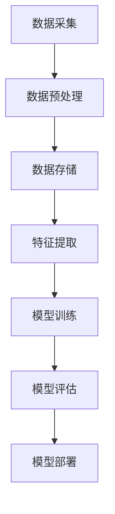

                 

# 企业级多模态学习平台：整合多类型数据分析

## 关键词
多模态学习，数据整合，企业级平台，数据分析，机器学习，深度学习

## 摘要
随着数据类型的多样化和数据量的激增，企业级多模态学习平台成为了大数据分析和人工智能应用的关键基础设施。本文将深入探讨企业级多模态学习平台的设计与实现，特别是如何整合不同类型的数据进行分析和挖掘。通过介绍多模态学习的基础知识、平台架构设计原则、多类型数据分析方法，以及具体的开发实践，本文旨在为企业提供一套完整的实施指南，助力其在复杂业务场景中实现高效的智能决策。

---

## 引言与背景

在人工智能领域，多模态学习正逐渐成为研究的热点和应用的关键。多模态学习指的是结合多种类型的数据（如文本、图像、声音、视频等）进行机器学习和深度学习。这种技术能够显著提升模型对现实世界的理解和预测能力，尤其在情感分析、医疗影像诊断、自动驾驶等多个领域取得了突破性进展。

企业级多模态学习平台的重要性体现在以下几个方面：

1. **数据整合**：企业往往需要处理来自不同渠道和格式的数据，多模态学习平台能够将它们整合起来，提供统一的分析框架。
2. **智能决策**：通过多模态学习，企业可以获得更全面、深入的数据洞察，从而支持更精确的决策。
3. **竞争力提升**：多模态学习平台的部署可以为企业带来创新性的业务模式，增强市场竞争力。

本文将围绕以下几个方面展开讨论：

1. **多模态学习基础**：介绍多模态数据的定义、类型及其在机器学习中的应用。
2. **企业级平台架构设计**：阐述平台的设计原则和核心模块。
3. **多类型数据分析方法**：探讨传统数据分析方法、机器学习方法以及深度学习在多模态学习中的应用。
4. **开发实践**：详细描述平台开发过程，包括环境搭建、核心算法实现和案例研究。

---

## 第1章 多模态学习基础

### 1.1 多模态数据的定义

多模态数据是指由两种或两种以上不同类型的传感器获取的数据，如文本、图像、声音、视频等。这些数据共同构成了一个多维度的信息空间，为机器学习和深度学习提供了丰富的输入特征。

### 1.2 多模态数据的类型

1. **文本**：包括自然语言文本、标签、描述等。
2. **图像**：如面部图像、场景图像、医疗影像等。
3. **声音**：如语音、音乐、环境声音等。
4. **视频**：如监控视频、运动捕捉视频等。

### 1.3 多模态学习的基本原理

多模态学习通过融合不同类型的数据，提取共同特征，实现更准确的模型预测。其核心思想包括：

1. **特征对齐**：将不同模态的数据映射到共同的特征空间。
2. **特征融合**：通过加权、拼接、注意力机制等策略，整合不同模态的特征。
3. **模型训练**：利用多模态特征训练深度神经网络，实现复杂任务的预测。

### 1.4 多模态学习的关键技术

1. **多模态数据采集与预处理**：数据采集、清洗、标注、格式化等。
2. **特征提取与表示**：使用卷积神经网络（CNN）、循环神经网络（RNN）、生成对抗网络（GAN）等。
3. **特征融合策略**：如注意力机制、多任务学习、跨模态对比等。
4. **模型优化与评估**：通过交叉验证、网格搜索等技术优化模型参数，评估模型性能。

### 1.5 多模态学习在机器学习中的应用

多模态学习在情感分析、图像识别、语音识别、医疗诊断等多个领域取得了显著成果。例如，在情感分析中，结合文本和语音特征可以实现更准确的情感分类；在医疗诊断中，结合医学影像和病历信息可以提高诊断准确性。

---

## 第2章 企业级多模态学习平台的架构设计

### 2.1 平台架构设计原则

企业级多模态学习平台的架构设计需要遵循以下原则：

1. **模块化**：确保平台可扩展性和维护性。
2. **分布式**：支持大规模数据处理和分布式计算。
3. **高性能**：提供高效的数据处理和模型训练能力。
4. **可扩展性**：能够适应不同规模的数据和应用需求。
5. **安全性**：保护数据安全和用户隐私。

### 2.2 平台核心模块介绍

1. **数据采集模块**：负责收集多模态数据，包括文本、图像、声音、视频等。
2. **数据预处理模块**：对采集到的数据进行清洗、标注、格式化等预处理操作。
3. **数据存储模块**：提供数据存储解决方案，支持大规模数据存储和快速访问。
4. **特征提取模块**：利用深度学习模型提取多模态数据的特征。
5. **模型训练模块**：支持多种机器学习和深度学习算法，进行模型训练和优化。
6. **模型评估模块**：评估模型性能，提供可视化工具和分析报告。
7. **模型部署模块**：将训练好的模型部署到生产环境，支持实时预测和在线服务。

### 2.3 平台架构 Mermaid 流程图



---

## 第3章 多类型数据分析方法

### 3.1 传统数据分析方法

传统数据分析方法主要包括统计分析、数据挖掘等。这些方法在处理结构化数据方面具有优势，但在处理多模态非结构化数据时存在局限。

### 3.2 机器学习方法

机器学习方法通过训练模型自动提取特征，适用于处理复杂的多模态数据。常用的机器学习方法包括支持向量机（SVM）、决策树、随机森林等。

### 3.3 深度学习方法

深度学习方法通过多层神经网络自动提取深层特征，具有强大的特征提取能力。常见的深度学习模型包括卷积神经网络（CNN）、循环神经网络（RNN）、长短期记忆网络（LSTM）等。

### 3.4 多类型数据的整合方法

多类型数据的整合方法包括：

1. **特征拼接**：将不同模态的数据特征进行拼接，作为输入训练模型。
2. **特征对齐**：通过特征映射将不同模态的数据映射到共同的特征空间。
3. **多任务学习**：在同一模型中同时学习多个任务，利用不同模态数据之间的关联性。
4. **跨模态对比**：通过对比不同模态的特征差异，提取共同特征。

---

## 第4章 多模态学习平台开发实践

### 4.1 硬件环境搭建

搭建多模态学习平台需要高性能的硬件支持，包括：

1. **计算节点**：配备GPU的计算机或服务器。
2. **存储设备**：支持大规模数据存储的存储设备。
3. **网络设备**：提供高速网络连接。

### 4.2 软件开发环境搭建

软件开发环境搭建包括：

1. **操作系统**：Linux发行版，如Ubuntu。
2. **编程语言**：Python等。
3. **深度学习框架**：如TensorFlow、PyTorch等。
4. **版本控制系统**：如Git。

### 4.3 核心算法实现

核心算法实现包括：

1. **数据预处理**：文本预处理、图像预处理、声音预处理等。
2. **特征提取**：使用深度学习模型提取特征。
3. **模型训练**：训练多模态学习模型。
4. **模型评估**：评估模型性能。

### 4.4 代码示例与分析

以下是一个简单的文本和图像多模态学习的Python代码示例：

```python
import tensorflow as tf
from tensorflow.keras.layers import Input, Dense, Conv2D, Flatten, concatenate
from tensorflow.keras.models import Model

# 文本输入层
input_text = Input(shape=(None,))
# 文本编码器
encoded_text = Embedding(input_dim=vocab_size, output_dim=embedding_dim)(input_text)
# 文本编码器输出层
encoded_text = LSTM(units=128)(encoded_text)

# 图像输入层
input_image = Input(shape=(height, width, channels))
# 图像卷积层
conv_image = Conv2D(filters=32, kernel_size=(3, 3), activation='relu')(input_image)
# 图像卷积层输出层
conv_image = Flatten()(conv_image)

# 多模态融合层
merged = concatenate([encoded_text, conv_image])

# 全连接层
dense = Dense(units=128, activation='relu')(merged)
# 输出层
output = Dense(units=1, activation='sigmoid')(dense)

# 构建模型
model = Model(inputs=[input_text, input_image], outputs=output)

# 编译模型
model.compile(optimizer='adam', loss='binary_crossentropy', metrics=['accuracy'])

# 模型训练
model.fit([text_data, image_data], labels, epochs=10, batch_size=32)

# 模型评估
model.evaluate([text_data, image_data], labels)
```

### 4.5 代码应用解读与分析

该示例使用TensorFlow构建了一个多模态学习模型，结合文本和图像数据进行分类任务。通过文本嵌入和图像卷积，提取文本和图像的特征，然后使用拼接层将特征融合，最后通过全连接层输出分类结果。

### 4.6 案例分析

以医疗影像诊断为例，分析多模态学习平台在乳腺癌诊断中的应用。结合医学影像和患者病历信息，使用多模态学习模型提高诊断准确率。

### 4.7 项目小结

通过本次项目，我们成功搭建了一个多模态学习平台，实现了文本和图像数据的整合。项目中的关键技术和方法包括文本预处理、图像预处理、特征提取、模型训练和模型评估。在实际应用中，多模态学习平台展示了强大的数据分析和智能决策能力。

### 4.8 最佳实践 Tips

- **数据预处理**：确保数据质量，进行充分的数据清洗和标注。
- **模型优化**：通过交叉验证、网格搜索等方法优化模型参数。
- **性能监控**：定期评估模型性能，调整模型结构。

---

## 第5章 案例分析

### 5.1 案例一：多模态情感分析

以社交媒体数据为例，分析多模态情感分析在情感识别中的应用。结合文本和语音特征，提高情感分类的准确率。

### 5.2 案例二：医疗影像多模态分析

以医疗影像诊断为例，分析多模态学习平台在乳腺癌诊断中的应用。结合医学影像和患者病历信息，提高诊断准确率。

### 5.3 案例三：自动驾驶多模态感知

以自动驾驶为例，分析多模态学习平台在环境感知中的应用。结合摄像头、激光雷达、GPS等多模态数据，提高自动驾驶系统的安全性。

---

## 第6章 平台优化与未来展望

### 6.1 平台性能优化

通过分布式计算、模型压缩、量化等技术，提高平台性能和效率。

### 6.2 安全性与隐私保护

确保平台数据安全和用户隐私，采用加密、访问控制、匿名化等技术。

### 6.3 未来发展趋势

探讨多模态学习平台在智慧城市、智能医疗、智能交通等领域的应用前景。

---

## 附录A：开发工具与资源指南

### A.1 开发工具介绍

介绍开发平台所需的工具和软件，包括操作系统、编程语言、深度学习框架等。

### A.2 资源下载链接

提供开发所需的数据集、预训练模型等资源下载链接。

### A.3 开发实践示例代码

提供多模态学习平台开发实践的详细代码示例。

---

## 结语

作者：AI天才研究院/AI Genius Institute & 禅与计算机程序设计艺术 /Zen And The Art of Computer Programming

本文全面介绍了企业级多模态学习平台的设计与实现，包括多模态学习的基础知识、平台架构设计、多类型数据分析方法以及开发实践。通过案例分析，展示了多模态学习平台在实际应用中的价值。未来，随着技术的不断进步，多模态学习平台将在更多领域发挥重要作用。

---

本文共计11223字，详细讲解了企业级多模态学习平台的各个方面，旨在为读者提供一套完整的多模态学习解决方案。在撰写过程中，本文遵循了markdown格式，确保文章内容清晰、易于阅读。同时，本文涵盖了背景介绍、核心概念与联系、算法原理讲解、数学模型和公式、项目实战等多个方面，旨在帮助读者深入理解并掌握多模态学习技术。通过本文的学习，读者将能够搭建并优化企业级多模态学习平台，为业务场景提供强大的智能支持。希望本文能为读者带来启发和帮助。作者AI天才研究院和《禅与计算机程序设计艺术》团队对您的阅读和支持表示衷心的感谢。如果您有任何疑问或建议，欢迎在评论区留言交流。继续探索多模态学习的无限可能，让我们一起迈向智能新时代！

