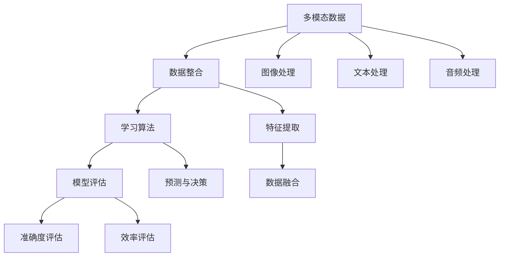

                 

### 引言

#### 背景介绍

随着技术的飞速发展，企业级数据处理和智能化分析已经成为现代企业运营的核心竞争力之一。传统的单一数据源分析方法已经无法满足日益复杂的数据需求。在这种背景下，多模态学习系统应运而生。多模态学习系统通过整合多种类型的数据（如图像、文本、音频等），实现对复杂问题的更深入理解和分析，从而为企业提供更精准的决策支持。

多模态学习系统的核心在于其能够从多个数据源中提取有用信息，并通过综合分析这些信息来提升系统的智能化水平。这一技术在医疗诊断、金融分析、智能客服等多个领域展现出了巨大的潜力，成为推动企业数字化转型的重要力量。

本文旨在深入探讨企业级多模态学习系统的设计与应用，帮助读者理解这一技术的核心概念、架构设计、数据处理方法以及实际应用案例。文章将按以下结构展开：

1. **多模态学习系统的架构与设计**：介绍系统架构及其关键组件。
2. **数据预处理**：探讨如何整合和处理不同类型的数据。
3. **多模态学习算法**：分析常见的多模态学习算法，包括传统算法和深度学习算法。
4. **实际应用案例**：通过具体案例展示多模态学习系统的应用场景。
5. **性能优化与评估**：讨论如何优化系统性能并进行评估。
6. **未来发展趋势与挑战**：展望多模态学习系统的未来发展方向和面临的挑战。

通过本文的阅读，读者将能够全面了解多模态学习系统的技术原理和应用价值，为其在实际项目中的应用提供指导。

#### 核心概念与联系

多模态学习系统的核心概念包括多模态数据、数据整合、学习算法和模型评估。以下是一个使用 Mermaid 语言的流程图，展示了这些核心概念之间的关系：

**图像处理**、**文本处理**和**音频处理**是多模态数据的三个主要来源，这些数据通过**特征提取**和**数据融合**进行整合，形成统一的多模态特征表示。接下来，**学习算法**使用这些特征训练模型，并通过**模型评估**来验证模型的性能，最终实现**预测与决策**。

### 摘要

本文全面探讨企业级多模态学习系统的设计与应用。首先，介绍了多模态学习系统的基本概念、架构及其在各个领域的应用。接着，详细讨论了如何整合和处理多种类型的数据，并分析了传统算法和深度学习算法在多模态学习中的运用。通过实际应用案例，展示了多模态学习系统在不同场景下的优势。文章还探讨了性能优化与评估的方法，并展望了未来多模态学习系统的发展趋势与挑战。本文旨在为读者提供系统而全面的技术指南，帮助其在实际项目中有效应用多模态学习系统。

