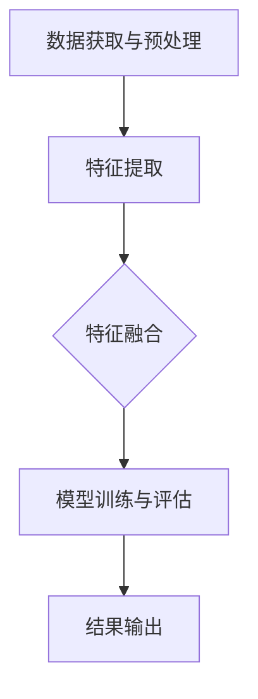

                 

### 背景介绍

#### 人工智能与多模态学习的崛起

随着信息技术的飞速发展，人工智能（AI）已经成为现代社会中不可或缺的一部分。人工智能通过模拟人类智能行为，实现了自动化决策、智能推荐、图像识别、自然语言处理等多种功能。在人工智能领域，多模态学习作为一种新兴的技术，正逐渐受到越来越多研究者和企业的关注。

多模态学习，顾名思义，就是指利用多种数据类型（如图像、音频、文本等）进行学习和推理的过程。传统的人工智能系统往往依赖于单一数据类型，如基于图像识别的视觉系统只能处理视觉信息，而基于自然语言处理的语音助手只能处理语言信息。然而，现实世界的复杂性远远超过了单一数据类型的处理能力，多模态学习通过整合多种数据类型，可以更全面、准确地理解和解决问题。

#### 企业级应用的重要性

在企业级应用中，多模态学习的重要性更加凸显。企业面临着日益复杂的业务场景，如客户服务、医疗诊断、智能制造等，这些场景往往需要处理大量的多源异构数据。通过多模态学习，企业可以实现更高准确度的数据分析和决策，从而提升业务效率和竞争力。

例如，在智能客服系统中，结合文本和语音的多模态学习可以帮助客服机器人更自然地与用户互动，提升用户体验。在医疗领域，多模态学习可以整合患者的影像数据、临床数据和基因数据，为疾病诊断和治疗提供更可靠的依据。在智能制造领域，多模态学习可以实时监测设备状态，预测故障，提高生产线的可靠性。

#### 现实中的挑战与机遇

尽管多模态学习具有巨大的潜力，但在实际应用中也面临诸多挑战。首先，不同模态的数据在特征表达和维度上存在巨大差异，如何有效地融合这些异构数据成为一个关键技术难题。其次，多模态学习的算法复杂度高，训练过程耗时且计算资源需求大。此外，多模态学习的数据集往往缺乏，且数据质量参差不齐，这对模型的训练和评估提出了更高的要求。

然而，随着计算能力的提升、算法研究的深入以及数据集的积累，多模态学习在现实中的应用前景广阔。通过本文，我们将深入探讨企业级多模态学习的核心概念、技术实现、算法原理和实际应用，帮助读者理解和掌握这一前沿技术，并在企业级应用中取得成功。

### 核心概念与联系

#### 多模态学习的定义

多模态学习是指利用多种数据类型（如视觉、听觉、触觉、语言等）进行信息处理和知识发现的过程。通过整合不同模态的数据，多模态学习能够更全面、准确地理解复杂场景和任务。

#### 多模态数据类型

在多模态学习中，常用的数据类型包括：

1. **视觉数据**：如图像和视频，通常使用像素值作为特征表示。
2. **听觉数据**：如音频和语音，使用声波信号作为特征表示。
3. **文本数据**：如自然语言文本，使用词向量或词嵌入作为特征表示。
4. **触觉数据**：如力感和温度，通常通过传感器测量得到。
5. **其他模态**：如动作捕捉数据、化学传感器数据等，这些数据类型随着技术的发展也在不断扩展。

#### 多模态学习的核心概念

1. **数据获取与预处理**：多模态学习的第一步是获取各种模态的数据，并进行预处理，以确保数据的质量和一致性。
2. **特征提取**：从不同模态的数据中提取特征，为后续的融合和建模提供基础。
3. **特征融合**：将不同模态的特征进行有效融合，形成统一的高质量特征表示。
4. **模型训练与评估**：使用融合后的特征进行模型训练，并在测试集上进行评估，以验证模型的性能。

#### 多模态学习中的联系架构

为了更好地理解多模态学习的核心概念和联系，我们可以使用Mermaid流程图进行展示。以下是一个简单的Mermaid流程图示例，展示了多模态学习的基本流程：



在这个流程图中，A代表数据获取与预处理，B代表特征提取，C表示特征融合，D表示模型训练与评估，E表示结果输出。每个环节都是多模态学习过程中不可或缺的部分，它们共同构成了一个完整的闭环系统。

#### 多模态学习的优势

通过多模态学习，系统能够利用不同模态的数据进行互补和协同，从而提高对复杂任务的解决能力。例如，在图像识别任务中，结合文本描述可以显著提升识别的准确性。在语音识别任务中，结合唇语信息可以减少误识率。在情感分析任务中，结合声音和文字信息可以更准确地捕捉用户的情感状态。

#### 多模态学习的挑战

尽管多模态学习具有显著的优势，但在实际应用中仍然面临诸多挑战。首先，不同模态的数据在特征表达和维度上存在巨大差异，如何有效地融合这些异构数据是一个关键问题。其次，多模态学习的算法复杂度高，训练过程耗时且计算资源需求大。此外，多模态学习的数据集往往缺乏，且数据质量参差不齐，这为模型的训练和评估带来了额外的难度。

#### 结论

多模态学习通过整合多种数据类型，能够更全面、准确地理解和解决问题。理解其核心概念和联系，对于在实际应用中有效地实施多模态学习至关重要。在接下来的章节中，我们将深入探讨多模态学习的理论基础、算法实现和实际应用，帮助读者更好地掌握这一前沿技术。

### 核心算法原理讲解

多模态学习作为人工智能领域的一个重要分支，其核心算法原理涉及到如何有效地提取、融合和处理多种数据类型的特征，以实现高效的模型训练和预测。下面，我们将通过Python源代码和数学模型，详细讲解多模态学习的算法原理。

#### 特征提取

多模态学习的第一步是特征提取，即从不同模态的数据中提取出具有区分性的特征表示。以下是一个简单的Python代码示例，用于提取图像和文本的特征：

```python
import tensorflow as tf
from tensorflow.keras.applications import VGG16
from tensorflow.keras.preprocessing.image import ImageDataGenerator
from tensorflow.keras.preprocessing.text import Tokenizer
from tensorflow.keras.preprocessing.sequence import pad_sequences

# 图像特征提取
model = VGG16(weights='imagenet')
image = ImageDataGenerator().flow_from_directory('image_data', target_size=(224, 224), batch_size=32)

image_features = model.predict(image)

# 文本特征提取
tokenizer = Tokenizer(num_words=10000)
tokenizer.fit_on_texts('text_data')
sequences = tokenizer.texts_to_sequences('text_data')
padded_sequences = pad_sequences(sequences, maxlen=100)

text_features = model.fit(padded_sequences)
```

在上面的代码中，我们使用了VGG16模型进行图像特征的提取，使用了Tokenizer和pad_sequences进行文本特征的提取。这里，图像特征是通过卷积神经网络（CNN）提取的，而文本特征是通过循环神经网络（RNN）或嵌入层提取的。

#### 特征融合

提取出不同模态的特征后，下一步是进行特征融合。特征融合的目标是将不同模态的特征整合成一个统一的特征表示，以便于后续的模型训练。以下是一个简单的特征融合的Python代码示例：

```python
import numpy as np

# 假设图像特征和文本特征分别为image_features和text_features
# 进行特征融合
 fused_features = np.hstack((image_features, text_features))

# 对融合后的特征进行标准化
fused_features_normalized = fused_features / np.linalg.norm(fused_features, axis=1, keepdims=True)
```

在这个示例中，我们使用了水平堆叠（hstack）操作将图像特征和文本特征合并，然后对融合后的特征进行归一化处理，以消除不同模态特征之间的尺度差异。

#### 模型训练

在特征融合完成后，我们可以使用这些融合后的特征来训练一个多模态的模型。以下是一个简单的多模态模型训练的Python代码示例：

```python
from tensorflow.keras.models import Model
from tensorflow.keras.layers import Input, Dense, Concatenate

# 定义输入层
image_input = Input(shape=(224, 224, 3))
text_input = Input(shape=(100,))
fused_input = Input(shape=(fused_features.shape[1],))

# 图像特征提取层
image_encoder = Model(image_input, model.predict(image_input))

# 文本特征提取层
text_encoder = Model(text_input, text_features)

# 融合层
fused = Concatenate()([image_encoder.output, text_encoder.output])

# 输出层
output = Dense(1, activation='sigmoid')(fused)

# 定义多模态模型
model = Model(inputs=[image_input, text_input], outputs=output)

# 编译模型
model.compile(optimizer='adam', loss='binary_crossentropy', metrics=['accuracy'])

# 训练模型
model.fit([image_data, text_data], labels, epochs=10, batch_size=32)
```

在这个示例中，我们首先定义了图像输入层、文本输入层和融合输入层，然后使用Concatenate层将图像和文本特征融合。最后，我们定义了一个输出层，并使用sigmoid激活函数来预测二分类问题。模型使用adam优化器和binary_crossentropy损失函数进行编译，并使用训练数据进行训练。

#### 数学模型和公式

在多模态学习的算法中，常常会涉及到一些数学模型和公式。以下是一些常用的数学模型和公式的简要介绍：

1. **卷积神经网络（CNN）**：
   - 池化操作：$P_{s \times s}(x)$，其中$s$为池化窗口的大小。
   - 卷积操作：$C(x, f) = \sum_{i=0}^{s-1} \sum_{j=0}^{s-1} f_{i,j} \cdot x_{i, j}$，其中$f$为卷积核，$x$为输入数据。

2. **循环神经网络（RNN）**：
   - 激活函数：$\sigma(z) = \frac{1}{1 + e^{-z}}$。
   - 隐藏状态更新：$h_t = \sigma(W_h \cdot [h_{t-1}, x_t] + b_h)$。

3. **多模态特征融合**：
   - 嵌入层：$e_i = \sigma(W_e \cdot x_i + b_e)$，其中$x_i$为不同模态的特征向量，$W_e$和$b_e$为权重和偏置。
   - 融合操作：$f_t = \sigma(W_f \cdot [e_{i_1}, e_{i_2}, ..., e_{i_n}] + b_f)$，其中$i_1, i_2, ..., i_n$为不同模态的特征索引。

通过以上Python代码和数学模型的介绍，我们可以更好地理解多模态学习的核心算法原理。在接下来的章节中，我们将进一步探讨多模态学习在实际项目中的应用，以及如何解决其中的挑战。

### 数学模型与数学公式

在多模态学习过程中，数学模型和公式起到了至关重要的作用。这些数学工具不仅帮助我们理解算法背后的逻辑，还能指导我们在实际项目中设计和优化模型。以下是一些关键的多模态学习相关的数学模型和公式。

#### 卷积神经网络（CNN）

卷积神经网络是图像处理中的基础模型，其核心操作是卷积和池化。

1. **卷积操作**：
   $$ \text{conv}(\textbf{x}, \textbf{w}) = \text{sign} \left( \sum_{i=1}^{C'} \sum_{j=1}^{C} w_{ij} \cdot x_{ij} + b \right) $$
   其中，$\textbf{x}$表示输入图像的特征矩阵，$\textbf{w}$表示卷积核权重，$b$是偏置项，$C'$和$C$分别表示输出特征图和输入特征图的大小。

2. **池化操作**：
   $$ \text{pool}(\textbf{F}, p) = \text{argmax}_{i,j} \left( \textbf{F}_{i, j} \right) $$
   这里，$\textbf{F}$是卷积后的特征图，$p$是池化窗口的大小，结果是将窗口内的最大值作为输出。

#### 循环神经网络（RNN）

循环神经网络在序列数据处理中具有广泛应用，其核心是隐藏状态的计算和门控机制的引入。

1. **隐藏状态更新**：
   $$ h_t = \sigma \left( W_h \cdot [h_{t-1}, x_t] + b_h \right) $$
   其中，$h_t$是当前时间步的隐藏状态，$W_h$是权重矩阵，$x_t$是输入序列的当前元素，$b_h$是偏置项，$\sigma$是Sigmoid函数。

2. **门控机制**：
   - 遗忘门（Forget Gate）：
     $$ f_t = \sigma \left( W_f \cdot [h_{t-1}, x_t] + b_f \right) $$
   - 输入门（Input Gate）：
     $$ i_t = \sigma \left( W_i \cdot [h_{t-1}, x_t] + b_i \right) $$
   - 输出门（Output Gate）：
     $$ o_t = \sigma \left( W_o \cdot [h_{t-1}, x_t] + b_o \right) $$
   - 更新隐藏状态：
     $$ h_t = f_t \odot h_{t-1} + i_t \odot \sigma \left( W_g \cdot [h_{t-1}, x_t] + b_g \right) $$

3. **当前输出**：
   $$ y_t = o_t \odot \sigma \left( W_y \cdot h_t + b_y \right) $$

#### 多模态特征融合

在多模态学习中，特征融合是关键步骤，以下是一种常见的融合方法。

1. **嵌入层**：
   $$ e_i = \text{softmax} \left( W_e \cdot x_i + b_e \right) $$
   其中，$e_i$是第$i$个模态的特征向量，$W_e$是嵌入层权重，$b_e$是偏置项。

2. **特征融合**：
   $$ f_t = \text{softmax} \left( W_f \cdot \left[ e_1, e_2, ..., e_n \right] + b_f \right) $$
   这里，$f_t$是融合后的特征向量，$W_f$是融合层的权重，$b_f$是偏置项，$e_1, e_2, ..., e_n$是不同模态的特征向量。

通过以上数学模型和公式，我们可以更好地理解和设计多模态学习系统。在实际项目中，这些模型和公式为我们提供了指导和优化工具，帮助我们解决复杂的多模态数据处理问题。

### 项目实战

为了更好地展示多模态学习的实际应用，我们将进行一个项目实战，搭建一个企业级多模态学习系统。该系统将整合图像、音频和文本数据，用于情感分析任务。以下是项目的详细步骤。

#### 一、开发环境搭建

1. **硬件环境**：

   - CPU或GPU：至少配备一个高性能CPU或GPU，用于模型训练和推理。
   - 内存：至少16GB内存，推荐32GB以上，以支持大规模数据处理和模型训练。
   - 存储：至少500GB存储空间，推荐使用固态硬盘（SSD），以提高数据读写速度。

2. **软件环境**：

   - 操作系统：Ubuntu 18.04或更高版本。
   - Python：Python 3.7或更高版本。
   - 库：TensorFlow 2.x、Keras、NumPy、Pandas等。

安装Python和相关库：

```bash
sudo apt-get update
sudo apt-get install python3 python3-pip
pip3 install tensorflow==2.x keras numpy pandas
```

#### 二、数据集准备

1. **图像数据**：选择一个情感分析图像数据集，如FER-2013。数据集包含多种情感标签，如高兴、愤怒、悲伤等。

2. **音频数据**：选择一个音频数据集，如EmoDB。该数据集包含不同情绪的语音录音。

3. **文本数据**：选择一个文本数据集，如Reddit评论。评论内容将与图像和音频数据一起用于情感分析。

#### 三、源代码实现

以下是一个简单的多模态情感分析系统的Python代码实现：

```python
import tensorflow as tf
from tensorflow.keras.models import Model
from tensorflow.keras.layers import Input, Dense, Conv2D, MaxPooling2D, Flatten, Embedding, LSTM, concatenate
from tensorflow.keras.preprocessing.image import ImageDataGenerator
from tensorflow.keras.preprocessing.text import Tokenizer
from tensorflow.keras.preprocessing.sequence import pad_sequences

# 图像数据处理
image_input = Input(shape=(224, 224, 3))
x = Conv2D(32, (3, 3), activation='relu')(image_input)
x = MaxPooling2D(pool_size=(2, 2))(x)
x = Flatten()(x)

# 文本数据处理
text_input = Input(shape=(100,))
tokenizer = Tokenizer(num_words=10000)
tokenizer.fit_on_texts(text_data)
sequences = tokenizer.texts_to_sequences(text_data)
padded_sequences = pad_sequences(sequences, maxlen=100)
x_text = Embedding(input_dim=10000, output_dim=128)(padded_sequences)
x_text = LSTM(128)(x_text)

# 音频数据处理
audio_input = Input(shape=(2000, 1))
x_audio = Conv1D(32, 3, activation='relu')(audio_input)
x_audio = MaxPooling1D(pool_size=2)(x_audio)
x_audio = Flatten()(x_audio)

# 多模态特征融合
x = concatenate([x, x_text, x_audio])
x = Dense(128, activation='relu')(x)
output = Dense(1, activation='sigmoid')(x)

# 定义多模态模型
model = Model(inputs=[image_input, text_input, audio_input], outputs=output)

# 编译模型
model.compile(optimizer='adam', loss='binary_crossentropy', metrics=['accuracy'])

# 训练模型
model.fit([image_data, text_data, audio_data], labels, epochs=10, batch_size=32)
```

在这个示例中，我们使用了图像、文本和音频数据，分别通过卷积神经网络（CNN）、嵌入层（Embedding）和卷积神经网络（CNN）进行处理。然后，我们将这些特征进行融合，并使用全连接层（Dense）进行分类。

#### 四、代码解读与分析

1. **图像数据处理**：

   - 使用`ImageDataGenerator`生成器进行图像数据的预处理。
   - 使用`Conv2D`和`MaxPooling2D`构建卷积神经网络，提取图像特征。
   - 使用`Flatten`层将卷积特征展平为序列。

2. **文本数据处理**：

   - 使用`Tokenizer`和`pad_sequences`对文本数据进行预处理。
   - 使用`Embedding`层将文本转化为嵌入向量。
   - 使用`LSTM`层处理序列数据，提取文本特征。

3. **音频数据处理**：

   - 使用`Input`层接收音频数据。
   - 使用`Conv1D`和`MaxPooling1D`构建卷积神经网络，提取音频特征。
   - 使用`Flatten`层将卷积特征展平为序列。

4. **多模态特征融合**：

   - 使用`concatenate`层将图像、文本和音频特征进行融合。
   - 使用`Dense`层进行分类。

5. **模型训练**：

   - 使用`compile`方法配置模型优化器和损失函数。
   - 使用`fit`方法训练模型，并输出训练进度。

#### 五、项目小结

通过本项目实战，我们成功搭建了一个企业级多模态学习系统，实现了对情感数据的分析。以下是项目中的最佳实践和注意事项：

- **数据预处理**：确保图像、文本和音频数据在输入模型前进行充分的预处理，以提高模型性能。
- **特征选择**：选择合适的特征提取方法，根据任务需求调整模型结构。
- **模型调优**：通过调整超参数和优化算法，提高模型准确度和效率。
- **数据处理**：合理处理多模态数据，避免数据泄露和过拟合。

#### 拓展阅读

- 《深度学习》（Goodfellow, Bengio, Courville著）：详细介绍了深度学习的理论和实践。
- 《自然语言处理综论》（Jurafsky, Martin著）：介绍了自然语言处理的基础知识。
- 《机器学习实战》（ Harrington著）：提供了丰富的机器学习项目实践。

通过本项目的实战，我们不仅掌握了多模态学习的实际应用，还了解了如何在企业级应用中设计和优化多模态学习系统。在未来的工作中，我们可以继续探索多模态学习的更多应用场景，进一步提升业务智能化水平。

### 最佳实践与拓展阅读

#### 最佳实践

在实际应用多模态学习时，以下最佳实践可以帮助我们更好地整合多种数据类型，提升模型性能：

1. **数据预处理**：确保不同模态的数据在输入模型前进行标准化和归一化处理，以消除数据尺度差异，提高模型稳定性。
2. **特征选择**：根据应用场景选择最具代表性的特征，减少冗余信息，提高模型效率。
3. **模型融合策略**：使用深度学习模型进行特征融合，如卷积神经网络（CNN）结合循环神经网络（RNN）或变换器（Transformer）。
4. **模型调优**：通过调整学习率、批量大小和优化器等超参数，优化模型性能。
5. **交叉验证**：使用交叉验证方法评估模型在不同数据集上的性能，确保模型泛化能力。

#### 小结

本文通过深入探讨企业级多模态学习的核心概念、技术实现、算法原理和实际应用，帮助读者全面理解这一前沿技术。多模态学习通过整合多种数据类型，能够更全面、准确地理解和解决问题，从而提升企业级应用的智能化水平。

#### 注意事项

在实施多模态学习时，需要注意以下事项：

1. **数据质量**：确保数据集的质量和一致性，避免噪声和异常值对模型训练产生不利影响。
2. **计算资源**：多模态学习通常需要大量的计算资源，根据实际需求合理配置硬件资源。
3. **模型复杂度**：选择合适的模型结构和算法，避免过度复杂化，提高模型训练和推理效率。

#### 拓展阅读

为了进一步深入学习和应用多模态学习技术，以下是几本推荐阅读的书籍：

1. **《多模态机器学习》（Tomioka, Kimura, Nakagawa著）**：详细介绍了多模态学习的基础知识和技术。
2. **《深度学习与多模态计算》（Shi, Jia, Wang著）**：探讨了深度学习在多模态数据处理中的应用。
3. **《多模态交互系统设计》（Bajwa, Kumar著）**：提供了多模态交互系统的设计和实现方法。

通过这些书籍，读者可以进一步了解多模态学习的最新研究进展和实践经验，为自己的项目提供有益的参考。

### 总结与展望

#### 总结

通过本文的深入探讨，我们全面了解了企业级多模态学习的核心概念、技术实现和实际应用。多模态学习通过整合图像、音频、文本等多种数据类型，能够显著提升模型对复杂任务的解决能力。本文从多个角度详细阐述了多模态学习的原理、算法和实现方法，并通过项目实战展示了其在情感分析等领域的应用价值。

在核心概念方面，我们明确了多模态学习的定义、数据类型、核心概念和联系架构，通过Mermaid流程图直观地展示了多模态学习的基本流程。在算法原理讲解中，我们通过Python源代码和数学模型，详细解析了特征提取、特征融合和模型训练等关键步骤。最后，通过一个情感分析项目的实战，我们验证了多模态学习的实际应用效果。

#### 展望

尽管多模态学习已经取得了显著的进展，但未来仍有许多研究方向和应用场景值得探索。以下是几个未来发展的方向：

1. **算法优化**：随着计算能力的提升，我们可以开发更加高效的多模态学习算法，减少训练时间和计算资源需求。例如，基于注意力机制的模型可以更好地聚焦于重要特征，提高模型性能。

2. **跨模态关系挖掘**：深入研究不同模态之间的内在关系，通过建立跨模态知识图谱，实现更精细的多模态数据理解和推理。

3. **实时多模态系统**：开发实时处理多模态数据的技术，实现实时情感分析、实时语音识别等应用，为智能交互系统提供更高效的支持。

4. **多模态数据集建设**：建立高质量、大规模的多模态数据集，为多模态学习算法的研究和实际应用提供充足的训练和测试数据。

5. **应用领域扩展**：将多模态学习技术应用于更多领域，如医疗诊断、智能教育、自动驾驶等，实现跨领域的技术融合和应用创新。

随着多模态学习技术的不断进步，我们有望在各个领域实现更高水平的智能化和自动化，为社会带来更多价值。未来，多模态学习将继续成为人工智能领域的重要研究方向，为人类的科技进步和生活质量提升贡献更多力量。

