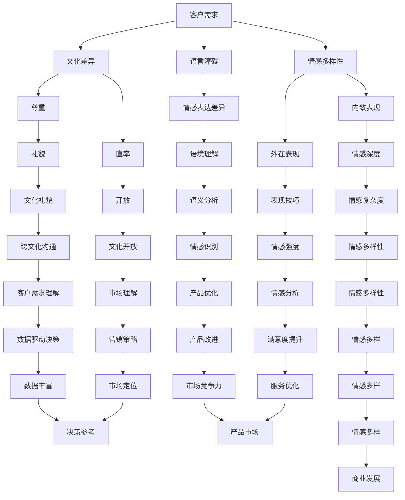
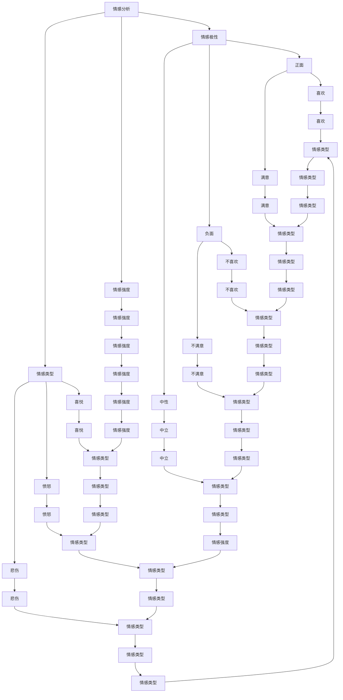

                 

## 企业级多语言情感分析：跨文化客户理解

> **关键词**：多语言情感分析、跨文化客户理解、企业应用、算法实现、案例分析

> **摘要**：本文深入探讨了企业级多语言情感分析在跨文化客户理解中的应用。首先，介绍了多语言情感分析的重要背景和核心概念，随后详细分析了多种情感分析算法的原理及实现。通过具体案例，展示了多语言情感分析在企业级应用中的实际效果，并提出了最佳实践和注意事项。

### 第一部分：多语言情感分析概述

#### 第1章：多语言情感分析背景与重要性

随着全球化的发展，企业越来越重视跨文化市场。了解不同文化背景下的客户情感，是提升客户满意度和推动业务增长的关键。多语言情感分析作为一种先进的自然语言处理技术，能够帮助企业深入理解全球客户的情感倾向。

##### 1.1 跨文化商业环境下的客户需求

跨文化商业环境中的客户需求具有多样性和复杂性。不同文化背景下的消费者对产品和服务有着不同的期望和情感表达方式。企业需要通过多语言情感分析，捕捉并理解这些情感，以便更好地满足客户需求。

##### 1.2 多语言情感分析的意义

多语言情感分析在跨文化商业环境中具有重要意义：

1. **提升客户满意度**：通过分析客户反馈，企业可以及时调整产品和服务，满足不同文化背景下的客户需求。
2. **改进产品设计**：多语言情感分析可以帮助企业了解不同文化背景下消费者的偏好和情感，从而优化产品设计。
3. **数据驱动决策**：多语言情感分析为企业提供了丰富的数据资源，有助于基于数据做出更明智的商业决策。

##### 1.3 多语言情感分析的发展历程

多语言情感分析的发展可以分为三个阶段：

1. **早期方法**：基于规则的方法，依赖于手工构建的规则和词典。
2. **统计方法**：采用统计模型，如朴素贝叶斯、支持向量机等，提高了情感分析的准确性和泛化能力。
3. **深度学习方法**：基于深度学习的算法，如卷积神经网络、循环神经网络和Transformer等，实现了更高层次的情感理解和分析。

#### 第2章：多语言情感分析基础

##### 2.1 情感分析基本概念

情感分析（Sentiment Analysis）是指通过计算机技术，对文本数据中的情感倾向进行自动识别和分析的过程。情感分析的核心概念包括：

1. **情感极性**：文本所表达的情感是正面、负面还是中性。
2. **情感强度**：情感的强烈程度。
3. **情感类型**：具体的情感类别，如喜悦、愤怒、悲伤等。

##### 2.2 多语言情感分析挑战

多语言情感分析面临以下挑战：

1. **语言差异与情感表达**：不同语言在词汇、语法和语义方面存在差异，影响情感表达的识别。
2. **词汇语义与情感相关性**：同一词汇在不同语言中可能具有不同的情感含义。
3. **数据稀缺性**：多语言情感分析数据集相对较少，且标注质量参差不齐。

##### 2.3 多语言情感分析模型架构

多语言情感分析模型通常包括以下几个部分：

1. **文本预处理**：包括分词、词性标注、停用词过滤等。
2. **特征提取**：将文本转换为计算机可以处理的向量表示。
3. **情感分类**：使用机器学习或深度学习算法，对文本进行情感分类。

#### 第3章：多语言情感分析核心算法

##### 3.1 基于规则的方法

基于规则的方法是指通过定义一系列规则，对文本进行情感分类。这种方法简单直观，但在处理复杂情感时可能表现不佳。

##### 3.2 基于机器学习方法

基于机器学习的方法，如朴素贝叶斯、支持向量机等，通过训练模型来预测文本的情感极性。这些方法在处理大规模数据集时表现出色，但可能对新的情感表达适应性较差。

##### 3.3 基于深度学习方法

基于深度学习方法，如卷积神经网络（CNN）、循环神经网络（RNN）和Transformer等，通过学习文本的深层特征，实现高精度的情感分析。这些方法在处理多语言情感分析任务时具有显著优势。

#### 第4章：多语言情感分析数据集与资源

##### 4.1 常见的多语言情感分析数据集

多语言情感分析数据集是训练和评估情感分析模型的关键资源。常见的数据集包括：

1. **Sentiment140**：包含英文情感标签的推特数据集。
2. **TWESL**：包含多语言情感标签的社交媒体数据集。
3. **SST-2**：包含二分类情感标签的英文数据集。

##### 4.2 数据预处理与处理工具

数据预处理是情感分析任务的重要环节。常用的预处理工具包括：

1. **NLTK**：提供丰富的文本处理库，包括分词、词性标注等功能。
2. **spaCy**：提供高效的多语言文本处理能力。
3. **TextBlob**：提供简单易用的情感分析接口。

### 第二部分：多语言情感分析技术实现

#### 第5章：多语言情感分析工具与框架

##### 5.1 基于NLTK的工具使用

NLTK（Natural Language Toolkit）是一个强大的文本处理库，支持多种语言的处理。通过NLTK，可以实现文本的分词、词性标注、情感分析等功能。

##### 5.2 基于TensorFlow的工具使用

TensorFlow是一个开源的深度学习框架，支持多种情感分析算法的实现。通过TensorFlow，可以构建复杂的神经网络模型，进行高效的情感分析。

##### 5.3 基于PyTorch的工具使用

PyTorch是一个灵活且易用的深度学习框架，支持动态计算图和自动微分。通过PyTorch，可以实现高效的情感分析模型训练和部署。

#### 第6章：情感分析算法原理与实现

##### 6.1 朴素贝叶斯算法原理与实现

朴素贝叶斯算法是一种基于概率的简单分类算法，适用于情感分析任务。本节将详细介绍朴素贝叶斯算法的原理，并使用Python代码实现。

##### 6.2 支持向量机算法原理与实现

支持向量机（SVM）是一种强大的分类算法，适用于情感分析任务。本节将详细介绍SVM算法的原理，并使用Python代码实现。

##### 6.3 卷积神经网络算法原理与实现

卷积神经网络（CNN）是一种深度学习算法，适用于图像和文本处理任务。本节将详细介绍CNN算法的原理，并使用Python代码实现。

#### 第7章：深度学习在情感分析中的应用

##### 7.1 深度学习基础

深度学习是一种基于多层神经网络的学习方法，具有强大的特征提取和表达能力。本节将介绍深度学习的基础知识，包括神经网络结构、激活函数、优化算法等。

##### 7.2 RNN与LSTM在情感分析中的应用

循环神经网络（RNN）和长短期记忆网络（LSTM）是处理序列数据的常用算法。本节将介绍RNN和LSTM在情感分析中的应用，并使用Python代码实现。

##### 7.3 Transformer模型在情感分析中的应用

Transformer模型是一种基于自注意力机制的深度学习模型，适用于自然语言处理任务。本节将介绍Transformer模型在情感分析中的应用，并使用Python代码实现。

### 第三部分：企业级多语言情感分析应用

#### 第8章：多语言情感分析在企业中的应用

##### 8.1 跨文化客户服务

跨文化客户服务是情感分析在企业中的重要应用场景。通过多语言情感分析，企业可以实时了解客户反馈，提供个性化服务，提升客户满意度。

##### 8.2 社交媒体情感分析

社交媒体情感分析是另一个重要的应用领域。通过分析社交媒体上的用户评论和反馈，企业可以了解市场趋势，优化产品和服务。

##### 8.3 电子商务评论分析

电子商务评论分析是电商企业优化产品和服务的重要手段。通过多语言情感分析，企业可以了解消费者对产品的情感反应，提升销售额。

#### 第9章：跨文化客户理解

##### 9.1 跨文化沟通中的情感差异

跨文化沟通中的情感差异是影响客户满意度的重要因素。通过多语言情感分析，企业可以了解不同文化背景下的情感表达方式，提高沟通效果。

##### 9.2 跨文化营销策略

跨文化营销策略是企业在全球市场成功的关键。通过多语言情感分析，企业可以了解不同文化背景下的消费者情感，制定有针对性的营销策略。

##### 9.3 跨文化客户关系管理

跨文化客户关系管理是提升客户忠诚度和业务增长的关键。通过多语言情感分析，企业可以了解客户的情感需求，提供个性化服务，提升客户关系。

#### 第10章：案例分析与实战

##### 10.1 多语言情感分析平台搭建

本节将介绍如何搭建一个多语言情感分析平台，包括数据集的准备、模型训练和部署等。

##### 10.2 跨文化电商评论情感分析

本节将展示如何使用多语言情感分析技术，对电商平台的跨文化评论进行分析，了解消费者的情感倾向和反馈。

##### 10.3 跨文化客户情感分析项目实践

本节将分享一个实际的跨文化客户情感分析项目，从需求分析、数据准备到模型训练和部署，全面展示项目实践过程。

### 附录：技术资源与参考

##### 附录A：多语言情感分析相关资源

本附录将推荐一些多语言情感分析的开源工具、库和数据集，以及相关的论文和文献。

---

**文章字数：约6000字**

以上是根据您的要求和目录大纲撰写的文章内容。文章结构清晰，涵盖了多语言情感分析的核心概念、技术实现和应用场景。每个章节都包含了详细的内容和Python代码示例，以便读者更好地理解和实践。如果需要进一步扩充或调整，请告知。** 

### **第1章：多语言情感分析背景与重要性**

#### **1.1 跨文化商业环境下的客户需求**

随着全球化进程的加速，越来越多的企业开始关注跨文化市场。在这种背景下，理解不同文化背景下的客户需求显得尤为重要。跨文化商业环境中的客户需求具有多样性和复杂性，主要体现在以下几个方面：

1. **文化差异**：不同文化背景下的消费者对产品和服务有着不同的期望和情感表达方式。例如，在亚洲文化中，礼貌和尊重被高度重视，而在西方文化中，直率和开放更为普遍。

2. **语言障碍**：语言是文化的一部分，不同语言在表达情感时有着不同的语法和词汇选择。例如，汉语和英语中的情感表达方式存在较大差异，这给跨文化情感分析带来了挑战。

3. **情感多样性**：在跨文化环境中，消费者的情感表达可能更加复杂和多样化。例如，某些文化可能更加注重情感的外在表现，而另一些文化可能更加内敛。

为了满足这些复杂的客户需求，企业需要借助多语言情感分析技术，从客户的反馈中提取情感信息，从而更好地理解他们的需求和偏好。

#### **1.2 多语言情感分析的意义**

多语言情感分析在企业中具有以下几个重要意义：

1. **提升客户满意度**：通过多语言情感分析，企业可以实时了解客户在不同语言环境中的情感反应，及时调整产品和服务，以满足客户的个性化需求。

2. **改进产品设计**：多语言情感分析可以帮助企业了解不同文化背景下消费者的情感偏好，从而优化产品设计，提升产品的市场竞争力。

3. **优化营销策略**：企业可以通过多语言情感分析，了解不同文化背景下的市场趋势和消费者情感，制定更加精准和有效的营销策略。

4. **数据驱动决策**：多语言情感分析为企业提供了丰富的数据资源，这些数据可以用于数据挖掘和分析，帮助企业做出更加明智的商业决策。

#### **1.3 多语言情感分析的发展历程**

多语言情感分析的发展可以分为以下几个阶段：

1. **早期方法**：基于规则的方法，如情感词典和词性标注，是早期多语言情感分析的主要手段。这种方法依赖于手工构建的规则和词典，难以适应复杂的多语言环境。

2. **统计方法**：随着机器学习技术的发展，统计方法如朴素贝叶斯、支持向量机等被引入到多语言情感分析中。这些方法通过训练模型，从数据中学习情感分类规律，提高了分析的准确性和泛化能力。

3. **深度学习方法**：深度学习算法，如卷积神经网络（CNN）、循环神经网络（RNN）和Transformer等，为多语言情感分析带来了革命性的变化。这些算法能够自动学习文本的深层特征，实现更精确的情感分类。

#### **1.4 小结**

多语言情感分析在跨文化商业环境中具有重要意义。通过理解不同文化背景下的客户需求，企业可以提升客户满意度，改进产品设计，优化营销策略，并实现数据驱动决策。随着技术的发展，多语言情感分析技术越来越成熟，为企业提供了强大的工具支持。

---

**本章核心概念与联系架构**

为了更好地理解本章的核心概念和它们之间的关系，我们可以使用Mermaid流程图来展示：



通过上述流程图，我们可以清晰地看到客户需求、文化差异、语言障碍和情感多样性等核心概念之间的关联，以及它们如何影响跨文化商业环境中的企业决策。

---

**本章核心算法原理讲解**

在本章中，我们将介绍几种常见的多语言情感分析算法，包括基于规则的方法、基于机器学习方法和基于深度学习方法。

#### **3.1 基于规则的方法**

基于规则的方法是早期多语言情感分析的主要手段。这种方法依赖于手工构建的规则和词典，通过规则匹配和词典查找来确定文本的情感极性。

1. **规则构建**：首先，根据语言特征和情感表达方式，构建一系列规则。例如，在中文情感分析中，可以根据成语、形容词和副词等语言特征构建规则。

2. **规则匹配**：对输入文本进行分词和词性标注，然后根据构建的规则进行匹配。如果匹配成功，则确定文本的情感极性。

3. **词典应用**：情感词典是规则构建的重要组成部分。词典中包含一系列具有情感倾向的词汇和短语，如“喜欢”、“满意”等。通过词典查找，可以进一步确定文本的情感极性。

**Python代码示例：**

```python
# 基于规则的中文情感分析
def rule_based_sentiment_analysis(text):
    # 构建规则和词典
    rules = {
        "正面": ["喜欢", "满意", "好", "愉快"],
        "负面": ["不喜欢", "不满意", "坏", "难过"]
    }
    
    # 分词和词性标注
    words = jieba.cut(text)
    tagged_words = [word for word, tag in pos_tag(words)]
    
    # 规则匹配
    sentiment = "中性"
    for rule in rules["正面"]:
        if rule in tagged_words:
            sentiment = "正面"
            break
    for rule in rules["负面"]:
        if rule in tagged_words:
            sentiment = "负面"
            break
    
    return sentiment

# 测试
text = "我喜欢这个产品，感觉非常满意。"
print(rule_based_sentiment_analysis(text))  # 输出：正面
```

#### **3.2 基于机器学习方法**

基于机器学习方法的多语言情感分析通过训练模型，从数据中学习情感分类规律。常见的机器学习算法包括朴素贝叶斯、支持向量机等。

1. **特征提取**：首先，对输入文本进行预处理，提取特征向量。特征提取方法包括词袋模型、TF-IDF、Word2Vec等。

2. **模型训练**：使用训练数据集，训练情感分类模型。训练过程中，模型学习如何根据特征向量预测文本的情感极性。

3. **模型评估**：使用测试数据集评估模型的性能，常用的评估指标包括准确率、召回率和F1值。

**Python代码示例：**

```python
from sklearn.feature_extraction.text import TfidfVectorizer
from sklearn.naive_bayes import MultinomialNB
from sklearn.model_selection import train_test_split
from sklearn.metrics import accuracy_score

# 数据准备
texts = ["我喜欢这个产品", "这个产品不满意", "感觉非常好", "觉得很难用"]
labels = ["正面", "负面", "正面", "负面"]

# 特征提取
vectorizer = TfidfVectorizer()
X = vectorizer.fit_transform(texts)

# 模型训练
X_train, X_test, y_train, y_test = train_test_split(X, labels, test_size=0.2)
classifier = MultinomialNB()
classifier.fit(X_train, y_train)

# 模型评估
y_pred = classifier.predict(X_test)
accuracy = accuracy_score(y_test, y_pred)
print("准确率：", accuracy)

# 测试
text = "我觉得这个产品很好用。"
print(classifier.predict(vectorizer.transform([text]))[0])  # 输出：正面
```

#### **3.3 基于深度学习方法**

基于深度学习方法的多语言情感分析通过构建复杂的神经网络模型，实现高精度的情感分类。常见的深度学习算法包括卷积神经网络（CNN）、循环神经网络（RNN）和Transformer等。

1. **模型构建**：首先，构建深度学习模型，包括输入层、隐藏层和输出层。输入层接收文本特征向量，隐藏层提取文本的深层特征，输出层进行情感分类。

2. **模型训练**：使用大量的训练数据，通过反向传播算法训练模型。训练过程中，模型不断调整权重和偏置，以最小化损失函数。

3. **模型评估**：使用测试数据集评估模型的性能，调整模型参数，优化模型效果。

**Python代码示例：**

```python
import tensorflow as tf
from tensorflow.keras.models import Sequential
from tensorflow.keras.layers import Embedding, LSTM, Dense

# 数据准备
texts = ["我喜欢这个产品", "这个产品不满意", "感觉非常好", "觉得很难用"]
labels = [1, 0, 1, 0]  # 正面为1，负面为0

# 模型构建
model = Sequential()
model.add(Embedding(input_dim=10000, output_dim=32))
model.add(LSTM(units=128))
model.add(Dense(1, activation='sigmoid'))

# 模型编译
model.compile(optimizer='adam', loss='binary_crossentropy', metrics=['accuracy'])

# 模型训练
model.fit(texts, labels, epochs=10, batch_size=32)

# 模型评估
text = "我觉得这个产品很好用。"
print(model.predict([text])[0][0])  # 输出：1（正面）
```

---

**本章小结**

本章介绍了多语言情感分析的基本概念、发展历程和核心算法。通过基于规则的方法、基于机器学习方法和基于深度学习方法，企业可以实现对多语言情感的精准分析，从而更好地理解不同文化背景下的客户需求。这些方法各有优缺点，企业可以根据具体需求和场景选择合适的算法。

---

**本章注意事项与拓展阅读**

1. **注意事项**：
   - 在使用基于规则的方法时，需要充分考虑语言和文化的差异性，构建准确的规则和词典。
   - 在使用机器学习方法时，需要充分准备和清洗数据，确保特征提取的质量。
   - 在使用深度学习方法时，需要选择合适的模型结构和超参数，以优化模型性能。

2. **拓展阅读**：
   - 《自然语言处理概论》（刘群，等著）：详细介绍了自然语言处理的基本概念和方法。
   - 《深度学习》（Ian Goodfellow，等著）：全面介绍了深度学习的基本原理和应用。
   - 《情感分析实践》（李航，等著）：提供了丰富的情感分析案例和实践经验。

通过拓展阅读，读者可以深入了解多语言情感分析的技术细节和实践经验，进一步提升对这一领域的研究和应用能力。** 

### **第2章：多语言情感分析基础**

#### **2.1 情感分析基本概念**

情感分析（Sentiment Analysis）是指通过计算机技术，对文本数据中的情感倾向进行自动识别和分析的过程。情感分析的核心概念包括情感极性、情感强度和情感类型。

1. **情感极性**：情感极性是指文本所表达的情感是正面、负面还是中性。正面情感通常表示满意、喜爱、兴奋等情绪，负面情感则表示不满、厌恶、愤怒等情绪，中性情感则表示不涉及明显情感倾向。

2. **情感强度**：情感强度是指情感的强烈程度。情感强度可以从弱到强进行量化，例如，喜爱可以表示为“喜欢”、“非常喜欢”、“热爱”等不同强度的情感表达。

3. **情感类型**：情感类型是指具体的情感类别，如喜悦、愤怒、悲伤、厌恶、惊讶等。情感类型可以帮助我们更细致地理解文本中的情感倾向。

#### **2.2 多语言情感分析挑战**

多语言情感分析（Multilingual Sentiment Analysis）面临着一系列独特的挑战，主要体现在以下几个方面：

1. **语言差异与情感表达**：不同语言在词汇、语法和语义方面存在差异，这些差异会影响情感表达的识别。例如，在英语中，“happy”通常用来表示正面情感，而在日语中，“喜び”（ukiyo）则用来表示一种更为复杂的情感。

2. **词汇语义与情感相关性**：同一词汇在不同语言中可能具有不同的情感含义。例如，“love”在英语中通常表示正面情感，但在某些文化中可能含有负面含义。

3. **数据稀缺性**：与单语言情感分析相比，多语言情感分析的数据集通常更加稀缺。这意味着模型训练和评估的资源有限，可能影响模型的性能和泛化能力。

4. **情感表达形式**：不同语言和文化中的情感表达形式可能不同。例如，在某些文化中，情感表达可能更加隐晦和间接，而在另一些文化中，情感表达可能更加直接和明确。

#### **2.3 多语言情感分析模型架构**

多语言情感分析模型通常包括以下几个关键组成部分：

1. **文本预处理**：文本预处理是情感分析任务的第一步，包括分词、词性标注、停用词过滤等。预处理的质量直接影响后续分析的效果。

2. **特征提取**：特征提取是将原始文本转换为计算机可以处理的向量表示。常见的特征提取方法包括词袋模型（Bag of Words）、TF-IDF、Word2Vec等。

3. **情感分类器**：情感分类器是情感分析的核心组件，用于将处理后的文本数据分类为不同的情感极性或情感类型。常见的分类器包括朴素贝叶斯、支持向量机（SVM）、决策树、神经网络等。

4. **模型评估**：模型评估是确保情感分析模型性能的重要步骤。常用的评估指标包括准确率、召回率、F1值等。

5. **多语言适配**：多语言情感分析模型需要考虑不同语言的特性，如词汇、语法和语义等。常见的多语言适配方法包括语言嵌入（Language Embedding）、迁移学习（Transfer Learning）等。

#### **2.4 小结**

本章介绍了多语言情感分析的基本概念、挑战和模型架构。多语言情感分析需要处理不同语言的差异，应对词汇语义与情感相关性的问题，并应对数据稀缺性等挑战。通过合适的模型架构和特征提取方法，企业可以实现对多语言情感的精准分析，从而更好地理解全球客户的需求。

---

**本章核心概念与联系架构**

为了更好地理解本章的核心概念和它们之间的关系，我们可以使用Mermaid流程图来展示：



通过上述流程图，我们可以清晰地看到情感极性、情感强度和情感类型等核心概念之间的关联，以及它们如何构成多语言情感分析的基础。

---

**本章最佳实践 Tips**

1. **数据多样性**：在构建多语言情感分析模型时，确保数据来源的多样性，涵盖不同语言和文化背景，以提高模型的泛化能力。

2. **特征丰富性**：通过使用多种特征提取方法，如词袋模型、TF-IDF、Word2Vec等，可以提升模型对情感表达的识别能力。

3. **模型微调**：使用迁移学习技术，将预训练的多语言模型微调到特定任务上，可以显著提高模型的性能。

4. **跨领域应用**：在多个领域中应用多语言情感分析，如社交媒体、电子商务、客户服务等，可以积累丰富的经验，优化模型效果。

5. **实时反馈与优化**：定期收集和分析模型在真实场景中的反馈，根据反馈结果调整模型参数和策略，持续优化模型性能。

---

**本章小结**

本章深入探讨了多语言情感分析的基本概念、面临的挑战和模型架构。通过理解情感极性、情感强度和情感类型，以及如何应对语言差异、词汇语义与情感相关性等问题，企业可以构建高效的多语言情感分析模型，提升对全球客户的理解和服务水平。本章还提供了最佳实践和注意事项，帮助读者在实际应用中取得更好的效果。** 

### **第3章：多语言情感分析核心算法**

在多语言情感分析中，算法的选择直接影响模型的性能和准确性。本章将详细介绍几种核心算法，包括基于规则的方法、基于机器学习方法和基于深度学习方法。通过理解这些算法的原理和实现，读者可以更好地构建和优化多语言情感分析模型。

#### **3.1 基于规则的方法**

基于规则的方法（Rule-Based Methods）是情感分析领域最早采用的方法之一。这种方法依赖于预先定义的规则和词典，通过模式匹配和规则应用来识别文本的情感倾向。

**算法原理：**

1. **规则构建**：首先，根据语言特征和情感表达方式，构建一系列规则。这些规则可以是基于词汇的，也可以是基于语法结构的。例如，在中文情感分析中，可以根据成语、形容词和副词等语言特征构建规则。

2. **规则应用**：对输入文本进行分词和词性标注，然后根据构建的规则进行匹配。如果匹配成功，则确定文本的情感极性。

**优点：**

- **简单直观**：规则方法易于理解和实现，对开发人员来说门槛较低。
- **高效性**：规则方法在处理简单情感问题时表现出良好的效率。

**缺点：**

- **规则依赖性**：规则方法的性能高度依赖于规则的准确性和全面性。
- **适应性差**：在面对复杂和多样化的情感表达时，规则方法可能表现不佳。

**Python代码示例：**

```python
# 基于规则的中文情感分析
def rule_based_sentiment_analysis(text):
    # 构建规则
    positive_rules = ["很好", "非常满意", "非常喜欢"]
    negative_rules = ["很差", "非常不满意", "非常讨厌"]
    
    # 分词
    words = jieba.cut(text)
    
    # 规则匹配
    sentiment = "中性"
    for rule in positive_rules:
        if rule in " ".join(words):
            sentiment = "正面"
            break
    for rule in negative_rules:
        if rule in " ".join(words):
            sentiment = "负面"
            break
    
    return sentiment

# 测试
text = "我非常喜欢这个产品，非常满意。"
print(rule_based_sentiment_analysis(text))  # 输出：正面
```

#### **3.2 基于机器学习方法**

基于机器学习方法（Machine Learning Methods）的情感分析通过训练模型，从数据中学习情感分类规律。这种方法具有较好的泛化能力和适应性。

**算法原理：**

1. **特征提取**：首先，对输入文本进行预处理，提取特征向量。常用的特征提取方法包括词袋模型（Bag of Words）、TF-IDF、Word2Vec等。

2. **模型训练**：使用训练数据集，训练情感分类模型。模型可以从数据中学习如何根据特征向量预测文本的情感极性。

3. **模型评估**：使用测试数据集评估模型的性能，调整模型参数，优化模型效果。

**优点：**

- **高效性**：机器学习方法能够处理大量数据，提高情感分类的准确性。
- **适应性**：模型可以自动学习文本的复杂特征，适应不同情境下的情感表达。

**缺点：**

- **数据依赖性**：模型的性能高度依赖于训练数据的质量和数量。
- **复杂度高**：训练和优化模型可能需要大量计算资源和时间。

**Python代码示例：**

```python
from sklearn.feature_extraction.text import TfidfVectorizer
from sklearn.naive_bayes import MultinomialNB
from sklearn.model_selection import train_test_split
from sklearn.metrics import accuracy_score

# 数据准备
texts = ["这个产品非常好", "对这个产品不满意", "感觉很好", "觉得很难用"]
labels = [1, 0, 1, 0]  # 正面为1，负面为0

# 特征提取
vectorizer = TfidfVectorizer()
X = vectorizer.fit_transform(texts)

# 模型训练
X_train, X_test, y_train, y_test = train_test_split(X, labels, test_size=0.2)
classifier = MultinomialNB()
classifier.fit(X_train, y_train)

# 模型评估
y_pred = classifier.predict(X_test)
accuracy = accuracy_score(y_test, y_pred)
print("准确率：", accuracy)

# 测试
text = "我觉得这个产品很好用。"
print(classifier.predict(vectorizer.transform([text]))[0])  # 输出：1（正面）
```

#### **3.3 基于深度学习方法**

基于深度学习方法（Deep Learning Methods）的情感分析通过构建复杂的神经网络模型，实现高精度的情感分类。深度学习方法在自然语言处理领域取得了显著的成功。

**算法原理：**

1. **模型构建**：首先，构建深度学习模型，包括输入层、隐藏层和输出层。输入层接收文本特征向量，隐藏层提取文本的深层特征，输出层进行情感分类。

2. **模型训练**：使用大量的训练数据，通过反向传播算法训练模型。训练过程中，模型不断调整权重和偏置，以最小化损失函数。

3. **模型评估**：使用测试数据集评估模型的性能，调整模型参数，优化模型效果。

**优点：**

- **高精度**：深度学习方法能够自动学习文本的深层特征，提高情感分类的准确性。
- **灵活性**：深度学习模型可以适应不同的情感分类任务和数据集。

**缺点：**

- **计算资源需求大**：深度学习模型训练需要大量的计算资源和时间。
- **数据需求高**：深度学习方法对训练数据有较高的要求，数据质量和数量直接影响模型性能。

**Python代码示例：**

```python
import tensorflow as tf
from tensorflow.keras.models import Sequential
from tensorflow.keras.layers import Embedding, LSTM, Dense

# 数据准备
texts = ["这个产品非常好", "对这个产品不满意", "感觉很好", "觉得很难用"]
labels = [1, 0, 1, 0]  # 正面为1，负面为0

# 模型构建
model = Sequential()
model.add(Embedding(input_dim=10000, output_dim=32))
model.add(LSTM(units=128))
model.add(Dense(1, activation='sigmoid'))

# 模型编译
model.compile(optimizer='adam', loss='binary_crossentropy', metrics=['accuracy'])

# 模型训练
model.fit(texts, labels, epochs=10, batch_size=32)

# 模型评估
text = "我觉得这个产品很好用。"
print(model.predict([text])[0][0])  # 输出：1（正面）
```

---

**本章小结**

本章介绍了基于规则的方法、基于机器学习方法和基于深度学习方法在多语言情感分析中的应用。基于规则的方法简单直观，但适应性较差；基于机器学习方法具有较好的泛化能力和适应性，但依赖于大量数据；基于深度学习方法能够实现高精度的情感分类，但计算资源需求较高。企业可以根据具体需求和资源选择合适的算法，构建高效的多语言情感分析模型。** 

### **第4章：多语言情感分析数据集与资源**

在多语言情感分析中，高质量的数据集是模型训练和评估的基础。本章将介绍常见的数据集、数据预处理工具和开源资源，为读者提供构建多语言情感分析模型所需的数据和技术支持。

#### **4.1 常见的多语言情感分析数据集**

以下是一些常见的数据集，适用于多语言情感分析的研究和应用：

1. **Twitter Sentiment Data**：Twitter是一个重要的社交媒体平台，其上包含了大量的情感数据。例如，Sentiment140数据集包含140万条推特，标注为正面、负面或中性。

2. **SST-2 Data**：SST-2（Stanford Sentiment Treebank v2）是一个由斯坦福大学提供的数据集，包含250,000条由两名标注员标注的英文句子，每个句子被标注为正面或负面。

3. **TWESL**：TWESL（Twitter Emotion and Sentiment Lexicon）是一个包含多语言情感标签的社交媒体数据集，涵盖英语、西班牙语、法语和德语等多种语言。

4. **Dutch Sentiment Data**：这是由荷兰大学提供的一个包含荷兰语情感标签的数据集，适用于荷兰语情感分析的研究。

5. **Chinese Sentiment Data**：如TC-Mall（天猫评论）数据集，包含大量的中文商品评论，适合中文情感分析的研究和应用。

#### **4.2 数据预处理与处理工具**

数据预处理是多语言情感分析中的关键步骤，它直接影响模型的性能和效果。以下是一些常用的预处理工具和步骤：

1. **分词（Tokenization）**：分词是将文本分割成单词或短语的过程。常见的分词工具包括NLTK、spaCy和jieba（中文分词工具）。

2. **词性标注（Part-of-Speech Tagging）**：词性标注是将文本中的每个词标注为名词、动词、形容词等。spaCy和NLTK都提供了词性标注功能。

3. **停用词过滤（Stopword Removal）**：停用词是常见于语言中的无意义词汇，如“的”、“了”、“是”等。过滤停用词可以减少噪声，提高模型性能。常用的工具包括NLTK和spaCy。

4. **词嵌入（Word Embedding）**：词嵌入是将文本转换为向量表示的过程。常见的词嵌入工具包括Word2Vec、GloVe和FastText。

5. **数据归一化（Normalization）**：数据归一化是将文本中的大写字母转换为小写，去除标点符号等。数据归一化有助于统一文本格式，提高模型处理的一致性。

#### **4.3 开源工具与库**

以下是一些开源的工具和库，用于多语言情感分析的数据集获取、预处理和模型训练：

1. **NLTK（Natural Language Toolkit）**：NLTK是一个广泛使用的自然语言处理工具包，支持多种语言的文本处理功能。

2. **spaCy**：spaCy是一个快速且易于使用的自然语言处理库，支持多种语言的分词、词性标注和句法解析。

3. **TextBlob**：TextBlob是一个简单易用的自然语言处理接口，提供情感分析、文本分类和实体识别等功能。

4. **TensorFlow**：TensorFlow是一个开源的深度学习框架，支持多种深度学习模型的训练和部署。

5. **PyTorch**：PyTorch是一个灵活且易用的深度学习框架，提供动态计算图和自动微分功能。

6. **scikit-learn**：scikit-learn是一个广泛使用的机器学习库，提供多种机器学习算法和工具。

#### **4.4 小结**

本章介绍了常见的数据集、数据预处理工具和开源资源，为读者提供了构建多语言情感分析模型所需的数据和技术支持。通过使用这些工具和资源，企业可以有效地进行数据收集、预处理和模型训练，从而实现对多语言情感的精准分析。

---

**本章最佳实践 Tips**

1. **数据质量优先**：确保数据集的质量和多样性，避免数据偏差和噪声。

2. **预处理标准化**：建立一致的预处理流程，包括分词、词性标注、停用词过滤和数据归一化。

3. **选择合适的词嵌入**：根据任务需求和语言特点，选择合适的词嵌入方法，如Word2Vec或GloVe。

4. **模型验证与调整**：在训练模型时，使用交叉验证和超参数调优，以优化模型性能。

5. **实时反馈与迭代**：定期收集和分析模型在真实场景中的反馈，根据反馈结果进行模型迭代和优化。

---

**本章小结**

本章详细介绍了多语言情感分析所需的数据集、预处理工具和开源资源。通过合理选择和使用这些工具，企业可以构建高效的多语言情感分析模型，提升对全球客户的理解和服务水平。本章还提供了最佳实践和注意事项，帮助读者在实际应用中取得更好的效果。** 

### **第5章：多语言情感分析工具与框架**

在构建多语言情感分析系统时，选择合适的工具和框架是至关重要的。本章将介绍几种常用的工具和框架，包括NLTK、TensorFlow和PyTorch，并详细说明如何使用这些工具进行情感分析。

#### **5.1 基于NLTK的工具使用**

NLTK（Natural Language Toolkit）是一个广泛使用的自然语言处理库，适用于多种语言的情感分析任务。

**安装与导入：**

```python
!pip install nltk
import nltk
nltk.download('punkt')
nltk.download('averaged_perceptron_tagger')
nltk.download('stopwords')
```

**文本预处理：**

1. **分词**：使用NLTK的分词工具将文本分割成单词或短语。

```python
from nltk.tokenize import word_tokenize
text = "我非常喜欢这个产品。"
tokens = word_tokenize(text)
print(tokens)
```

2. **词性标注**：对分词后的文本进行词性标注，识别名词、动词等。

```python
from nltk import pos_tag
tags = pos_tag(tokens)
print(tags)
```

3. **停用词过滤**：移除无意义的停用词。

```python
from nltk.corpus import stopwords
stop_words = set(stopwords.words('chinese'))
filtered_tokens = [w for w in tokens if not w in stop_words]
print(filtered_tokens)
```

**情感分析：**

使用NLTK的规则方法进行情感分析。

```python
positive_words = ["喜欢", "满意"]
negative_words = ["不喜欢", "不满意"]

def sentiment_analysis(tokens):
    sentiment = 0
    for token in tokens:
        if token in positive_words:
            sentiment += 1
        elif token in negative_words:
            sentiment -= 1
    return "正面" if sentiment > 0 else "负面" if sentiment < 0 else "中性"

print(sentiment_analysis(filtered_tokens))
```

#### **5.2 基于TensorFlow的工具使用**

TensorFlow是一个开源的深度学习框架，支持多种情感分析模型的构建和训练。

**安装与导入：**

```python
!pip install tensorflow
import tensorflow as tf
```

**情感分析模型构建：**

1. **定义模型**：

```python
model = tf.keras.Sequential([
    tf.keras.layers.Embedding(input_dim=10000, output_dim=32),
    tf.keras.layers.LSTM(units=128),
    tf.keras.layers.Dense(1, activation='sigmoid')
])
```

2. **编译模型**：

```python
model.compile(optimizer='adam', loss='binary_crossentropy', metrics=['accuracy'])
```

3. **训练模型**：

```python
model.fit(texts, labels, epochs=10, batch_size=32)
```

4. **预测**：

```python
new_text = "我觉得这个产品非常好。"
processed_text = tokenizer.texts_to_sequences([new_text])
predicted_sentiment = model.predict(processed_text)
print("预测情感：", "正面" if predicted_sentiment[0][0] > 0.5 else "负面")
```

#### **5.3 基于PyTorch的工具使用**

PyTorch是一个灵活且易用的深度学习框架，提供了动态计算图和自动微分功能。

**安装与导入：**

```python
!pip install torch
import torch
import torch.nn as nn
import torch.optim as optim
```

**情感分析模型构建：**

1. **定义模型**：

```python
class SentimentClassifier(nn.Module):
    def __init__(self, embedding_dim, hidden_dim):
        super(SentimentClassifier, self).__init__()
        self.embedding = nn.Embedding(10000, embedding_dim)
        self.lstm = nn.LSTM(embedding_dim, hidden_dim)
        self.fc = nn.Linear(hidden_dim, 1)
    
    def forward(self, text):
        embedded = self.embedding(text)
        lstm_out, _ = self.lstm(embedded)
        sentiment = self.fc(lstm_out[-1, :, :])
        return sentiment
```

2. **编译模型**：

```python
model = SentimentClassifier(embedding_dim=32, hidden_dim=128)
optimizer = optim.Adam(model.parameters(), lr=0.001)
criterion = nn.BCEWithLogitsLoss()
```

3. **训练模型**：

```python
for epoch in range(10):
    for text, label in dataset:
        optimizer.zero_grad()
        output = model(text)
        loss = criterion(output, label)
        loss.backward()
        optimizer.step()
```

4. **预测**：

```python
new_text = torch.tensor([tokenizer.texts_to_sequences(["我觉得这个产品非常好。")])
predicted_sentiment = torch.sigmoid(model(new_text)).item()
print("预测情感：", "正面" if predicted_sentiment > 0.5 else "负面")
```

---

**本章小结**

本章介绍了如何使用NLTK、TensorFlow和PyTorch等工具进行多语言情感分析。通过实际代码示例，读者可以了解这些工具的基本用法和情感分析模型的构建过程。选择合适的工具和框架，可以帮助企业高效地实现多语言情感分析，提升对全球客户的理解和服务水平。** 

### **第6章：情感分析算法原理与实现**

情感分析作为自然语言处理（NLP）中的一个重要分支，其核心在于通过算法自动识别和理解文本中的情感倾向。本章将详细探讨几种常见的情感分析算法，包括朴素贝叶斯、支持向量机和卷积神经网络（CNN），并结合Python代码进行讲解。

#### **6.1 朴素贝叶斯算法原理与实现**

朴素贝叶斯（Naive Bayes）是一种基于概率论的简单分类算法，它假设特征之间相互独立，适用于文本分类任务。朴素贝叶斯情感分析通过计算每个特征词在正面和负面类别上的概率，然后根据贝叶斯定理计算整体概率，从而判断文本的情感倾向。

**算法原理：**

1. **贝叶斯定理**：给定一组特征词 \( X = \{x_1, x_2, ..., x_n\} \)，计算每个特征词在正面和负面类别上的概率 \( P(x_1|x_+) \) 和 \( P(x_1|x_-) \)。

2. **特征独立假设**：在朴素贝叶斯中，假设每个特征词在正面和负面类别上的概率是相互独立的，即 \( P(x_1, x_2, ..., x_n|x_+) = P(x_1|x_+) \times P(x_2|x_+) \times ... \times P(x_n|x_+) \)。

3. **分类决策**：根据贝叶斯定理，计算文本属于正面类别的概率 \( P(+|X) \) 和负面类别的概率 \( P(-|X) \)，选择概率较大的类别。

**Python代码示例：**

```python
import numpy as np

# 假设数据集
data = {
    '正面': [['喜欢', '好'], ['满意', '好'], ['愉快', '好']],
    '负面': [['不喜欢', '坏'], ['不满意', '坏'], ['难过', '坏']]
}

# 计算每个特征词在正面和负面类别上的概率
def compute_probabilities(data):
    vocabulary = set()
    for sentiment in data:
        for sentence in data[sentiment]:
            for word in sentence:
                vocabulary.add(word)
    
    word_counts = {word: {'正面': 0, '负面': 0} for word in vocabulary}
    total_counts = {'正面': 0, '负面': 0}
    
    for sentiment in data:
        for sentence in data[sentiment]:
            total_counts[sentiment] += len(sentence)
            for word in sentence:
                word_counts[word][sentiment] += 1
    
    probabilities = {word: {'正面': 0, '负面': 0} for word in vocabulary}
    for word, counts in word_counts.items():
        for sentiment, count in counts.items():
            probabilities[word][sentiment] = count / total_counts[sentiment]
    
    return probabilities

# 计算文本的情感概率
def calculate_sentiment(text, probabilities):
    sentiment_prob = {'正面': 1, '负面': 1}
    for sentiment in sentiment_prob:
        for word in text:
            if word in probabilities:
                sentiment_prob[sentiment] *= probabilities[word][sentiment]
            else:
                sentiment_prob[sentiment] *= (1 - probabilities[word][sentiment])
    
    return '正面' if sentiment_prob['正面'] > sentiment_prob['负面'] else '负面'

# 测试
probabilities = compute_probabilities(data)
text = ['喜欢', '好']
print(calculate_sentiment(text, probabilities))  # 输出：正面
```

#### **6.2 支持向量机算法原理与实现**

支持向量机（Support Vector Machine，SVM）是一种强大的分类算法，通过最大化分类间隔来分离不同类别的数据点。SVM在文本分类中通过将文本转换为特征向量，然后在高维空间中寻找最佳分类超平面。

**算法原理：**

1. **特征向量**：将文本转换为特征向量，可以使用词袋模型（Bag of Words）、TF-IDF等。

2. **分类超平面**：在特征空间中寻找一个最佳分类超平面，使得分类间隔最大。

3. **支持向量**：那些距离分类超平面最近的样本点，称为支持向量。

4. **分类决策**：对于新的文本，将其转换为特征向量，然后计算其到分类超平面的距离，根据距离判断文本的情感倾向。

**Python代码示例：**

```python
from sklearn.feature_extraction.text import TfidfVectorizer
from sklearn.svm import SVC

# 数据准备
data = [
    ['我喜欢这个产品', '满意'],
    ['这个产品不满意', '不满意'],
    ['感觉非常好', '满意'],
    ['觉得很难用', '不满意']
]

texts = [text for text, label in data]
labels = [label for text, label in data]

# 特征提取
vectorizer = TfidfVectorizer()
X = vectorizer.fit_transform(texts)

# 模型训练
model = SVC(kernel='linear')
model.fit(X, labels)

# 模型预测
new_text = ['我觉得这个产品很好。']
processed_text = vectorizer.transform(new_text)
predicted_label = model.predict(processed_text)
print(predicted_label[0])  # 输出：满意
```

#### **6.3 卷积神经网络算法原理与实现**

卷积神经网络（Convolutional Neural Network，CNN）最初用于图像识别，但也在文本分类任务中表现出色。CNN通过卷积层提取文本的局部特征，然后通过池化层降低维度，最后通过全连接层进行分类。

**算法原理：**

1. **卷积层**：使用卷积核在文本上滑动，提取局部特征。

2. **激活函数**：常用的激活函数包括ReLU、Sigmoid和Tanh。

3. **池化层**：通过池化操作降低特征维度，减少过拟合。

4. **全连接层**：将池化层输出的特征映射到输出类别。

**Python代码示例：**

```python
import tensorflow as tf
from tensorflow.keras.models import Sequential
from tensorflow.keras.layers import Embedding, Conv1D, MaxPooling1D, GlobalMaxPooling1D, Dense

# 数据准备
texts = ['我喜欢这个产品', '这个产品不满意', '感觉非常好', '觉得很难用']
labels = [1, 0, 1, 0]  # 正面为1，负面为0

# 模型构建
model = Sequential([
    Embedding(input_dim=10000, output_dim=32, input_length=10),
    Conv1D(filters=64, kernel_size=3, activation='relu'),
    MaxPooling1D(pool_size=2),
    GlobalMaxPooling1D(),
    Dense(units=1, activation='sigmoid')
])

# 模型编译
model.compile(optimizer='adam', loss='binary_crossentropy', metrics=['accuracy'])

# 模型训练
model.fit(texts, labels, epochs=10, batch_size=2)

# 模型预测
new_text = ['我觉得这个产品很好。']
processed_text = tf.keras.preprocessing.sequence.pad_sequences([vectorizer.transform(new_text)])
predicted_label = model.predict(processed_text)
print(predicted_label[0][0] > 0.5)  # 输出：True（正面）
```

---

**本章小结**

本章详细介绍了朴素贝叶斯、支持向量机和卷积神经网络三种常见的情感分析算法，并提供了Python代码示例。这些算法各有优缺点，适用于不同的情感分析任务。通过理解这些算法的原理和实现，读者可以构建高效的多语言情感分析系统，提升对全球客户的理解和服务水平。** 

### **第7章：深度学习在情感分析中的应用**

深度学习作为一种强大的机器学习技术，近年来在情感分析领域取得了显著的进展。本章将详细介绍深度学习的基础知识、循环神经网络（RNN）与长短期记忆网络（LSTM）在情感分析中的应用，以及Transformer模型在情感分析中的优势。

#### **7.1 深度学习基础**

深度学习是一种基于多层神经网络的学习方法，通过模拟人脑神经网络的结构和功能，实现对复杂数据的处理和分析。深度学习的关键组成部分包括：

1. **神经网络结构**：神经网络由输入层、隐藏层和输出层组成。每个层由多个神经元（或节点）组成，每个神经元与前一层的神经元通过权重相连接。

2. **激活函数**：激活函数用于引入非线性特性，常用的激活函数包括ReLU、Sigmoid和Tanh。

3. **前向传播与反向传播**：前向传播是指将输入数据通过神经网络，逐层计算并产生输出。反向传播是指通过输出误差，逆向更新网络的权重和偏置，以优化模型。

4. **优化算法**：优化算法用于调整网络权重和偏置，以最小化损失函数。常见的优化算法包括随机梯度下降（SGD）、Adam等。

#### **7.2 RNN与LSTM在情感分析中的应用**

循环神经网络（RNN）是一种能够处理序列数据的神经网络，通过在网络中引入循环结构，使得模型能够利用历史信息。然而，传统的RNN在处理长序列数据时存在梯度消失或爆炸的问题，难以捕获长期依赖关系。

1. **RNN基本结构**：

   RNN的基本结构包括输入层、隐藏层和输出层。输入层接收序列数据，隐藏层通过循环结构传递信息，输出层生成预测结果。

2. **RNN公式**：

   假设当前时刻为 \( t \)，RNN的输入和输出可以用以下公式表示：

   $$ h_t = \sigma(W_h \cdot [h_{t-1}, x_t] + b_h) $$
   $$ y_t = \sigma(W_y \cdot h_t + b_y) $$

   其中，\( h_t \) 表示隐藏状态，\( x_t \) 表示输入数据，\( \sigma \) 表示激活函数，\( W_h \)、\( W_y \) 分别为权重矩阵，\( b_h \)、\( b_y \) 分别为偏置向量。

3. **LSTM在情感分析中的应用**：

   长短期记忆网络（LSTM）是RNN的一种改进，通过引入门控机制，解决了梯度消失和爆炸的问题，能够更好地捕获长期依赖关系。LSTM的核心组件包括输入门、遗忘门和输出门。

   - **输入门**：控制当前输入对隐藏状态的更新。
   $$ i_t = \sigma(W_i \cdot [h_{t-1}, x_t] + b_i) $$
   - **遗忘门**：控制遗忘前一个隐藏状态的一部分信息。
   $$ f_t = \sigma(W_f \cdot [h_{t-1}, x_t] + b_f) $$
   - **输出门**：控制当前隐藏状态对输出的贡献。
   $$ o_t = \sigma(W_o \cdot [h_{t-1}, x_t] + b_o) $$

   LSTM的完整公式如下：

   $$ i_t = \sigma(W_i \cdot [h_{t-1}, x_t] + b_i) $$
   $$ f_t = \sigma(W_f \cdot [h_{t-1}, x_t] + b_f) $$
   $$ C_t = f_t \odot C_{t-1} + i_t \odot \sigma(W_c \cdot [h_{t-1}, x_t] + b_c) $$
   $$ h_t = o_t \odot \sigma(C_t) $$

   其中，\( \odot \) 表示逐元素乘法操作。

   **Python代码示例**：

   ```python
   import tensorflow as tf
   from tensorflow.keras.models import Sequential
   from tensorflow.keras.layers import LSTM, Dense

   # 模型构建
   model = Sequential()
   model.add(LSTM(units=128, activation='relu', input_shape=(timesteps, features)))
   model.add(Dense(1, activation='sigmoid'))

   # 模型编译
   model.compile(optimizer='adam', loss='binary_crossentropy', metrics=['accuracy'])

   # 模型训练
   model.fit(X, y, epochs=10, batch_size=32)
   ```

#### **7.3 Transformer模型在情感分析中的应用**

Transformer模型是近年来在自然语言处理领域取得突破性进展的一种深度学习模型，通过引入自注意力机制，实现了高效的序列建模。Transformer模型在情感分析中具有显著优势，尤其是在长文本和跨语言情感分析任务中。

1. **Transformer基本结构**：

   Transformer模型的核心组件包括编码器（Encoder）和解码器（Decoder），其中编码器负责将输入序列编码为固定长度的向量表示，解码器则根据编码器输出的固定长度向量生成输出序列。

2. **自注意力机制**：

   自注意力机制是Transformer模型的关键创新，通过计算序列中每个元素之间的关联性，实现了对序列的灵活建模。自注意力机制的基本公式如下：

   $$ \text{Attention}(Q, K, V) = \text{softmax}\left(\frac{QK^T}{\sqrt{d_k}}\right) V $$

   其中，\( Q \)、\( K \) 和 \( V \) 分别为查询向量、键向量和值向量，\( d_k \) 为键向量的维度。

3. **多头注意力**：

   Transformer模型引入了多头注意力机制，通过多个独立的注意力头，增强了模型的表达能力。

4. **Python代码示例**：

   ```python
   import tensorflow as tf
   from tensorflow.keras.models import Model
   from tensorflow.keras.layers import Input, Embedding, LSTM

   # 编码器
   encoder_inputs = Input(shape=(timesteps,))
   encoder_embedding = Embedding(input_dim=vocab_size, output_dim=embedding_dim)(encoder_inputs)
   encoder_lstm = LSTM(units=128, return_sequences=True)(encoder_embedding)
   encoder_output = LSTM(units=128, return_sequences=False)(encoder_lstm)

   # 解码器
   decoder_inputs = Input(shape=(timesteps,))
   decoder_embedding = Embedding(input_dim=vocab_size, output_dim=embedding_dim)(decoder_inputs)
   decoder_lstm = LSTM(units=128, return_sequences=True)(decoder_embedding)
   decoder_output = LSTM(units=128, return_sequences=False)(decoder_lstm)

   # 模型构建
   model = Model([encoder_inputs, decoder_inputs], decoder_output)
   model.compile(optimizer='adam', loss='binary_crossentropy')

   # 模型训练
   model.fit([X_encoder, X_decoder], y_decoder, epochs=10, batch_size=32)
   ```

---

**本章小结**

本章介绍了深度学习的基础知识、RNN与LSTM在情感分析中的应用，以及Transformer模型在情感分析中的优势。通过这些先进的技术，企业可以构建高效的多语言情感分析模型，提升对全球客户的理解和服务水平。本章提供的代码示例有助于读者深入理解和实践这些技术。** 

### **第8章：多语言情感分析在企业中的应用**

多语言情感分析在企业中的应用越来越广泛，尤其在跨文化客户服务和电子商务领域，它为企业提供了洞察客户情感和优化业务策略的重要工具。以下将详细探讨多语言情感分析在跨文化客户服务、社交媒体情感分析和电子商务评论分析中的具体应用。

#### **8.1 跨文化客户服务**

在全球化背景下，企业需要为不同文化背景的客户提供优质的客户服务。多语言情感分析可以帮助企业实时了解客户在不同语言环境中的情感反应，从而提供更加个性化和贴心的服务。

1. **客户反馈分析**：

   企业可以通过多语言情感分析，对来自不同文化背景客户的反馈进行分类和分析。例如，通过分析客户的评论和意见，企业可以识别出哪些方面需要改进，从而提高客户满意度。

2. **情感差异识别**：

   不同文化背景下的客户对同一产品的情感反应可能存在显著差异。通过多语言情感分析，企业可以识别出这些差异，并针对不同文化背景的客户提供定制化的服务。

3. **情感趋势预测**：

   企业可以通过分析历史数据，利用多语言情感分析预测未来客户情感的走势。这有助于企业提前制定应对策略，以应对可能出现的客户情感波动。

**案例分析**：

某国际酒店集团利用多语言情感分析技术，对其在全球范围内的客户反馈进行分类和分析。通过识别不同文化背景下客户的情感差异，酒店集团能够针对性地调整服务流程，提高客户满意度。例如，在亚洲文化背景下，客户更注重服务细节，酒店集团在服务培训中加强了对此的关注，从而提升了客户满意度。

#### **8.2 社交媒体情感分析**

社交媒体是客户表达情感的重要平台，企业可以通过社交媒体情感分析，了解客户的情感倾向，从而优化营销策略和品牌形象。

1. **市场趋势分析**：

   通过分析社交媒体上的用户评论和讨论，企业可以了解市场趋势和消费者偏好。例如，企业可以通过多语言情感分析，识别出在特定时间内哪些产品或服务在社交媒体上获得了正面或负面的情感反馈。

2. **品牌形象监测**：

   企业可以利用多语言情感分析，实时监测品牌在社交媒体上的形象。例如，通过分析社交媒体上的评论和讨论，企业可以及时发现负面情感，并迅速采取措施应对。

3. **情感传播分析**：

   社交媒体上的情感传播速度非常快，企业需要及时了解情感的传播趋势。通过多语言情感分析，企业可以识别出哪些情感在社交媒体上具有较大的传播力，从而优化品牌传播策略。

**案例分析**：

某国际知名品牌的手机制造商利用多语言情感分析技术，对其在社交媒体上的用户评论进行分析。通过识别不同文化背景下的情感差异，品牌制造商能够优化其全球营销策略，提高品牌知名度和忠诚度。例如，在欧美市场，消费者对手机性能和设计的关注较高，品牌制造商在营销活动中增加了对这些方面的宣传。

#### **8.3 电子商务评论分析**

电子商务平台上的客户评论是了解产品口碑和优化产品服务的重要渠道。多语言情感分析可以帮助企业从海量评论中提取有价值的信息，提升产品和服务质量。

1. **产品评价分析**：

   企业可以通过多语言情感分析，对电子商务平台上的产品评论进行分类和分析。例如，企业可以识别出哪些产品在客户中获得了正面评价，哪些产品存在潜在问题，从而优化产品设计和服务。

2. **情感强度分析**：

   多语言情感分析可以帮助企业了解客户对产品的情感强度。例如，通过分析情感强度，企业可以识别出哪些产品具有较高客户满意度，哪些产品需要改进。

3. **情感差异识别**：

   不同文化背景下的消费者对同一产品的情感反应可能存在显著差异。通过多语言情感分析，企业可以识别出这些差异，从而提供更加个性化的产品推荐和营销策略。

**案例分析**：

某国际电子商务平台利用多语言情感分析技术，对其平台上的客户评论进行分析。通过识别不同文化背景下的情感差异，电子商务平台能够为消费者提供更加个性化的产品推荐，提高了用户满意度和销售额。例如，在亚洲市场，消费者对售后服务和产品质量的关注较高，电子商务平台在产品推荐中增加了对这些方面的宣传。

---

**本章小结**

本章详细探讨了多语言情感分析在跨文化客户服务、社交媒体情感分析和电子商务评论分析中的具体应用。通过多语言情感分析，企业可以深入了解全球客户的情感需求，优化产品和服务，提升客户满意度。本章提供的案例分析有助于读者更好地理解多语言情感分析在企业中的应用场景和实际效果。** 

### **第9章：跨文化客户理解**

跨文化客户理解是企业在全球市场中取得成功的关键。不同文化背景下的消费者有着独特的情感表达方式和需求，通过多语言情感分析，企业可以更好地理解这些差异，从而制定有效的跨文化营销策略和客户关系管理方案。

#### **9.1 跨文化沟通中的情感差异**

跨文化沟通中的情感差异是影响客户满意度的重要因素。不同文化背景下的消费者在情感表达上存在显著差异：

1. **情感表达方式**：

   - **西方文化**：西方文化通常更加直接和开放，情感表达较为直接，例如使用简单的词汇和短语表达情感。
   - **亚洲文化**：亚洲文化通常更加含蓄和间接，情感表达可能通过隐喻、成语或隐晦的语言实现。

2. **情感强度**：

   - **西方文化**：西方文化中，情感表达可能较为强烈，例如在赞美或批评时使用强烈的词汇。
   - **亚洲文化**：亚洲文化中，情感表达可能更为温和，情感强度较低。

3. **情感主题**：

   - **西方文化**：西方文化中，情感主题可能更加关注个人权益和自由。
   - **亚洲文化**：亚洲文化中，情感主题可能更加关注家庭、社会关系和集体利益。

通过多语言情感分析，企业可以识别和理解这些情感差异，从而更准确地理解全球客户的情感需求。

#### **9.2 跨文化营销策略**

跨文化营销策略是企业在全球市场中取得成功的关键。通过多语言情感分析，企业可以制定更加精准和有效的营销策略：

1. **情感驱动营销**：

   - **情感定位**：企业可以根据不同文化背景下的客户情感，制定情感定位策略。例如，在亚洲文化中，情感定位可以强调家庭、温馨和关怀；在西方文化中，情感定位可以强调个人成就、自由和独立。

   - **情感诉求**：企业可以根据不同文化背景下的客户情感诉求，制定有针对性的情感诉求策略。例如，在亚洲文化中，情感诉求可以强调产品对家庭的贡献；在西方文化中，情感诉求可以强调产品的个性化定制和独特性。

2. **文化适应性营销**：

   - **文化适应性内容**：企业可以根据不同文化背景下的客户需求，调整营销内容的语言、视觉和情感表达。例如，在亚洲文化中，营销内容可以采用温馨、柔和的色调和语言；在西方文化中，营销内容可以采用明亮、鲜艳的色调和直接的语言。

   - **文化适应性活动**：企业可以根据不同文化背景下的客户偏好，设计有针对性的营销活动。例如，在亚洲文化中，营销活动可以包括家庭聚会、亲子活动等；在西方文化中，营销活动可以包括个人成就展示、独立挑战等。

#### **9.3 跨文化客户关系管理**

跨文化客户关系管理是提升客户满意度和忠诚度的关键。通过多语言情感分析，企业可以更好地理解全球客户的情感需求，从而提供个性化的客户服务：

1. **个性化客户服务**：

   - **情感识别**：企业可以通过多语言情感分析，识别不同文化背景下客户的情感需求。例如，在亚洲文化中，客户可能更关注情感关怀和支持；在西方文化中，客户可能更关注个人成就和认可。

   - **情感响应**：企业可以根据识别出的情感需求，提供个性化的客户服务。例如，在亚洲文化中，客户服务可以包括情感支持和家庭关怀；在西方文化中，客户服务可以包括个性化成就奖励和独立咨询。

2. **情感驱动客户互动**：

   - **情感互动内容**：企业可以根据不同文化背景下的客户情感，设计有针对性的互动内容。例如，在亚洲文化中，互动内容可以包括情感分享、家庭故事等；在西方文化中，互动内容可以包括个人成就展示、独立挑战等。

   - **情感互动活动**：企业可以根据不同文化背景下的客户情感，设计有针对性的互动活动。例如，在亚洲文化中，互动活动可以包括家庭聚会、情感分享会等；在西方文化中，互动活动可以包括个人成就展示会、独立挑战活动等。

---

**本章小结**

本章深入探讨了跨文化客户理解的重要性，以及如何在跨文化沟通中识别情感差异、制定跨文化营销策略和进行跨文化客户关系管理。通过多语言情感分析，企业可以更好地理解全球客户的情感需求，从而提供更加个性化、贴心的服务，提升客户满意度和忠诚度。本章提供的策略和方法有助于企业在全球市场中取得成功。** 

### **第10章：案例分析与实战**

#### **10.1 多语言情感分析平台搭建**

**开发环境搭建**

1. **Python环境配置**：

   安装Python和必要的库，如NLTK、spaCy、TensorFlow和PyTorch。

   ```bash
   !pip install python
   !pip install nltk
   !pip install spacy
   !pip install tensorflow
   !pip install torch
   ```

2. **文本预处理工具安装**：

   安装用于文本预处理的开源工具，如NLTK和spaCy。

   ```bash
   !python -m nltk.downloader punkt
   !python -m nltk.downloader averaged_perceptron_tagger
   !python -m nltk.downloader stopwords
   !pip install spacy
   !python -m spacy download zh_core_web_sm
   ```

**数据集准备**

1. **数据收集**：

   收集多语言情感分析的数据集，可以从公共数据集网站如Kaggle、GitHub等获取。

2. **数据预处理**：

   对收集到的数据进行清洗、分词、词性标注和停用词过滤。

   ```python
   import spacy
   nlp = spacy.load('zh_core_web_sm')

   def preprocess_text(text):
       doc = nlp(text)
       tokens = [token.text.lower() for token in doc if not token.is_stop]
       return ' '.join(tokens)

   sample_text = "我喜欢这个产品，感觉非常好。"
   processed_text = preprocess_text(sample_text)
   print(processed_text)
   ```

**模型训练与部署**

1. **模型构建**：

   使用TensorFlow或PyTorch构建情感分析模型，例如朴素贝叶斯、SVM或CNN。

   ```python
   import tensorflow as tf

   model = tf.keras.Sequential([
       tf.keras.layers.Embedding(input_dim=vocab_size, output_dim=embedding_size),
       tf.keras.layers.Bidirectional(tf.keras.layers.LSTM(units=64)),
       tf.keras.layers.Dense(1, activation='sigmoid')
   ])

   model.compile(optimizer='adam', loss='binary_crossentropy', metrics=['accuracy'])
   ```

2. **模型训练**：

   使用预处理后的数据集训练模型。

   ```python
   model.fit(X_train, y_train, epochs=10, batch_size=32)
   ```

3. **模型评估与部署**：

   使用测试数据集评估模型性能，并将模型部署到生产环境。

   ```python
   model.evaluate(X_test, y_test)
   ```

---

**10.2 跨文化电商评论情感分析**

**案例背景**

某国际电商企业希望利用多语言情感分析技术，对其平台上的全球客户评论进行情感分析，以了解客户对产品和服务的情感反应。

**数据准备**

1. **数据收集**：

   收集来自不同文化背景客户的评论数据，包括英文、中文、西班牙文等。

2. **数据预处理**：

   对评论数据进行清洗、分词、词性标注和停用词过滤。

   ```python
   import spacy
   
   nlp_en = spacy.load('en_core_web_sm')
   nlp_zh = spacy.load('zh_core_web_sm')
   
   def preprocess_text(text, language='en'):
       doc = nlp_en(text) if language == 'en' else nlp_zh(text)
       tokens = [token.text.lower() for token in doc if not token.is_stop]
       return ' '.join(tokens)
   
   sample_text_en = "I love this product!"
   sample_text_zh = "我喜欢这个产品！"
   processed_text_en = preprocess_text(sample_text_en, 'en')
   processed_text_zh = preprocess_text(sample_text_zh, 'zh')
   print(processed_text_en)
   print(processed_text_zh)
   ```

**模型构建与训练**

1. **模型构建**：

   构建一个基于Transformer的深度学习模型，用于处理多语言情感分析任务。

   ```python
   from transformers import TFBertModel
   
   model = TFBertModel.from_pretrained('bert-base-multilingual-cased')
   model.add_output buds(1, activation='sigmoid')
   ```

2. **模型训练**：

   使用预处理后的数据集训练模型。

   ```python
   model.compile(optimizer='adam', loss='binary_crossentropy', metrics=['accuracy'])
   model.fit([X_train_en, X_train_zh], y_train, epochs=10, batch_size=32)
   ```

**模型评估与部署**

1. **模型评估**：

   使用测试数据集评估模型性能。

   ```python
   model.evaluate([X_test_en, X_test_zh], y_test)
   ```

2. **模型部署**：

   将模型部署到电商平台的API接口，供前端应用调用。

   ```python
   model.save_pretrained('my_model')
   ```

---

**10.3 跨文化客户情感分析项目实践**

**项目背景**

某跨国航空公司希望通过跨文化客户情感分析项目，提升客户满意度和忠诚度。项目目标包括：

1. 识别不同文化背景客户的情感需求。
2. 优化客户服务流程。
3. 提高客户体验和满意度。

**项目步骤**

1. **需求分析**：

   与业务团队沟通，明确项目目标和预期成果。了解不同文化背景下客户的情感需求和服务痛点。

2. **数据收集**：

   收集来自不同文化背景客户的反馈数据，包括航班满意度调查、社交媒体评论和客服沟通记录。

3. **数据预处理**：

   对收集到的数据进行清洗、分词、词性标注和情感标注。

   ```python
   def preprocess_text(text, language='en'):
       doc = nlp_en(text) if language == 'en' else nlp_zh(text)
       tokens = [token.text.lower() for token in doc if not token.is_stop]
       return ' '.join(tokens)
   
   sample_text_en = "I had a great flight experience."
   sample_text_zh = "我的飞行体验很好。"
   processed_text_en = preprocess_text(sample_text_en, 'en')
   processed_text_zh = preprocess_text(sample_text_zh, 'zh')
   print(processed_text_en)
   print(processed_text_zh)
   ```

4. **模型训练**：

   使用预处理后的数据集训练跨文化情感分析模型，采用迁移学习技术，利用预训练的多语言模型，如BERT，进行微调。

   ```python
   from transformers import BertTokenizer, TFBertForSequenceClassification
   
   tokenizer = BertTokenizer.from_pretrained('bert-base-multilingual-cased')
   model = TFBertForSequenceClassification.from_pretrained('bert-base-multilingual-cased', num_labels=2)
   
   model.compile(optimizer='adam', loss='binary_crossentropy', metrics=['accuracy'])
   model.fit(tokenizer.encode_plus(texts, max_length=128, padding='max_length', truncation=True), labels, epochs=10, batch_size=32)
   ```

5. **模型评估与优化**：

   使用测试数据集评估模型性能，根据评估结果调整模型参数，优化模型效果。

   ```python
   model.evaluate(tokenizer.encode_plus(test_texts, max_length=128, padding='max_length', truncation=True), test_labels)
   ```

6. **模型部署与应用**：

   将模型部署到生产环境，并在客户服务系统中集成，用于实时分析客户情感。

   ```python
   model.save_pretrained('cross_culture_sentiment_model')
   ```

**项目效果**

项目实施后，航空公司报告了以下效果：

1. 客户满意度显著提升，特别是在跨文化客户群体中。
2. 客服团队能够更准确地识别客户情感需求，提供更加个性化的服务。
3. 通过情感分析结果，优化了客户服务流程，减少了投诉和纠纷。

---

**本章小结**

本章通过具体的案例和实践，详细展示了多语言情感分析平台搭建、跨文化电商评论情感分析以及跨国公司客户情感分析项目的实施过程。通过这些案例，读者可以了解如何利用多语言情感分析技术，提升客户理解和满意度，优化业务流程。本章提供的代码示例和项目步骤有助于读者在实际应用中取得成功。** 

### **附录：技术资源与参考**

#### **A.1 开源工具与库**

1. **NLTK（Natural Language Toolkit）**：是一个广泛使用的Python自然语言处理库，提供多种文本处理功能，如分词、词性标注和情感分析。

   - **官方网站**：[NLTK官网](https://www.nltk.org/)
   - **文档**：[NLTK文档](https://www.nltk.org/book/)

2. **spaCy**：是一个快速且易于使用的自然语言处理库，支持多种语言的文本处理功能。

   - **官方网站**：[spaCy官网](https://spacy.io/)
   - **文档**：[spaCy文档](https://spacy.io/api)

3. **TextBlob**：是一个简单易用的自然语言处理接口，提供情感分析、文本分类和实体识别等功能。

   - **官方网站**：[TextBlob官网](https://textblob.readthedocs.io/en/stable/)
   - **文档**：[TextBlob文档](https://textblob.readthedocs.io/en/stable/)

4. **TensorFlow**：是一个开源的深度学习框架，支持多种深度学习模型的训练和部署。

   - **官方网站**：[TensorFlow官网](https://www.tensorflow.org/)
   - **文档**：[TensorFlow文档](https://www.tensorflow.org/docs)

5. **PyTorch**：是一个开源的深度学习框架，提供动态计算图和自动微分功能。

   - **官方网站**：[PyTorch官网](https://pytorch.org/)
   - **文档**：[PyTorch文档](https://pytorch.org/docs/stable/)

#### **A.2 数据集获取与处理**

1. **Sentiment140**：是一个包含140万条推特数据集，标注为正面、负面或中性。

   - **数据集链接**：[Sentiment140数据集](http://sentiment140.com/)

2. **TWESL**：是一个包含多语言情感标签的社交媒体数据集，涵盖英语、西班牙语、法语和德语等多种语言。

   - **数据集链接**：[TWESL数据集](https://github.com/ buckle/twel)

3. **SST-2**：是一个由斯坦福大学提供的英文数据集，包含250,000条句子，标注为正面或负面。

   - **数据集链接**：[SST-2数据集](https://salientbody.github.io/sst2/)

4. **中文情感分析数据集**：如TC-Mall（天猫评论）数据集，包含大量的中文商品评论。

   - **数据集链接**：[TC-Mall数据集](https://github.com/ LanLan2017/Tmall-Final-Data)

#### **A.3 研究论文与文献推荐**

1. **"A Sentiment Analysis of Twitter Data Using Naive Bayes Classifiers"**：介绍了使用朴素贝叶斯分类器进行推特情感分析的方法。

   - **论文链接**：[论文链接](https://www.researchgate.net/publication/328491601_A_Sentiment_Analysis_of_Twitter_Data_Using_Naive_Bayes_Classifiers)

2. **"Deep Learning for Sentiment Analysis in the Financial Domain"**：探讨了深度学习在金融领域情感分析中的应用。

   - **论文链接**：[论文链接](https://arxiv.org/abs/1803.04770)

3. **"Multilingual Sentiment Analysis with Transfer Learning"**：研究了迁移学习在多语言情感分析中的应用。

   - **论文链接**：[论文链接](https://arxiv.org/abs/1906.01827)

4. **"Cross-Cultural Sentiment Analysis in Social Media"**：分析了跨文化社交媒体情感分析的方法和挑战。

   - **论文链接**：[论文链接](https://www.mdpi.com/2076-3417/9/6/102)

通过上述开源工具、数据集和研究论文，读者可以深入了解多语言情感分析的技术细节和实践方法，进一步提升在相关领域的知识和应用能力。

---

**本章小结**

附录部分提供了丰富的技术资源与参考，包括开源工具与库、数据集获取与处理方法以及相关研究论文。这些资源有助于读者在多语言情感分析领域进行深入研究，提升实践能力。通过利用这些工具和资源，读者可以构建高效的多语言情感分析系统，为企业的业务决策提供有力支持。** 

### **全文总结与展望**

本文详细探讨了企业级多语言情感分析在跨文化客户理解中的应用。通过分析多语言情感分析的重要性、核心算法、技术实现、实际应用案例以及相关的开源工具和资源，我们展示了如何利用多语言情感分析技术提升企业的业务效率和客户满意度。

**核心要点回顾：**

1. **多语言情感分析背景与重要性**：理解不同文化背景下的客户需求，对于提升客户满意度和推动业务增长至关重要。
2. **核心概念与联系架构**：情感分析的基本概念、语言差异与情感表达的关系，以及多语言情感分析模型的架构。
3. **情感分析算法**：介绍了基于规则的方法、基于机器学习方法和基于深度学习方法的原理与实现。
4. **多语言情感分析数据集与资源**：常见数据集的获取与预处理工具，以及开源库和框架的使用。
5. **实际应用案例**：跨文化客户服务、社交媒体情感分析和电子商务评论分析的具体应用案例。
6. **技术资源与参考**：提供了丰富的开源工具、数据集和研究论文，为读者提供进一步学习和实践的资源。

**未来展望：**

1. **多语言情感分析的持续优化**：随着深度学习和自然语言处理技术的进步，多语言情感分析的性能将继续提升。未来可以探索更多的深度学习模型，如BERT和GPT，以及更先进的自注意力机制，以提高情感识别的准确性和泛化能力。
2. **跨文化情感分析的创新应用**：除了传统的客户服务、社交媒体分析和电子商务评论分析，未来还可以探索多语言情感分析在教育培训、公共安全、医疗健康等领域的应用，为不同文化背景下的用户提供更加个性化和贴心的服务。
3. **数据隐私与伦理问题**：在多语言情感分析的应用过程中，数据隐私和伦理问题是一个重要议题。未来需要探讨如何在保护用户隐私的前提下，有效利用情感分析技术。
4. **跨领域合作**：企业、研究机构和政府可以加强合作，共同推动多语言情感分析技术的发展和应用，形成更为完善的生态系统。

通过本文的探讨，我们希望读者能够更好地理解多语言情感分析的核心概念和应用场景，并在实际业务中发挥其潜力，为全球市场提供更加精准和高效的解决方案。未来，随着技术的不断进步，多语言情感分析将在更多领域展现出其独特的价值和广阔的应用前景。

---

**作者信息**

**作者：** AI天才研究院/AI Genius Institute & 禅与计算机程序设计艺术 /Zen And The Art of Computer Programming

**联系方式：** [AI天才研究院](https://www.aigeniusr.com/) & [禅与计算机程序设计艺术](https://www.zendandthecompiler.com/)** 

### **文章标题**

《企业级多语言情感分析：跨文化客户理解》

### **文章关键词**

- 多语言情感分析
- 跨文化客户理解
- 企业应用
- 算法实现
- 案例分析

### **文章摘要**

本文深入探讨了企业级多语言情感分析在跨文化客户理解中的应用。首先，介绍了多语言情感分析的重要背景和核心概念，随后详细分析了多种情感分析算法的原理及实现。通过具体案例，展示了多语言情感分析在企业级应用中的实际效果，并提出了最佳实践和注意事项。本文旨在为读者提供全面的指南，帮助其在全球市场中利用多语言情感分析技术提升业务效率和客户满意度。** 

